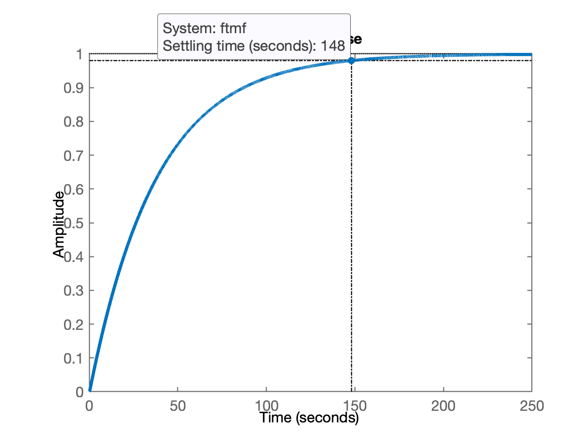
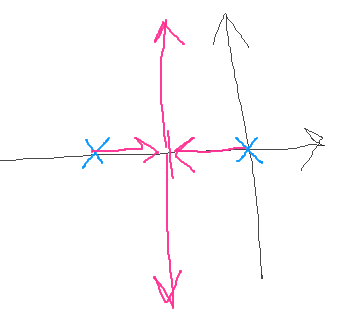
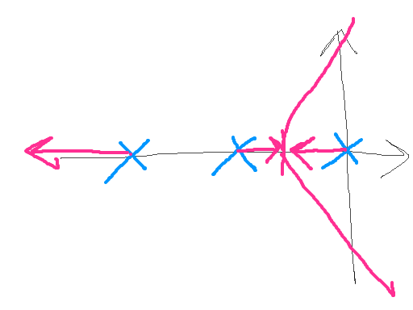
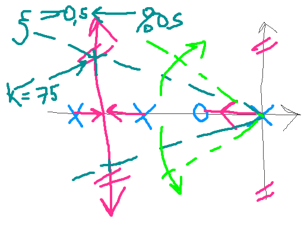

# RL Exemplos

O slide No. 19 de [6_intro_root_locus.pdf](https://fpassold.github.io/Controle_1/6_intro_root_locus.pdf), mostra o resultado gráfico do aumento do ganho $K$ no RL do sistema abaixo e consequente resposta no domínio tempo para uma entrada degrau quando este sistema é colocado para funcionar em malha-fechada com certo valor de ganho:

Planta, $G(s)$:

$G(s)=\dfrac{(s+5)}{s(s+6)(s+7)(s+8)}$

Esta planta quando submetida a um sistema em MF com ganho variável, rende:

$FTMF(s)=\dfrac{K\cdot G(s)}{1+K \cdot G(s)}$

$FTMF(s)=\dfrac{K(s+5)}{s^4+21s^3+146s^2+(K+336)s+5K}$

A eq. Característica, $EC(s)$ fica:

$EC(s)=s^4+21s^3+146s^2+(K+336)s+5K=0$

Podemos ir variando o valor de $K$ e ir verificando como os pólos de MF "caminham" no RL:

```matlab
>> rlocus(G)
>> hold on
>> K=1;
>> EC=[1 21 146 (K+336) 5*K];
>> polosMF=roots(EC)
polosMF =
      -8.1554
      -6.7224
      -6.1073
    -0.014933
>> plot(real(polosMF), imag(polosMF), 'r+', 'LineWidth',2, 'MarkerSize',14)
>> K=10;
>> EC=[1 21 146 (K+336) 5*K];
>> polosMF=roots(EC)
polosMF =
      -8.8346 +          0i
      -6.0055 +    0.77683i
      -6.0055 -    0.77683i
     -0.15434 +          0i
>> plot(real(polosMF), imag(polosMF), 'r+', 'LineWidth',2, 'MarkerSize',14)
>> K=100;
>> EC=[1 21 146 (K+336) 5*K];
>> polosMF=roots(EC)
polosMF =
      -10.868 +          0i
       -4.182 +          0i
      -2.9751 +     1.4663i
      -2.9751 -     1.4663i
>> plot(real(polosMF), imag(polosMF), 'r+', 'LineWidth',2, 'MarkerSize',14)
>> K=1000;
>> EC=[1 21 146 (K+336) 5*K];
>> polosMF=roots(EC)
polosMF =
      -15.851 +          0i
    -0.090226 +     7.9674i
    -0.090226 -     7.9674i
      -4.9684 +          0i     
>> plot(real(polosMF), imag(polosMF), 'r+', 'LineWidth',2, 'MarkerSize',14)
```

Uma "animação" variando o ganho $K$ aparece na figura abaixo:


---

Sobre traçados de RL e seus detalhes, pode-se ainda usar a ferramenta **Root Locus Gui**:

* versão (antiga, de 2019) desenvolvida para o Matlab:
  * https://github.com/echeever/RLocusGUI, ou;
  * https://www.mathworks.com/matlabcentral/fileexchange/71605-rlocusgui
* versão Java (página web interativa):
  * https://lpsa.swarthmore.edu/Root_Locus/RLDraw.html

---

No caso mostrado no exemplo inicial desta página, temos:

$G(s)=\dfrac{(s+5)}{s(s+6)(s+7)(s+8)}$

Um sistema com 1 zero e 4 pólos.

Podemos determinar o ponto de partida das assíntotas do RL como sendo:

$\sigma_a=\dfrac{\sum \text{Polos} - \sum \text{Zeros}}{\text{No. Pólos} - \text{No. Zeros}}$

```matlab
>> sigma_a=((0-6-7-8)-(-5))/(4-1)
sigma_a =
      -5.3333
```

E os ângulos de partida das assíntotas como sendo:

$\theta_a=\dfrac{(2k+1)180^o}{\text{No. Polos}-\text{No. Zeros}}, \quad k=0,\pm 1, \pm 2, \pm 3, \ldots$

```matlab
>> th=((2*0+1)*180)/(4-1)
th =
    60
>> th=((2*1+1)*180)/(4-1)
th =
   180
>> th=((2*2+1)*180)/(4-1)
th =
   300
>> th=((2*3+1)*180)/(4-1)
th =
   420
>> 360-420
ans =
   -60
```

**Pontos de partida** (*break-out*) e pontos de chegada (*break-in*) são determinados à partir de diferenciação da $EC(s)$.

A $EC(s)$ neste caso é:

$EC(s)=K \cdot G(s) \cdot H(s)=\dfrac{K(s+5)}{s(s+6)(s+7)(s+8)}=\dfrac{K(s+5)}{s^4 + 21 s^3 + 146 s^2 + 336 s}$

Note que para todos os pontos do *RL*, $EC(s)=-1$ e ao longo do eixo $x$, $s=\sigma$, então:

$\dfrac{K(\sigma+5)}{\sigma^4 + 21 \sigma^3 + 146 \sigma^2 + 336 \sigma} = -1$

Resolvendo a expressão anterior para $K$, temos:

$K=\dfrac{-(\sigma+5)}{\sigma^4 + 21 \sigma^3 + 146 \sigma^2 + 336 \sigma}$

Diferenciando $K$ em relação à $\sigma$ e fazendo esta derivada ser igual à zero, leva à:

Lembrando da regra da cadeia (derivadas):

$\dfrac{d}{dx}\left( \dfrac{u}{v} \right)=\dfrac{v\,u'-u\,v'}{v^2}$

$\dfrac{dK}{d\sigma}=\dfrac{(\sigma + 5) (4 \sigma^3  + 63 \sigma^2  + 292 \sigma + 336)}{(\sigma^4  + 21 \sigma^3  + 146 \sigma^2  + 336 \sigma)^2 } - \dfrac{1}{ \sigma^4  + 21 \sigma^3  + 146 \sigma^2  + 336 \sigma}$

```matlab
>> % necessário symbolic toolbox instalado...
>> syms sigma
>> K = (-(sigma+5))/(sigma^4+21*sigma^3+146*sigma^2+336*sigma)
K =
-(sigma + 5)/(sigma^4 + 21*sigma^3 + 146*sigma^2 + 336*sigma)
>> dK=diff(K)
dK =
((sigma + 5)*(4*sigma^3 + 63*sigma^2 + 292*sigma + 336))/(sigma^4 + 21*sigma^3 + 146*sigma^2 + 336*sigma)^2 - 1/(sigma^4 + 21*sigma^3 + 146*sigma^2 + 336*sigma)
>> pretty(dK)
                    3           2
(sigma + 5) (4 sigma  + 63 sigma  + 292 sigma + 336)                        1
---------------------------------------------------- - -------------------------------------------
         4           3            2             2           4           3            2
   (sigma  + 21 sigma  + 146 sigma  + 336 sigma)       sigma  + 21 sigma  + 146 sigma  + 336 sigma

```

Ou seja:

$\dfrac{dK}{d\sigma}=\dfrac{(\sigma + 5) (4 \sigma^3  + 63 \sigma^2  + 292 \sigma + 336)}{(\sigma^4  + 21 \sigma^3  + 146 \sigma^2  + 336 \sigma)^2 } - \dfrac{1}{ \sigma^4  + 21 \sigma^3  + 146 \sigma^2  + 336 \sigma}$

Encontrando as raízes para o polnôimio acima, usando o Matlab:

```matlab
>> r=solve(dK)
r =
 root(z^4 + (62*z^3)/3 + (461*z^2)/3 + (1460*z)/3 + 560, z, 1)
 root(z^4 + (62*z^3)/3 + (461*z^2)/3 + (1460*z)/3 + 560, z, 2)
 root(z^4 + (62*z^3)/3 + (461*z^2)/3 + (1460*z)/3 + 560, z, 3)
 root(z^4 + (62*z^3)/3 + (461*z^2)/3 + (1460*z)/3 + 560, z, 4)
>> valores=vpa(r)
valores =
 - 3.3780472678327300285438795155159 - 0.49941127861787328582753134232288i
 - 3.3780472678327300285438795155159 + 0.49941127861787328582753134232288i
                                        -6.3627551233207089905144833359899
                                         -7.547817007680497619064424299645
>> 
```

Ou seja: 

$root(dK)=\text{root}{\left( z^4 + \dfrac{62z^3}{3} + \dfrac{461z^2}{3} + \dfrac{1460z}{3} + 560 \right)}$

Ou:

```matlab
>> dK2=[1 62/3 461/3 1460/3 560];
>> r2=roots(dK2)
r2 =
      -7.5478 +          0i
      -6.3628 +          0i
       -3.378 +    0.49941i
       -3.378 -    0.49941i
>> % plotando estes valores sobre o RL de G(s)
>> figure; rlocus(G)
>> hold on; plot(real(r2), imag(r2), 'mo', 'LineWidth', 2, 'MarkerSize', 14)
>> axis([-9 -2 -4 4])
>> sigma=r2(2)
sigma =
      -6.3628
```


Para este caso, um valor válido seria: $\sigma=-6,36275$.

Então quando $s=-6,3628$, $K=?$

Como:

$EC(s)=s^4+21s^3+146s^2+(K+336)s+5K=0$

Então substituindo no lugar de $s$ o valor de $\sigma=-6,36275$, teremos:

$(-6,3628)^4+21(-6,3628)^3+146(-6,3628)^2+(K+336)(-6,3628)+ 5K=0$ 


```matlab
>> % calculando alguns termos com auxílio do Matlab:
>> EC_aux=[sigma^4 21*(sigma^3) 146*(sigma^2) 336*sigma 0]
EC_aux =
         1639      -5409.5       5910.8      -2137.9            0
```

$1639 -5409,5 +5910,8 -6,3628K -2137,9 + 5K = 0$

isolando $K$ teremos:

```matlab
>> soma_aux = EC_aux(1)+EC_aux(2)+EC_aux(3)+EC_aux(4)
soma_aux =
       2.4081
```

$2,4081 -6,3628K + 5K = 0$

$1,3628 K = 2,4081$

$K=\dfrac{2,4081}{1,3628}=1,7671$

```matlab
>> % Completando os cálculos com ajuda do Matlab:
>> K_aux=soma_aux/(-(sigma+5))
K_aux =
       1.7671
```

Verificando:

```matlab
>> ftmf=feedback(K_aux*G,1);
>> polosMF=pole(ftmf)
polosMF =
       -8.248 +          0i
      -6.3628 + 7.2242e-08i
      -6.3628 - 7.2242e-08i
     -0.02646 +          0i
>> % percebemos um par de pólos complexos no mesmo ponto no eixo x
>> % com parte imaginária praticamente nula
>> % gerando uma figura do RL mostrando este ponto:
>> figure;
>> rlocus(G)
>> hold on;
>> plot(real(polosMF), imag(polosMF), 'm+', 'LineWidth',2, 'MarkerSize',14)
>> axis([-9 0 -4 4])
```

E podemos visualizar o gráfico do RL destacando este ponto em especial:


isto significa que enquanto $K \le 1,7671$, a resposta deste sistema em MF será super-amortecida (sem *overshoot*), uma vez que só teremos pólos de MF com componentes reais.

Com este valor de ganho, $K=1,7671$ vamos obter o menor tempo de assentamento possível para uma resposta super-amortecida:

```Matlab
>> figure; step(ftmf)
```

ou graficamente:



---

**Outros exemplos**

**Ex\_1**:



**Ex\_2**:



**Ex\_3**:



---

Fernando Passold, em 03/05/2024.

