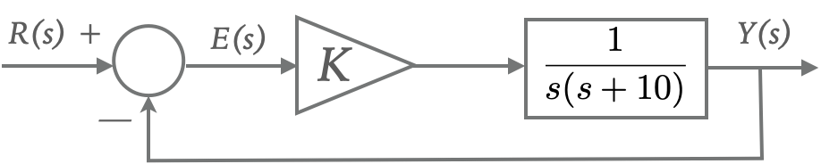
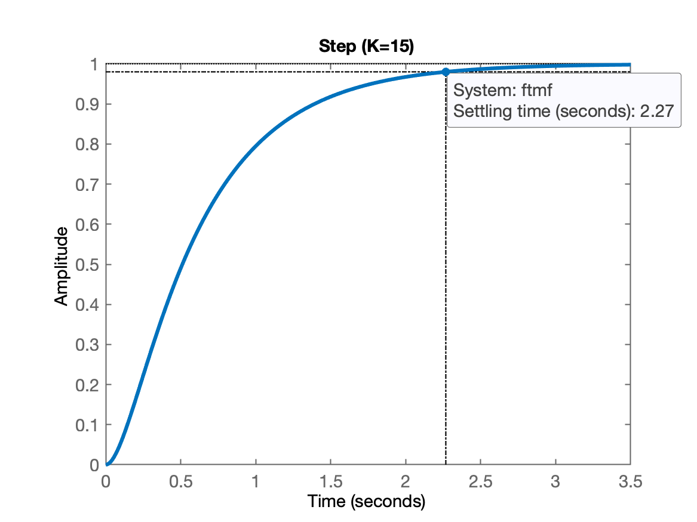
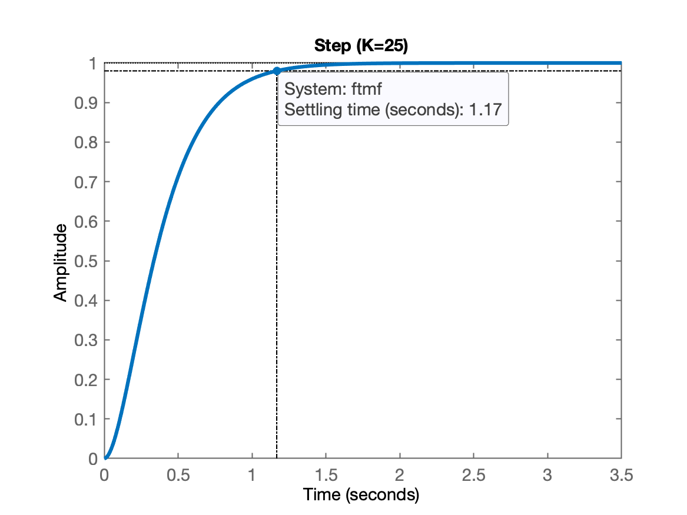
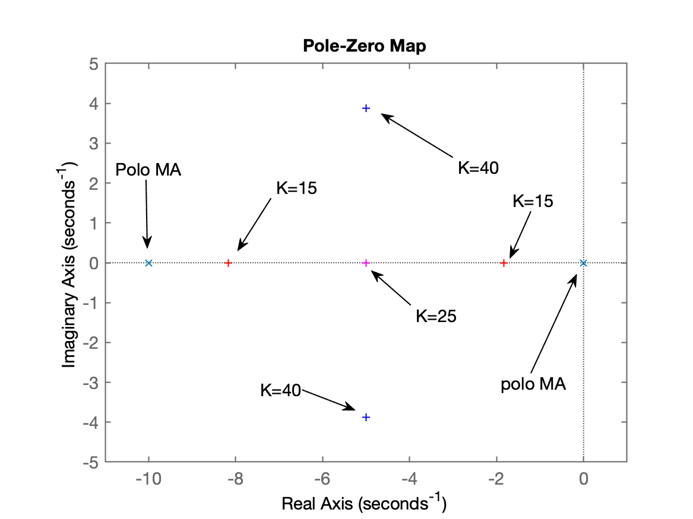
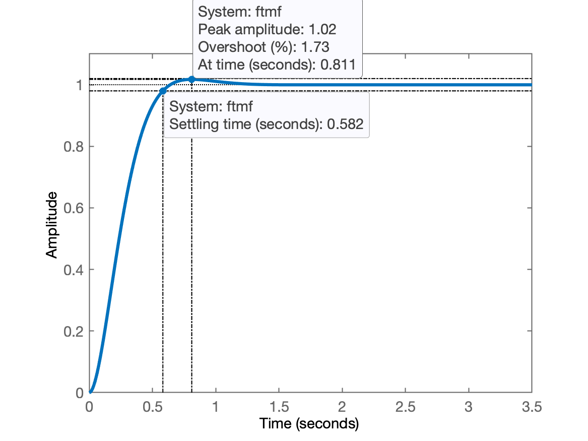
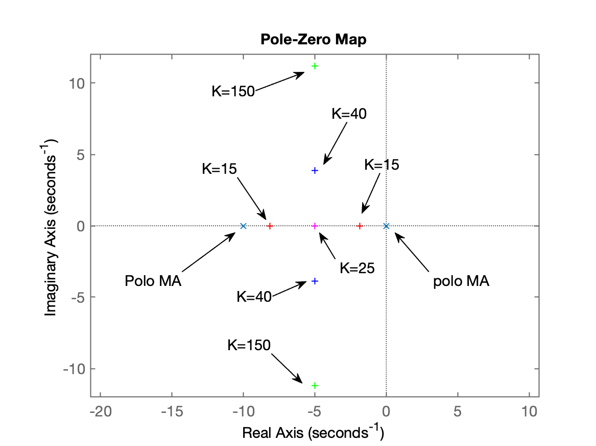
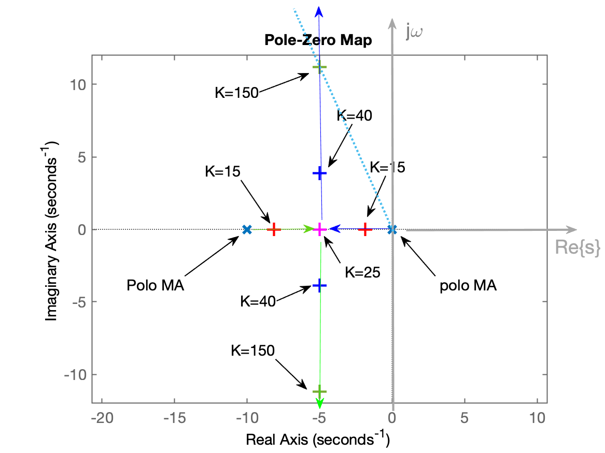
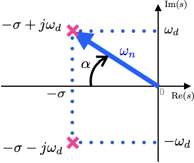

# Entendendo Root Locus & Respostas Temporais

**Objetivo**: A idéia aqui é usar comandos simples do Matlab para entender como o *root locus* é formado e qual a relação entre os pólos de malha-fechada e respostas temporais de um processo em malha-fechada submetido à uma entrada degrau.

> Se sugere fortemente uma eventual revisão do material [Respostas Transitórias de Sistemas Lineares](5_Respostas_Sistemas.pdf).

Neste documento, vamos explorar um *root locus* formado quando se fecha uma realimentação para uma planta como:

$G(s)=\dfrac{1}{s (s+10)}$

ou na forma de um diagrama de blocos:



> Esta é a mesma planta que aparece no slide No. 9 de [Lugar Geométrico das Raízes (ou *root-locus*)](6_intro_root_locus.pdf).

Iniciando o Matlab [:headphones:](https://youtu.be/_RFj-S1sw68?si=nCWH2TfgacSUJt0F):

> :pencil: Assim que você entrar no Matlab recomendo que crie um "log" da seção da trabalho. Para tanto, ative a função: **diary <arquivo.txt>**:

```matlab
>> diary aula_26042024.txt      % recomendo acrescentar extensão .txt
```

Ingressando uma função transferência $G(s)$ no Matlab usando a função **tf (num, den)**, onde *num* e *den* se referem aos polinômios (em *s*) referentes ao numerado e denominador da função transferência:

```matlab
>> % G = tf(num,den)
>>
>> num=1;
>> den=[1 10 0];
>> G = tf(num,den)

G =
 
      1
  ----------
  s^2 + 10 s
 
Continuous-time transfer function.

>> % A expressão acima não permite reconhecer prontamente os
>> % pólos, zeros e o "ganho". Usamos a função: zpk(<tf-object>)
>>zpk(G)
 
     1
  --------
  s (s+10)
 
Continuous-time zero/pole/gain model.
```

A idéia agora é compravar as raízes do denominador, que seriam os pólos do sistema.
Usaremos a função: **roots(<vetor-polinômio>)**.

```matlab
>> roots(den)
ans =
     0
   -10
```

Neste caso, obtermos resposta esperada, uma planta com pólos em $s=0$ e $s=-10$.

Mas poderíamos ter isolado diretamente os pólos à partir de uma transfer-function, usando a função **pole(<tf>)**:

```matlab
>> pole(G)
ans =
     0
   -10
```

Vamos fechar a malha, através de uma simples realimentação unitária.
Usaremos a função: **feedback()**: 

```matlab
>> % ftmf=feedback(K*G, H, -1) 
```

A próxima figura exemplifica à que correspondem os atributos de entrada $G$ e $H$:


Neste caso, $H(s)=1$ (não há funrção transferência associada com um sensor retratando limitações de banda passante do mesmo). A função transferência $H(s)$ seria similar a um filtro passa-baixas, com certa freq. de corte (ou **largura de banda do sensor**). Normalmente, o sensor responde mais rápido que a planta (salvo casos de "retrições orçamentárias"). 

O terceiro parâmetro de entrada da função feedback, confirma o sinal da realimentação, "$-1$" corresponde a uma tradiconal realimentação negativa. Se este terceiro parâmetro não for informado o Matlab subentende que trata-se de realimentação negativa. Se por acaso for "$+1$", corresponderia à uma realimentação positiva (menos usual).

Neste caso, $H(s)=1$, então vamos acabar estabelecendo uma **realimentação unitária**.

Note ainda que apesar de não estarmos indicando explicitamente nenhum ganho nno comando abaixo, fica implícito (matematicamente) que estaríamos fechando a malha, com ganho unitário:

$ K*G(s)$, se $K=1$, implica em: $1 \cdot G(s)=G(s)$

```matlab
>> ftmf=feedback(G, 1)

ftmf =

        1
--------------
  s^2 + 10 s + 1

Continuous-time transfer function.

```

Note que a equação acima corresponde ao que teria ocorrido se tivéssemos fechado a malha de modo analítico (algébrico):

$FTMF(s) = \dfrac{K \, G(s)}{1+K\,G(s)} = \dfrac{ \frac{K}{s(s+10)} }{ 1 + \frac{K}{s(s+10)} } = \dfrac{K}{ s(s+10)+K}$

$FTMF(s)=\dfrac{K}{s^2+10s+K}$

Se $K=1$, teremos:

$FTMF(s)=\dfrac{1}{s^2+10s+1}$

Comprovando o local dos pólos de MF, mesmo para K=1 (ganho unitário):

```matlab
>> pole(ftmf)
ans =
       -9.899
     -0.10102
```

Podemos comprovar que um *root-locus* inicia à partir dos pólos de MA do sistema adotando explicitamente um ganho muito baixo (no caso, $K = 0,01$):

```matlab
>> ftmf=feedback(0.01*G, 1);
pole(ftmf)
ans =
       -9.999
   -0.0010001
```

Note que estes pólos de MF para um valor tão baixo de ganho, praticamente coincidem com a posição dos pólos de MA do sistema repassado para o *root-locus*.

Vamos aumentar o ganho gradualmente para perceber como os pólos de MF  "caminham" no plano$-s$:

```matlab
>> ftmf=feedback(5*G, 1);   % Fechando malha com ganho, K=5
>> pole(ftmf)
ans =
      -9.4721
     -0.52786
```

Podemos verificar a nova posição assumida para os pólos de MF se aumentamos mais o ganho:

```matlab
>> ftmf=feedback(15*G, 1);
>> pole(ftmf)
ans =
      -8.1623
      -1.8377
```

Aumentando um pouco mais o ganho:

```matlab
>> ftmf=feedback(25*G, 1);
>> pole(ftmf)
ans =
    -5
    -5
```

Note os pólos "caminhando", um em direção ao outro (para este caso de sistema).

Mas... Seria mais interessante "graficar" a trajetória dos pólos de MF. Então vamos "plotar" os pólos de MF no plano-z.

Voltando aos pólos de MF, com $K=15$:

```matlab
>> ftmf=feedback(15*G, 1);
>> pzmap(G)     		% mostra no plano-s os pólos e zeros da transfer-function
>> hold on      		% "segura as pontas", isto é, os próximos comandos gráficos serão
>>              		% sobrepostos no gráfico anterior
>> pzmap(pole(ftmf))    % a idéia é plotar os pólos de MF
Error using pzmap
Wrong number of input arguments.
>>
>> % Ok, houve um erro. Simplesmente nos esquecemos que pzmap() não aceita como
>> % argumento de entrada, variável que não seja transfer-function
>> % Então vamos usar a função: plot(x,y)
>> % E para isto, necessitamos primeiramente "guardar" as posições destes pólos de MF:
>> polesMF = pole(ftmf)
polesMF =
      -8.1623
      -1.8377
>> % Ok, Não podemos fazer: plot(polesMF) porque o Matlab vai interpretar que cada
>> % um dos pólos de MF calculado anteriormente será transformado numa "altura",
>> % coordenada no eixo Y (a coordenada no eixo X corresponderá à ordem do polo: 1 ou 2)
>> % E então nos lembramos que o plano-s é um plano cartesiano complexo, onde o 
>> % eixo X corresponde à parte real de pólos ou zeros, e o eixo Y corresponde à
>> % para imaginária dos pólos ou zeros.
>> % Felizmente o Matlab consegue "separar" as partes reais e imaginárias de um
>> % número complexo:
>> real(polesMF)
ans =
      -8.1623
      -1.8377
>> imag(polesMF)
ans =
     0
     0
>> % Então agora basta plotar (acrescentar no gráfico anterior), os novos pólos de MF:
>> plot( real(polesMF), imag(polesMF), 'r+')
>> % O terceiro parâmetro "r+" significa cor red (vermelho) com marcador "+"
```

Até este ponto, teremos um gráfico dos plano-s para este sistema, parecido com:


Mas nós não estamos interessados em apenas em plotar o root-locus.

Queremos entender a relação dos pólos de MF com a resposta temporal de um sistema quando o submetemos à uma malha fechada e o submetemos à uma entrada (referência), do tipo degrau.

Na prática, queremos fazer:

$FTMA(s)=K \cdot G(s)$

$FTMF(s)=\dfrac{K \cdot G(s)}{1 + K \cdot G(s) \cdot H(s)}$

No nosso caso, $H(s)=1$ (também dito "realimentação unitária"), e então a malha-fechada se simplifica para:

$FTMF(s)=\dfrac{K \cdot G(s)}{1+ K \cdot G(s)} = \dfrac{FTMA(s)}{1+FTMA(s)}$

Se queremos ter idéia de resposta temporal de um sistema de MF quando submetido à entrada degrau, então ncessitamos realizar algo como:

$Y(s) = \underbrace{R(s)}_{\text{Degrau}} \cdot FTMF(s)$

Mas não queremos $Y(s)$ e sim $y(t)$, então necessitamos realiar a transformada inversa de Laplace sobre o $Y(s)$ calculando anteriormente, ou em outras palavaras:
$$
\begin{array}{rcl}
Y(s) &=& R(s) \cdot FTMF(s)\\
\downarrow & & \\
y(t) &=& \mathcal{L}^{-1}\{ Y(s) \}
\end{array}
$$

O cálculo anterior pressupõe analiticamente o uso de expansão em frações parciais. Mas, para nossa "sorte", o Matlab facilita numericamente os cálculos anteriores, gerando diretamente o gráfico de $y(t)$, uma vez repassada a $FTMF(s)$ à sua função `step(<FTMS>)`:

```matlab
>> figure;      % força abertura de nova janela gráfica (para preservar o pzmap anterior)
>> step(ftmf)
```

E você deve ter obtido algo como gráfico:



Ou reunindo informações:

| RL | Step |
| :---: | :---: |
|  |  |

Podemos complementar melhor nosso entendimento sobre o *root-locus* e sua relação com a resposta temporal de um sistema, variando o ganho, calculando as posições assumidas pelos pólos de MF para cada novo valor de ganho, e, para cada valor de ganho, usar a função `step()` para entender o papel dos pólos de MF na resposta temporal do sistema em MF depois que o mesmo é fechado com certo valor de ganho.

```matlab
>> ftmf=feedback(25*G, 1);      % Este valor de ganho gera pólos duplos (e ainda reais)
>> polesMF=pole(ftmf)
polesMF =
    -5
    -5
>> figure(1)    % voltando o "foco" do Matlab para primeira janela, a do "pzmap"
>> plot(real(polesMF),imag(polesMF),'m+')   % plotando local destes pólos de MF
>> figure;      % nova janela para resposta temporal correspondente à estes pólos
>> step(ftmf)   % plota a resposta temporal
>> title('Step (K=25)')     % Acrescentando título à esta janela gráfica
```

Até este ponto, se tudo deu certo, você deve ter obtido algo como:

| RL | Step |
| :---: | :---: |
|  |  |

Completando a idéia para outros valores mais de ganho. **E..** (não menos importante), comprovando que pólos de MF reais geram respostas super-amortecidas (sem sobressinal) e pólos de MF complexos (isto é, com parte imaginária diferente de zero), geram respostas suub-amortecidas, com certo fator de amortecimento $\zeta$ ($0 < \zeta <1$) e frequência de oscilação, $\omega_n$. Lembre que a amplitude do sobre-sinal (ou *overshoot*, $\%OS$) está diretamente associado com o valor de $\zeta$.

```matlab
>> % Aumentando o ganho para obter pólos de MF complexos
>> ftmf=feedback(40*G, 1);
>> polesMF=pole(ftmf)
polesMF =
           -5 +      3.873i
           -5 -      3.873i
>> % Como esperado, finamente obtemos pólos de MF com partes imaginárias diferentes de 0
>> figure(1);   % "desenhando" estes novos pólos de MF do plano-s da primeira figura
>> hold on
>> plot(real(polesMF),imag(polesMF),'b+')
>>
>> % Neste ponto, provavelmente você poderá afirmar que o último comando não gerou
>> % nenhum resultado visível. Mas repare que no primeiro "pzmap", o eixo Y variou
>> % apenas entre [-1, +1] e agora a parte imaginária dos pólos de MF alançaram os
>> % valores [-3.873, +3.7873]. Necessitamos forçar o Matlab a aumentar o "range"
>> % vertical do gráfico do "pzmap". Vamos usar a função: axis() para isto:
>> % axis([xmin xman ymin ymax])
>> axis([-11 1 -5 5])
```

Continuando... Falta comprovar a resposta temporal para nossos primeiros pólos de MF com parte imaginária diferente de zero:

```matlab
>> figure; step(ftmf)
>> title('Step (K=40)')
```

Até este ponto você deve ter algo como:

| RL | Step |
| :---: | :---: |
|  |  |

Percebemos que a resposta começou a ficar sub-amortecida, com %OS bem baixo ainda.

Continuando o processo para valores ainda maiores de ganho:

```matlab
>> ftmf=feedback(150*G, 1);
>> polesMF=pole(ftmf)
polesMF =
           -5 +      11.18i
           -5 -      11.18i
>> figure(1)
>> plot(real(polesMF),imag(polesMF),'g+')
>> axis([-11 1 -12 12])     % Ajustando range novamente no gráfico do pzmap
>> axis equal               % para escala no eixo X = eixo Y
>> % Completando com resposta temporal
>> figure;step(ftmf)
>> title('Step (K=150)')
```

Agora, você deve ter obtido algo como:

| RL | Step |
| :---: | :---: |
|  |  |

**Em resumo**, o RL deve ter ficado algo como:



**Fim**... :clock1130: ​para esta aula  

Sugere-se tornar hábito que ao final de cada seção de trabalho, você faça ainda:

```matlab
>> save aula_26042024      % gera arquivo aula_26042024.mar (dados)
>> diary off               % encerra arquivo de registro iniciado no início deste doc
>> quit
```

:floppy_disk: Arquivos gerados disponíveis: [aula_26042024.txt](aula_26042024.txt), [aula_26042024.mat](aula_26042024.mt) e [aula_26042024.md](aula_26042024.md) (já convertido para UTF8).


**Sugestões para próxima aula**:

Na próxima aula, vamos tentar continuar à partir deste ponto e comprovar mais detalhes sobre respostas temporais de sistemas de 2a-ordem com raízes complexas (ver [Respostas Transitórias de Sistemas Lineares](5_Respostas_Sistemas.pdf)):

$FTMF(s)=\dfrac{b}{s^2+as+b}=\dfrac{K}{(s+p_1)(s+p_2)}=\dfrac{\omega_n^2}{s^2+2\zeta \omega_n + \omega_n^2}$

ou seja, fizemos:


Caso o sistema possua pólos complexos ($0 < \zeta <1$) $\rightarrow$, a resposta sub-amortecida para entrada degrau fica:

Pólos de MF: $p_{1,2}=\sigma \pm j \omega_d$

ou graficamente:



parte real: $\sigma = \omega_n \cos(\alpha) = \omega_n \zeta$
parte imaginária: $\omega_d=\omega_n \sin(\alpha)=\omega_n \sqrt{1-\zeta^2}$

$\alpha=\tan^{-1}\left( \dfrac{\omega_d}{\sigma} \right)$

Fator amortecimento: $\zeta=\cos(\alpha) = \dfrac{|\sigma|}{\omega_n} = \dfrac{a/2}{\omega_n}$
$\sin(\alpha) = \sqrt{1-\zeta^2}$

A resposta em MF para este sistema fica:

$Y(s)=R(s) \cdot FTMF(s)=\dfrac{K}{s(s+p_1)(s+p_2)}=K \left[ \dfrac{\omega_n^2}{s(s^2+2\zeta \omega_n^2+\omega_n^2)} \right]$

$Y(s) = \dfrac{K_1}{s} + \dfrac{K_2 s+K_3}{s^2+2\zeta \omega_n^2+\omega_n^2}$

A transformada inversa de Laplace para $Y(s)$ fica:

$y(t)=1-A \text{e}^{-\zeta \sigma t} \cos(\omega_d t - \phi)$

onde:
$A=\dfrac{1}{\sqrt{1-\zeta^2}}$
$\phi=\tan{-1}\left( \zeta \big/ \sqrt{1-\zeta^2} \right)$

Podemos prever o valor do sobresinal, ou *overshoot*:

$\%OS=\exp\left( \dfrac{-\zeta \pi}{\sqrt{1-\zeta^2}} \right) \times 100\%$


Podemos calcular o $\alpha$ para o caso do último ganho adotado e comprovar o $\zeta$ obtido e correspondente $\%OS$ usando as equações anteriores...

Ou resumidamente:


:balloon::balloon::balloon::wave:


---

Fernando Passold, em 26/04/2024

```

```