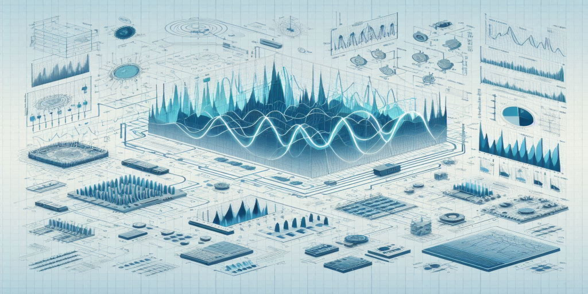
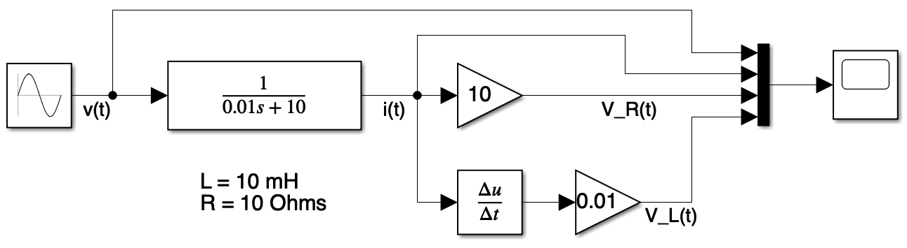
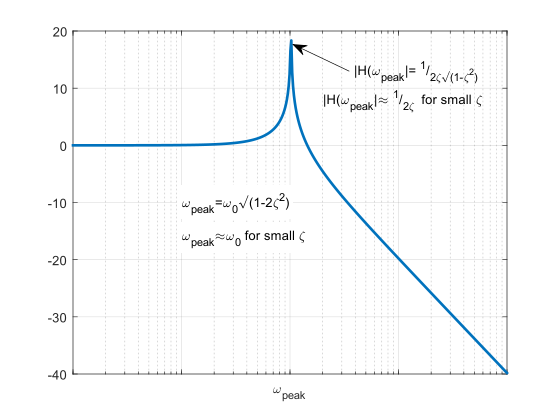
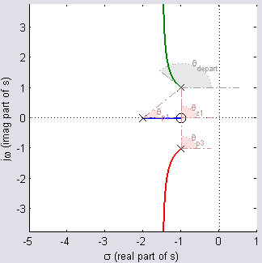
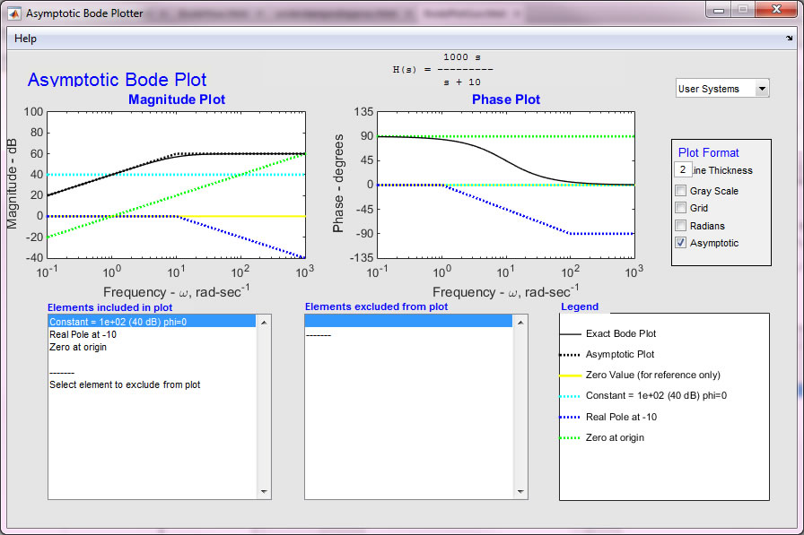
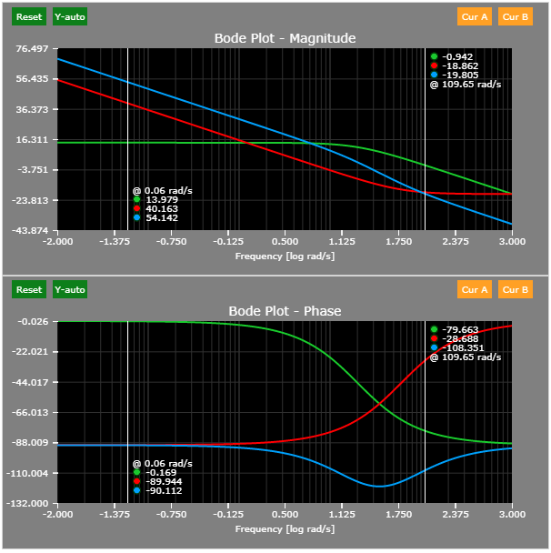
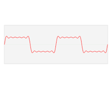

**Gerado com IA**, Copilot | Designer [*](https://copilot.microsoft.com/images/create/grc3a1ficos-e-diagramas-de-anc3a1lise-de-sinais-e-sistem/1-666bc82660234f5dabb6ad23ec0e7236?id=tZBUcPruq9EvIffTmjcjEg%3d%3d&view=detailv2&idpp=genimg&idpclose=1&thId=OIG4.mjxEuoUKNuQh0HPTjY8y&FORM=SYDBIC) 

# Controle 1

("Análise de Sinais e de Sistemas, Modelagem de Sistemas")

## Conteúdo Previsto

1. Introdução.
   1. [Parte 1](intro_controle_1.pdf): História da área de controle automático e automação industrial.
   2. [Parte 2](Intro2.pdf): Conceitos iniciais: modelagem "DC" (regime permanente) x "AC" (transitórios), malha-aberta x malha-fechada.
   
2. Modelagem Matemática de Sistemas (ainda sem usar Laplace)
   1. [Parte 1](2_modelagem_matematica.pdf): Intro (funções transferência, caixas de redução, sitemas lineares x não-lineares, resposta de sensor, sistema estável x instável, malha-aberta x malha-fechada, dinâmica de um sistema), Sistemas mecânicos (elementos básicos), equações associadas com forças (movimentos translacionais), equações associadas com torques (forças rotacionais), alguns sistemas mecânicos translacionais (equacionamento), sistemas mecânicos rotacionais (equacionamentos), momento de inércia, modelagem de alguns sistemas mecânicos, modelagem considerando Energia/Potência (elementos mecânicos que armazenam/dissipam energia).
   2. [Parte 2](2_modelagem_matematica_2.pdf): Equacionamentos considerando Energia/Potência, Comparando sistemas elétricos x mecânicos, modelagem de sistemas elétricos, modelagem sistema térmico. 
   
3. [Transformada de Laplace](3_transformada_laplace.pdf) (voltado para modelagem de sistemas).

   1. Expansão em frações parciais --> [The Inverse Laplace Transform by Partial Fraction Expansion](https://lpsa.swarthmore.edu/LaplaceXform/InvLaplace/InvLaplaceXformPFE.html) (+ soluções [usando Matlab](https://lpsa.swarthmore.edu/LaplaceXform/InvLaplace/PFE1Matlab/html/PFE1.html)).

4. Modelagem usando Transformada de Laplace

   1. [Modelagem usando Transformada de Laplace](4_modelagem_laplace.pdf):

      1. Arquivos associados com modelagem de circuito RL ( [circuito_RL.slx](circuito_RL.slx) ) (tensão de entrada x corrente x ddp\_resistor x ddp\_indutor):

         | Modelo                          | Scope (resultado)                           |
         | ------------------------------- | ------------------------------------------- |
         |  |  |

         

      2. Arquivos associados com modelagem motor CC usando Matlab/Simulink (tensão de entrada x velocidade);
         ( [motor_DC_Vel.slx](motor_DC_Vel.slx)  +  [init_motor_velocidade.m](init_motor_velocidade.m) + [motor_DC_Vel_teste_degrau.slx](motor_DC_Vel_teste_degrau.slx) )

      3. Arquivos associados com modelagem motor CC (tensão de entrada x posição angular).
         ( +  [init_motor_posicao.m](init_motor_posicao.m) )

   2. :smiley: ​[**Usando MATLAB**](Usando_Matlab_2.pdf)  (Introdução; para iniciantes, 11 páginas)

   3. [Modelagem usando Matlab/Simulink](4_modelagem_simulink.pdf) 

   4. Exemplos usando Matlab/Simulink: [System Modeling (Michigan/Carnegie Melon/Detroit Mercy)](https://ctms.engin.umich.edu/CTMS/index.php?example=Introduction&section=SystemModeling).

   5. Modelagem de circuitos baseados em Amplificadores Operacionais:
      1. Material do Prof. Dr. Victor da Fonte Dias, Professor Auxiliar no Instituto Superior Técnico (IST), Lisboa, de 1999: disciplina de **Circuitos e Sistemas Electrónicos** ([Índice](https://www.ufrgs.br/eng04030/Aulas/teoria/cap_00/indice.htm)) --> [Cap 15: Circuitos cm AmpOps](https://www.ufrgs.br/eng04030/Aulas/teoria/cap_15/circampo.htm#:~:text=Em)):
      2. [Exemplo 1](Funcao_transferancia_amp_op-1.pdf): circuito RC com 1 pólo + 1 zero (material da StackExchange: Electrical Engineering).
      3. [Exemplo 2](Funcao_transferancia_amp_op-2.pdf): circuito com cascateamento de Amp. Op.´s + A.I. (material da StackExchange: Electrical Engineering). 
      4. [Exemplo 3](Funcao_transferancia_amp_op-3.pdf): Levantando função transferência resolvendo sistema de equações usando Matlab (material da StackExchange: Electrical Engineering).

5. [Respostas Transitórias de Sistemas Lineares](5_Respostas_Sistemas.pdf)

   1. Exemplo de [modelagem de sistema térmico](Levantando_Modelo_Planta Termica.pdf).

   2. Trabalho: Modelagem de um Sistema de Automação Industrial

   3. [Second Order Systems, Interactive](https://lpsa.swarthmore.edu/SecondOrder/SOI.html) (Swarthmore College, Dept. of Eng., acessado em 13/06/2024).

      

6. [Lugar Geométrico das Raízes](6_intro_root_locus.pdf) (ou *root-locus*)

   1. 📈 [Simulações usando Matlab](aula_26042024.html) para enteder **relação *Root-Locus* $\times$ Resposta temporal** de um sistema (aula de 26/04/2024)

   2. :hushed: [Mais exemplos](RL_exemplos.html) de traçados de *Root-Loucs* e cálculos dos ângulos de partida das assíntotas, ponto de partida da assíntota, pontos de partida e de chegada num *Root-Loucs* (aula de 03/05/2024).

   3. [Derivation of Root Locus Rules](https://lpsa.swarthmore.edu/Root_Locus/DeriveRootLocusRules.html#RuleImag) (Swarthmore College, Dept. of Eng., acessado em 13/06/2024).

      

   4. [Drawing the root locus](https://lpsa.swarthmore.edu/Root_Locus/RLDraw.html) (Swarthmore College, Dept. of Eng., acessado em 13/06/2024).

7. [Diagramas de Bode](Diagramas_Bode_1.pdf);

   1. [Exemplo de uso com Matlab](testes_bode_1.html);

   2. [BodePlotGui](https://lpsa.swarthmore.edu/Bode/BodePlotGui.html): A Tool for Generating Asymptotic Bode Diagrams.

      

   3. Exemplo de uso/aplicação de Diagrama de Bode (ver trecho do video: [0:00 - 13:00] minutos):
      [How to design and implement a digital low-pass filter on an Arduino](https://www.youtube.com/watch?v=HJ-C4Incgpw), 20/06/2021, de [Curio Res](https://www.youtube.com/@curiores111) - material em inglês, mas ótimas animações enfatizando uso, papel da magnitude e do atraso num filtro passa-baixas (usado como exemplo) (Acessado em 20/05/2024).

   4. [Bode Plot Engine](https://controlsystemsacademy.com/bode_x.html) (MIT) (acessível em 13/06/2024).

      

8. [Série de Fourier](https://fpassold.github.io/Sinais_Sistemas/4_fourier/4_serie_fourier.html).

   1. Demo (com simulações) do MIT: [FOURIER SERIES DEMO](https://controlsystemsacademy.com/0018/0018.html) (acessado em 13/06/2024).
   
   2. [Sumário de Identidades Trigonométricas](http://www2.clarku.edu/~djoyce/trig/identities.html) (Clark University) (acessado em 13/06/2024).
   
   3. Wikipédia: [Série de Fourier](https://en.wikipedia.org/wiki/Fourier_series):
   
      

## Avaliações:

* [Trabalho 1](trabalho_1.pdf): Transformada de Laplace, gráficos de funções (respostas temporais), uso de Transformada de Laplace. <!-- (trabalho_1_controle_1.pdf)--> Deadline: ==19/04/2024==
* **Trabalho 2**: Diagramas de Bode, Resposta de Filtros, Série de Fourier (onda Quadrada), Simulando filtro passa-baixas aplicado sobre onda quadrada → [~~versão de 2022/2~~](trabalho_2.pdf), [==versão de 2024/1==](trabalho_2_2024_1.pdf). 

Outros:

* :ledger: ​Uso de **Diary()** no Matlab e edição de arquivos **Markdown**, ver [aqui](https://fpassold.github.io/Controle_2/sugestao_uso_matlab_em_controle.html).

----

🌊 [Fernando Passold](https://fpassold.github.io/)[ 📬 ](mailto:fpassold@gmail.com), 

