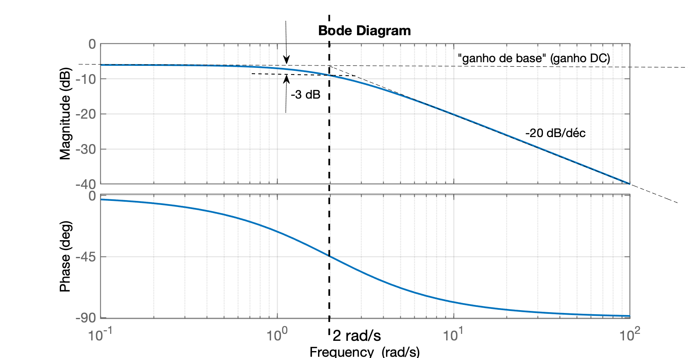
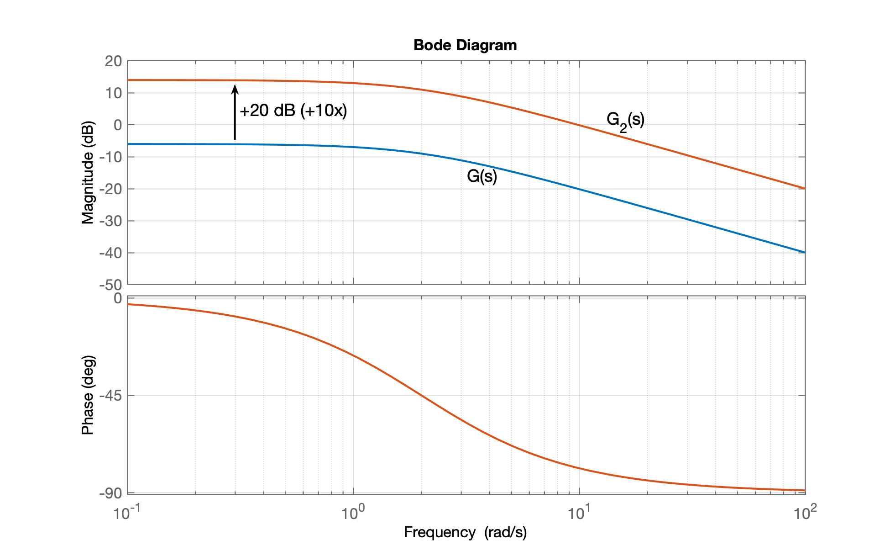
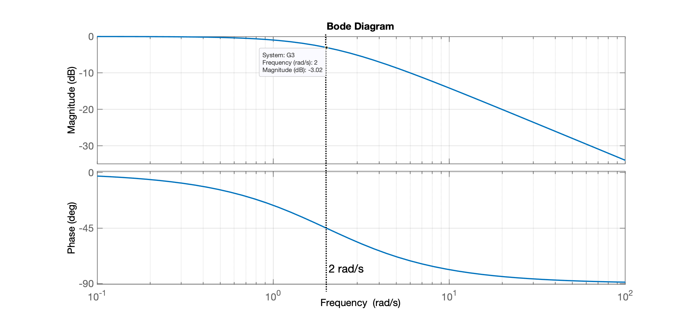
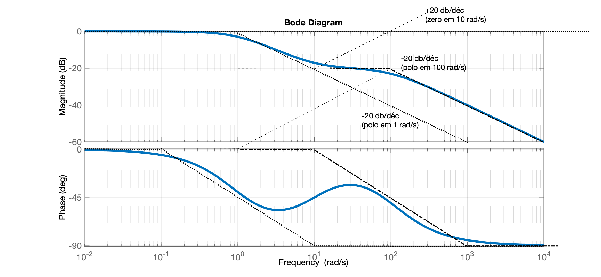

<!-- title: Diagramas de Bode -->
<!--
Warning: the font "Times" is not available, so "Lucida Bright" has been substituted, but may have unexpected appearance or behavor. Re-enable the "Times" font to remove this warning.
Warning: the font "Times" is not available, so "Lucida Bright" has been substituted, but may have unexpected appearance or behavor. Re-enable the "Times" font to remove this warning.
-->

# Aula Lab Controle I

> Aula do dia 01/06/2023

## Diagramas de Bode

Usando Matlab: 

Repare em alguns detalhes:

```Matlab
>> log2(8)  % log na base 2
ans =
     3
>> ln(10)   % log na base natural (neperiana)
Unrecognized function or variable
'ln'. 
>> log(10)  % log na base natural (neperiana)
ans =
       2.3026
```

Alguns logarítmos típicos:

```Matlab
>> log10(1)
ans =
     0
>> log10(10)
ans =
     1
```

Entendendo diagrama de Bode para a função:

$G(s)=\dfrac{1}{s+2}$

```Matlab
>> -20*log10(sqrt(0.2^2+2^2))   % retrocedendo uma década pólo em 2 rad/s
ans =
      -6.0638
>> -20*log10(sqrt(2^2+2^2))     % calculando ganho na posição do polo em 2 rad/s
ans =
      -9.0309
>> % Verificando com função Bode do Matlab...
>> num=1;
>> den=[1 2];
>> G=tf(num,den)

G =
 
    1
  -----
  s + 2
 
Continuous-time transfer function.

>> bode(G)
```



E se o numerador da função fosse maior (seu "ganho")? Algo como:

$G(s)=\dfrac{10}{s+2}$

```Matlab
>> 20*log10(10)     % Calculando quanto "subiria" gráfico de magnitude...
ans =
    20
>> -20*log10(sqrt(0.2^2+2^2))   % calculando ganho inicial (valor de base) original
ans =
      -6.0638
>> 10*log10(10)-20*log10(sqrt(0.2^2+2^2))   % calculando ganho do novo valor inicial (de base)
ans =
       3.9362
>> % Note a "subida" de 20db ou aumento em 10x na amplitude
```

Plotando os 2 diagramas de Bode no mesmo gráfico:

```Matlab
>> zpk(G)

ans =
 
    1
  -----
  (s+2)
 
Continuous-time zero/pole/gain model.

>> G2=tf(10,[1 2])

G2 =
 
   10
  -----
  s + 2
 
Continuous-time transfer function.

>> figure; bode(G, G2)
```



Note:

```Matlab
>> 20*log10(10)-20*log10(sqrt(0.2^2+2^2))   % calculando linha de base (ganho inicial) de G2(s)
ans =
       13.936
>> G3=tf(2,[1 2])   % testando para verificar se linha de base (ganho inicial) = 0 dB (1x)

G3 =
 
    2
  -----
  s + 2
 
Continuous-time transfer function.

>> figure; bode(G3)
```



> Note: **teorema do valor inicial** associado com transformadas de Laplace:
>
> Quando de aplica um degrau na entrada do sistema $Y(s)$:
>
> $y(t)\vert_{t=0} = \lim_{s \to 0} \Big( s \cdot Degrau(s) \cdot Y(s) \Big)$
>
> $y(0) = \lim_{s \to 0} \Big( \cancel{s} \cdot \dfrac{1}{\cancel{s}} \cdot Y(s) \Big)$
>
> $y(0) = \lim_{s \to 0} \Big( Y(s) \Big)$
>
> Aplicado na função transferência anterior, gera:
>
> $y(0) = \lim_{s \to 0} \left( \dfrac{2}{s+2} \right)$
>
> $y(0) = \dfrac{2}{0+2}$
>
> $y(0) = 1$
>
> **Obs**.: Este valor inicial é conhecido também como "**ganho DC**"

Testando outra função

```Matlab
>> G4=tf(1,[1 10])

G4 =
 
    1
  ------
  s + 10
 
Continuous-time transfer function.

>> 1/10     % ganho DC de G4(s)
ans =
          0.1
>> 20*log10(1)-20*log10(sqrt(1^2+10^2))     % comprovando valor inicial do ganho
ans =
      -20.043
```

## Assíntodas em diagramas de Bode

Testando para:

$G_5(s)=\dfrac{10 (s+10)}{(s+1)(s+100)}$

```Matlab
>> G5=tf(10*[1 10],poly([-1 -100]));    % ingressando transfer function
>> figure; bode(G5)
>> grid
```



Fim

---

<script language="JavaScript">
<!-- Hide JavaScript...
var LastUpdated = document.lastModified;
document.writeln ("Fernando Passold, em " + LastUpdated); // End Hiding -->
</script>