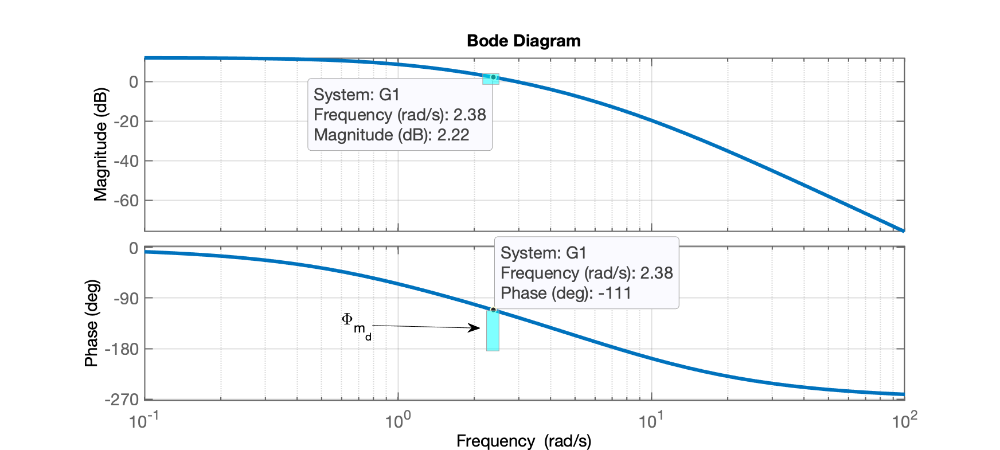
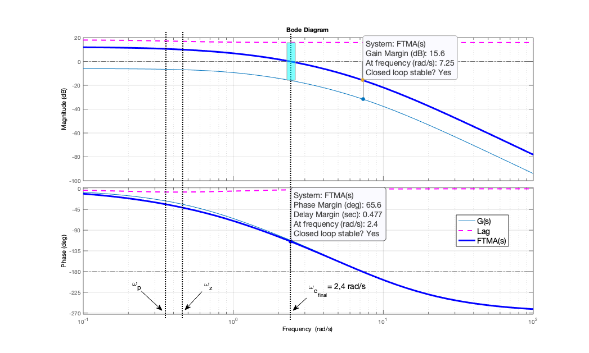
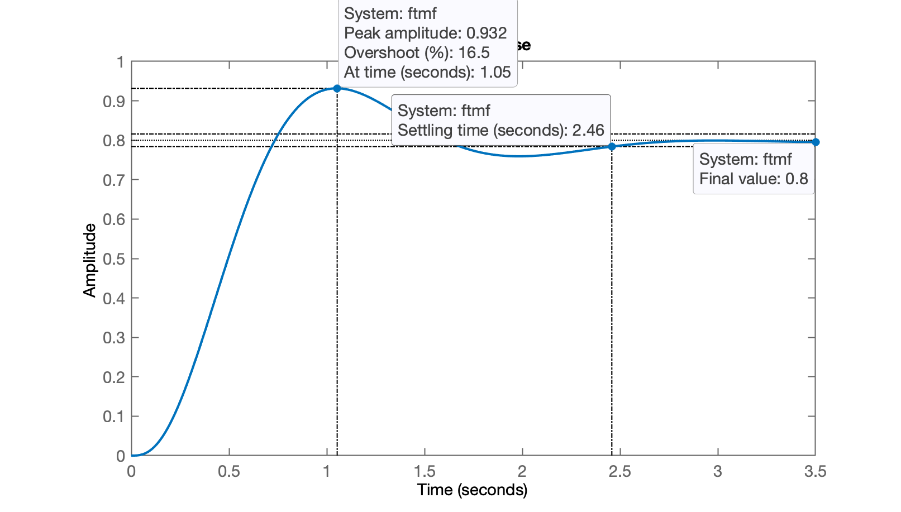
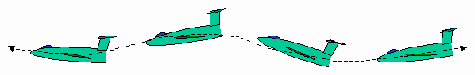

# Projeto no Domínio Frequência

> Aula ministrada em 11/11/2024.

[toc]


## Projeto de Controlador por Atraso de Fase ("*Lag*")

Requisitos de controle para plata adotada como "estudo de caso":

$G(s)=\dfrac{20}{(s+10)(s+4)(s+1)}$

* $e(\infty) \le$ 20%;
* $\%OS \le$ 10%;

**Procedimento**

1. Necessito calcular $\Phi_{m_d}$ em função do $\%OS$ desejado:

```matlab
>> OS
OS =
    10
>> zeta=(-log(OS./100))./(sqrt(pi^2+(log(OS./100).^2)))
zeta =
      0.59116
>> Pm_d=atan2(2*zeta, sqrt(-2*zeta^2 + sqrt( 1+4*zeta^4) ) )
Pm_d =
       1.0226
>> % Valor acima, em radianos
>> Pm_d=Pm_d*180/pi % convertendo de rad para deg
Pm_d =
       58.593
```

2. Determinar o ganho $K$ em função do erro desejado.

Planta: sistema tipo 0, então existe erro ao degrau não nulo. Necessário calcular constante do erro estático de posição (ver [Teoria do Erro](https://fpassold.github.io/Controle_2/3_erros/erros.pdf)), ou $K_p$:

$K_p=\displaystyle\lim_{s \to 0} K \cdot FTMA(s)=K \cdot \displaystyle\lim_{s \to 0}  FTMA(s) \qquad$ (eq. 1)

$e_{Step}(\infty)=\dfrac{1}{1+K_p}$

então: $K=\dfrac{1-e(\infty)}{e(\infty)}$.

```matlab
>> Kp=(1-0.2)/0.2
Kp =
     4
```

Calculando o termo $\displaystyle\lim_{s \to 0} FTMA(s)$:

$\displaystyle\lim_{s \to 0} FTMA(s) = \displaystyle\lim_{s \to 0} G(s)$

$\displaystyle\lim_{s \to 0} FTMA(s) = \displaystyle\lim_{s \to 0} \dfrac{20}{(s+10)(s+4)(s+1)}$

$\displaystyle\lim_{s \to 0} FTMA(s) = \dfrac{20}{(10)(4)(1)} = \dfrac{20}{40} = \dfrac{1}{2}=0,5$

ou usando Matlab:

```matlab
>> limite=dcgain(G)
limite =
          0.5
```

Finalmente isolando $K$ à partir de eq. (1) temos:

$K = \dfrac{K_p}{\displaystyle\lim_{s \to 0} FTMA(s)}$

usando Matlab:

```matlab
>> K=Kp/limite
K =
     8
```

Considerando este ganho teremos: $G_1(s)=K\cdot G$:

```matlab
>> G1=K*G;
>> zpk(G1)

ans =
 
         160
  ------------------
  (s+10) (s+4) (s+1)
 
Continuous-time zero/pole/gain model.

>> 20*log10(K)
ans =
       18.062
>> % Implica aumentar o ganho em 18,062 dB
```

Traçando o diagrama de Bode de $G_1(s)$ e lembrando que necessitamos $P_{m}=P_{m_d}+10^o$, para encontrar a frequência de cruzamento de ganho, $\omega_c$, onde deverá ocorrer a margem de fase desejada, $\Phi_m$:

```matlab
>> Pm=Pm_d+10
Pm =
       68.593
>> 180-Pm
ans =
       111.41
>> bode(G1)
```

Obtemos o seguinte diagrama de Bode:



Verificando o diagrama de Bode, encontramos $\omega_c=$ 2,38 rad/s. Nesta frequência temos $|G(j\omega)|_{dB}=$ 2,22 dB -- dado necessário para definir o fator $\beta$ (relação/distãncia entre o zero e o pólo do controlador):

$w_z = \dfrac{\omega_z}{\beta}$

```matlab
>> beta = 10^(2.22/20)
beta =
       1.2912
>>
>> w_c=2.38; % freq. de cruzamento de ganho
>> % w_z deve ficar abaixo de w_c (não necessariamente 1 década)
>> w_z = w_c/5
w_z =
        0.476
>> w_p = w_z/beta
w_p =
      0.36864
```

Definindo equação do controlador:

```matlab
>> Kc=K/beta
Kc =
       6.1957
>> C_Lag=tf(Kc*[1 w_z], [1 w_p]);
>> zpk(C_Lag)

ans =
 
  6.1957 (s+0.476)
  ----------------
     (s+0.3686)
 
Continuous-time zero/pole/gain model.
```

Verificando como ficou o Diagrama de Bode final, com o controlador:

```matlab
>> ftma=G*C_Lag;
>> figure; bode(G, C_Lag, ftma)
>> legend('G(s)', 'Lag', 'FTMA(s)')
>> xlim([0.1 100])
>> grid
```

Temos então:



Percebemos que $\Phi_m$ ocorreu em $\omega_c = 2,4$ rad/s, com valor $\Phi_m = 65,6^o$ (era desejado $P_{m_d}=58,593^o$).

Aplicando uma entrada degrau no sistema em MF para comprovar $\%OS$ e $e(\infty)$:

```matlab
>> ftmf=feedback(ftma, 1);
>> figure; step(ftmf)
>> stepinfo(ftmf)
ans = 
  struct with fields:

        RiseTime: 0.4598
    SettlingTime: 2.4579
     SettlingMin: 0.72587
     SettlingMax: 0.93173
       Overshoot: 16.466
      Undershoot: 0
            Peak: 0.93173
        PeakTime: 1.0532
>> erro = ((1-dcgain(ftmf))/1)*100
erro =
           20
```



Note que este projeto não permite considerar $t_s$ ou $t_p$ ou $t_r$.


## Curiosidade: Normas de Aviação Americanas

Note que existem normas militares associadas com requisitos de controle para sistemas aéreos: as normas [MIL-8785C] (1980) e [MIL-F9490D] (1975), recomendam valores para fatores de amortecimento ($\zeta$ ou indiretamente: margem de fase) e margem de estabilidade (ou margem de ganho) para obedecer certos critérios de qualidade de voo:

* MIL-8785C. FLYING QUALITIES OF PILOTED AIRPLANES. [S.l.], 1980.
	Norma militar que estabelece estes critérios para aviões militares, que podem ser usados também para a aviação civil, que separa os aviões por classes, categoria do voo realizado e em níveis.
* MIL-F9490D. FLIGHT CONTROL SYSTEMS - DESIGN, INSTALLATION AND TEST OF PILOTED AIRCRAFT, GENEIRAL SPECIFICATION FOR. [S.l.], 1975.

Seguindo estas normas, as aeronaves são divididas em quatro classes, de acordo com seus tamanhos e manobrabilidades, conforme demonstrado na seguinte tabela (adaptada de MIL-8785C (1980)):

| Classe de Avião | Definição |
| :---: | :--- |
| Classe I | Aeronaves pequenas e leves |
| Classe II | Aeronaves de peso médio de baixa a média manobrabilidade |
| Classe III | Aeronaves grandes e pesadas de baixa a média manobrabilidade |
| Classe IV | Aeronaves de alta manobrabilidade |

E as aeronavems ainda são dividas em categorias quanto ao tipo da fase de voo e pelas manobras e precisões envolvidas nas mesmas. A próxima tabela (adaptada de MIL-8785C (1980)) mostra as três categorias descritas:

| Categoria | Definição |
| :---: | :--- |
| A | Fases de voo não-terminais que requerem manobras rápias, precisão de rastreio ou precisão no controle de trajetória. (Combate aéreo, ataque ao solo, lançamento de bombas, voo em formação, etc.) |
| B | Fases de voo não-terminais realizadas usando manobras graduais e sem precisão de rastreio, embora um controle preciso de trajetória de voo seja requerido (subida, cruzeiro, descida, etc.) |
| C | Fases de voo com término, normalmente realizadas usando manobras graduais e geralmente requer controle preciso de trajetória de voo (de- colagem, aproximação, pouso, etc.) |

Os três níveis são especificados conforme a aceitação e capacidade de completar missões são mostrados na próxima tabela (níveis de qualidade de vôo):

| Nível | Definição |
| :---: | :--- |
| 1 | Qualidade de voo adequada para a missão |
| 2 | Qualidade de voo adequada para cumprir a missão, mas algum aumento de carga de trabalho do piloto ou degradação da eficiência da missão esteja presente |
| 3 | Qualidade de voo tal que a aeronave possa ser controlada com segu- rança, mas a carga de trabalho do piloto é excessiva ou a eficiência da missão é inadequada |

Após estas classificações, deve-se verificar os critérios para os modos oscilatórios desejados. O trabalho de [[1]](#TCC) se preocupou apenas com os modos de voo longitudinal (piloto automático de altitude), ou seja, o modo fugoidal e o de período-curto (ver [2](#ref2), [3](#ref3), [4](#ref4)). 

A próxima figura ilustra um caso de oscilação fugoidal:



A **oscilação fugoidal** se refere ao movimento oscilatório reproduzido por uma aeronava que tenta matêr um ângulo de ataque quase constante, mas inclinação variável, causada por trocas sucessivas de velocidade e altitude. Ela pode ser causada por simples elevações (deflexões curtas e acentuadas seguidas por um retorno à posição centralizada), resultando em um aumento no ângulo de ataque sem alteração na compensação da condição de cruzeiro. Note que a medida que a velocidade de uma aeronave cai, o "nariz" costuma cair abaixo da linha do horizonte. Quando a velocidade aumenta, o nariz costuma subir acima da linha do horizonte. Os períodos desta oscilação podem variar de menos de 30 segundos para aeronaves leves a minutos para aeronaves maiores. Aeronaves ultraleves normalmente mostram um período fugóide de 15 a 25 segundos, e foi sugerido que pássaros e aeromodelos mostram convergência entre os modos phugóide e de curto período. Um modelo clássico para o período fugoidal pode ser simplificado para cerca de (0,85 vezes a velocidade em nós) segundos, mas isso só funciona para aeronaves maiores.

Fugoides são frequentemente demonstrados aos pilotos estudantes como um exemplo da importânica da estabilidade da velocidade da aeronave seu ajuste adequado. Quando ocorre, é considerado um incômodo e, em aviões mais leves (normalmente apresentando um período mais curto), pode ser uma causa de oscilação induzida pelo piloto.

Um fugóide instável ou divergente é causado, principalmente, por uma grande diferença entre os ângulos de ataque da asa e da cauda. Um fugóide estável e decrescente pode ser alcançado construindo um estabilizador menor em uma cauda mais longa ou, às custas da estabilidade "estática" de inclinação e guinada, deslocando o centro de gravidade para trás. Aeronaves aerodinamicamente eficientes normalmente têm baixo amortecimento fugoidal.

A próxima tabela (Fator de amortecimento para o modo fugoidal, Adaptado de MIL-8785C (1980)) mostra valores para o fator de amortecimento para o modo oscilatório fugoidal.

| Nível | Nível 1 | Nível 2 | Nível 3 |
| :---: | :---: | :---: | :---: |
| Fator de amortecimento | ζ ≥ 0,04 | ζ ≥ 0,0 | T2 ≥ 55,0 s |

A seguinte tabela monstra os valores mínimos e máximos do fator de amortecimento para o modo oscilatório período-curto. 

| Fase de voo</br>Categoria | Nível 1 | Nível 2 | Nível 3 |
| :---: | :---: | :---: | :---: |
| A | ζmin = 0,35</br>ζmax = 1,30 | ζmin = 0,25</br>ζmax = 2,00 | ζmin = 0,10</br>ζmax = - |
| A | ζmin = 0,30</br>ζmax = 2,00 | ζmin = 0,20</br>ζmax = 2,00 | ζmin = 0,10</br>ζmax = - |
| A | ζmin = 0,50</br>ζmax = 1,30 | ζmin = 0,35</br>ζmax = 2,00 | ζmin = 0,25</br>ζmax = - |

Note que para um avião de nível de qualidade de voo "Nível 3", a norma assume que o modo é instável e o valor do tempo descrito é para que a amplitude do modo dobre.

Uma outra norma norte-americana também usada para a definição dos critérios de desempenho, instalação e teste de sistemas de controle de voo, é a MIL-F9490D (1975). Esta é útil para projetos no domínio da frequência pois a norma impõe que as **margens mínimas de fase e ganho** para qualquer malha de algum atuador, com todas as outras malhas fechadas, deve ter valores de no mínimo **6 dB de margem de ganho** e de **$45^o$ para margem de fase**.

**Referência**:

<a id="TCC">(1)</a> Bortolanza, Charles; **Piloto Automático para Veículo Aéreo Não-Tripulado (VANT)**, TCC: Engenharia Elétrica, UPF, 2016.

<a id="ref2">(2)</a> Oscillations : Below You see some aircraft oscillations..., URL: https://www.coursehero.com/tutors-problems/Mechanical-Engineering/20056842-Oscillations-Below-You-see-some-aircraft-oscillations-illustrated-P/, acessado em 12/11/2024.

<a id="ref3">(3)</a> Clipper440: Flight Simulator, Miniaturas de Aviões e Curiosidades da Aviação, URL: https://clipper440.blogspot.com/2015/07/14-de-julho-aviao-da-semana-e.html, acessado em 12/11/2024.

<a id="ref4">(4)</a> **Wikipedia: Phugoid**, URL: https://en.wikipedia.org/wiki/Phugoid, acessado em 12/11/2024.

----

<font size="2">🌊 [Fernando Passold](https://fpassold.github.io/)[ 📬 ](mailto:fpassold@gmail.com), <script language="JavaScript"><!-- Hide JavaScript...
var LastUpdated = document.lastModified;
document.writeln ("página criada em Nov 11, 2024; atualizada em " + LastUpdated); // End Hiding -->
</script></font>
