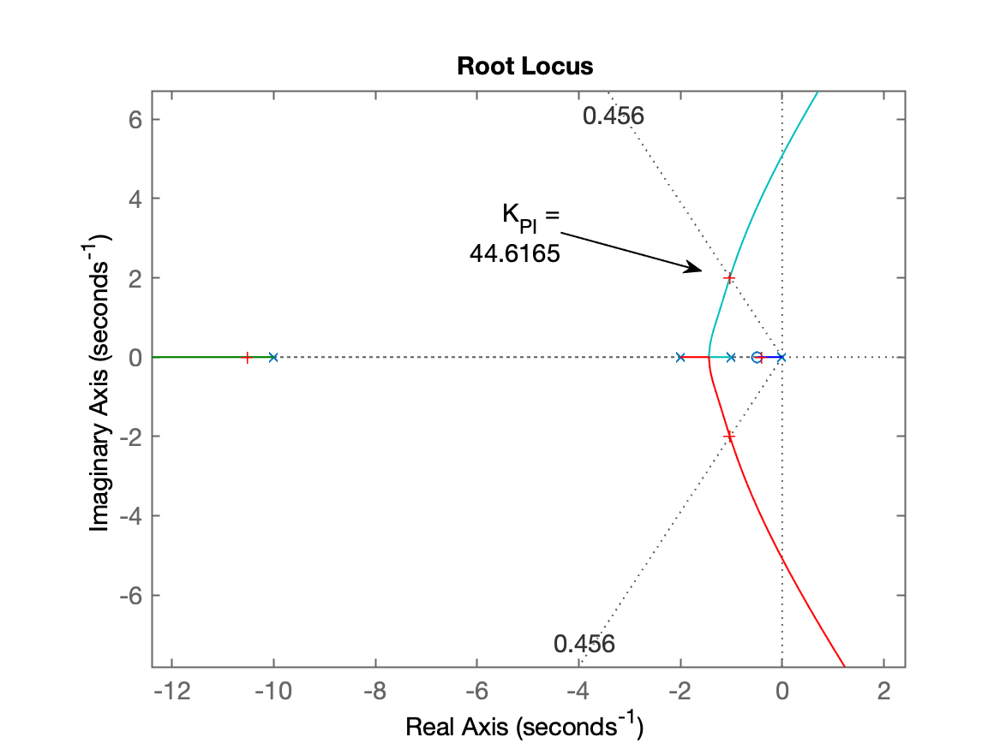
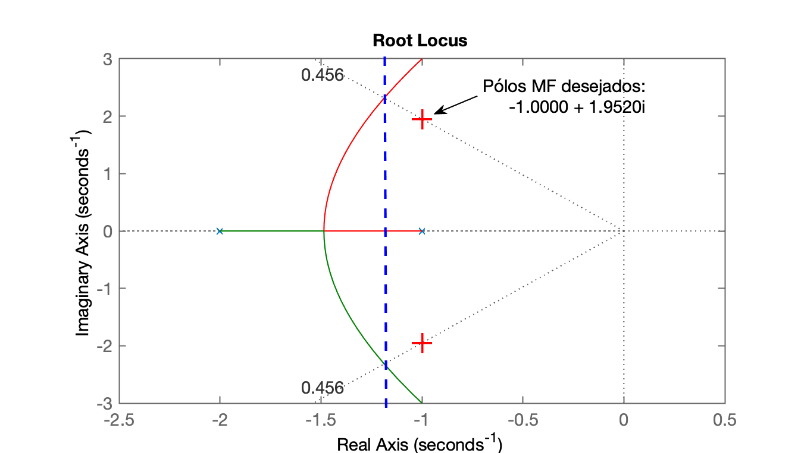
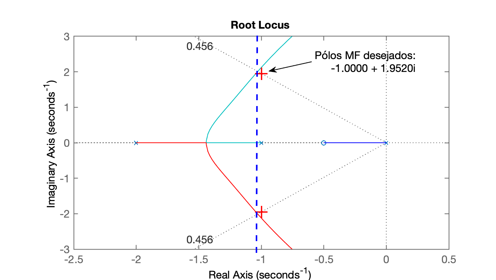
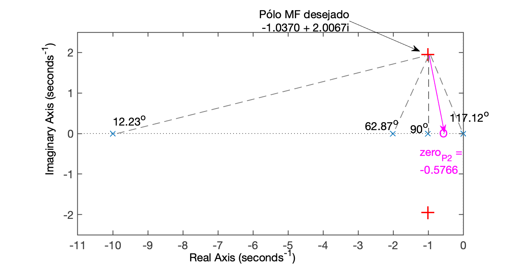
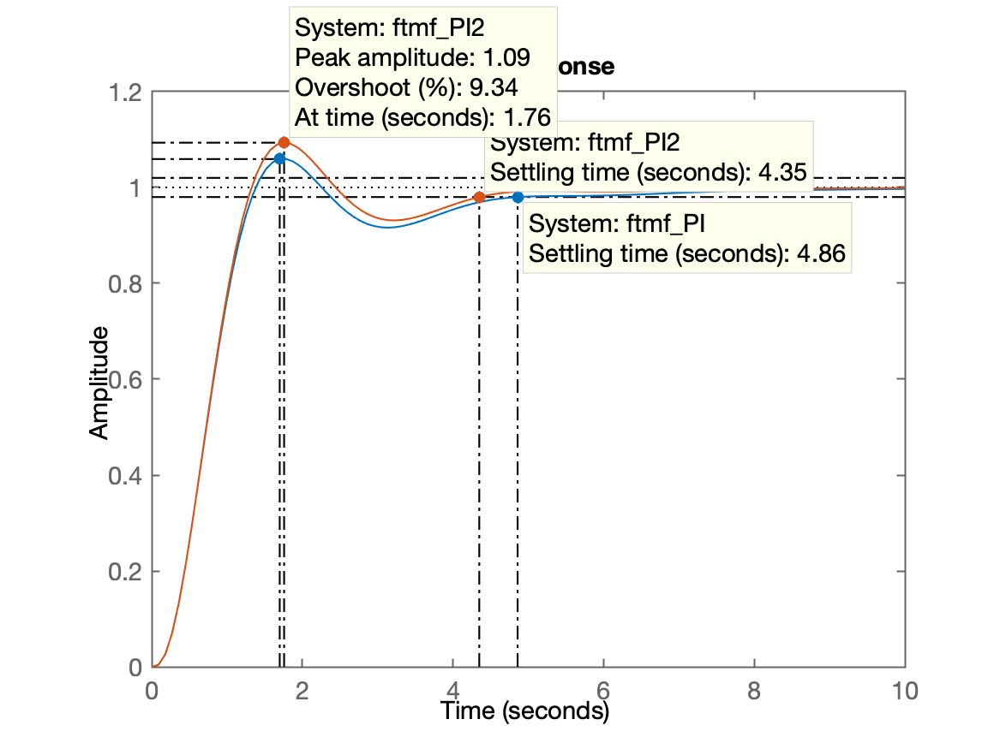

## Projeto de PI

Continuação de aulas anteriores<br/>
Aula de 26/10/2020


Iniciando e retomando nova seção de trabalho no Matlab:

```matlab
>> diary aula_26_10_2020.txt % criando novo arquivo texto log desta aula
>> % Continuando projetos de controladores usando Root Locus
>> 
>> % # Controlador PI
>>
>> % recuperando dados da aula passada
>> load planta
>> zpk(G)   % revisando transfer fuction da planta

          1
  ------------------
  (s+10) (s+2) (s+1)
 
```


Iniciando projeto de PI. Num primeiro momento, alocando zero do PI entre o pólo do mesmo (integador) e o pólo mais lento da planta (em $s=-1$); alocando arbitrariamente o zero em $s=-0,5$:

```matlab
>> C_PI=tf( [1 0.5] , [ 1 0 ] )

C_PI =
 
  s + 0.5
  -------
     s
 
>> ftma_PI=C_PI*G;  % determinando a FTMA(s) com este controlador
>> zpk(ftma_PI)
 
        (s+0.5)
  --------------------
  s (s+10) (s+2) (s+1)
 
>> rlocus(ftma_PI)
>> OS   % recordando %OS adotado
OS =
    20
>> zeta = (-log(OS/100))/(sqrt(pi^2 + (log(OS/100)^2)))
zeta =
    0.4559
>> hold on  % acrescentando + info no RL anterior
>> sgrid(zeta, 0)
>> % Sintonizando este controlador (determinando seu ganho)
>> [K_PI, polos_MF]=rlocfind(ftma_PI)
Select a point in the graphics window
selected_point =
  -1.0370 + 2.0067i
K_PI =
   44.6165
polos_MF =
 -10.5235 + 0.0000i
  -1.0296 + 2.0048i
  -1.0296 - 2.0048i
  -0.4173 + 0.0000i
>> 
```
RL resultando para o projeto do primeiro PI:



Continuando projeto

```matlab 
>> % Fechando a malha
>> 
>> ftmf_PI=feedback(K_PI*ftma_PI, 1);
>> figure; step(ftmf, ftmf_I, ftmf_PI)
>> 
>> % Resposta ao degrau unitário
>> 
>> stepinfo(ftmf_PI)
ans = 
  struct with fields:

        RiseTime: 0.8671
    SettlingTime: 4.8588
     SettlingMin: 0.9162
     SettlingMax: 1.0593
       Overshoot: 5.9275
      Undershoot: 0
            Peak: 1.0593
        PeakTime: 1.6997
>>
```

Resposta ao degrau, incluindo controladores anteriormente projetados:


**Note que**:

* PI resultou + rápido que Integrador Puro ($t_s$ menor), de $\cong 13 \rightarrow \quad \cong 4,8$ segundos;
* Controlador Proporcional continua sendo + rápido de I e PI, mas...
* Controlador Proporcional não resolve (elimina) erro em regime permanente ($\cong 25\%$)


**Novas considerações**: haveria como "acelerar" este PI? Reduzir seu $t_s$?

Comparando o RL do Controlador Proporcional com o do PI se percebe que um PI nunca vai conseguir ser mais rápido que um controlador Proporcional:

| RL Controle Proporcional | RL PI |
| :--- | :--- |
|  |  |
| Código: | Código: |
| >> figure; rlocus(G)<br/> \>> hold on<br/> \>> sgrid(zeta,0);<br/> \>> plot(polos_mf, 'r+')<br/> \>> axis([-2.5 0.5 -3 3]) | \>> figure; rlocus(ftma\_PI) <br/> \>> hold on <br/> \>> sgrid(zeta,0); <br/> \>> plot(polos_mf, 'r+') <br/> \>> axis([-2.5 0.5 -3 3]) |

O pólo do PI (integrador, localizadao na origem do plano-s), atrai o pólo mais lento na direção da origem do plano-s, atrasando a resposta transitória do sistema. Mas podemos tentar projetar um segundo PI verificando se podemos atender $t_s \le 4$ segundos. 

Para evitar de ficar arbitrando o zero do PI em diferentes locais até atender a este novo requisito, o correto seria:

* determinar a posição desajada para os pólos complexos (dominantes) no plano-s com base nos seguintes requisitos de controle:
    * $\%OS \le 20\%$
    * $t_{s_d} \le 4$ segundos.


Para isto usamos o método da **contribuição angular**:    

```matlab
>> t_s_d=4;     % ts desejado
>> wn = 4 / (zeta*t_s_d)    % calculando wn = freq. natural oscilação
wn =
    2.1932
>> wd = wn*sqrt(1-zeta^2) % parte imaginários dos pólos desejados em MF
wd =
    1.9520
>> sigma = wn*zeta % parte real dos pólos desejados de MF
sigma =
    1.0000
>> polos_mf=[-sigma+i*wd -sigma-i*wd]
polos_mf =
  -1.0000 + 1.9520i  -1.0000 - 1.9520i
>> PI2_aux=tf([1], [1 0]);
>> ftma_PI2_aux=PI2_aux*G;
>> zpk(ftma_PI2_aux)
 
           1
  --------------------
  s (s+10) (s+2) (s+1)
 
>> figure; pzmap(ftma_PI2_aux)
>> hold on;
>> plot(polos_mf, 'r+')
>> axis([-11 0 -2.5 2.5])
```

O gráfico à seguir mostra o que se deseja realizar usando contribuição angular. Os cálculos dos ângulos seguem no próximo bloco de códigos.



Calculando os ângulos:

```matlab
>> % Realizando cálculos dos ângulos formados pelos pólos da FTMA
>> theta1=atan2(wd,-1)
theta1 =
    2.0442
>> theta1_deg=theta1*180/pi
theta1_deg =
  117.1261
>> theta2=pi/2;
>> theta2_deg=theta2*180/pi
theta2_deg =
    90
>> theta3=atan2(wd,1)
theta3 =
    1.0974
>> theta3_deg=theta3*180/pi
theta3_deg =
   62.8739
>> theta4=atan2(wd,9)
theta4 =
    0.2136
>> theta4_deg=theta4*180/pi
theta4_deg =
   12.2372
>> sum_theta=theta1+theta2+theta3+theta4
sum_theta =
    4.9260
>> sum_theta_deg=sum_theta*180/pi
sum_theta_deg =
  282.2372
>> theta_zera_deg=360-sum_theta_deg
theta_zera_deg =
   77.7628
>> theta_zero=2*pi-sum_theta
theta_zero =
    1.3572
>> delta_x=wd/tan(theta_zero)
delta_x =
    0.4234
>> zero_P2 = -1 + delta_x
zero_P2 =
   -0.5766
```

Continuando o projeto, e montando o PI2 conforme as especificações e cálculos de contribuição angular:

```matlab
>> % Montando tf do PI2
>> PI2=tf([1 -zero_P2],[1 0])

PI2 =
 
  s + 0.5766
  ----------
      s
 
>> ftma_PI2=PI2*G;
>> % Partindo para ajuste do ganho do PI2
>> figure; rlocus(ftma_PI2)
>> hold on
>> sgrid(zeta, 0)
>> plot(polos_mf, 'r+')
>> [K_PI2, polosMF]=rlocfind(ftma_PI2)
Select a point in the graphics window
selected_point =
  -0.9946 + 1.9715i
K_PI2 =
   44.0718
polosMF =
 -10.5142 + 0.0000i
  -0.9951 + 1.9717i
  -0.9951 - 1.9717i
  -0.4955 + 0.0000i
>> 
```

RL do PI2:


Fechando a malha e verificando resultado alcançado: 

```matlab
>> ftmf_PI2=feedback(K_PI2*ftma_PI2, 1);
>> figure; step(ftmf_PI, ftmf_PI2)
```

Resposta ao degrau:



Antes de continuar com outros projetos:

```matlab
>> save planta
>> diary off
```


## Projeto de Compensador por Atraso de Fase (Lag)

Alocando o zero ligeiramente mais afastado do eixo jw em comparação ao PI anterior.

Diferente do PI, O compensador por atraso de fase possui seu pólo deslocado da origem do plano-s. Quanto mais próximo, mais desempenha um papel similar ao PI (integrador). Quanto mais afastado este pólo estiver da origem, maior será o será o erro em regime permanente (menor o papel como integrador).

```matlab
>> diary aula_26_10_2020.txt    % recomeçando arquivo anterior
>> % # Projeto do Compensandor de Atraso (Lag)
>>
>> % Alocando o zero ligeiramente mais afastado do eixo jw em comparação ao PI anterior 
>> C_Lag=tf([1 0.6], [1 0.1]);
>> zpk(C_Lag)

ans =
 
  (s+0.6)
  -------
  (s+0.1)
 
>> ftma_Lag=C_Lag*G;
>> zpk(ftma_Lag)
 
           (s+0.6)
  --------------------------
  (s+10) (s+2) (s+1) (s+0.1)
 
>> figure; rlocus(ftma_Lag)
>> hold on
>> sgrid(zeta, 0);
>> plot(polos_mf, 'r+')
>> [K_Lag,polosMF]=rlocfind(ftma_Lag)
Select a point in the graphics window
selected_point =
  -1.0289 + 2.0173i
K_Lag =
   44.7261
polosMF =
 -10.5245 + 0.0000i
  -1.0191 + 2.0149i
  -1.0191 - 2.0149i
  -0.5374 + 0.0000i
>>
```

Figura do RL para o Lag


Finalizando projeto:

```matlab
>> % fechando a malha para este ganho
>> ftmf_Lag=feedback(K_Lag*ftma_Lag, 1);
>> figure;
>> step(ftmf_PI2, ftmf_Lag)
```

Resposta ao degrau obtida (comparando com PI2 anterior):


Note que o Lag introduziu erro:

```matlab
>> dcgain(ftmf_Lag)     % valor de y(\infty)
ans =
    0.9306
>> erro_Lag=(1-dcgain(ftmf_Lag))/1*100
erro_Lag =
    6.9359
>> 
```


Encerrando atividades e deixando seção preparada para próxima aula:

```matlab
>> save planta
>> diary off
>> quit
```

---

Fernando Passold, em 26/10/2020