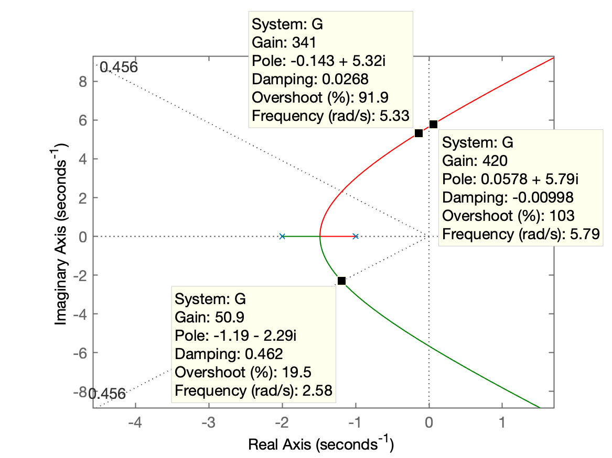
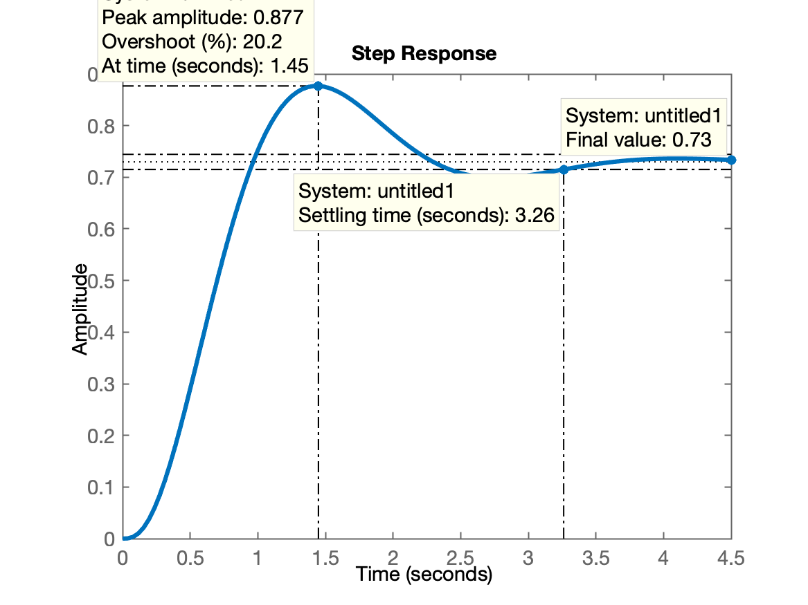
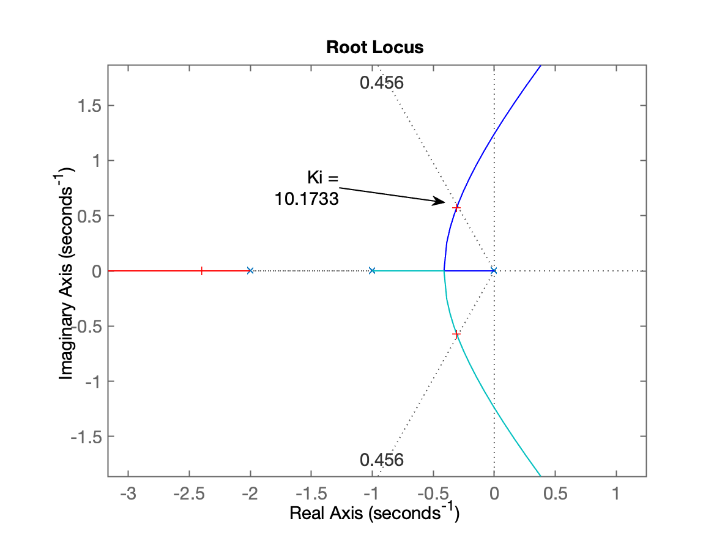
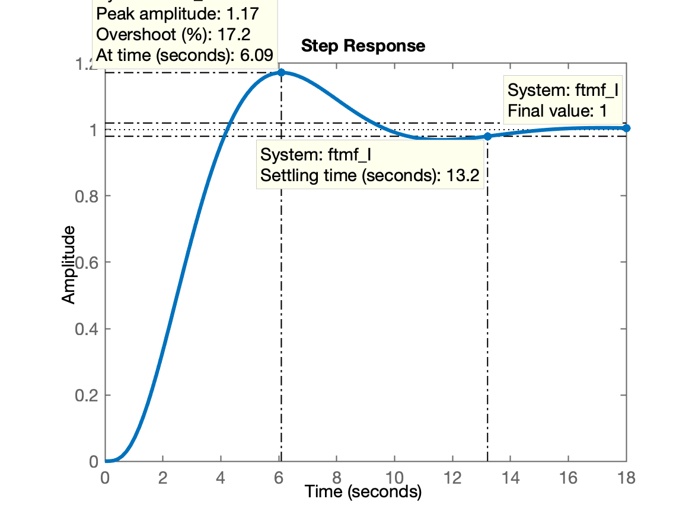
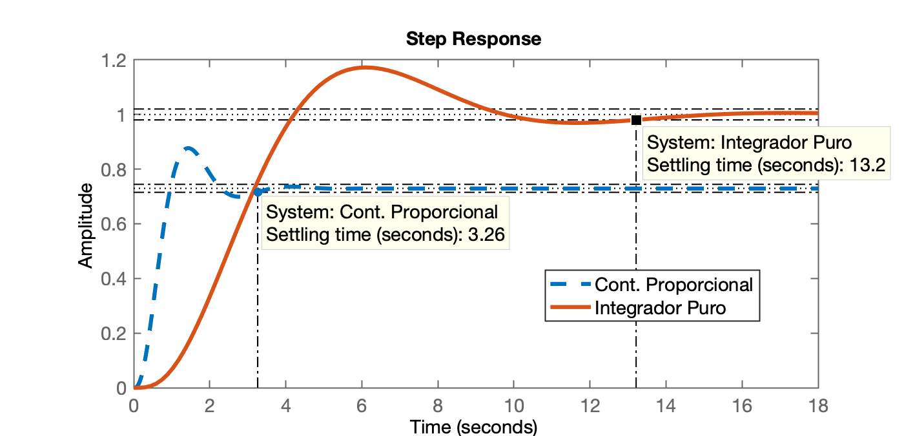

# Aula 05/10/2020

## Projeto do Controlador Proporcional

Processo
$$
G(s)=\dfrac{1}{(s+1)(s+2)(s+10)}
$$

```matlab
>> format compact
>> format short
>> 
>> G=tf( 1, poly([ -1 -2 -10]) );
>> zpk(G)

ans =
 
          1
  ------------------
  (s+10) (s+2) (s+1)
 
Continuous-time zero/pole/gain model.

>> OS=20; % overshoot em %
>> zeta=(-log(OS/100))/(sqrt(pi^2+(log(OS/100)^2)))
zeta =
    0.4559
>> rlocus(G)
>> hold on
>> sgrid(zeta, 0);
>> 
```

Gráfico do RL:



Fechando a malha, depois de ajustado o ganho:

```Matlab
>> [K,POLES] = rlocfind(G) 
Select a point in the graphics window
selected_point =
  -1.1903 + 2.3699i
K =
   54.3215
POLES =
 -10.6507 + 0.0000i
  -1.1747 + 2.3661i
  -1.1747 - 2.3661i
>> K=54;
>> ftmf = feedback( K*G, 1);
>> ftmf

ftmf =
 
             54
  ------------------------
  s^3 + 13 s^2 + 32 s + 74
 
Continuous-time transfer function.

>> figure; step(1*ftmf) % 1 = degrau unitário
>> 
```

Resultado da resposta ao degrau:



Posso levantar dados extras:

```matlab
>> stepinfo(ftmf)
ans = 
  struct with fields:

        RiseTime: 0.6107
    SettlingTime: 3.2619
     SettlingMin: 0.6827
     SettlingMax: 0.8768
       Overshoot: 20.1539
      Undershoot: 0
            Peak: 0.8768
        PeakTime: 1.4485
>> dcgain(ftmf) % valor final de y(t) em refime permanente
ans =
    0.7297
>> % suponha que quero calcular erro:
>> erro=((1-dcgain(ftmf))/1)*100
erro =
   27.0270
>>    
```

## Projeto do Integrador Puro

Comandos no Matlab

```matlab
>> % Partindo para controlador Integrador Puro
>> 
>> C_I = tf( 1, [1 0]); 
>> zpk(C_I)

ans =
 
  1
  -
  s
 
Continuous-time zero/pole/gain model.

>> ftma_I = C_I * G;
>> zpk(ftma_I)

ans =
 
           1
  --------------------
  s (s+10) (s+2) (s+1)
 
Continuous-time zero/pole/gain model.

>> figure; rlocus(ftma_I)
>> hold on; sgrid(zeta, 0)
>> [Ki,POLES] = rlocfind(ftma_I)
Select a point in the graphics window
selected_point =
  -0.3148 + 0.5769i
Ki =
   10.1733
POLES =
  -9.9858 + 0.0000i
  -2.3988 + 0.0000i
  -0.3077 + 0.5745i
  -0.3077 - 0.5745i
>> Ki=10; 
>> 
```

O que resultou o RL mostrado à seguir:



Fechando malha com Ki = 10:

```matlab
>> Ki=10; 
>> % RL salvo no arquivo RL_controlador_int_puro.png
>> % 
>> ftmf_I = feedback( Ki*ftma_I, 1)

ftmf_I =
 
                 10
  ---------------------------------
  s^4 + 13 s^3 + 32 s^2 + 20 s + 10
 
Continuous-time transfer function.

>> figure; step(ftmf_I)
>> 
```

Resultado da resposta ao Degrau:




Como esperado o erro em regime permanente agora é nulo.

Posso comparar resposta destes 2 controladores:

```Matlab
>> figure; step(ftmf, ftmf_I)
```

Gráfico:



---

Fim

Não esqueça de:

```matlab
>> save planta
>> diary off
```

