## Projeto de Controlador PI

> Aula de 14/10/2020

Relembrando a planta usada para estudo de caso:

```matlab
» zpk(BoG)

ans =

  0.00012224 (z+2.747) (z+0.1903)
  --------------------------------
  (z-0.9048) (z-0.8187) (z-0.3679)

Sample time: 0.1 seconds
Discrete-time zero/pole/gain model.
```

Equação do PI:

$$
C(z)=K_p+\dfrac{K_i}{(z-1)}=\frac{K_p z - K_p + K_i}{(z-1)}
$$
$$
C(z)=\dfrac{ K_p \left[ z - \left( 1 - \dfrac{K_i}{K_p}\right) \right]  }{(z-1)}
$$

O problema aqui é definir a posição do zero.

Usando Matlab para levantar o RL de $BoG(z)$ e parte do controlador PI sem o zero, para avaliar posições para seu zero:

```matlab
» PI_aux=tf(1 , [1 -1], T); % PI sem o zero!
» zpk(PI_aux) % conferindo expressão do PI_aux sem o zero ainda

ans =

    1
  -----
  (z-1)

Sample time: 0.1 seconds
Discrete-time zero/pole/gain model.

» ftma_aux=PI_aux*BoG;
» pzmap(ftma_aux)
» % Lembrando dos pólos e zeros da planta:
» zpk(BoG)

ans =

  0.00012224 (z+2.747) (z+0.1903)
  --------------------------------
  (z-0.9048) (z-0.8187) (z-0.3679)

Sample time: 0.1 seconds
Discrete-time zero/pole/gain model.
```

* Onde colocar zero do PI ?

Raciocínio usando RL como ferramenta de decisão:

**Opção 1)** Colocar  0,9048 < zero_PI < 1 (integrador) (entre o integrador e o pólo + lento)

**Opção 2)** Colocar o  0,8187 < zero_PI < 0,9048 (entre os 2 pólos mais lentos da planta)

| 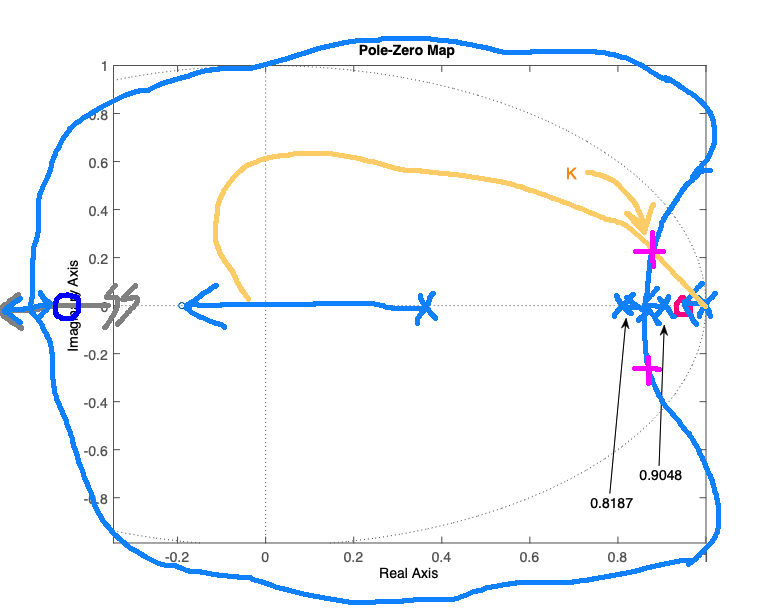 | 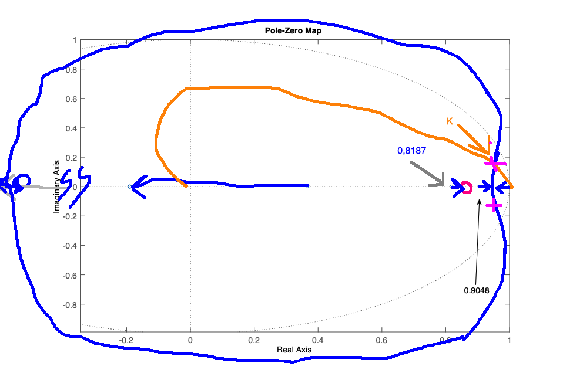 |
| ------------------------------------------- | ------------------------------------------- |
| Opção 1:                                    | Opção 2:                                    |
| 0,9048 < zero_PI < 1                        | 0,8187 < zero_PI < 0,9048 |

Observe certas sutilezas nos gráficos anteriores:
* A distância (raio) de um pólo complexo no RL para a opção 1 está um pouco mais próxima da origem do plano-z em comparação com a opção 2. A diferença pode parecer pequena nas figuras, mas as 2 opções implicam resultados bem diferentes.

**Conclusão:** Optando pela opção 1, porque o RL com pólos complexos fica ligeiramente mais afastado do círculo unitário (resposta + rápida).

Continuando com projeto do PI:

```matlab
» PI=tf( [1 -0.93], [1 -1], T)

PI =

  z - 0.93
  --------
   z - 1

Sample time: 0.1 seconds
Discrete-time transfer function.

» ftma_PI=PI*BoG;
» figure; rlocus(ftma_PI)
» hold on;
» zgrid(zeta,0)
» % Sintonizando PI:
» [K_PI, polosMF] = rlocfind(ftma_PI)
Select a point in the graphics window
selected_point =
   0.8938 + 0.0992i
K_PI =
   18.8690
polosMF =
   0.9472 + 0.0000i
   0.8938 + 0.0992i
   0.8938 - 0.0992i
   0.3543 + 0.0000i
zpk(BoG)

ans =

  0.00012224 (z+2.747) (z+0.1903)
  --------------------------------
  (z-0.9048) (z-0.8187) (z-0.3679)

Sample time: 0.1 seconds
Discrete-time zero/pole/gain model.
```

RL resultante:

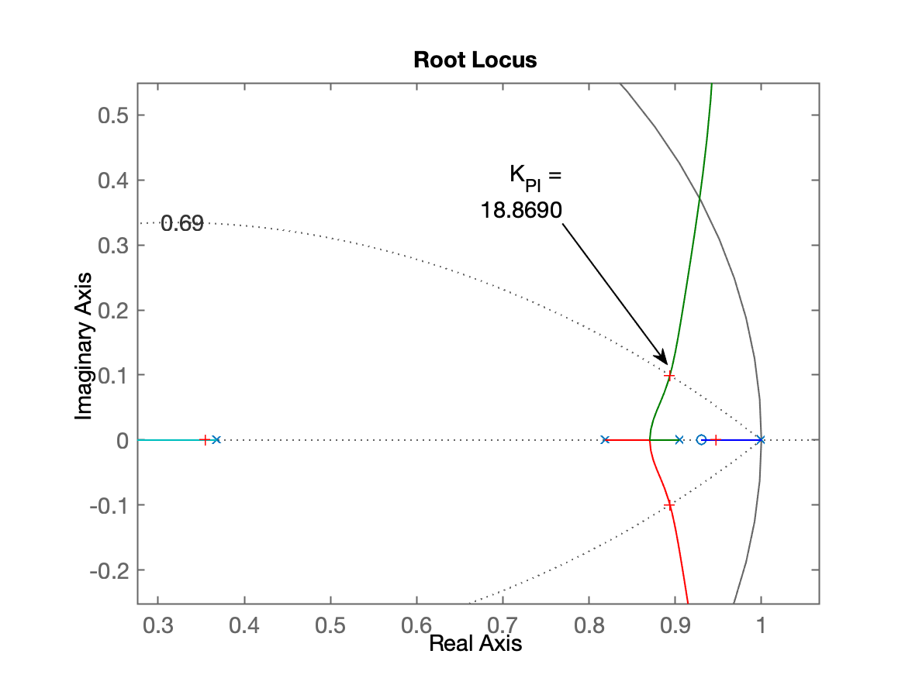

Fechando a malha:

```matlab
» ftmf_PI = feedback(K_PI*ftma_PI, 1);
» figure; step(ftmf_PI)
```

Resultado da resposta ao degrau:

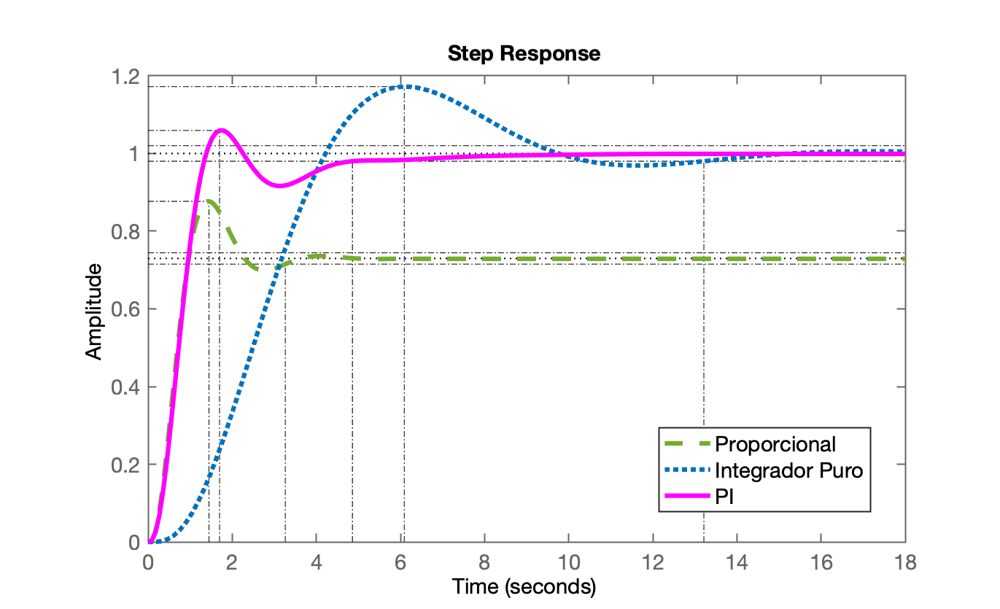

Comparando com controladores anteriores:

```matlab
» figure; step(ftmf, ftmf_I, ftmf_PI);
```

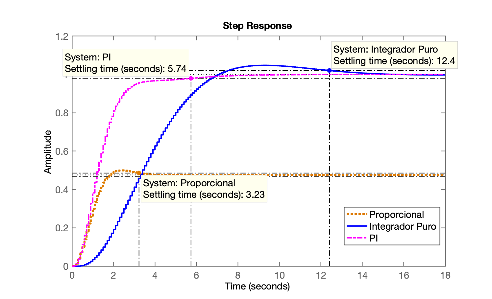

## Projeto do Controlador por Atraso de Fase (Lag)

Comparativo do Lag com PI (teoria):

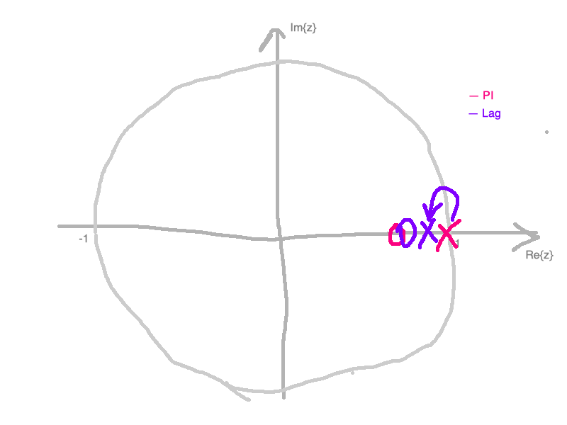

```matlab
» % Lembrando de BoG(z)
» zpk(BoG)

ans =

  0.00012224 (z+2.747) (z+0.1903)
  --------------------------------
  (z-0.9048) (z-0.8187) (z-0.3679)

Sample time: 0.1 seconds
Discrete-time zero/pole/gain model.

» Lag=tf( [1 -0.91] , [1 -0.98 ] , T)

Lag =

  z - 0.91
  --------
  z - 0.98

Sample time: 0.1 seconds
Discrete-time transfer function.

» ftma_Lag=Lag*BoG;
» figure; rlocus(ftma_Lag)
» hold on
» zgrid(zeta,0)
» % Sintonizando Lag:
» [K_Lag, polosMF] = rlocfind(ftma_Lag)
Select a point in the graphics window
selected_point =
   0.9009 + 0.0952i
K_Lag =
   17.1887
polosMF =
   0.9135 + 0.0000i
   0.9002 + 0.0953i
   0.9002 - 0.0953i
   0.3555 + 0.0000i
```

RL resultante para o Lag:

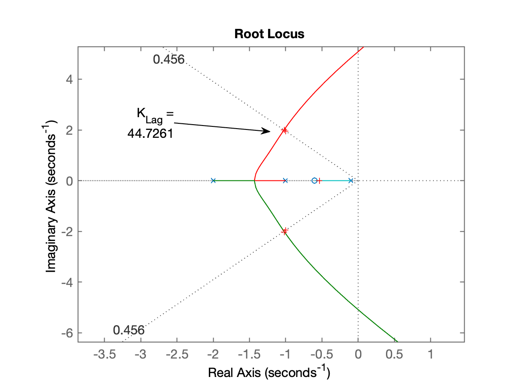

Fechando a malha...

```matlab
» ftmf_Lag = feedback(K_Lag*ftma_Lag, 1);
» figure; step(ftmf_Lag)
» axis([0 6 0 1])
```

Resposta ao degrau para controlador Lag:

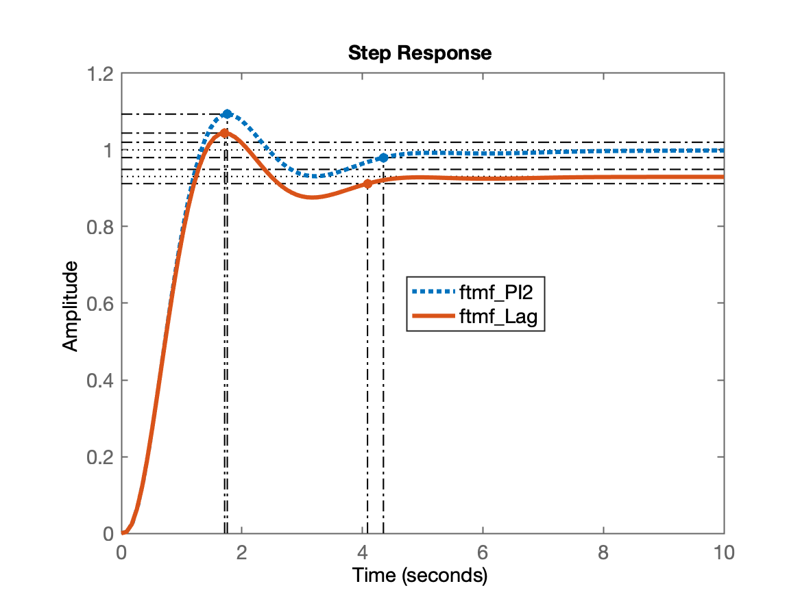

Note, agora existe erro em regime permanente: $e[kT] \neq 0$.

```matlab
» % Verificando erro
» dcgain(ftmf_Lag) % valor de y[\infty]
ans =
    0.7946
» erro_Lag=(1-dcgain(ftmf_Lag))/1*100
» erro_Lag =
   20.5446
```

* Será que este controlador é mais rápido que o PI?

Comparando Lag com PI:

```matlab
» figure; step(ftmf_PI, ftmf_Lag)
```

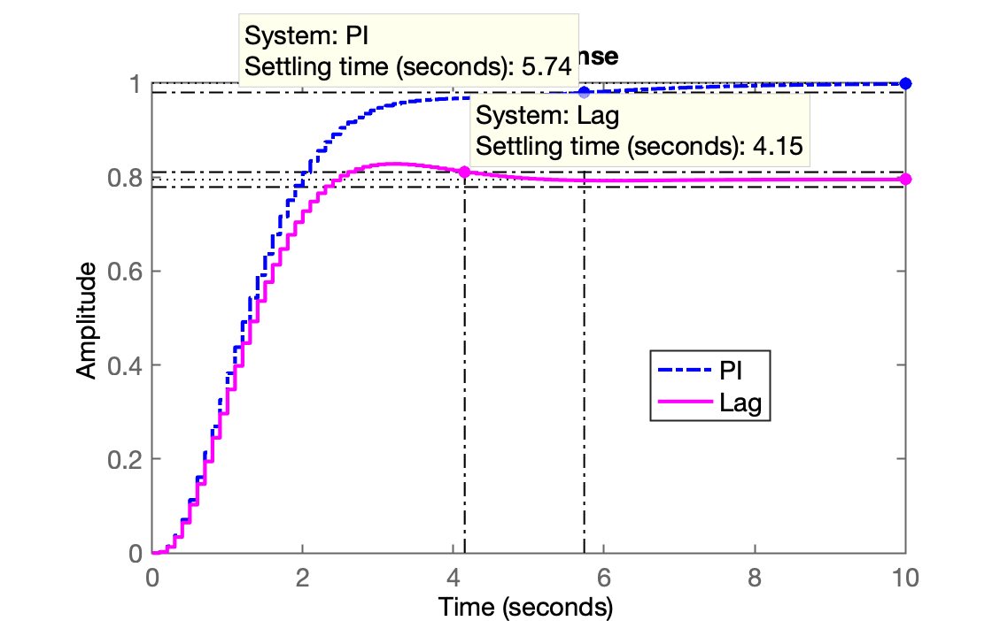


## Projeto do PI cancelando pólo + lento

A ideia aqui é avaliar se ao invés de atribuir um local para o zero entre pólos dominantes da $FTMA(z)$, o que ocorre se o zero do controlador cancelar propositalmente o pólo mais lento da planta?

```matlab
» polos_planta=pole(BoG)
    0.9048
    0.8187
    0.3679
» polos_planta(1) % isolando apenas o pólo + lento
ans =
    0.9048
» % Montando o PI com zero igual ao pólo + lento da planta:
» PI2=tf( [1 -polos_planta(1)], [1 -1], T)

PI2 =

  z - 0.9048
  ----------
    z - 1

Sample time: 0.1 seconds
Discrete-time transfer function.

» ftma_PI2=PI2*BoG;
» zpk(ftma_PI2) % comprovando cancelamento pólo-zero

ans =

  0.00012224 (z+2.747) (z-0.9048) (z+0.1903)
  ------------------------------------------
    (z-1) (z-0.9048) (z-0.8187) (z-0.3679)

Sample time: 0.1 seconds
Discrete-time zero/pole/gain model.

» figure; rlocus(ftma_PI2)
» hold on;
» zgrid(zeta,0)
» % Sintonizando este PI:
» [K_PI2,polosMF] = rlocfind(ftma_PI2)
Select a point in the graphics window
selected_point =
   0.9158 + 0.0845i
K_PI2 =
   17.1359
polosMF =
   0.9143 + 0.0846i
   0.9143 - 0.0846i
   0.9048 + 0.0000i
   0.3560 + 0.0000i
```

RL resultante:

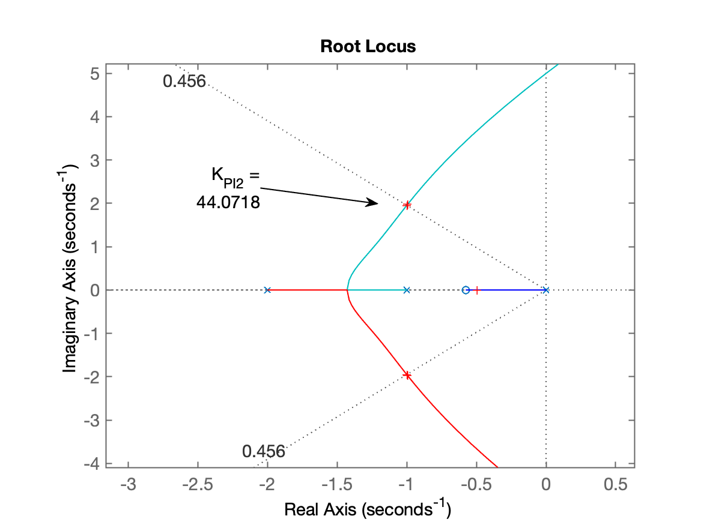

Fechando a malha...

```matlab
» ftmf_PI2=feedback(K_PI2*ftma_PI2, 1);
» figure; step(ftmf_PI, ftmf_PI2)
```

Resposta ao degrau unitário:

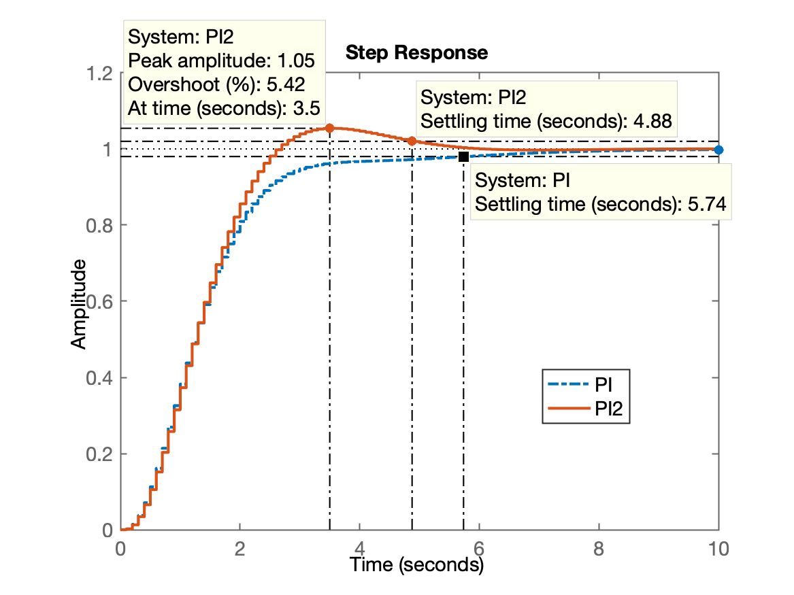

## Comparando esforços de controle

A ideia aqui é avaliar as amplitudes desenvolvidas por cada ação de controle, $u[kT]$:

Baseado na **apostila.pdf** (Apêndice G.1 Gráfico de $u[kT]$), percebemos que a função **step(FTMF)** do Matlab realiza:
$$
\text{step(FTMF)}=\text{"plot"} \left( \mathcal{Z}^{-1}\left\{ \underbrace{U(z)}_{\mathcal{Z}\left\{ \text{Degrau} \right\}} \cdot \text{FTMF}(z) \right\} \right)
$$
E lembrando que:
$$
U(z)=\left[ \dfrac{C(z)}{1+C(z)\cdot BoG(z)} \right]
$$
Então:

```matlab
» aux_PI2=K_PI2*PI2/(1+K_PI2*ftma_PI2);
» aux_PI=K_PI*PI/(1+K_PI*ftma_PI);
» % Comparando $u[kT]$ do PI com PI2:
» figure; step(aux_PI, aux_PI2)
```


Comparando com controlador proporcional

```matlab
» aux_Kp=K/(1+K*BoG);
» figure; step(aux_Kp, aux_PI, aux_PI2)
```

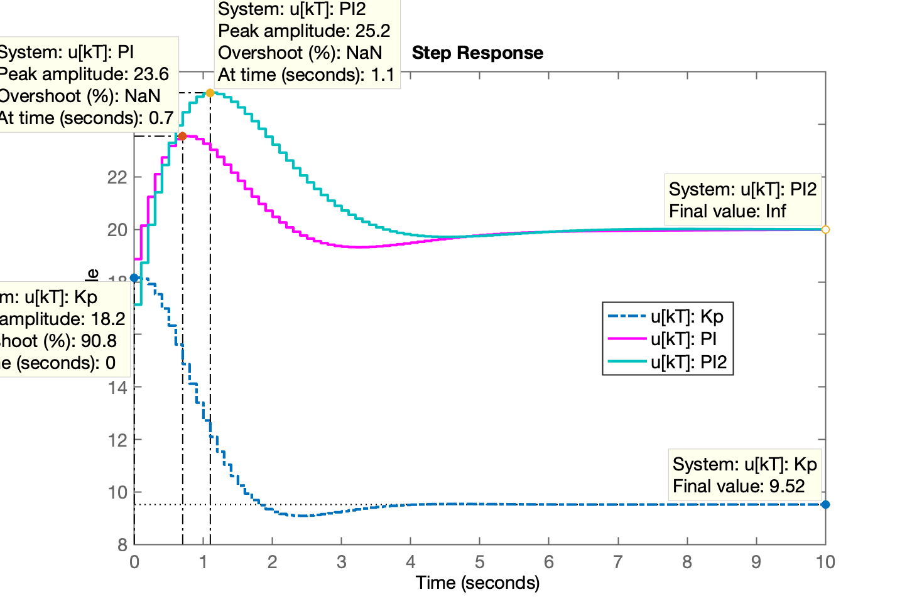

**Finalizando atividades desta aula:**

```matlab
» save planta
» diary off
```

---

Fernando Passold, em 14/10/2020
