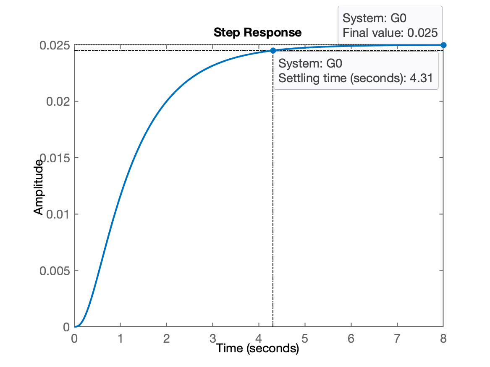
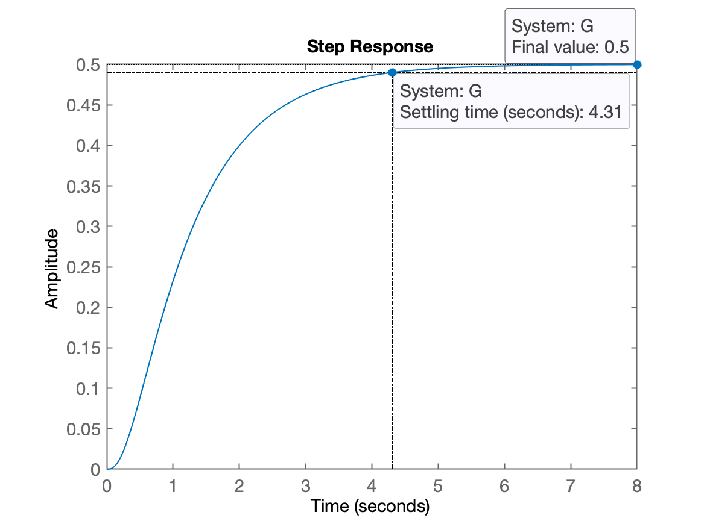
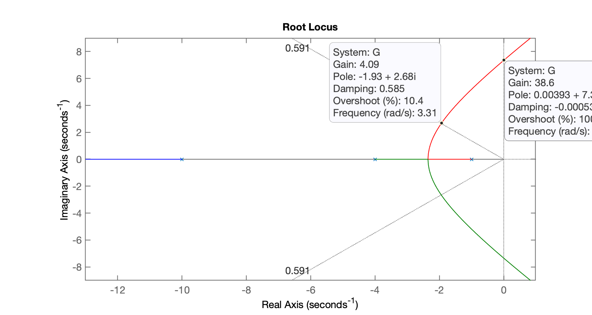
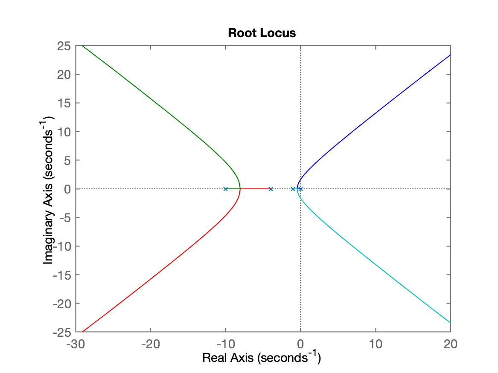
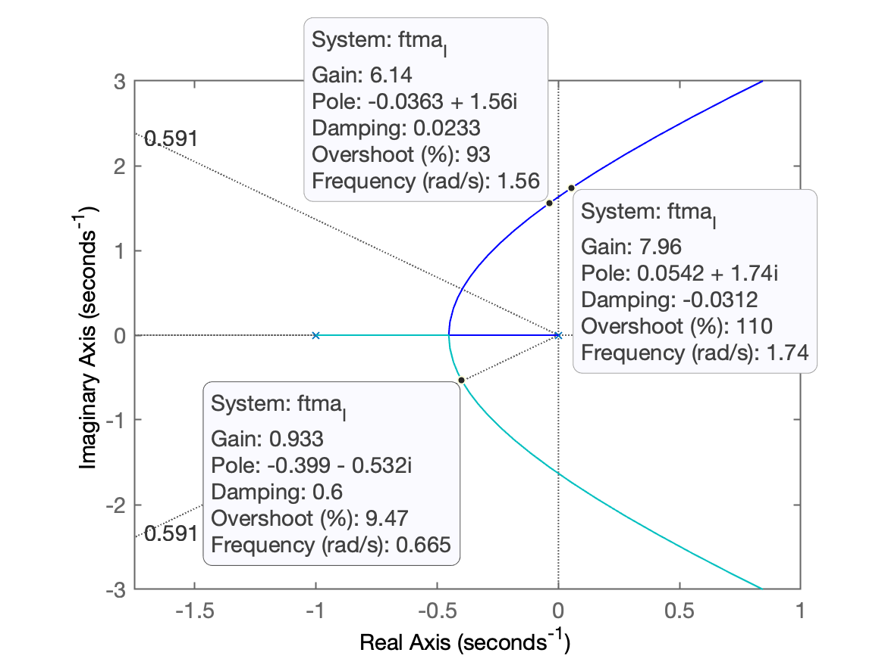
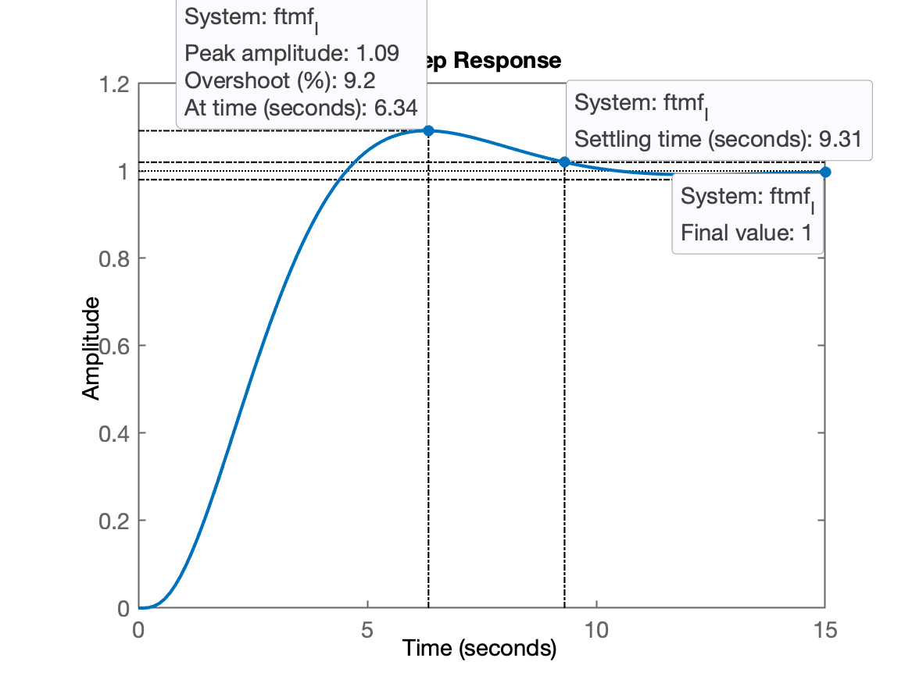
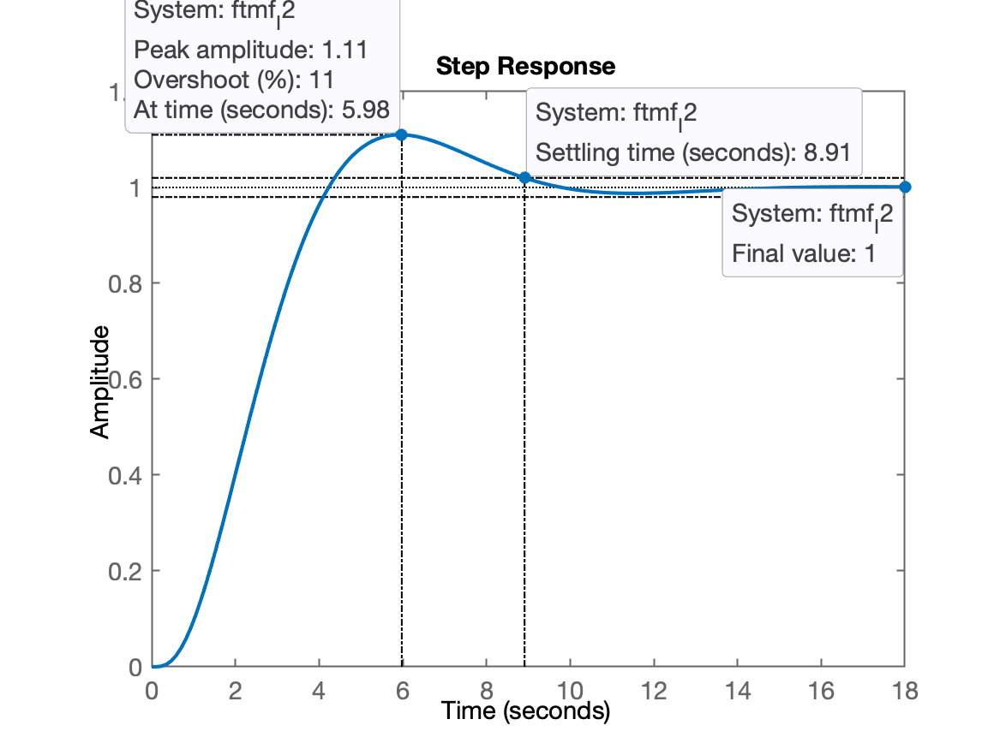

**Introdução**

A idéia é criar um documento digital retratando os comandos usados no Matlab, acrescendo referências aos gráficos, equações e comentários, de forma fácil, num arquivo texto compatível com Markdown. Mais sobre Markdown e metodologia sugerida ver: Uso do MATLAB nas aulas de Controle + documentação Markdown → https://fpassold.github.io/Controle_2/sugestao_uso_matlab_em_controle.html

Então, logo depois de iniciar o Matlab, na sua janela de comandos (CLI) vamos dar o seguinte comando:

```matlab
>> diary aula09092024.txt
```

Isto fará com o que Matlab repasse para o arquivo acima, todos os comandos ingressados na sua CLI.

# Projeto de Controladores

## Ingressando a Planta

A idéia é trabalhar com uma mesma planta, explorando diferentes tipos de controladores. Percebendo quando certo tipo de ação de controle é mais desejada que outra, percebendo se requisitos de controle podem ser atendidos e percebendo que certas plantas se "casam" melhor com certos tipos de controladores. Então ao invés de mudar de planta cada vez que se muda a ação de controle, vamos projetar vários controladores diferentes para o mesmo tipo de planta, colocando o foco no raciocínio à ser adotado na definição de cada controlador.

Iniciando em: Projeto de Controladores Proporcional e com Ação Integral → https://fpassold.github.io/Controle_2/PI_parte1.html

A planta sugerida é do tipo 0 de 3a-ordem, sem zeros. Algo como:

$G(s)=\dfrac{K}{(s+p_1)(s+p_2)(s+p_3)}$

Onde os pólos $p_1$ e $p_2$ estariam mais próximos do eixo $j \omega$, ou seja, acabam dominando a resposta em relação ao terceiro pólo (que estaria mais afastado dos 2 primeiros).

Suponha então que a planta seja:

$G(s)=\dfrac{1}{(s+1)(s+4)(s+10)}$

Usando Matlab:

```matlab
>> G=tf ( 1, poly( [ -1 -4 -10 ] ) )	% ingressando a tf

G =

             1
------------------------
  s^3 + 15 s^2 + 54 s + 40

Continuous-time transfer function.

>> zpk(G) % conferindo entrada de dados

ans =

          1
------------------
  (s+10) (s+4) (s+1)

Continuous-time zero/pole/gain model.

>> step(G) % verificando resposta em MA para degrau unitário
```



O gráfico nos permite perceber a "velocidade" ou tempo de resposta da planta. E percebemos também o "**ganho DC**" da planta (valor final, em regime permanente alcançado pela planta) -- apenas 0,025. Ou seja, se a planta recebe um degrau unitário na sua entrada, evolui até seu valor final de 0,025 -- um ganho DC bastante baixo.

Lembrado do **Teorema do Valor Final** associado com Transformada de Laplace, temos que:

$y(t)\vert_{t \to \infty} = y(\infty) = \displaystyle \lim_{s \to 0} \; s \cdot Y(s)$

Neste caso, $Y(s)=R(s) \cdot G(s)$, onde $R(s)=$ transformada de Laplace do sinal de entrada usado para excitar a planta, no caso, uma entrada degrau unitário, então $R(s)=1/s$. Assim temos:

$y(\infty)=\displaystyle \lim_{s \to 0} \cancel{s} \cdot \left( \underbrace{\dfrac{1}{\cancel{s}}}_{\text{Degrau}} \right) \cdot \left( \underbrace{\dfrac{1}{(s+1)(s+4)(s+10)}}_{G(s)} \right)$

O que resulta:

$y(\infty)=\dfrac{1}{(1)(4)(10)}=\dfrac{1}{40}$

O que numericamente resulta:

```Matlab
>> 1/40
ans =
        0.025
```

Note que este valor coincide com o valor final atingido pela planta no gráfico anterior.

Como este ganho é muito baixo, vamos acrescentar artificialmente um ganho na nossa planta para modificar este valor. Suponha que queremos que o ganho DC seja de 0,5, então:

$0,5=\dfrac{K}{(1)(4)(10)} \quad \therefore \quad K=20$

Verificando com ajuda do Matlab:

```matlab
>> G=tf ( 20, poly( [ -1 -4 -10 ] ) )

G =

             20
------------------------
  s^3 + 15 s^2 + 54 s + 40

Continuous-time transfer function.

>> dcgain(G)	% Matlab aplica teorema do valor final usando entrada degrau na tf repassada
ans =
          0.5
>> figure; step(G)	% confirmando valor final
```



Resta agora iniciar o projeto de algum controlador, iniciando pelo mais simples, que seria simplesmente um controlador proporcional.

## Controlador Proporcional

Este tipo de controlador fecha uma malha de realimentação unitária, simplesmente aplicando um ganho ao sinal de erro no canal de realimentação:

$C(s)=K$

o que implica que a planta vai receber o seguinte tipo de sinal, $u(t)=$ sinal de controle para a mesma:

$u(t)=K \cdot e(t)$

onde $e(t)=$ erro, calculado da seguinte forma:

$e(t)=r(t)-y(t)$

onde $r(t)=$ referência usada; $y(t)=$ resposta planta.

Este controlador simplemente faz:

$u(t)=K \left( r(t)-y(t) \right)$

Mas nenhum projeto de controle pode ser considerado um projeto sem **requisitos de controle**. Vamos supor neste caso, que queremos:

* Reduzir tempo de resposta da planta (em MA) em 3x;
* Manter erro em MF abaixo de 10%;
* Tolerável resposta com overshoot máximo de 10%;

Iniciando o projeto, levantando o *root-locus* deste sistema:

```matlab
>> figure; rlocus(G)
>> % vamos sobrepor a linha guia para valores constantes de \zeta com base no %OS desejado
>> OS=10; % overshoot
>> zeta=(-log(OS/100))/(sqrt(pi^2+(log(OS/100)^2)))
zeta =
      0.59116
>> hold on	% Obs.: realizar foco sobre figura do RL (não do Step)
>> sgrid(zeta, 0)
>> % realizando zoom na região de interesse:
>> axis([-13 1 -9 9])	% "padronizando" o zoom para todos os estudantes
```

Temos então o seguinte RL:



Notamos que:

* Ganho máximo em torno de $K=38,6$;
* Ganho para $\%OS=10\%$ quando $K \cong 4$.

Fechando a malha om ganho $K=4$:

```matlab
>> K=4;
>> ftmf = feedback(K*G, 1);
>> pole(ftmf)
ans =
      -11.112 +          0i
      -1.9438 +     2.6496i
      -1.9438 -     2.6496i
>> figure; step(1*ftmf)		% resposta ao degrau unitário (1) em MF
```


Nota-se:

* $\%OS < 10\%$, ✔️;
* $t_s=1,9$ segundos. Comparando com resposta em MA:
$t_s=4,31$ segundos, ou, aceleramos a planta $2,27 \times$(em comparação com resposta em MA):

```matlab
4.31/1.9
ans =
       2.2684
```

Falta perceber o erro em regime permanente.

Se $y(\infty)=0,667$, então temos um erro de:

```matlab
>> dcgain(ftmf)
ans =
      0.66667
>> erro= ((1-dcgain(ftmf))/1)*100  % computando o erro em %
erro =
       33.333
```

Obviamente percebemos que com este valor de ganho, mantivemos o $\%OS$ abaixo do desejado, mas o erro é muito maior que os 10% desejados. Como esta planta é um sistema do tipo 0, a **teoria dos erro** no informa que sempre haverá erro de regime permanente enquanto não acrescentarmos alguma ação integral. Mas podemos aumentar o valor do ganho para reduzir o valor deste erro. Partindo então um novo projeto de controlador Proporcional.

# Controlador Proporcional 2

O objetivo agora é usando **teoria do erro** calcular valor do ganho para manter erro abaixo do patamar desejado e então verificar o que acontece...

Teoria do erro → https://fpassold.github.io/Controle_2/3_erros/erros.pdf

A planta é um sistema tipo 0, o que significa que o controlador proporcional não é capaz de eliminar erro em regime permanente, já que falta ação integral. Mas podemos deduzir que valor  de ganho deveria ser adotado para manter erro abaixo do valor desejado:

$e(\infty)=\dfrac{1}{1+K_p}$

$K_p=\lim_{s \to 0} FTMA(s)$ 

$e(\infty)=0,1$ (10% para entrada degrau unitário) 

$e(\infty)=0,1=\dfrac{1}{1+K_p}$

$K_p=\dfrac{1-0,1}{0,1}$

Obtendo os valores numéricos com auxílio do Matlab:

```matlab
>> Kp=(1-0.1)/0.1
Kp =
     9
```

$K_p=\displaystyle\lim_{s \to 0} FTMA(s) = \displaystyle\lim_{s \to 0} K \cdot G(s) = 9$

O cálculo do $\displaystyle\lim_{s \to 0} G(s)=$ pode ser obtido usando a função `dcgain(G)`:

```matlab
>> limite=dcgain(G)
limite =
          0.5
```

Então:

$K \cdot 0,5 = 9$

Ou, usando Matlab:

```matlab
>> K2=Kp/limite
K2 =
    18
```

Fechando a malha e comprovando teoria do erro:

```matlab
>> ftmf2=feedback(K2*G,1);
>> figure; step(ftmf2)
```

Obtemos o gráfico:


Comentários:

* o erro ficou no máximo requirido (10%), mas...
* $t_s$ aumentou consideravelmente, $t_s=4,42$ segundos. E era desejado:

```matlab
>> 4.31/3	% reduzir 3 vezes o ts de MA
ans =
       1.4367
```

* o $\%OS$ aumentou muito, 39% em relação à entrada degrau.

Conclusão final: o erro foi mantido no limite do desejado, mas o o tempo de resposta aumentou consideravelmente devido à resposta oscilatória do sistema (acima do desejado). 

Então não há muito mais a fazer para "melhorar" um controlador proporcional. Poderíamos pensar em zerar o erro em regime permanente, acrescentando ação integral, mas então passamos para um novo tipo de controlador.

## Controlador com Ação Integral Pura

O objetivo agora é eliminar o erro de regime permanente mas tentando manter os outros requisitos de controle:

```matlab
>> C_I=tf(1,[1 0]) % ingressando a tf deste controlador C(s)

C_I =
 
  1
  -
  s
 
Continuous-time transfer function.

>> ftma_I = C_I*G;	% obtendo a equação de malha-direta ou FTMA com este controlador
>> zpk(ftma_I)		% confirmando resultado obtido

ans =
 
           20
  --------------------
  s (s+10) (s+4) (s+1)
 
Continuous-time zero/pole/gain model.

>> % continuando o projeto, levantando o RL da planta com este controlador:
>> figure; rlocus(ftma_I)
```



Realizando zoom na região de interesse (dos pólos dominantes) e definindo ganho do controlador:

```matlab
>> axis([-1.75 1 -3 3])
>> hold; sgrid(zeta, 0)
Current plot held
```




Algumas considerações:

* Ganho máximo, $6,14 < K_i < 7,96$. Obviamente não usaremos ganho tão elevado.

Notamos que as curvas do RL cruzam a linha guia do $\zeta$ correspondendo à $\%OS=10\%$ quando o ganho se encontra na faixa de ganho igual à 0,93:

```matlab
>> K_I=0.93;
>> ftmf_I=feedback(K_I*ftma_I, 1);
>> figure; step(ftmf_I)
```



Comentários:

* Realmente o erro de regime permanente foi eliminado ($y(\infty)=1,0$, igual à amplitude da entrada degrau unitário adorada como referência para o sistema);
* mas....
    * $t_s=9,31$ segundos ficou muito maior que o desejado;
    * $\%OS=9,2\%$ que corresponde ao desejado.

Se por acaso fosse usado ganho unitário para a ação integral obteríamos a seguinte resposta:

```matlab
>> ftmf_I2=feedback(1*ftma_I, 1);
>> figure; step(ftmf_I2)
```



Comentário: ganho unitário para ação integral já faz $\%OS$ ficar acima do desejado. Porém, como o ganho aumentou, o sistema respondeu um pouco mais rápido: $t_s=8,91$ segundos.

Note que acrescentar um pólo na origem (a ação integral) normalmente faz um sistema em MF responder de forma mais lenta (apesar de zerar o erro). Uma forma de "consertar" este problema é fazer a ação Integral trabalhar em paralelo com a ação Proporcional, e assim, estaríamos partindo para um controlador PI.

## Controlador PI

Equação geral do PI:

$C_{PI}(s)=K_p+\dfrac{K_i}{s}$

$C_{PI}(s)=\dfrac{K_p \left( s + \dfrac{K_i}{K_p} \right)}{s}$

Referências: 

* Projeto de Controladores com Ação Integral (Aula #2: 2022/2) (aula de 17/10/2022) → https://fpassold.github.io/Controle_2/control2inf_2020_2/17102022.html
* Projeto de PI (por contribuição angular) + Lag; (Aula de 30/10/2020) → https://fpassold.github.io/Controle_2/PI_angular_Lag.html

## Encerrando atividades no Matlab

Vamos continuar o projeto deste controlador na próxima aula. Mas antes de "abandonar" o Matlab vamos gravar os dados já levantados (para facilitar a continuação na próxima aula) e vamos fechar o arquivo "diary" recém criado:

```matlab
>> save planta	% cria arquivo planta.mat com variáveis já calculadas nesta seção de trabalho
>> diary off
>> quit
```

---

Fernando Passold, em 9/09/2024
