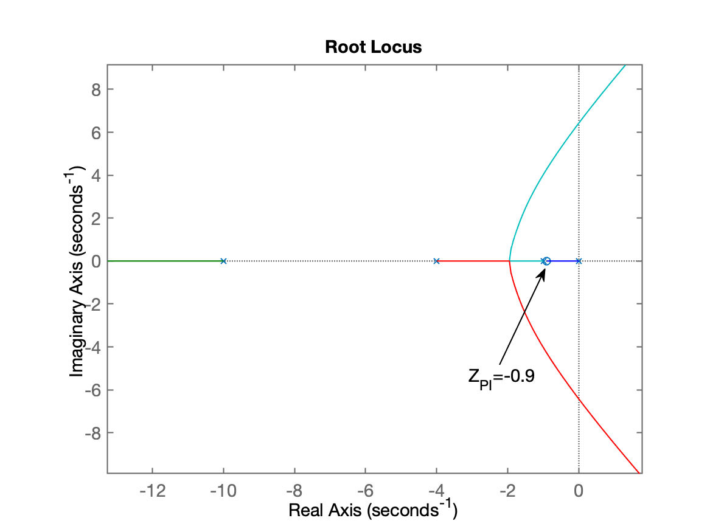
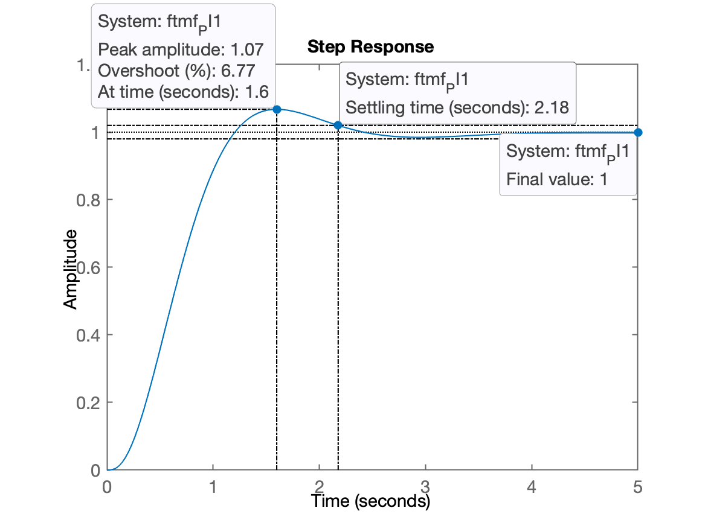
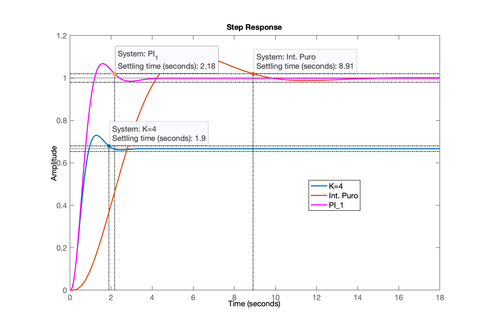
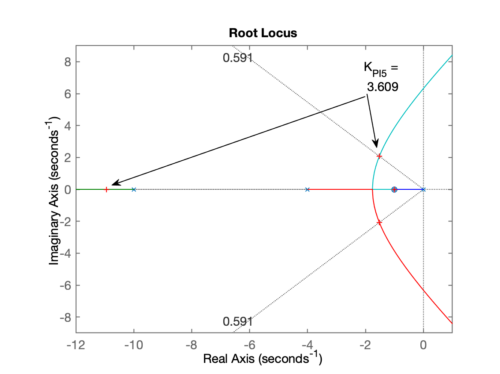
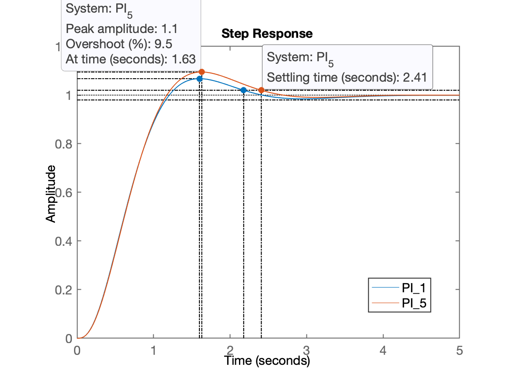
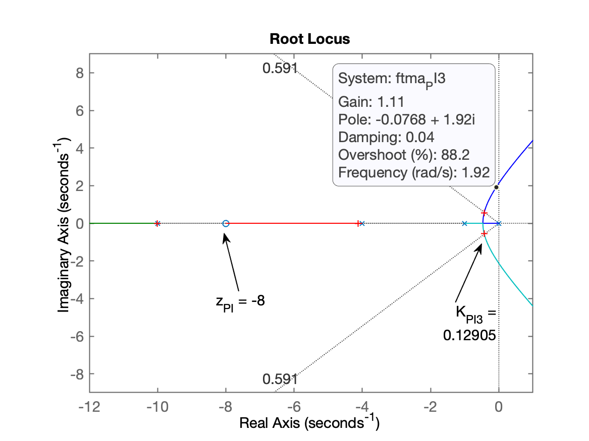
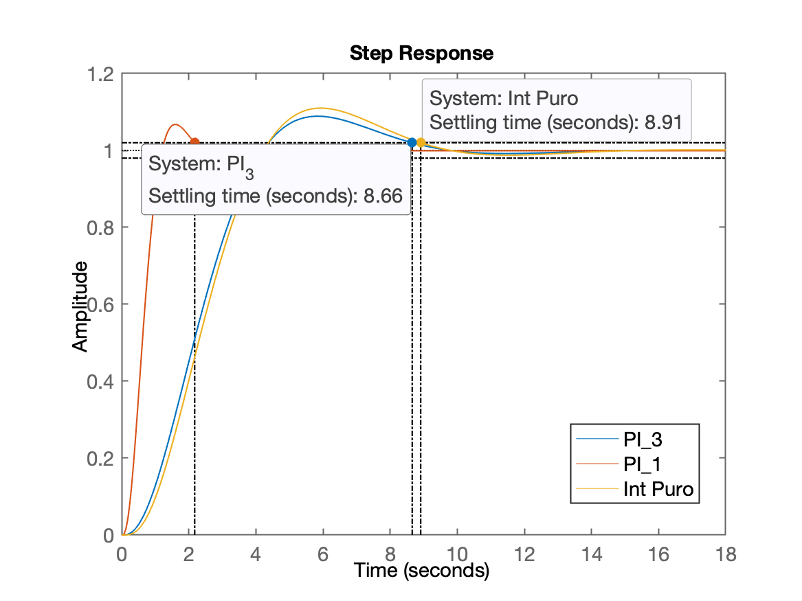
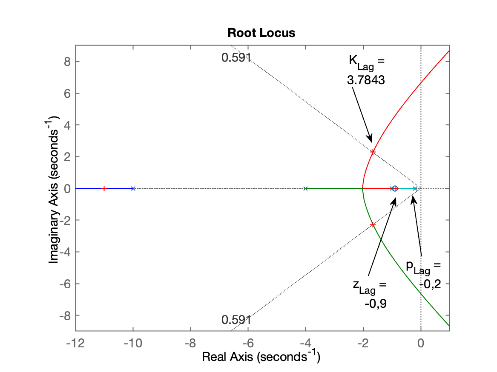
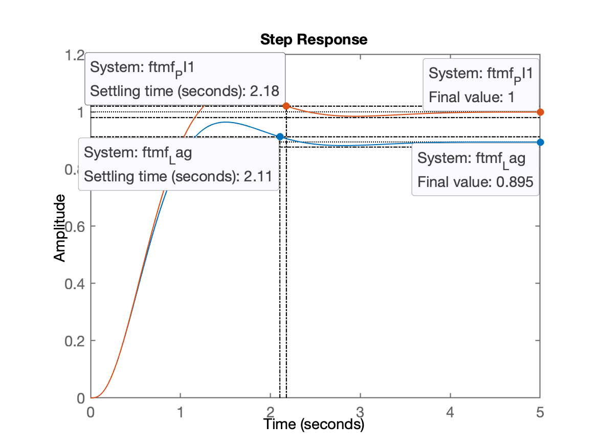

# Projeto Controladores

> Aula de 16/09/2024. Aula anterior: [aula de 09/09/2024](aula09092024.html).

Recordando da aula passada → embasamento teórico: 

* [Projeto de PI usando contribuição angular (versão antiga, de 2019/2)](https://fpassold.github.io/Controle_2/projeto_controladores_acao_integral_extendido.html) e
* [Projeto de PI (por contribuição angular) + Lag; (Aula de 30/10/2020](https://fpassold.github.io/Controle_2/PI_angular_Lag.html)].

[:musical_note:](https://www.youtube.com/watch?v=aUk3UeiMsw0)

Recomeçando da aula passada:

```matlab
>> load planta  % carregando dados da aula passada
>> zpk(G)       % recordando da planta

          20
  ------------------
  (s+10) (s+4) (s+1)
 
Continuous-time zero/pole/gain model.
```


## Projeto de Controlador PI

Eq. genérica do PI:

$C_{PI}=\dfrac{K_{PI}(s+z_{PI})}{s}$

Incognitas:

* Ganho do PI, $K_{PI}$ (determinado via RL);
* zero do PI, $z_{PI}$ -- à ser determinado usando alguma metodologia.

Raciocínio com opções para zero do PI:

> Esperada foto capturada do quadro branco com 4 esboços de locais possíveis para o zero do PI.


### Projeto do PI (Opção 1)

**Opção 1**: $-1 < z_{PI} < 0$ com $z_{PI}\cong -1$.

Montando eq. do PI:

```matlab
>> PI1=tf( [ 1  0.9] , [1 0])

PI1 =
 
  s + 0.9
  -------
     s
 
Continuous-time transfer function.

>> ftma_PI1=PI1*G;  % calculando eq. de malha-direta
>> zpk(ftma_PI1)    % verificando...
 
       20 (s+0.9)
  --------------------
  s (s+10) (s+4) (s+1)
 
Continuous-time zero/pole/gain model.

>> rlocus(ftma_PI1) % levantando RL para esta planta + controlador
```

Realizando zoom na região de interesse, obtemos o seguinte RL:



Sintonizando o controlador:

```matlab
>> hold on;
>> sgrid(zeta,0)
>> [K_PI1,polosMF]=rlocfind(ftma_PI1)
Select a point in the graphics window
selected_point =
      -1.5449 +     2.1478i
K_PI1 =
       3.7195
polosMF =
       -10.98 +          0i
      -1.5844 +     2.1577i
      -1.5844 -     2.1577i
     -0.85085 +          0i
```

Fechando a malha:

```matlab
>> ftmf_PI1=feedback(K_PI1*ftma_PI1, 1);
>> figure; step(ftmf_PI1)
>> stepinfo(ftmf_PI1)

        RiseTime: 0.75423
    SettlingTime: 2.1777
     SettlingMin: 0.91804
     SettlingMax: 1.0677
       Overshoot: 6.7667
      Undershoot: 0
            Peak: 1.0677
        PeakTime: 1.5986
```

Resposta ao degrau unitário obtida para este PI:



Comparando resposta com Controlador Integrador Puro e Proporcional

```matlab
>> figure; step(ftmf, ftmf_I2, ftmf_PI1)
>> legend('K=4', 'Int. Puro', 'PI_1')
```



Realizando projeto de outros PI's. Outros PI's promissores:

* Opção 5) $z_{PI}=-1$; cancelando o pólo mais lento do sistema;
* Opção 3) $-10 < z_{PI} < -4$.


### Projeto do PI (Opção 5)

**Opção 5)** $z_{PI}=-1$; cancelando o pólo mais lento do sistema (propositalmente ⚠️).

```matlab
>> PI5=tf( [ 1  1] , [1 0])

PI5 =
 
  s + 1
  -----
    s
 
Continuous-time transfer function.

>> ftma_PI5=PI5*G;
>> figure; rlocus(ftma_PI5)
>> % segue zoom na região de interesse:
>> axis([-12 1 -9 9])
>> hold on;
>> sgrid(zeta,0)
>> [K_PI5,polosMF]=rlocfind(ftma_PI5)
Select a point in the graphics window
selected_point =
      -1.5107 +     2.0619i
K_PI5 =
        3.609
polosMF =
      -10.949 +          0i
      -1.5256 +     2.0652i
      -1.5256 -     2.0652i
           -1 +          0i
>> zpk(ftma_PI5)    % verificando pólos e zeros da FTNMA(s) neste caso

        20 (s+1)
  --------------------
  s (s+10) (s+4) (s+1)
 
Continuous-time zero/pole/gain model.
```

RL obtido:



Fechando a malha:

```matlab
>> ftmf_PI5=feedback(K_PI5*ftma_PI5, 1);    % fechando a malha
>> figure; step(ftmf_PI1, ftmf_PI5) 
>> legend('PI_1', 'PI_5')
```

Resposta ao degrau unitário, comparando com PI anterior (opções 1 e 5):



### Projeto de PI (Opção 3)

**Opção 3)** $-10 < z_{PI} < -4$.

```matlab
>> PI3=tf( [ 1  8] , [1 0])

PI3 =
 
  s + 8
  -----
    s
 
Continuous-time transfer function.

>> ftma_PI3=PI3*G;
>> figure; rlocus(ftma_PI3)
>> % Zoom na região de interesse
>> axis([-12 1 -9 9])
>> hold on; sgrid(zeta,0)
>> [K_PI3,polosMF]=rlocfind(ftma_PI3)
Select a point in the graphics window
selected_point =
     -0.40166 +    0.55728i
K_PI3 =
      0.12905
polosMF =
       -10.01 +          0i
      -4.1315 +          0i
     -0.42946 +    0.56111i
     -0.42946 -    0.56111i
```

RL obtido mostrando ponto do RL com ponto de sintonização e outros detalhes:



Fechando a malha:

```matlab
>> ftmf_PI3=feedback(K_PI3*ftma_PI3, 1);
>> figure; step(ftmf_PI3, ftmf_PI1, ftmf_I2)
>> legend('PI_3', 'PI_1', 'Int Puro')
```

Resposta ao derau unitário comparando alguns controladores com ação integral: PI opção 1 e 3, e Integrador Puro:



**Alguns comentários**: note que o zero deste controlador (PI$_3$) tão afastado do eixo $j\omega$, praticamente transforma este PI num Integrador Puro.


## Projeto de "Lag"

Este é o Controlador por Atraso de Fase, "*Lag*", onde simplesmente o pólo sai da origem, deixando de ser um integrador, mas não se se afastando muito da origem. Quanto mais distante este pólo for localizado da origem maior será o erro em MF.

Lembrando da eq. do PI (opção 1):

$C_{PI_1}(s)=K\left( \dfrac{s+0,9}{s} \right)$

Podemos implementar um *lag* semelhante à este PI, removendo o pólo da origem e colocando o mesmo em $s=-0,2$ e então verificar o que acontece:

```matlab
>> % PI1=tf( [ 1  0.9] , [1 0])
>> Lag=tf( [1 0.9], [1 0.2])

Lag =
 
  s + 0.9
  -------
  s + 0.2
 
Continuous-time transfer function.

>> ftma_Lag=Lag*G;
>> zpk(ftma_Lag)

          20 (s+0.9)
  --------------------------
  (s+10) (s+4) (s+1) (s+0.2)
 
Continuous-time zero/pole/gain model.

>> figure; rlocus(ftma_Lag)
>> % realizando zoom na região de origem
>> axis([-12 1 -9 9])
>> hold on; sgrid(zeta,0)
>> [K_Lag,polosMF]=rlocfind(ftma_Lag)
Select a point in the graphics window
selected_point =
      -1.6647 +     2.2848i
K_Lag =
       3.7843
polosMF =
      -11.009 +          0i
      -1.6623 +     2.2842i
      -1.6623 -     2.2842i
     -0.86631 +          0i
```

Segue RL obtido mostrando ponto de sintonização deste controlador:



Fechando a malha:

```matlab
>> ftmf_Lag=feedback(K_Lag*ftma_Lag, 1);
>> figure; step(ftmf_Lag, ftmf_PI1)
```

Resposta ao degrau unitário obtida para o Lag, comparado com PI1:



Note o erro ocasionado pelo Lag! Mas uma resposta ligeiramente mais rápida.

Calculando o erro em regime permanente:

```matlab
>> dcgain(ftmf_Lag)
ans =
       0.8949
>> erro_Lag= ((1-dcgain(ftmf_Lag))/1)*100
erro_Lag =
        10.51
```

Fim, terminando esta seção de trabalho no Matlab, não esquecer de:

```matlab
>> save planta
>> diary off    % se você inicio os trabalhos com algo como diary aula16092024.txt
>> quit
```

----

Fernando Passold, em 16/09/2024.
