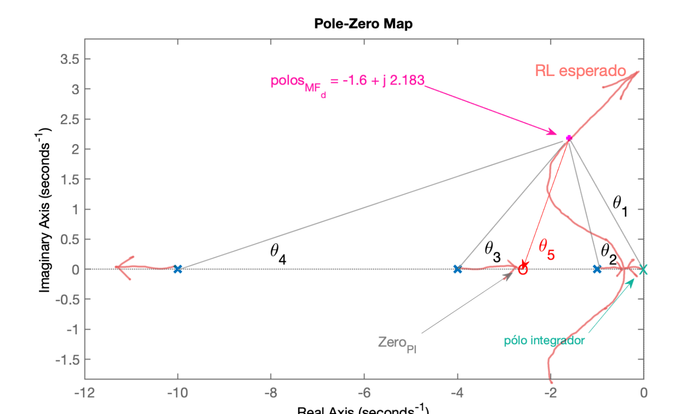
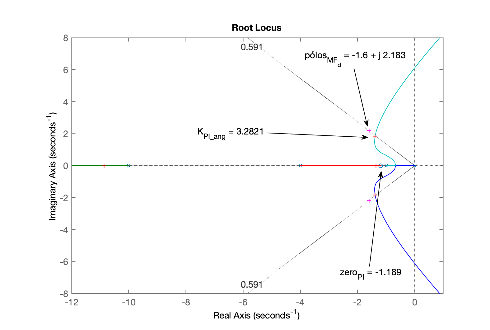

# Projeto de Controladores

> Aula de 23/09/2024. Continuação da [aula de 16/09/2024](aula16092024.html). Faltou realizar projeto de PI usando "==Contribuição Angular==" -- para parte teórica, ver: [Exemplo$_1$ (Aula de 20/05/2020)](https://fpassold.github.io/Controle_2/aula_20_05_2020/aula_20_05_2020.html).

[:musical_note:](https://www.youtube.com/watch?v=lyHjmsoTPuI)

Recomeçando trabalhos da aula anterior:

```matlab
>> load planta       % lembrando da planta
>> zpk(G)
 
          20
  ------------------
  (s+10) (s+4) (s+1)
 
Continuous-time zero/pole/gain model.
```

Idéia: aumentar valor do ganho proporcional em relação aos projetos anteriores onde foram usandos $K=4$ e $K=18$. O **objetivo** é encontrar um valor de tempo de assentamento razoável e factível para o projeto de um PI. Note que um PI nunca será tão rápido quanto um controlador proporcional. Mas o objetivo do PI é zerar o erro em regime permanente, o que não se obtêm através de um simples controlador proporcional. 

No primeiro caso, foi determinado $K=4$ para satisfazer $\%OS \le 10\%$ mas o Matlab determina o valor de $\%OS$ em relação ao valor em regime permanente atingido pela saída da planta, $y(\infty)$ que não corresponde ao valor desejado (de *setup point*; entrada degrau, onde o desejado seria: $y(\infty)=1$). E no outro caso, com $K=18$, foi obtido este valor de ganho para manter erro abaixo de 10% às custas de uma resposta bastante oscilatória (revisar [aula de 16/09/2024](aula16092024.html) se for o caso, note que $t_s$ aumentou consideravelmente). 

O ideal seria encontrar um valor de ganho que atendesse ao sobressinal máximo estipulado mas em relaçao á entrada degrau unitário (referência usada), o que significa: $y(t)\vert_{t_p} = 1,1$ -- mas não queremos perder muito tentando encontrar este valor de ganho (mais tarde, aprenderemos a usar a ferramente gráfica: "*==Control System Designer==*" disponibilizada no *Control Systems Toolbox* do Matlab). Arbitrando um valor intermediário de ganho:

```matlab
>> (18+4)/2		% simples média aritmética
ans =
    11

>> K3=11; 		% expectativa de resposta não tão oscilatória
>> ftmf_K3=feedback(K3*G, 1);
>> figure; step(ftmf_K3, ftmf)
>> legend('K=11', 'K=4')
```

Comparando o desempenho de controladores proporcionais com ganho $K=11$ e $K=4$.


O último gráfico permite inferir que um bom valor de $t_s$ para um PI seria: $2 < t_s < 3$ segundos.

Para rever equações para cálculo dos pólos complexos associados com **Resposta de sistemas sub-amortecidos de segunda-ordem em malha-fechada**, com certo $\zeta$ e $t_s$ rever: [Root_Locus_3a_parte_pt_2019_1.pdf](https://fpassold.github.io/Controle_2/5_respostas/Root_Locus_3a_parte_pt_2019_1.pdf).

Lembrando que:

$t_s=\dfrac{4}{\zeta \omega_n}$

Desta eq. consigue-se isolar o $\omega_n$ (em função de um $t_s$ especificado) e então calcular o $\omega_d=$ parte imaginária do pólo complexo que caracteriza a resposta sub-amortecida:

$\omega_n=\dfrac{4}{t_s \cdot \zeta}$

Realizando os cálculos:

```matlab
>> ts=2.5;    % parece um valor tangível
>> wn=4/(zeta*ts)
wn =
       2.7066
>> numerador=-log(0.02*sqrt(1-zeta^2))    % considerando eq. mais precisa de t_s
numerador =
        4.127
>> wd=wn*sqrt(1-zeta^2)     % determinando parte imaginária dos pólos complexos
wd =
        2.183
>> sigma=wn*zeta            % calculando parte real dos pólos complexos
sigma =
          1.6
>> polos_MFd=[-sigma+i*wd  -sigma-i*wd]
polos_MFd =
  Column 1
         -1.6 +      2.183i
  Column 2
         -1.6 -      2.183i
```

Mostrando graficamento onde ficará localizado estes pólos de MF com a planta e controlador pretendido:

```matlab
>> figure; pzmap(G)
>> hold on
>> plot(polos_MFd, 'm+')
>> ylim([-2.5 2.5])
```

Gráfico dos pólos no plano-s, mostrando esboço da contribuição angular para o RL esperado para este projeto:


Note que teremos um RL como:



Continuando com cálculos dos ângulos entre pólo complexo de MF por onde queremos que passe o RL e pólos e zeros existentes na $FTMA(s)$ deste sistema:

```matlab
>> ylim([-0.5 2.5])
>> % Calculando os ângulos
>> th1=atan2(wd, -sigma)    % gera angulo em radianos
th1 =
       2.2033
>> th1_deg=th1*180/pi       % valor em graus
th1_deg =
       126.24
>> axis equal               % se você quiser confirmar os graus com transferidor na tela do PC
>> 
>> detal_x=sigma-1          % p/cálculo do \theta_2
detal_x =
          0.6
>> th2=atan2(wd, -detal_x)
th2 =
        1.839
>> th2_deg=th2*180/pi
th2_deg =
       105.37
>>
>> delta_x= 4 - sigma       % p/cálculo do theta_3
delta_x =
          2.4
>> th3=atan2(wd, delta_x)
th3 =
      0.73809
>> th3_deg=th3*180/pi
th3_deg =
       42.289
>>
>> delta_x= 20 - sigma      % p/cálculo do theta4
delta_x =
         18.4
>> th4=atan2(wd, delta_x)
th4 =
      0.11809
>> th4_deg=th4*180/pi
th4_deg =
        6.766
>>
>> % Calculando soma dos ângulos dos pólos
>> sum_th_polos=th1+th2+th3+th4 % em radianos
sum_th_polos =
       4.8985
>> sum_th_polos_deg=sum_th_polos*180/pi   % valor em graus
sum_th_polos_deg =
       280.66
>> th_zero= -180 + sum_th_polos_deg       % resultado em graus
th_zero =
       100.66
>> th_zero= -pi/2 + sum_th_polos          % resultado em radianos
th_zero =
       3.3277
>> th_zero= -pi + sum_th_polos            % resultado em radianos
th_zero =
       1.7569
>> delta_x = wd/tan(th_zero)              % delta_x para o zero do PI
delta_x =
       -0.411
>> zero_PI = -(sigma + delta_x)
zero_PI =
       -1.189
>>
>> % Determinando a `tf` deste PI
>> PI_ang=tf(  [1 -zero_PI], [1 0 ] )

PI_ang =
 
  s + 1.189
  ---------
      s
 
Continuous-time transfer function.

>> ftma_PI_ang=PI_ang*G;
>> zpk(ftma_PI_ang)         % apenas para verificação

ans =
 
      20 (s+1.189)
  --------------------
  s (s+10) (s+4) (s+1)
 
Continuous-time zero/pole/gain model.

>> % Note que o zero do PI neste caso, caso cancelou o pólo mais lento da planta!
>> figure; rlocus(ftma_PI_ang)
>> hold on;
>> plot(polos_MFd, 'm+')
>> % zoom na região de interesse:
>> axis([-12 1 -8 8])
>> 
>> [K_PI_ang,polosMF]=rlocfind(ftma_PI_ang)
Select a point in the graphics window
selected_point =
      -0.6481 +     1.9319i
K_PI_ang =
       3.6843
polosMF =
       -10.95 +          0i
      -1.3629 +     2.0456i
      -1.3629 -     2.0456i
      -1.3243 +          0i
>> figure; rlocus(ftma_PI_ang)
>> hold on;
>> plot(polos_MFd, 'm+')
>> axis([-12 1 -8 8])
>> sgrid(zeta,0)
>> [K_PI_ang,polosMF]=rlocfind(ftma_PI_ang)
Select a point in the graphics window
selected_point =
      -1.3874 +     1.8328i
K_PI_ang =
       3.2821
polosMF =
      -10.863 +          0i
      -1.3891 +      1.833i
      -1.3891 -      1.833i
      -1.3582 +          0i
```

RL final para este PI, mostrando detalhes do projeto e ponto escolhido para ganho do mesmo:



Fechando a malha:

```matlab
>> ftmf_PI_ang=feedback(K_PI_ang*ftma_PI_ang, 1);
>> figure; step(ftmf_PI_ang, ftmf_PI1)
>> legend('PI_ang', 'PI 1')
```

Gráfico da resposta ao degrau deste PI comparado com PI 1 determinado em aula passada:


```matlab
>> stepinfo(ftmf_PI_ang)

        RiseTime: 0.75146
    SettlingTime: 2.7571
     SettlingMin: 0.91748
     SettlingMax: 1.1349
       Overshoot: 13.492
      Undershoot: 0
            Peak: 1.1349
        PeakTime: 1.7292
```

### Outros PI's!?

**Questão**: E se o usuário especificar um $t_s$ baixo demais? Isto é, um $t_s$ irealizável?

Vai suceder o que aconteceu no projeto do PI por contribuição angular trabalhando com $t_s$ muito baixo: [Exemplo$_3$ (Aula de 14/05/2021)](https://fpassold.github.io/Controle_2/controle_2_info_2021_1/aula_14_05_2021.html).

O método da contribuição angular vai acabar resultando na determinação de um zero "instável" (ou com parte real positiva). O problema não é ste zero, mas o impacto causado por ele no RL ou no sistema em malha-fechada. Este zero "instável" vai atrair o pólo do integrador (que já está na origem do plano-s), na direção do $s \to +\infty$, justamente para a região de resposta instável no plano-s. De fato é o que ocorre e pode ser visto no final de: [Exemplo$_3$ (Aula de 14/05/2021)](https://fpassold.github.io/Controle_2/controle_2_info_2021_1/aula_14_05_2021.html).

Encerrando os trabalhos nesta aula:

```matlab
>> save planta
>> diary off
>> quit
```

[:musical_note:](https://www.youtube.com/watch?v=8IaY1mbqRM8&list=RD8IaY1mbqRM8&start_radio=1)

----

Fernando Passold, em 23/09/2024
