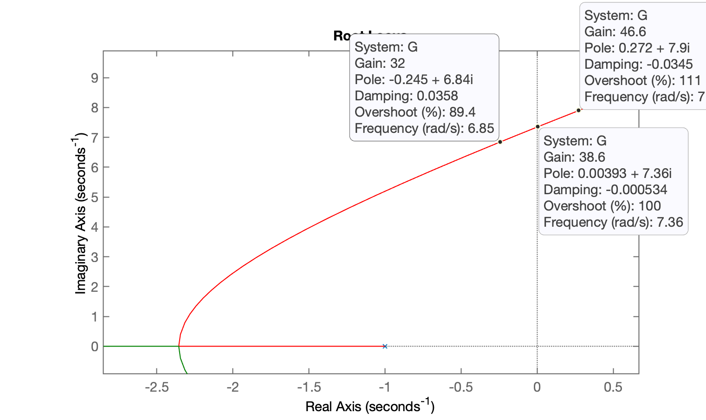
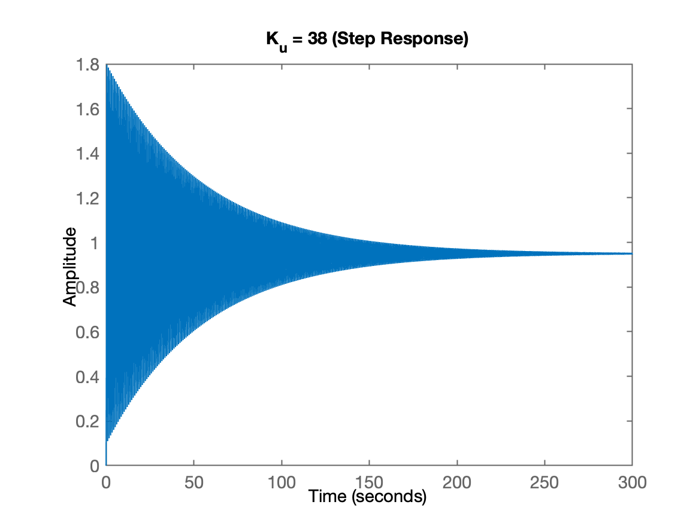
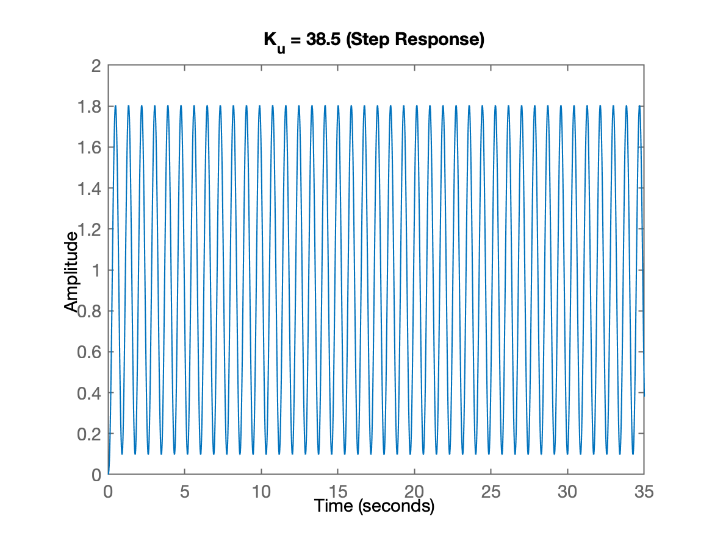
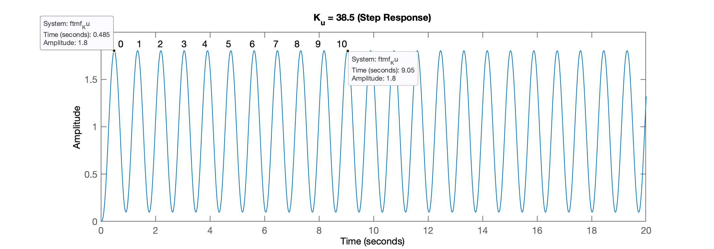
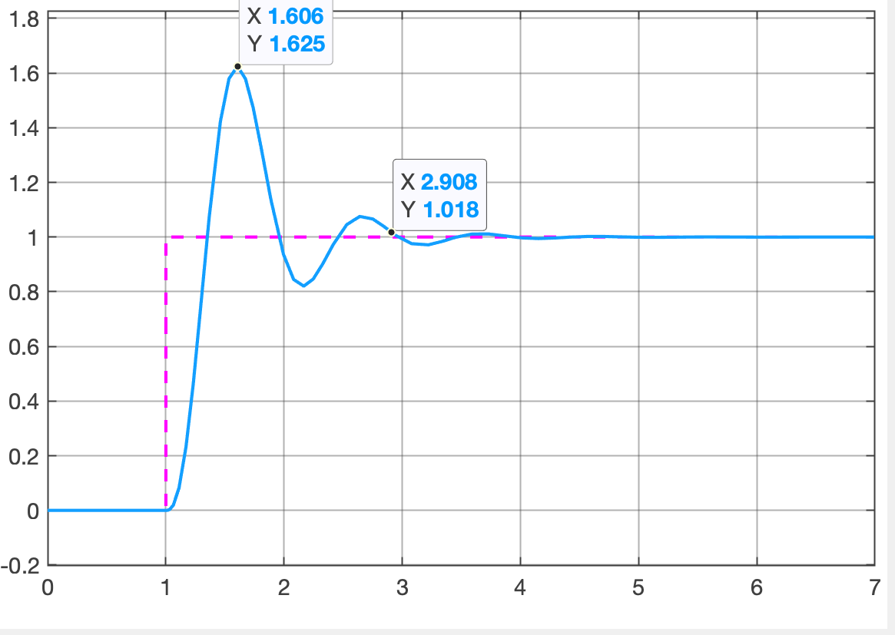
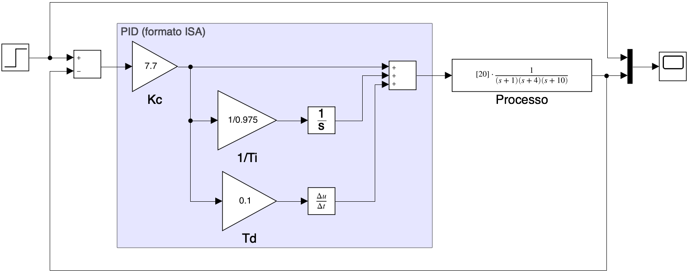
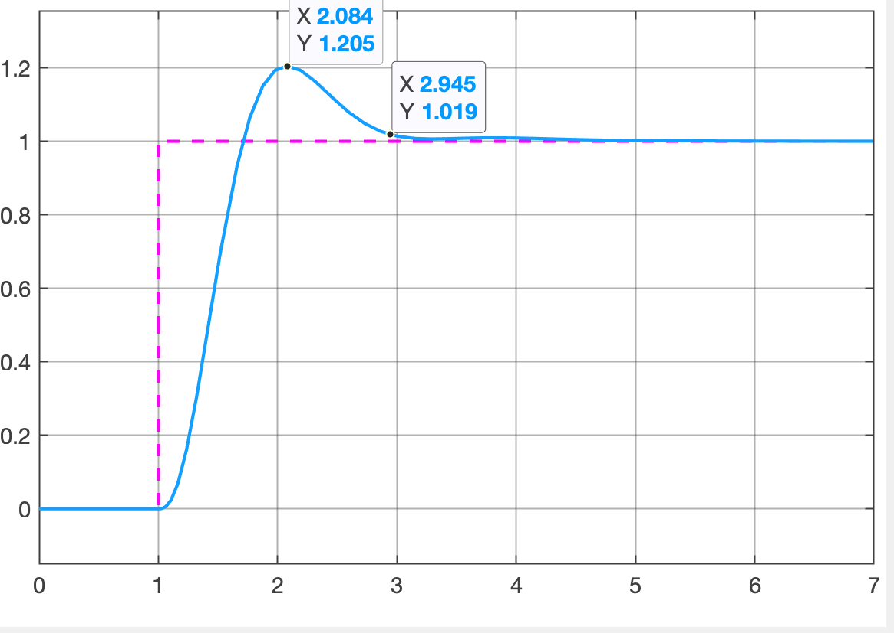
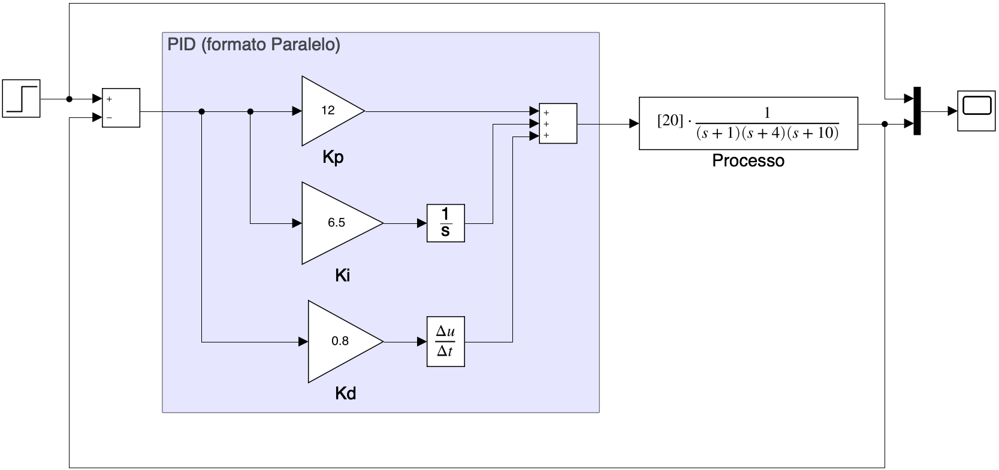
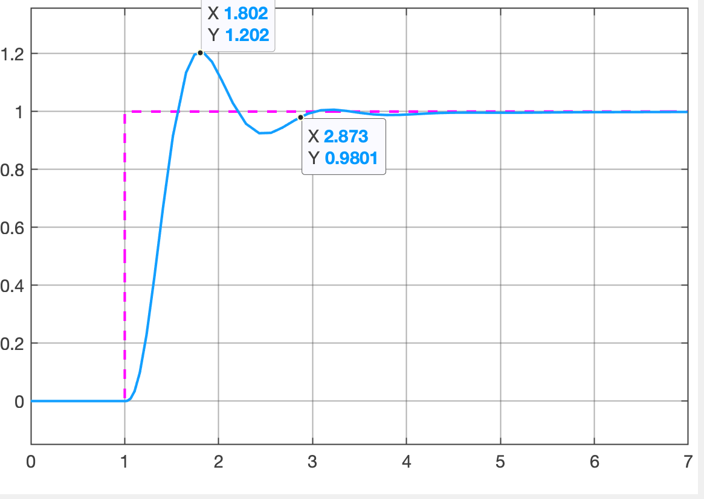

[😎](https://youtu.be/qRep51bSCQM?si=dmru5ZF4gO9MFfoy)

# Sintonia Prática de PID

>  Aula de 28/10/2024. Reiniciando da aula passada ([aula de 21/10/2024](aula_21Oct2024.html)). Arquivo [planta.mat](planta.mat) disponível.

```matlab
>> diary aula_28Oct2024.txt
>> load planta
>> zpk(G)   % Lembrando da planta
 
          20
  ------------------
  (s+10) (s+4) (s+1)
 
Continuous-time zero/pole/gain model.
```

Sintonizando PID usando método de Ziegler-Nichols (teoria: ver: [Sintonia de PIDs usando Ziegler Nichols](https://fpassold.github.io/Controle_2/8_Ajuste_PID/Sintonia_PIDs_usando_ZN.html)).

Buscando o $K_u$ usando RL:

```matlab 
>> rlocus(G)
```



Percebemos que: $32 < K_u < 38,6$. Testando valores:

```matlab
>> Ku=38;
>> ftmf_Ku=feedback(Ku*G,1);
>> figure; step(ftmf_Ku)
>> title('K_u = 38 (Step Response)')
```

Para este ganho obtemos a seguinte resposta:



Aumentando um pouco o ganho:

```matlab
>> Ku=38.5;
>> ftmf_Ku=feedback(Ku*G,1);
>> figure; step(ftmf_Ku)
>> title('K_u = 38.5 (Step Response)')
```

E agora obtemos a resposta:



Necessitamos identificar agora o período de oscilação, $T_u$:

```matlab 
>> xlim([0 20]) % restringindo a um período um pouco menor
```

Nova figura:



```matlab
>> T_ini        % variável criada da exportação dos DataTips da figura
T_ini = 
  1×2 struct array with fields:
    Target
    Position
    DataIndex
>> T_ini.Position   % verificando os dados
ans =
       9.0507       1.8016
ans =
      0.48508       1.8037
>> 
>> delta_T = 9.0507 - 0.48508
delta_T =
       8.5656
>> Tu = delta_T/10
Tu =
      0.85656
```

### PID no formato ISA

Consultando tabela de Ziegler-Nichols: [Página Wiki](https://en.wikipedia.org/wiki/Ziegler–Nichols_method) e determinando valores para PID no formato "ISA":

```matlab
>> Kp_ZH=0.6*Ku
Kp_ZH =
         23.1
>> Ti_ZH=0.5*Tu
Ti_ZH =
      0.42828
>> Td_ZH=0.125*Tu
Td_ZH =
      0.10707
```

Substituindo estes valores no diagrama de blocos [`sintonia_PID_exemplo.slx`](https://fpassold.github.io/Controle_2/8_Ajuste_PID/sintonia_PID_exemplo.slx) no Simulink vamos encontrar uma resposta (inicial) como:



Como previsto, o $\%OS$ resultou bem elevado ($+60\%$). Falta realizar um "ajuste fino" deste PID modificando seus valores:

```matlab 
>> Kp_PID2 = 0.33*Ku
Kp_PID2 =
       12.705
>> Td_PID2 = 0.33*Tu
Td_PID2 =
      0.28267
>> Ti_PID2 = Ti_ZH
Ti_PID2 =
      0.42828
>> Kp_PID2 = 0.20*Ku
Kp_PID2 =
          7.7
>> Td_PID2 = 0.4; % provavelmente reduz %OS
>> % Simulando ("play")
>> % Salvando diagrama de blocos num arquivo .png:
>> print ('-ssintonia_PID_exemplo', '-dpng', '-r150', 'sintonia_PID_exemplo.png')
```

Acabamos ficando com o seguinte PID sintonizado:



Obtendo como resposta:



Resultando em:

* $\%OS \cong 20\%$;
* $t_s \cong 1,945$ segundos ($2,945 - 1$);
* $e(\infty)=0$.


### PID no Formato Paralelo

Testando PID no formato paralelo, arquivo: [`sintonia_PID_paralelo.slx`](sintonia_PID_paralelo.slx).

Recalculando parâmetros deste PID:

```matlab
>> Ki_PID3 = 7.7/0.975
Ki_PID3 =
       7.8974
>> Kd_PID3 = 7.7/0.1
Kd_PID3 =
    77
>> 
>> Kp_PID3 = 0.2*Ku
Kp_PID3 =
          7.7
>> Ki_PID3 = 0.4*Ku/Tu
Ki_PID3 =
       17.979
>> Kd_PID3 = 0.066*Ku*Tu
Kd_PID3 =
       2.1765
>> % Salavando PID (janela do Simulink) em arquivo .png
>> print ('-ssintonia_PID_paralelo', '-dpng', '-r150', 'sintonia_PID_paralelo.png')
```

Finalmente obtemos um PID no formato paralelo como:



Com a seguinte resposta ao degrau:



Resultando em:

* $\%OS \cong 20\%$;
* $t_s \cong 1,873$ segundos ($2,873-1$);
* $e(\infty)=0$.

----

Encerrando seção de trabalho deste dia:

```matlab
>> save planta
>> diary off
>> quit
```

----

<font size="2">🌊 [Fernando Passold](https://fpassold.github.io/)[ 📬 ](mailto:fpassold@gmail.com), <script language="JavaScript"><!-- Hide JavaScript...
var LastUpdated = document.lastModified;
document.writeln ("página criada em Oct 28, 2024; atualizada em " + LastUpdated); // End Hiding -->
</script></font>