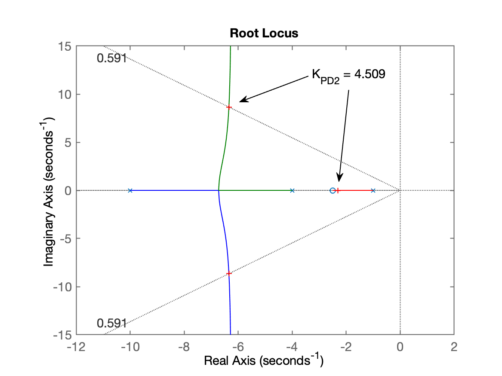
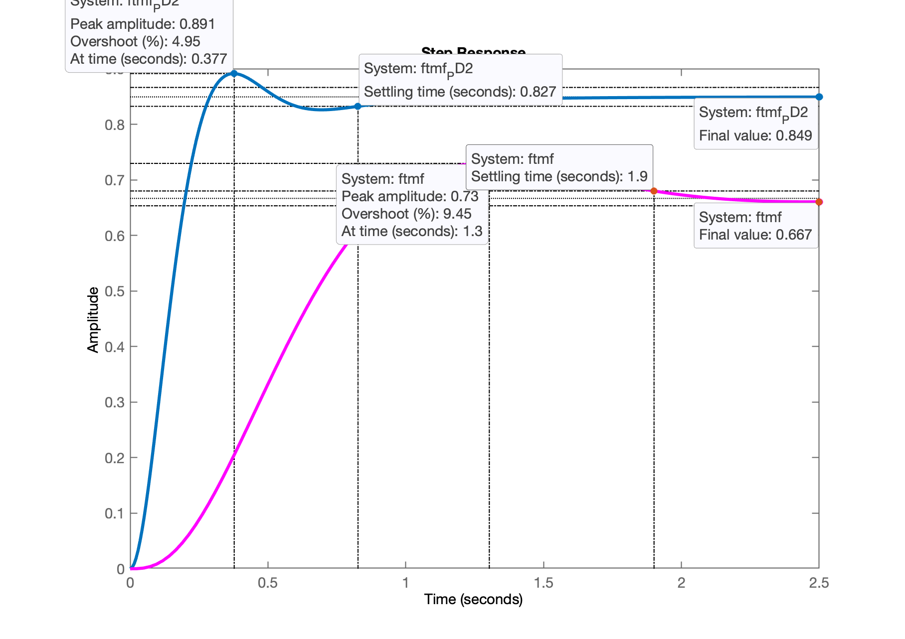
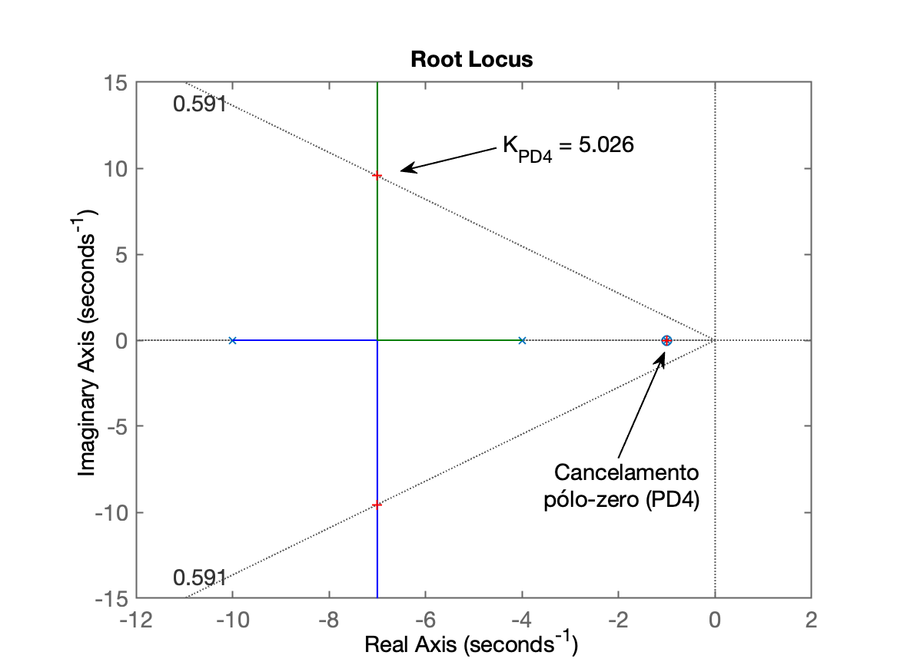
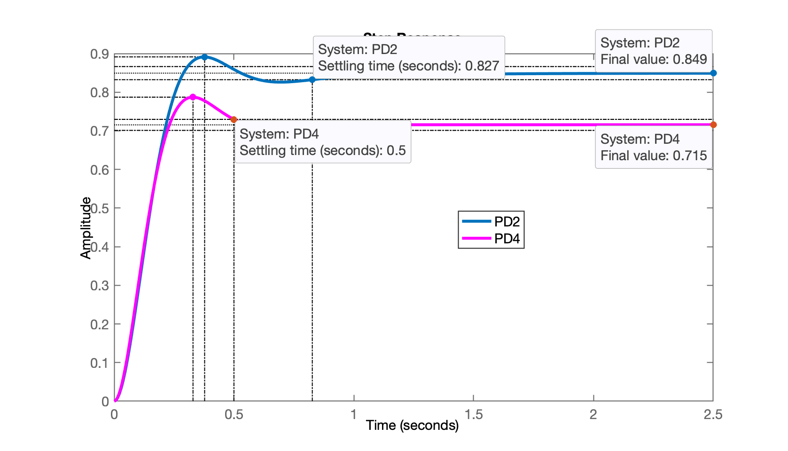

# Projeto de Controladores

Aula ministrada em 30/09/2024. Continuação da [aula de 23/09/2024](aula_23092024.html).

## Embasamento teórico sobre Controladores com Ação Derivativa

* Ação Derivativa ([Derivador Puro?](https://fpassold.github.io/Controle_2/Acao_Derivativa.html) Simulações, cuidados e atenção);
* Ação Derivativa na presença de sinal ruidoso ([Aula de 11/11/2022](https://fpassold.github.io/Controle_2/Exemplo_ruido_acao_derivativa/circuito_derivativo.html));
* Teoria à respeito de Compensador por Avanço de Fase (Lead) ([Aula de 02/06/2021](https://fpassold.github.io/Controle_2/Teoria_PD_Lead/acoes_derivativas.html)).

## Projeto de PD

Recuperando seção de trabalho anterior:

```matlab
>> pwd  % verificando pasta atual onde dados estão gravados
ans =
    '/Volumes/DADOS/Users/fpassold/Documents/UPF/Controle_2/2024_2'
>> load planta  % carregando dados da seção de trabalho anterior
>> diary aula_30092024.txt  % iniciando registro desta aula
```

Lembrando da eq. da planta:

```matlab
>> zpk(G)

          20
  ------------------
  (s+10) (s+4) (s+1)
 
Continuous-time zero/pole/gain model.
```

Eq. genérica do PD:

$C_{PD}(s)=K_p + K_d s = K \left( z + z_{PD}\right)$

onde: $K=$ ganho genérico do controlador (definido com auxílio do RL); $z_{PD}=$ zero do controlador PD -- incógnita atual. 

Seguem esboços de RL para diferentes opções de locais para o zero do PD. Para ver opções (casos semelhantes, recomenda-se verificar o item "[Projeto de PD (Aula de 03/10/2019](https://fpassold.github.io/Controle_2/aula_PD_03out2019.html)").

Opções:

* **Opçao 1**: $0 < z_{PD} < -1$: mas neste caso teremos um pólo de MF real muito próximo do eixo $j\omega$, atrasando muito a resposta do sistema;
* **Opção 2**: $-1 < z_{PD} < -4$: resulta um pólo de MF real dominante mais afastado do eixo $j\omega.$ Na prática, seria a ==melhor opção==.
* **Opção 3**: $z_{PD}=-4$ (cancelando o 2o-pólo mais lento da planta). Resulta num sistema em MF de 2a-ordem (redução de complexidade do sistema).
* **Opção 4**: $z_{PD}= -1$ (cancelando o pólo mais lento da planta). Resulta num sistema em MF de 2a-ordem e mais rápido que opção 3. Ao menos teoricamente, supondo que os pólos estejam realmente em $s=-1$, $s=-4$ e que o sistema não possua não linearidades).

### PD Opção 2

Neste caso: $-4 < z_{PD} < -1$. Arbitrando um local gemétrico intermediário:

```matlab
>> (1+4)/2
ans =
          2.5

>> PD2 = tf( [1 2.5], 1)

PD2 =
 
  s + 2.5
 
Continuous-time transfer function.

>> ftma_PD2 = PD2*G;
>> zpk(ftma_PD2)

      20 (s+2.5)
  ------------------
  (s+10) (s+4) (s+1)
 
Continuous-time zero/pole/gain model.

>> rlocus(ftma_PD2)
>> hold on; sgrid(zeta,0)
>> [K_PD2,polosMF]=rlocfind(ftma_PD2)
Select a point in the graphics window
selected_point =
      -6.3768 +     8.6378i
K_PD2 =
        4.509
polosMF =
      -6.3444 +     8.6372i
      -6.3444 -     8.6372i
      -2.3112 +          0i
```

Obtemos o RL abaixo, já ressaltando pontos de sintonia e outros detalhes:



```matlab
ftmf_PD2=feedback(K_PD2*ftma_PD2, 1);   % fechando a malha
figure; step(ftmf_PD2, ftmf)
```

Obtemos a seguinte resposta ao degrau para este PD, comparando sua resposta com controlador Porporcional realizado na [aula de 09/09/2024](aula09092024.html).



**Comentários:**

* Poderia ser aumentado o ganho deste PD, já que o $\%OS$ ficou abaixo dos 10% em relação à entrada degrau (implica $y(t)\vert_{t_p}=1,1$ já que a referência é entrada degrau unitário, então $y(\infty)_{desejado}=1,0$);
* Mas é mais interessante deslocar o zero do PD para mais próximo do pólo da planta em $s = -4$ (revisar RL), o que resultaria num pólo de MF real dominante mais afastado do eixo $j\omega$ (mais rápido).

### Projeto do PD (pção 4)

O PD mais rápido, em teoria, seria obtido fazendo o zero do PD propositalmente cancelar o pólo mais lento da planta em $s=-1$.

```matlab
>> PD4 = tf( [1 1], 1)

PD4 =
 
  s + 1
 
Continuous-time transfer function.

>> ftma_PD4=PD4*G;
>> zpk(ftma_PD4)

       20 (s+1)
  ------------------
  (s+10) (s+4) (s+1)
 
Continuous-time zero/pole/gain model.

>> ftma_PD4aux=minreal(ftma_PD4);
>> zpk(ftma_PD4aux)

       20
  ------------
  (s+10) (s+4)
 
Continuous-time zero/pole/gain model.

>> figure; rlocus(ftma_PD4)
>> hold on; sgrid(zeta,0)
>> ylim([-15 15])   % usando mesmos limites que RL obtido anteriormente (para comparação visual)
>> [K_PD4,polosMF]=rlocfind(ftma_PD4)
Select a point in the graphics window
selected_point =
      -7.0071 +     9.5666i
K_PD4 =
        5.026
polosMF =
           -7 +     9.5666i
           -7 -     9.5666i
           -1 +          0i
```

RL obtido para este controlador:



```matlab
>> % fechando a malha
>> ftmf_PD4=feedback(K_PD4*ftma_PD4, 1);
>> figure; step(ftmf_PD2, ftmf_PD4)
>> legend('PD2', 'PD4')
```

Resposta em MF para entrada degrau, comparada com PD da opção 2:



**Comentários:**

* Pode-se aumentar ainda mais o ganho do PD4, neste caso, acompanhando o que aconteceria no RL, vamos perceber que reduzimos o valor de $t_p$ (parte imaginária dos pólos complexos de MF "sobe"), mas $t_s$ se manteria no mesmo valor, já que a parte real dos pólos de MF não varia de valor. **Mas** o que importa neste caso é que o erro de regime permante deve ser sensivelmente reduzido (é o que normalmente acontece quando se eleva o ganho para sistemas tipo 0 -- ver [Teoria do Erro](https://fpassold.github.io/Controle_2/3_erros/erros.pdf));

* Porém note que o erro do PD4 é maior que o erro do PD2. O PD4 pode ser mais rápido que o PD2, mas com o ganho `K_PD4` no valor que está, resulta num erro muito maior:

  ```matlab
  >> erro_PD4= ((1-dcgain(ftmf_PD4))/1)*100
  erro_PD4 =
         28.466
  >> erro_PD2= ((1-dcgain(ftmf_PD2))/1)*100
  erro_PD2 =
         15.069
  ```

**Observação final**:

Para próxima aula, a idéia é usar o "**App Control System Desginer**" do Matlab, para facilitar e acelerar o projeto de controladores. Neste caso, podemos melhorar o PD2, testando seu zero mais próximo de $s=-4$, para intencionalmente fazer o pólo de MF real dominante se afastar ainda mais do eixo $j\omega$ (menor tempo de resposta, menor $t_s$) e ainda encontrar um valor de ganho elevado que permita fazer $y(\infty)\vert_{t_p} \cong 1,1$ (10% de overshoot em relação à entrada degrau). E assim estaríamos projetando o melhor PD prático para este tipo de sistema.

Encerrando atividades nesta aula:

```matlab
>> save planta
>> diary off
>> quit
```

---

<font size="2">🌊 [Fernando Passold](https://fpassold.github.io/)[ 📬 ](mailto:fpassold@gmail.com), <script language="JavaScript"><!-- Hide JavaScript...
var LastUpdated = document.lastModified;
document.writeln ("página criada em 09 Sept 2024; atualizada em " + LastUpdated); // End Hiding -->
</script></font>
