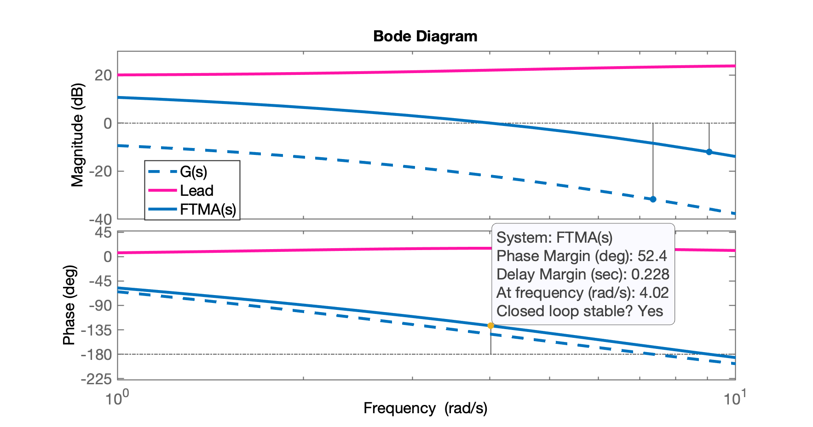

# Projeto no Domínio Frequência

> Aula de 18/11/2024

## Projeto de Controlador de Avanço de Fase

Neste caso considerando a planta do estudo de caso:

```matlab
>> load planta	% carregando dados da planta (e projetos anteriores)
>> zpk(G)
 
          20
  ------------------
  (s+10) (s+4) (s+1)
 
Continuous-time zero/pole/gain model.
```

Propondo especificações de controle:

* $\phi_m$ desejado: $58^o$ (resulta em $\%OS \cong 10\%$ -- ver [[Tabela $\zeta \times \%OS \times \Phi_m$]](https://fpassold.github.io/Controle_2/projeto_bode_01.html#tabelas-zeta-times-phim-times-os));
* Margem de ganho desejada de 6 dB (ver [[Normas militares aviação]](https://fpassold.github.io/Controle_2/10_bode/aula_bode_lag.html#curiosidade-normas-de-aviação-americanas))
* erro de 17%.

Como trata-se de um sistema tipo 0, neste caso necessitamos calcular o ganho estático de posição, $K_p$ associado com entrada degrau, $e_{Degrau}(\infty)$ (rever [Teoria do Erro](https://fpassold.github.io/Controle_2/3_erros/erros.pdf)), para inicialmente determinar o ganho $K$ que deve ser adotado neste sistema para tentar garantir o erro máximo especificado:

$e_{Degrau}(\infty) \le 17\%$

$e_{Degrau}(\infty)=\dfrac{1}{1+K_p}$

ou isolando $K_p$ necessário em função do $e_{Degrau}(\infty)$ especificado:

$K_p=\dfrac{1-e(\infty)}{e(\infty)}$

Mas $K_p$ original do sistema é dado por:

$K_p=\displaystyle\lim_{s \to 0} FTMA(s)= K \cdot \displaystyle\lim_{s \to 0} G(s)$

Calculando $K$ necessário para $e_{Degrau}(\infty)$ especificado:

```matlab
>> % erro de 17%.
>> Kp=(1-0.17)/0.17
Kp =
       4.8824
>> 
>> dcgain(G)	% resultado de lim_{s \to 0} G(s)
ans =
          0.5
>> K=Kp/dcgain(G)
K =
       9.7647
```

Traçando Diagrama de Bode para observar margem de fase de $G_1(s)=K\cdot G(s)$:

```matlab
>> G1=K*G;
>> figure; bode(G1)
```


Notamos que $G_1(s)$ possui Margem de fase de $47,5^o$. São desejados $58^o$, então falta:

```matlab
>> 58-47.5
ans =
         10.5
>> 10.5+5	% acrescentando mais 5 graus em função do acréscimo do Lead...
ans =
         15.5
```

O Lead deve contribrui (avançar a fase) em $15,5^o$. Podemos prosseguir determinando o fator $\alpha$ que define a "distânica" necessária entre o zero e o pólo do Lead:

```matlab
>> % 15,5 graus avanço de fase requerido do Lead
>> aux=sin(15.5*pi/180)
aux =
      0.26724
>> alpha=(1-aux)/(1+aux)
alpha =
      0.57824
>> % distância entre zero e polo do Lead = 1/alpha
>> 1/alpha
ans =
       1.7294
```

Agora temos que considerar o incremento de ganho provocado pelo Lead com com este fator $\alpha$ e "compensar" este acréscimo considerando o Diagrama de Bode de $G_1(s)$ descobrindo em que frequência, $\omega_c = \omega_m$ ocorre esta compensação:

```matlab
>> % Com este alpha qual o incremente de ganho causado pelo Lead?
>> ganho=1/sqrt(alpha)
ganho =
       1.3151
>> 20*log10(ganho)
ans =
        2.379
>> % Buscando onde |G1(s)| "cai" 2,379 dB
>> xlim([1 10])
```


Percebe-se que $|G_1(j\omega)|$ "cai" 2,379 db em: $3,99 < \omega_m < 4,67$ rad/s. Definindo $\omega_m = 4,25$ rad/se e calculando posições dos zero e pólo do controlador, teremos:

```matlab
>> % Frequência do wc ou wm (da contribuição angular):
>> % 3,99 < w_m < 4,67
>> wm=4.25;
>> zero=sqrt(alpha)*wm
zero =
       3.2318
>> polo=wm/sqrt(alpha)
polo =
        5.589
>> C=tf( [1  zero], [1  polo] );
>> zpk(C)
 
  (s+3.232)
  ---------
  (s+5.589)
 
Continuous-time zero/pole/gain model.

>> % Por curiosidade, ganho DC deste controlador
>> dcgain(C)
ans =
      0.57824
```

Temos que definir o ganho do controlador para garantir o $K$ inicialmente definido:

```matlab
>> Kc=K/alpha
Kc =
       16.887
>> C=tf( Kc*[1  zero], [1  polo] );
```

A eq. final do controlador fica:

$C_{Lead}(s)=\dfrac{16,887 (s+3.232)}{ (s+5.589) }$

Calculando a $FTMA(s)$ final e verficando a $\phi_m$ final obtida:

```matlab
>> % calculando FTMA(s) final com controlador...
>> ftma=C*G;
>> figure; bode(G, C, ftma)
>> xlim([1 10])
>> legend('G(s)', 'Lead', 'FTMA(s)')
```



Notamos que $\phi_m$ final $=52,4^o$ (era desejado $58^o$).

Confirmando erro de regime permanente:

```matlab
>> ftmf=feedback(ftma, 1);
>> figure; step(ftmf)
>> erro = ((1-dcgain(ftmf))/1)*100
erro =
           17
```


**Conclusão**: refazer projeto, aumentando fator $1/\alpha$, aumentando a distância entre o zero e pólo deste controlador. Sugere-se o uso do App Control System Designer para melhorar este projeto.

----

<font size="2">🌊 [Fernando Passold](https://fpassold.github.io/)[ 📬 ](mailto:fpassold@gmail.com), <script language="JavaScript"><!-- Hide JavaScript...
var LastUpdated = document.lastModified;
document.writeln ("página criada em Nov 18, 2024; atualizada em " + LastUpdated); // End Hiding -->
</script></font>


