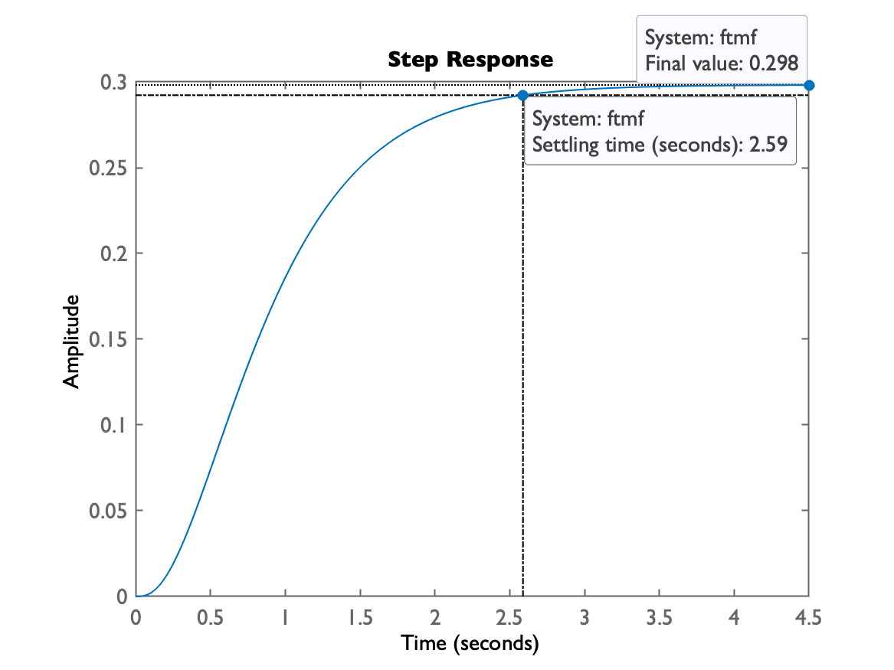
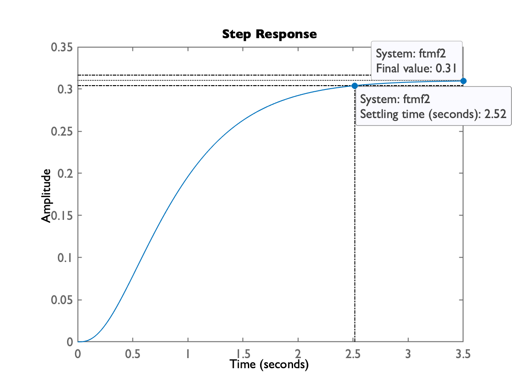

# Usando Root Locus

**Objetivo**: Iniciar com primeiros comandos do Matlab e aprender a usar o `rlocus` para entender/prever comportamento de um sistema em MF.


Seja a planta:


$G(s)=\dfrac{1}{(s+1)(s+4)(s+10)}$


um sistema de 3a-ordem (tipo 0 $\Rightarrow$ $e(\infty)>0$ sem uso de integrador), contendo apenas pólos simples reais.


Para ingressar este sistema no Matlab usamos a função `tf()`:

```matlab
>> G=tf( 1, poly( [-10 -1 -4] ) )

G =
 
             1
  ------------------------
  s^3 + 15 s^2 + 54 s + 40
 
Continuous-time transfer function.
```

Podemos comprovar que foi ingressada da forma correta usando a funçao `zpk()`:

```matlab
>> zpk(G)

ans =
 
          1
  ------------------
  (s+10) (s+4) (s+1)
 
Continuous-time zero/pole/gain model.
```

Podemos pedir para o Matlab traçar o gráfico do **lugar geométrico das raízes** ou *rool-locus*, usando a função `rlocus()`:

```matlab
>> rlocus(G)
>> axis([-12 2 -11 11])	% este comando faz um "zoom" dentro de certa região
```

O comando anterior rende um gráfico como o mostrado abaixo:


A figura anterior está acompanhada de "data-tips" mostrando pontos do RL (*root locus*), com correspondente ganho, fator de amortecimento ($\zeta$) e estimativas para o sobresinal (*overshoot*).


## Realizando alguns testes

A idéia agora é fechar a malha para a planta anterior (realimentação unitária) e variar o ganho, comparando o RL, dados do RL com a resposta temporal obtida para referência (em MF) sendo um degrau unitário.


Vamos supor que é desejado uma **resposta super-amortecida** ou até mesmo **criticamente amortecida** (par de pólos no mesmo local no plano-s). Isto implica pólos de MF (malha-fechada) apenas reais. Pelo gráfico do RL percebemos que ganhos abaixo de $K=17$ vão render apenas pólos reais, com 2 pólos dominantes (mais próximos do eixo $j \omega$) quase sobre o mesmo ponto (o ponto de partida do RL anterior). Acima deste valor de ganho, estes pólos dominantes começam a ter partes imaginárias, o que caracteriza uma resposta sub-amortecidada, com certo sobre-sinal.

```matlab
>> % Fechando malha com ganho = 17
>> K=17;
>> ftmf=feedback(K*G, 1);
>> pole(ftmf)
ans =
      -10.291
       -2.426
      -2.2831
>> % Observando a resposta temporal para entrada degrau unitário
>> figure; step(ftmf)
```

Obtemos o gráfico:





Conforme esperado, temos uma resposta super-amortecida.


O problema com respostas deste tipo é que seu tempo de assentamento pode ser meio elevado. Além do que, como o ganho é baixo, a **teoria do erro** ([erros.pdf](https://fpassold.github.io/Controle_2/3_erros/erros.pdf)) prevê erro de regime permanente elevado. 


No caso:


$e(\infty)=\dfrac{1-y(\infty)}{1} \times 100\%=\dfrac{1-0,298}{1}\times 100\%=70,2\%$, o que é elevado. 


Note que o tempo de assentamento com este valor de ganho foi de $t_s=2,59$ segundos.


A **teoria do erro** indica que aumentando o ganho o erro deve baixar, mas temos que reparar onde vão ficar localizados os pólos de MF. Eventualmente a parte imaginária alcança valores elevados e o sistema além de ser tornar sub-amortecido (pólos com partes imaginárias não nulas), pode se tornar muito oscilatório, elevando o tempo de resposta do sistema.

```matlab
>> % Testando ganho = 18
>> K2=18;
>> ftmf2=feedback(K2*G,1);
>> pole(ftmf2)
ans =
      -10.307 +          0i
      -2.3467 +    0.34727i
      -2.3467 -    0.34727i
>> figure; step(ftmf2)
```

Notamos partes imaginárias pequenas e o gráfico da resposta ao degrau permite verifiar o resultado final deste caso:





Neste caso, o gráfico ainda resultou numa resposta do tipo super-amortecida. Ocorre que temos que considerar que esta resposta é resultado de 3 pólos em MF. O pólo real, algo próximo dos pólos complexos, reduziu o efeito sub-amortecido que seria causado apenas pelos pólos complexos. Mas note que conforme previsto, o erro baixou: $y(\infty)=0,31$ e o tempo de assentamento se reduziu um pouco para $t_s=2,52$ segundos.


Podemos aumentar mais o ganho explorando outros valores mas a partir de certo ponto, o sistema sendo sub-amortecido, vai passar a oscilar tanto, que vai atrasar (aumentar) o tempo de assentamento do mesmo.


Neste caso, note que estamos num impasse: se amentamos o ganho, a teoria do erro nos garante redução do erro, porém o sistema pode passar a ser tão oscilatío (com altos valores de $\%OS$) que implica em tempos de assentamento maiores que os obtidos com ganhos menores mas sem sobre-sinal na resposta. Testando alguns valores:

```matlab
>> K3=25;
>> ftmf3=feedback(K3*G,1);
>> pole(ftmf3)
ans =
      -10.414 +          0i
       -2.293 +    0.99187i
       -2.293 -    0.99187i
>> figure; step(ftmf3)
>> K4=45;
>> ftmf4=feedback(K4*G,1);
>> figure; step(ftmf4)
```

Temos agora 2 gráficos, um para $K_3=25$ e outro para $K_4=45$:

| $K_3=25$ | $K_4=45$ |
| :---: | :---: |
|  |  |

Notamos que as respostas são semelhantes, mas:

* quando $K=25$, ainda temos uma resposta praticamente super-amortecida, com $t_s=2,07$ e $e(\infty)=61,5\%$;
* quando $K=45$, a resposta fica sub-amortecida (com oscilação, $\%OS=2,32\%$), com $t_s=2,06$ e $e(\infty)=50,47\%$.


Notamos que com gaho $K=45$ o sistema passa a oscilar, mas muito pouco. Mais interessante que isto é o fato de que o erro se reduziu sensivelmente além do tempo de assentamento ainda estar caindo.


Poderíamos ficar apostando em outros valores de ganho, para prever até que ponto o sistema fica oscilatório mas com um tempo de assentamento ainda desejável. Mas seria mais eficiente buscar alguma metodologia para isto. No caso, vamos recordar de Controle 1 > 5) [**Respostas Transitórias de Sistemas Lineares**](https://fpassold.github.io/Controle_1/5_Respostas_Sistemas.pdf). O slide No. 37 que trata de respostas de sistemas de 2a-ordem com $0 < \zeta < 1$, prevê:


$\%OS=\exp\left( \dfrac{-\zeta \pi}{\sqrt{1-\zeta^2}} \right) \times 100\%$


Ou a inversa da equação anterior, que nos interessa mais:


$\zeta=\dfrac{-\ln\left( \%OS/100 \right)}{\sqrt{\pi^2+\ln\left( \%OS/100 \right)}}$


Vamos supor que para este sistema em MF seja tolerado um sobre-sinal máximo de 10%, isto é: $\%OS=10\%$. Podemos então calcular o fator de amortecimento, $\zeta$, correspondente, e calcular o ângulo $\alpha$ da linha radial que parte da origem do plano-s e que corresponde à respostas com o $\zeta$ calculado. Esta linha radial (uma reta) pode ser traçada pelo próprio Matlab usando-se a função `sgrid()`. Fazendo os cálculos:

```matlab
>> OS=10; % 10% de overshoot
>> zeta=(-log(OS/100))/(sqrt(pi^2+(log(OS/100)^2)))
zeta =
      0.59116
>> alpha=acos(zeta)
alpha =
      0.93831
>> alpha_deg=alpha*180/pi
alpha_deg =
       53.761
>> figure(1)	% voltando o foco para o primeiro gráfico, o do RL
>> hold on
>> sgrid(zeta,0)
```

Note no gráfico inicial, que existe uma linha guia radial, com ângulo de $53,76^o$:


A idéia agora é descobrir no gráfico do RL, que valor de ganho corresponde ao $\zeta$ desejado (ponto no qual a linha guia cruza com o traçado do RL). Notamos (no gráfico) que isto ocorre com ganho aproximado de $K \cong 80$. Fechando a malha com este ganho e comprovando a resposta obtida:

```matlab
>> K5=80;
>> ftmf5=feedback(K5*G,1);
>> figure; step(ftmf5)
>> stepinfo(ftmf5)
ans = 
  struct with fields:

        RiseTime: 0.58913
    SettlingTime: 1.9007
     SettlingMin: 0.61209
     SettlingMax: 0.72963
       Overshoot: 9.4451
      Undershoot: 0
            Peak: 0.72963
        PeakTime: 1.303
>> % Podemos aproveitar o calcular o erro de regime permanente:
>> dcgain(ftmf5)
ans =
      0.66667
>> erro=((1-dcgain(ftmf5)/1)*100)
erro =
       33.333      
```

A resposta ao degrau unitário fica:


Percebemos que além do $\%OS$ ficar abaixo do 10%, ainda conseguimos reduzir ainda mais o tempo de assentamento, para $t_s=1,9$ segundos.


Você poderia agora testar outros valores de ganho para comprovar até que ponto ainda conseguimos reduzir o tempo de assentamento antes que as oscilações da resposta, voltem a aumentar este valor.


Por exemplo, aumentando o ganho para $\%OS \cong 50\%$:

| *Root-Locus* | Resposta ao Degrau Unitário |
| :---: | :---: |
|  |  |
|  | $t_s=3,41$ e $e(\infty)=12,05\%$ |

Neste caso, aqui percebemos que este valor de ganho é exagerado, o sistema oscila bastante e portanto, demora para estabilizar, aumentando o $t_s$. Porém, como o valor do ganho foi elevado, o erro diminuiu consideravelmente.


Note que existe uma relação custo $\times$ benefício quando se aumenta o valor do ganho. E note que apenas usando controle proporcional, não é possível controlar melhor este processo.


////// Fernando Passold, em 02/09/2024.

