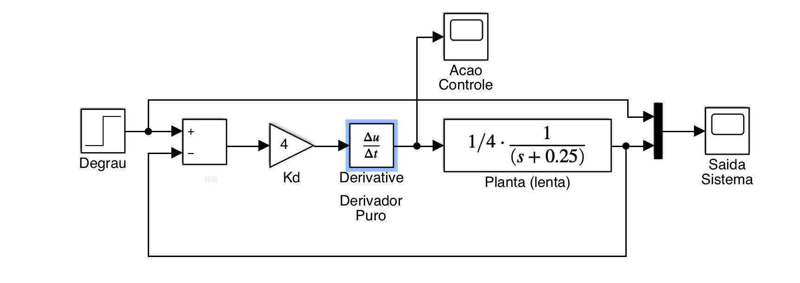
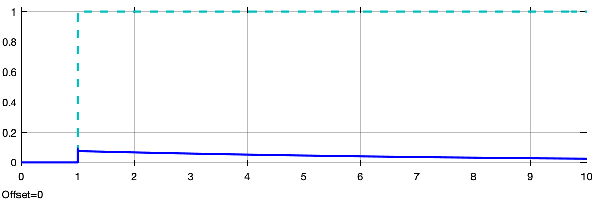
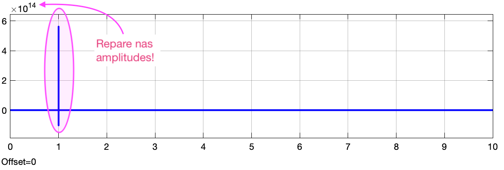
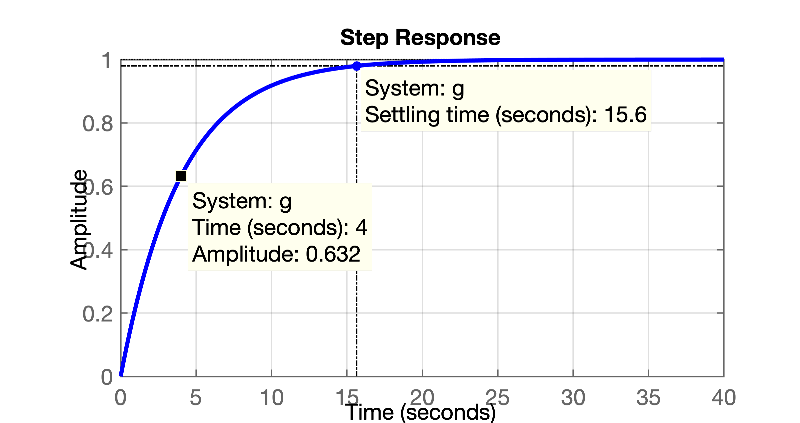
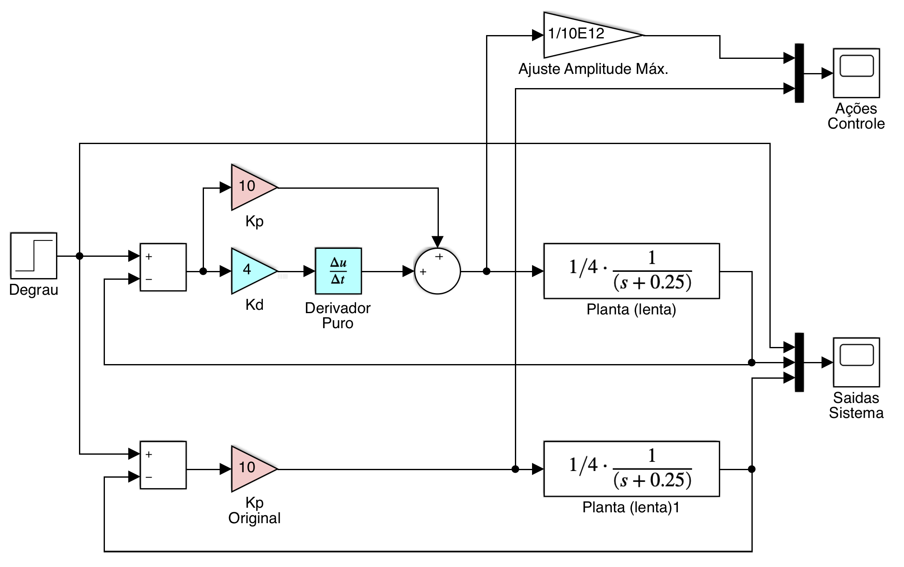
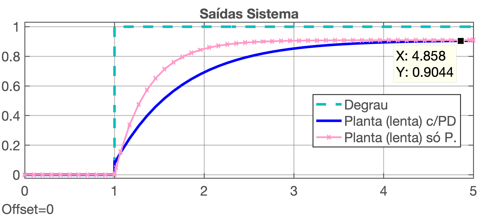
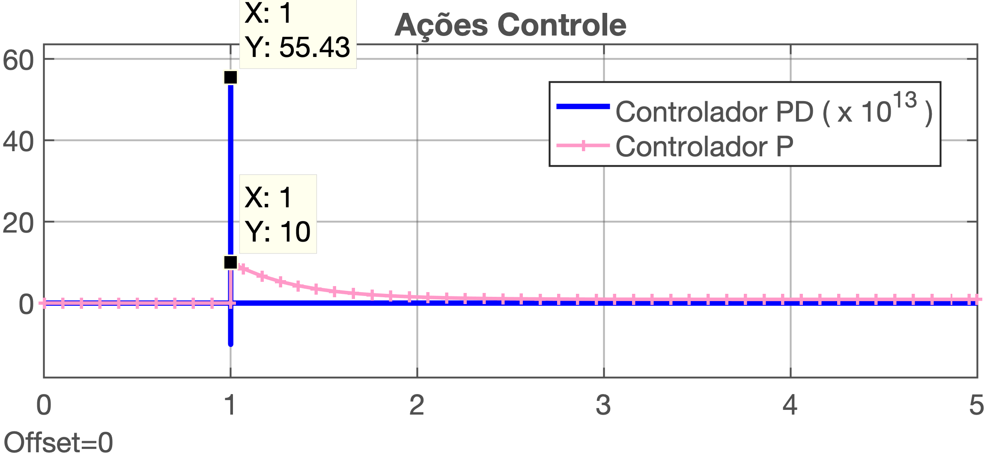

> Aula de 26/10/2019

# Ação Derivativa

## 1. Introdução

Testando um puro controlador derivativo.

Uma ação derivativa pura é caracterizada pela equação:
$$
C(s)=K_d \cdot \dfrac{\partial e(t)}{\partial t}
$$

Sua transformada de Laplace resulta em:
$$
C(s)=K_d \cdot s \cdot E(s)
$$

ou seja, apenas um zero na origem do plano-s.

**Mas o que acontece se tentamos fechar uma malha apenas com ação derivativa pura?**

No Matlab/Simulink:



Arquivo: [derivador\_puro\_teste.slx](derivador_puro_teste.slx)

Esta simulação gera os seguintes resultados:

- Para saída do sistema:

- Para Ação de Controle:


Então você deve ter percebido que só houve ações de controle com amplitudes não nulas no início do degrau e a planta mau reagiu à entrada de controle e a amplitude final da resposta permanece em zero (apesar da malha-fechada e da referência continuar sendo =2 (degrau)).

**Por que isto acontece?**

A resposta é simples: se você usar pura ação derivativa, seu sinal de controle depende exclusivamente do ganho $K_d$ e de quanto variou seu sinal do erro. Como entramos com um degrau, logo na "subida" do degrau (repare que esta derivada já é $\infty$), o erro é de 100% x $K_d$ x $\frac{\partial e(t)}{\partial t}$. Neste caso: $\frac{\partial e(t)}{\partial t}=\infty$, mas como o sistema está sendo simulado numericamente, depende apenas da forma como está configurado esta simulação, esta amplitude "infinita". No caso da simlação realizada, o resultado da derivada anterior x $K_d$ resultou num pico maior que $5 \times 10^{14}$(!) que podemos considerar como sendo $\infty$. Obviamente que num primeiro instante de tempo esta amplitude muito elevada vai forçar o sistema a reagir, mesmo que sua dinâmica seja lenta, por isto, a saída da planta até alcança um pico inicial próximo de 0,1. Mas assim que a planta atingo um valor positivo maior que zero ( $y(t)|_{0^+}>0$ ), o erro **diminui** (pouco), e isto implica numa derivada negativa (já que o sinal de erro diminui algo, mas como estamos derivando o sina do erro...) por isto, logo após ocorre uma inversão na amplitude gerada para o sinal de controle (ele fica negativo), o que desacelera o sistema (planta). Como a referência assume um valor constante (o degrau estabiliza em 1), a derivada da referência vai à zero, e assim, o erro. Ou seja, no limite, quanto $t \to \infty$, $\dfrac{\partial e(t)}{\partial t}|_{t \to \infty}=0$, e como o sinal de controle depende de $u(t)=K_d \cdot\dfrac{\partial e(t)}{\partial t}$, a planta "morre", ou seja, sua saída vai à zero, como demonstram as figuras anteriores.


Note que propositalmente estamos simulando uma planta bastante lenta. Sua contante de tempo é de $\tau=1/0,25=4$ (segundos). Se você quiser confirmar a lentidão da resposta deste sistema em MA no Matlab faça:

```matlab
>> g=tf(1/4, poly(-0.25));
>> >> figure; step(g)
>> >> dcgain(g)
ans =
     1
>> % Propositalmente o "ganho" deste sistema foi ajustado para y(\infty) ser = 1
```

O comando `step(g)` anterior resulta no gráfico:




### Simulações Canceladas no Matlab/Simulink

Eventualmente estas simulações irão produzir uma advertência ou erro no Simulink:
> Unable to reduce the step size without violating minimum step size of 3.5527136788005009E-15 for 1 consecutive times at time 1.0000000000000036.  Continuing simulation with the step size restricted to 3.5527136788005009E-15 and using an effective relative error tolerance of 0.013523809523809462, which is greater than the specified relative error tolerance of 0.001. This usually may be caused by the high stiffness of the system. Please check the model 'derivador_puro_teste' or increase Number of consecutive min steps
Component:Simulink | Category:Block diagram warning

ou
> An error occurred while running the simulation and the simulation was terminated
Caused by:
**Derivative of state '1' in block 'PD_teste/Planta (lenta)' at time 1.0000000000508034 is not finite**. The simulation will be stopped. There may be a singularity in the solution.  If not, try reducing the step size (either by reducing the fixed step size or by tightening the error tolerances)

No caso "_high stiffness of the system_" significa "alta rigidez do sistema", ou adaptando para este caso, está relacionado com a forma como queremos que o Matlab/Simulink simule (numericamente) a derivada de um sinal como um degrau ($u(t)$; $U(s)=1/s$), que por definição matemática resulta em:

$$
{\dfrac{\partial u(t)}{\partial t}}|_{t=0}=\infty
$$

Uma solução para contornar este problema numérico é definir explicitamente, como parâmetro de simulação, o passo mínimo que deve ser adotado (possui relação com: "_increase Number of consecutive min steps_"): barra de menus do diagrama de blocos atual do Simulink (arquixo .slx) >> Simulation >> Stepping Options >> Habilitar a caixa: [ x ] Enable stepping back. Isto pode ajudar a resolver o problema. Ou modificar: >> Simulink >> Model Configuration Parameters >> na aba "Solver", selecionar no campo "Solver options" o "Solver = ode45 (Dormand-Price)".

### Conclusão final

Não resulta bem fechar uma malha de controle com pura ação derivativa.

## 2. Ação PD

Como pôde ser percebido anteriormente, **não é** possível (nem aconselhável) fechar uma malha com ação derivativa pura. É necessário complementar esta ação com, por exemplo, o controlador proporcional, resultando na combinação: `P + D = PD`.

Simulando a ação PD sobre a mesma planta anteriormente testada:




Arquivo: [PD\_teste.slx](PD_teste.slx)

**Obs.:** Nonte na figura (diagrama) anterior, que a amplitude da ação de controle PD foi reduzida de um fator de escala de $K=1/10^{12}$ para que o formato das 2 curvas pudessem ser vistas na mesma figura. Lembrar que o PD gera expressivas amplitudes inicias de controle.

Resultado para saídas dos sitemas:



Ações de Controle Desenvolvidas:



Notar que no digrama de blocos aproveitamos para comparar o desempenho simultâneo de um Controlador Proporcinal x Controlador PD. 

## 3. Comparando Ações Proporcional com PD

Repare que:

- Variar $K_d$, **não** reduz erro em regime permanente;
- $K_d$ apenas permite "dosar" a ação derivativa, que no caso, já desemvolve um pico de ação de controle em $t=0^+$ de $u(0^+)=55,43 \times 10^{\mathbf{13}}$.
- Perceba que o controlador Proporcional gerou um pico de ação de controle em "apenas" 10, resultado de $u(t=0^+)=e(0^+)*K_p=1,0 \times 10=10$.
- Aumentar $K_d$, apenas acelera resposta do sistema (ou eventualmente pode deixá-lo instável, se os pólos de MF se moverem para o semi-plano direito no plano-*s*.
- Aumentar $K_p$, isto sim, **reduz** erro de regime permanente. Perceber pela figura que com $K_p=10$, o $\text{erro}(\infty)|_{\text{degrau}} \cong 10\%$ [$(1,0 - 0,9044)/1 \times 100\%$].

Para enteder melhor o efeito destes ganhos ($K_p$ e $K_d$) se faz necessário revisar **Teoria do Erro**.

Neste caso (das simulações sendo realizadas nesta aula), propositalmente estamos trabalhando com um sistema do tipo 0 (sem integrador). Isto significa que a única forma de zerar o erro em regime permanente neste tipo de sistema é incorporando ação integral, o que não está sendo realizado com um simples controlador Proporcional ou PD. Mas então como fica o erro em regime permanente?

_Próximos tópicos:_ [♫](https://soundcloud.com/edward-newgate-originals/green-eyes?in=fpassold/sets/fell-2)

# 4. Projetando o PD para a planta da sala de aula

# 5. Modificando o PD para um Controlador por Avanço de Fase (ou *Lead*)

### Vantagens

### Desvantagens:

---
(c) Prof. Fernando Passold, em 26/09/2019.