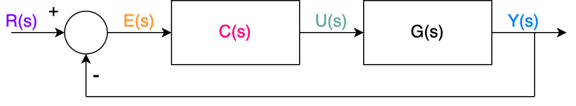
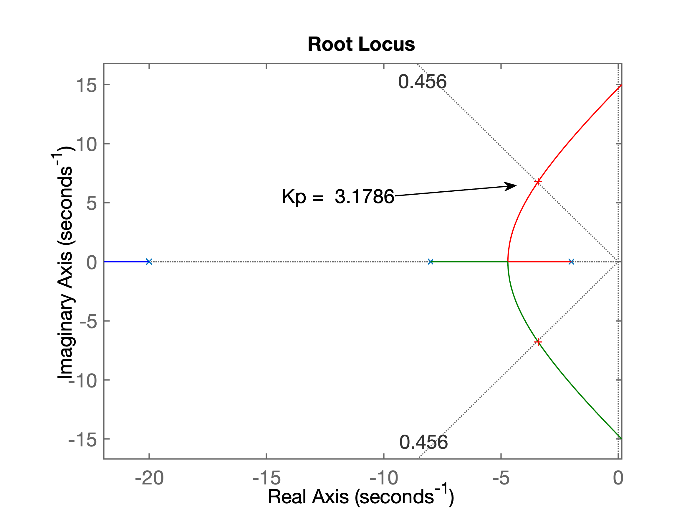
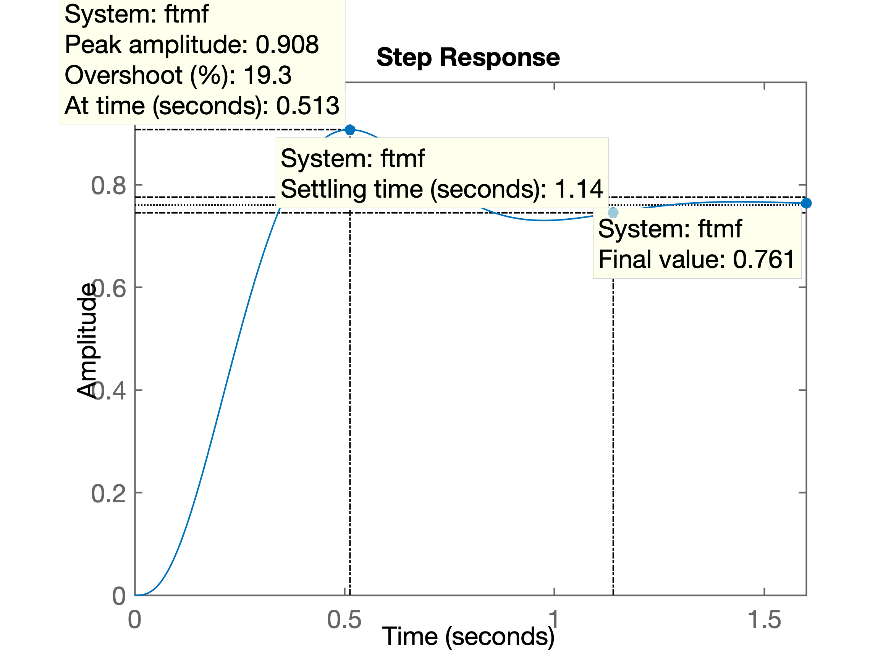
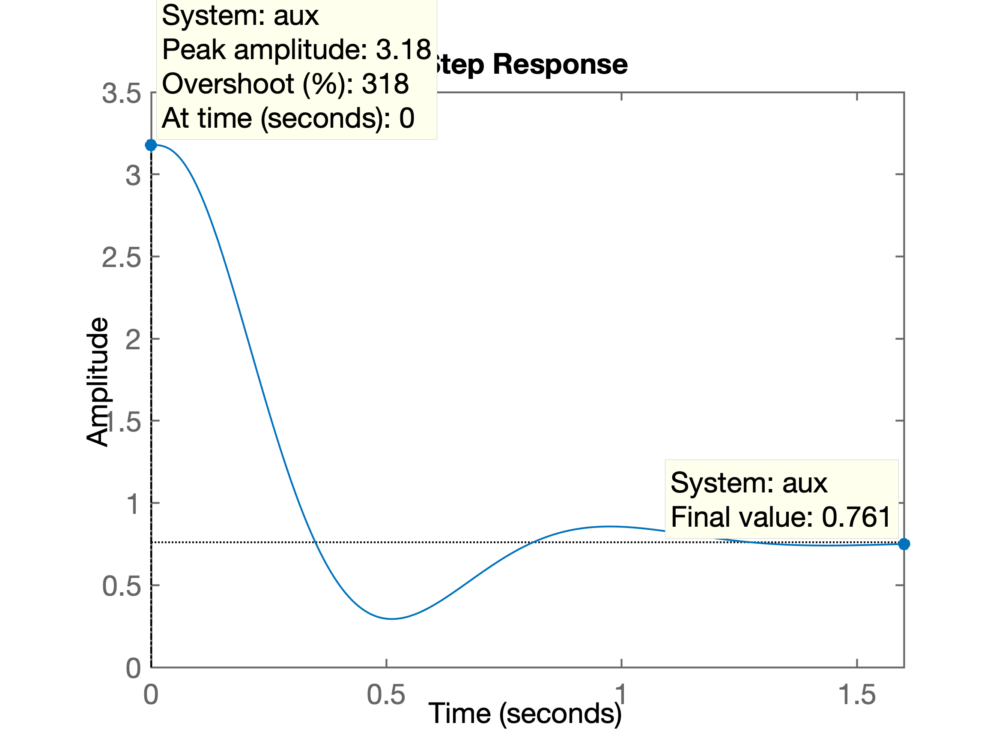
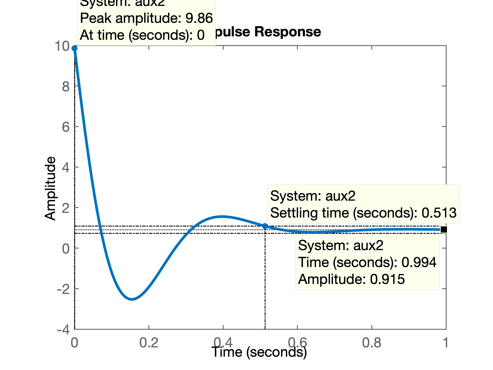
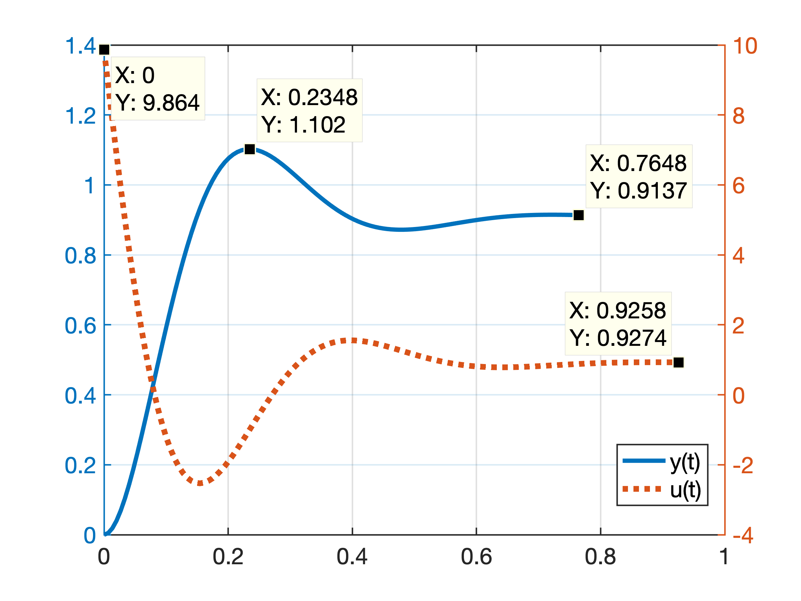
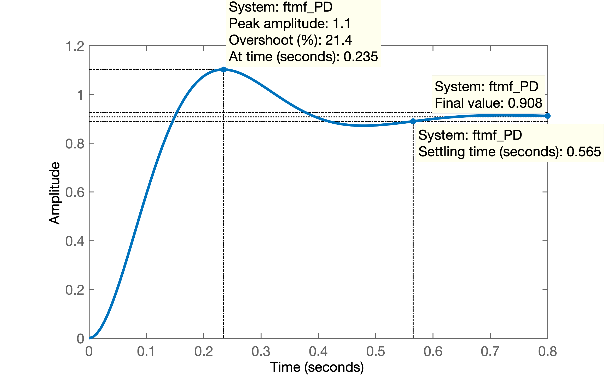
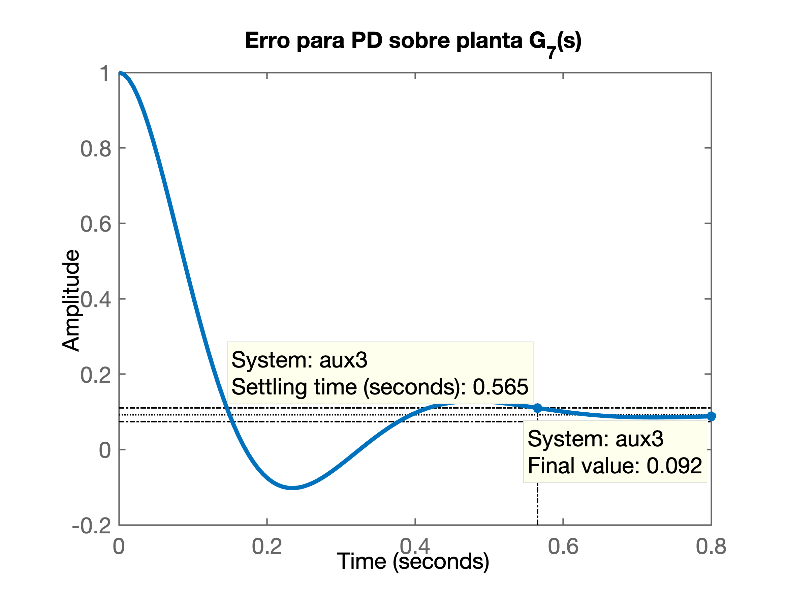

# Gráficos de $u(t)$ e $e(t)$

O objetivo neste documento é apresentar uma forma de obter gráficos da ação de controle e do sinal de erro num sistema em malha-fechada, usando o Matlab, sem a necessidade de usar o Simulink.

## Deduzindo $u(t)$

Observando o sistema realimentado unitário abaixo:



Notamos que:
$$
U(s)=C(s)\cdot E(s)
$$

$$
E(s)=R(s)-Y(s)
$$

$$
Y(s)=G(s)\cdot U(s)
$$

então:

$$
U(s)=C(s)\cdot \left[ R(s)-Y(s) \right]
$$

$$
U(s)=C(s) \cdot R(s) - C(s) \cdot Y(s)
$$

$$
U(s)=C(s) \cdot R(s) - C(s) \cdot G(s) \cdot U(s)
$$

$$
U(s)\left[ 1 + C(s) \cdot G(s) \right] = C(s) \cdot R(s)
$$

$$
U(s) = \dfrac{C(s) \cdot R(s)}{1+C(s) \cdot G(s)}
$$

ou organizando melhor, notamos que:

$$
U(s)=\left[ \dfrac{C(s)}{1+C(s)\cdot G(s)} \right] \cdot R(s)
$$

note que: $C(s) \cdot G(s)=FTMA(s)$.

Perceba que quando usamos o comando `step(FTMF)` no Malab, o mesmo está realizando:

$$
Step(FTMF) \rightarrow Grafico \left\{ \mathcal{L}^{-1} \big[ Degrau(s) \cdot FTMF(s) \big] \right\}
$$

A função `step` multiplica a *transfer function* passada como argumento de entrada pela transformada de Laplace da função Degrau, realiza a transformada inversa de Laplace, calcula as primeiras amostras (valores) do resultado desta inversa e "plota" o resultado destes cálculos na forma de um gráfico.

Normalmente quando fechamos uma malha tradicional de controle, como o mostrado na primeira figura acima, realizamos algo como: 

$$
y(t)= \mathcal{L}^{-1} \left\{ Y(s) \right\}
$$

$$
Y(s)=R(s) \cdot FTMF(s)
$$

$$
FTMF(s)=\dfrac{FTMA(s)}{1+FTMA(s)}=\dfrac{C(s) \cdot G(S)}{1+C(s) \cdot G(S)}
$$

e para obter o gráfico da resposta do sistema em malha-fechada, realizamos no Matlab:

```matlab
>> step(FTMF)
```

este comando termina por realizar:

$$
Step(FTMF) \rightarrow Grafico \left\{ \underbrace{\mathcal{L}^{-1} \big[ \underbrace{Degrau(s) \cdot FTMF(s)}_{Y(s)} \big]}_{y(t)} \right\}
$$

Então, podemos adapatar a forma como trabalha a função `step` para gerar o gráfico de $u(t)$ ou $e(t)$.

Anteriormente deduzimos:

$$
U(s)=\left[ \dfrac{C(s)}{1+C(s)\cdot G(s)} \right] \cdot R(s)
$$

Então note que a parte da expressão transformamos em argumento de entrada para a função `step()` e conseguimos obter o gráfico de $u(t)$:

$$
\left[ \dfrac{C(s)}{1+C(s)\cdot G(s)} \right] \quad \longrightarrow \quad \text{aux}
$$

e assim, para obter o gráfico de $u(t)$ quando o sistema em malha fechada é submetido à uma entrada degrau, fazendo no Matlab, algo como:

```matlab
>> aux=Kp/(1+Kp*G7);
>> % gráfico de u(t)
>> figure; step(aux)
```

**Exemplo**: suponha o sesguinte sistema:

$$
G_7(s)=\dfrac{320}{ (s+20) (s+8) (s+2)}
$$

No Matlab:

```matlab
>> % ingressando a planta:
>> G7=tf(320,poly([-20 -8 -2]));
>> % fechando a malha com granho proporcional e %OS=20%
>> rlocus(G7)
>> OS=20;
>> zeta=(-log(OS/100))./(sqrt(pi^2+(log(OS/100)^2)))
zeta =
    0.4559
>> [Kp,polosMF]=rlocfind(G7)
Select a point in the graphics window
selected_point =
  -3.4410 + 6.7943i
Kp =
    3.1786
polosMF =
 -23.1680 + 0.0000i
  -3.4160 + 6.7857i
  -3.4160 - 6.7857i
>> ftmf=feedback(Kp*G7, 1);
>> figure; step(ftmf)
```
Que gerou o seguinte RL e resposta ao degrau:

|  |  |
| :---: | :---: |
| (a) RL para $G_7(s)$ | (b) Resposta ao degrau, $y(t)$ |

Para se obter também o gráfico de $u(t)$ fazemos então:

Calculamos:

$$
U(s)=\underbrace{\left[ \dfrac{K_p}{1+K_p\cdot G_7(s)} \right]}_{\text{aux}} \cdot R(s)
$$

```matlab
>> aux=Kp/(1+Kp*G7);
>> zpk(aux)

ans =
 
     3.1786 (s+20) (s+8) (s+2)
  --------------------------------
  (s+23.17) (s^2 + 6.832s + 57.72)
 
Continuous-time zero/pole/gain model.

>> figure; step(aux)
```

O que nos permite vizualizar as amplitudes desenvolvidas pela ação de controle $u(t)$:



**Porém** a função `step` só trabalha com polinômios de entrada causais.

Por exemplo, observe o que acontece se projetamos um PD e queremos observar as amplitudes desenvolvidas por este controlador:

**Exemplo$_2$:** observando ação de controle desenvolvida por um PD.

Neste exemplo, vamos incorporar um PD à planta já adotada anteriormente<br />
*Obs.:* Não estará sendo mostrado aqui, como o PD foi obtido.

A equação do PD é:

$$
C_{PD}= 0.690759 \cdot (s + 14.28)
$$

Tentado obter o gráfico de $u(t)$ gerado pelo PD:

```matlab
>> C_PD=tf([1 14.28], 1)

C_PD =
 
  s + 14.28
 
Continuous-time transfer function.

>> K_PD=0.690759;
>> aux=K_PD*C_PD/(1+K_PD*C_PD*G7);
>> zpk(aux)

ans =
 
  0.69076 (s+20) (s+14.28) (s+8) (s+2)
  ------------------------------------
    (s+16.27) (s^2 + 13.73s + 213.7)
 
Continuous-time zero/pole/gain model.

>> figure; step(aux)
Error using DynamicSystem/step (line 95)
Cannot simulate the time response of improper
(non-causal) models. 
```

Neste caso, o Matlab não finalizou a funçã `step()` por considerar a função transferência passada como argumento de de entrada, como um sistema não causal. 

De fato, analizando a equação de `aux` notamos que o grau do numerador é superior ao grau do denominador:

$$
\begin{array}{rcl}
\text{aux} &=& \left[ \dfrac{C(s)}{1+C(s)\cdot G(s)} \right] \\
&=& \dfrac{N(s)}{D(s)} \\
&=& \dfrac{0.69076 (s+20) (s+14.28) (s+8) (s+2)}{(s+16.27) (s^2 + 13.73s + 213.7)} \\
\end{array}
$$

$$
\begin{array}{rr}
N(s) &\leftarrow& \text{polinômio de grau } 4\\
D(s) &\leftarrow& \text{polinômio de grau } 3\\
\end{array}
$$

**Como contornar este problema?**

Neste caso, lembrando que queremos:

$$
u(t) = \mathcal{L}^{-1} \left\{ U(s) \right\}
$$

$$
U(s)=\underbrace{\left[ \dfrac{C(s)}{1+C(s)\cdot G(s)} \right]}_{\text{aux}(s)} \cdot R(s)
$$

Falta multiplicar a expressão anterior `aux` pela transformada de Laplace do Degrau:

$$
\text{Degrau}(s)=\dfrac{1}{s}
$$

Calculando a nova expressão, teremos:

$$
\text{aux}_2(s)=\dfrac{1}{s} \cdot \text{aux}(s)
$$

Se à expressão `aux2` aplicarmos uma entrada impulso, realizarmos a transformada inversa de Laplace da mesma e plotamos os resultado para o período inicial de tempo, teremos obtido nosso objetivo que é o gráfico de $u(t)$:

$$
u(t)=\mathcal{L}^{-1}\big\{ \Delta(s) \cdot \text{aux}_2(s) \big\}
$$

Notamos que a função `impulse()` do Matlab fornece justamente a resposta temporal ao impulso da função transferência passada como argumento de entrada para a mesma.

Então para ober o gráfico de $u(t)$ para o nosso PD, terminamos de fazer agora:

```matlab
>> degrau=tf(1,[1 0])

degrau =
 
  1
  -
  s
 
Continuous-time zero/pole/gain model.

>> aux2=degrau*aux;
>> zpk(aux2)

ans =
 
  0.69076 (s+20) (s+14.28) (s+8) (s+2)
  ------------------------------------
   s (s+16.27) (s^2 + 13.73s + 213.7)
 
Continuous-time zero/pole/gain model.

>> figure; impulse(aux2)
```

Note que desta vez a função `aux2` é causal.

O gráfico de $u(t)$ para o PD fica então:



Podemos opcionalmente, mesclar num mesmo gráfico, a resposta temporal do sistema, $y(t)$ com o gráfico de $u(t)$ anterior, usando a função `plotyy` do Matlab. 

Mas para usar esta função temos que criar os vetores usados como dados de entrada para a função `plotyy()`:

```matlab
>> % fechando malha do PD (não feito anteriormente)
>> ftmf_PD=feedback(K_PD*C_PD*G7, 1); 
>> [u, t]=impulse(aux2); % gera vetores t x u(t)
>> [y, t2]=step(ftmf_PD);   % gera vetoree t2 x y(t)
>> figure; plotyy(t2,y, t,u)
>> legend('y(t)','u(t)')
```

O que gera o gráfico:



Mas talvez, mostrar os gráficos de $y(t)$ e $u(t)$ de maneira isolada seja melhor para mostrar pontos importantes em cada um deles:

|  |  |
| :---: | :---: |
| (a) Resposta ao degrau, $y(t)$ | (b) Resposta ao degrau, $u(t)$ |

## Gráfico de $e(t)$

O gráfico de $e(t)$ pode ser obtido usando uma estratégia semelhante à adotada para plotar o gráfico de $u(t)$.

Neste caso, analisando o diagrama em blocos abaixo e extraíndo equações, teremos:


$$
E(s)=R(s)-Y(s)
$$

$$
Y(s)=E(s) \cdot C(s) \cdot G(s)
$$

$$
\begin{array}{rcl}
E(s) &=& R(s) - E(s) \cdot C(s) \cdot G(s)\\
E(s) \big[ 1 + C(s) \cdot G(s) \big] &=& R(s) \\
E(s) &=& \dfrac{R(s)}{1+C(s) \cdot G(s)}\\
&=& \big[ \dfrac{1}{1+C(s) \cdot G(s)} \big]
\end{array}
$$

e no Matlab, realizamos então:

$$
e(t) = \text{step}\left( \underbrace{\dfrac{1}{1+C(s) \cdot G(s)} }_{\text{aux3}}\right)
$$

testando:

```matlab
>> aux3=1/(1+K_PD*C_PD*G7);
>> zpk(aux3)

ans =
 
         (s+20) (s+8) (s+2)
  --------------------------------
  (s+16.27) (s^2 + 13.73s + 213.7)
 
Continuous-time zero/pole/gain model.

>> figure; step(aux3)
>> title('Erro para PD sobre planta G_7(s)')
```

O que gera o gráfico:



---

Fim<br />
Fernando Passold, em 11/06/2020
