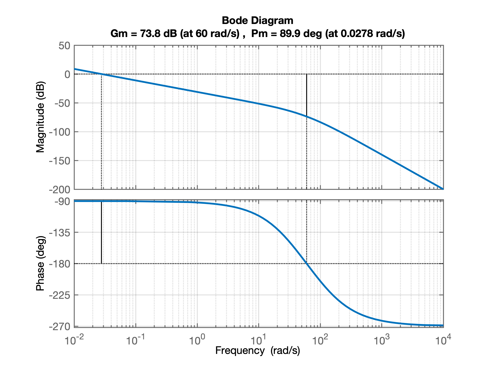
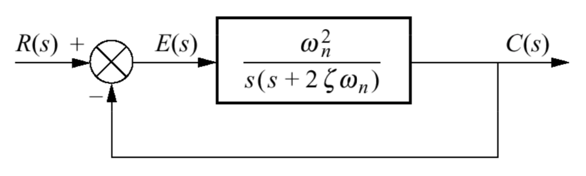

# Projeto no Domínio Frequencia

## Breve Revisão Diagramas de Bode

$$
G(s)=\dfrac{1}{s^2+2 \zeta \omega_n s + \omega_n^2}
$$

pode ser normalizada para:

$$
G(s)=\dfrac{1}{\omega_n^2} \left( \dfrac{1}{ \dfrac{1}{\omega_n^2}s^2 +\dfrac{2 \zeta}{\omega_n} s + 1 } \right)
$$

Que em baixas frequencias resulta:

$$
G(s) \approx \frac{1}{\omega_n^2} = \frac{1}{\omega_n^2} \angle 0^o
$$

$$
20 \log_{10} M = 20 \log_{10} \left( \frac{1}{\omega_n^2} \right)
$$

Em frequencias elevadas:

$$
G(s) \approx \frac{1}{s^2}
$$

ou:

$$
G(j\omega) \approx -\frac{1}{\omega^2} = \frac{1}{\omega^2} \angle {-180^o}
$$

$$
20 \log_{10} M = 20 \log_{10} |G(j \omega)|=20 \log_{10} \left( \frac{1}{\omega^2} \right) = - 40 \log_{10} \omega
$$

ou seja, uma queda de 40 db/década.


## Comandos no Matlab

* **margin(.)**

Uso: 

`>> [Gm, Pm, Wcg, Wcp] = margin (G)`

Mostra/retorna parâmetros importantes  como Margem de Ganho, `Gm`, que ocorre na frequencia `Wcg` (rad/s) e Margem de Fase, `Pm`, que ocorre na frequencia `Wcp` (rad/s).

**Obs1.:** (da própria MathWorks): 
Se você usar `margin(mag,phase,w)`, onde `w` seria o vetor contendo uma faixa de frequencias de interesse (em rad/s), `margin` depende da interpolação para aproximar as margens, o que geralmente produz resultados menos precisos. Por exemplo, se não houver cruzamento de 0 dB no intervalo contido no vetor `w`, a margem retornará uma margem de fase de `Inf`. Se você possui um modelo analítico para a `tf`, usar `[Gm, Pm, Wgm, Wpm] = margin (tf)` é a maneira mais robusta de obter as margens.

**Obs2.:** `margin (tf)`, **sem argumentos de saída**, plota o diagram de Bode de `tf` na tela e indica as margens de ganho e fase na plotagem. Por padrão, as margens de ganho são expressas em dB no gráfico. **Mas** quando `margin (tf)` é usado com retorno de parâmetros, `>> [Gm, Pm, Wcg, Wcp] = margin (G)`, a margem de ganho, `Gm` é retornada em valores absolutos (e não em dB).

Exemplos:

Ex1:

```matlab
>> G=tf(100,poly([0 -36 -100]));  % entra com função transferência
>> zpk(G)

ans =
 
        100
  ----------------
  s (s+100) (s+36)
 
Continuous-time zero/pole/gain model.

>> margin(G) % plota gráfico e mostra as margens
```

Que grera um gráfico ressaltando as margens de ganho e de fase:



O mesmo comando retornando valores ou com terminando com `;` **não** gera o gráfico! Ver próximo exemplo:

Ex2:

```matlab
>> [Gm,Pm,Wcg,Wcp]=margin(G) % retorna valores MAS não mostra gráfico
Gm =
   4.8960e+03
Pm =
   89.9399
Wcg =
   60.0000
Wcp =
    0.0278
>> [Gm,Pm,Wcg,Wcp]=margin(G);  % retorna valores mas não os mostra na tela
>> 
```

Note que `[Gm,Pm,Wcg,Wcp]=margin(G)` aplicado desta forma, retorna `Gm` em valores absolutos e não em dB:

```matlab
>> 20*log10(Gm)
ans =
   73.7968
```

## Revisando respostas de sistemas em MF de 2a-ordem

Seja um sistema do tipo:



Teremos as seguintes relações:

$$
FTMF(s)=\frac{C(s)}{R(s)}=\dfrac{\omega_n^2}{s^2+2 \zeta \omega_n s + \omega_n^2}
$$

$$
Ganho=M=|FTMF(s)|=\dfrac{\omega_n^2}{\sqrt{(\omega_n^2 - \omega^2)^2+4 \zeta^2 \omega_n^2 \omega^2}}
$$

$$
M_p=\dfrac{1}{2 \zeta \sqrt{1 - \zeta^2}}
$$

$$
\omega_p = \omega_n \sqrt{ 1 - 2 \zeta^2}
$$

### Margem de Fase, $\Phi_M$

Determinando dados da Margem de fase, $\Phi_M$ (que ocorre na frequencia $\omega_{\Phi_M}$).

A margem de fase é definida pelo ponto onde $FTMA(j \omega)=G(j \omega)=1$
  
Buscando a frequencia, $\omega_{\Phi_M}$, onde $|FTMA(j \omega)|=|G(j \omega)|=1$, ou onde $|G(j \omega)|= 0 \text{ dB}$ (note: $\log_{10}(1)=0$), teremos:

$$
|G(j \omega)|=\dfrac{\omega_n^2}{| -\omega^2+j\;2 \zeta \omega_n \omega |}=1
$$

$$
\omega_{\Phi_M}=\omega_n \sqrt{-2 \zeta^2 + \sqrt{1+4 \zeta^4}}
$$

$$
\angle G(j \omega)= -90^o - \tan^{-1} \left( \dfrac{w_{\Phi_M}}{2\zeta\omega_n} \right)
$$

$$
\angle G(j \omega)= -90^o - \tan^{-1} \left( \dfrac{ \sqrt{-2\zeta^2+\sqrt{4\zeta^4+1}} }{2\zeta} \right)
$$


Como $\Phi_M=\angle G(j \omega) - 180^o$, teremos:

$$
\Phi_M=90^o - \tan^{-1} \left( \dfrac{ \sqrt{-2\zeta^2+\sqrt{4\zeta^4+1}} }{2\zeta} \right)
$$

que dá no mesmo que:

$$
\Phi_M = \tan^{-1} \left( \dfrac{2\zeta}{ \sqrt{-2\zeta^2+\sqrt{4\zeta^4+1}} } \right)
$$

### Largura de Banda, $\omega_{BW}$

$$
\omega_{BW}=\omega_n \sqrt{ (1 - 2 \zeta^2) + \sqrt{ 4 \zeta^4 - 4 \zeta^2 + 2}}
$$

ou:

$$
\omega_{BW}=\dfrac{4}{t_s \; \zeta} \sqrt{(1-2\zeta^2)+\sqrt{4\zeta^4-4\zeta^2+2}}
$$

ou
$$
\omega_{BW}=\dfrac{\pi}{t_p \; \sqrt{1-\zeta^2}} \sqrt{(1-2\zeta^2)+\sqrt{4\zeta^4-4\zeta^2+2}}
$$

### Relação entre $\%OS$ e $\zeta$

Quando $0 < \zeta < 1$ (sistema sub-amortecido), podemos:

Estimar o valor percentual do sobrepasso, $\%OS$:
$$
\%OS=\exp{ \left( - \dfrac{\zeta \pi}{\sqrt{1-\zeta^2}} \right)}
$$

ou determinar o fator de amortecimento, $\zeta$ se foi informado o $\%OS$:
$$
\zeta = \dfrac{-\ln \left(\frac{\%OS}{100}\right) }{ \sqrt{ \pi^2 + \ln^2 \left( \frac{\%OS}{100} \right) } }
$$

E podemos estimar alguns tempos de resposta: $t_p$, $t_r$ ou $t_s$:

### Tempo do Pico, $t_p$

$$
t_p=\dfrac{\pi}{\omega_n \sqrt{1-\zeta^2}}
$$
ou
$$
\omega_n=\dfrac{4}{t_p \; \sqrt{1-\zeta^2}}
$$

### Tempo de Assentamento, $t_s$

$$
t_s=\dfrac{- \ln \left( 0,02 \sqrt{1-\zeta^2} \right) }{ \zeta \omega_n}
$$
que para valores onde $0 < \zeta < 0,9$ pode ser aproximado para:
$$
t_s=\dfrac{4}{\zeta \omega_n}
$$
ou
$$
\omega_n=\dfrac{4}{t_s \; \zeta}
$$

### Erro em Regime Permanente, $e(\infty)$

Para o caso de realimentações unitárias ($H(s)=1$), temos:
$$
E(s)=R(s)-Y(s)=R(s)\left[ 1 - \dfrac{FTMA(s)}{1+FTMA(s)} \right]
$$
$$
E(s)=\dfrac{1}{1+FTMA(s)} \cdot R(s)
$$

$$
e(\infty)=\lim_{t \to \infty} e(t) = \lim_{s \to 0} sE(s)= \lim_{s \to 0} \dfrac{s R(s)}{1+FTMA(s)}
$$

### Constante de Erro de Posição

Para o caso de sistemas do tipo 0:
$$
e_{\text{Step}}(\infty)=\dfrac{1}{1+K_p}
$$
$$
K_p=\lim_{s \to 0} FTMA(s)
$$

Lembrando que:
$$
\mathcal{L}\left\{ A \cdot u(t) \right\} = \dfrac{A}{s}
$$

### Constante de Erro de Velocidade, $K_v$

Para o caso de sistemas do tipo 1: 
$$
e_{\text{ramp}}(\infty)=\dfrac{1}{K_v}
$$
onde:
$$
K_v=\lim_{s \to 0} s FTMA(s)
$$

Lembrando que:
$$
r(t)=\text{Rampa}=\left\{ \begin{array}{ll} 0, & t<0\\ A\cdot t, & t \ge 0\\ \end{array}\right. \quad \longrightarrow \quad R(s)=\dfrac{A}{s^2}
$$

---

# Projeto 1) Controlador Proporcional

Normalmente nestes casos, é especificado o valor de sobrepasso máximo tolerável como requisito de controle (em malha-fechada).

Lembrando de algumas equações de um sistema de malha-aberta de segunda ordem temos:

