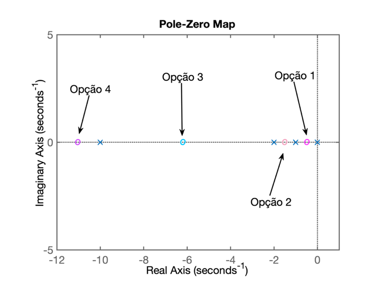
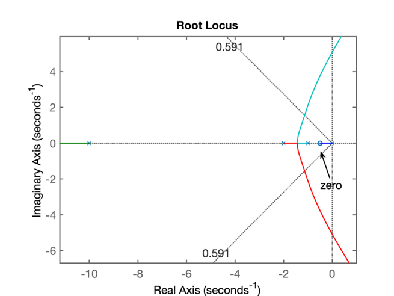
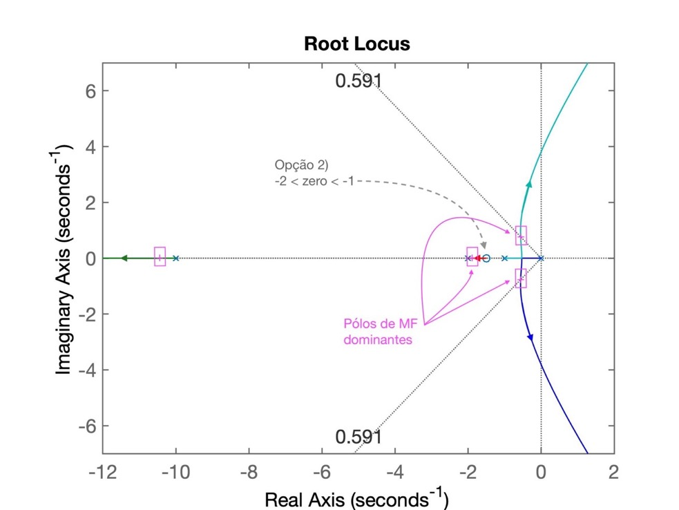
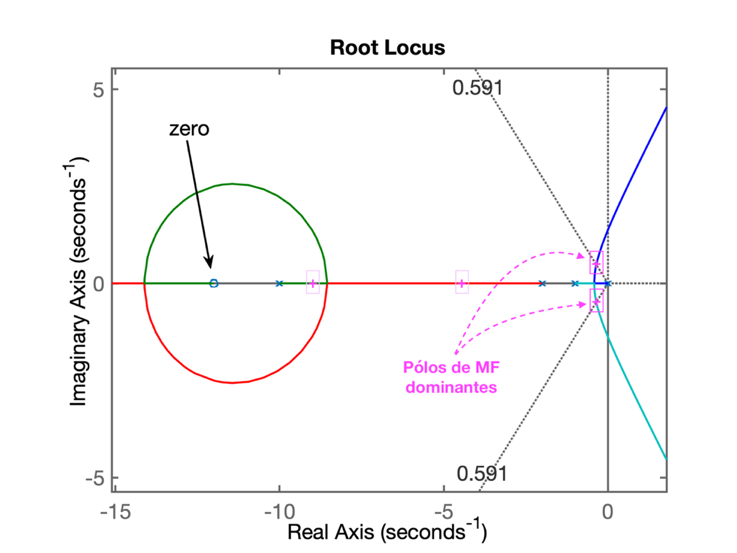
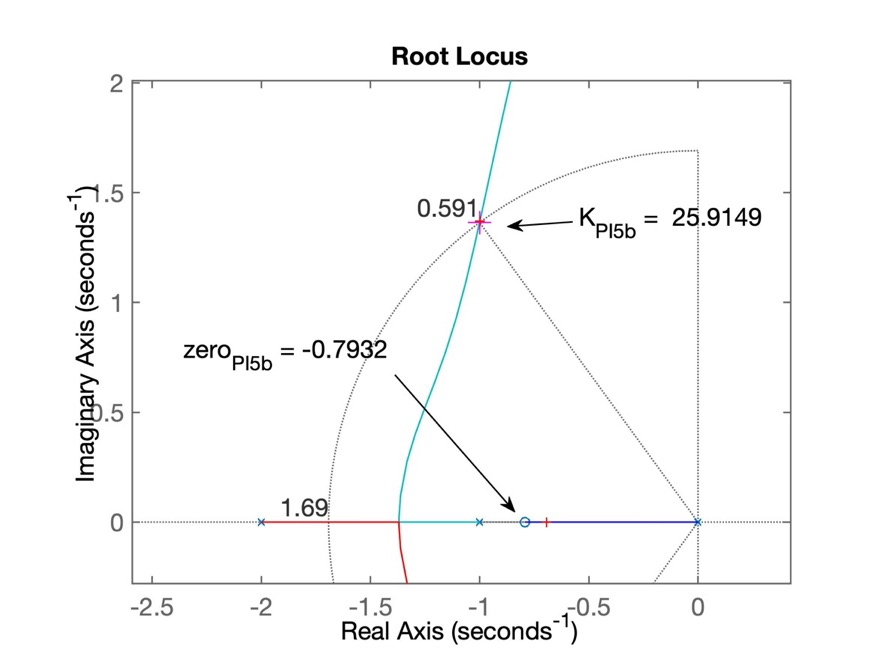
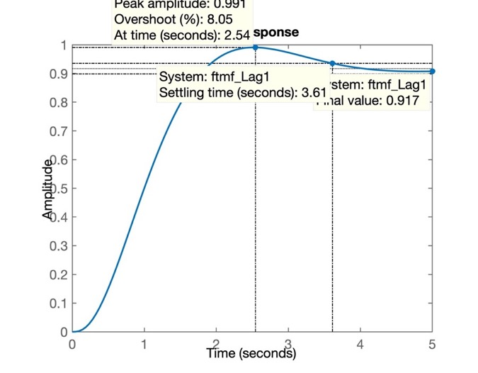

# Controle Automático II


[(c) Jan Bolz, Ostseebad Rerik, Rerik, Germany, November 23, 2017](https://unsplash.com/photos/MScX6XdvxWw?utm_source=unsplash&utm_campaign=wallpapers-macos&utm_medium=referral&content=view-photo-on-unsplash)

## Projeto de Controladores usando RL

Continuando Projeto de Controladores usando RL...

__Recuperando__ o trabalho já realizado no `Matlab`:

```matlab
>> % Verificando diretório atual de trabalho:
>> pwd
ans =
    '/Users/fernandopassold/Documents/UPF/Controle_II/6_Usando_RL_Projetos'
>> % verificando arquivos presentes compatíveis com Matlab:
>> what

MAT-files in the current folder /Users/fernandopassold/Documents/UPF/Controle_II/6_Usando_RL_Projetos

planta  

>> % carregando dados da aula anterior
>> load planta
>> % Verificando parte dos dados recuperados:
>> zpk(G)
ans =
          1
  ------------------
  (s+10) (s+2) (s+1)

Continuous-time zero/pole/gain model.
```

Ok, acabamos de ajustar o `Matlab` para continuar os trabalhos (projetos de outros controladores).

# Projeto de PI usando contribuição angular

**PROBLEMA**: definir a posição do seu zero usando contribuição angular no diagrama do lugar das raízes.

**OBJETIVO**: usar contribuição angular para definir a posição desejada para o zero do controlador em função de requisitos de controle temporais.

A questão aqui é definir se existe uma posição mais adequada para o zero do controlador PI. A principio, analisando a equação da planta e considerando que já sabemos que o pólo do controlador está no origem (integrador), algumas opções nos ocorrem:

$
\begin{array}{rcl}
FTMA(s) &=& C(s) \cdot G(s)\\
&=& \dfrac{K(s+z_1)}{s} \cdot \dfrac{1}{(s+1)(s+2)(s+10)}
\end{array}
$

problema: - onde posicionar $z_1$ ?

Analisando o RL **sem** o zero:



### Opção 0:

O zero do controlador foi determinado através do cálculo da relação entre $K_i$ e $K_p$: zero em:

$s=-\frac{K_i}{K_p}$ 

Foi observado que não foi possível estabelecer um controlador com tempo de assentamento razoável. Na verdade, seu $t_s$ ficou maior que o próprio controlador de ação integral pura.

### Opção 1:

Posicionar o zero do controlador entre o pólo integador ($s=0$) e o pólo mais lento da planta (em $s=-1$).



Feito na aula anterior...

### Opção 2:

Já que localizar o zero do controlador entre o pólo do controlador (em s= 0) e o pólo mais lento da planta (em s= -1) parece não ter funcionado, podemos testar o caso de zero (do controlador) posicionado entre os 2 pólos mais lentos da planta. Esta nova localização vai afetar (alterar) o RL levantando para a opção 1, mas resta saber onde ficarão localizados os pólos de MF para raciocinarmos se esta ooção vale a pena.

Neste caso, com o zero entre s= -2 e s= -1, obteremos o seguinte RL:



Percebemos que teremos um par de pólos complexos (de malha fechada) cuja parte real vai estar mais próxima do eixo $j\omega$ do que o obtido anteriormente com a opção 1, o que implica num tempo de asentamento ainda maior que o obtido com o controlador da primeira opção.

**Conclusão**: esta opção resultará num controlador PI ainda mais lento que o da Opçãp 1.

### Opção 3

Podemos localizar o zero do PI entre os pólos em s= -10 e s= -2 da planta. Neste caso, o RL será moficado para:


Neste RL se percebe que parte real do par de pólos (de MF) complexos conjugados ainda continua muito próximo da origem do plano-s o que implica num tempo de assentamento muito elevado, mais que o obtido com a opção 1.

**Conclusão**: esta opção também não parece interessante.

### Opção 4

Localizar o zero depois do pólo mais lento da planta, fazendo $\text{zero} < -10$.

```matlab
>> % Testando opção 4 para um PI
PI4=tf([1 12],[1  0])

PI4 =
  s + 12
  ------
    s

Continuous-time transfer function.

>> Determinando a FTMA(s) com este controlador:
>> ftma_PI4 = PI4*G;
>> zpk(ftma_PI4) % apenas verificando

ans =
         (s+12)
  --------------------
  s (s+10) (s+2) (s+1)

Continuous-time zero/pole/gain model.

>> % Traçando o RL para este controlador
>> rlocus(ftma_PI4)
>> % RL salvo como RL_PI4.jpg
```

O RL para este controlador resultou em:


**Conclusão**: este PI gera um resultado pior que os anteriores porque o par de polos complexos dominantes está muito próximo do eixo jw.

**PROBLEMA: -- Como proceder então?**

## Projeto de PI usando contribuição angular

Neste caso, a idéia é tentar fazer o RL passar sobre determinado ponto desejado no plano-s.

Até o momento, não temos como determinar a localização desejada para os pólos de malha-fechada porque apenas definimos como requisito de controle o sobressinal máximo (e consequentemente pudemos calcular o fator de amortecimento que só depende deste valor). Mas para determinar um posição para os pólos de MF necessitamos estabeleer mais requisitos de controle.

Note que conseguimos determinar esta localização se além do $\zeta$ (fator de amortecimento) também já tivermos definido algum tempo de resposta (tempo de subida, de pico ou de assentamento). Se for especificado o tempo de assentamento, determinar o local no plano-s onde deveriam estar localizados os pólos de MF fica fácil de determinar, basta realizar os cálculos:

Os pólos de MF de um sistema de 2a-ordem ficam localizados em:
$$
s = \sigma \pm j \omega_d
$$
onde:
$\sigma = \omega_n \zeta; \quad$ e 
$\omega_d = \omega_n \sqrt{1 - \zeta^2}$

Se:
$$
t_s=\dfrac{4}{\zeta \cdot \omega_n}
$$
então:
$$
\omega_n = \dfrac{4}{\zeta \cdot t_s}
$$

Vamos supor então um tempo de tempo de assentamento, $t_s \le 4$ (um valor intermediário entre o obtido entre o controlador proporcional e o integrador puro).

```matlab
>> % Usando contribuição angular...
>> % Especificando t_s_d=4 segundos
>> t_s_d=4;
>> % encontrando a posição para o par de pólos complexos...
>> wn = 4 / (zeta*t_s_d)
wn =
    1.6916
>> wd = wn*sqrt(1-zeta^2)
wd =
    1.3644
>> sigma = wn*zeta
>> sigma =
    1.0000
>> polos_mf=[-sigma+i*wd -sigma-i*wd]
>> polos_mf =
  -1.0000 + 1.3644i  -1.0000 - 1.3644i
>> % criando um RL de referência para cálculo dos angulos
>> PI5_aux=tf([1], [1 0])

PI5_aux =

  1
  -
  s

Continuous-time transfer function.

>> ftma_PI5_aux=PI5_aux*G;
>> zpk(ftma_PI5_aux)

ans =

           1
  --------------------
  s (s+10) (s+2) (s+1)

Continuous-time zero/pole/gain model.

>> % plotando o RL temporário...
>> figure; pzmap(ftma_PI5_aux)
>> hold on
>> % acrescentando os pólos de MF desejados
>> plot(polos_mf, 'r+')
>> polos_mf
polos_mf =
  -1.0000 + 1.3644i  -1.0000 - 1.3644i
>> axis([-12 1 -2 2])
>> Figura salva como: RL_PI5_aux.jpg
```

O RL seguinte mostra onde estão os pólos e zeros já conhecidos:


Note na figura anterior, que os pontos ressaltados em vermelho com marcador `+` estão relacionados com os pólos desejados para MF.

Baseado na figura anterior, determinamos os ângulos associados com a contribuição angular:

```matlab
>> theta1=atan2(wd,-1)
theta1 =
    2.2033
>> % em graus:
>> theta1_deg=theta1*180/pi
theta1_deg =
  126.2390
>> theta2=pi/2;
>> theta2_deg=theta2*180/pi
theta2_deg =
    90
>> theta3=atan2(wd,1)
theta3 =
    0.9383
>> theta3_deg=theta3*180/pi
theta3_deg =
   53.7610
>> theta4=atan2(wd,9)
theta4 =
    0.1505
>> theta4_deg=theta4*180/pi
theta4_deg =
    8.6203
>> sum_theta=theta1+theta2+theta3+theta4
sum_theta =
    4.8628
>> sum_theta_deg=sum_theta*180/pi
sum_theta_deg =
  278.6203
>> theta_zera=360-sum_theta_deg
theta_zera =
   81.3797
>> theta_zero=2*pi-sum_theta
theta_zero =
    1.4203
>> delta_x=wd/tan(theta_zero)
delta_x =
    0.2068
>> zero_PI5b=-1+delta_x
zero_PI5b =
   -0.7932
>> PI5b=tf([1 -zero_PI5b],[1 0])

PI5b =
 
  s + 0.7932
  ----------
      s
 
Continuous-time transfer function.

>> save planta   % para garantir que não perderemos dados...
```

Resta testar esta versão do controlador:

```matlab
>> ftma_PI5b=PI5b*G;
>> zpk(ftma_PI5b)

ans =
 
       (s+0.7932)
  --------------------
  s (s+10) (s+2) (s+1)
 
Continuous-time zero/pole/gain model.

>> % Traçando o RL:
>> figure; rlocus(ftma_PI5b)
>> % Acrescentando a linha guia para zeta e até para wn:
>> hold on;
>> sgrid(zeta, wn)
>> plot(polos_mf, 'm+','MarkerSize',14)   % sobrepondo os pólos de MF desejados
>> % RL salvo como: RL_PI5b.jpg
```

Isto resulta no seguinte RL:



Resta fechar a malha:

```matlab
>> [K_PI5b,polosMF_PI5b]=rlocfind(ftma_PI5b)
Select a point in the graphics window
selected_point =
  -0.9919 + 1.3689i
K_PI5b =
   25.9149
polosMF_PI5b =
 -10.3092 + 0.0000i
  -0.9987 + 1.3704i
  -0.9987 - 1.3704i
  -0.6934 + 0.0000i
>>  polos_mf     % comparando com a localização desejada para os pólos de MF
polos_mf =
  -1.0000 + 1.3644i  -1.0000 - 1.3644i
>> % fechando a malha...
>> ftmf_PI5b=feedback(K_PI5b*ftma_PI5b, 1);
>> figure; step(ftmf_PI5b)
>> % resposta ao degrau salvo como: step_PI5b.jpg
```

A próxima figura mostra o resultado obtido quando o sistema é submetido a uma entrada degrau:


**Conclusão:** Estabelecendo mais requisitos de controle é possivel determinar com precisão a posição exata do zero do PI se realizarmos os cálculos correspondentes à contribuição angular dos pólos e zeros presentes no sistema.

## Projeto de Controlador por Atraso de Transporte (ou Lag)

A idéia deste controlador é propor uma estrutura e comportamento/desempenho semelhante ao controlador PI, tentando minimizar o problema do elevado tempo de assentamento. Para tanto, o par pólo-zero do controlador PI é afastado da origem. O afastamento do pólo que antes estava na origem, implica em desfazer a ação integral, o que significa que este novo controlador não garante mais erro nulo em regime permanente para entrada degrau em sistemas do tipo 0. Este erro aumenta à medida que o pólo se afasta da origem. A possível vantagem é que se pode obter tempos de assentamento menores que o PI porém com algum erro em regime permanente. Se os requisitos de controle especificados para este sistema permitem algum erro, este controlador pode ser uma opção.

```matlab
>> save planta      % guardando os dados anteriores
>> %
>> % passando para controladores de atraso de fase (Lag)
>> Lag1=tf([1 0.9],[1 0.1])

Lag1 =

  s + 0.9
  -------
  s + 0.1

Continuous-time transfer function.

>> ftma_Lag1=Lag1*G;
>> zpk(ftma_Lag1)   % verificando...

ans =

           (s+0.9)
  --------------------------
  (s+10) (s+2) (s+1) (s+0.1)

Continuous-time zero/pole/gain model.

>> figure; rlocus(ftma_Lag1)
>> hold on; sgrid(zeta,wn)    % sobrepondo as linhas guias...
>> % Sintonizando o controlador:
>> [K_Lag1,polosMF_Lag1]=rlocfind(ftma_Lag1)
Select a point in the graphics window
selected_point =
  -0.9788 + 1.3358i
K_Lag1 =
   24.4787
polosMF_Lag1 =
 -10.2927 + 0.0000i
  -0.9775 + 1.3356i
  -0.9775 - 1.3356i
  -0.8524 + 0.0000i
>> % RL salvo como: RL_Lag1.jpg
```

A próxima figura mostra o RL para controlador Lag1:


Continuando...

```matlab
>> % fechando a malha
>> ftmf_Lag1=feedback(K_Lag1*ftma_Lag1, 1);
>> figure; step(ftmf_Lag1)
>> % figura salva como: step_Lag1.jpg
```

Na próxima figura podemos avaliar os resultados obtidos:



e podemos determinar o erro em regime permanente:

```matlab
>> erro_lag1=(1-dcgain(ftmf_Lag1))/1*100
erro_lag1 =
    8.3226
>> save planta      % salvando dados para próxima seção de trabalho
```

#### - Mas O que acontece quando o pólo do Lag se afasta mais da origem do plano-s?

```matlab
>> % Ingressando com 2a-versão do Lag:
>> Lag2=tf([1 0.9],[1 0.3])

Lag2 =

  s + 0.9
  -------
  s + 0.3

Continuous-time transfer function.

>> % determinando a FTMA(s) para este controlador:
>> ftma_Lag2=Lag2*G;
>> % Levantando o RL para este novo sistema:
>> figure; rlocus(ftma_Lag2)
>> hold on
>> sgrid(zeta,wn);    % sobrepondo as linhas guias
>> % Sintonizando o controlador:
>> [K_Lag2,polosMF_Lag2]=rlocfind(ftma_Lag2)
Select a point in the graphics window
selected_point =
  -1.0452 + 1.3892i
K_Lag2 =
   23.9637
polosMF_Lag2 =
 -10.2923 + 0.0000i
  -1.0701 + 1.3937i
  -1.0701 - 1.3937i
  -0.8676 + 0.0000i
>> % RL salvo como: step_Lag2.jpg
>> % 
>> % Fechando a malha com o valor encontrado para o ganho:
>> ftmf_Lag2=feedback(K_Lag2*ftma_Lag2, 1);
>> % Verificando resposta ao degrau:
>> figure; step(ftmf_Lag2)
>> % Determinando o erro para esta 2a-versão do Lag:
>> erro_lag2=(1-dcgain(ftmf_Lag2))/1*100
erro_lag2 =
   21.7649
>> save planta    % salvando dados para próxima aula.
>> diary off      % fim da aula, fechando arquivo texto de "log"
```

A próxima figura mostra o RL para o Lag2:


E a próxima figira mostra a resposta ao degrau para o Lag2:


Note como o erro aumentou consideravelmente apenas por deslocar o pólo do Lag1 mais para dentro da parte negativa do plano-s.

---
Material criado em 19/09/2019 e atualizado em 19/05/2020 (c) fpassold@upf.br

> Usado formato [MarkDown](https://www.writethedocs.org/guide/writing/markdown/) no arquivo texto: [aula\_19\_09\_2019.md](aula_19_09_2019.md), editado no [MacDown](https://macdown.uranusjr.com) e exportado para página `html` acompanhado de API [MathJax](https://www.mathjax.org) (incorpora interpretador de [equações LaTeX](http://www.sciweavers.org/free-online-latex-equation-editor) ao código MarkDown).
