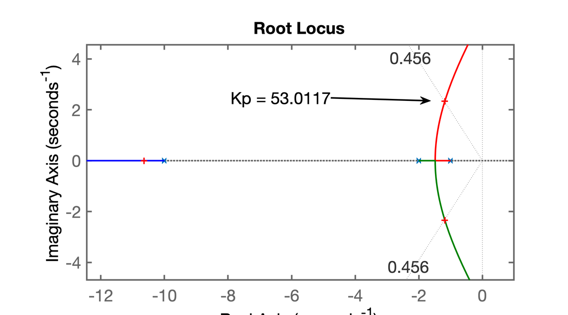
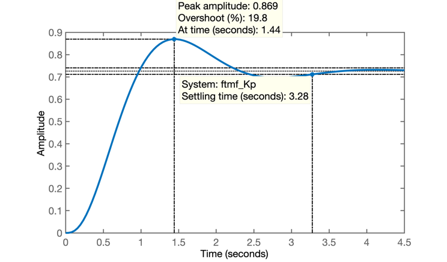
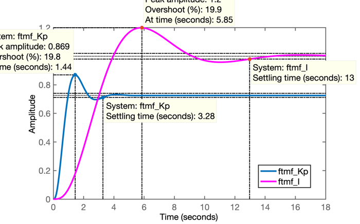
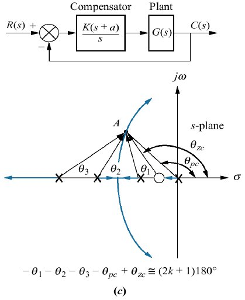

## Projeto de Controladores usando Root Locus

### Projeto de Controladores Prooporcional e com Ação Integral

> Arquivo criado na aula de 13/05/2020 

Seguem procedimentos usados para projeto de 3 controladores:

* Proporcional;
* Integral Puro
* PI (Proporcional + Integral)

para a mesma planta abaixo:

$$
G(s)=\dfrac{1}{(s+1)(s+2)(s+10)}
$$

onde o único resquisito de controle já especificado foi:

* *overshoot* máximo de 20%

## Projeto do Controlador Proporcional

```matlab
>> % Preparando ambiente de trabalho
>> mkdir aula_13_05_2020 % cria pasta
>> cd aula_13_05_2020/   % chaveia para pasta
>> diary aula_13_05_2020.txt % cria arquivo "log" .txt
>> pwd % confirmando diretório de trabalho
ans =
    '/Volumes/Data/Users/fernandopassold/Documents/MATLAB/aula_13_05_2020'
>> % Entrando com função transferência da planta:
>> G=tf ( 1, poly( [ -1 -2 -10 ] ) )

G =
             1
  ------------------------
  s^3 + 13 s^2 + 32 s + 20
 
Continuous-time transfer function.

>> zpk(G) % confirmando dados ingressados num formato mais conveniente

ans =
          1
  ------------------
  (s+10) (s+2) (s+1)
 
Continuous-time zero/pole/gain model.

>> rlocus(G) % gráfico do Root Locus
>> OS=20;    % overshoot máximo
>> zeta=(-log(OS/100))/(sqrt(pi^2+(log(OS/100)^2)))
zeta =
    0.4559
>> hold on
>> zgrid(zeta, 0) % sobreponde linha guia de zeta = cte
>> [Kp, polos_MF ]=rlocfind( G )
Select a point in the graphics window
selected_point =
  -1.1789 + 2.3377i
Kp =
   53.0117
polos_MF =
 -10.6369 + 0.0000i
  -1.1815 + 2.3384i
  -1.1815 - 2.3384i
>> % RL correspondente na figura abaixo
>> % 
```

Gráfico do RL para Controlador Proporcional:



Fechando a malha e verificando resposta ao degrau:

```matlab
>> % Fechando a malha
>> ftmf_Kp=feedback(Kp*G, 1);
>> figure; step(ftmf_Kp)
>> % Resultado do step:
>> % 
```

Resposta ao degrau unitário para Controlador Proporcional:



Repare que a referência adotada foi um degrau unitário, então $y(\infty)$ deveria tender o máximo possível para 1 para reduzir o erro. Mas percebe-se que $y(\infty) < 1$, verificando o __erro de regime permanente__:

```matlab
>> dcgain(ftmf_Kp) % verificando y(\infty)
ans =
    0.7261
>> erro_Kp=(1-dcgain(ftmf_Kp))/1*100
erro_Kp =
   27.3929
```

ou seja, 27,4% de erro em regime permanente. Algo considerável.

Acrescentando pólo na origem (integrador), para anular o erro de regime permanente (*teoria do erro*).

## Projeto do Controlador Integrador Puro

Este integrador possui equação:

$$
C(s)=\dfrac{K_i}{s}
$$

```matlab
>> C_I=tf( 1, [ 1  0 ] )

C_I =
 
  1
  -
  s
 
Continuous-time transfer function.

>> ftma_I=C_I*G; % calculando a FTMA(s) com este controlador
>> zpk(ftma_I)

ans =
 
           1
  --------------------
  s (s+10) (s+2) (s+1)
 
Continuous-time zero/pole/gain model.

>> figure; rlocus(ftma_I)
>> hold on
>> zgrid(zeta, 0)
>> [K_I, polos_MF] = rlocfind(ftma_I)
Select a point in the graphics window
selected_point =
  -0.3004 + 0.6003i
K_I =
   10.8405
polos_MF =
  -9.9849 + 0.0000i
  -2.4173 + 0.0000i
  -0.2989 + 0.5998i
  -0.2989 - 0.5998i
```

Segue RL da planta com Integrador Puro e já com ganho para $\zeta$ correspondente à $\%OS=20\%$:


Note que o pólo na origem (integrador), deixa o sistema bem mais lento. Surge um par de pólos complexos dominantes formado pelo pólo do integrador ($s=0$) e pelo pólo mais lento da planta (em $s=-1$). Tanto o ponto de partinda quanto os traçados de RL referentes à estes 2 pólos estão mais próximos do eixo $j \omega$ do que os pólos complexos dominantes no caso do Controlador Proporcional (*compare este RL com o RL do Controlador Proporcional*).

```matlab
>> % fechando a malha
>> ftmf_I=feedback(K_I*ftma_I, 1);
>> figure; step(ftmf_I)
>> % Comparando os 2 controladores
>> figure; step(ftmf_Kp, ftmf_I)
>> % 
```

Comparando a resposta ao degrau para estes 2 controladores:



Uma rápida análise permite notar:

* O Controlador Proporcional é quase $4 \times$ mais rápido que o Controlador Integrador Puro, __mas...__;
* O Controlador Proporcional implica num erro de regime permanente de quase 30%;
* O Controlador Integrador Puro anulou o erro de regime permanente, mas esta solução implicou num grande atraso de resposta (tempo de assentamento muito maior).

Existe alguma solução melhor que permita anular o erro de regime permanete enquanto mantêm o tempo de assentamento baixo?

## Projeto do Controlador PI

Revisando a estratégia, percebemos que projetamos um controlador integrador puro, mas não um PI, que é composto pela __soma__ de 2 ações de controle. O PI soma a ação de controle Proporcional + ação de controle do integrador puro, ou na forma de um diagramda de blocos:


Note: a diferença em relação ao Integrador Puro é um zero localizado (normalmente) entre o pólo integrador e o pólo mais lento da planta.

__Inicialmente__ vamos considerar que este zero do PI fique bem no meio do pólo integrador e do pólo mais lento da planta (em $s=-1$), ou seja, vamos fixar o zero em $s=-0,5$:

No Matlab:

```matlab
>> % ## Projeto do Controlador PI
>> C_PI=tf( [1 0.5] , [ 1 0 ] )

C_PI =
 
  s + 0.5
  -------
     s
 
Continuous-time transfer function.

>> ftma_PI=C_PI*G;
>> zpk(ftma_PI)

ans =
 
        (s+0.5)
  --------------------
  s (s+10) (s+2) (s+1)
 
Continuous-time zero/pole/gain model.

>> figure; rlocus(ftma_PI)
>> hold on;
>> zgrid(zeta, 0)
>> [K_PI, polos_MF]=rlocfind(ftma_PI)
Select a point in the graphics window
selected_point =
  -0.9904 + 1.9807i
K_PI =
   44.0865
polos_MF =
 -10.5179 + 0.0000i
  -1.0329 + 1.9917i
  -1.0329 - 1.9917i
  -0.4163 + 0.0000i
>> % RL à seguir:
>> % 
```

Segue RL da planta + PI (com ganho para $\zeta$ correspondente ao $\%OS=20\%$):


Fechando a malha com o ganho encontrado:

```matlab
>> ftmf_PI=feedback(K_PI*ftma_PI, 1);
>> figure; step(ftmf_Kp, ftmf_I, ftmf_PI)
>> % SEgue figura comparativa dos 3 controladores
>> % 
```

Segue figura mostrando resposta ao degrau e comparando os 3 controladores propostos nesta aula:


*Comentários*

* Note que o PI respondeu mais rápido que o Integrador Puro;
* Esta "aceleração" na resposta se deve à introdução do zero no PI em comparação ao zero inexistente no controlador I puro.
* Compare o RL do projeto do PI com o RL do Controlador Proporcional. Será notado que:
  * os pólos dominantes complexos e dominantes que caracterizam a resposta subamortecida desejada é composta pelo memos pares de pólos (os mais lentos da planta, em $s=-1$ e $s=-2$);
  * o par formado pelo pólo do integrador + zero do mesmo, criaram um novo traçado em comparação ao Integrador puro. Este novo traçado é o que permitiu um RL final similar ao RL do controlador Proporcional;
  * Porém note que a complexidade do sistema aumentou um pouco: são 4 pólos + 1 zero. 
  * E note que o zero do integrador atrai o pólo de MF do integrador para "longe" do eixo $j \omega$. Mas a questão talvez seja agora: - que tão distante este zero deve estar do pólo do integrador?

## Próxima aula

Então vamos seguir para o próximo tópico à ser debatido na próxima aula:

* Existe uma posição mais adequada para o zero do integrador?
* Opções $\times$ consequências para diferentes posições deste zero.
* Existe uma maneira mais determinística de determinar a posição deste zero?

Pelas equações estudadas anteriormente referente à respostas de sistemas de 2a-ordem, em especial o caso de sistema sub-amortecidos, percebemos que:

* Se para um sistema de controle é especificado o $\%OS$ (*overshoot*) máximo, temos como calcular o $\zeta$ (fator de amortecimento);
* Mas apenas com $\%OS$ ou $\zeta$, não temos como identificar (calcular), o ponto desejado para os pólos complexos que definem a resposta sub-amortecida deseja. Para tanto, deveria ser especificado ainda algum parâmetro temporal como:
    * $t_s$ (tempo de assentamento);
    * $t_r$ (tempo de subida); ou,
    * $t_p$ (tempo de pico).
* Se além de $\%OS$ for especificado também algum parâmetro temporal temos como determinar com precisão onde deve estar localizado o par de pólos complexos __e__ usar a regra básica do RL para via __contribuição angular__ descobrir onde deveria estar localizado o zero deste controlador. Algo como:



A título de curiosidade podemos tentar ser ousados e especificar um tempo de resposta (assentamento) de $t_s<3,5$ segundos. Um valor não menor que o do Controlador Proporcional (impossível de ser "batido" quando acrescentamos ação integral à um sistema), mas bem menor que o tempo de assentamento de um controlador Integrador Puro. 

Note que eventualmetne este valor não poderá ser resolvido matemáticamente, isto é, a regra do RL não permite pólos complexos com parte real tão pequena que ainda possam fazer parte do RL. Neste caso, teremos que "relaxar" um pouco nossas expectativas e passar $t_s$ para 4 segundos. 

## Finalizando a aula

A fim de faciliar a continuidade da(s) próxima(s) aula(s), não esqueceder de ingressar os últimos comandos no Matlab antes de simplesmente sair deste programa:
  
```matlab
>> save dados    % salva as variaveis criadas nesta seção de trabalho para próxima aula
>> % load dados  % este é comando que será usado para recuperar os dados
>> diary off     % não esquecer de "fechar" o arquivo texto diary
>> quit
```

---

Prof. Fernando Passold, em 13/05/2020.