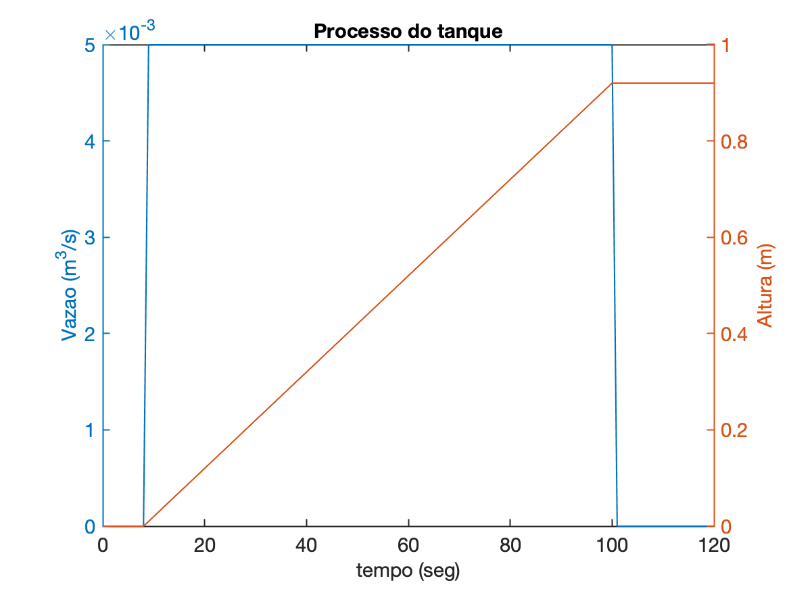
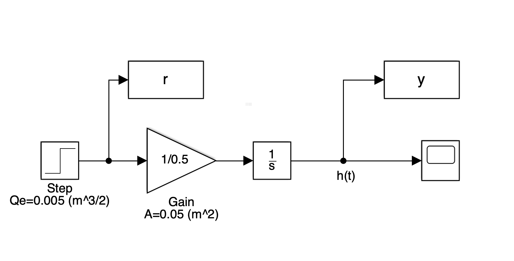
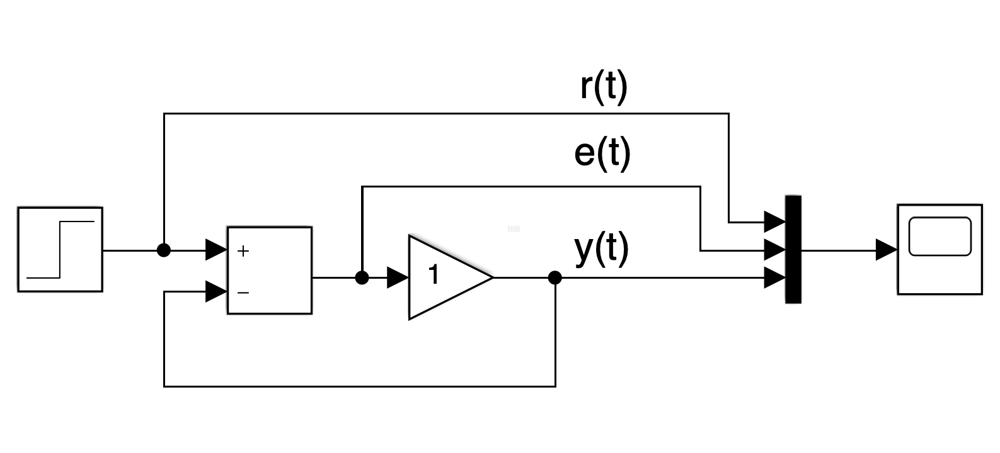
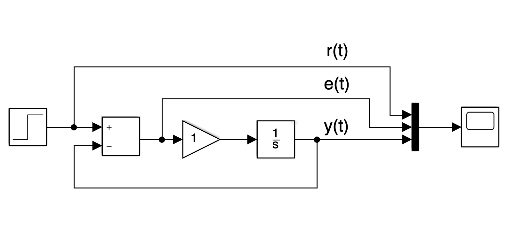
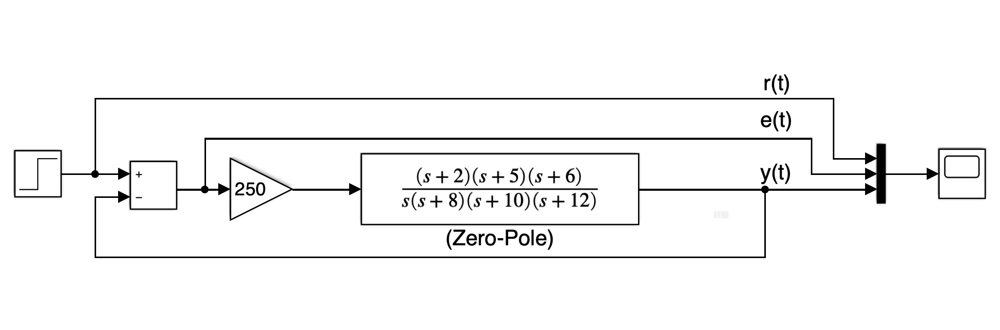
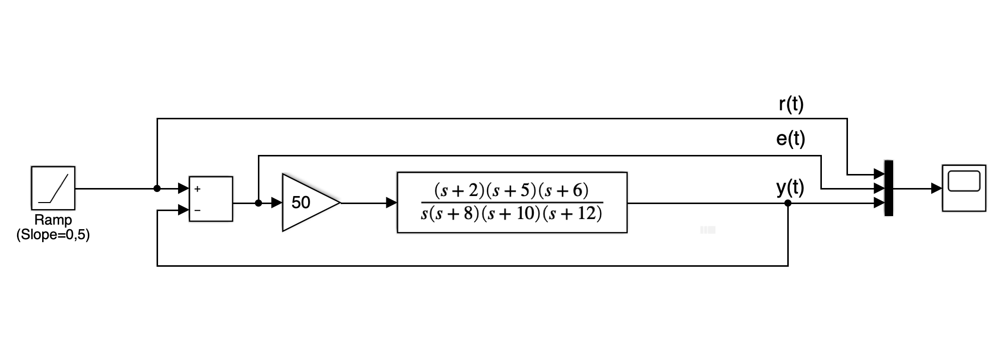

# Teoria de Erros
## Simulando processos

Sequência sugeria para processos à serem simulados:

Arquivo [`processo_tanque.m`](processo_tanque.m):

```Matlab
% Simulando processo tipo 1 (1 integrador)
% Preenchendo tanque com l?quido
% Avaliando altura atingida pelo l?quido

% Criando vetor tempo da simula??o
t=0:1:2*60; % criando vetor tempo (1 em 1 segundo; 2 minutos)
u=length(t); % No. de pontos do vetor t; u =   121
Qe=zeros(1,u); % criando vetor Qe mesma dimensao vetor t, zerado
% mas Qe=0.005 entre 10 < t < 10+1,5*60
% t(10) =     9
Qe(1,10:(10+1.5*60+1))=0.005;
% verificando...
plot (t,Qe)
A=0.5;
alpha=0.005/0.5; % razao
% inicializando vetor da altura com zeros
h=zeros(1,u);
for i=2:u
    h(i)=h(i-1)+Qe(i)/A; % calculando a integral de h(t)
end
[hAx,hLine1,hLine2] = plotyy(t,Qe, t,h);
title('Processo do tanque');
xlabel('tempo (seg)');
ylabel(hAx(1), 'Vazao (m^3/s)') % left y-axis
ylabel(hAx(2), 'Altura (m)') % right y-axis
```

A execução do *script* anterior deve levar ao seguinte resultado gráfico:



Simulação do (mesmo) processo do tanque no Simulink:



* Arquivo SLX (Matlab $\ge$ 2017b): [`processo_tanque_2.slx`](processo_tanque_2.slx)
* Arquivo MDL (Matlab $\le$ 2016a): [`processo_tanque_2.mdl`](processo_tanque_2.mdl)

---

### Simulação de Processo simples -- Apenas Controle Proporcional

Processo tipo 0 (sem integrador), com malha-fechada usando simples controlador proporcional:



Arquivos:

* [`simula_processo_sem_integrador_1.slx`](simula_processo_sem_integrador_1.slx) ou;
* [`simula_processo_sem_integrador_1.mdl`](simula_processo_sem_integrador_1.mdl).

### Simulação de Processo simples -- Com Integrador

Processo tipo 0 (sem integrador), com malha-fechada usando Integrador:



Arquivos: 

* [`simula_processo_1_integrador_1.slx`](simula_processo_1_integrador_1.slx) ou;
* [`simula_processo_1_integrador_1.mdl`](simula_processo_1_integrador_1.mdl)

### Processo mais complexo - Controle Proporcional (Entrada Degrau)

Processo à ser simulado:



Arquivos:

* [`processo_fig_7_7_b_NISE.slx`](processo_fig_7_7_b_NISE.slx) ou;
* [`processo_fig_7_7_b_NISE.mdl`](processo_fig_7_7_b_NISE.mdl)

### Processo mais complexo - Controle Proporcional (Entrada Rampa) 

Processo à ser simulado:



Arquivos: 

* [`processo_fig_7_7_b_NISE_rampa.slx`](processo_fig_7_7_b_NISE_rampa.slx) ou;
* [`processo_fig_7_7_b_NISE_rampa.mdl`](processo_fig_7_7_b_NISE_rampa.mdl)

---

Prof. Fernando Passold
