# Controle de Velocidade de Motor CC

Artigo original: *DC Motor Speed: Simulink Modeling, Control Tutorials for Matlab & Simulink*, URL: http://ctms.engin.umich.edu/CTMS/index.php?example=MotorSpeed&section=SimulinkModeling (acessado em 30/09/2020).

## Modelagem de Motor CC

Um atuador bastante comum em sistemas de controle é o motor CC (corrente Contínua). A velocidade do mesmo pode ser variada, variando-se sua tensão de alimentação. Ele fornece movimento rotativo diretamente e também pode fornecer movimento linear usando-se mecanismo de fuso (ou trosca trapezoidal):

| Exemplo 1                                 | Exemplo 2                                   | Exemplo 3                                     | Exemplo 4                                       | Exemplo 5                           |
| ----------------------------------------- | ------------------------------------------- | --------------------------------------------- | ----------------------------------------------- | ----------------------------------- |
| 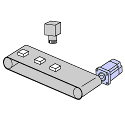 |  | 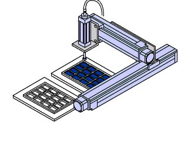 | 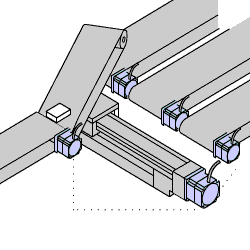 | 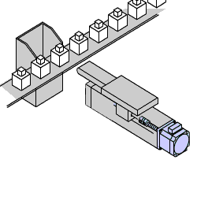 |

O circuito elétrico da armadura e o diagrama de corpo livre do rotor CC são mostrados na figura a seguir:

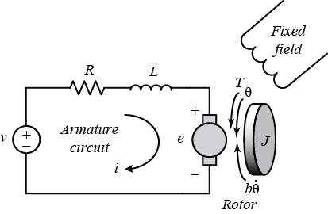

Para este exemplo, iremos supor que a entrada do sistema é a fonte de tensão ($V$) aplicada à armadura do motor, enquanto a saída é a velocidade de rotação do eixo $\dot{\theta}$ (ou velocidade angular, $\omega$). O rotor e o eixo são considerados rígidos. Assumimos ainda um modelo de atrito viscoso, ou seja, o torque de atrito é proporcional à velocidade angular do eixo.

Os parâmetros físicos para nosso exemplo são:

| Parâmetro | Descrição           | Valor (Unidades)     |
| ----- | ------------------------------------ | ---------------------- |
| $J$   | Momento de inércia d motor           | 0,01 ($Kg\cdot m^2$)     |
| $b$   | Constante de atrito viscoso do motor | 0,1 ($N\cdot m \cdot s$) |
| $K_e$ | Constante de força eletromitia       | 0,01 ($V/rad/s$)         |
| $K_t$ | Constante de torque do motor         | 0,01 ($N\cdot m / A$)    |
| $R$   | Resistência elétrica                 | 1 ($\Omega$)             |
| $L$   | Indutância elétrica                  | 0,5 ($H$)                |

Em geral, o torque gerado por um motor C é proporcional à corrente da armadura e à força do campo magnético. Neste exemplo, vamos assumir que o campo magnético é constante e, portanto, que o torque do motor é proporcional apenas à corrente da armadura $ i $ por um fator constante $ K_t $ conforme mostrado na equação abaixo. Isso é conhecido como motor controlado por armadura:
$$
T=K_T \cdot i
$$
A força contra-eletromotriz (f.e.m.), $ e $, é proporcional à velocidade angular do eixo por um fator constante $ K_e $:
$$
e=K_e\cdot \dot{\theta}
$$
Em unidades SI, o torque do motor e a constante f.e.m. são iguais, ou seja, $ K_t = K_e $; portanto, usaremos $ K $ para representar a constante de torque do motor e a constante de f.e.m. posterior.

Este sistema será modelado somando os torques que atuam na inércia do rotor e **integrando a aceleração para obter a velocidade**. Além disso, as leis de Kirchoff serão aplicadas ao circuito de armadura. 

Primeiro, vamos modelar as integrais da aceleração rotacional e da taxa de variação da corrente da armadura:
$$
\int \underbrace{\dfrac{d^2 \theta}{dt^2}}_{\text{aceleração}} dt=\underbrace{\frac{d \theta}{dt}}_{\text{velocidade}}
$$

$$
\int \dfrac{d i}{dt}dt=i
$$

Para construir o modelo de simulação, abra o **Simulink** e abra uma nova janela de modelo. Em seguida, siga as etapas listadas abaixo.

* Insira um bloco Integrador da biblioteca *Simulink >> Continuous*, e desenhe linhas para seus terminais de entrada e saída.
* Rotule a linha de entrada "d^2/dt^2 (theta)" e a linha de saída "d/dt (theta)" conforme mostrado abaixo. Para adicionar esse rótulo, clique duas vezes no espaço vazio logo abaixo da linha.
* Insira outro bloco integrador acima do anterior e desenhe linhas para seus terminais de entrada e saída.
* Rotule a linha de entrada "d/dt(i)" e a linha de saída "i".

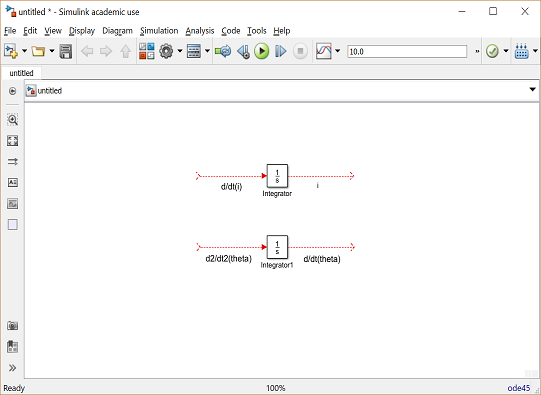

A seguir, vamos aplicar a lei de Newton e a lei de Kirchhoff ao sistema do motor para gerar as seguintes equações:
$$
J \dfrac{d^2 \theta}{dt^2}=T-b\dfrac{d \theta}{dt}
$$

$$
\dfrac{d^2 \theta}{dt^2}=\dfrac{1}{J}\left( K_t \, i - b \, \dfrac{d \theta}{dt}\right)
$$

e:
$$
L \dfrac{di}{dt}=-Ri+V-e
$$

$$
\dfrac{di}{dt}=\dfrac{1}{L}\left( -R\,i + V - K_e \, \dfrac{d \theta}{dt} \right)
$$

A aceleração angular, $\frac{d^2 \theta}{dt^2}$, é igual a $1/J$ multiplicado pela soma de dois termos (um positivo, um negativo). 

Da mesma forma, a derivada da corrente, $\frac{di}{dt}$,  é igual a $1/L$ multiplicado pela soma de três termos (um positivo, dois negativos). 

Continuando a modelar essas equações no Simulink, siga as etapas fornecidas abaixo:

* Insira dois blocos de ganho da biblioteca *Simulink >> Math Operations*, um associada a cada um dos integradores.
* Edite o bloco *Gain* correspondente à aceleração angular clicando duas vezes nele e alterando seu valor para `1/J`(propriedades).
* Mude o rótulo deste bloco de ganho para "Inércia" clicando na palavra "Gain" abaixo do bloco.
* Da mesma forma, edite o outro valor de Ganho para `1/L` e seu rótulo para "Indutância".
* Insira dois blocos *Add* da biblioteca *Simulink >> Math Operations*, cada um associado com uma linha a cada um dos blocos *Gain*.
* Edite os sinais do bloco *Add* correspondente à rotação para `+ -`, uma vez que um termo é positivo e outro é negativo (importante não confundir sequencia dos sinais).
* Edite os sinais do outro *Add* bloco a `- + -` para representar os sinais dos termos na equação elétrica.

O resultado esperado é mostrado na próxima figura:

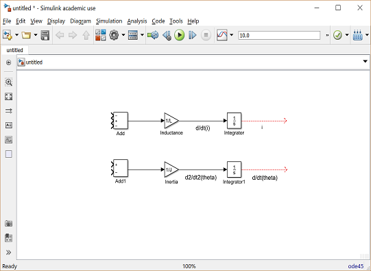

Agora, vamos adicionar os torques que são representados na equação de rotação. Primeiro, vamos adicionar o torque de amortecimento:

* Insira um bloco de *Gain* abaixo do bloco "Inércia". Em seguida, clique com o botão direito do mouse no bloco e selecione *Rotate & Flip > Flip Block* (Girar e Inverter>  Inverter Bloco) no menu resultante para inverter o bloco da esquerda para a direita. Você também pode inverter um bloco selecionado mantendo pressionado `Ctrl-I`.
* Defina o valor de ganho para `b` e renomeie este bloco para "Amortecimento".
* Toque em uma linha (segure `Ctrl` enquanto desenha ou clique com o botão direito na linha) fora da saída do integrador rotacional e conecte-a à entrada do bloco "Amortecimento".
* Desenhe uma linha da saída do bloco "Amortecimento" até a entrada negativa do bloco *Add* rotacional.

A seguir, adicionaremos o torque da armadura.

* Insira um bloco *Gain* anexado à entrada positiva do bloco *Add* rotacional com uma linha.
* Edite seu valor para `Kt` para representar a constante do motor e rotule-o como "Kt".
* Continue desenhando a linha que sai do Integrador atual e conecte-o ao bloco "Kt".

O resultado esperado é mostrado à seguir:

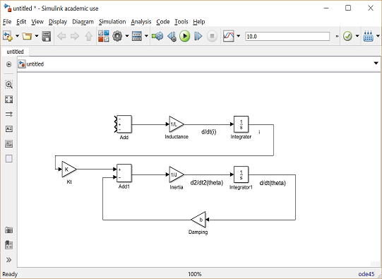

Agora, vamos adicionar os termos de tensão que são representados na equação elétrica. 

Primeiro, adicionaremos a queda de tensão na resistência da armadura:

* Insira um bloco de *Gain* acima do bloco de "Indutância" e gire-o da esquerda para a direita (*Flip*).
* Defina o valor de ganho para `R` e renomeie este bloco para "Resistência".
* Toque em uma linha da saída do integrador atual e conecte-a à entrada do bloco "Resistência".
* Desenhe uma linha da saída do bloco "Resistência" para a entrada negativa superior do bloco *Add* da equação atual.

Em seguida, adicionaremos a fem traseira do motor.

* Insira um bloco *Gain* anexado à outra entrada negativa do bloco *Add* atual com uma linha.
* Edite seu valor para `Ke` para representar a constante emf de retorno do motor e rotule-o como "Ke".
* Toque em uma linha da saída do integrador rotacional e conecte-a ao bloco "Ke".
* Adicione blocos *In1* e *Out1* da biblioteca *Simulink >> Ports & Subsystems* e, respectivamente, rotule-os de "Voltagem" e "Velocidade".

O design final deve ser semelhante ao exemplo mostrado na figura abaixo:

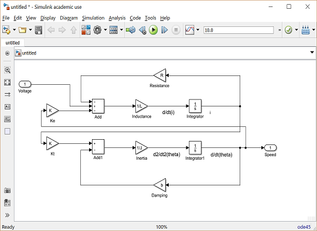

E para salvar todos esses componentes como um **único bloco de subsistema**, primeiro **selecione todos os blocos** e, em seguida, selecione **Criar Subsistema** a partir da Seleção após clicar com o botão direito do mouse na parte selecionada. Nomeie o subsistema "Motor DC" e salve o modelo. Seu modelo deve ficar com a seguinte aparência. 

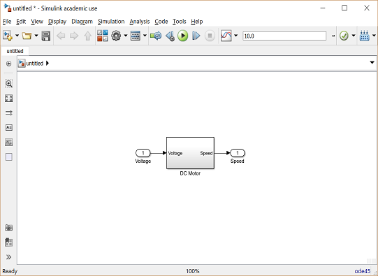

Alguns exemplos de controle de Velocidde deste motor aparecem originalmente aqui: [DC Motor Speed: Simulink Controller Design](http://ctms.engin.umich.edu/CTMS/index.php?example=MotorSpeed&section=SimulinkControl) (em inglês).

No nosso caso, resolvi acrescentar um segundo nó de saída: corrente do motor, para propiciar o monitoramento de eventuais correntes elevadas exigidas pelo motor. Foi acrescentado um bloco *Out2* associado com “Corrente”. O diagrama de blcoos final do modelo do motor **antes** da criação so subsistema aparece na próxima figura:

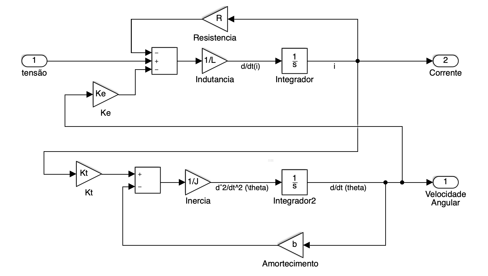

Você também pode baixar o arquivo pronto `motor_cc_velocidade.slx` deste sistema clicando [aqui](motor_cc_velocidade.slx).

Note que para este modelo ser usado, é neessário atribuir valores para as variáveis *R, L, Ke, Kt, J* e *b* (que aparecem dentro das propriedades de alguns blocos presentes na figura/modelo mostrado na figura anterior). Para facilitar o carregamento destas variáveis no *Workspace do Matlab, pode ser executado o script [`motor.m`](motor.m). 

Que transformado num sub-sistema resulta em (arquivo [`motor_cc_velocidade.slx`](Simulink/motor_cc_velocidade.slx)):

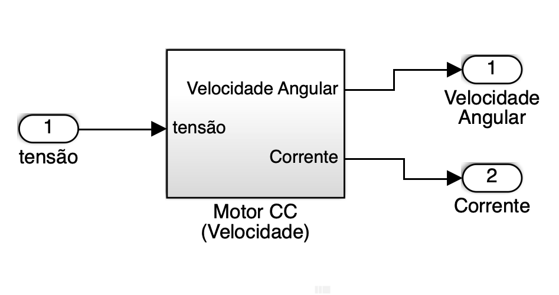

### Teste do Modelo

Ex$_1$: Teste de controle em Malha aberta (arquivo: [motor_cc_velocidade_teste_MA.slx](Simulink/motor_cc_velocidade_teste_MA.slx))

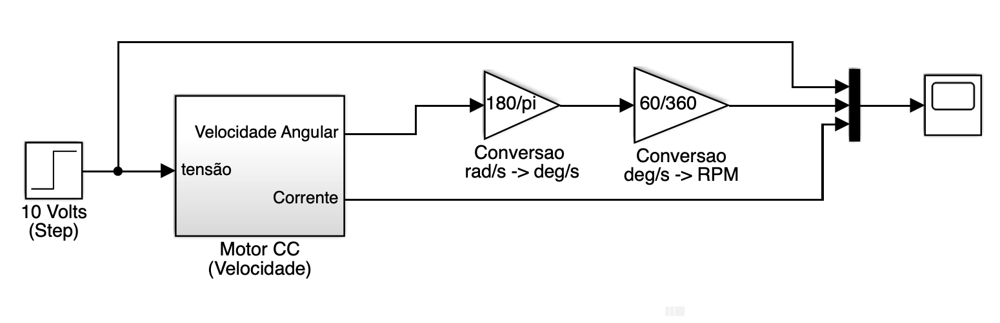

Note que neste caso, estamos alimentando o motor com 10 Volts (referência/entrada degrau) e monitorando a velocidade de saída, não em $rad/s$ mas em RPM (por isto os blocos *Gain* de conversão para converter do sistema SI para RPM):

Resultado esperado:

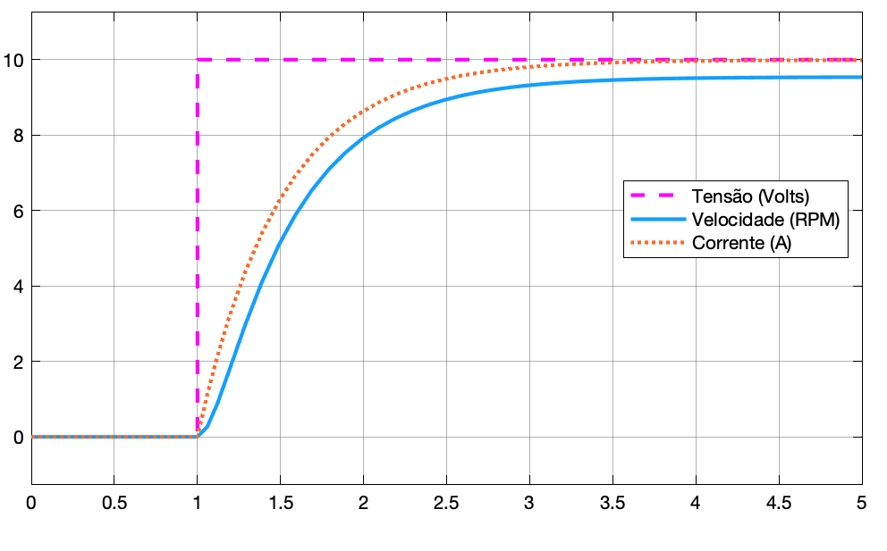

Note que aplicando 10 Volts na entrada (no motor), o mesmo quase alcança 10 RPMs de velocidade (de saída).

## Ações de Controle de Velocidade de Motor CC

### Exemplos

* Ex$_1$: Fechando uma malha de **controle Proporcional** de velocidade para este motor, para tentar manter velocidade em 10 RPM (arquivo: [`motor_cc_velocidade_cont_Prop.slx`](Simulink/motor_cc_velocidade_cont_Prop.slx)):

  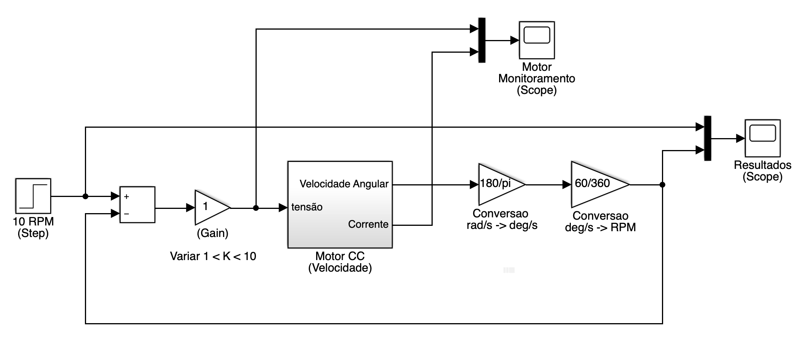 

  Que resulta em:

| 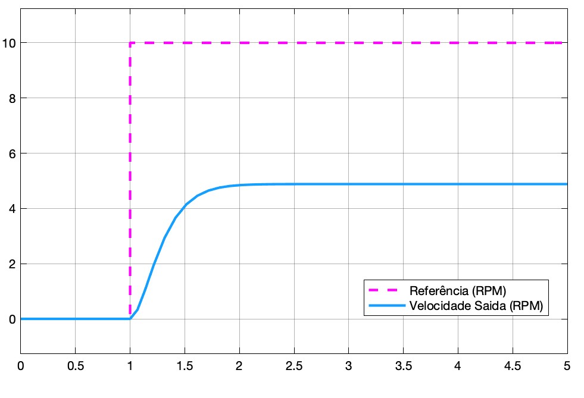 | 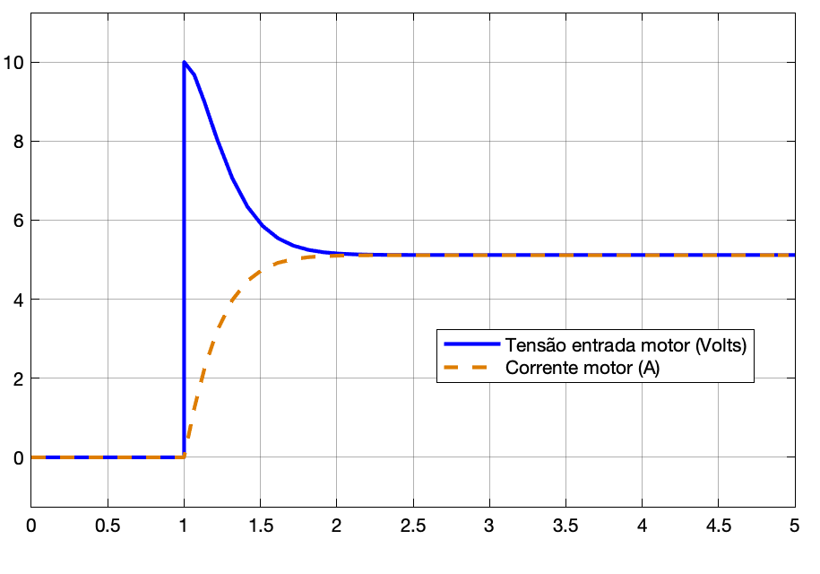 |
| :----------------------------------------------------------: | :----------------------------------------------------------: |
|                      Saída do Processo                       |                    Monitoramento do Motor                    |

* Ex$_2$: Fechando uma malha de **controle PI** (Proporcional-Integral) de velocidade para este motor, para tentar manter velocidade em 10 RPM (Arquivo: [`motor_cc_velocidade_cont_PI.slx`](Simulink/motor_cc_velocidade_cont_PI.slx)):

  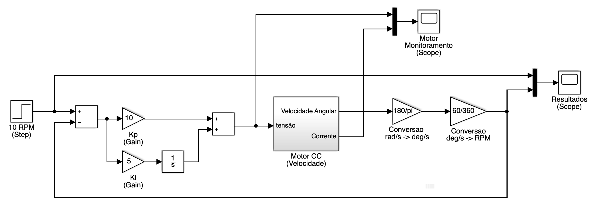

  Que resulta em:

| 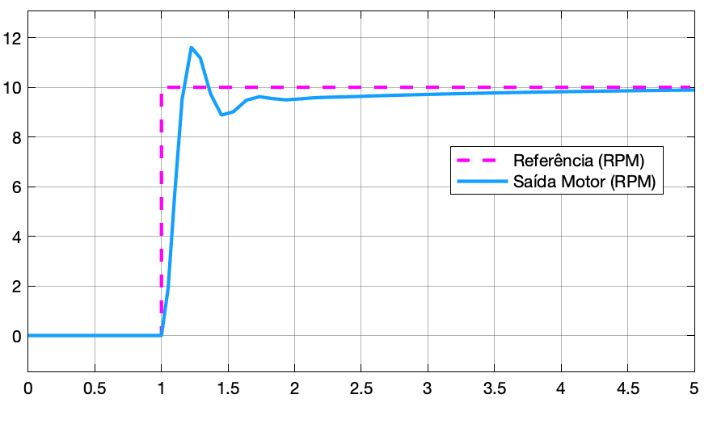 | 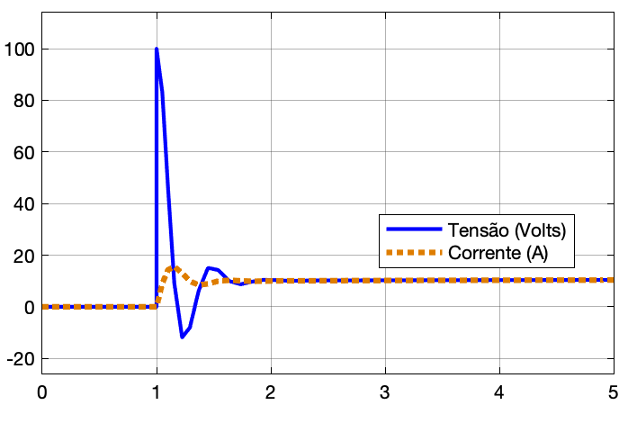 |
| :----------------------------------------------------------: | :----------------------------------------------------------: |
|                      Saída do Processo                       |                    Monitoramento do Motor                    |

* Ex$_3$: Fechando uma malha de **controle PD** (Proporcional-Derivaito) de velocidade para este motor, para tentar manter velocidade em 10 RPM (Arquivo: [`motor_cc_velocidade_cont_PD.slx`](Simulink/motor_cc_velocidade_cont_PD.slx)):

  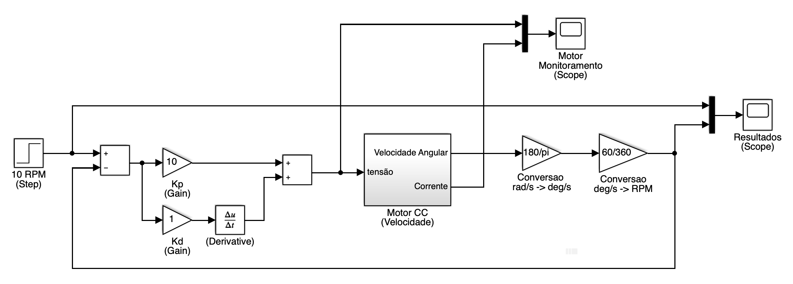

  Resultados:

| 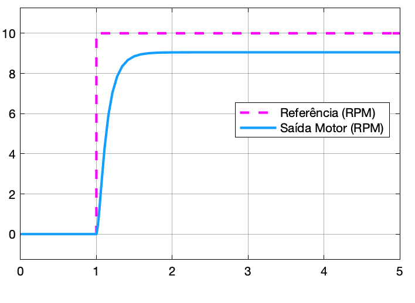 | 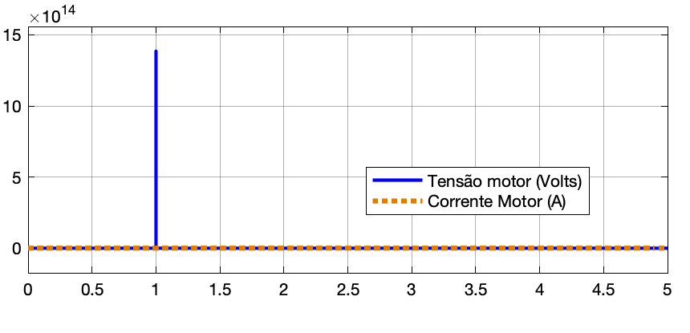 |
| :----------------------------------------------------------: | :----------------------------------------------------------: |
|                      Saída do Processo                       |                    Monitoramento do Motor                    |

* Ex$_4$: Fechando uma malha de **controle PID** (Proporcional-Integrativo-Derivaito) de velocidade para este motor, para tentar manter velocidade em 10 RPM (Arquivo: [`motor_cc_velocidade_cont_PID.slx`](Simulink/motor_cc_velocidade_cont_PID.slx)):

  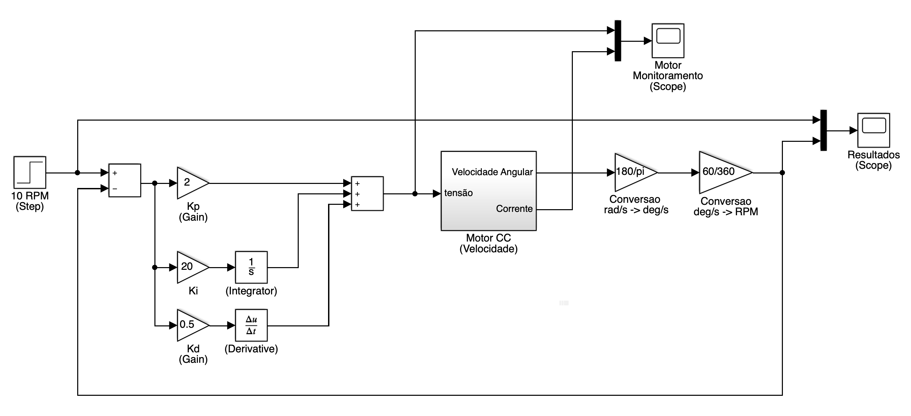

  Resultados:

  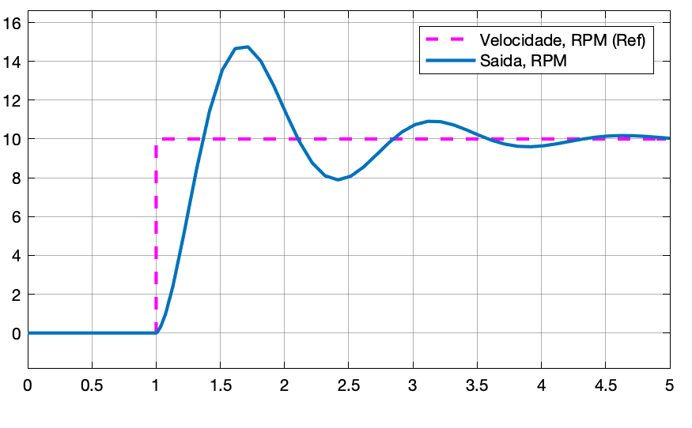

A idéia com os exemplos mostrados, é que você varie os ganhos dos controladores e observe o que acontece.

Um “pacote” (*bag*) de todos os arquivos necessários para as simulações está disponível [**aqui**](simulacoes_velocidade_motor_cc.zip).

---

Fernando Passold, em 31/08/2020; atualizado em 20.03.2021.