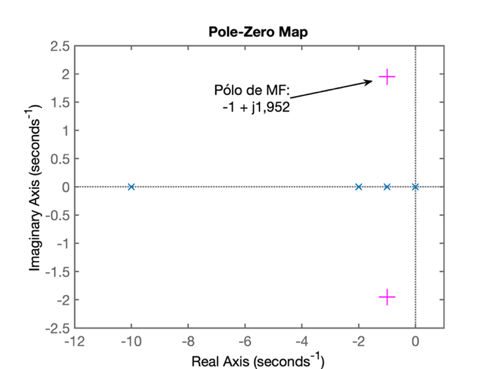
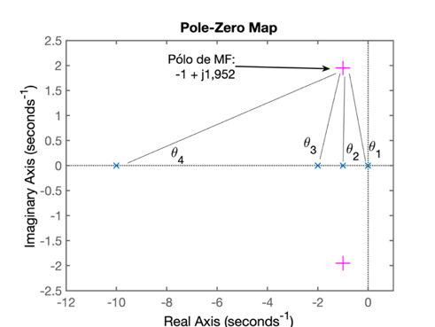
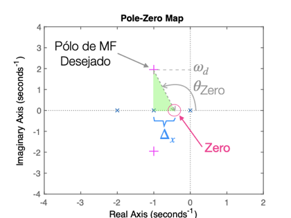
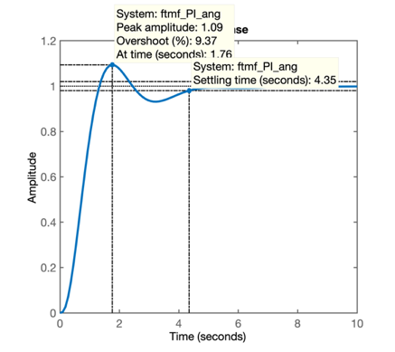
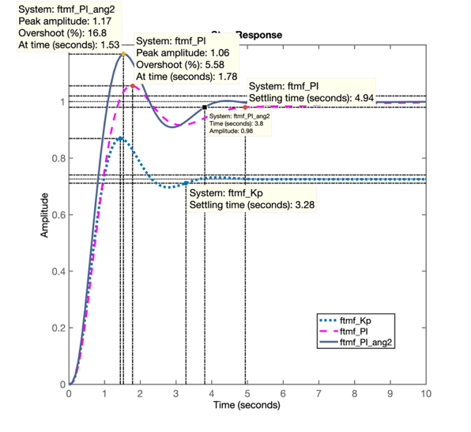

# Controle Automático II
## Projeto de Controladores usando Root Locus

> Aula de 20/05/2020

__Retomando os trabalhos__ da aula passada (aula de 13/05/2020; gravada na pasta: `/Documentos/MATLAB/aula_13_05_2020`) e assumindo que você "partiu" o Matlab à partir do seu diretório padrão `\Documentos\MATLAB\`, fazemos:

```matlab
>> cd aula_13_05_2020 % chaveamos Matlab para pasta da aula de 13/05/2020
>> load dados % ou load planta - para recuperar dados da aula passada
>> % Porém vamos gravar os dados desta aula em outro diretório:
>> cd .. % instrui Matlab para retroceder para diretório anterior, no caso \Documentos\Matlab\
>> mkdir aula_20_05_2020 % instrui Matlab para criar o subdiretorio:
>> % \aula_20_05_2020 à partir do diretório atual
>> save dados % salvando dados nesta nova pasta, apenas como garantia
>> 
```

Agora podemos continuar os trabalhos do ponto em que paramos na aula passada.

Lembrando da resposta ao degrau para Controlador Proporcional:

```matlab
>> zpk(G)

ans =
 
          1
  ------------------
  (s+10) (s+2) (s+1)
 
Continuous-time zero/pole/gain model.

>> step(ftmf_Kp)
```

Surge o seguinte gráfico:


Percebemos um tempo de assentamento $t_s=3,28$ segundos.

Note que não é possível especificar um controlador com ação integral capaz de atender a um tempo de assentamento inferior ao encontrado para o Controlador Proporcional.

> *Obs*.: caso o projetista tente projetar um PI com $t_s<3,28$, (mesmo usando contribuição angular), vai acabar encontrando um zero instável, que implica que o sistema a médio e longo prazo se torne instável.

> __Como exercício__: tente projetar um PI (usando contribuição angular) para tentar atender aos seguintes requisitos de controle: $\%OS<20\%$ e $t_s<3,2$ segundos.


Mas idéia nesta aula é __determinar o local do zero__ do PI usando o método de __contribuição angular__ ao invés de realizar um "*chute científico*" (Opções 1, 2, 3 e 4).


### Projeto de PI por Contribuição angular


Neste caso, manteremos $\%OS=20\%$ (usados nas aulas anteriores) e vamos especificar: $t_s \le 4$ (segundos):


```matlab
>> ts_d=4; % valor desejado para tempo de assentamento
>> zeta    % fator de amortecimento calculado e usado em aulas anteriores
zeta =
    0.4559
>> OS
OS =
    20
>> % Calculando freq. natural de oscilação p/sistema subamortecido
>> % com %OS=20% e ts=4 segundos
>> wn=4/(zeta*ts_d)
wn =
    2.1932
>> % Calculando parte imaginária do pólo de MF desejado
>> wd=wn*sqrt(1-zeta^2)
wd =
    1.9520
>> % Calculando parte real do pólo de MF desejado
>> sigma=wn*zeta 
sigma =
    1.0000
>> % Montando um vetor com dados para polos de MF desejados
>> polos_MFd=[-sigma+i*wd  -sigma-i*wd]
polos_MFd =
  -1.0000 + 1.9520i  -1.0000 - 1.9520i
>> % Montando equação auxiliar do PI (ainda sem o zero)
>> PI_aux=tf( [1], poly( [ 0 -1 -2 -10] ) );
>> zpk(PI_aux) % conferindo equação obtida

ans =
 
           1
  --------------------
  s (s+10) (s+2) (s+1)
 
Continuous-time zero/pole/gain model.

>> % Usando Matlab para desenhar no plano-s os pólos e zeros de um sistema
>> figure; pzmap(PI_aux)
>> % Acrescentaremos no gráfico os pólos de MF desejados
>> hold on
>> plot(polos_MFd, 'm+')
>> % Notamos que se faz necessário "forçar" o Matlab para aumentar 
>> % área usada para mostrar o gráfico completo de forma à incluir os
>> % pólos de MF deejados, que não estão aparecendo
>> axis( [ -12 1 -2.5 2.5]  )
```

O seguinte gráfico deve ser obtido:



Necessitamos proceder agora com o cálculo dos ângulos formados pelos pólos (e zeros, se houvessem) de MA do sistema com a posição desejada para o pólo de MF:



Calculando os ângulos:

```matlab
>> th1=atan2(wd, -sigma) % gera valor em radianos
th1 =
    2.0442
>> th1_deg=th1*180/pi % convertendo de radianos para graus
th1_deg =
  117.1261
>> th2=pi/2 % Este não é necessário calular \theta_2=90^o
th2 =
    1.5708
>> th3=atan2(wd, 1);
>> th3_deg=th3*180/pi
th3_deg =
   62.8739
>> th4=atan2(wd, 9)
th4 =
    0.2136
>> th4_deg=th4*180/pi
th4_deg =
   12.2372
>> % Realizando somatório dos ângulos formados pelos pólos da nossa FTMA(s)
>> sum_th_polos=th1+th2+th3+th4
sum_th_polos =
    4.9260
>> sum_th_polos_deg=sum_th_polos*180/pi % valor em graus
sum_th_polos_deg =
  282.2372
```

Lembrando da regra básica do RL que define quando um ponto pertence à uma curva no RL:

$$
\begin{array}{rcl}
\angle \, FTMA(s) &=& \pm 180^o \, (2k+1) \qquad (k \ge 0)\\
\angle \, C(s) \cdot G(s) \cdot \underbrace{H(s)}_{\text{Realimentação não unitária}} &=& \pm 180^o \, (2k+1)\\
\sum_m \theta_{\text{Zeros}} - \sum_n \theta_{\text{Pólos}} &=& \pm 180^o \, (2k+1)\\
\end{array}
$$

No caso deste controlador faremos:

$$
\theta_{\text{Zero}}= 180^o (2\underbrace{k}_{=0}+1) + \sum_n \theta_{\text{Pólos}}
$$


```matlab 
>> % Lembrar que Matlab trabalha em radianos e não em graus
>> th_zero=pi+sum_th_polos
th_zero =
    8.0676
>> th_zero_deg=th_zero*180/pi % valor em graus
th_zero_deg =
  462.2372
>> % ou:
>> th_zero_deg-360
ans =
  102.2372
```

Ou seja, o ângulo formado pelo zero para que o RL passe sobre os pólos de MF desejados é de: $\theta_{\text{Zero}}=102,24^o$, ou no plano-s fica:




```matlab
>> % Aplicando definição de tangente para calcular posição do zero
>> % tan(theta)=co/ca ou tan(theta)=y/x
>> delta_x=wd/tan(th_zero)
delta_x =
   -0.4234
>> % Calculando posição do zero:
>> zero_PI= -sigma - delta_x
zero_PI =
   -0.5766
>> % Zero localizado em s = -0,5766
>> % Completando a equação do PI por contribuição angular
>> PI_ang=tf(  [1 -zero_PI], [1 0 ] )

PI_ang =
 
  s + 0.5766
  ----------
      s
 
Continuous-time transfer function.

>> % Considerando eq. deste PI na FTMA(s):
>> ftma_PI_ang=PI_ang*G;
zpk(ftma_PI_ang)

ans =
 
       (s+0.5766)
  --------------------
  s (s+10) (s+2) (s+1)
 
Continuous-time zero/pole/gain model.

>> % confirmando como ficou o RL:
>> figure; rlocus(ftma_PI_ang)
>> axis( [ -12 1 -2.5 2.5]  ) % ajustando área desejada para o gráfico
>> hold on
>> plot(polos_MFd, 'm+')      % sobrepondo no RL os pólos de MF desejados
>> sgrid(zeta, wn)            % sobrepondo linhas guia para zeta e wn
>> wn
wn =
    2.1932
>> % Determinando ganho do controlador para este ponto no RL:
>> [K_PI_ang, polos_MF]=rlocfind(ftma_PI_ang)
Select a point in the graphics window
selected_point =
  -0.9793 + 1.9690i
K_PI_ang =
   44.1212
polos_MF =
 -10.5147 + 0.0000i
  -0.9948 + 1.9729i
  -0.9948 - 1.9729i
  -0.4956 + 0.0000i
>>
```

O que resulta no gráfico:


Fechando a malha com o ganho anteriormente encontrado e verificando resposta à entrada degrau:

```matlab
>> ftmf_PI_ang=feedback(K_PI_ang*ftma_PI_ang, 1);
>> figure; step(ftmf_PI_ang)
>> 
```



Notamos que $t_s \ne 4$ ou mesmo que $t_s > 4,0$, __mas__ note também que $\%OS<20\%$.

O controlador projetado desta forma não atendeu 100% dos requisitos de controle desejados mas por motivos fáceis de explicar. Note:

* o sistema em MF neste projeto, é um de 4a-ordem, e não de 2a-ordem como o adotado para as equações que permitem prever ou calcular: $\%OS$, $\zeta$, $t_s$, $t_p$ ou $t_r$.
* Mesmo assim, usamos as equações desenvolvidas especialmente para sistemas subamortecidos de 2a-ordem em MF, porque podemos considerar apenas os pólos dominantes (que dominam a resposta) em sistemas de MF de ordem superior. Nos casos de sistemas de ordem superior, consideramos que o par de pólos complexos que caracteriza uma resposta típica sub-amortecidade é tanto mais válido quanto existir realmente apenas um par de pólos complexos que domine a resposta do sistema, mesmo quando este é de ordem superior. Se espera que os outros pólos que completem a ordem do sistema, não sejam dominantes, ou seja, que estejam mais afastados do eixo $j\omega$ (preferencialmente na direção de $s \to -\infty$) do que certo par de pólos complexos, e ainda que estes outros pólos estejam algo distantes do par de pólos complexos (de forma que não influenciem tanto na resposta subamortecida esperada).
* No caso particular deste exemplo, note que estamos fechando a malha e obtendo um sistema de 4a-ordem, onde realmente existe um par de pólos complexos (que modulam a saída como o de um sistema sub-amortecido) mas existem também mais 2 pólos reais, sendo que um deles acaba ficando mais próximo do eixo $j\omega$ que a parte real dos pólos complexos neste sistema. Este pólo real mais próximo do eixo $j\omega$ (localizado em $s=-0,4956$ -- ver resultados retornados pelo último comando `rlocfind()`) é o que "atrasa" a resposta alcançada pelo par de pólos complexos em MF ($s=-0,9948 \pm j1,9729$ para malha fechada com $K\_PI\_ang = 44,1212$).
* Uma opção para "acelerar" ainda mais este PI é "aproximar" ainda mais o zero do PI do pólo mais lento da planta. De fato, poderia ser tentando algo como: $PI_3(s)=\dfrac{K(s+0,9)}{s}$. Como pode ser percebido no RL, quando a malha é fechada, o pólo do integrador (localizado em $s=0$) move-se na direção do zero do próprio controlador. Se a idéia é fazer com que este pólo de MF, fique o mais distante possível do eixo $j\omega$, então faz sentido localizar o zero do controlador, o mais próximo possível do pólo mais lento da planta (localizado em $s=-1$).
* Outra idéia válida para tentar "acelerar" a resposta de um sistema, é aumentar ainda mais o seu ganho, desde que se respeite os requisitos de controle passados. Neste caso, com este último PID foi alcançado um sobressinal de $\%OS=9,37\%$, bem abaixo dos $\%OS \le 20$ passados como resquistos de controle. Isto significa que há ainda um bom "espaço de manobra", isto é, que o ganho poderia ser aumentado na esperança de acelerar este controlador e alcançar o $t_s$ desejado.

DE fato, aumentando-se o ganho do controlador de $K\_PI\_ang=44,1212$ para $K\_PI\_ang2=55$, podemos verificar se a última hipótese pode ser atendida:

```matlab
>> K_PI_ang2=55;
>> ftmf_PI_ang2=feedback(K_PI_ang2*ftma_PI_ang, 1); % fechando malha com este ganho
>> figure; step(ftmf_PI_ang2)
>> 
```

E se obtêm a seguinte resposta ao degrau:


ou seja, sem muitas tentativas e erros (processo que pode demandar muito tempo), este novo valor de ganho permitiu até um $t_s<4,0$ sengudos. E ainda se pode aumentar mais o ganho porque o sobresinal atingido ainda está abaixo do máximo especificado.

Podemos comparar a atuação dos 3 ultimos controladores principais: Proporcional, PI (1a-versão) e PI\_ang2 (com ganho aumentado):

```matlab
>> figure; step(ftmf_Kp, ftmf_PI, ftmf_PI_ang2)
``` 

E a seguinte figura é obtida:



*Comentários:*

* Pode ser comprovado pelo último gráfico, que o controlador Proporcional, normalmente é mais rápido que um controlador com ação integral. Isto se deve ao fato de que o pólo na origem (o que caracteriza a ação integral), normalmente acaba atraido pólos de MF dominantes para mais próximos do eixo $j \omega$, o que implica num atraso na resposta (maiores tempos de assentamento).
* Porém o controlador Proporcional não garante erro nulo para regime permanente, neste caso (planta do tipo 0), o erro do controlador Proporcional gira em torno dos 27%.
* Controladores com ação integral visam justamente eliminar o erro de regime permanente, porém às custas de um maior tempo de assentamento em comparação à um controlador Proporcional.
* Mas nada impede que o projeto cuidadoso e atento de um Controlador PI quase possa alcançar o tempo de resposta de um Controlador Proporcional, neste caso, com a vantagem de garantir erro nulo em regime permanente.

Por fim, é bom lembrar que o circuito eletrônico capaz de realizar um controlador com ação integral (pólo na origem do plano-s), exige um uso de uma rede ativa, isto é, ingresso de energia no controlador e uso de "modernos" amplificadores operacionais.

## Projeto do Controlador por Atraso de Fase (Lag)

Nos casos em que não se exige pólo do controlador exatamente sobre a origem do plano-s (não se exige ação realmente intetral) mas próximo ao mesmo, deixamos de realizar um controlador com ação integral e passamos à realizar um controador chamado de Controlador por Atraso de Fase (ou *Lag*).

Quanto mais próximo da origem, estiver o pólo deste controlador, mais o mesmo se comportará de maneira semalhante a um integrador, e isto quer dizer, menor será o erro de regime permanante. Mas não haverá, com este controlador, como zerar o erro de regime permanente.

De resto, o projeto deste controlador é semalhante ao de um controlador PI, onde normalmetne o zero do mesmo, fica o mais próximo possível do pólo mais lento da planta à ser controlada.

Controladores por atraso de fase com ganho $<1$ podem ser realizados na prática, apenas fazendo uso de uma rede RC (uma rede passiva, que não exige ingresso extra de energia para funcionar).

Realizando o projeto deste controlador para a planta sendo adotada em sala de aula:

```matlab
>> Lag1=tf( [1  0.9],  [1 0.1] )

Lag1 =
 
  s + 0.9
  -------
  s + 0.1
 
Continuous-time transfer function.

>> ftma_Lag1=Lag1*G;
>> zpk(ftma_Lag1) % apenas para verificar posições dos pólos e zeros

ans =
 
           (s+0.9)
  --------------------------
  (s+10) (s+2) (s+1) (s+0.1)
 
Continuous-time zero/pole/gain model.

>> figure; rlocus(ftma_Lag1)
>> hold on;
>> sgrid(zeta,0)
>> plot(polos_MFd, 'm+')
>> [K_Lag1,polosMF]=rlocfind(ftma_Lag1)
Select a point in the graphics window
selected_point 
  -0.8916 + 1.7843i
K_Lag1 =
   38.1273
polosMF =
 -10.4414 + 0.0000i
  -0.8925 + 1.7845i
  -0.8925 - 1.7845i
  -0.8736 + 0.0000i
>>
```

O RL deste controlador é mostrado na próxima figura:


Fechando a malha e verificando resposta ao degrau:

```matlab
>> ftmf_Lag1=feedback(K_Lag1*ftma_Lag1, 1);
>> figure; step(ftmf_Lag1)
```


Note que para este controlador, depois de atribuída uma posição para seu pólo, o seu zero poderia ter sido calculado com precisão usando o método da contribuição angular. Mas neste caso, foi desejado realizar um projeto rápido com base na teoria já observada no decorrer do curso.

Podemos comparar a resposta deste controlador com o de outros projetados anteriormente:

```matlab
>> figure; step(ftmf_Kp, ftmf_PI, ftmf_Lag1)
```

Que gera a seguinte figura:


Note o erro de regime permanete do Lag1: $e(\infty)=5,5\%$:

```matlab
>> dcgain(ftmf_Lag1) % calculando y(\infty)
ans =
    0.9449
>> erro_Lag1=(1-dcgain(ftmf_Lag1)/1)*100
erro_Lag1 =
    5.5074
```

### Encerrando atividades no Matlab

Por fim, não se esqueça de ao final da aula, ou de uma seção de trabalho no Matlab, antes de sair do mesmo, fazer:

```matlab
>> save dados
>> save planta
>> diary off
```

---

Prof. Fernando Passold, em 20/05/2020