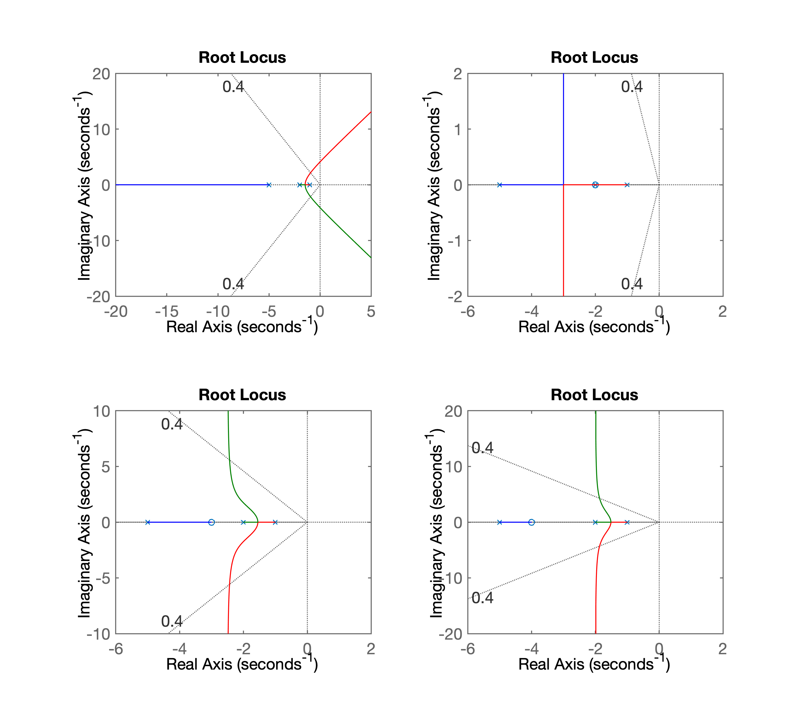
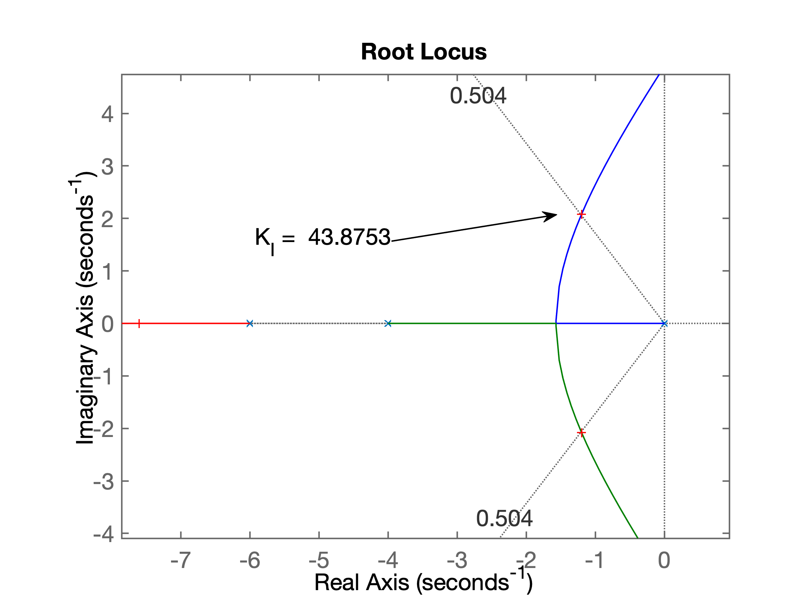
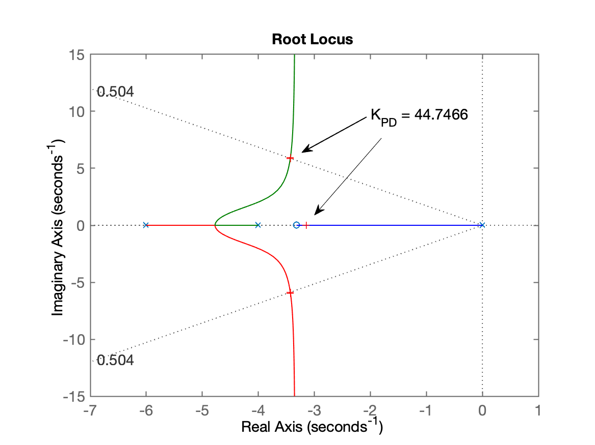

# Projeto de PD

> Arquivo: `aula_PD_03out2019.txt`

Embasamento teórico --> Arquivo PDF: [Root_Locus_Cap_9_parte_2_ptbr.pdf](Root_Locus_Cap_9_parte_2_ptbr.pdf)

## Exemplo\_1

Planta:
$$
G(s)=\dfrac{1}{(s+1)(s+2)(s+5)}
$$


Controlador PD, formato genérico:
$$
C(s)=K_p+K_d \, s = K_d \left( s + \dfrac{K_p}{K_d} \right)
$$
ou seu formato genérico:
$$
G(s)=K \left( s+z_c \right)
$$
Dúvida: onde alocar o zero do PD !? Opções:

1. Zero em $s = -2$;
2. Zero em $s=-3$;
3. Zero em $s=-4$.

Avaliando as opções:

```matlab
>> % entrando com a planta
>> G=tf(1, poly( [-1 -2  -5] ) );
>> zpk(G)

          1
  -----------------
  (s+5) (s+2) (s+1)

Continuous-time zero/pole/gain model.

>> % Ingressando com PDs
>> PD1=tf([1 2],1)

PD1 =
  s + 2

Continuous-time transfer function.

>> PD2=tf([1 3],1);
>> PD3=tf([1 4],1);
>> PD4=tf([1 7],1);
>> ftma_PD1=PD1*G;
>> ftma_PD2=PD2*G;
>> ftma_PD3=PD3*G;
>> ftma_PD4=PD4*G;
>> ftma=G; % Puro controlador proporcional
>> subplot(2,2,1); rlocus(ftma); 
>> sgrid(0.4, 0)
>> subplot(2,2,2); rlocus(ftma_PD1); sgrid(0.4, 0)
>> subplot(2,2,3); rlocus(ftma_PD2); sgrid(0.4, 0)
>> subplot(2,2,4); rlocus(ftma_PD3); sgrid(0.4, 0)
% [compara_PDs.png](
```

RL para as diferentes opções:




## Exemplo\_2

Seja a planta:
$$
G(s)=\dfrac{1}{s(s+4)(s+6)}
$$
Note que já é uma planta, sistema do tipo 1 (com um integrador), o que já garante erro nulo em regime permanente para entrada degrau.

O objetivo é projetar um PD capaz de: $\%OS \le 16\%$ e reduzir $t_s$ em $1/3$ em comparação à um controlador proporcional.

***Solução:***

```matlab
>> % Iniciando pelo projeto do Controlador Proporcional
>> G=tf(1,poly([0 -4 -6]));
>>zpk(G)

ans =

        1
  -------------
  s (s+6) (s+4)

Continuous-time zero/pole/gain model.

>> OS=16; % $\%OS \le 16\%$
>> zeta=(-log(OS/100))/(sqrt(pi*pi+(log(OS/100))^2))
zeta =
    0.5039
>> % Sintonizando o Integrador, para descobrir ts
>> ftma_I=G;
>> figure; rlocus(ftma_I)
>> hold on;
>> sgrid(zeta,0)
>> [K_I,polosMF]=rlocfind(ftma_I)
Select a point in the graphics window
selected_point =
  -1.1912 + 2.0793i
K_I =
   43.8753
polosMF =
  -7.6022 + 0.0000i
  -1.1989 + 2.0818i
  -1.1989 - 2.0818i
>> % RL saldo como: RL_Integrador_exemplo_PD.png
>> % [RL_Integrador_exemplo_PD.png](RL_Integrador_exemplo_PD.png)
% fechando a malha para descobrir ts
ftmf_I=feedback(K_I*
```

RL para o Integrador:



Fechando malha do Integrador para descobrir $t_s$ original:

```matlab
>> % fechando a malha para descobrir ts
>> ftmf_I=feedback(K_I*ftma_I, 1);
>> figure; step(ftmf_I)
>> grid
>> % Gráfico salvo como: step_integrador_exemplo_PD.png
```


Finalmente se descobre que:

```matlab
>> ts=3.48;
>> ts_d=3.5/3
>> ts_d =
    1.1667
>> save planta_PD % opcional
```

Controlador PD, formato genérico:
$$
C(s)=K_p+K_d \, s = K_d \left( s + \dfrac{K_p}{K_d} \right)
$$
ou seu formato genérico:
$$
G(s)=K \left( s+z_c \right)
$$

**Incóginita**: -- onde posicionar o zero deste controlador?

*Resposta*: usar contribuição angular.

### Método manual:

```matlab
>> sigma=4/ts_d
sigma =
    3.4286
>> wn=4/(zeta*ts_d)
wn =
    6.8045
>> wd=wn*sqrt(1-zeta^2)
wd =
    5.8776
>> polos_MFd=[-sigma+i*wd -sigma-i*wd]
polos_MFd =
  -3.4286 + 5.8776i  -3.4286 - 5.8776i
>> % verificando onde os pólos desejados de MF se
>> % encontraram no plano-s
>> figure; rlocus(ftma_I);
>> hold on;
>> sgrid(zeta,wn)
>> plot(polos_MFd, 'b+');
>> plot(polos_MFd, 'b+', 'MarkerSize',18);
>> th_p1=atan2(wd,-sigma)
th_p1 =
    2.0989
>> th_p1*180/pi % resposta em graus (e não em radianos)
ans =
  120.2562
>> th_p2 = atan2(wd,4 - sigma)
th_p2 =
    1.4739
>> th_p2*180/pi
ans =
   84.4471
>> th_p3 = atan2(wd,6 - sigma)
th_p3 =
    1.1584
>> th_p3*180/pi
ans =
   66.3708
>> sum_th_p=th_p1+th_p2+th_p3
sum_th_p =
    4.7311
>> sum_th_p*180/pi
ans =
  271.0741
>> th_z = sum_th_p - pi
th_z =
    1.5895
>> th_z*180/pi
ans =
   91.0741
>> zero = sigma - wd/tan(th_z)
zero =
    3.5388
>> PD=tf([1 zero], 1)

PD =

  s + 3.539

Continuous-time transfer function.

>> ftma_PD=PD*ftma_I;
>> zpk(ftma_PD)

ans =

    (s+3.539)
-------------
  s (s+6) (s+4)

Continuous-time zero/pole/gain model.

>> figure; rlocus(ftma_PD)
>> hold on
>> sgrid(zeta,wn)
>> plot(polos_MFd, 'b+', 'MarkerSize',18, 'LineWidth', 3);
>> [K_PD,polosMF]=rlocfind(ftma_PD)
Select a point in the graphics window
selected_point =
  -3.3102 + 5.6431i
K_PD =
   41.1686
polosMF =
  -3.2936 + 5.6427i
  -3.2936 - 5.6427i
  -3.4128 + 0.0000i
>> ftmf_PD=feedback(K_PD*ftma_PD, 1);
>> figure;
>> step(ftmf_PD)
>> % Gráfico da resposta salvo como: step_PD.png
>> % Gráfico do RL do PD salvo como: RL_PD.png
>> save planta_PD
```

RL final:


Resposta ao degrau unitário:


### Usando *script*

Usando rotina desenvolvida para Matlab: [`find_polo_zero.m`](find_polo_zero.m) :

```matlab
>> help find_polo_zero
  find_polo_zero.m
  
  Rotina de contribuição angular para descobrir onde
  localizar pólo ou zero dependendo do local desejado para
  os pólos de MF
 
  Uso:
     Esta rotina já espera uma tf de nome "ftma_aux"
  onde: ftma_aux(s)=C(s)*G(s);
  e onde: C(s) está parcialmente fornecido, ou já contendo
  zero(s) ou já contendo pólo(s)
  
  A rotina pergunta durante a execução se a idéia é
  determinar o local de um zero ou de um pólo
 
  Fernando Passold, em 14/10/2020, 20/10/2020

>> ftma_aux=G;
>> find_polo_zero
Overshoot desejado (em %): ? 16
ts_d (desired settling time): ? 1.1667
Pólos (desejados) de MF em: s = -3.42847 \pm j 5.87743
Calculando ângulos dos Pólos:
  Pólo 1 em s= 0 --> Ângulo: 120.256^o
  Pólo 2 em s= -6 --> Ângulo: 66.3694^o
  Pólo 3 em s= -4 --> Ângulo: 84.446^o
Soma ângulos dos pólos: 271.072^o

Calculando ângulos dos Zeros:
Soma ângulos dos zeros: 0^o

Determinar: [p]=pólo ou [z]=zero do controlador: ? z

Ângulo do zero do controlador: 91.0716^o
O zero do controlador deve estar em s = -3.31854
>> 
```

| Contribuição angular | RL final |
| :---: | :---: |
|  |  |

Finalizando sintonia deste controlador (falta ganho):

```matlab
>> % Note que variável ftma já contem ftma_aux + zero calculado:
>> zpk(ftma)

ans =
 
    (s+3.319)
  -------------
  s (s+6) (s+4)
 
Continuous-time zero/pole/gain model.

>> [K_PD, polosMF] = rlocfind(ftma) % sobre a 2a-figura gerada antes
Select a point in the graphics window
selected_point =
  -3.4408 + 5.9535i
K_PD =
   44.7466
polosMF =
  -3.4263 + 5.9531i
  -3.4263 - 5.9531i
  -3.1475 + 0.0000i
>> % fechando malha e avaliando resposta ao degrau unitário
>> ftmf_PD=feedback(K_PD*ftma, 1);
>> figure; step(ftmf_PD)
>> stepinfo(ftmf_PD)
ans = 
  struct with fields:

        RiseTime: 0.2487
    SettlingTime: 1.1854
     SettlingMin: 0.9028
     SettlingMax: 1.1401
       Overshoot: 14.0121
      Undershoot: 0
            Peak: 1.1401
        PeakTime: 0.5376
>> 
```
Resposta ao degrau unitário para este PD:


## Comparando controladores

```matlab
>> figure; step(ftmf_I, ftmf_PD)
>> % Gráfico salvo como: comparando_step_I_PD.png
>> % [comparando_step_I_PD.png](comparando_step_I_PD.png)
>> format compact
>> zpk(ftma_I)

ans =

        1
-------------
  s (s+6) (s+4)

Continuous-time zero/pole/gain model.

>> % Encerrando atividades no Matlab:
>> save planta_PD
>> diary off
```


---

Fernando Passold
