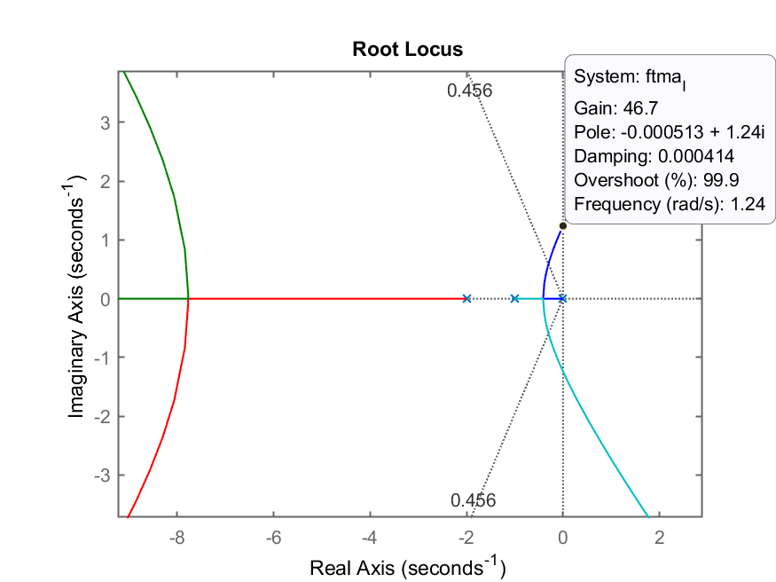
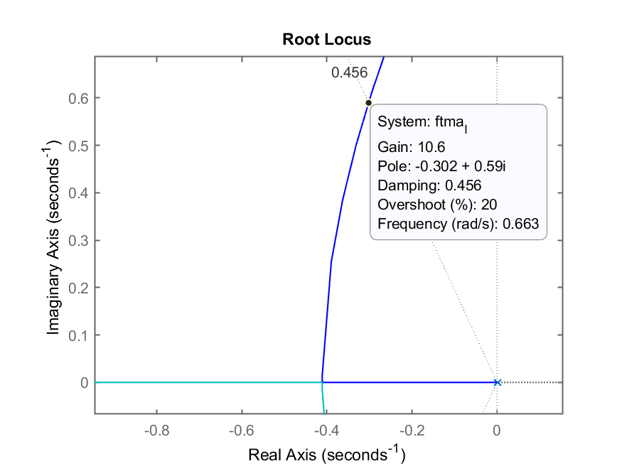
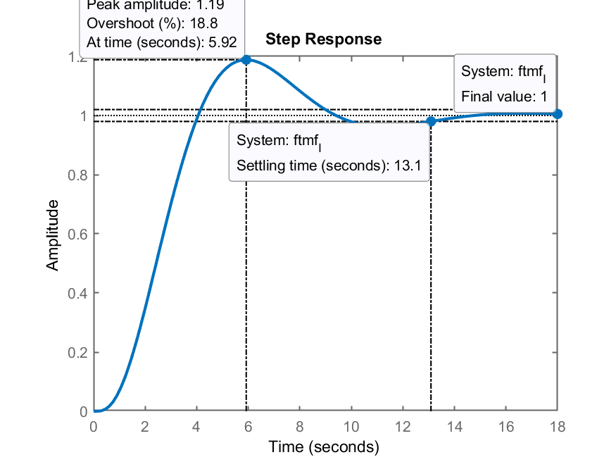
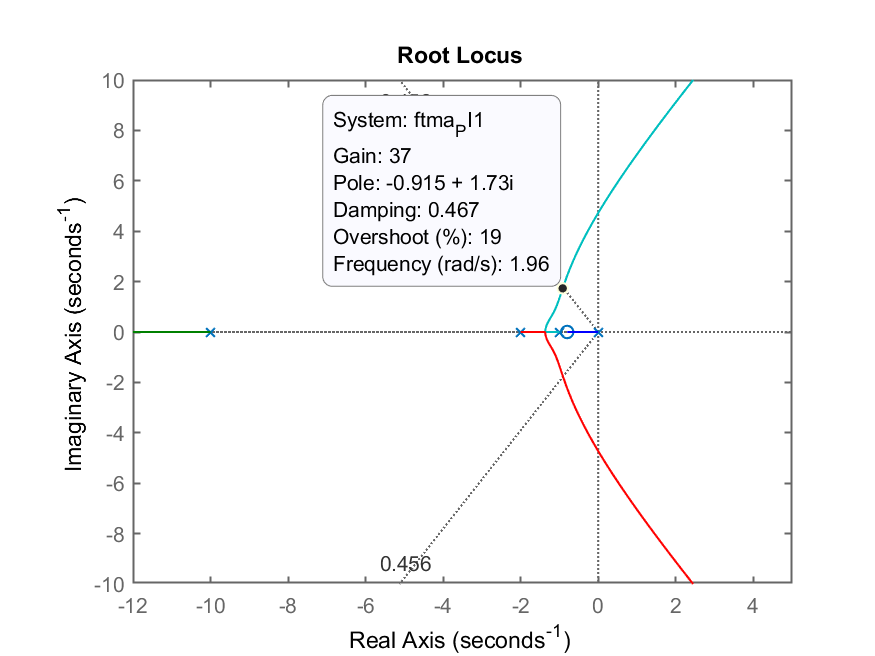
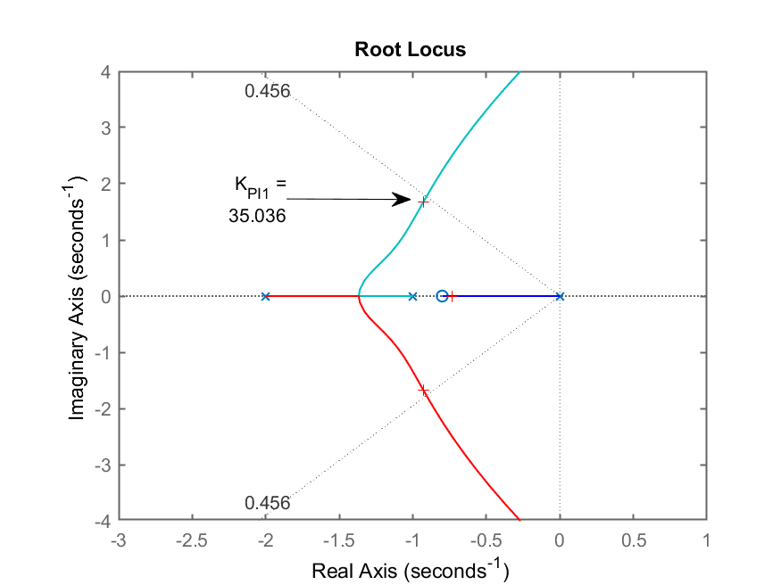
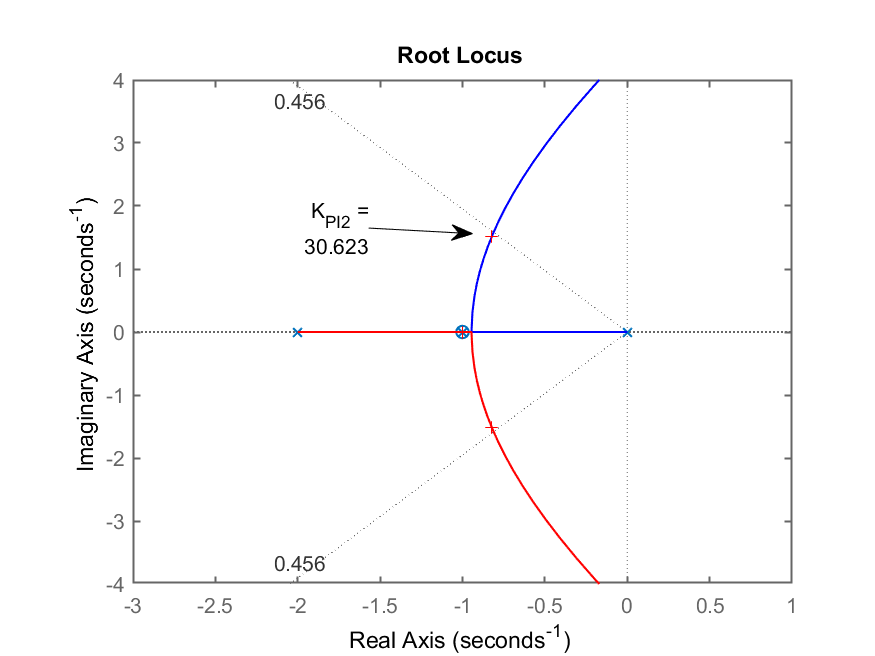
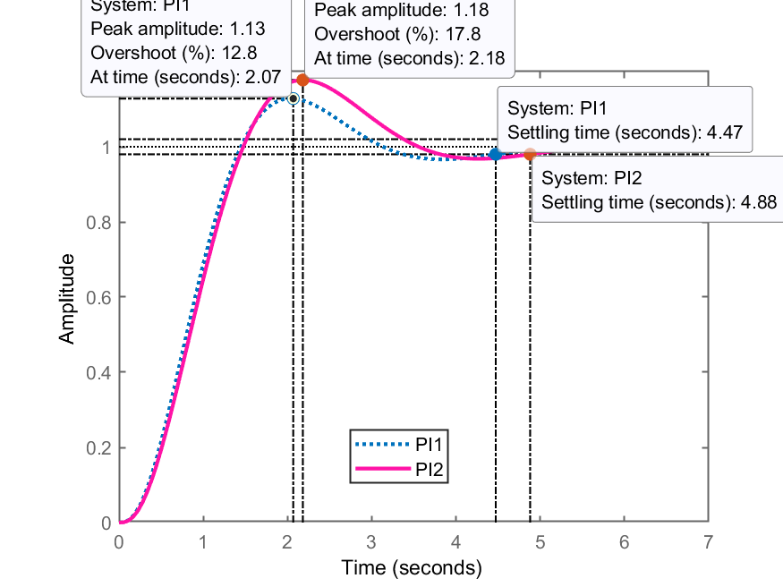
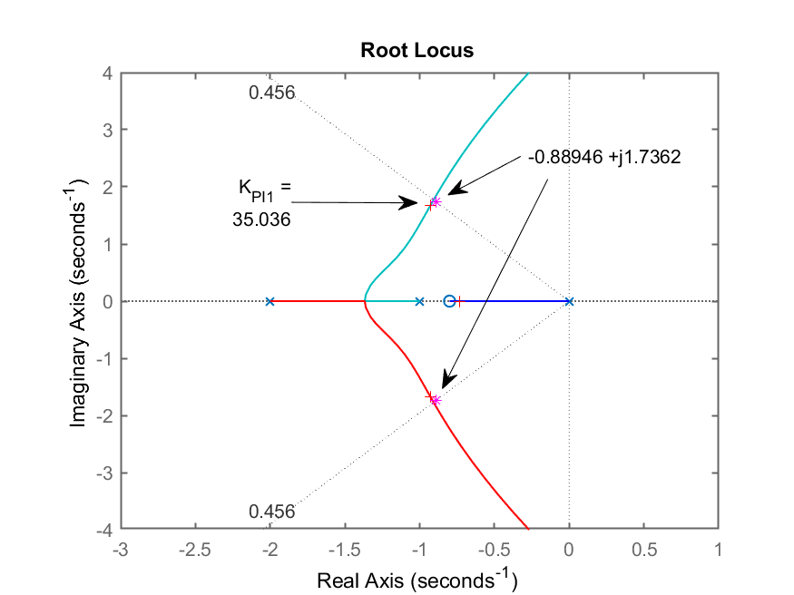

# Projeto Controladores (Aula #2)

> Aula de 17/10/2022.

Obs.: Para continuar os trabalhos à partir da aula passada fazer:

```matlab
>> diary 17102022.md % criar arquivo de "log" com comandos da aula
>> load dados % carregando dados da aula passada
>> who % para verificar os dados

Your variables are:

G        Kp       erro     zeta     
K        OS       ftmf     
K1       ans      ftmf_K1  


>> K1
K1 =
   180
```

onde: `K1`=ganho adotado no último projeto de controlador realizado. Este era o valor necessário para fazer $e(\infty)=10\%$.

*Obs.:* uma cópia de [[dados.mat](dados.mat)] pode ser obtida [[aqui](dados.mat)].

Continuando os projetos de controladores...

## Projeto de Controlador Integrador (Puro) 

Equação deste controlador

$$
C_I(s)= \dfrac{K_i}{s}
$$

**Novo requisito de controle**: $t_s$ no máximo 20% superior ao $t_s$ do Controlador Proporcional.

Lembrando do $t_s$ do Controlador Proporcional:

```matlab
>> stepinfo(ftmf)
        RiseTime: 0.50254
    SettlingTime: 3.7476
     SettlingMin: 0.72345
     SettlingMax: 1.0132
       Overshoot: 28.332
      Undershoot: 0
            Peak: 1.0132
        PeakTime: 1.2474
>> % Calculando o novo ts
>> new_ts=3.7476*1.2
new_ts =
       4.4971
```

Iniciando projeto, incluindo o controlador...

```matlab
>> C_I=tf(1,[1 0])

C_I =
 
  1
  -
  s
 
Continuous-time transfer function.

>> ftma_I=C_I*G;
>> zpk(ftma_I)   % verificando acréscimo do Integrador

           1
  --------------------
  s (s+10) (s+2) (s+1)
 
Continuous-time zero/pole/gain model.

>> rlocus(ftma_I)
>> hold on
>> sgrid(zeta,0)
% ````

RL resultante deste controlador:



Figura mostra valor aproximado de $K_u$ (máximo ganho).

RL com zoom mostrando o ganho $K_i$ adotado:



Adotando $K_i=10.5$.

```matlab
>> K_i=10.5;
>> % fechando a malha
>> ftmf_I=feedback(K_i*ftma_I,1);
>> figure; step(ftmf_I)
>> stepinfo(ftmf_I)
        RiseTime: 2.4988
    SettlingTime: 13.088
     SettlingMin: 0.93875
     SettlingMax: 1.1884
       Overshoot: 18.844
      Undershoot: 0
            Peak: 1.1884
        PeakTime: 5.9205
```

Resposta ao degrau:



**Comentários**: Nota-se que o $t_s$ deste controlador é mais que $3 \times$ maior que o $t_s$ especificado, apesar do $e(\infty)=0$ e $\%OS\le20\%$.

**Solução?**

*Resp.:* outro controlador: "juntar" à ação Integral, a ação Proporcional.

## Projetando um Controlador PI

Equação deste controlador:

$$
\begin{array}{rcl}
C_{PI}(s) &=& K_p+\dfrac{K_i}{s}\\
 &=& \dfrac{K_p \cdot \left( s+\dfrac{K_i}{K_p} \right)}{s}
\end{array}
$$

Temos um probleminha "extra" agora: 
-- Onde alocar o zero do PI?

Podemos continuar resolvendo este problema de algumas formas diferentes. A mais "fácil" é raciocinar sobre RL´s supondo diferentes posições para o zero do PI. Outra solução mais determinística é usar o método da Contribuição Angular.

Neste caso, primeiro vamos raciocinar sobre o impacto causado no RL da $FTMA(s)$ quando o zero do PI muda de posição no plano-s. Desta forma, estamos usando o RL como ferramenta de projeto e não apenas como uma ferramenta de cálculo ou ajuste de ganho.

Aqui neste documento serão retratados 2 situações (casos) considerados os mais interessantes:

* Caso 1): $-1 < z_{PI} < 0$ (o zero do PI está entre seu pólo integrador e o polo mais lento da planta);
* Caso 4)  $z_{PI}=-1$ (neste caso, vamos testar o que ocorre se posicionamos o zero do controlador justamente sobre o polo mais lento da planta, provocando deliberadamente um "**cancelamento polo-zero**")

Ingressando os controladores:

```matlab
>> C_PI1=tf(poly(-0.8),poly(0))

C_PI1 =
 
  s + 0.8
  -------
     s
 
Continuous-time transfer function.

>> C_PI2=tf(poly(-1),poly(0))

C_PI2 =
 
  s + 1
  -----
    s
 
Continuous-time transfer function.

>> ftma_PI1=C_PI1*G;
>> ftma_PI2=C_PI2*G;
>> % traçando os RLs
>> figure; rlocus(ftma_PI1);
>> axis([-12 5 -15 15]) % realizando um "zoom" sobre região de interesse
>> hold on
>> sgrid(zeta,0)
>> axis([-12 5 -10 10]) % melhorando o "zoom" anterior
>> % gerada figura RL_PI1.png
>> % Segue RL do outro controlador
>> figure; rlocus(ftma_PI2);
>> axis([-12 5 -10 10])
>> hold on;
>> sgrid(zeta,0)
>> % gerada figura RL_PI2.png
```

Comparando os 2 RLs:

| RL do PI1 | RL do PI2 |
| :---: | :---: |
|  |  |

Percebe-se que os 2 RLs são bastante semelhantes com excessão de um detalhe. a $FTMA(s)$ do controlador PI1 rendeu um sistema de 4a-ordem, com **3 pólos dominantes** na região próxima do eixo $j\omega$ enquanto que o outro controlador rendeu um sistema de 3a-ordem, com apenas 2 pólos dominantes complexos próximos do eixo $j\omega$. Neste ponto, fica difícil perceber qual seria o "melhor" controlador.

Finalizando os projetos dos 2 controladores

```matlab
>> figure(3) % voltando o foco para o RL com PI1
>> axis([-3 1 -4 4]) % "zoom" na área de interesse
>> [K_PI1,polos_MF_PI1]=rlocfind(ftma_PI1)
Select a point in the graphics window
selected_point =
     -0.89773 +     1.6675i
K_PI1 =
       35.036
polos_MF_PI1 =
      -10.409 +          0i
      -0.9282 +     1.6742i
      -0.9282 -     1.6742i
      -0.7348 +          0i
```

RL do PI1 ressaltando ganho adotado e polos dominantes de MF (notar pontos com marcadores '+' na figura)



Finalizando projeto do PI2:

```matlab
>> figure(4) % forçando foco no RL do PI2
>> axis([-3 1 -4 4]) % "zoom" na área de interesse
>> [K_PI2,polos_MF_PI2]=rlocfind(ftma_PI2)
Select a point in the graphics window
selected_point =
     -0.81439 +     1.5087i
K_PI2 =
       30.623
polos_MF_PI2 =
      -10.354 +          0i
     -0.82299 +     1.5101i
     -0.82299 -     1.5101i
           -1 +          0i
```

RL do PI2 ressaltando ganho adotado e os polos dominantes de MF:



Verificando resultados obtidos com os 2 controladores:

```matlab
>> ftmf_PI1=feedback(K_PI1*ftma_PI1, 1);
>> ftmf_PI2=feedback(K_PI2*ftma_PI2, 1);
>> figure; step(ftmf_PI1, ftmf_PI2)
>> legend('PI1', 'PI2')
```

Resposta ao degrau para PI1 e PI2:



**Conclusão**:
O PI1 é o que me permitiu atender o $t_s$ desejado.

Equação final do PI1:

$$
C_{PI1}=\dfrac{35,0355(s+0,8)}{s}
$$

**Questões:**
-- Existe outra forma de determinar $z_{PI}$ de forma mais determinística?
*Resp.*: usando-se contribuição angular.

## Projeto de PI usando Contribuição Angular

Neste caso, necessitamos saber onde queremos que fiquem localizados os polos de MF uma vez fechada a malha para o sistema e usamos a regra do Root Locus para determinar a variável que está faltando, no caso, o valor exato do zero do controlador.

Segue regra que confirma que determinado ponto faz parte do traçado do RL:

$$
\sum_{i=0..Zeros} \{ \theta_i \} - \sum_{j=0..Polos} \{ \theta_j\} = (2k+1)180^o
$$

Vamos usar esta regra para descobrir o $\theta_{z_{PI}}$, com exatidão e assim, determinar o ponto deste zero no plano-s.

Precisamos lembrar como calcular a posição desejada para os polos de MF aproximando a resposta do sistema para um de 2a-ordem subamortecido.

Lembrando da resposta típica de um sistema de 2a-ordem sub-amortecido, sua relação com $\zeta$, $\omega_n$ e a posição de seus pólos (complexos) no plano-s... Ver: [[Projeto de Controladores usando Root Locus (Parte I)]](https://fpassold.github.io/Controle_2/projeto_usando_root_locus_parte_1.html). Percebemos que, nos falta determinar $\omega_n$. Mas sabemos do novo $t_s$ desejado e sabemos que:

$$
t_s \cong \dfrac{4}{\zeta \cdot \omega_n}
$$

Então:

$$ 
\omega_n=\dfrac{4}{\zeta \cdot t_s}
$$

Usando Matlab:

```matlab
>> new_ts
new_ts =
       4.4971
>> wn=4/(zeta*new_ts)
wn =
       1.9508
>> % Calculando os polos desejados de MF
>> sigma=-zeta*wn;        % parte real dos polos
>> wd=wn*sqrt(1-zeta^2);  % parte imaginária dos polos
>> polos_MF=[sigma-i*wd sigma+i*wd]
polos_MF =
  Column 1
     -0.88946 -     1.7362i
  Column 2
     -0.88946 +     1.7362i
>> figure(3) % voltando o foco para o RL do PI1
>> hold on
>> plot(polos_MF,'*m') % sobrepondo os polos de MF desejados
% ```

Podemos a título de curiosidade sobrepor no plano-s, estes polos de MF desejados sobre os RLs já criados para entender melhor o problema e porque o controlador PI1 se "saiu melhor".

Resultado gráfico do RL para o PI1, ressaltando ganho adotado, polos de MF encontrados e pólos desejados de MF (marcadores = '*'). Percebe-se que, "por acaso", que o zero de PI1 arbitrado em $s=-0,8$ permitiu lograr um RL que passasse muito próximo dos polos de MF desejados.



O projeto usando contribuição angular continua na próxima aula...

Para tanto:

```matlab
>> save dados.mat
>> diary off
>> quit
```

---

<font size="1">Fernando Passold, 17/10/2022</font> 