# Projetos de Controladores com Ação Derivativa

<!-- Diretório de trabalho:
pwd
ans =
    'C:\Users\fpassold\Documents\MATLAB\control2inf_2020_2'
-->

Lembrando o arquivo de [`dados.mat`](dados.mat) gerado anteriormente:

```Matlab
>> what
MAT-files in the current folder C:\Users\fpassold\Documents\MATLAB\control2inf_2020_2

dados  
```

Carregando arquivo de dados da aula anteior:

```Matlab
>>load dados
>> % Lembrando da planta
>> zpk(G)

          1
  ------------------
  (s+10) (s+2) (s+1)
``` 

## Projetando um PD

Lembrando da equação de um PD (Controlador Proporcional $+$ Derivativo):

$$
C(s)=K_p+K_d s=K_p \left( s + \frac{K_p}{K_d} \right)
$$

Notamos que necessitamos definir uma posição para o zero do PD. Lembrando que quanto mais próximo este zero estiver da origem do plano-s, tanto mais seu comportamente será semelhante a uma ação Derivativa (resposta mais rápida para o sistema em MF).

Estudando então posições possíveis para o zero do PD:

% * Caso a) $-1 < z_{PD} < 0$;
% * Caso b) $z_{PD}= -1$ (cancelando polo mais lento da planta);
% * Caso c) $-2 < z_{PD} < -1$ (entre os 2 polos mais lentos da planta);
% * Caso d) $z_{PD} = -2$ (cancelando o segundo polo + lento da planta);
% * Caso e) $ -10 < z_{PD} < -2$

Realizando os cálculos necessários usando o Matlab:

```Matlab
>> %% Gerando as FTMA(s)'s com os diferentes casos de PDs:
>> ftma_PDa=tf(poly(-0.5),poly([-1 -2 -10]));
>> zpk(ftma_PDa)

       (s+0.5)
  ------------------
  (s+10) (s+2) (s+1)
 
>> ftma_PDb=tf(poly(-1),poly([-1 -2 -10]));
>> ftma_PDc=tf(poly(-1.5),poly([-1 -2 -10]));
>> ftma_PDd=tf(poly(-2),poly([-1 -2 -10]));
>> ftma_PDe=tf(poly(-6),poly([-1 -2 -10]));
```

Como vamos querer estudar o RL resultante para cada uma casos e avaliar uma boa solução, já seria mais interessante, incorporar nos gráficos dos RLs, a posiçao desejada para os polos dominantes de MF.

A implantação de uma PD numa malha de controle só faz sentido se queremos reduzir o $t_s$ do Controlador Proporcional. Vamos supor que queremos neste caso reduzir o $t_s$ do mesmo em $1/3$ (ou $t_s|_{PD} \le t_s|_{Kp}/3$).

```Matlab
>> %% Lembrando do ts do Controlador Proporcional
>> stepinfo(ftmf)

        RiseTime: 0.50254
    SettlingTime: 3.7476   <--- ts do Controlador Proporcional
     SettlingMin: 0.72345
     SettlingMax: 1.0132
       Overshoot: 28.332
      Undershoot: 0
            Peak: 1.0132
        PeakTime: 1.2474

>> % Calculando o t_s para o PD:
>> new_ts = 3.7476/3
new_ts =
       1.2492
>> new_ts = 1.3;
```

Calculando a posição desejada para os polos dominantes desejados para a MF:

Lembrando que (ver [Projeto de PI usando contribuição angular(versão de 2019/2)](https://fpassold.github.io/Controle_2/projeto_controladores_acao_integral_extendido.html)):

$$
t_s = \dfrac{4}{\zeta \cdot \omega_n}
$$

```Matlab
>> wn = 4/(zeta*1.3)		% freq. natural de oscilação
wn =
       6.7484
>> sigma = -wn*zeta		% parte real dos polos
sigma =
      -3.0769
>> wd = wn*sqrt(1-zeta^2)	% para imaginária dos polos
wd =
       6.0061
>> polos_MFd=[sigma+i*wd sigma-i*wd]'	% montando vetor para uso posterior
polos_MFd =
      -3.0769 -     6.0061i
      -3.0769 +     6.0061i
>>
>> % Traçando os RLs
>> rlocus(ftma_PDa); hold on; sgrid(zeta,0); plot(polos_MFd,'md')
>> % ajustando o axis
>> axis([-12 2 -14 14])
>> K_PDa=rlocfind(ftma_PDa)	% fechando malha para este PD
Select a point in the graphics window
selected_point =
      -6.2109 +     12.136i
K_PDa =
       160.83

>> % Figura gerada: RL_PDa.png
>> % Partindo para o outro caso de PD:
>> figure; rlocus(ftma_PDb); hold on; sgrid(zeta,0); plot(polos_MFd,'md')
>> axis([-12 2 -14 14])
>> K_PDb=rlocfind(ftma_PDb)
Select a point in the graphics window
selected_point =
      -6.0118 +     11.616i
K_PDb =
       150.93
>> % Segue outro PD
>> figure; rlocus(ftma_PDc); hold on; sgrid(zeta,0); plot(polos_MFd,'md')
>> axis([-12 2 -14 14])
>> K_PDc=rlocfind(ftma_PDc)
Select a point in the graphics window
selected_point =
      -5.7133 +     11.009i
K_PDc =
       139.45
>> % Outro PD 
>> figure; rlocus(ftma_PDd); hold on; sgrid(zeta,0); plot(polos_MFd,'md')
>> axis([-12 2 -14 14])
>> K_PDd=rlocfind(ftma_PDd)
Select a point in the graphics window
selected_point =
       -5.481 +     10.576i
K_PDd =
        132.1
>> % Último caso de PD:
>> figure; rlocus(ftma_PDe); hold on; sgrid(zeta,0); plot(polos_MFd,'md')
>> axis([-12 2 -14 14])
>> K_PDe=rlocfind(ftma_PDe)
Select a point in the graphics window
selected_point =
      -2.3294 +     4.4211i
K_PDe =
       31.534
```

% <!--- Voltando a tabela markdown comparando os RLs --->

Através dos comandos anteriores realizados no Matlab podemos montar uma "tabela resumo":

| Caso a) | Caso b) |
| :---: | :---: |
| 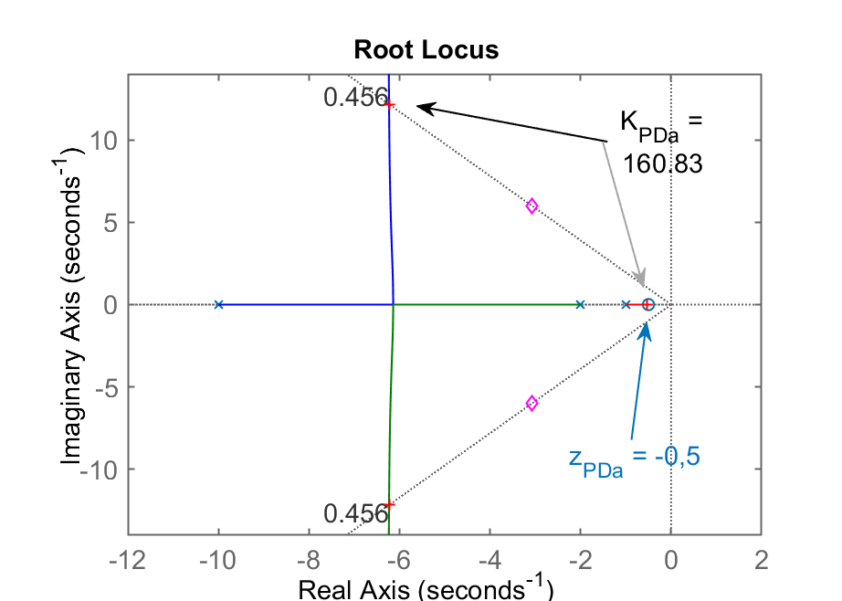 | 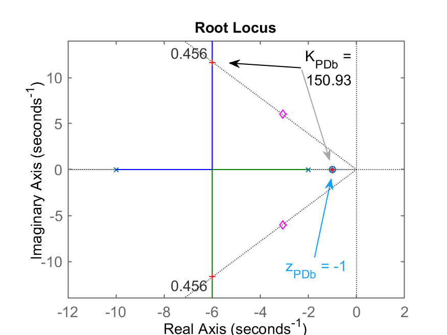 |
| Caso c) | Caso d) |
| 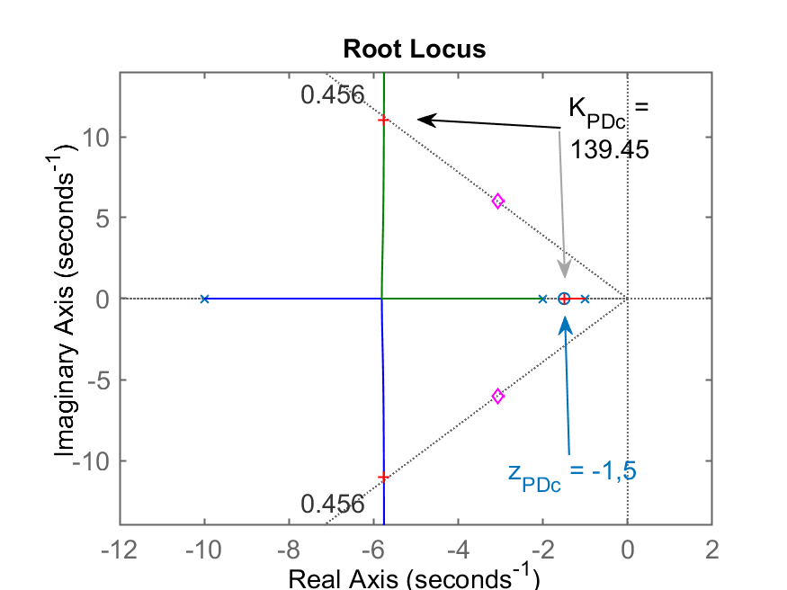 |  |
| Caso e) | |
|  | |

Agora podemos analisar as diferentes situações para os diferentes PDs (o que varia é a posição do zero do mesmo).

Observando os RLs anteriores, percebemos os seguintes casos promissores: (b), (d) e (e). Estas propostas permitem fechar a malha com polos de MF mais distantes do eixo $j\omega$ (menores $t_s$). 

% Fechando as malhas...

% ```matlab
ftmf_PDa=feedback(K_PDa*ftma_PDa, 1);
ftmf_PDb=feedback(K_PDb*ftma_PDb, 1);
ftmf_PDc=feedback(K_PDc*ftma_PDc, 1);
ftmf_PDd=feedback(K_PDd*ftma_PDd, 1);
ftmf_PDe=feedback(K_PDe*ftma_PDe, 1);
% Gerando as figuras os "step's"...
figure; step(ftmf_PDa)
% step_PDa.png
figure; step(ftmf_PDb)
figure; step(ftmf_PDc)
figure; step(ftmf_PDd)
figure; step(ftmf_PDe)

% Comparando os resultados obtidos

% | RL do PDa | Step PDa |
% | :---: | :---: |
% |  | 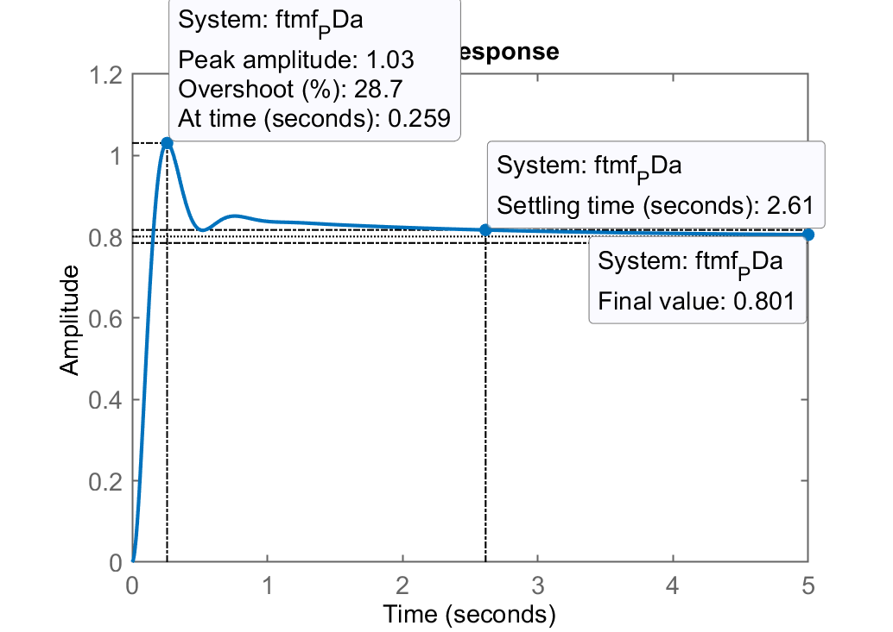 |

% Comentários: pelo RL se percebe que este é a pior opção
% de PD. Maior $t_s$ do todos causado pelo polo real de
% MF muito próximo do zero deste PD (em $s= -0.5$).

% | RL do PDc | Step PDc |
% | :---: | :---: |
% |  |  |

% Comentários: pelo RL também já poderíamos ter
% descartado esta opção para o zero do PD. Confirmamos isto
% pela posição final do polo de MF próximo do zero do PD,
% em $s = -1,5$, $t_s = 0,683$.

% | RL do PDb | Step PDb |
% | :---: | :---: |
% |  |  |

% Comentários: opção promissora. Aqui cancelamos o polo mais
% lento da planta em $s = -1$ com o zero do PD nesta posição
% Consequentemente: o sistema deixa de ser 3a-ordem para
% se transformar num sistema de 2a-ordem. Resultados finais:
% $t_s = 0,636$, com $y(\infty)=0,883$ ou erro de 11,7%.

% | RL do PDd | Step PDd |
% | :---: | :---: |
% |  |  |

% Comentários: opção promissora. Aqui também houve cancelamento
% polo-zero, neste caso, o zero do PD cancelou o segundo
% polo mais lento da planta. Resultado semelhante ao caso b).
% Valores finais: $t_s = 0,697$, com $y(\infty)=0,93$ ou seja,
% um erro de 7%.

% E por fim, o último caso, onde o zero do PD ficou muito
% afastado do eixo $j\omega$, o que praticamente "anula"
% a ação derivativa, isto é, o tempo de assentamento
% é reduzido, mas não tanto assim.

% | RL do PDd | Step PDd |
% | :---: | :---: |
% |  | 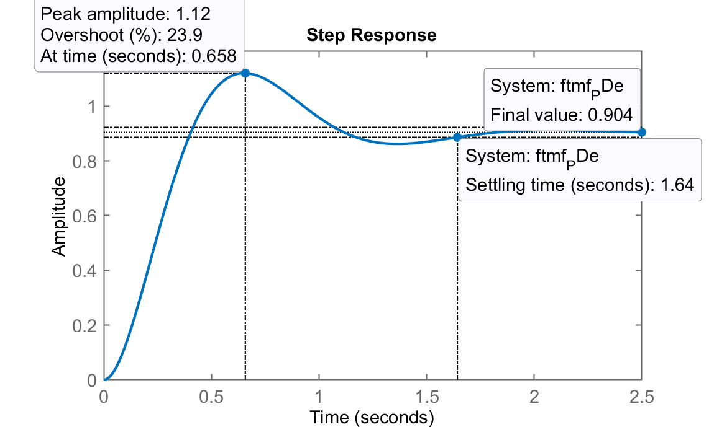 |

% Comparando apenas os casos mais promissores: b) e d) temos:

figure; step(ftmf_PDb, ftmf_PDd)
legend('PD_b', 'PD_d')

% 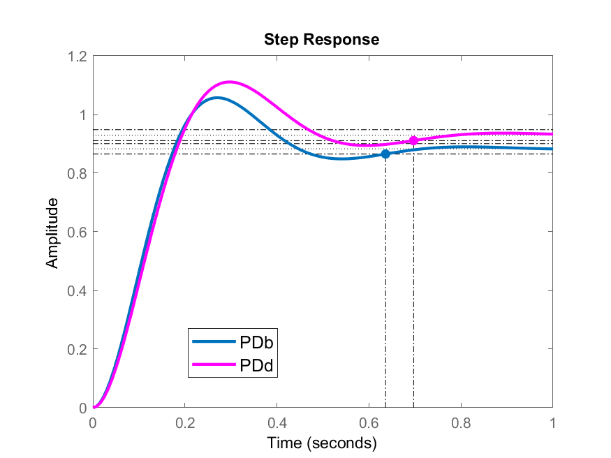

diary off

% **Comentários finais**:
% Note que o zero do PD nos casos b) e d) foram colocados
% (cancelaram) os pólos mais lentos da planta em $s=-1$ ou
% $s=-2$. **Detalhe**: na vida real, na prática, é dificil
% mesmo impraticável realizar este cancelamento polo-zero
% pelo simples motivo de que é difícil saber exatamente
% a posição destes polos num sistema real similar a este.
% Portanto, este cancelamento polo-zero não pode ser obtido.
% Motivo pelo qual, a opção que finalmente se torna a mais
% promissora é o caso c), onde o zero do PD se encontra entre
% os 2 pólos mais lentos da planta, já que na prática, não
% sabemos onde eles estão localizados com precisão.

% Projeto do PD usando Contribuição Angular

% Para o cálculo da contribuição angular, usaremos a torin
% usaremos a rotina pronta [`find_polo_zero.m`](https://fpassold.github.io/Controle_2/find_polo_zero.m)

help find_polo_zero
  <strong>find_polo_zero</strong>.m
  
  Angular contribution routine to find out where to locate pole or zero 
  of the controller depending on the desired location for MF poles
 
  Use:
  This routine already expects a tf named "ftma_aux"
  where: ftma_aux(s)=C(s)*G(s);
  and where: C(s) is already partially supplied (already containing
             zero(s) or already containing pole(s)
  
  The routine uses angular contribution and root locus method and asks 
  while running if the idea is to determine the location of the zero or 
  the pole of the controller.
 
  Fernando Passold, 14/10/2020, 20/10/2020, 30/10/2022.

ftma_aux=G; % neste caso, para projeto de um PD
zpk(ftma)
{Undefined function or variable 'ftma'.} 
zpk(ftma_aux)

ans =
 
          1
  ------------------
  (s+10) (s+2) (s+1)
 
Continuous-time zero/pole/gain model.

find_polo_zero
%OS (dresesired Overshoot, in %): ? 20%
    ts_d (desired settling time): ? 1.3
Desired MF poles in: s = -3.07692 \pm j 6.0061
Evaluating the pole(s) contribution angle(s):
  Pole 1 in s= -10 --> angle: 40.9432^o
  Pole 2 in s= -2 --> angle: 100.165^o
  Pole 3 in s= -1 --> angle: 109.076^o
Sum of the angle(s) of pole(s):
  $\sum \theta_{poles}=250.184^o$

Evaluating the zero(s) contribution angle(s):
Sum of the angle(s) of zero(s):
  $\sum \theta_{zeros}=0^o$

Determining pole or zero location of the controller:
Select: [p]=pole or [z]=zero, for the controller ? z

Angle contribution required for controller: 70.1841^o
The ZERO of this controller must be at s = -5.24113
To continue the project, note that:
 
>> zpk(ftma) =

ans =
 
      (s+5.241)
  ------------------
  (s+10) (s+2) (s+1)
 
Continuous-time zero/pole/gain model.

It is suggested to continue with the command:
>> K_ = rlocfind(ftma)
(s+5.241)
{Undefined function or variable 's'.} 

% Gráfico da contribuição angular:

% 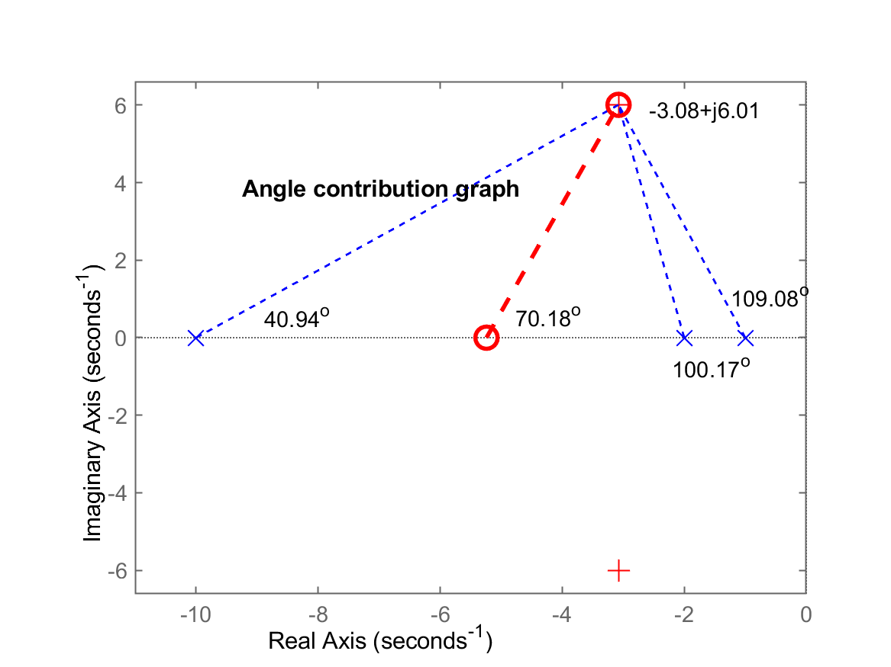

K_PD2=rlocfind(ftma)
Select a point in the graphics window
selected_point =
      -3.0707 +     5.9607i
K_PD2 =
       55.062


% Segue RL deste PD com o ganho adotado:

% 

% Fechando a malha...

ftmf_PD2=feedback(K_PD2*ftma,1);
figure; step(ftmf_PD2)

% 

% Note que o $\%OS=19\%$ (considerando valor final da
% entrada degrau, $U(\infty)=1,0$. Temos também um erro de
% $e(\infty)=\frac{1-0,935}{1}\times 100\%=6,5\%.

% Baixando ainda mais o $t_s$ do controlador PD em
% função dos casos de PD analisados anteriormente.

stepinfo(ftmf) % lembrando do ts do Cont. Proporcional
ans = 
  <a href="matlab:helpPopup struct" style="font-weight:bold">struct</a> with fields:

        RiseTime: 0.50254
    SettlingTime: 3.7476
     SettlingMin: 0.72345
     SettlingMax: 1.0132
       Overshoot: 28.332
      Undershoot: 0
            Peak: 1.0132
        PeakTime: 1.2474
3.7/0.7
ans =
       5.2857

find_polo_zero
%OS (dresesired Overshoot, in %): ? 20
    ts_d (desired settling time): ? 0.7
Desired MF poles in: s = -5.71429 \pm j 11.1542
Evaluating the pole(s) contribution angle(s):
  Pole 1 in s= -10 --> angle: 68.982^o
  Pole 2 in s= -2 --> angle: 108.418^o
  Pole 3 in s= -1 --> angle: 112.911^o
Sum of the angle(s) of pole(s):
  $\sum \theta_{poles}=290.311^o$

Evaluating the zero(s) contribution angle(s):
Sum of the angle(s) of zero(s):
  $\sum \theta_{zeros}=0^o$

Determining pole or zero location of the controller:
Select: [p]=pole or [z]=zero, for the controller ? z

Angle contribution required for controller: 110.311^o
The ZERO of this controller must be at s = -1.58586
To continue the project, note that:
 
>> zpk(ftma) =

ans =
 
      (s+1.586)
  ------------------
  (s+10) (s+2) (s+1)
 
Continuous-time zero/pole/gain model.

It is suggested to continue with the command:
>> K_ = rlocfind(ftma)

% Segue gráfico da contribuição angular:

% 

% **Note**: a posição calculada para este script para o
% zero do PD praticamente coincide com o caso c)
% analizado anteriormente (que se aplica para os casos em
% que não se conhece com exatidão a posição dos 2 polos
% mais lentos da planta).

% Fechando a malha...

axis([-12 2 -14 14])
K_PD3=rlocfind(ftma)
Select a point in the graphics window
selected_point =
      -5.6801 +     11.183i
K_PD3 =
       143.67

% Gráfico do RL com ganho adotado para este PD:

% 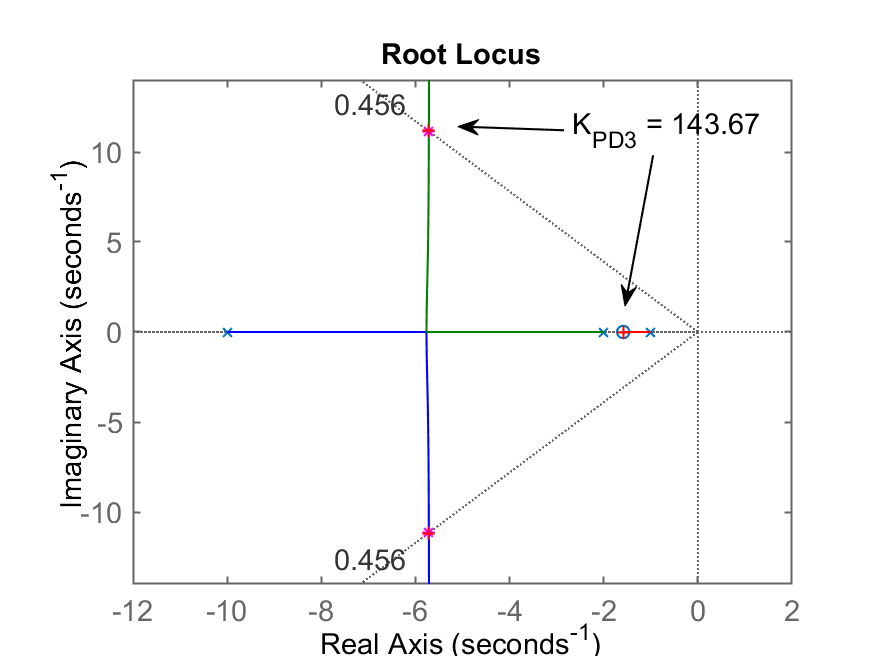

ftmf_PD3=feedback(K_PD3*ftma,1);
figure; step(ftmf_PD3)

% Resultado final

% 

% Comentário: ainda resta um erro:

erro_PD=(1-dcgain(ftmf_PD3))/1*100
erro_PD =
       8.0699

% **Questão**: -- e se fosse desejado $t_s = 0,5$ segundos?

% Testando "PD4" com $t_s = 0,5$ -- é possível?

find_polo_zero
%OS (dresesired Overshoot, in %): ? 20
    ts_d (desired settling time): ? 0.5
Desired MF poles in: s = -8 \pm j 15.6159
Evaluating the pole(s) contribution angle(s):
  Pole 1 in s= -10 --> angle: 82.7016^o
  Pole 2 in s= -2 --> angle: 111.018^o
  Pole 3 in s= -1 --> angle: 114.145^o
Sum of the angle(s) of pole(s):
  $\sum \theta_{poles}=307.865^o$

Evaluating the zero(s) contribution angle(s):
Sum of the angle(s) of zero(s):
  $\sum \theta_{zeros}=0^o$

Determining pole or zero location of the controller:
Select: [p]=pole or [z]=zero, for the controller ? z

Angle contribution required for controller: 127.865^o
The ZERO of this controller must be at s = 4.14108
To continue the project, note that:
 
>> zpk(ftma) =

ans =
 
      (s-4.141)
  ------------------
  (s+10) (s+2) (s+1)
 
Continuous-time zero/pole/gain model.

It is suggested to continue with the command:
>> K_ = rlocfind(ftma)

axis([-11 5 -1 20])
axis([-11 5 -2 20])

% Gráfico da contribuição angular deste PD:

% 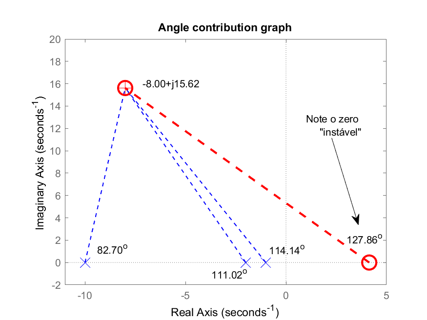

% **Note**: a posição calculada para o zero do PD o colocou
% no semi-plano direito do plano-s, ou seja, um zero com
% parte real positiva, o que, no momento de fechar a malha
% vai atrair um polo de MF para esta parte do plano-s,
% muito provavelmente, instável.

save dados
[Warning: Figure is saved in dados.mat. Saving graphics handle
variables can cause the creation of very large files. To save
graphics figures, use <a  href="matlab:helpview([docroot,'/techdoc/ref/savefig.html'])">savefig</a>.] 

% Fechando a malha...

K_PD4=rlocfind(ftma)
Select a point in the graphics window
selected_point =
      -7.9692 +     15.108i
K_PD4 =
       212.79

% RL para este PD destacando certos valores de ganho...

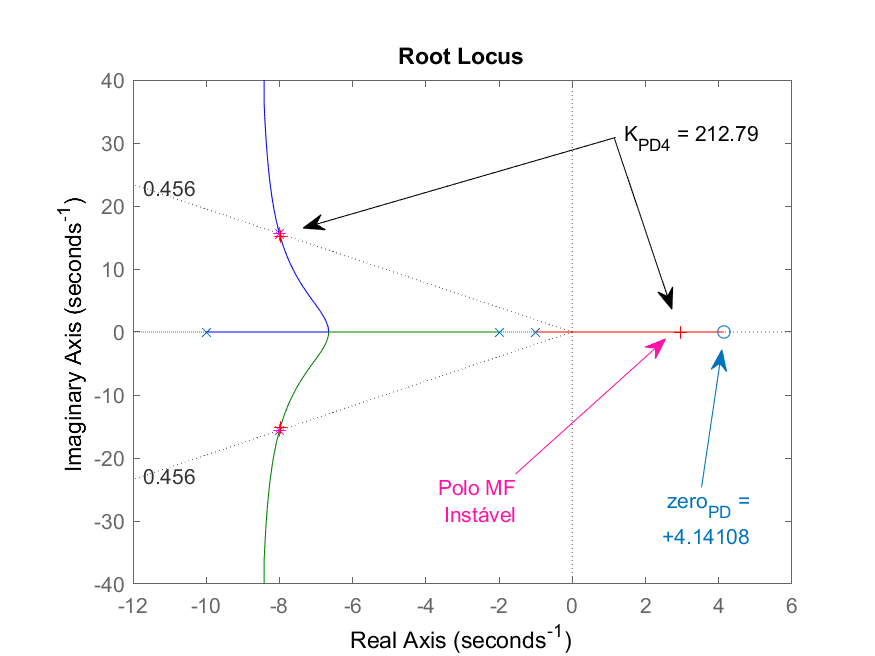
'[RL_PD4.png]' não é reconhecido como um comando interno 
ou externo, um programa operável ou um arquivo em lotes. 

% 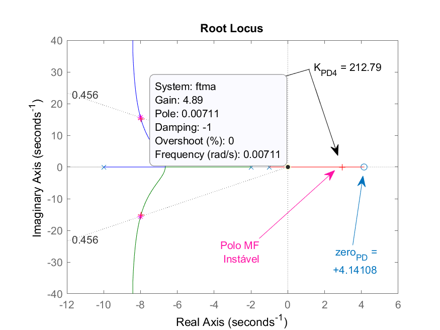

% Note que o ganho máximo que poderia ser adotado para este PD é $K_u|_{PD_{4}} \cong 4,89$.

% Comprovando que o sistema resulta instável com ganho $K_{PD4}=212.79$, obtemos a seguinte resposta para entrada degrau unitário:

ftmf_PD4 = feedback(K_PD4*ftma,1);
figure; step(ftmf_PD4)


'[step_PD4.png]' não é reconhecido como um comando interno 
ou externo, um programa operável ou um arquivo em lotes. 

% **Note** como rapidamente o sistema fica instável por conta do polo em MF na posição:

pole(ftmf_PD4)
ans =
      -7.9754 +     15.108i
      -7.9754 -     15.108i
       2.9507 +          0i

% polo instável na posição $s = +2,9507$.

% **Obs.:** Se o ganho deste PD for reduzido é possível evitar a instabilidade, mas o tempo de assentamento muda completamente:

% Observando o RL anterior e fazendo $K_{PD4}=0,75$:

figure; rlocus(ftma);
hold on; sgrid(zeta,0)
plot(polos_mf,'md')

% 

% Fechando a malha com este valor de ganho, teremos:

K_PD4b=0.6;
ftmf_PD4b = feedback(K_PD4b*ftma,1);
pole(ftmf_PD4b)
ans =
      -9.8798
      -2.3732
     -0.74703
plot(pole(ftmf_PD4b),'b+')
% <!-- erro no gráfico anterior, re-editando...
figure; rlocus(ftma);hold on; sgrid(zeta,0);plot(polos_mf,'md')
[real(pole(ftmf_PD4b)) imag(pole(ftmf_PD4b))]
ans =
      -9.8798            0
      -2.3732            0
     -0.74703            0
plot([real(pole(ftmf_PD4b)) imag(pole(ftmf_PD4b))], 'b+')
% Difícil mostrar os polos de MF no RL anterior...
% Exibindo RL novamente:
figure; rlocus(ftma);hold on; sgrid(zeta,0);plot(polos_mf,'md')
[K_PD4b,polos_MF_PD4b]=rlocfind(ftma)
Select a point in the graphics window
selected_point =
     -0.79878 -    0.05277i
K_PD4b =
      0.46587
polos_MF_PD4b =
      -9.9071
      -2.2998
     -0.79312

% Fechando a malha com este valor de ganho...

ftmf_PD4b = feedback(K_PD4b*ftma,1);
figure; step(ftmf_PD4b)

% | RL do PD4 com $K=0,46587$ | Resposta ao degrau | 
% | :---: | :---: |
% | 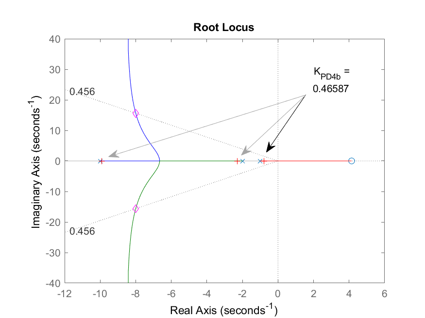 | 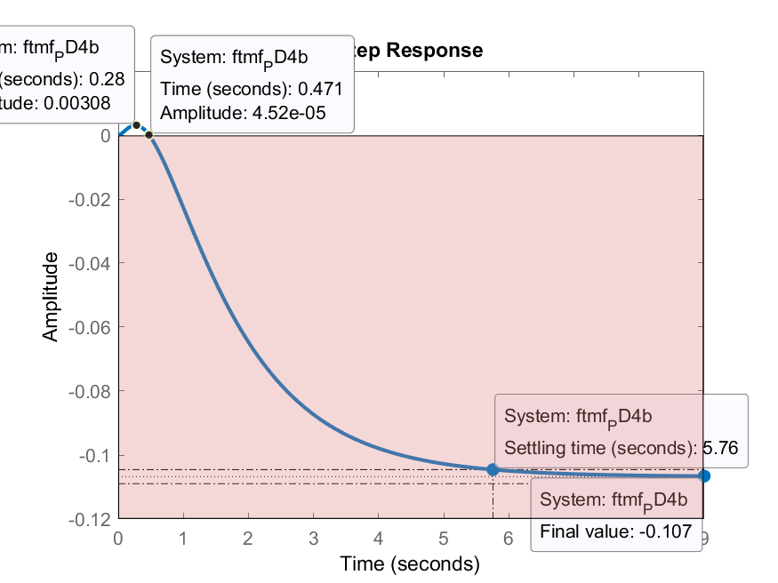 |

% Note que obviamente não é resposta esperada. A saída do sistema tende para $y(\infty)= -0,107$ (um valor negativo até).

% ## Conclusão

% Usando contribuição angular, tanto é possível se estabelecer $t_s=1.3$ segundos (1/3 do $t_s$ do Controlador Proporcional), quanto fazer $t_s=0,7$ segundos
% (mais do que $5 \times$ menor que o $t_s$ do Controlador Proporcional).
% Esta última possíbilidade só é percebida depois de realizar um "estudo" de posições posivies para o zero do PD realizado no início deste documento.
% Nestes 2 últimos casos, obtemos como resultados:

| | PD2 | PD3 |
| ---: | :---: | :---: |
| Equação | $C_{PD2}=55,0624(s+5.241)$ | $C_{PD3}=143,6662(s+1.586)$ |
| $t_s|_{\text{Cálculos}}$ | 1,3 | 0,7 |
| RL | %[PD2](RL_PD2.png) | %[PD3](RL_PD3.png) |
| Step | %[PD2](step_PD2.png) | %[PD3](step_PD3.png) |
| $\%OS|_{u(\infty)}$ | 19% | 10% |
| $t_s|_{\text{Final}}$ | 1,24 | 0,675 |
| $y(\infty)$ | 0,935 | 0,919 |
| $e(\infty)$ | 6,5%  | 8,1% |
| $Max\{u(t)}$ | | |
| Conclusão | Mais adequado</br>Menor valor máximo</br>do sinal atuador, e</br>menor erro.</br>(Note valor do</br>$K_{PD2}=55,06$) | Possível</br>Mas elevados</br>valores de atuação, e</br>erro maior.</br>(Note valor do</br>$K_{PD3}=143,67$) |

----

Prof. Fernando Passold, em 07/11/2022.
 