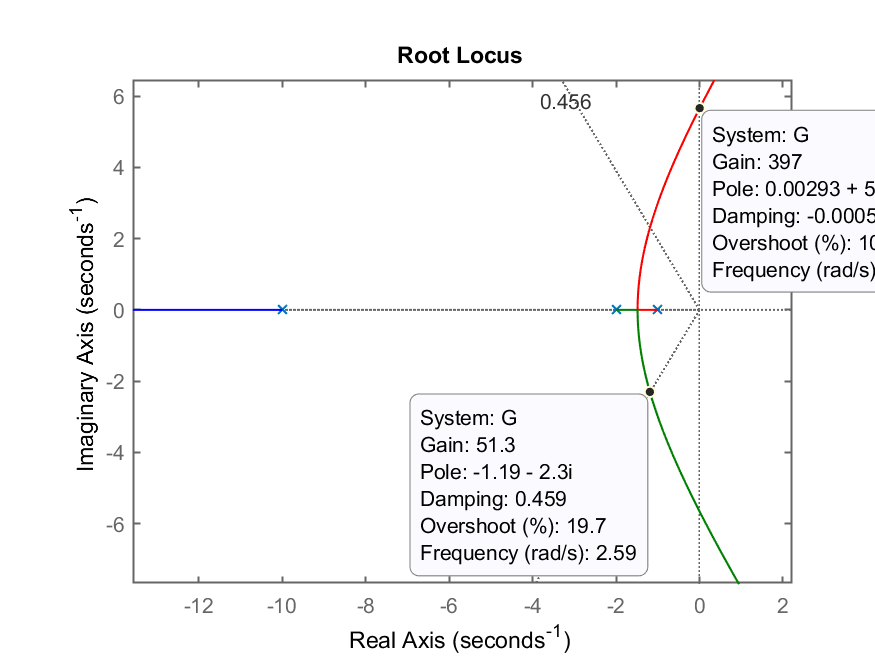
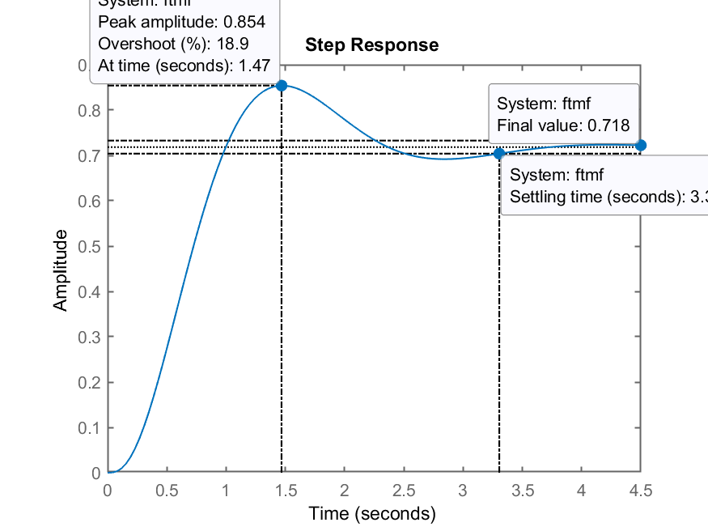
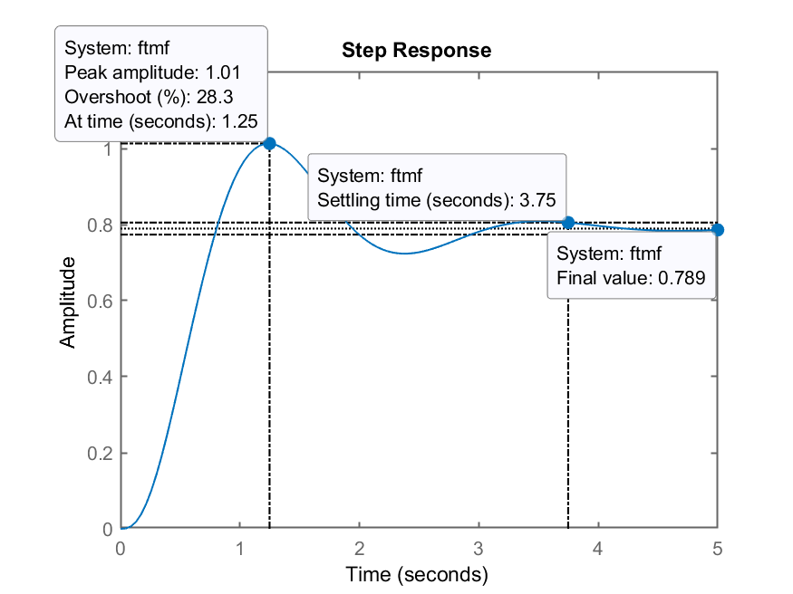
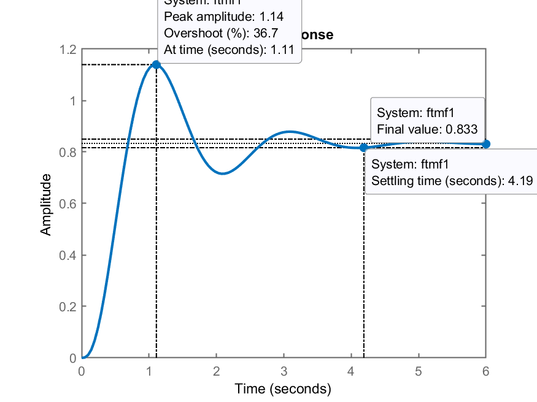
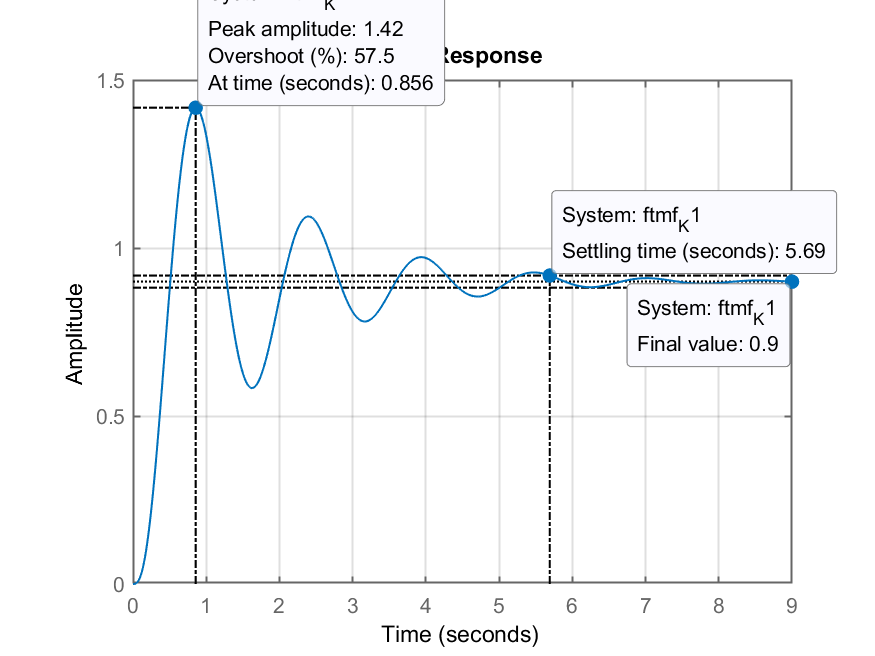

# Projeto de Controladores usando RL

> Obs.: Início das aulas associado com projeto de controladores usando ferramente do Lugar Geomátrico das Raízes, ou mais simplesmente, "root locus" -- Aula do dia 10/10/2020 (Eng. Computação).

## Ingressando a Planta

Seja a planta, $G(s)$:

$$
G(s)=\dfrac{1}{(s+1)(s+2)(s+10)}
$$

No Matlab:

```Matlab
>> G=tf(1, poly( [ -1    -2 10 ] ) )

G =
 
             1
  -----------------------
  s^3 - 7 s^2 - 28 s - 20
 
Continuous-time transfer function.

>> % Verificando...
>> zpk(G)

ans =
 
          1
  ------------------
  (s-10) (s+2) (s+1)
 
Continuous-time zero/pole/gain model.
```

Ops, nota-se que o pólo que deveria estar em $s=-10$ foi ingressado de maneira incorreta. Repetindo-se o comando `>> G=tf(..)`:

```matlab
>> G=tf(1, poly( [ -1 -2 -10 ] ) )

G =
 
             1
  ------------------------
  s^3 + 13 s^2 + 32 s + 20
 
Continuous-time transfer function.

>> zpk(G)

ans =
 
          1
  ------------------
  (s+10) (s+2) (s+1)
 
Continuous-time zero/pole/gain model.
```

## Projeto de Controlador Proporcional

Usando Root-Locus, projetar umn controlador Proporcional. Este controlador têm como único requisito de controle, que o *overshoot* (sobre-sinal) em MF não seja superior à 20%.

Usando-se o Matlab:

```matlab
>> rlocus(G)
>> % Calculando zeta correspondendo a este %OS
>> OS=20; % 20% de overshoot tolerável
>> zeta=(-log(OS/100))/(sqrt(pi^2+(log(OS/100)^2)))
zeta =
      0.45595
>> hold on
>> sgrid(zeta,0);
```

Gráfico do RL ressaltando alguns valores de ganho:



Adotaremos o ganho de $K=51$.

Verificando o resultado obtido...

```matlab
>> K=51;
>> ftmf=feedback(K*G, 1);
>> figure; step(ftmf);
```

Obtemos como resultado:



Notamos erro não nulo em regime permanente: $y(\infty)=0,718$. Deveria ter alcançado a amplitude da referência: degrau unitário: $r(\infty)=1,0$. Calculando-se o erro:

```matlab
>> % Calculando o erro em regime permanente
>> dcgain(ftmf)
ans =
      0.71831
>> erro=(1-dcgain(ftmf))/1*100
erro =
       28.169
```

Ou seja, acabamos com um erro de regime permanente de $e(\infty)=28,169\%$.

- Esse valor de **erro pode ser reduzido?**

*Resposta:* Aumentando-se o ganho, o erro vai ser reduzido mas deve aumentar $\%OS$. Testando...

```matlab
>> K=75;
>> ftmf=feedback(K*G, 1);
>> figure; step(ftmf);
```

Resultado obtido com $K=75$:



Nota-se uma pequena redução no erro. Poderia-se ter usado uma valor de ganho maior, deste que ficasse abaixo de $K_u \cong 397$ (*Ultimate Gain* = máximo ganho, que coloca o sistema no limiar na estabilidade, no modo ''oscilatório").

Se fosse usado $K=100$, teríamos obtido:



Perceba que o valor de *Overshoot* determinado pelo Matlab e mostrado na figura possui relação com o valor em regime permanente da planta, que, com este ganho atingiu: $y(\infty)=0,833$. Quando se especifica *overshoot* como um requisito de controle, seu valor é em comparação ao valor em regime permamente que a saída da planta deveria atingir (o valor final da referênica). Do ponto de vista de requisitos de controle o *overshoot* aqui foi de 14% (note no "datatip" da figura: "Peak Maplitude: 1.14"). Ainda estamos abaixo dos 20% máximos especificados para este caso. De todos os modos, mesmo aumentando-se o ganho para $K=100$ ainda estamos com um erro considerável:

```matlab
>> erro=(1-dcgain(ftmf))/1*100
erro =
       16.7
```

### Definindo o ganho em função do erro em regime permanente...

Lembrando da teoria do erro:

Esta planta é um sistema tipo 0 (sem integrador), então:

$$
e_{step}(\infty)=\lim_{s\to 0}sE(s)=\dfrac{1}{1+\lim_{s\to0}FTMA(s)}=\dfrac{1}{1+K_p}
$$

Suponha que o erro máximo de regume permanente tenha sido especificado em 10%, então $e(\infty)=10\%=0,1$ e podemos fazer:

$$
0,1=\dfrac{1}{1+K_p}
$$

Isolando o $K_p$ (ganho estático de posição desejado) obtemos:

$$
\begin{array}{rcl}
0,1(1+K_p) & = &1\\
0,1K_p & = &1-0,1\\
K_p & = & \dfrac{1-0,1}{0,1}
\end{array}
$$

No Matlab:

```matlab
>> Kp=(1-0.1)/0.1
Kp =
      9
```

Calculando-se agora o: $\lim_{s \to 0} FTMA(s)$:

$$
\begin{array}{rcl}
\lim_{s \to 0 } FTMA(s) & = & \lim_{s \to 0} \dfrac{K}{(s+1)(s+2)(s+10)}\\
& = & \dfrac{K}{(1)(2)(10)}=\dfrac{K}{20}
\end{array}
$$

Por fim, como $K_p=\lim_{s \to 0} FTMA(s)$:

$$
9=\dfrac{K}{20}
$$

Usando o Matlab:

```matlab
>> K1=Kp*20
K1 =
   180
```

Descobrimos que deveríamos ter adotado $K=180$ para $e_{step}(\infty)=10\%$.

*Obs.:* foi criada a nova variável `K1` para guardar este novo valor de ganho e assim se preservar o valor adotado inicialmente para este controlador (variável `K`).

Testando o sistema em MF com $K=180$:

```matlab
>> ftmf_K1=feedback(K1*G,1);
>> figure; step(ftmf_K1);
>> grid
```

Obtemos a figura:



Nota-se que o erro fica limitado exatamente aos 10%, mas às custas de um *overshoot* bastante expressivo, $\%OS=57,5\%$ em relaçâo ao valor final atingido pela planta ($y(\infty)=0,9$), mas em relação ao valor final desejado, o *overshoot* ficou em 42%, muito acima dos 20% especificados:

```matlab
>> OS_calc=(1.42-1)/1*100
OS_calc =
           42
```

**Conclusão**: com um controlador proporcional, para esta planta, ou se mantêm erro máximo em 10% ou se limita o *overshoot* aos 20%. Não há como atender simultaneamente estes 2 requisitos de controle ($erro(\infty) \le 10\%$ e $\%OS \le 20\%$). Se os 2 requisitos devem ser atendidos, outro tipo de controlador deve ser implementado, neste caso, algum contendo pólo ou pólos + zeros.

Para a próxima aula está previsto a inclusão de um controlador com ação integral:
* Controlador Integral Puro;
* Controlador PI (Proporcional + Integral);
* Conotroladorpor Atraso de Fase (similar a um PI).

----

**Obs.:** Ao encerrar a seção de trabalho no Matlab, não esquecer de fazer:

```matlab
>> save dados
>> diary off
>> quit
```

Na próxima aula recuperaremos os dados (variáveis) já criadas nesta aula, usando o comando `>> load dados`. Uma cópia de `dados.mat` pode ser obtido [[aqui]](dados.mat). O arquivo `aula_10102022.md` originalmente usado para criar este documento pode ser encontrado compactado com as figuras geradas durante esta aula, aqui: [`aula_10102022.zip`](aula_10102022.zip).

----

<font size="2">
[egal was du machst, es chillt immer `\_(ツ)_/`](https://soundcloud.com/flicflac/culcha-candela-wayne-flicflac-remix?si=d73a37920844406ba7d98b8e73a0199d&utm_source=clipboard&utm_medium=text&utm_campaign=social_sharing)
</font>

<font size="1">Prof. Fernando Passold, em 10/10/2022</font>

