# Exercicios 

Referente ao Projeto de Controladores usando método do Lugar Geométrico das Raízes (ou Root-Locus).

Enunciado geral:

Projetar ...

## Planta 1:
$$
G_1(s) = \dfrac{40(s+6)}{3(s+10)(s^2+2s+2)}
$$

Requisitos de controle:

* $t_s \le 07$ (segundos);
* $\%OS \le 10\%$;
* $e(\infty) \le 30\%$;
* $y(\infty) =1 $, mas: $0 \le u(t) \le 6$.


Ingressando com os dados daplanta no `Matlab`:

```matlab
>> den1 = conv( [0 1 10], [1 2 2] );
>> G1 = tf ( 40*[1 6], 3*den1);
>> zpk(G1)

ans =
 
      13.333 (s+6)
  ---------------------
  (s+10) (s^2 + 2s + 2)
 
Continuous-time zero/pole/gain model.

>> 40/3
ans =   13.3333
>> 
```

Calculando fator de amortecimento, $\zeta$, em função do _overshoot_, $\%OS$:

```matlab
>> format compact % matlab mostra resultados de forma mais compacta
>> OS=10;
>> zeta=(-log(OS/100))/(sqrt(pi^2+(log(OS/100)^2)))
zeta =    0.5912
>>
```

### a) Controlador Proporcional

Sintonizando controlador Proporcional:

```matlab
>> % sintonizando controlador proporcional
>> rlocus(G1)
>> hold on;
>> sgrid(zeta,0)
>> % fazendo apropriado zoom no gráfico do RL
>> [K, polosMF]=rlocfind(G1)
Select a point in the graphics window
selected_point =
  -1.0434 + 1.4125i
K =
    0.1321
polosMF =
  -9.9143 + 0.0000i
  -1.0428 + 1.4126i
  -1.0428 - 1.4126i
```

O que gera o gráfico:


```matlab
>> % fechando malha...
>> ftmf_Kp=feedback(K*G1, 1);
>> % verificando resposta
>> figure; % abrindo outra janela gráfica 
>> step(ftmf_Kp)
>> % Verificando $y(\infty)$
>> >> dcgain(ftmf_Kp)
ans =    0.3456
>> erro_Kp=(1-dcgain(ftmf_Kp))*100
erro_Kp =   65.4361
>> 
```

Segue gráfico da resposta ao degrau para controlador proporcional:


Resumo dos resultados obtidos com Controlador Proporcional:

* $K=0,1321$
* $%OS= $ em $t_p=0,381$
* $t_s=3,31$
* $y(\infty)=0,352$
* Erro de: $65,4361\% \quad \leftarrow$   obiviamente este controlador resulta num enorme erro em regime permanente.

Partindo para outros controladores:

### b) Integrador Puro

Equação deste controlador:

$$
C(s)=K_i \cdot \dfrac{1}{s}
$$

No `Matlab`:

```matlab
>> % incorporando controlador integrador puro
>> C_I=tf( 1, [1 0]);
>> zpk(C_I)

ans =
 
  1
  -
  s
 
Continuous-time zero/pole/gain model.

>> 
```

Fechando a malha e sintonizando Integrador puro:

```matlab
>> % fechando malha com Integrador Puro
>> ftma_I=C_I*G1;
>> % confirmando a FTMA(s):
>> zpk(ftma_I)

ans =
 
       13.333 (s+6)
  -----------------------
  s (s+10) (s^2 + 2s + 2)
 
Continuous-time zero/pole/gain model.

>> % traçando o lugar das raízes
>> figure; rlocus(ftma_I)
>> % salvo na figura: G1_rlocus_I_puro.png
>> hold on; zgrid(zeta,0);
>> % realizando o zoom na área de interesse
>> % para posteriormente definir o ganho do controlador
>> [K_I, polosMF]=rlocfind(ftma_I)
Select a point in the graphics window
selected_point =
  -0.6261 + 0.8493i
K_I =
    0.1041
polosMF =
 -10.0068 + 0.0000i
  -0.6275 + 0.8567i
  -0.6275 - 0.8567i
  -0.7382 + 0.0000i
>> % figura salva como: G1_rlocus_I_puro.png
```

Segue gráfico do RL com o Integrador Puro, já mostrando o ganho usado para sua sintonia.


Equação final do controlador:

$$
C(s) = 0,1041 \cdot \dfrac{1}{s}
$$

Incorporando entrada degrau à referência para verificar a resposta temporal obtida com a introdução deste controlador, no `Matlab`:

```matlab
>> ftmf_I=feedback(K_I*ftma_I, 1);
>> figure; step(ftmf_I)
>> % figura salva como: G1_step_C_I_puro.png
```

O que gera o gráfico:

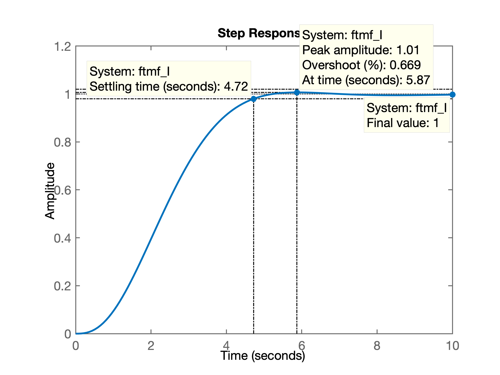

De onde se percebe que poderíamos ter adotado um ganho ainda maior, dado que mau foi produzido um _overshoot_. O sistema quase resultnum num comportamento super-amortecido.

Analisando o gráfico do RL percebemos algums coisas:

* em malha-fechada (MF), o sistema resultou com 3 pólos dominantes. Repare que além do par de pólos complexos em $s=-0.6275 \pm j0,8567$, também temos a ocorrência de um polo real em $s=-0.7382$, ou seja, este polo real é tão "dominante" na resposta quanto o par de pólos complexos. E por estarem tão próximos, a idéia de aproximar a resposta de um sistema de MF para o de um sistema de 2a-ordem com apenas 1 par de pólos complexos desanda, porque neste caso temos um terceiro pólo real muito próximo do par compleo de pólos. Motivo pelo qual a estimativa inicial dos cálculos para $\zeta$, não se cumprem quando fechamos a malha. Esteja conciente que quanto aproximamos a resposta de um sistema de ordem qualquer para um o de um sistema de 2a-ordem com apenas 1 par de pólos complexos dominantes, nem sempre é isto que acontece, como é o caso aqui. 

* Este terceiro pólo real dominante é causado pelo própio pólo do integrador (em $s=0$) que está sendo atraído pelo próprio zero da planta. Note:

```matlab
>> pole(ftma_I)
ans =
   0.0000 + 0.0000i
 -10.0000 + 0.0000i
  -1.0000 + 1.0000i
  -1.0000 - 1.0000i
>> zero(ftma_I)
ans =
    -6
>> 
```

Alguém poderia pensar em aumentar o ganho neste momento. Percebe que neste caso em particular, aumentar o ganho implica em 2 consequencias algo contraditórias entre si:

* Num primeiro momento, aumentar o ganho $K_i$ vai fazer com o RL do terceiro pólo dominantes "caminhe" mais rápido da sua posição de origem em $s=0$ para o zero da planta localizado em $s=-6$, porém:
* Não esquecer a resposta deste sistema em malha fechada também estará sendo definida pelo par de pólos complexos, todos muito próximos. Mas ao contário do que acontece com o terceiro pólo real, este par de pólos complexos, a medida que o ganho $K_i$ aumenta, se aproxima cada vez mais do eixo $j \omega$ do plano$-s$, além de implicar em aumento de _overshoot_ (aumento no valor de $\zeta$).

Se o aumento de $K_i$ for exagerado, o sistema inclusive deixa de ser estável; os pólos complexos passam a ocorrer no semi-plano direito do plano$-s$. Analizando o RL percebemos que se $K_i > 0,568$, o sistema em MF ficará instável -- ver próxima figura:


Reparec na figura anterior que com um ganho em torno de $K_i \approx 0,290$, teremos um pólo real localizado em $s=-1,57$ mais rápido que o obtido com o ganho anterior ($K_i=0.1041$, pólo real em $s=-0.7382$), **mas o _overshoot_ vai aumentar**: o matlab estima o _overshoot_ em $\%OS > 38\%$ **e pior**, a **parte real dos pólos complexos ficarão mais próximo do eixo $j \omega$**, especificamente em $s=-0,324$, **tornando a resposta ainda mais lenta que os pólos de MF obtidos com $K_i=0,1041$** (que ficavam com a parte real em $s=-0.6275$). De fato, um teste fechando a malha com $K_i=0,290$ resulta em:

```matlab
>> K_I2=0.290;
>> ftmf_I2=feedback(K_I2*ftma_I, 1);
>> figure; step(ftmf_I, ftmf_I2)
>> legend('Int. Puro (K=0,1041', 'Int. Puro (K=0.290)')
```

Gerando o gráfico à seguir:


### c) Controlador PI

### d) Controlador por Atraso de Transporte (Lag)

### e) Controlador PD

### f) Controlador por Avanço de Fase (Lead)

### g) Controlador por Avanço-Atraso de Fase (Lead-Lag)

### h) Controlador PID

## Planta 2

Seja a planta definida pela equação:

$$
G_2(s)=\dfrac{80}{(s+8)(s+5)(s+2)}
$$

Tentar projetar diferentes controladores para atender aos seguintes requisitos de controle:

* $t_s \le 1,1$ segundos;
* $\%OS \le 20\%$;
* $e(\infty) \le 20\%$;
* $y(\infty)=1,0$, mas $-3,5 \le u(t) \le 3,5$.

### a) Controlador Proporcional

### b) Contrale por Ação Integral Pura

### c) Controlador PI

### d) Controlador por Atraso de Transporte (Lag)

### e) Controlador PD

### f) Controlador por Avanço de Fase (Lead)

### g) Controlador por Avanço-Atraso de Fase (Lead-Lag)


> Realizado na aula de 31.10.2019
> 
> Resolução iniciada a partir deste ponto...

Entrando com dados da planta:

```matlab
>> G2=tf(80, poly([-8 -5 -2]));
>> zpk(G2)

ans =
 
         80
  -----------------
  (s+8) (s+5) (s+2)
 
Continuous-time zero/pole/gain model.
```

Procedimento:

1. Inicia-se pelo projeto do controlador de Avanço de Fase (Lead) para garantir os requisitos de controle temporais, no caso, tentar atender $t_s$.

2. Depois se parte para o projeto do controlador de Atraso da Fase que visa limimitar o erro de regime permanente ao valor especificado.

O diagrama de blocos referente ao projeto deste controlador fica:

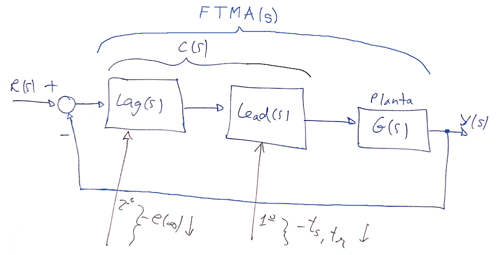

Revisando a estrutura de controladores Lead e Lag temos:


Iniciamos pelo projeto do controlador de Avanço (Lead). Para tanto, temos que analizar o RL para avaliar posições adequadas para seu par pólo-zero.

O zero do controlador Lead deve estar o mais próximo possível da origem do plano-s. Mas devemos lembrar que este zero tentará atrair o pólo mais lento da planta localizado em $s=-2$.

Opções:

1. zero entre $-2 < z_{Lead} < 0$. 
2. zero entre $-5 < z_{Lead} < -2$

Para os dois casos, o pólo deste controlador fica localizado na direção de $s=-\infty$. Escolhemos posicionar o mesmo, mais distante (na direção de $-\infty$) que o pólo mais lento da planta localizado em $s=-8$, posicionando-o em: $p_{Lead}=-12$.

Esboçando os RLs teremos:

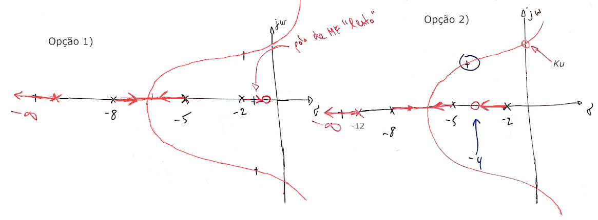

**Para a opção 1**, a equação do Lead ficaria algo como:

$$
C_{Lead1}(s)=K \cdot \dfrac{(s+1)}{(s+12)}
$$

Neste caso, se percebe pelo RL que ocorrerá um pólo real de MF entre -2 à 0 no plano-s, com o pólo real indo na direção da origem do plano-s, ou seja, caracterizando uma resposta temporal bastante lenta.

**Para a opção 2**, a equação do Lead ficaria algo como:

$$
C_{lead2}(s)=K \cdot \dfrac{(s+4)}{(s+12)}
$$ 

Nesta opção, ocorrerá um pólo real de MF entre o pólo mais lento da planta (em $s=-2$) e o zero alocado para o controlador. Neste caso, este pólo se afasta da origem do plano-s e fica mais distante do mesmo, em comparação com a opção 1. 

Nos 2 casos, ocorrerão 3 pólos dominantes (mais próximos da origem do plano-s): um par conjugado complexo que caracteriza respostas típicas de sistemas de 2a-ordem com $0 < \zeta < 1$ e um pólo real que irá distorcer a resposta temporal esperada para o par de pólos complexos.

Seguindo com a **opção 2** para o controlador Lead, teremos:

```matlab
>> % opção 2...
>> G_lead=tf([1 4],[1 12]);
>> ftma_lead=G_lead*G2;
>> rlocus(ftma_lead)
```

O último comando gera o RL, mas vamos aproveitar e incluir onde deveriam estar os pólos de MF para cumprir com os requisitos de controle especificados para esta planta:

```matlab
>> % calculando posição desejada para os pólos de MF
>> OS=20;	% overshoot máximo especificado
>> ts=1.1;	% tempo máximo de assentamento especificado
>> zeta=(-log(OS/100))/(sqrt(pi^2+(log(OS/100)^2)))
zeta =
    0.4559
>> wn=4/(zeta*ts)
wn =
    7.9754
>> wd=wn*sqrt(1-zeta^2)
wd =
    7.0981
>> % wd = parte imaginária dos pólos de MF
>> sigma = wn*zeta	% calculando parte real dos pólos de MF
sigma =
    3.6364
>> % montando vetor dos pólos de MF
>> polos_mf=[-sigma+i*wd -sigma-i*wd]
polos_mf =
  -3.6364 + 7.0981i  -3.6364 - 7.0981i
>> figure(1) % foco no RL anterior
>> hold on		% comando para sobrepor gráfico dos pólos de MF
>> % desejados sobre o RL anterior
>> plot(polos_mf,'r+')
>> sgrid(zeta,wn)	% Aproveitando para sobrepor linhas guias do zeta e wn
```

Podemos agora definir um ganho para este controlador com o objetivo de testar se esta proposta permite atender aos requisitos temporais desejados:

```matlab
>> [K_Lead,aux]=rlocfind(ftma_lead)		% encontrando o valor do ganho do Lead
Select a point in the graphics window
selected_point =
  -3.3842 + 6.6729i
K_Lead =
    7.7172
aux =
 -16.9761 + 0.0000i
  -3.0687 + 6.5241i
  -3.0687 - 6.5241i
  -3.8864 + 0.0000i
>> % testando o lead...
>> ftmf_lead=feedback(K_Lead*ftma_lead, 1);		% fechando a malha com o Lead
>> figure; step(ftmf_lead)						% verificando resposta
>> % alguns valores encontrados:
>> % ts=1,22; %OS=19.3%
>> % calculando erro em regime permanente do Lead
>> (1-dcgain(ftmf_lead)/1)*100
ans =
   27.9925
>> % Ou seja, quase 28% de erro, tudo bem porque o controlador Lag vai corrigir este erro.
```

A figura à seguir confirma o RL e mostra o ganho adotado inicialmente:


E a seguinte resposta ao degrau é encontrada:

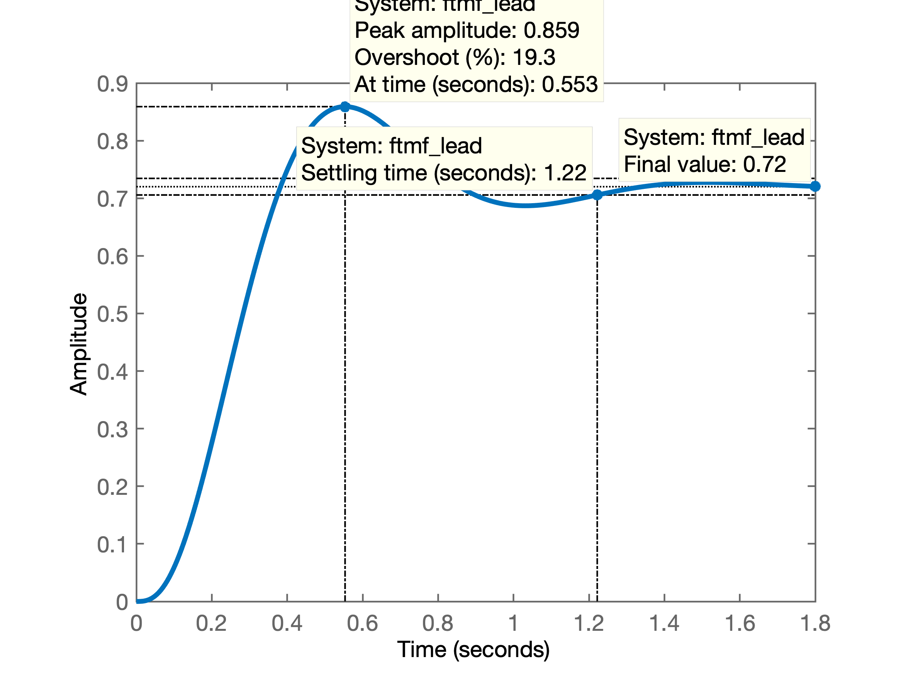

Porém, reparando no RL gerado, percebemos que provavelmente adotar um ganho mais baixo para o Lead, vai permitir afastar mais os pólos complexos conjugados do eixo $j\omega$, apesar de repercutir num erro maior em regime permanente (e também num $\%OS$ menor.) A questão do erro será corrigida com a introdução do controlador Lag:


Optando por reduzir o ganho do controlador Lead para $K_{Lead}=5$, teremos:

```matlab
>> K_Lead=5;
>> % testando em quanto ficou ts com este ganho
>> ftmf_lead=feedback(K_Lead*ftma_lead, 1);
>> figure; step(ftmf_lead)
>> % com este valor de ganho:
>> % ts(Lead)=0,964; y(\infty)=0,625 -- isto é, o erro aumentou
>> (1-dcgain(ftmf_lead))/1*100
ans =
   37.5000
>> % Se espera compensar o aumento do erro, com o controlador Lag.
```

Segue abaixo a nova resposta temporal encontrada:

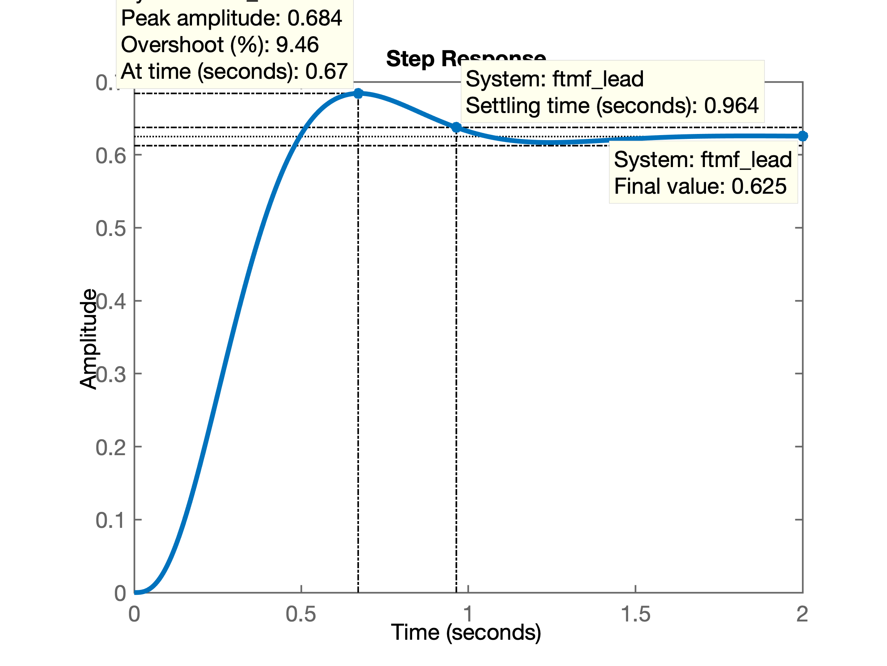

Continuando com o projeto do controlador Lag...

Temos que analizar agora opções para introdução do par pólo-zero do **controlador Lag**. O objetivo pretendido com a inclusão deste controlador é reduzir o erro em regime permanente. Para tanto, convêm aproximar seu pólo o máximo possível da origem do plano-s.

Analizando opções possíveis no RL, temos:

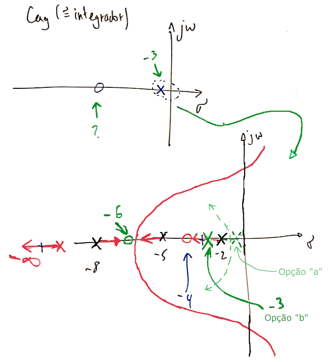

A **opção "a"**: nesta proposta o pólo do controlador ficaria entre $0< p_{Lag} < -2$, resultando num RL com ponto de partida ("_break-out_") entre o pólo mais lento da planta (em $s=-2$) e o pólo do controlador Lag. Isto resultará pólos de MF complexos lentos.

A **opção "b"**: neste caso, o pólo do controlador ficaria entre $-2 < p_{Lag} < -4$ (em $s=-4$ está o zero do controlador Lead). Esta proposta parece mais promissora porque o RL resultará num ponto de partida que deve ocorrer entre o pólo mais lento da planta (em $s=-2$) e o pólo do controlador (Lag) que neste caso, estaria mais afastado do eixo $j \omega$, propiciando uma resposta temporal mais rápida à despeito de uma menor redução no erro em regime permanente que o pretendido. 

Efetivando os cálculos no `Matlab` para avaliar a proposta:

```matlab
>> % Definindo o Lag
>> C_Lag=tf([1 6],[1 3])

C_Lag =
 
  s + 6
  -----
  s + 3
 
Continuous-time transfer function.

>> ftma_lead_lag=C_Lag*G_lead*G2;
>> % RL final
>> figure; rlocus(ftma_lead_lag)
>> hold on
>> plot(polos_mf,'m+')	% plota os pólos de MF desejados em magenta
```

O RL resultante aparece na figura abaixo:

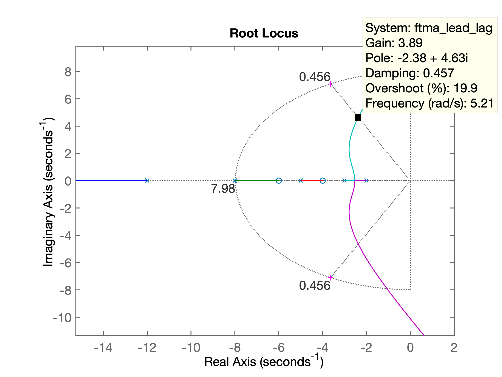

Analisado o RL anterior se percebe que a proposta não permitiu definir um RL que passe próximo dos pontos desejados para os pólos de MF. Eventualmente deslocar o zero do controlador Lag para um ponto mais distante que $s=-6$ na direção para $-\infty$, possa melhorar o RL. Avaliando...

```matlab
>> % Realizando um ajuste no Lag...
>> C_Lag=tf([1 10],[1 3]) % afastando o zero do Lag...

C_Lag =
 
  s + 10
  ------
  s + 3
 
Continuous-time transfer function.

>> ftma_lead_lag=C_Lag*G_lead*G2;
>> % verificando como ficou o RL...
>> figure; rlocus(ftma_lead_lag)
>> hold on;
>> plot(polos_mf,'m+')
>> sgrid(zeta,wn)
>> sgrid(zeta,wn)
```

Este ajuste causou pouco impacto no RL, conforme pode ser visto na próxima figura:

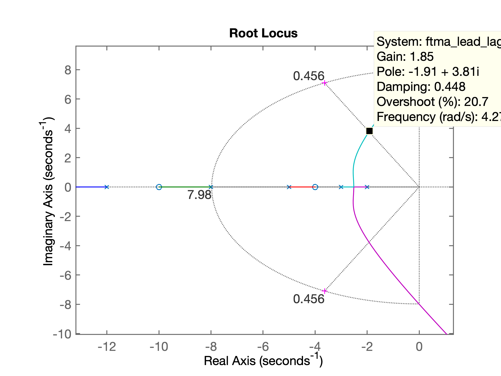

Este último RL já aponta (_Data cursor_) o local escolhido para o ganho de malha fechada do controlador Lead-Lag: $K=1,85$. Fechando a malha com este ganho:

```matlab
>> K_lead_lag=1.85;
>> ftmf_lead_lag=feedback(K_lead_lag*ftma_lead_lag, 1);
>> figure;
>> step(ftmf_lead_lag)
>> erro=(1-dcgain(ftmf_lead_lag))/1*100
erro =
   32.727
>> diary off
```

Obtendo o resultado:

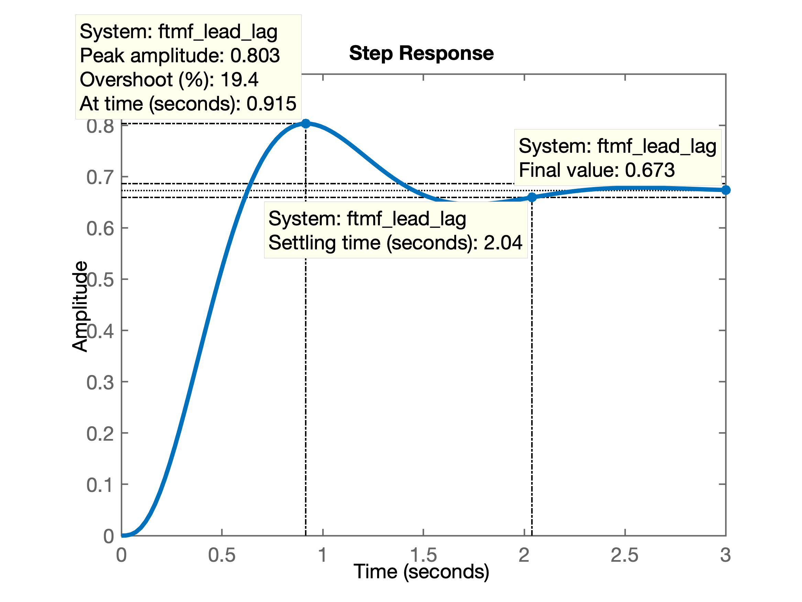

Onde podemos observar os seguintes resutlados:

* $\%OS=19,4\% \quad \checkmark$
* $t_s = 2,04$ (desejado $t_{s_d} < 1,1$) $\quad \ltimes$
* $e(\infty) = 32,727\%$ (desejado $e(\infty)<20\%$) $\quad \ltimes$

Estes resultados foram obtidos com o seguinte controlador:

$$
C_{\text{Lead-Lag}}=1,85 \cdot \underbrace{\dfrac{(s+4)}{(s+12)}}_{\text{Lead}} \cdot \underbrace{\dfrac{(s+10)}{(s+3)}}_{\text{Lag}}
$$

Analisando o RL anterior, percebemos que eventualmente alguns ajustes podem melhorar o desempenho deste controlador:

* O pólo do controlador Lag poderia até permanecer em $s=-3$ (apesar de provavelmente não contribuir muito para redução do $e(\infty)$).
* O zero do controlador Lead (em $s=-4$) poderia ser deslocado mais para $-\infty$. Este zero atraí o 2o-pólo mais lento da planta localizado em $s=-5$, fazendo como que este RL caminhe na direção do eixo $j \omega$, quando o contrário (RL "caminhando" para a direção de $-\infty$ seria o desejado). Isto pode ser ajustado, modificando a posição do zero do Lead de $s=-4$ para $s=-6$ por exemplo.

Teríamos então:

$$
C_{\text{Lead-Lag}}=1,85 \cdot \underbrace{\dfrac{(s+6)}{(s+12)}}_{\text{Lead}} \cdot \underbrace{\dfrac{(s+10)}{(s+2,2)}}_{\text{Lag}}
$$

Testando...

```matlab
>> C_lead_lag2=tf(poly([-6 -2.2]),poly([-12 -10]));
>> zpk(C_lead_lag2)

ans =
 
  (s+6) (s+2.2)
  -------------
  (s+12) (s+10)
 
Continuous-time zero/pole/gain model.

>> ftma_lead_lag2=C_lead_lag2*G2;
>> figure; rlocus(ftma_lead_lag2);
>> hold on;
>> plot(polos_mf,'m+')
>> sgrid(zeta,wn)
>> axis([-15 2 -10 10])		% realizando "zoom" na região de interesse
>> [K_lead_lag2,aux]=rlocfind(ftma_lead_lag2)	% encontrando o ganho
Select a point in the graphics window
selected_point =
  -4.6570 + 8.1860i
K_lead_lag2 =
   11.8172
aux =
 -19.6899 + 0.0000i
  -4.6078 + 8.1588i
  -4.6078 - 8.1588i
  -5.9469 + 0.0000i
  -2.1476 + 0.0000i
>> % o ganho (mais elevado) foi colocado no prolongamento da linha guia
>> % correspondente ao zeta desejado - ganho maior: menor erro
>> % fechando a malha
>> ftmf_lead_lag2=feedback(K_lead_lag2*ftma_lead_lag2, 1);
>> figure; step(ftmf_lead_lag2);
>> erro=(1-dcgain(ftmf_lead_lag2))/1*100
erro =
   43.4803
>> save planta2
```

Resulta o seguinte RL (bastante mais promissor):

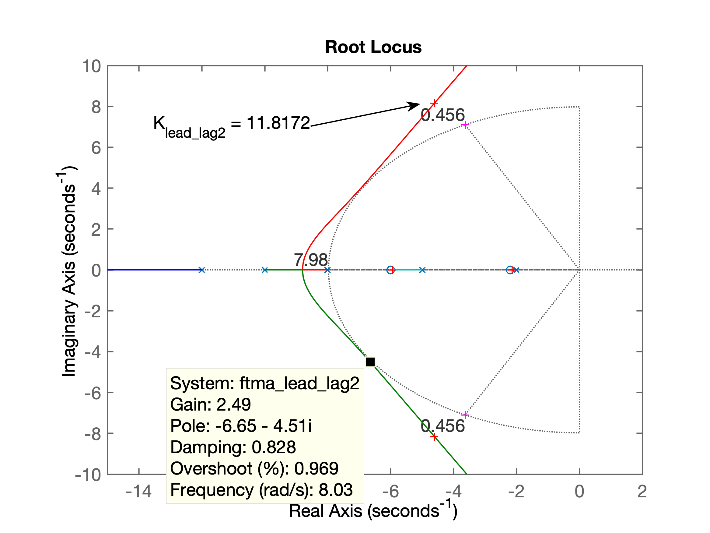

E a seguinte resposta ao degrau:

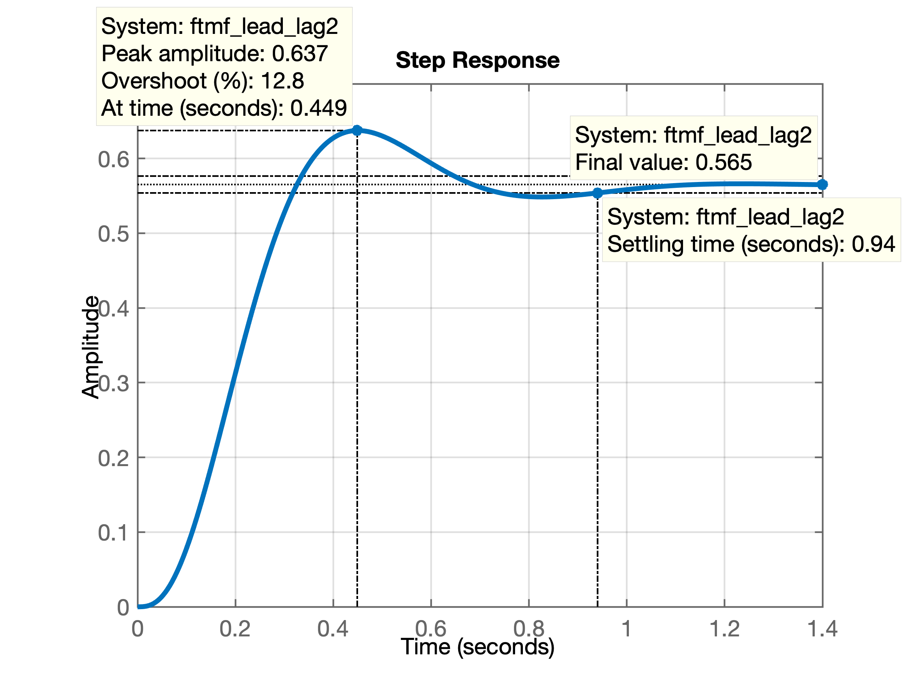

Infelizmente percebemos que não foi possível reduzir o erro para $e(\infty)< 20\%$. Muito provavelmente porque o pólo do controlador Lag deveria estar mais próximo do eixo $j \omega$ para compensar o erro provocado pelo controlador Lead. Mas esta alteração implica em todo um novo estudo. E eventualmente só com introdução de ação integral (PID) se consiga atingir mais facilmente os requisitos de controle especficados para esta planta.

## Planta 3

Seja a planta definida pela equação:

$$
G_3(s)=\dfrac{24(s+55)(s+7)}{77(s+15)(s+4)(s+2)}
$$

Tentar projetar diferentes controladores para atender aos seguintes requisitos de controle:

* $t_s \le 0,35$ segundos;
* $\%OS \le 10\%$;
* $e(\infty) \le 10\%$;
* $y(\infty) = 2,0$, mas $0 \le u(t) \le 18$.

### a) Controlador Proporcional

### b) Contrale por Ação Integral Pura

### c) Controlador PI

### d) Controlador por Atraso de Transporte (Lag)

### e) Controlador PD

### f) Controlador por Avanço de Fase (Lead)

### g) Controlador por Avanço-Atraso de Fase (Lead-Lag)

---

Prof. Fernando Passold