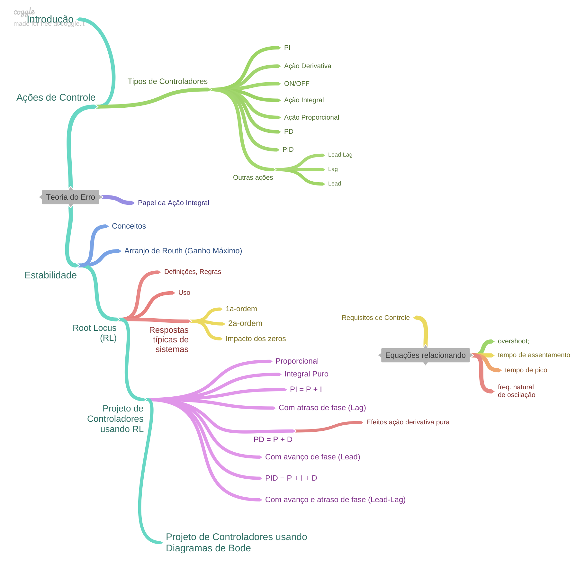

<!-- ttitle: Controle Automático II -->

 
<font size="1"> Photo by David Watkis on https://unsplash.com/images/feelings/cool?</font> 

# Curso de Controle Automático II

<details><summary>Sequência prevista para aulas...</summary>
<p>



</p>
</details>

<details><summary>Referências Bibliográficas</summary>
<p>

* **NISE**, Norman S. **Engenharia de sistemas de controle**. 7. ed. Rio de Janeiro: LTC, 2017. xiv, 751 p. ISBN 9788521634355. Número de chamada: 681.5 N724e 7.ed.-2017.  

* **NISE**, Norman S. **Engenharia de sistemas de controle**. 7. Rio de Janeiro LTC 2017 1 [Acesso online (via UPF)](https://secure.upf.br/pergamum/biblioteca_s/acesso_login.php?cod_acervo_acessibilidade=5014181&acesso=aHR0cHM6Ly9pbnRlZ3JhZGEubWluaGFiaWJsaW90ZWNhLmNvbS5ici9ib29rcy85Nzg4NTIxNjM0Mzc5&label=acesso%20restrito). ISBN 9788521634379. Acervo BU/UPF: 5014181.

</p>
</details>

 
<details><summary>Dicas instalação do MATLAB (toolboxes necessários)...</summary>
<p>

> Para os propósitos desta disciplina (Controle Automático I, Controle Automático II e Controle Automático III), é altamente desejável o uso do Matlab/Simulink.
>
> O software Matlab/Simulink normalmente vêm acompanhado de vários "toolboxes" (bibliotecas extras que complementam suas funções), em tal quantidade que sua instalação completa (todos os toolboxes), facilmente pode exigir mais de 30 GBytes de espaço em disco!
> 
> Sugere-se no momento da instalação do Matlab/Simulink, optar-se pela instalação dos seguintes pacotes:
>
> Products:
> MATLAB (**>= Matlab R2017b**)</br>
> [x] **Simulink**</br> 
> [x] **Control System Toolbox**</br>
> [x] **Curve Fitting Toolbox**</br>
>
> A lista acima envolvendo instalação do Matlab versão 2017B realizada num MacOS exigiu:
> Installation Size: 5,759 MB (5,7 Gbytes) 
> (Espaço ocupado numa máquina executando MacOS Monterey; o espaço final pode variar um pouco para sistemas Linux ou Windows)
> 
> Recomenda-se também: </br>
> [x] Symbolic Math Toolbox </br>
> [x] SimEvents </br>
> [x] Simscape </br>
> [x] Simscape Driveline </br>
> [x] Simscape Electronics </br>
> [x] Simscape Fluids </br>
> [x] Simscape Multibody </br>
> 
> **Exemplo real**: Instalação do MATLAB Version: 9.5.0.944444 (R2018b) em Windows 11,com os seguintes toolboxes:
> 
```bash
MATLAB                                                Version 9.5         (R2018b)
Simulink                                              Version 9.2         (R2018b)
Computer Vision System Toolbox                        Version 8.2         (R2018b)
Control System Toolbox                                Version 10.5        (R2018b)
Curve Fitting Toolbox                                 Version 3.5.8       (R2018b)
Data Acquisition Toolbox                              Version 3.14        (R2018b)
Database Toolbox                                      Version 9.0         (R2018b)
Deep Learning Toolbox                                 Version 12.0        (R2018b)
Fixed-Point Designer                                  Version 6.2         (R2018b)
Fuzzy Logic Toolbox                                   Version 2.4         (R2018b)
Image Acquisition Toolbox                             Version 5.5         (R2018b)
Image Processing Toolbox                              Version 10.3        (R2018b)
MATLAB Coder                                          Version 4.1         (R2018b)
MATLAB Distributed Computing Server                   Version 6.13        (R2018b)
Optimization Toolbox                                  Version 8.2         (R2018b)
Parallel Computing Toolbox                            Version 6.13        (R2018b)
Partial Differential Equation Toolbox                 Version 3.1         (R2018b)
Robotics System Toolbox                               Version 2.1         (R2018b)
Sensor Fusion and Tracking Toolbox                    Version 1.0         (R2018b)
Signal Processing Toolbox                             Version 8.1         (R2018b)
SimEvents                                             Version 5.5         (R2018b)
Simscape                                              Version 4.5         (R2018b)
Simscape Driveline                                    Version 2.15        (R2018b)
Simscape Electrical                                   Version 7.0         (R2018b)
Simscape Fluids                                       Version 2.5         (R2018b)
Simscape Multibody                                    Version 6.0         (R2018b)
Simulink 3D Animation                                 Version 8.1         (R2018b)
Simulink Check                                        Version 4.2         (R2018b)
Simulink Coder                                        Version 9.0         (R2018b)
Simulink Control Design                               Version 5.2         (R2018b)
Simulink Coverage                                     Version 4.2         (R2018b)
Simulink Desktop Real-Time                            Version 5.7         (R2018b)
Simulink PLC Coder                                    Version 2.6         (R2018b)
Simulink Real-Time                                    Version 6.9         (R2018b)
Simulink Requirements                                 Version 1.2         (R2018b)
Simulink Test                                         Version 2.5         (R2018b)
Stateflow                                             Version 9.2         (R2018b)
Statistics and Machine Learning Toolbox               Version 11.4        (R2018b)
Symbolic Math Toolbox                                 Version 8.2         (R2018b)
System Identification Toolbox                         Version 9.9         (R2018b)
```

> Exigiu: 15,7 Gbytes de espaço em disco!
</p>
</details>


## 1) Introdução

* História da Área de Controle Automático (clássico) --> [intro_controle_2.pdf](1_intro/intro_controle_2.pdf);
* [Artigo da Scientific American](1_intro/The%20Origins%20of%20Feedback%20Control.pdf) sobre as origens do Controle por realimentação (artigo em inglês, de Out/1970);
* [Artigo IEEE Control Systems Magazine](1_intro/IEEE%20Xplore%20Full-Text%20PDF%20-%20Feeback%20Control-%20An%20Invisible%20Thread%20in%20the%20History%20of%20Technology.pdf) sobre a história da área de Controle Automático (artigo em inglês, de Abril/2002);

## 2) Ações de Controle

* Ações de Controle (teoria/slides) --> [acoes_controle.pdf](2_acoes/acoes_controle.pdf);
* Material complementar sobre Açôes de Controle Básicas --> [acoes_controle_basicas.pdf](2_acoes/acoes_controle_basicas.pdf);
* Exemplo de [Controle de Velocidade de motor CC](Testes_Velocidade_Motor_CC/modelagem_motor_cc.html) (diferentes controladores), incluindo sua modelagem.
    * Arquivos SLX para Simulações de ações de controle de velocidade do motor CC (para uso com Matlab/Simulink) + imagens e HTML em formato Zipado ([Motor_CC.zip](2_acoes/Motor_CC.zip), 5 MB).
    
<details><summary>Clique aqui para ver conteúdo de "Motor_CC.zip"</summary>
<p>

```bash
Downloads % unzip -l Motor_CC.zip
Archive:  Motor_CC.zip
  Length      Date    Time    Name
---------  ---------- -----   ----
        0  08-02-2023 17:07   Motor_CC/
   532911  08-31-2020 16:00   Motor_CC/Armature Controlled DC Motor - Wikipedia.pdf
   616785  08-31-2020 17:40   Motor_CC/Control Tutorials for MATLAB and Simulink - Motor Speed: Simulink Control.pdf
   496414  08-31-2020 17:39   Motor_CC/Control Tutorials for MATLAB and Simulink - Motor Speed: Simulink Modeling.pdf
   672037  08-31-2020 15:53   Motor_CC/Creating a High-Fidelity Model of an Electric Motor for Control System Design and Verification - MATLAB & Simulink.pdf
   196291  08-31-2020 15:52   Motor_CC/DC Motor Model.pdf
   148642  09-01-2020 22:34   Motor_CC/modelagem_motor_cc.html
    11871  09-01-2020 22:34   Motor_CC/modelagem_motor_cc.md
  1456599  09-01-2020 22:34   Motor_CC/modelagem_motor_cc.pdf
    32883  08-31-2020 17:21   Motor_CC/monitoracao_motor_cont_Prop.png
    22922  08-31-2020 17:31   Motor_CC/monitoramento_cont_PD.png
    27987  08-31-2020 17:27   Motor_CC/monitoramento_cont_PI.png
    34142  08-31-2020 17:35   Motor_CC/Motor_CC_Velocidade-modelo_interno.pdf
   154191  08-31-2020 18:55   Motor_CC/Motor_CC_Velocidade-modelo_interno.png
    23847  08-31-2020 17:33   Motor_CC/motor_cc_velocidade-subsistema.pdf
    52161  08-31-2020 18:56   Motor_CC/motor_cc_velocidade-subsistema.png
    38708  08-31-2020 17:28   Motor_CC/motor_cc_velocidade_cont_PD.pdf
   131721  08-31-2020 19:20   Motor_CC/motor_cc_velocidade_cont_PD.png
    37639  08-31-2020 17:23   Motor_CC/motor_cc_velocidade_cont_PI.pdf
    43061  08-31-2020 19:25   Motor_CC/motor_cc_velocidade_cont_PID.pdf
   194239  08-31-2020 19:25   Motor_CC/motor_cc_velocidade_cont_PID.png
    34534  08-31-2020 17:17   Motor_CC/motor_cc_velocidade_cont_Prop.pdf
   129720  08-31-2020 19:06   Motor_CC/motor_cc_velocidade_cont_Prop.png
    28247  08-31-2020 17:16   Motor_CC/motor_cc_velocidade_teste_MA.pdf
    71860  08-31-2020 18:59   Motor_CC/motor_cc_velocidade_teste_MA.png
    15737  08-31-2020 17:47   Motor_CC/motor_phisic_setup.png
    31648  08-31-2020 18:05   Motor_CC/Picture1.png
    34539  08-31-2020 18:15   Motor_CC/Picture2.png
    36338  08-31-2020 18:19   Motor_CC/Picture3.png
    39880  08-31-2020 18:49   Motor_CC/Picture4.png
    30494  08-31-2020 18:51   Motor_CC/Picture44.png
    35633  08-31-2020 17:11   Motor_CC/resposta_PID.png
    25237  08-31-2020 17:30   Motor_CC/resultado_cont_PD.png
    30466  08-31-2020 17:24   Motor_CC/resultado_cont_PI.png
    33204  08-31-2020 17:19   Motor_CC/resultado_cont_Prop.png
    40831  08-31-2020 17:15   Motor_CC/resultado_MA.png
        0  08-02-2023 17:07   Motor_CC/Simulink/
    23960  08-31-2020 17:35   Motor_CC/Simulink/motor_cc_velocidade.slx
    23849  08-31-2020 17:32   Motor_CC/Simulink/motor_cc_velocidade_cont_PD.slx
    23722  08-31-2020 17:27   Motor_CC/Simulink/motor_cc_velocidade_cont_PI.slx
    24127  08-31-2020 17:12   Motor_CC/Simulink/motor_cc_velocidade_cont_PID.slx
    23685  08-31-2020 17:22   Motor_CC/Simulink/motor_cc_velocidade_cont_Prop.slx
    23048  08-31-2020 17:15   Motor_CC/Simulink/motor_cc_velocidade_teste_MA.slx
---------                     -------
  5685810                     43 files
```

Instruções:

* Baixar apenas o arquivo Motor_CC.zio (quase 5 Mbytes);
* Depois descompactar arquivo Motor_CC.zip. 
* Serão gerados vários arquivos a partir da pasta "\Motor_CC"; 
* Nesta pasta busque pelo arquivo "modelagem_motor_cc.html". Abra este arquivo no seu browser preferido. 
* É criando ainda um subdiretório à partir da pasta anterior: \Motor_CC\Simulink", contendo todos os arquivos SLX (diagramas de blocos para Matlab/Simulink). Indique este "path" no Matlab para pode acessar estes arquivos.
* **Obs.:** Executar script `motor.m` ANTES de rodar rotinas SLX do Simulink. Senão Simulink será paralizado com mensagem de erro questionando sobre variáveis desconhecidas). Na janela de console (comandos) do Matlab, basta digitar: `>> motor`.

</p>
</details>

## 3) Teoria do Erro

* Teoria do erro (ou da Precisão): slides --> [erros.pdf](3_erros/erros.pdf);
* [Exemplos de sistemas à serem simulados](Simulink_Erros/Readme.html) (Matlab/Simulink: arquivos disponibilizados);
* Avaliação quanto à Teoria do Erro: [Google Forms: Avaliação Teoria do Erro](https://docs.google.com/forms/d/e/1FAIpQLSf1dYZ52eQAYvpfKVSjnaPG8YJSuukig0y84F19SRApwe4Rsw/viewform)

## 4) Estabilidade

- Slides/teoria --> [Estabilidade.pdf](4_estabilidade/Estabilidade.pdf);
- [Parte 1](estabilidade.html) (Conceitos e simulações)
- [Parte 2](estabilidade2.html) (Incompleto)
- Vídeos (YouTube) Recomendados:
  - [Critério de Estabilidade de Routh (ELT009, ELT035) - Prof. Aguirre (UFMG)](https://www.youtube.com/watch?v=NjyjJ6qtOMs&authuser=1);
  - Teste de Routh - Quarto grau - [Parte 1](https://www.youtube.com/watch?v=XU8Xj7KMTdI&authuser=1) - Eng. Cleiton Vanz.
  - Teste de Routh - Quarto grau - [Parte 2](https://www.youtube.com/watch?v=Th0MQoAclKs&authuser=1) - Eng. Cleiton Vanz.
- Avaliação: [Google Forms: Avaliação Estabilidade](https://docs.google.com/forms/d/e/1FAIpQLSfTMz4hUTPVmExId7o_wwuXPOtGJ8mJjmqOIPfE2QryEfH60Q/viewform)

## 5) Root Locus

* Introdução sobre Root Locus --> [intro_root_locus.pdf](6_RL/intro_root_locus.pdf)
  * Rotina [`intro_rlocus.m`](6_RL/intro_rlocus.m) (aprendendo root-locus);
* Regras e exemplos sobre traçados de RLs --> [Root_Locus_2a_parte_pt.pdf](6_RL/Root_Locus_2a_parte_pt.pdf);
* **Resumo** sobre Root Locus --> [root_locus_resumo.pdf](6_RL/root_locus_resumo.pdf);
* Vídeo (YouTube) recomendado: [Root Locus (ELT009, ELT013, ELT035) - Prof. Luis Antonio Aguirre (UFMG)](https://www.youtube.com/watch?v=OQgDXdpZfXE&authuser=1) + [Adendo sobre Álgebra de Diagrama de Blocos deste professor](6_RL/AdendoaoVideoAlgebradeDiagramadeBlocos.pdf)
* Vídeos (YouTube) recomendados sobre **Álgebra de Diagrama de Blocos** do Prof. Cleiton Vaz: [Simplificações - parte 1](https://www.youtube.com/watch?v=aj7CTW8rHOA&authuser=1) e [Simplificações - parte 2](https://www.youtube.com/watch?v=HOdfgqtAL4c&authuser=1).

## 6) Respostas de Sistemas Lineares

* Revisão sobre Respostas de Sistemas Lineares (plantas de 1a-ordem, um polo simples real, múltiplos polos reais, polos dominantes, sistemas 2a-ordem com polos reais e polos complexos) --> [Root_Locus_3a_parte_pt_2019_1.pdf](5_respostas/Root_Locus_3a_parte_pt_2019_1.pdf)

## 7) Projeto de Controladores usando Root Locus

- [Projeto de Controladores usando Root Locus (Parte I) --> Controlador Proporcional](projeto_usando_root_locus_parte_1.html);
- [Melhorias em Controlador Proporcional !?](Melhora_Kp/melhorias_controlador_proporcional.html) (aula de 04/06/2021)
- [**Projeto de Controladores Prooporcional e com Ação Integral**](PI_parte1.html)
- [Projeto de Controlador Proporcional (Aula #1: 2022/2)](control2inf_2020_2/aula_10102022.html) (aula de 10/10/2022; cálculo de $Kp$ em função do $e(\infty)$ desejado);

- Projeto de Controladores com **Ação Integral**:
  - [Projeto de Controladores com Ação Integral (Aula #2: 2022/2)](control2inf_2020_2/17102022.html) (aula de 17/10/2022);
  - [Projeto de PI (por contribuição angular) + Lag](PI_angular_Lag.html); (Aula de 30/10/2020);
    - [Projeto de PI usando contribuição angular](projeto_controladores_acao_integral_extendido.html)(versão antiga, de 2019/2);
    - [Exemplo$_1$ (Aula de 20/05/2020)](aula_20_05_2020/aula_20_05_2020.html): Projeto de PI usando Contribuição Angular + Projeto de Compensador por Atraso de Fase.
    - [Exemplo$_2$ (Aula de 26/10/2020)](2020_2/PI_Lag_aula_26_10_2020.html): Projeto de PI usando Contribuição Angular + Projeto de Compensador por Atraso de Fase.
    - [Exemplo$_3$ (Aula de 14/05/2021)](controle_2_info_2021_1/aula_14_05_2021.html): **E quando o $t_s$ desejado é impossível de ser alcançando?**
  - [Observações](observacoes_cuidados_contribuicao_angular.html) quanto à **cálculos de contribuição angular**.

- Controladores com **Ação Derivativa**:  
  - [Ação Derivativa](Acao_Derivativa.html) (Derivador Puro? Simulações, cuidados e atenção).
  - [Ação Derivativa na presença de sinal ruidoso](Exemplo_ruido_acao_derivativa/circuito_derivativo.html) (11/11/2022).
  - [Teoria à respeito de Compensador por Avanço de Fase (Lead)](Teoria_PD_Lead/acoes_derivativas.html) (Aula de 02/06/2021)  
  - [Projeto de PD](aula_PD_03out2019.html) (Aula de 03/10/2019; Uso de Contribuição angular)
  - [Projeto de Controladores PD](control2inf_2020_2/aula_07112022.html) (Aula de 07/11/2022; estudo de múltiplos casos para posição do zero + projeto do PD usando contribuição angular);
  - [Projeto de Compensador por Avanço de Fase (Lead)](projeto_Lead/exemplo_lead.html) (Aula de 09/06/2021)
  - [Projeto de Compensadores Lead](control2inf_2020_2/aula_21_11_2022.html) (Aula de 21/11/2022)

- [Projeto de PID](PID/examplo_9_5_PID.html) (*example_9_5* de [**NISE**, Norman S. **Control Systems Engineering**](https://bcs.wiley.com/he-bcs/Books?action=index&itemId=1118170512&bcsId=9295)).

- [Projeto de Lead-Lag](Aula_28_05_2019_lead_lag.html) (Aula de 28/05/2019)

- [Outros exemplos de projetos de controladores usando RL](exercicios/exercicios.html) (exercícios aleatórios).

- [Sintonia de PID](8_Ajuste_PID/Sintonia_PIDs_usando_ZN.html) (usando Ziegler-Nichols e Método do Relé)

## 8) Projeto de Controladores no Domínio Frequência

- Teoria inicial/slides (arquivos PDF):
  - [Parte 1: Revisão Diagramas de Bode + Conceitos Área Controle](10_bode/Cap_10_Tecnicas_Resposta_Frecuencia_parte_1-ptbr.pdf);
  - [Parte 2](10_bode/Cap_10_Tecnicas_Resposta_Frecuencia_2a_parte.pdf);
- [Projeto de Controlador Proporcional (Ajuste de Ganho)](projeto_bode_01.html);
- [Projeto de Controlador por Atraso de Fase (Lag)](lag_bode.html);
- [Projeto de Controlador por Avanço de Fase (Lead)](lead_bode.html);
- Projeto de Compensador Lead-Lag (arquivos PDF) --> [Teoria](10_bode/Projeto_baseado_Resposta_Frequencia_Lag_Lead.pdf) + [Resumo](10_bode/projetos_lead_lag.pdf)

- Vídeos (YouTube) recomendados do Prof. Luis Antonio Aguirre (UFMG):
  - [Projeto no Domínio Frequência](https://www.youtube.com/watch?v=TicWSrtXMvU&authuser=1);
  - [Marges de Ganho e de Fase](https://www.youtube.com/watch?v=NqlbKB8bm6Q&authuser=1);
  - [Compensadores: Avanço, Atraso e Avanço Atraso](https://www.youtube.com/watch?v=M9klBSezRQA&authuser=1).


- Videos (em inglês) do Prof. Brian Douglas:
  - [Designing a Lag Compensator](https://www.youtube.com/watch?v=-4bY4W0hvFA&authuser=1);
  - [Designing a Lead Compensator](https://www.youtube.com/watch?v=rH44ttR3G4Q&authuser=1);
  - "[Engineering Media](https://engineeringmedia.com)" --> Site do Prof. Brian Douglas (desde 2018)


## 9) Sintonia (prática) de PIDs

* [Sintonia de PID](8_Ajuste_PID/Sintonia_PIDs_usando_ZN.html) (usando Ziegler-Nichols e Método do Relé)
* [Ajuste usando Método do Relé](8_Ajuste_PID/ajuste_metodo_rele.pdf);
* [PID: Métodos de sintonia (dicas)](8_Ajuste_PID/PID_metodos_sintonia.pdf);
* Exemplo: arquivo [`sintonia_PID_exemplo.slx`](8_Ajuste_PID/sintonia_PID_exemplo.slx) (Matlab/Simulink)

## Trabalhos

* :boom: [Turma de 2023/1](trabalho_2023_1/trabalho_2023_1.html) 

## FAQs

<details><summary>Dúvida em Projeto de PI usando Root Locus e Contribuição Angular...</summary>
<p>

> Dúvida associada com posição do zero do controlador, o qual achamos por contribuição angular. No arquivo, há dois tipos de tentativa: a primeira seguindo à risca o que estava no material do senhor quanto ao processo de achar o local do zero, e a segunda mudando a equação das somatórias dos polos e zeros, como o senhor poderá ver no arquivo. 
>
> Gostaríamos de saber como podemos proceder nesse caso, e se ele se encaixa na observação feita pelo senhor no material sobre amplitudes excessivas para a ação de controle.
>
> Segue [PDF](FAQ/Dvuidas%20Controlador_PI.pdf) original com a dúvida, acrescido de comentários no próprio PDF.
</p>
</details>

<details><summary>Dúvidas Projeto de PD e cálculo do seu zero usando contribuição angular...</summary>
<p>

> Dúvidas Projeto de PD e cálculo do seu zero usando contribuição angular... --> [PDF](FAQ/observacoes_cuidados_contribuicao_angular.pdf)
</p>
</details>

<details><summary>Dúvidas Projeto de PD e cálculo do seu zero usando contribuição angular...</summary>
<p>

> Dúvida sobre PD e Lead (simulações com Bloco Saturador)... --> [PDF](FAQ/cópia%20de%20Duvida_Controlador_PD_LEAD.pdf)
</p>
</details>


## :speech_balloon: Anexos

- [Como obter gráficos de $u(t)$ e $e(t)$](Acoes_Controle_Erro/acoes_controle_erro.html) na linha de comandos do Matlab.
- [Uso do MATLAB nas aulas de Controle + documentação **Markdown**](sugestao_uso_matlab_em_controle.html);

------

<font size="1">[:musical_note:](https://soundcloud.com/paolitachan/paul-mccartney-wings-live-and) Prof. Fernando Passold</font>

<script language="JavaScript">
<!-- Hide JavaScript...
var LastUpdated = document.lastModified;
<font size="1">
document.writeln ("Last updated: " + LastUpdated);
</font>
// End Hiding -->
</script>