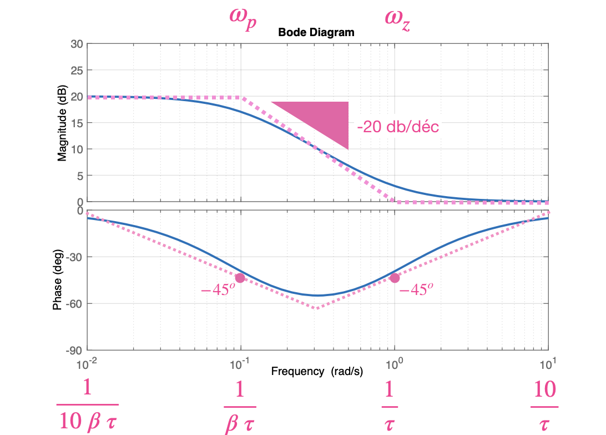
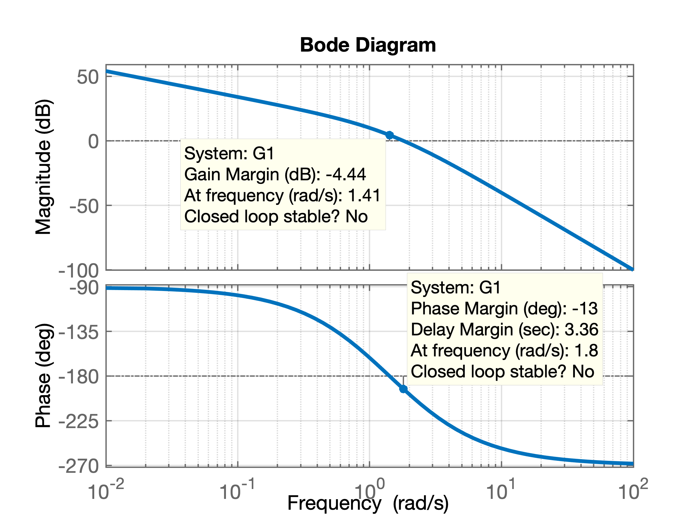
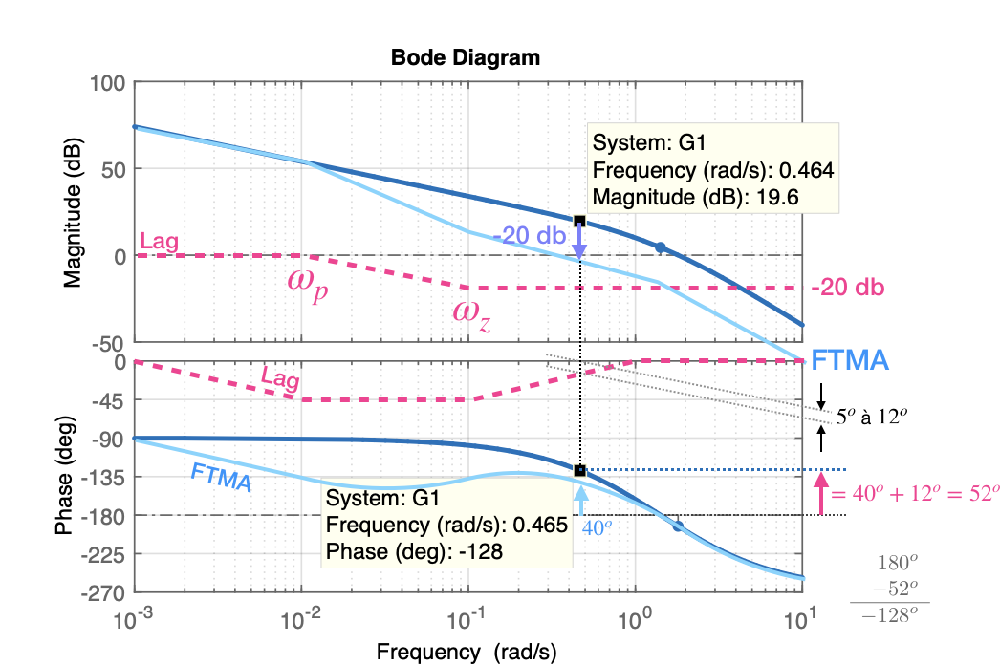
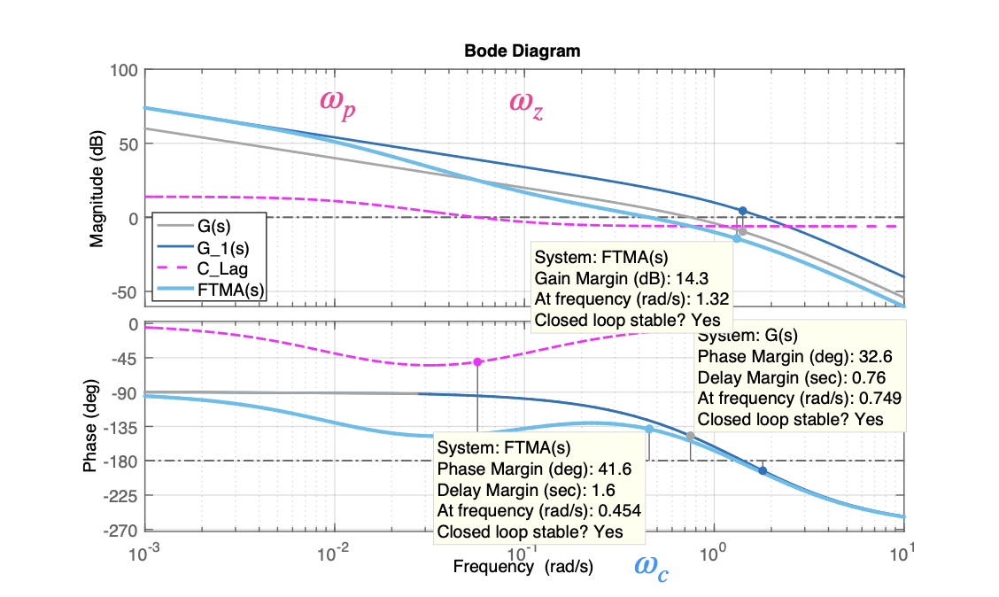
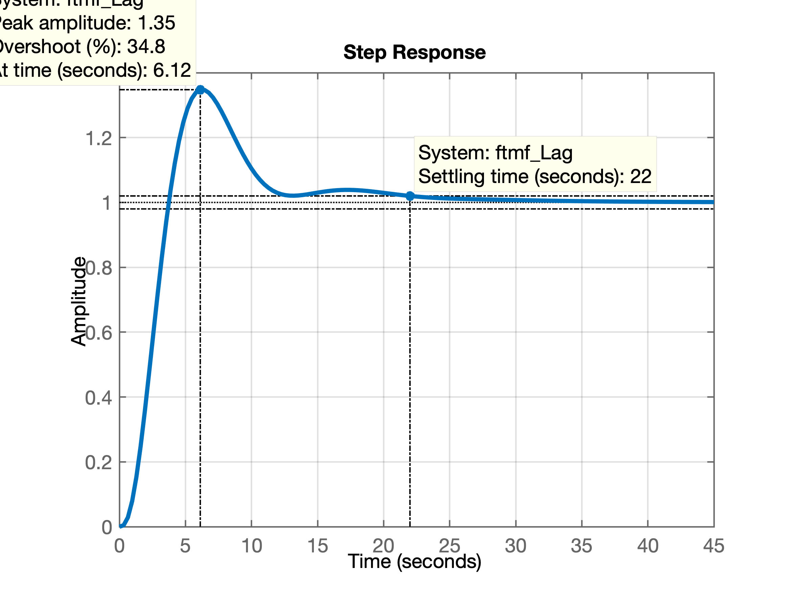
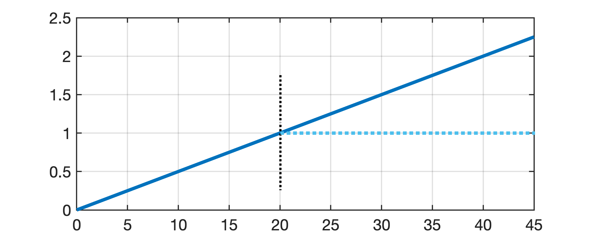
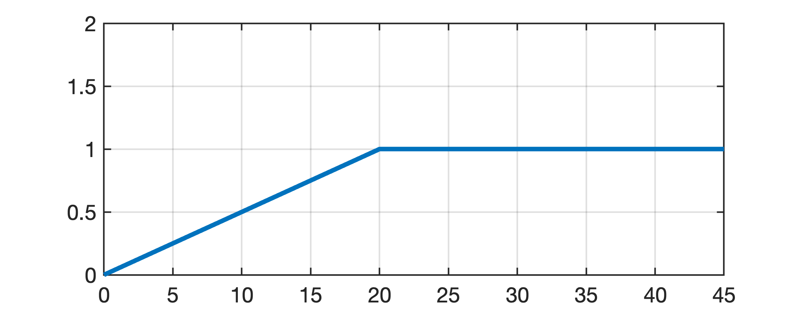
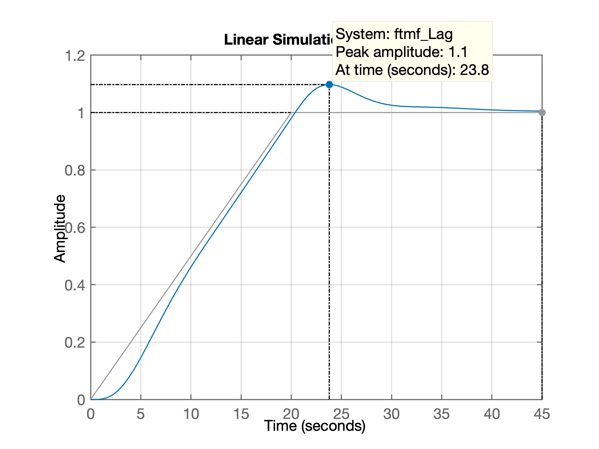

# Projeto de Controlador por Atraso de Fase no Domíniuo Frequência

### Controladores do tipo Lead/Lag

Equação genérica:

$$
C(s)=K \; \dfrac{s+a}{s+b}
$$


> Baseado em: Karl Johan Aström, Richard M. Murray; Feedback Systems: An Introduction for Scientists and Engineers, Princeton University Press, Princeton, New Jersey, 2008.

---

### Controlador Lag

Equação genérica do controlador:

$$
C(s)= \overbrace{\left( \dfrac{\omega_p}{\omega_z} \right)}^{K} \cdot \dfrac{(s+\omega_z)}{(s+\omega_p)}
$$
ou
$$
C(s)=K_c \; \beta \; \dfrac{(\tau \; s +1)}{(\beta \; \tau \; s +1)} = K_c \cdot \dfrac{\left( s+ \dfrac{1}{\tau} \right)}{ \left( s+\dfrac{1}{\beta \; \tau} \right)} \quad (\beta > 1)
$$

No plano-_s_ o compensador por atraso de fase tem um zero em $s = -\dfrac{1}{\tau}$ e um polo em $s = -\dfrac{1}{\beta \; \tau}$. O polo fica localizado à direita do zero.

A próxima figura mostra o diagrama de Bode para este tipo de Controlador, no caso, com $K_c=10$, $\beta=10$ e $\tau=1$ ($\omega_z=1/\tau$). As frequências de "canto" deste compensandor estão em $\omega=\dfrac{1}{\tau}$ e $\omega=\dfrac{1}{\beta \; \tau}$.



Figura obtida usando `matlab`:

```matlab
>> Kc=10;
>> beta=10;
>> Kc=1;
>> tau=1;
>> G_Lag=tf(Kc*poly(-1/tau),poly(-1/(tau*beta)));
>> zpk(G_Lag)
ans =
 
   (s+1)
  -------
  (s+0.1)
 
Continuous-time zero/pole/gain model.

>> bode(G_Lag)
>> grid
```

### Procedimento associado com controlador Lag

1. A função transferência em malha-aberta do sistema compensado fica:
$$
FTMA(s)=K \; \dfrac{(\tau \; s +1)}{(\beta \; \tau \; s + 1)} \; G(s)=\dfrac{(\tau \; s +1)}{(\beta \; \tau \; s +1)} \; K \; G(s) = \dfrac{(\tau \; s +1)}{(\beta \; \tau \; s+1)} \; G_1(s)
$$
onde: $G_1(s)=K \; G(s)$.

A idéia inicial é determinar o ganho $K$ para que o requisito de controle relatico ao erro estático (erro de regime permanente) seja atendido.

2. Se o sistema não compensado $G_1(j \omega)=K\; G(j \omega)$, com o ganho ajustado, não satisfizer as especificações de margem de ganho e de fase, determinar o ponto de frequencias onde o ângulo de fase da função transferência de malha aberta seja igual a $-180^o$ mais a margem de ganho requerida. A margem de fase requerida é a margem de fase especificada, mais $5^o$ a $12^o$. A adição de $5^o$ a $12^o$ compensa o atraso de fase de compensador. Selecione esta frequencia como a nova frequencia de cruzamento de ganho ($\omega_c$).

3. Para prevenir efeitos nocivos do atraso de fase causados pelo compensador, o polo e o zero do compensador devem ficar localizados substancialmente abaixo da nova frequência de cruzamento de ganho. Portanto, escolha a frequência de canto $\omega = 1/\tau$ (correspondente ao zero do compensador por atraso de fase), uma oitava ou uma década abaixo da nova frequência de cruzamento de ganho. Se as constantes de tempo do compensador por atraso de fase não se tornarem muito elevadas, a frequência de canto $\omega = 1/\tau$ poderá ser escolhida uma década abaixo da nova frequência de cruzamento de ganho. Note que **são escolhidos os polos e os zeros do compensador suficientemente pequenos**, assim, **o atraso de fase ocorre em uma região de baixa frequência**, de modo que não afete a margem de fase (do sistema original).

4. Determine a atenuação necessária para baixar a curva de módulo a 0 dB na nova frequência de cruzamento de ganho. Notando-se que essa atenuação é de $–20\log \beta$, determine o valor de $\beta$, fazendo: $20 \cdot \log_{10} \left( \dfrac{1}{\beta} \right)=\text{Atenuação (em dB)}$. Então, a outra frequência de canto (correspondente ao polo do compensador por atraso de fase) é determinada a partir de $\omega = 1/(\beta \; \tau)$.

5. Utilizando o valor de K determinado na etapa 1 e o de $\beta$ determinado na etapa 4, calcule a constante $K_c$ a partir de:
$$
K_c=\dfrac{K}{\beta}
$$

---

**Exemplo**: Considere o sistema cuja função transferência é a seguinte:

$$
G(s)=\dfrac{1}{s(s+1)(0,5s+1)}=\dfrac{1}{s (s+1)\frac{1}{2}(s+2)}=\dfrac{2}{s(s+1)(s+2)}
$$

Se deseja compensar o sistema de tal forma que a constante de erro estático de velocidade $K_v$ seja de 5 ($s^{-1}$), a margem de fase seja pelo menos $40^o$ e a margem de ganho seja de pelo menos 10 dB.

**Solução**:

Usando a eq. genérico do compensador por atraso de fase, temos:

$$
FTMA(s)=K_c \; \beta \; \dfrac{(\tau \; s +1)}{(\beta \; \tau \; s +1)} = K_c \; \dfrac{\left( s + \dfrac{1}{\tau} \right)}{\left( s + \dfrac{1}{\beta \; \tau} \right)} \qquad (\beta >1)
$$
onde:
$$
K_c \cdot \beta = K
$$
e
$$
G_1(s)=K \cdot G(s) = \dfrac{2K}{s(s+1)(s+2)}
$$

1) Determinando o valor de $K$ em função do $K_v$ desejado, temos:
$$
K_v = \lim_{s \to 0} \; s FTMA(s) = \lim_{s \to 0} \; s \; \dfrac{(\tau \; s +1)}{(\beta \; \tau \; s +1)}=\lim_{s \to 0} \; s \; G_1(s)
$$
no caso:
$$
K_v=\lim_{s \to 0} \; \dfrac{s \; 2\; K}{s \; (s+1)(s+2)} = \dfrac{2K}{(1)(2)} = 5 \quad \therefore \quad K=5
$$

Com $K=5$ o sistema satisfaz o requisito de erro em regime permanente.

2) Levantando o diagrama de Bode de:
$$
G_1(s)=\dfrac{5 \cdot 2}{s(s+1)(s+2)}=\dfrac{10}{s(s+1)(s+2)}
$$

```matlab
>> G=tf(2,poly([0 -1 -2]));
>> zpk(G)

ans =
 
        2
  -------------
  s (s+2) (s+1)
 
Continuous-time zero/pole/gain model.

>> K=5;
>> G1=5*G;
>> zpk(G1)

ans =
 
       10
  -------------
  s (s+2) (s+1)
 
Continuous-time zero/pole/gain model.

>> figure; bode(G1)
>> grid
```

O que resulta na figura:



Percebe-se que apenas com o ganho $K=5$ (Controlador Proporcional) o sistema não vai atender a margem de desejada e ainda fica instável em malha-fechada (Margem de ganho negativa).

A idéia é introduzir o compensador Lag de forma a aproveitar o diagrama de fase original do sistema ($G_1(s)$) na margem de fase desejada; levando em conta a "distorção" (introdução) provocada pelo integrador (implica somar $+5^o$ à $+12^o$) e para isto, na frequencia onde ocorre este ponto (frequencia de corte, $\omega_c$), o ganho do sistema compensado deve ser de 0 dB. Ver figura abaixo:



A margem de fase desejada é de $40^o$, considerando mais $12^o$ ($+5^o$ à $+12^o$) para compensar a  distorção na fase introduzida pelo compensador de atraso de fase, temos que buscar a frequência onde $G_1(s)$ naturalmente passe por $-128^o$ ($=180^o-52^o$), o que ocorre em $\omega_c \cong 0,5$ (rad/s). Esta seria a nova frequencia de cruzamento de fase (ou $w_{\Phi_M}'$). Para esta frequencia corresponder à Margem de Fase desejada, o ganho do sistema compensado deve passsar por 0 dB nesta frequencia. Obervando o diagrama de Bode, notamos que o compensador deve então reduzir o ganho em 20 dB antes de $\omega_c=0,5$ (rad/s). 

Note que a introdução do compensador por atraso de fase provoca uma redução na fase do sistema em baixas frequencias. Mas a idéia é justamente aproveitar a queda de 20 dB provocade pelo compensador e localizar seus pólos e zeros de tal forma que redução do diagrama de fase original do sistema ocorra antes da frequencia de cruzamento de fase (ou frequencia onde deve ocorrer a margem de fase desejada + compensação causada pela introdução do compensador).

Analisado o diagrama, podemos fixar a frequencia do zero do compesador entre uma década à uma oitava antes de $\omega_c$, no caso, decidimos por fazer $w_z=0,1$ (rad/s). Como essa frequência de canto não fica muito abaixo da nova frequência de cruzamento de ganho, a modificação na curva de ângulo de fase pode não ser pequena. Por isto, foram adicionados $12^o$ à margem de fase desejada, como uma tolerância considerando o ângulo de atraso de fase introduzido pelo compensador.

Como a frequencia de cruzamento de fase ficou em $\omega_c=0,5$ (rad/s), neste ponto o compensador por atraso de fase deve fornecer a atenuação necessária, que nesse caso é de – 20 dB. Então:

$$
20 \log \left( \dfrac{1}{\beta} \right) = -20
$$
$$
\log_{10} \left( \dfrac{1}{\beta} \right) = -1
$$
$$
\log_{10} \, \left( \, \beta \, \right) = 1 \quad \therefore \quad 10^1=\beta
$$
finalmente: $\beta=10$.

A outra frequência de canto, $\omega_p = 1\, / \, (\beta \, \tau)$, que corresponde ao polo do compensador por atraso de fase, é então determinada como:

$$
\omega_p=\dfrac{1}{\beta \, \tau}=\dfrac{\omega_z}{\beta}=\dfrac{0,1}{10}=0,01 \text{ (rad/s)}
$$

A eq. final do controlador fica então:

$$
C(s)=\underbrace{K_c \, \beta}_{K} \cdot \dfrac{(\tau \, s +1)}{(\beta \, \tau \, s +1)}=K_c \, \dfrac{\left( s+\dfrac{1}{\tau} \right) }{ \left( s+ \dfrac{1}{\beta \, \tau} \right) }=K_c \, \dfrac{(s+\omega_z)}{(s+\omega_p)}
$$
$$
C(s) = K_c \, \dfrac{(s+0,1)}{(s+0,01)}
$$

Como $K=5$ e $\beta=10$, teremos:

$$
K_c=\dfrac{K}{\beta}=\dfrac{5}{10}=\dfrac{1}{2}=0,5
$$

No `matlab`:

```matlab
>> beta=10;
>> z = 0.1;
>> w_z=0.1;			% definindo a frequencia (posição) do zero
>> w_p=w_z/beta		% calculando posição do pólo
w_p =
    0.0100
>> Kc=K/beta		% determinando ganho do Lag
Kc =
    0.5000
>> % montando eq. do controlador Lag:
>> C_Lag=tf(Kc*[1 w_z], [1 w_p]);
>> zpk(C_Lag)

ans =
 
  0.5 (s+0.1)
  -----------
   (s+0.01)
 
Continuous-time zero/pole/gain model.

>> % calculando a FTMA(s):
>> ftma_Lag=C_Lag*G;
>> zpk(ftma_Lag)

ans =
 
         (s+0.1)
  ----------------------
  s (s+2) (s+1) (s+0.01)
 
Continuous-time zero/pole/gain model.

>> 
```


Confirmando, a $FTMA(s)$ fica:

$$
FTMA(s)=\underbrace{\dfrac{1}{2} \cdot \dfrac{(s+0,1)}{(s+0,01)}}_{C(s)} \cdot \underbrace{\dfrac{2}{s(s+1)(s+2)}}_{G(s)} = \dfrac{(s+0,1)}{s(s+0,01)(s+1)(s+2)}
$$

O diagrama de bode considerando a introdução do controlador fica:



Fechando a malha:

```matlab
>> ftmf_Lag=feedback(ftma_Lag, 1);
>> figure; step(ftmf_Lag)
```

Que gera o gráfico:



Simulando uma entrada rampa neste sistema:

```matlab
>> t=0:0.01:45;		% criando vetor tempo
>> u=t*1/20; 		% rampa leva 20 segundos para atingir 1,0
>> figure; plot(t,u)
>> grid
```

Que gera o gráfico:



```matlab
>> % realizando ajustes na referência (rampa + degrau unitário depois de t=20 segundos)
>> find(t==20)	% descobrindo em que posição (index) do vetor t e u, t=20 segundos
ans =
        2001
>> t(2001)	% verificando valor do vetor t(index)
ans =
    20
>> u(2001)	% verificando amplitude de u(t)
ans =
     1
>> % Modificando a rampa para degrau depois de t=20 segundos (vetor t[>=201] )
>> u(2001:length(u))=1;
>> figure; plot(t,u)
>> axis([0 45 0 2])
```

E finalmente temos a referência desejada:



Simulando este sinal com o sistema compensado:

```matlab
>> figure; lsim(ftmf_Lag, u, t)
>> grid
```

Que gera a resposta:



Fim