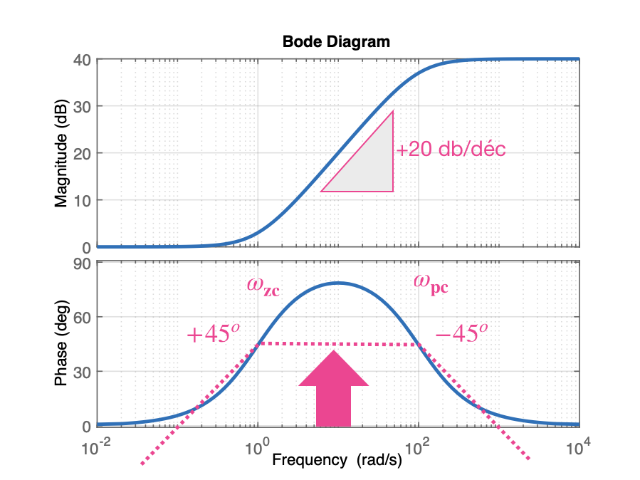
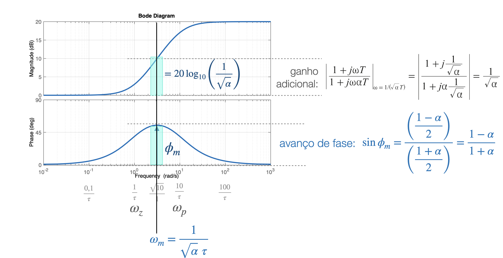
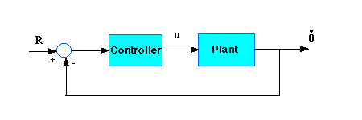
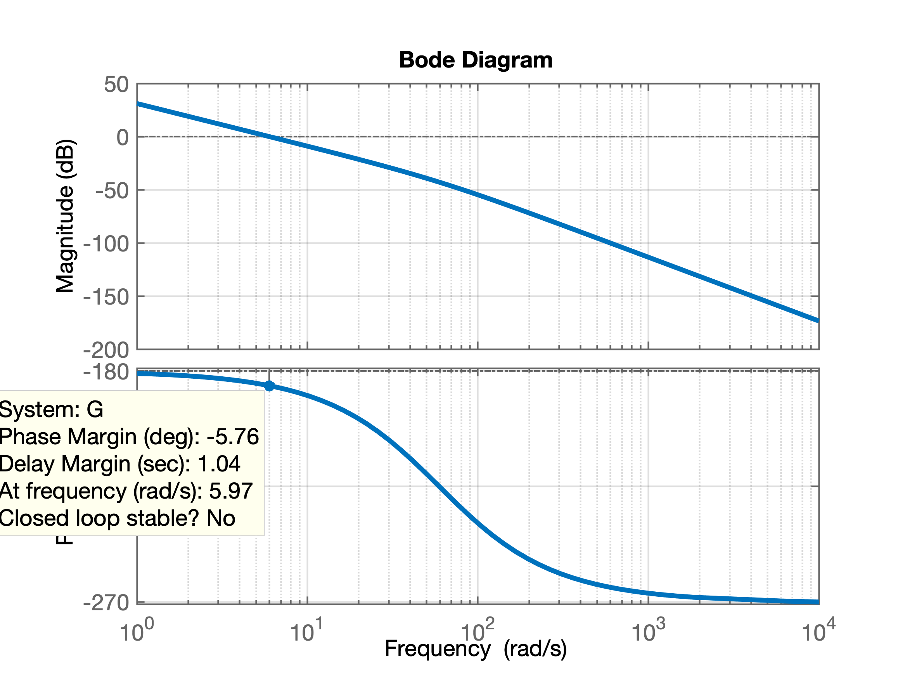
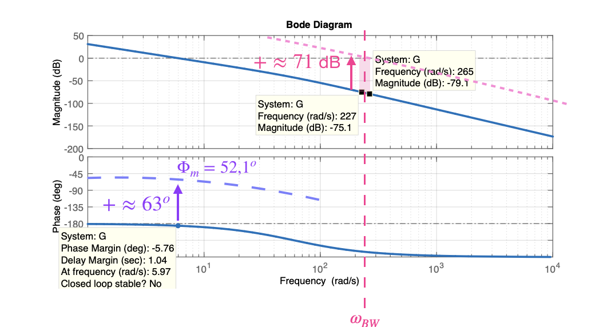

# Projeto de Controlador Lead no domínio frequência

> Aula de 14.11.2019

## Embasamento teórico

### Controladores do tipo Lead/Lag

Equação genérica:

$$
C(s)=K \; \dfrac{s+a}{s+b}
$$


> Baseado em: Karl Johan Aström, Richard M. Murray; Feedback Systems: An Introduction for Scientists and Engineers, Princeton University Press, Princeton, New Jersey, 2008.

## Controlador Lead (por Avanço de Fase)

Uma equação genérica para este controlador pode ser:

$$
C(s)= \overbrace{\left( \dfrac{\omega_p}{\omega_z} \right)}^{K} \cdot \dfrac{(s+\omega_z)}{(s+\omega_p)}
$$

que leva ao diagrama de Bode mostrado à seguir:



O gráfico anterior foi obtido via `matlab`:

```matlab
>> G_lead=tf(100*[1 1],[1 100]);
>> zpk(G_lead)
ans =
 
  100 (s+1)
  ---------
   (s+100)
 
Continuous-time zero/pole/gain model.
>> figure; bode(G_lead)
```

**Detalhes**:

* Zero $\Rightarrow$próximo da origem (do plano-s).

**Vantagens** deste controlador (ou objetivos pretendidos com adoção do mesmo):

* aumentar margem de fase, $\Phi_m \Rightarrow \propto \%OS, \zeta \downarrow$;
* $\downarrow t_r \;, \downarrow t_s$;
* atua na faixa "alta" de frequências.

O problema é que esta eq. genérica não permite um estudo mais aprofundado ou facilita o projeto e aplicação deste controlador numa planta. A fim de melhorar a contribuição causada pela adoção deste controlador, modificaremos a eq. genérica do mesmo para:

$$
C(s)=K_c \; \alpha \; \dfrac{(\tau s+1)}{(\alpha \tau s +1)} = K_c \; \dfrac{ \left( s+\dfrac{1}{\tau} \right) }{ \left( s+\dfrac{1}{\alpha \tau} \right) } \quad (0 < \alpha < 1)
$$

> Ref.: Katsuhiko Ogata, Engenharia de controle moderno, 5a. ed., p. 822. São Paulo: Pearson Prentice Hall, 2010; In [Capítulo 7 – Análise e projeto de sistemas de controle pelo método de resposta em frequência]; 

**Detalhes**:

* Note que $alpha$ define a "distância" entre o zero e pólo deste controlador. O pólo fica localizado numa frequência $alpha$ vezes superior à do zero.
* O valor mínimo de $\alpha$ é limitado pela construção física do compensador por avanço de fase. Esse valor mínimo de $\alpha$ é geralmente adotado em torno de 0,05. Isso significa que o valor de avanço de fase máximo que pode ser conseguido é de aproximadamente $65^o$.

A eq. anterior rende o mesmo tipo de diagrama de bode que o já mostrado inicialmente, mas permite inferir informações mais interessantes para realização de um projeto adotando este tipo de controlador:


Esta figura foi obtida usando-se `matlab`:

```matlab
>> lead=tf(10,[1 1],[1 10])
>> zpk(lead)

ans =
 
  10 (s+1)
  --------
   (s+10)
 
Continuous-time zero/pole/gain model.

>> figure; bode(lead)
```

A próxima figura ressalta detalhes envolvendo o controlador por avanço de fase:



Esta figura ressalta as contribuições e alterações que serão provocadas no diagrana de Bode quando um controlador por Avanço de Fase for introduzido num sistema. 

**Notar**:

* A contribuição máxima (avanço de fase máximo) ocorre na frequenacia $\omega_m$:
$$
\omega_m=\dfrac{1}{\sqrt{\alpha} \; \tau}
$$
* Nesta frequencia, a contribuição máxima trazida corresponde à relação:
$$
\sin{\phi_m}=\dfrac{\left( \dfrac{1-\alpha}{2} \right)}{\left( \dfrac{1+\alpha}{2} \right)}=\dfrac{1-\alpha}{1+\alpha}
$$
de onde podemos isolar $\alpha$:
$$
\alpha=\dfrac{1 - \sin{ \phi_m }}{1 + \sin{ \phi_m } }
$$

* Note que na frequencia $\omega_m$ o controlador por avanço de fase, vai acrescentar um ganho ao sistema no valor de:
$$
= \dfrac{1}{\sqrt{ \alpha} } \quad \text{(em valores absolutos)}
$$ 
ou
$$
= 20 \log_{10} \left( \dfrac{1}{ \sqrt{\alpha} } \right) \quad \text{(dB)}
$$

### Procedimento para inclusão/projeto do controlador Lead

1. Primeiramente defina o ganho $K$ que deve ser incorporado ao sistema em MF para que o mesmo atenda aos requisitos de erro em regime permanente especificados para o mesmo. Na prática, fazemos:

    $$
	K_c \; \alpha = K
	$$
	
	$$
	C(s)=K \; \dfrac{(\tau s + 1)}{(\alpha \tau s + 1)}
	$$
	
	A $FTMA(s)$ fica:
	$$
	FTMA(s)=C(s) \cdot \underbrace{G(s)}_{\text{planta}} = K \cdot \dfrac{(\tau s + 1)}{(\alpha \tau s + 1)} \cdot G(s) = \dfrac{(\tau s + 1)}{(\alpha \tau s + 1)} \cdot KG(s) = \dfrac{(\tau s + 1)}{(\alpha \tau s + 1)} \cdot G_1(s)
	$$
	onde: $G_1(s)=K \cdot G(s)$.
	
	Então, determine o ganho $K$ a fim de satisfazer o requisito de erro estático desejado.
	
2. Construir o Diagrama de Bode, com $K$ ajustado. Avaliar a margem de fase.

3. Determinar o avanço de fase necessário (que deve ser acrescentado ao sistema). Adicionar $5^o$à $12^o$ao ângulo assim determinado porque a adição do compensador, desloca um pouco a frequência de cruzamento de ganho ($\omega_c$) para a direita, diminuindo margem de fase.

4. Determinar fator de atenuação $\alpha$. Definir a freq. na qual o bloco não compensado passa pelo ponto $G_1(j \omega)=-20\log { \left( 1/\sqrt{\alpha} \right) }$. Selecionar esta freq. como nova freq. de cruzamento de ganho ($\omega_c$), que corresponde à $\omega_m=1/(\sqrt{\alpha} \; \tau)$. 

5. Determinar as frequências do controlador:
	$$
	\text{zero } \rightarrow \omega_z=\dfrac{1}{\tau} 
	$$
	$$
	\text{polo } \rightarrow \omega_z=\dfrac{1}{\alpha \; \tau}
	$$
	
6. Usando o valor de $K$ determinado no item (1) e o de $\alpha$ na etapa (4), calcular a constante $K_c = \dfrac{K}{\alpha}$.

7. Verificar a margem de ganho para se certificar de que ela é satisfatória. Se não for, repita todo o processo modificando a localização do pólo e zero do controlador até alcançar o resultado desejado.

---

**Exemplo$_1$:**
Considere uma planta caracterizada pela equação:
$$
G(s)=\dfrac{4}{s(s+2)}
$$
deseja-se projetar un compensador para o sistema, de modo que a constante de erro estático de velocidade, $K_v$, seja $20 \; (s^{-1})$, a margem de fase seja pelo menos $50^o$ e a margem de ganho seja pelo menos 10 db.

> Exemplo 7.26 extraido de Ogata, pag. 455


_Solução_

1) Primeiramente temos que ajustar o ganho $K$ do sistema em MF para atender às especificações do projeto em regime permanente ou seja, propiciar a constante de erro estático de velocidade requerida:

$$
K_v=\lim_{s \to 0} s \; FTMA(s) = \lim_{s \to 0} s \cdot \dfrac{(\tau s + 1)}{(\alpha \tau s + 1)} \cdot G_1(s)
$$
$$
K_v=\lim_{s \to 0} \dfrac{ s \; 4 \; K}{ s \; (s+2)} = 2K = 20 \quad \therefore \quad K=10
$$


2) Traçamos o diagrama de Bode já considerando $K=10$:

```matlab
>> G1=tf(40, poly([ 0 -2]));
>> zpk(G1)

ans =
 
    40
  -------
  s (s+2)
 
Continuous-time zero/pole/gain model.

>> bode(G1)
```

Diagrama de Bode para $G_1(s)$:


3)  Analisando o diagrama de Bode anterior percebemos que a margem de fase "original" do sistema, realmente é muito baixa, apenas $18^o$ (o que implica _overshoots_ elevados, fortes oscilações e $t_s$ bastante alongado). Como é desejado margem de fase mínima de $50^o$ podemos inicialmente considerar o quanto é necessário aumentar esta margem de fase:

```matlab
>> 50-18
ans =
    32
```

Mas também temos que considerar que o acréscimo do controlador de avanço na planta, afeta um pouco tanto o diagrama de fase quanto o de ganho do sistema original. Para compensar esta ligeira distorção se costuma acrescentar de $5^o$ à $12^o$ na fase:
 
```matlab
>> 32+5
ans =
    37
```

Então, necessitamos que nosso controlador avance a fase em $37^o$.

 4) Determinamos o fator $\alpha$, com base em:

$$
sen{\Phi_m}=\dfrac{\left( \dfrac{1-\alpha}{2} \right)}{\left( \dfrac{1+\alpha}{2} \right)}=\dfrac{1-\alpha}{1+\alpha}
$$

de onde podemos isolar $\alpha$:

$$
\alpha=\dfrac{1 - \sin{ \phi_m }}{1 + \sin{ \phi_m } }
$$

```matlab
>> aux=sin(37*pi/180)	% lembrar que Matlab trabalha com radianos e não graus
aux =
    0.6018
>> alpha=(1-aux)/(1+aux)
alpha =
    0.2486
```

Agora falta considerar (e compensar) o ganho extra adicionado pelo controlador na frequencia $\omega_m$, que é igual à $=20\log { \left( 1/\sqrt{\alpha} \right) }$. Note que a nova frequencia da margem de fase (onde o diagrama de Bode passar po 0 dB) será ligeiramenta deslocada para a direita. Alguns autores chamam este novo ponto de frequencia, de **frequência de "cruzamento de ganho"** ou $\omega_c$. O que se quer dizer é que, se queremos manter a margem de fase requerida, o ganho do sistema nesta frequencia, deveria ser de 0 dB, o que não ocorre porque a introdução do compensador de avanço de fase faz "subir" o ganho do sistema compensado. A idéia então é compensar esta subida, identificando a nova frequencia onde o diagrama de Bode de $G_1(s)$ "caia" o mesmo tanto que o compensaador fará "subir" o ganho. 

Primeiramente temos que calcular o impacto no gannho causado pelo acréscimo do compensandor de Avanço:

```matlab
>> atenuacao_ganho=1/sqrt(alpha)
atenuacao_ganho =
    2.0057
>> 20*log10(atenuacao_ganho)
ans =
    6.0453
```


Temos então que "caçar" este valor de ganho no diagrama de Bode. No caso, notar que obteremos um valor aproximado já que o `matlab` não calcula todos os valores possíveis de ganho para compor o diagrama de Bode. O `matlab` varia a frequencia do diagrama de forma não linear, logarítmica quando se usa a função `bode(.)`. Neste caso, percebemos, via _Datatips_ que temos acesso a 2 dados próximos da atenução desejada de 6,04 dB:

* $\omega_c=8,18$ (rad/s) com $|G_1(j \omega)|_{\text{dB}}=-4,72 \text{ (dB)}$, e;
* $\omega_c=9,56$ (rad/s) com $|G_1(j \omega)|_{\text{dB}}=-7,36 \text{ (dB)}$, e;

A frequencia na qual $|G_1(j \omega)|_{\text{dB}} \approx -6.0453 \text{ (dB)}$, é aproximadamente $\omega_c \approx 9$ (rad/s).


5) De posse de $\omega_c$ e $\alpha$, agora podemos determinar as frequencias para o zero e para o polo do controlador:

$$
\text{zero } \rightarrow \omega_z=\dfrac{1}{\tau} 
$$
$$
\text{polo } \rightarrow \omega_z=\dfrac{1}{\alpha \; \tau}
$$

Notar que não necessitamos calcular $\tau$, já que:

$$
\omega_c = \omega_m' = \dfrac{1}{\sqrt{\alpha} \; \tau}
$$

então:

$$
\text{zero } \rightarrow \omega_z=\dfrac{1}{\tau} = \sqrt{\alpha} \cdot \omega_c 
$$
$$
\text{pólo } \rightarrow \omega_z=\dfrac{1}{\alpha \; \tau} = \dfrac{\omega_c}{\sqrt{\alpha}}
$$	
	
```matlab
>> % wm (ou wc) final considerando Pm desejado fica em
>> wm=9 % rad/s
wm =
     9
>> zero=sqrt(alpha)*wm
zero =
    4.4872
>> polo=wm/sqrt(alpha)
polo =
   18.0512
>> % Construindo a eq. do Controlador de Avanço
>> C=tf( [1  zero], [1  polo] );
>> zpk(C)

ans =
 
  (s+4.487)
  ---------
  (s+18.05)
 
Continuous-time zero/pole/gain model.
```

6) Notar que falta definir o ganho do controlador. Para tanto, lembrar que o ganho final da $FTMA(s)=10$ ($K=10$) então:

$$
C(s)=K \cdot \dfrac{\left( s+ \frac{1}{\tau} \right)}{\left( s+ \frac{1}{\alpha \; \tau} \right)} = K_c \cdot \alpha \cdot \dfrac{(\tau s +1)}{(\alpha \tau s +1)}
$$
$$
G_1(s)=K \cdot G(s)
$$
então:
$$
K_c = \dfrac{K}{\alpha}
$$

```matlab
>> K=10;
>> Kc=K/alpha
Kc =
   40.2279
>> % Montando eq. final do Compensador, incluindo seu ganho:
>> C=tf( Kc*[1  zero], [1  polo] );
>> zpk(C) % eq. final do Lead com seu ganho

ans =
 
  40.228 (s+4.487)
  ----------------
     (s+18.05)
 
Continuous-time zero/pole/gain model.
```

7) Avaliando o resultado final obtido:

```matlab
>> G=tf(4, poly( [0  -2] ) );
>> zpk(G) % eq. original da planta

ans =
 
     4
  -------
  s (s+2)
 
Continuous-time zero/pole/gain model.

>> ftma=C*G;
>> figure; bode(G, G1, C, ftma)
>> legend('G(s)', 'G1(s)', 'C(s)', 'ftma(s)')
>> 
```

O que gera o Diagrama de Bode final:


No diagrama de Bode anterior é possível se observar:

* A margem da fase original do sistema em $18^o$;
* A contribuição causada pelo compensador, maior no diagrama de fase e algo no diagrama de ganho;
* A margem final de fase: $\Phi_m=\text{Pm}=49,8^o$.

---

**Exemplo$_2$**: Lead para controle posição de um motor CC.

O circuito elétrico da armadura e o diagrama do corpo livre do rotor são mostrados na figura a seguir.


Neste exemplo, assumiremos os seguintes valores para os parâmetros físicos. Esses valores foram obtidos por experimento de um motor real no laboratório de controle de graduação de Carnegie Mellon.

* momento de inércia do rotor, J = 3,22284E-6 kg.m^ 2 / s^2
* relação de amortecimento do sistema mecânico, b = 3.5077E-6 Nms
* constante de força eletromotriz (K = Ke = Kt) = 0,0274 Nm / Amp
* resistência elétrica, R = 4 ohm
* indutância elétrica, L = 2,75E-6 H
* entrada (V) = tensão da fonte
* output (theta) = posição do eixo
* Obs.: Supõe-se que o rotor e o eixo sejam rígidos

### Equações do sistema:

O torque do motor, $T$, está relacionado à corrente da armadura, $i$, por um fator constante $K_t$. A f.e.m. contra, $e$, está relacionada à velocidade de rotação, $\dot{\theta}$ pelas seguintes equações:

$$
T = K_t \cdot i
$$

$$
e = K_t \cdot \dot{\theta}
$$

No sistema internacional de unidades, $K_t$ (constante da armadura) é igual a $K_e$ (constante do motor).

A partir da figura anterior, podemos escrever as seguintes equações baseadas na lei de Newton combinada com a lei de Kirchhoff:

$$
J \ddot{\theta} + b \dot{\theta} = K \; i
$$

$$
K \dfrac{\partial i}{\partial t} + R \; i = V - K \; \dot{\theta}
$$

Usando transformadas de Laplace, as equações acima podem ser expressas em termos de $s$:

$$
s(Js+b)\Theta(s)=KI(s)
$$

$$
(Ls+R)I(s)=V-Ks\Theta(s)
$$

Ao eliminar $I(s)$, podemos obter a seguinte função de transferência, onde a velocidade de rotação é a saída e a tensão é uma entrada:

$$
\dfrac{\Theta(s)}{V(s)}=\dfrac{K}{(Js+b)(Ls+R)+K^2}
$$

No entanto, neste exemplo, veremos a posição como sendo a saída. Podemos obter a posição integrando a velocidade, $\dot{\theta}$, portanto, apenas precisamos dividir a função de transferência por $s$:

$$
\dfrac{\Theta(s)}{V(s)}=\dfrac{K}{ s[(Js+b)(Ls+R)+K^2] }
$$

e o diagrama de blocos do sistema se parece com:



Com uma referência degrau de 1 rad/s, os critérios de projeto são:

* Tempo de assentamento inferior a 40 milissegundos;
* Ultrapassageam menor de 16%
* Nenhum erro de estado estacionário
* Nenhum erro de estado estacionário devido a um distúrbio na entrada

**Obtendo o diagrama de Bode original**:

```matlab
>> J=3.2284E-6;
>> b=3.5077E-6;
>> K=0.0274;
>> R=4;
>> L=2.75E-6;
>> num=K;
>> den=[(J*L) ((J*R)+(L*b)) ((b*R)+K^2) 0];
>> G=tf(num,den)
>> zpk(G)

ans =
 
         3.0862e+09
  ------------------------
  s (s+1.454e06) (s+59.23)
 
Continuous-time zero/pole/gain model.

>> % Falta acrescentar o integrador para controle de posição
>> I=tf(1,[1 0])

I =
 
  1
  -
  s
 
Continuous-time transfer function.

>> % incorporando ao modelo:
>> G=I*G;
>> zpk(G)

ans =
 
          3.0862e+09
  --------------------------
  s^2 (s+1.454e06) (s+59.23)
 
Continuous-time zero/pole/gain model.

>> % Calculando alguns valores para algum "feeling" à respeito deste sistema...
>> % contante de tempo elétrica:
>> 1/1.454E6
ans =
   6.8776e-07	% segundos
>> % = 0.6878 micro-segundos!
>> % constante de tempo mecânica:
>> 1/59.23
ans =
    0.0169
>> ans*1000
ans =
   16.8833	% mili-segundos
>> % conclusão: trata-se de um pequeno motor CC
>>
>> % Aproveitamos para levantar dados numéricos de Bode usando o próprio Matlab:
>> [Gm,Pm,Wcg,Wcp] = margin(G) 
Warning: The closed-loop system is unstable. 
> In ctrlMsgUtils.warning (line 25)
  In DynamicSystem/margin (line 65) 
Gm =
     0
Pm =
   -5.7565
Wcg =
     0
Wcp =
    5.9703
>> 
```

O diagrama de Bode para esta função transferência rende:



Perecebe-se uma margem de fase (original) muito baixa. Apenas $\phi_m=5,76^o$.

Atendendo à especificações de ganho e margem de fase e design do controlador, temos:

* $\%OS < 16\%$;
* $t_s < 0,04$;
* A partir do requisito de tempo de assentamento, podemos calcular a frequência de largura de banda desejada, $\omega_{BW}$.

Lembrando das equações:

$$
\zeta=\dfrac{ -\ln( \%OS/100 ) }{ \sqrt{ \pi^2 + \ln^2( \%OS/100 ) } }
$$
e
$$
\phi_m = \tan^{-1} \dfrac{2 \zeta}{ \sqrt{ -2\zeta^2 + \sqrt{ 1 + 1\zeta^4} } }
$$
e
$$
\omega_{BW}=\omega_n \sqrt{ (1 - 2 \zeta^2) + \sqrt{ 4 \zeta^4 - 4 \zeta^2 + 2}}
$$
ou:
$$
\omega_{BW}=\dfrac{4}{t_s \; \zeta} \sqrt{(1-2\zeta^2)+\sqrt{4\zeta^4-4\zeta^2+2}}
$$

Usando `matlab` para levantar estes valores, teremos:

```matlab
>> OS=16;
>> zeta=(-log(OS/100))/(sqrt(pi^2+(log(OS/100)^2)))
zeta =
    0.5039
>> Pm_d=atan2(2*zeta, sqrt(-2*zeta^2 + sqrt( 1+4*zeta^4) ) )
Pm_d =
    0.9100
>> Pm_d_deg=Pm_d*180/pi	% para obter valor em graus (e não em radianos)
Pm_d_deg =
   52.1379
>> % O diagrama de Bode deveria cair 3dB à partir de w_BW:
>> w_BW=(4/(0.04*zeta))*sqrt((1-2*zeta^2)+sqrt(4*zeta^4-4*zeta^2+2))
w_BW =
  251.5743
>> % Realizando alguns cálcuos preliminares
>> % respeito ao avanço de fase necessário:
>> Pm_d_deg-Pm
ans =
   57.8945
>> ans+5
ans =
   62.8945
>> % Prevendo ajuste de ganho eem G(s) para respeitar -6,2 dB em w_BW=251 rad/s
>> (79.1+75.1)/2
ans =
   77.1000
>> ans-6.02	% considerando + 6,02 dB do Lead
ans =
   71.0800
>>   
```

Comparando os requisitos exigidos com o diagrama de Bode original do sistema percebemos que:

* Necessitamos ter pelo menos 58 graus de margem de fase ($52,1^o-(-5,8^o)=57,9^o$); 
* O ganho deve cair entre -6 e -7,5 dB em alguma frequência após 250 rad/s (já considerando o acréscimo de ganho causado por um compensador de avanço de fase). Devemos acrescentar aproximadamente 71 dB de ganho na frequência de 251,57 rad/s:



* O gráfico de ganho ficará entre -6 e -7,5 dB e após 244 rad/s. A partir da plotagem da fase Bode, podemos ver que existe um polo próximo a 60 rad/s. Usaremos um controlador PI para colocar um zero em s = 60 para "achatar" a curva de fase.

**_Observações pessoais_**:

Exemplo abandonado: acrescentaram ação integral no modelo do controle de velocidade do motor, acrescentando arbitrariamente um zero em $s=60$ (rad/s).

Ao final no Exemplo da Carnegie Mellon, estão complicando o controlador, alcançando um sistema de 2a-ordem, muito provavelmente desnecessário. Últimas anotações:

```matlab
>> zpk(G)

ans =
 
          3.0862e+09
  --------------------------
  s^2 (s+1.454e06) (s+59.23)
 
Continuous-time zero/pole/gain model.

>> % Até aqui Ok com exemplo da Carnegie Mellon
>>
>> PM=80;
>> OS=16;
>> zeta=(-log(OS/100))/(sqrt(pi^2+(log(OS/100)^2)))
zeta =
    0.5039
>> Pm_d=atan2(2*zeta, sqrt(-2*zeta^2 + sqrt( 1+4*zeta^4) ) )
Pm_d =
    0.9100
>> Pm_d_deg=Pm_d*180/pi
Pm_d_deg =
   52.1379
>> 
>> wbw=(4/(0.04*zeta))*sqrt((1-2*zeta^2)+sqrt(4*zeta^4-4*zeta^2+2))
wbw =
  251.5743
>> a=(1 - sin(PM*pi/180))/(1 + sin(PM*pi/180));
>> a
a =
    0.0077
>> T=1/(wbw*sqrt(a))
T =
    0.0454
>> numpil = conv([1 60],[T 1]);
>> denpil = [a*T 1];
>> pil=tf(numpil,denpil);
>> zpk(pil)

ans =
 
  130.65 (s+60) (s+22.01)
  -----------------------
         (s+2876)
 
Continuous-time zero/pole/gain model.

>> ftma_pil=pil*G;
>> zpk(ftma_pil)

ans =
 
      4.0321e11 (s+60) (s+22.01)
  -----------------------------------
  s^2 (s+1.454e06) (s+2876) (s+59.23)
 
Continuous-time zero/pole/gain model.

>> figure; bode(ftma_pil)
>> grid
>> save motor_position_carnegie_mellon
>> 
```

O diagrama de Bode deste "pil" rende:


---
Prof. Fernando Passold, em 15.11.2019