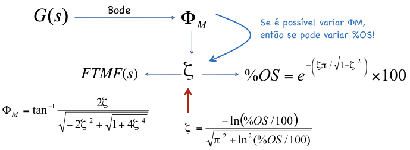
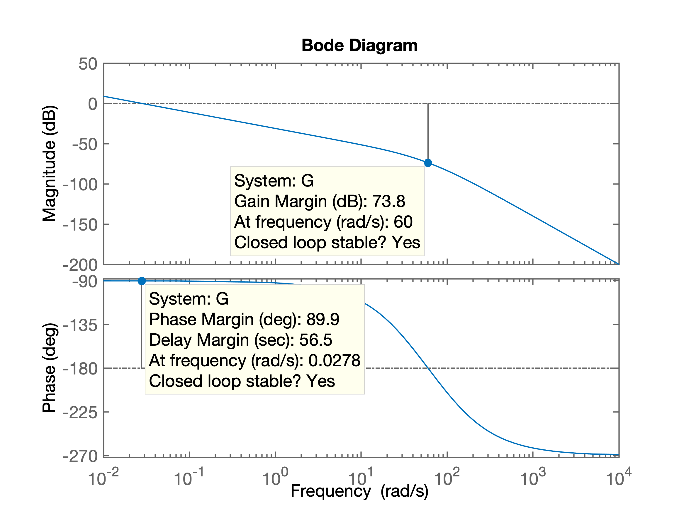

# Projeto de Controladores usando técnica de Resposta em Frequencia

##  Projeto de Controlador Proporcional

> Usando técnica de resposta em frequencia (Diagrama de Bode).

> Material recomendado: `Cap_10_Tecnicas_Resposta_Frecuencia_2a_parte.key` (versão PDF).

Obs.: Este tipo de controlador permite atender no máximo ao $\%OS$ especificado para o sistema em MF. A idéia pode ser resumida na figura:



**Procedimento:**

1. Em função do $\%OS$ desejado, calcular o correspondente fator de amortecimento, $\zeta$:
$$
\zeta=\dfrac{-\ln \left( \%OS/100 \right)}{ \sqrt{ \pi^2 + \ln^2 \left( \%OS/100 \right) } }
$$
no `Matlab`:

```matlab
>> OS=10;	% exemplo
>> zeta=(-log(OS/100))/(sqrt(pi^2+(log(OS/100)^2)))
zeta =
    0.5912
>> 
```

2. Tendo o valor de $\zeta$, calcular a margem de fase requerida, $\Phi_m$ (ou `Pm`):
$$
\Phi_M = \tan^{-1} \dfrac{ 2 \zeta}{ \sqrt{ -2 \zeta^2 + \sqrt{ 1 + 4 \zeta^4} } }
$$
ou no `Matlab`:

```matlab
>> Pm=atan2(2*zeta, sqrt(-2*zeta^2 + sqrt( 1+4*zeta^4) ) )
Pm =
    1.0226
>> % Resposta em radianos!
>> Pm_deg=Pm*180/pi		% convertendo para graus
Pm_deg =
   58.5931
>>
```

3. Identificar do Diagrama de Bode do sistema, a frequencia $\omega_{\Phi_M}$ na qual, a margem de fase, $\Phi_M$ seria igual à requerida.

4. Modificar o ganho do sitema (ajustar o valor de $K$ do ccontrolador proporcional) de forma à que o ponto na qual a frequencia $\omega_{\Phi_M}$ se transforme na margem de fase requerida para este sistema. Para tanto, neste ponto (frequencia = $\omega_{\Phi_M}$), o ganho final do sistema em MF (considerando o ganho $K$) deve ser igual à 1 (ou 0 dB).

**Exemplo:** Seja uma planta caracterizada pela função transferência:
$$
G(s)=\dfrac{100}{s(s+36)(s+100)}
$$

Suponha que se se deseja fechar a malha com controlador proporcional, garantido sobresinal maximo de 10%.

Note que este sistema em especial é do tipo 1 (possui 1 integrador: pólo na origem em $s=0$). Neste caso, o erro em regime permanente deste sistema, em malha fechada, para entrada degrau, sempre será nulo.

Continuando...

Entrando com dados no `Matlab` e levantando Diagrama de Bode deste sistema:

```matlab
>> G=tf(100,poly([0 -36 -100]));
>> zpk(G)	% verificando introdução correta dos dados

ans =
 
        100
  ----------------
  s (s+100) (s+36)
 
Continuous-time zero/pole/gain model.

>> bode(G)
>> 
```

O que rende o gráfico (Diagrama de Bode):



Podemos "coletar" os dados das margens de ganho e da fase usando a função `margin(.)` do `Matlab`, que neste caso rende:

```matlab
>> margin(G)
>>
```

Que gera um Diagrama de Bode ligeiramente modificado como o mostrado abaixo:


Mas no nosso caso, necessitamos descobrir em que frequencia ocorre a margem de fase requerida para o nosso sistema. Vamos supor que $\%OS \le 10\%$, portanto, dos exemplos anteriores temos que é necessário uma margem de fase de: $\Phi_M=58,5931^o$. Temos que buscar no Diagrama de Bode, em que frequencia ocorre este $\Phi_M$:

```matlab
>> 180-Pm_deg	% descobrindo freq da margem da fase requerida
ans =
  121.4069
```

Buscamos no Diagrama de Bode, a frequencia onde o diagrama de Bode, parte da Fase, passe por $121.4069^o$:


Notamos que a função `bode(.)` do `Matlab` varia a frequencia usando um passo determinado pelo seu algoritmo interno. Isto significa que não temos como descobrir com precisão a frequencia na qual o diagrama de fase está passando pelos $121,4069^o$. O que podemos perceber pelo gráfico é que esta frequencia está dentro do intervalo: $13,7 < \omega_{\Phi M} < 16$ (rad/s). 

Supondo que esta frequencia seja: $\omega_{\Phi M}=15$ (rad/s), encontramos que o ganho atual do sistema (sem considerar ainda o ganho $K$) é de -55,5 dB - ver figura à seguir.


Ocorre que para este ponto se transformar na nova margem da fase requerida para o sistema, o ganho final do sistema (em MF) deveria ser 1 (ou 0 dB), portanto, temos que "subir" (acrescentar) o ganho do sistema em 55,5 dB, ou:

$$
G|_{dB} = 20 \cdot \log_{10} G \quad \therefore \quad G = 10^{ \frac{G|_{dB}}{20}}
$$

No `matlab`:

```matlab
>> Gain=10^(-55.5/20)	% Notar que a variável G já foi usada
Gain =
    0.0017
>> 20*log10(Gain)	% confirmando/verificando valor em dB
ans =
  -55.5000
>> % ganho negativo significa que necessitamos acrescentar ganho
>> K=1/Gain
K =
  595.6621
>> % ou em dB, resulta:
>> 20*log10(K)
ans =
   55.5000
>> % o ganho positivo que devemos "acrescentar" ao sistema
```

Fechando a malha com este valor de ganho, teremos:

```matlab
>> ftmf=feedback(K*G, 1);
>> figure; step(ftmf)
```

Que gera a figura:


A próxima figura resume o procedimento adotado:


Todo este procedimento pode ser "automatizado" na forma de um _script_ para o `Matlab`.

Segue código fonte de [_ch11p1\_fer.m_](ch11p1_fer.m):

```matlab
% Nise, N.S. 
% Control Systems Engineering, 3rd ed. 
% John Wiley & Sons, New York, NY, 10158-0012
%
% Control Systems Engineering Toolbox Version 3.0 
% Copyright � 2000 by John Wiley & Sons, Inc.
%
% Chapter 11: Design via Frequency Response
%
% (ch11p1) Example 11.1: We can design via gain adjustment on the Bode plot using 
% MATLAB. You will input the desired percent overshoot from the keyboard. MATLAB 
% will calculate the required phase margin and then search the Bode plot for that 
% phase margin. The magnitude at the phase-margin frequency is the reciprocal of 
% the required gain. MATLAB will then plot a step response for that gain. Let us 
% look at Example 11.1 in the text.
%
% Atualizado por fpassold em 21.10.2019

disp('(ch11p1) Example 11.1 - Controlador Proporcional')       % Display label.

%% ---- Entre com a função transferência da planta no bloco abaixo
%
numg=[100];                         % Define numerator of G(s).
deng=poly([0 -36 -100]);            % Define denominator of G(s).
G=tf(numg,deng)                     % Create and display G(s).

%% Seguem cálculos associados com o projeto
pos=input('Input %OS ?: ');          % Input desired percent overshoot.
z=(-log(pos/100))/(sqrt(pi^2+log(pos/100)^2));
                                    % Calculate required damping ratio.
fprintf('\nRequired damping ratio (zeta): %6.4f\n', z)
Pm=atan(2*z/(sqrt(-2*z^2+sqrt(1+4*z^4))))*(180/pi);
                                    % Calculate required phase margin.
fprintf('Required phase margin, Pm = %7.4f\n', Pm)

%% Criando vetores associados com Diagrama de Bode
w=0.1:0.01:100;                     % Set range of frequency from 0.01 to 
                                    % 1000 in steps of 0.01.
[Mag,P]=bode(numg,deng,w);          % Gets Bode data.

figure;                             % Plot Bode diagram
subplot(2,1,1)
h1 = semilogx(w, 20.*log10(Mag));   % h1: current figure handle
fig1 = gcf; % current figure handle
grid
title('Open Loop Freq. Response')
ylabel('Magnitude (dB)');

%% ajustando propriedades da figura
set(h1,'LineWidth', 2);
ax = gca; % current axes
ax.FontSize = 14;

subplot(2,1,2)                  % Diagrama de fase
h2 = semilogx(w, P);
grid
ylabel('Phase (deg)')
xlabel('Frequency (rad/sec)')

%% ajustando propriedades da figura
set(h2,'LineWidth', 2);
ax = gca; % current axes
ax.FontSize = 14;
escY=min(P);

Ph=-180+Pm;                         % Calculate required phase angle.
fprintf('Required phase angle: %7.2f^o\n', Ph)
u=length(P);
for k=1:1:u;                        % Search Bode data for required phase
                                    % angle.
  if P(k)-Ph<=0;                    % If required phase angle is found,
                                    % find the value of 
    M=Mag(k);                       % magnitude at the same frequency.
    fprintf('Found Pm at w = %5.2f (rad/s)\n', w(k))
    fprintf('with magnitude = %5.2f dB (%5.2g)\n', 20*log10(M), M)
    new_K=1/M;                      % Calculate the required gain.
    subplot(2,1,2)
    hold on
    % Marca no diagrama o ponto onde ocorre a Margem de Fase, Pm
    semilogx([w(1) w(u)], [-180 -180], 'k-.', 'LineWidth', 2)   % linha guia -180o
    semilogx([w(k) w(k)], [-180 Ph], 'm-', 'LineWidth', 6)     % mostra Pm
    aux=[num2str(Pm,'%4.1f') '^o'];
    aux2=-180+Pm/2;
    text((w(k)), aux2, aux, 'FontSize',14)    
    
    semilogx([w(k) w(k)], [Ph  0], 'm--', 'LineWidth', 2)
    semilogx([w(1) w(u)], [P(k) P(k)], 'm--', 'LineWidth', 2)
    aux=[num2str(w(k),'%3.2f') ' rad/s'];
    text((w(k)),0 , aux, 'FontSize',14)
    subplot(2,1,1)
    hold on
    % Marca no diagrama do ganho, os pontos que correspondem à Pm
    semilogx([w(k) w(k)], [0 20.*log10(Mag(k))], 'm-', 'LineWidth',6)  % Mostra altura ajuste do ganho
    semilogx([w(k) w(k)], [20.*log10(Mag(k)) 20.*log10(Mag(u))], 'm--', 'LineWidth',2)
    semilogx([w(1) w(u)], [20.*log10(Mag(k)) 20.*log10(Mag(k))], 'm--', 'LineWidth',2)
    aux=[num2str(-20*log10(M),'%5.2f') ' dB'];
    aux2=20.*log10(Mag(k))/2;
    text((w(k)), aux2, aux , 'FontSize',14)
    break                           % Stop the loop.
  end                               % End if.
end                                 % End for.

fprintf('Then, required K = %6.2f\n', new_K)
k_final=new_K;
fprintf('Then, final required K = %6.2f\n', k_final)
T=feedback(k_final*G,1);                  % Find T(s) using the calculated K.
figure; step(T);                          % Generate a step response.
title(['Closed-Loop Step Response for K= ',num2str(k_final)]) % Add title to step response.
ax = gca; % current axes
ax.FontSize = 14;

%% verificando diagrama de Bode compensado
adjusted_g=k_final*G;
figure; bode(G,adjusted_g)
hold on;    % sobrepondo dados de margens
margin(adjusted_g)
``` 

O _script_ `ch11p1_fer.m` automatiza o processo, usando a função `[M,P]=bode(G,w)` para estocar valores de ganho e fase do diagrama de Bode para este sistema, $G$, nos vetores $M$ e $P$, em função dos valores de frequencia passados via vetor $w$ (que variou entre $0,01 \le \omega \le 1000$ rad/s, com passo de 0,01 rad/s). Então se calcula o ângulo de fase pelo qual deve passar a planta para alcançarmos a margem de fase desejada, na linha: `Ph = -180+Pm`, onde `Pm` corresponde à margem de fase desejada, ou $\Phi_M$. Depois, um laço `for` percorre os valores do vetor de fase `P` buscando a frequencia onde teríamos a marge da fase caso o ganho do sistema fosse igual à 1 ou 0 dB, via teste: `if P(k)-Ph <= 0`. Quando este ponto é encontrado, o valor do ganho é estocado na variável `M` e a compensação de ganho requerrida é calculada na variável `K`, `K=1/M`. Notar que tanto o vetor `M` quanto a variável `M` guardam valores de ganho absolutos e não na escala de dB. A declaração `break` dentro do `if` anterior, "quebra" o laço `for` que varria as frequencias. O restante são cálculos fechando a malha e realizando o teste.

Note que a função transferência desta planta incluia um **integrador**. Isto significa que o procedimento para projeto de **Controlador com Ação Integrativa Pura** segue o mesmo procedimento já mostrado anteriormente.


---
[BigKlit - Liar](https://soundcloud.com/wisam-nasser-808779615/bigklit-liar-lyrics-mp3_70k)

