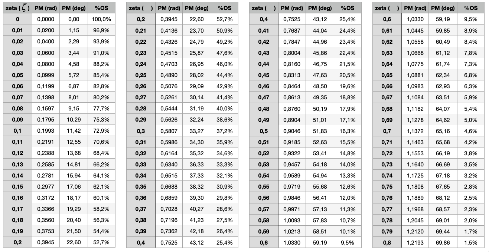
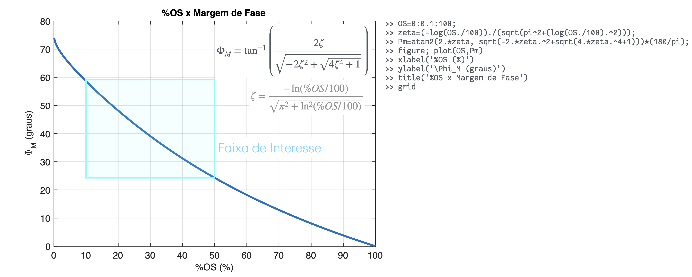
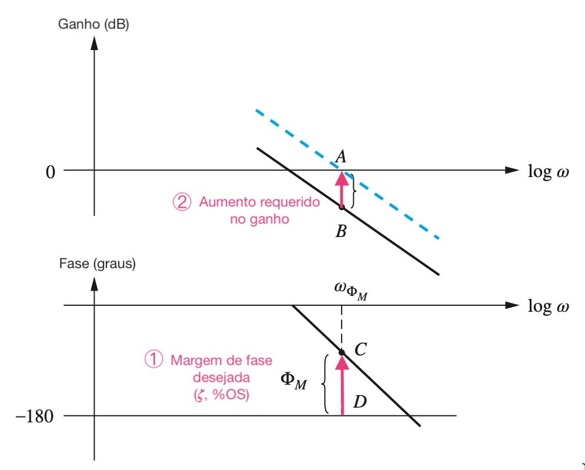
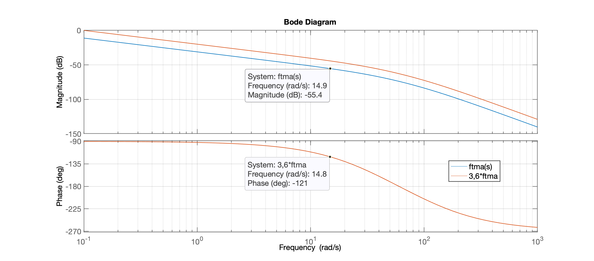
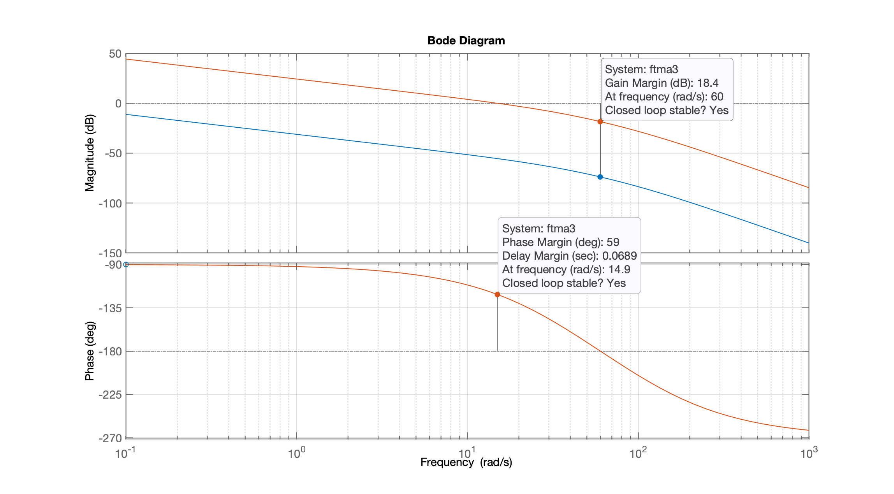
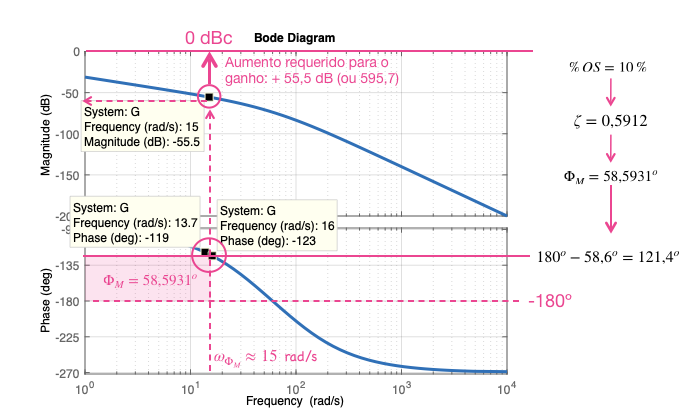
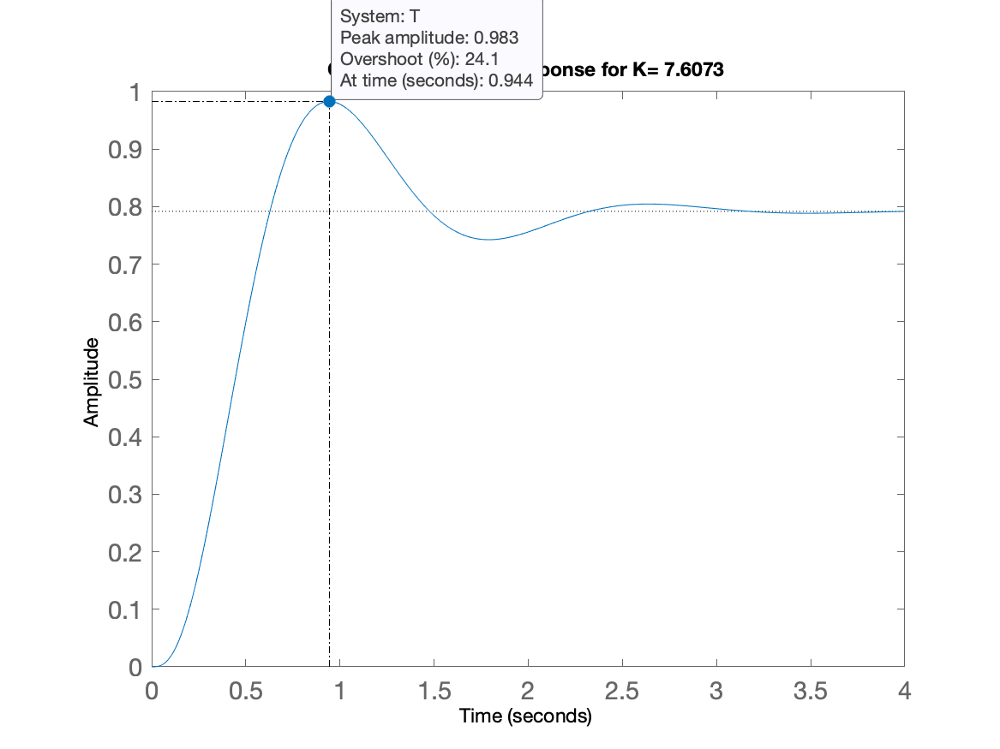
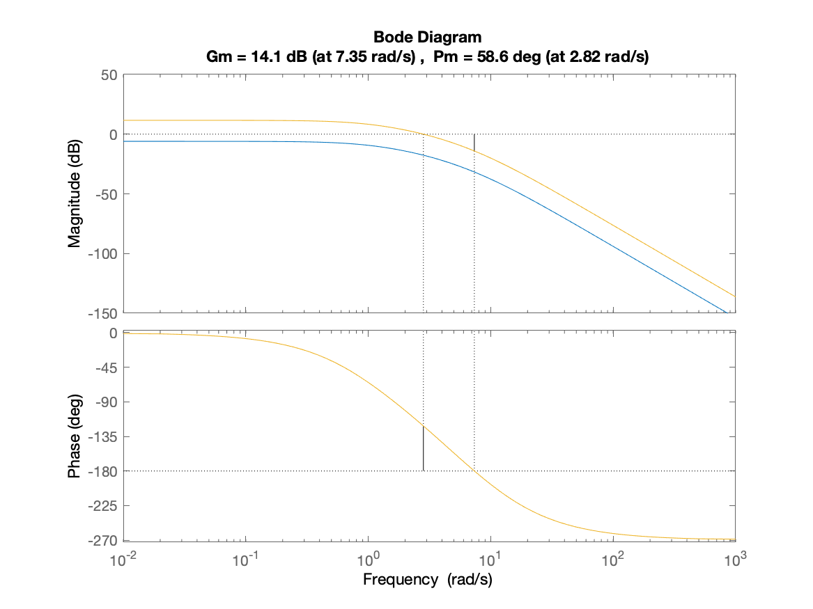

# Projeto de Controladores usando técnica de Resposta em Frequencia

[toc]


## Intro

Material teórico:

* Parte 1: [Revisão Diagramas de Bode + Conceitos Área Controle](https://fpassold.github.io/Controle_2/10_bode/Cap_10_Tecnicas_Resposta_Frecuencia_parte_1-ptbr.pdf);
* Parte 2: [Ajuste de Ganho usando Resposta em Frequência](https://fpassold.github.io/Controle_2/10_bode/Cap_10_Tecnicas_Resposta_Frecuencia_2a_parte.pdf).

##  Projeto de Controlador Proporcional (ou Ajuste de Ganho)

Este tipo de controlador permite atender no máximo ao $\%OS$ especificado para o sistema em MF. A idéia pode ser resumida na figura:


### Tabelas $\zeta \times \Phi_m \times \%OS$

Segue tabelas relacionando $\zeta \times \Phi_m \times \%OS$:



### Gráficos $\%OS \times \zeta$ e $\%OS \times \Phi_M$

Alguns gráficos como referência de valores:





### Procedimento geral

1. Em função do $\%OS$ desejado, calcular o correspondente fator de amortecimento, $\zeta$:
$$
\zeta=\dfrac{-\ln \left( \%OS/100 \right)}{ \sqrt{ \pi^2 + \ln^2 \left( \%OS/100 \right) } }
$$
No `Matlab`:

```matlab
>> OS=10;	% exemplo
>> zeta=(-log(OS/100))/(sqrt(pi^2+(log(OS/100)^2)))
zeta =
    0.5912
```

2. Tendo o valor de $\zeta$, calcular a margem de fase requerida, $\Phi_m$ (ou `Pm`):
$$
\Phi_M = \tan^{-1} \dfrac{ 2 \zeta}{ \sqrt{ -2 \zeta^2 + \sqrt{ 1 + 4 \zeta^4} } }
$$
No `Matlab`:

```matlab
>> Pm=atan2(2*zeta, sqrt(-2*zeta^2 + sqrt( 1+4*zeta^4) ) )
Pm =
    1.0226
>> % Resposta em radianos!
>> Pm_deg=Pm*180/pi		% convertendo para graus
Pm_deg =
   58.5931
```

3. Identificar no Diagrama de Bode do sistema, a frequencia $\omega_{\Phi_M}$ na qual ocorreria a margem de fase desejada, $\Phi_M$. Eventualmente fica mais fácil descobrir $\omega_{\Phi_m}$ no Diagrama de Fase após realizar o cálculo: $\theta=180^o-\Phi_m$, onde $\theta$ corresponde aos ângulos assumidos por $\angle{FTMA(j\omega)}$. Note que você deve realizar algo como:

   

4. Modificar o ganho do sitema (ajustar o valor de $K$ do ccontrolador proporcional) de forma à que o ponto na qual a frequencia $\omega_{\Phi_M}$ se transforme na margem de fase requerida para este sistema. Para tanto, neste ponto (frequencia = $\omega_{\Phi_M}$), o ganho final do sistema em MF (considerando o ganho $K$) deve ser igual à 1 (ou 0 dB).


## Exemplo 1: Exemplo 11.1 de NISE

Seja uma planta caracterizada pela função transferência (baseado no **exemplo 11.1**, de [**NISE**, Norman S., **Control Systems Engineering**, 7th Edition, Wiley & Sons, 2024](https://bcs.wiley.com/he-bcs/Books?action=index&itemId=1118170512&bcsId=9295). pág 616), para este sistema, encontrar $K$ para obter $\%OS=9,5\%$ para entrada degrau:


$$
FTMA(s)=K \cdot \left[ \dfrac{100}{s(s+36)(s+100)} \right]
$$

Note que este sistema em especial é do tipo 1 (possui 1 integrador: pólo na origem em $s=0$). Neste caso, o erro em regime permanente deste sistema, em malha fechada, para entrada degrau, sempre será nulo.

Continuando...

Entrando com dados no `Matlab` e levantando Diagrama de Bode deste sistema:

```matlab
>> G=tf(100,poly([0 -36 -100]));
>> zpk(G)	% verificando introdução correta dos dados

ans =
 
        100
  ----------------
  s (s+100) (s+36)
 
Continuous-time zero/pole/gain model.

>> bode(G)
```

O que rende o gráfico (Diagrama de Bode):


**Obs.:** Se eventualmente o Matlab não iníciar o diagrama de fase para frequêcias abaixo de $10^0$ (1 rad/s), usar o comando: `bode(G, {0.01, 10000})` para forçar diagramas de magnitude e fase na faixa de $\omega=[0.01, \quad 1000]$ (rad/s).

Também podemos usar a função `margin(.)` do `Matlab`:

```matlab
>> margin(G)
```

que gera um Diagrama de Bode ligeiramente modificado como o mostrado abaixo:


Porém note que tomar conhecimento das margens de ganho e de fase do sistema original, não importa para a sintonia do controlador Proporcional. Estas informações permanecem apenas como "curiosidades".

**Mas...** o digrama de Bode nos interessa.

NISE preferiu "fixar" ganho unitário ($|FTMA(j\omega)|=1$ ou 0 dB) na frequência $\omega=$ 0,1 rad/s,  fazendo o $K=3,6$. Note o resultado obtido nas próximas figuras:



NISE percebeu que na frequência de $\omega=0,1$ rad/s, o ganho original do sistema, $|FTMA(j\omega)|$ era de $-11,1$ dB (você pode confirmar isto, criando um "DataTip" no Diagrama de Magnitude no ponto  $\omega=0,1$ rad/s). Note que NISE aumentou o ganho de forma a fazer o Diagrama de Magnitude passar por 0 dB na frequência $\omega=0,1$ rad/s. Note que aumentar o ganho de 11,1 dB equivale à: 

$|FTMA(j\omega)|\vert_{dB}=20 \log_{10}(|FTMA(j\omega)|)$, 

ou ao valor absoluto: 

$|FTMA(j\omega)|=10^{11,1/20} \cong 3,6$:

Note que ao fazer $K=3,6$, o gráfico da magnitude cruza o ganho unitário (ou de 0 dB) em $\omega=0,1$ rad/s, e então até podemos confirmar que a margem de fase, $\Phi_M \cong 90^o$. Acompanhe pela figura anterior onde foram usados os comandos:

```matlab
>> 11.1/20
ans =
        0.555
>> 10^ans
ans =
       3.5892	% valor do ganho necessário (valor adimensional)
>> % Testando:
>> 20*log10(3.6)
ans =
       11.126	% valor do ganho em dB
>> % Traçados de Diagramas de Bode
>> ftma = tf(100, poly([0 -36 -100]));
>> ftma2= ftma*3.6;
>> figure; bode(ftma, ftma2, {0.1, 1000})
>> legend('ftma(s)', '3,6*ftma')
>> grid
```

Voltando ao projeto...

No caso deste projeto é desejando $\%OS=9,5\%$. Isto Implica na seguinte margem de fase desejada, `Pm`:

```Matlab
>> OS=9.5; % overshoot de 9,5%
>> zeta=(-log(OS/100))/(sqrt(pi^2+(log(OS/100)^2)))
zeta =
      0.59962
>> Pm=atan(2*zeta/ (sqrt(-2*zeta^2+sqrt(1+4*zeta^4))))*(180/pi)
Pm =
       59.162
```

⚠️ **Obs.:** Note que a eq. original para cálculo da margem de fase em função de $\zeta$ resulta num ângulo em rad/s. Na expressão acima para cálculo de `Pm` foi acrescentando o termo `*(180/pi)` para transformar rad/s para graus!

Agora para forçar que a margem de fase seja de $59,162^o$ necessitamos fazer com que o gráfico de magnitude passe por 0 dB na frequência angular ($\omega$) na qual o Diagrama de fase passa por: $(180^o-59,162^o)=120,84^o$, ou:

```matlab
>> 180-Pm
ans =
       120.84
```

Buscamos no Diagrama de Bode, a frequencia onde o diagrama de Bode, parte da Fase, passe por $\cong 120^o$:

<!-- -->


O diagrama de fase passa por $\cong 120^o$ na frequência $\omega \cong 15$ rad/s. Nesta mesma frequência, o diagrama de magitude passa pelo valor de ganho de $-55,4$ dB. Para esta frequência corresponder ao ponto onde deveria ocorrer a Margem de Fase, o Diagrama de Ganho deveria passar por 0 dB (ganho unitário), o que significa que para este caso, necessitamos aplicar um ganho (o "$K$") de $+55,4$ dB, ou em termos de ganho absoluto:
$$
G|_{dB} = 20 \cdot \log_{10} G \quad \therefore \quad G = 10^{ \frac{G|_{dB}}{20}}
$$

```matlab
>> 55.4/20
ans =
         2.77
>> K=10^ans
K =
       588.84
>> 20*log10(K)	% verificando
ans =
         55.4
```

Fechando a malha com este valor de ganho, teremos:

```matlab
>> ftmf=feedback(K*G, 1);
>> figure; step(ftmf)
```

Que gera a figura:

<!--  -->


Notamos que o $\%OS$ ficou abaixo dos 9,5% desejados. Mas temos que lembrar que as equações que definem (estimam), $\%OS$, $\zeta$ e $\Phi_M$ foram desenvolvidas para sistemas que em MF resultam em sistemas de 2a-ordem com apenas 2 pólos complexos conjugados. Neste caso, temos um sistema de 3a-ordem:

```matlab
zpk(ftmf)

ans =
 
               58884
  --------------------------------
  (s+107.6) (s^2 + 28.36s + 547.1)
 
Continuous-time zero/pole/gain model.
```

A título de curiosidade, repare o que acontece com o Diagrama de Bode quando consideramos o ganho $K=588,84$:

```matlab
>> ftma3=ftma*K
ftma3 =
 
         5.888e04
  ----------------------
  s^3 + 136 s^2 + 3600 s
 
Continuous-time transfer function.

>> figure; bode(ftma, ftma3, {0.1, 1000})
>> grid
```

E temos o gráfico:



A curva em azul se refere ao Diagrama de Bode do sistema original (com $K=1$) e a curva alaranjada se refere ao sistema adotando o ganho de $K=588,84$.

### Resumo

Segue **resumo** do procedimento adotado:




Note que a função transferência desta planta incluia um **integrador**. Isto significa que o procedimento para projeto de **Controlador com Ação Integrativa Pura** segue o mesmo procedimento já mostrado anteriormente. ⚠️


### Automatizando o cálculo usando *script* `ch11p1_fer.m`

Todo este procedimento foi "automatizado" por NISE na forma de um _script_ para o `Matlab`.

Segue código fonte de [`ch11p1_fer.m`](ch11p1_fer.m) (modificado para incluir gráficos mostrando o procedimento).

```matlab
% Nise, N.S. 
% Control Systems Engineering, 3rd ed. 
% John Wiley & Sons, New York, NY, 10158-0012
%
% Control Systems Engineering Toolbox Version 3.0 
% Copyright � 2000 by John Wiley & Sons, Inc.
%
% Chapter 11: Design via Frequency Response
%
% (ch11p1) Example 11.1: We can design via gain adjustment on the Bode plot using 
% MATLAB. You will input the desired percent overshoot from the keyboard. MATLAB 
% will calculate the required phase margin and then search the Bode plot for that 
% phase margin. The magnitude at the phase-margin frequency is the reciprocal of 
% the required gain. MATLAB will then plot a step response for that gain. Let us 
% look at Example 11.1 in the text.
%
% Atualizado por fpassold em 21.10.2019

disp('(ch11p1) Example 11.1 - Controlador Proporcional')       % Display label.

%% ---- Entre com a função transferência da planta no bloco abaixo
%
numg=[100];                         % Define numerator of G(s).
deng=poly([0 -36 -100]);            % Define denominator of G(s).
G=tf(numg,deng)                     % Create and display G(s).

%% Seguem cálculos associados com o projeto
pos=input('Input %OS ?: ');          % Input desired percent overshoot.
z=(-log(pos/100))/(sqrt(pi^2+log(pos/100)^2));
                                    % Calculate required damping ratio.
fprintf('\nRequired damping ratio (zeta): %6.4f\n', z)
Pm=atan(2*z/(sqrt(-2*z^2+sqrt(1+4*z^4))))*(180/pi);
                                    % Calculate required phase margin.
fprintf('Required phase margin, Pm = %7.4f\n', Pm)

%% Criando vetores associados com Diagrama de Bode
w=0.1:0.01:100;                     % Set range of frequency from 0.01 to 
                                    % 1000 in steps of 0.01.
[Mag,P]=bode(numg,deng,w);          % Gets Bode data.

figure;                             % Plot Bode diagram
subplot(2,1,1)
h1 = semilogx(w, 20.*log10(Mag));   % h1: current figure handle
fig1 = gcf; % current figure handle
grid
title('Open Loop Freq. Response')
ylabel('Magnitude (dB)');

%% ajustando propriedades da figura
set(h1,'LineWidth', 2);
ax = gca; % current axes
ax.FontSize = 14;

subplot(2,1,2)                  % Diagrama de fase
h2 = semilogx(w, P);
grid
ylabel('Phase (deg)')
xlabel('Frequency (rad/sec)')

%% ajustando propriedades da figura
set(h2,'LineWidth', 2);
ax = gca; % current axes
ax.FontSize = 14;
escY=min(P);

Ph=-180+Pm;                         % Calculate required phase angle.
fprintf('Required phase angle: %7.2f^o\n', Ph)
u=length(P);
for k=1:1:u;                        % Search Bode data for required phase
                                    % angle.
  if P(k)-Ph<=0;                    % If required phase angle is found,
                                    % find the value of 
    M=Mag(k);                       % magnitude at the same frequency.
    fprintf('Found Pm at w = %5.2f (rad/s)\n', w(k))
    fprintf('with magnitude = %5.2f dB (%5.2g)\n', 20*log10(M), M)
    new_K=1/M;                      % Calculate the required gain.
    subplot(2,1,2)
    hold on
    % Marca no diagrama o ponto onde ocorre a Margem de Fase, Pm
    semilogx([w(1) w(u)], [-180 -180], 'k-.', 'LineWidth', 2)   % linha guia -180o
    semilogx([w(k) w(k)], [-180 Ph], 'm-', 'LineWidth', 6)     % mostra Pm
    aux=[num2str(Pm,'%4.1f') '^o'];
    aux2=-180+Pm/2;
    text((w(k)), aux2, aux, 'FontSize',14)    
    
    semilogx([w(k) w(k)], [Ph  0], 'm--', 'LineWidth', 2)
    semilogx([w(1) w(u)], [P(k) P(k)], 'm--', 'LineWidth', 2)
    aux=[num2str(w(k),'%3.2f') ' rad/s'];
    text((w(k)),0 , aux, 'FontSize',14)
    subplot(2,1,1)
    hold on
    % Marca no diagrama do ganho, os pontos que correspondem à Pm
    semilogx([w(k) w(k)], [0 20.*log10(Mag(k))], 'm-', 'LineWidth',6)  % Mostra altura ajuste do ganho
    semilogx([w(k) w(k)], [20.*log10(Mag(k)) 20.*log10(Mag(u))], 'm--', 'LineWidth',2)
    semilogx([w(1) w(u)], [20.*log10(Mag(k)) 20.*log10(Mag(k))], 'm--', 'LineWidth',2)
    aux=[num2str(-20*log10(M),'%5.2f') ' dB'];
    aux2=20.*log10(Mag(k))/2;
    text((w(k)), aux2, aux , 'FontSize',14)
    break                           % Stop the loop.
  end                               % End if.
end                                 % End for.

fprintf('Then, required K = %6.2f\n', new_K)
k_final=new_K;
fprintf('Then, final required K = %6.2f\n', k_final)
T=feedback(k_final*G,1);                  % Find T(s) using the calculated K.
figure; step(T);                          % Generate a step response.
title(['Closed-Loop Step Response for K= ',num2str(k_final)]) % Add title to step response.
ax = gca; % current axes
ax.FontSize = 14;

%% verificando diagrama de Bode compensado
adjusted_g=k_final*G;
figure; bode(G,adjusted_g)
hold on;    % sobrepondo dados de margens
margin(adjusted_g)
```

**Explicação**:

O _script_ `ch11p1_fer.m` automatiza o processo, usando a função `[M,P]=bode(G,w)` para estocar valores de ganho e fase do diagrama de Bode para este sistema, $G$, nos vetores $M$ e $P$, em função dos valores de frequencia passados via vetor $w$ (que variou entre $0,01 \le \omega \le 1000$ rad/s, com passo de 0,01 rad/s). Então se calcula o ângulo de fase pelo qual deve passar a planta para alcançarmos a margem de fase desejada, na linha: `Ph = -180+Pm`, onde `Pm` corresponde à margem de fase desejada, ou $\Phi_M$. Depois, um laço `for` percorre os valores do vetor de fase `P` buscando a frequencia onde teríamos a marge da fase caso o ganho do sistema fosse igual à 1 ou 0 dB, via teste: `if P(k)-Ph <= 0`. Quando este ponto é encontrado, o valor do ganho é estocado na variável `M` e a compensação de ganho requerrida é calculada na variável `K`, `K=1/M`. Notar que tanto o vetor `M` quanto a variável `M` guardam valores de ganho absolutos e não na escala de dB. A declaração `break` dentro do `if` anterior, "quebra" o laço `for` que varria as frequencias. O restante são cálculos fechando a malha e realizando o teste.

**Execução**:

```matlab
ch11p1_fer
(ch11p1) Example 11.1 - Controlador Proporcional

G =
 
           100
  ----------------------
  s^3 + 136 s^2 + 3600 s
 
Continuous-time transfer function.

Input %OS ?: 9.5

Required damping ratio (zeta): 0.5996
Required phase margin, Pm = 59.1621
Required phase angle: -120.84^o
Found Pm at w = 14.84 (rad/s)
with magnitude = -55.33 dB (0.0017)
Then, required K = 584.18
Then, final required K = 584.18

>>
```


## Exemplo 2: Planta do Estudo de Caso

Pode-se usar o *script* [`ch11p1_fer.m`](ch11p1_fer.m) com outro tipo de planta, desde que seus dados sejam ingressados no mesmo. 

A planta neste caso é:

```matlab
>> load planta		% carregado os dados da última aula
>> zpk(G)			% verificando tf da planta

ans =
 
          20
  ------------------
  (s+10) (s+4) (s+1)
 
Continuous-time zero/pole/gain model.
```

As linhas do *script* [`ch11p1_fer.m`](ch11p1_fer.m) devem ser editadas contemplando os dados de outra planta:

```matlab
>> edit ch11p1_fer.m
```

Editar as linhas abaixo:

```matlab
%% ---- Entre com a fun��o transfer�ncia da planta no bloco abaixo
%
% numg=[100];                         % Define numerator of G(s).
numg = 20;
% deng=poly([0 -36 -100]);            % Define denominator of G(s).
deng = poly([-1 -4 -10]);
G=tf(numg,deng);                      % Create and display G(s).
zpk(G)

```

Executando, temos agora:

```matlab
>> ch11p1_fer
(ch11p1) Example 11.1 - Controlador Proporcional

ans =
 
          20
  ------------------
  (s+10) (s+4) (s+1)
 
Continuous-time zero/pole/gain model.

Input %OS ?: 10

Required damping ratio (zeta): 0.5912
Required phase margin, Pm = 58.5931
Required phase angle: -121.41^o
Found Pm at w =  2.82 (rad/s)
with magnitude = -17.62 dB ( 0.13)
Then, required K =   7.61
Then, final required K =   7.61

>>
```

Repare que as seguintes figuras são geradas:

**Figura 1**: Diagrama de Bode inicial mostrando ajustes para alançar Margem de Fase desejada:


**Figura 2**: Resposta ao Degrau unitário para sistema em MF adotando ganho encontrado anteriormente ($+17,62$ dB ou 7,61):



**Figura 3**: Diagramas de Bode original x Sistema Modificado com novo valor de ganho:




---
[🎧](https://soundcloud.com/wisam-nasser-808779615/bigklit-liar-lyrics-mp3_70k)

<font size="2">🌊 [Fernando Passold](https://fpassold.github.io/)[ 📬 ](mailto:fpassold@gmail.com), <script language="JavaScript"><!-- Hide JavaScript...
var LastUpdated = document.lastModified;
document.writeln ("página criada em Jun 06, 2020; atualizada em " + LastUpdated); // End Hiding -->
</script></font>

