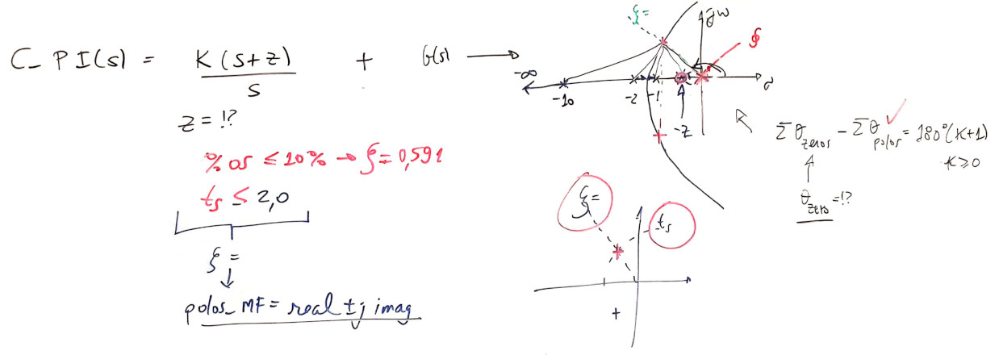
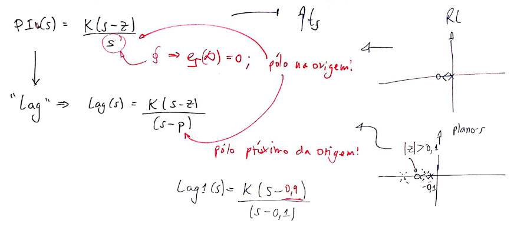

# Projeto de Controladores (Analógicos) com Ação Integral

> Material baseado nas aulas de 16/04/2019, 23/04/19 (contribuição angular para determinação exata do zero do PI), 12/09/2019

Material teórico destas aulas:

- Root\_Locus\_Cap9\_parte2.pdf
- Root\_Locus\_Cap9\_parte3.pdf

Planta adotada como estudo de caso:
$$ C(s)=\dfrac{1}{(s+1)(s+2)(s+10)}$$

Note que é um sistema do tipo 0 (sem integrador).

## Resumo do projeto do Controlador Proporcional

Fechando a malha apenas com controlador proporcional teremos:


Detalhes deste controlador:


Note que o RL deste controlador era:


A figura anterior também resume alguns resultados obtidos, usando o RL.

A próxima figura mostra a resposta ao degrau:


Lembrando que $\%OS<10\%$ (o que resulta no $\zeta=0,5912$):

```matlab
>> OS=10;
>> zeta = (-log(OS/100))/(sqrt(pi^2 + (log(OS/100)^2)))
zeta =    0.5912
>>
```

Usando o `MATLAB` para calcular o erro:

```matlab
>> dcgain(ftmf)
ans =    0.5965
>> erro=(1-dcgain(ftmf))/1*100
erro =   40.3470
>>
```

**Obs.**: O que faz a função `dcgain()`?
> Esta função faz o MATLAB realizar a segiunte operação:
> $y(\infty)=\lim_{s \to 0} \left[ R(s) \cdot FTMF(s) \right]$
> O cálculo deste limite segue as propriedades da transformada de Laplace em relação ao cálculo do valor final (temporal) de uma função.
> $R(s)$ corresponde a transformada de Laplace da referência introduzida no sistema de malha fechada ($FTMF(s)$). No caso da função `dcgain()`, $R(s)=\frac{1}{s}$ que corresponde à entrada degrau (amplitude unitária)
> Desta forma, usar `dcgain(FTMF)` nos permite determinar facilmente $y(\infty)$ para entradas degrau.

Como é a planta é um sistema tipo 0, um simples controlador proporcional não permite anular o erro em regime permanente. A teoria do erro nos diz que é necessário acrescentar no mínimo um integrador na função transferência do sistema, de forma a zerar o erro em regime permanente (e apenas para entrada degrau).

## Resumo do Projeto do Controlador de Ação Integral Pura

A transformada de Laplace para ação integral é simplesmente: $\dfrac{1}{s}$.

Fechando a malha com este controlador teremos:


Detalhes sobre este controlador:


Entrando com dados deste controlador no `MATLAB`:

```matlab
>> C_I=tf(1,[1 0]); % ingressando função de transferência do controlador
>> zpk(C_I) % verificando...
ans =
  1
  -
  s
Continuous-time zero/pole/gain model.

>> ftma_I=C_I*G;   % calculando a FTMA(s)
>> zpk(ftma_I)     % verificando pólos e zeros...
ans =
           1
  --------------------
  s (s+10) (s+2) (s+1)
Continuous-time zero/pole/gain model.
>>
```

RL deste controlador:

```matlab
>> figure;          % força Matlab a abrir outra janela grafica (Figure)
>> rlocus(ftma_I)   % RL da FTMA(s) com este controlador
>> hold on;         % forçando novos gráficos superpostos na Figure atual
>> sgrid(zeta,0)    % plotando linha guia com mesmo zeta (igual %OS=10%)
>> [ K_I, polosMF ] = rlocfind(ftma_I)    % Encontrando o ganho adequado
Select a point in the graphics window

selected_point =  -0.3367 + 0.4794i
K_I =    8.0293

polosMF =
  -9.9888 + 0.0000i
  -2.3358 + 0.0000i
  -0.3377 + 0.4797i
  -0.3377 - 0.4797i

>> % grafico salvo como: step_integrador_puro.jpg
>> % 
```

Resultados gráficos:


ou


A resposta ao degrau para este controlador pode ser encontrada via:

```matlab
>> figure; step(ftmf_I)
```

que gera a figura:


O problema deste controlador é que apesar de termos zerado o erro em regime permanete (note pelo gráfico anterior, que $y(\infty)=1$, igual à amplitude da referência, degrau unitário aplicado na entrada do sistema), a resposta ficou muito lenta ($t_s=10,6$ segundos; o controlador proporcional obteve $t_s=2,82$ segundos).

O `MATLAB` pode ser usado para comparar diretamente o desempenho destes últimos 2 controladores, deixando mais evidente os resultados obtidos através de cada um dos mesmos:

```matlab
>> figure; step(ftmf, ftmf_I)
>> legend('Proporcional', 'Integrador Puro')
```

O que gera a figura:


**Soluções (para baixar $t_s$ e ainda manter $e_{degrau}(\infty)=0$) ?**
- "paralelizar" com a ação integral (pura), com a ação proporcional.

## Projeto de Controlador PI

O controlador PI é então o resultado da ação Proporcional atuando em paralelo com a ação Integral. O diagrama em blocos fica:


Detalhes deste controlador:


Note que: $\dfrac{Ki}{Kp}=$

```matlab
>> K_I     % verificando valor de Ki
K_I =    8.0293
>> Kp      % verificando valor de Kp
Kp =   29.5700
>> K_I/Kp  % calculando posição do zero do PI...
ans =    0.2715
>>
```

Mas rapidamente vamos descobrir que esta posição para o zero do controlador PI pode não ser a "ideal"...

Ingressando com dados deste controlador no `MATLAB`:

```matlab
>> C_PI1=tf(Kp*[1 K_I/Kp], [1 0])  % versão 1 do PI...

C_PI1 =
  29.57 s + 8.029
  ---------------
         s
Continuous-time transfer function.

>> zpk(C_PI1)    % colocando expressão num formato mais conveniente

ans =
  29.57 (s+0.2715)
  ----------------
         s
Continuous-time zero/pole/gain model.

>> % fechando a malha...
>> ftma_PI1=C_PI1*G;
>> zpk(ftma_PI1)      % verificando pólos e zeros da nova FTMA(s)

ans =
    29.57 (s+0.2715)
  --------------------
  s (s+10) (s+2) (s+1)

Continuous-time zero/pole/gain model.

>> ftmf_PI1=feedback(ftma_PI1, 1);  % note que C_PI1 já incorpora o ganho do controlador
>> % se quero saber onde estão polos de MF:
>> pole(ftmf_PI1)
ans =
 -10.3674 + 0.0000i
  -1.2254 + 1.6612i
  -1.2254 - 1.6612i
  -0.1818 + 0.0000i
>> % Se quero verificar o RL para este controlador, tenho que "eliminar" o ganho incorporado antes em PI1(s):
>> C_PI1a=tf([1 K_I/Kp],[1 0])

C_PI1a =
  s + 0.2715
  ----------
      s

Continuous-time transfer function.

>> ftma_C_PI1a=C_PI1a*G;
```

RL deste controlador (resumo):


ou:

```matlab
>> figure; rlocus(C_PI1a)    % mostra RL para esta versão do PI
>> hold on; sgrid(zeta,0)    % sobrepondo linha guia para zeta = cte
>> axis([-11 1 -4 4])        % forçando um "zoom" na região de interesse
>> pole(ftmf_PI1)            % pólos de MF do controlador PI sintonizado:

ans =
 -10.3674 + 0.0000i
  -1.2254 + 1.6612i
  -1.2254 - 1.6612i
  -0.1818 + 0.0000i

>> % Podemos sobrepor estes pólos de MF no gráfico do RL anterior:
>> plot(pole(ftmf_PI1),'r+', 'MarkerSize',10, 'LineWidth',3)
```

O que nos permite obter a figura:


Note 3 pólos de MF (ressaltados na figura com o marcador `+` em vermelho (r=red)) muito próximos da origem do plano-s. São os pólos dominantes. Notem que os 3 estão próximos: 2 pólos conjugados complexos que caracterizam a traducional resposta sub-amortecida de um sistema (puro) de 2a-ordem + um pólo real mais próximo da origem do plano-s.

E para comparar a resposta temporal à entrada degrau com os controladores anterior podemos fazer:

```matlab
>> figure; step(ftmf, ftmf_I, ftmf_PI1)
>> legend('Proporcional', 'Integrador Puro', 'PI')
```

Que gera o gráfico:


Note que esta versão do PI responde MAIS lentamente que o próprio integrador puro. **Como "corrigir" este problema?**

**Problema** -- Onde alocar o zero deste controlador?

**Solução**: raciocinando como fica o RL e usando contribuição angular para definir o ponto exato para o zero do PI.

> Lembrando que:
> Um sistema em MF de 2a-ordem no modelo:
>
> $G(s)=\dfrac{\omega_n^2}{s^2+2\zeta\omega_n\;s+\omega_n^2}=\dfrac{b}{s^2+as+b}$
>
> Este sistema terá pólos de MF localizados em:
> $s=\sigma\pm j\omega_d$, ou
>
> $s=\zeta\;\omega_n\;\pm\;j\;\omega_n\;\sqrt{1-\zeta^2}$.
>
> Ou graficamente:
>
> 
>
> onde:
>
> $\sigma = \omega_n \cos{(\alpha)}=\omega_n \zeta \quad \textsf{,}$
>
> $\omega_d = \omega_n \sin{(\alpha)}=\omega_n \sqrt{1-\zeta^2} \quad \textsf{,}$
>
> $\zeta = \cos{(\alpha)} \quad \textsf{e}$
>
> $\sin{(\alpha)} = \sqrt{1-\zeta^2}.$

Note que já temos $\zeta$, mas não temos $\omega_n$. Mas $\omega_n$ pode ser definido se estipularmos um valor desejado para o tempo de tipo, ou tempo de subida ou para o tempo de assentamento.

Para isto também necessitamos definir algum valor desejado para o tempo de resposta. Supondo que queiramos que o sistema entre em regime permanente em menos de 2 segundos ($t_s<2,0$), temos:

Quando $0<\zeta<1$:

$t_s=\dfrac{4}{\zeta \cdot \omega_n} \qquad$(1)

$t_p=\dfrac{\pi}{\omega_n\sqrt{1-\zeta^2}} \qquad$ (2)

$t_r=\dfrac{0,6+2,16\zeta}{\omega_n} \qquad$(3)

No nosso caso ($\zeta=0,5912 \leftarrow \%OS=10\%$; $t_{s_{d}}=2$), e trabalhando com (1), obtemos:

$\omega_n=\dfrac{4}{\zeta \cdot t_s}=3,3832$.

sabemos ainda que: $\omega_d=\omega_n \sqrt{1-\zeta^2}$, então $\omega_d=2,7288$.

E assim: os pólos de MF dominantes e desejados, devem ficar em $s=2,0\pm j2,7288$.

Assim, teremos:



O cálculo dos ângulos fica:


**Obs.:** Lembrar que o `MATLAB' não trabalha com ângulos em graus e sim em radianos.

Continuando:


O que graficamente significa:


ou seja, a equação final do PI fica:

$$
C(s)=K_i \cdot \dfrac{(s-8,3275)}{s}
$$

sobrepondo-se a linha guia do $\zeta$, usando `rlocfind(.)`, encontramos $K_i-21,3835$.

**Problema:** temos um zero instável no próprio controlador, o que torna o sistema em MF, instável. Usando os comandos `feedback()` e depois `step()` vamos confirmar a seguinte resposta:


O que significa esta resposta, se o RL passou no ponto desejado?


**Resposta**: Signfica que há forma de forçar o RL a passar no ponto desejado, mas este ponto, derivado de um $t_s$ muito baixo não é possível de ser adotado para este sistema!

**Solução**: adotar um $t_s$ maior ou "chutar" uma outra posição para o zero do PI.

Normalmente o zero do PI fica localizado próximo do pólo do próprio controlador, ou seja, muito próximo da origem.

Se para o zero do PI for adotado $s=-0,1$ o RL fica:


e obtemos como tempo de resposta: $t_s=3,6$.

**Outras soluções?** "Afastar" o pólo do PI da origem. Mas neste caso, deixamos de ter um PI e obtemos um controlador por atraso de transporte, um simplesmente "Lag".

## Controlador Lag

Afastando o pólo da origem (no caso PI) obtemos um controlador Lag. Seu RL fica:



Note que tanto o pólo quanto o zero do PI se afastam da origem, mas normalmente seu zero ocorre antes do pólo mais lento da planta.

O controlador sugerido neste caso fica:

$$
C(s)=K \cdot \dfrac{(s-0,9)}{(s-0,1)}
$$

Note que "paga-se" um preço pelo uso do Lag:
- consegue-se reduzir o tempo de assentamento em comparação ao controlador PI, mas...;
- o erro não deixa mais de ser nulo em regime permanente.

Esta solução é então adotada nos casos em que um baixo erro é permitido.


-----
### Observações

Durante a criação do `diary` ou durante a edição do arquivo **Markdown** uma forma de controlar o **tamanho das figuras** é incoporar diretamente código `html` no arquivo `.md`. 

Por exemplo:

Antes a inclusão de figuras era feita na forma:

```sh

```

A idéia é substituir esta linha por:

```sh

```

ou (mais explicitamente):

```sh

```

mas normalemten apenas o atributo `width` já permite escalonar a figura de forma conveniente.

Note que o atributo `alt` é opcional (não necessário).

-----

Atualizado em 13/09/2019.