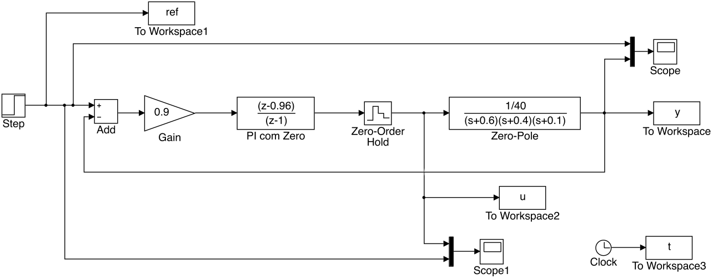
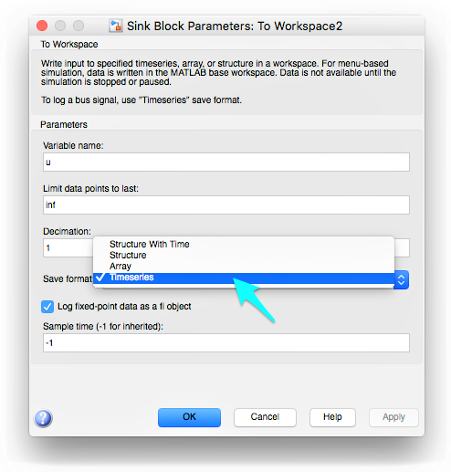
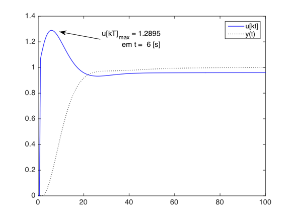
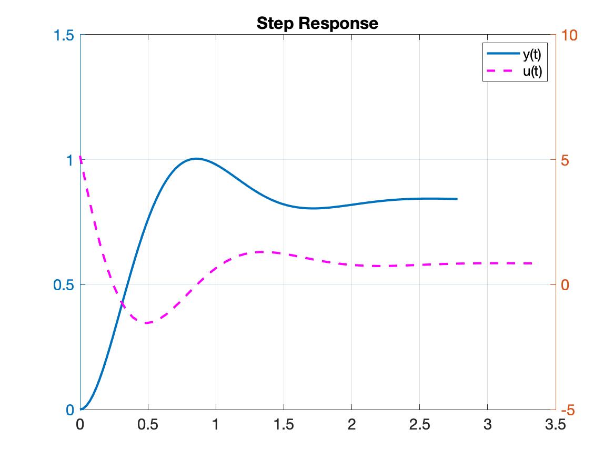
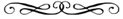

<!-- title: Trabalho Controle II (2023/1) -->

# Trabalho Controle Automático II

Engenharia Elétrica

Semestre 2023/1
Dúvidas: <a href="mailto:fpassold@upf.br?subject=Trabalho Controle 2"> :mailbox: Email professor</a>

## Objetivos

Este trabalho visa avaliar os conhecimentos adquiridos pelos alunos na disciplina de **Controle Automático II**, no que tange o projeto de controladores digitais clássicos usando ferramenta geométrica do lugar das raízes (ou Root-Locus). 

## Procedimento

A turma de estudantes é dividida em equipes de 2 (ou no máximo de 3, neste caso, sob aprovação do professor). Neste semestre em particular, onde 11 estudantes estão matriculados, a turma será dividida da seguinte forma:

* 1 equipe com apenas 3 estudantes;
* 4 equipes formadas por 2 estudantes.

A "inscrição" das equipes, principalmente a com 3 componentes, deverá ser feita via e-mail e será usado como critério confirmador, a data e horário do email.

Cada equipe recebe uma única planta (processo), diferente para cada equipe, cada planta acompanhada de seus requisitos de controle. Cada equipe deve então proceder ao projeto e simulação de diferentes controladores -- um documento final (arquivo PDF) deve ser enviado por email ao professor nas últimas 2 semanas do semestre. Neste caso: o **<font color=blue>dead-line</font>** para entrega deste trabalho fica determinado como sendo o dia: **<font color=blue>21/06/2023</font>** :boom:. Lembrando que no dia 28/06/2023 (último dia de aula) está prevista a aplicação de uma prova final individual e presencial.

:mega: Cada equipe realiza o projeto dos controladores sobre uma única planta (a sua planta), confirmada pelo professor (via email ou página WEB). 

Para cada planta, estão previstos os projetos dos seguintes controladores:

1. Controlador Proporcional (P);
2. Controlador Integrador Puro (I);
3. Controlador PI (Proporcional + Integrativo);
4. Controlador por Atraso de Fase (*Lag*);
5. Controlador PD (Proporcional + Derivativo);
6. Controlador por Avanço de Fase (*Lead*);
7. Controlador por Avanço-Atraso de Fase (*Lead-Lag*);
8. Controlador PID.

## Plantas & Requisitos de Controle

### Planta 1:

Equação:

$$
G_1(s)=\dfrac{7,5}{(s+1)(s+2,5)(s+3)}
$$

| Requisitos de Controle| Valores |
| ---: | :--- |
| Amplitude degrau: | 1,0 |
| Sobressinal máximo desejado, ou $\%OS_d$: | 20% |
| Erro máximo desejado, ou $e(\infty)_d$: | 10% |
| Tempo de assentamento máximo desejado, ou $t_{s_d}$: | 2,7 |
| Sinal máximo de controle, ou $u(t)_{\text{Máx}}$: | 2,0 |
| Sinal mínimo de controle, ou $u(t)_{\text{Min}}$: | 0 |

### Planta 2:

Equação:

$$
G_2(s)=\dfrac{23,8}{(s+1)(s+3,5)(s+6,8)}
$$

| Requisitos de Controle| Valores |
| ---: | :--- |
| Amplitude degrau: | 1,0 |
| Sobressinal máximo desejado, ou $\%OS_d$: | 20% |
| Erro máximo desejado, ou $e(\infty)_d$: | 7,5% |
| Tempo de assentamento máximo desejado, ou $t_{s_d}$: | 1,4 |
| Sinal máximo de controle, ou $u(t)_{\text{Máx}}$: | 2,6 |
| Sinal mínimo de controle, ou $u(t)_{\text{Min}}$: | -2,6 |

### Planta 3:

Equação:

$$
G_3(s)=\dfrac{225}{(s+2,5)(s+6)(s+15)}
$$

| Requisitos de Controle| Valores |
| ---: | :--- |
| Amplitude degrau: | 1,0 |
| Sobressinal máximo desejado, ou $\%OS_d$: | 20% |
| Erro máximo desejado, ou $e(\infty)_d$: | 10% |
| Tempo de assentamento máximo desejado, ou $t_{s_d}$: | 0,9 |
| Sinal máximo de controle, ou $u(t)_{\text{Máx}}$: | 2,5|
| Sinal mínimo de controle, ou $u(t)_{\text{Min}}$: | -2.5 |

### Planta 4:

Equação:

$$
G_4(s)=\dfrac{1000}{(s+1)(s+25)(s+40)}
$$

| Requisitos de Controle| Valores |
| ---: | :--- |
| Amplitude degrau: | 1,0 |
| Sobressinal máximo desejado, ou $\%OS_d$: | 20% |
| Erro máximo desejado, ou $e(\infty)_d$: | 1,5% |
| Tempo de assentamento máximo desejado, ou $t_{s_d}$: | 0,3 |
| Sinal máximo de controle, ou $u(t)_{\text{Máx}}$: | 14,0 |
| Sinal mínimo de controle, ou $u(t)_{\text{Min}}$: | -14,0 |

### Planta 5:

Equação:

$$
G_5(s)=\dfrac{280}{(s+2,5)(s+8)(s+14)}
$$

| Requisitos de Controle| Valores |
| ---: | :--- |
| Amplitude degrau: | 1,0 |
| Sobressinal máximo desejado, ou $\%OS_d$: | 20% |
| Erro máximo desejado, ou $e(\infty)_d$: | 8% |
| Tempo de assentamento máximo desejado, ou $t_{s_d}$: | 0,8 |
| Sinal máximo de controle, ou $u(t)_{\text{Máx}}$: | 2,6 |
| Sinal mínimo de controle, ou $u(t)_{\text{Min}}$: | -2,6 |

### Planta 6:

Equação:

$$
G_6(s)=\dfrac{504}{(s+4,5)(s+8)(s+14)}
$$

| Requisitos de Controle| Valores |
| ---: | :--- |
| Amplitude degrau: | 1,0 |
| Sobressinal máximo desejado, ou $\%OS_d$: | 20% |
| Erro máximo desejado, ou $e(\infty)_d$: | 10% |
| Tempo de assentamento máximo desejado, ou $t_{s_d}$: | 0,7 |
| Sinal máximo de controle, ou $u(t)_{\text{Máx}}$: | 1,6|
| Sinal mínimo de controle, ou $u(t)_{\text{Min}}$: | -1,6|

### Planta 7:

Equação:

$$
G_7(s)=\dfrac{320}{(s+2)(s+8)(s+20)}
$$

| Requisitos de Controle| Valores |
| ---: | :--- |
| Amplitude degrau: | 1,0 |
| Sobressinal máximo desejado, ou $\%OS_d$: | 20% |
| Erro máximo desejado, ou $e(\infty)_d$: | 5% |
| Tempo de assentamento máximo desejado, ou $t_{s_d}$: | 0,75 |
| Sinal máximo de controle, ou $u(t)_{\text{Máx}}$: | 3,5 |
| Sinal mínimo de controle, ou $u(t)_{\text{Min}}$: | -3,5 |

## Apresentação do Trabalho

Um documento PDF dever ser criado retratando os projetos realizados, como se fosse um “Memorial de Projeto”. Deve ser formatado para folha A4, com margens de 2 cm em todas as extremidades e usando fonte de tamanho 10 no corpo do texto. As **páginas devem ser numeradas** e não deve ser usada nenhuma capa. Figuras e tabelas também devem ser numeradas e devidamente referenciadas no texto.

No topo da primeira página deve constar o título deste trabalho, curso de origem, data da entrega, seguido pelos nomes dos integrantes do grupo e seus números de matrícula entre parêntesis (cada estudante, em uma nova linha).

O documento pode ser criado usando um editor de textos compatível com Markdown um num editor de textos comum como Word ou Libre Office, fica a critério dos estudantes. Lembrando que só será aceito a versão PDF.

Excepcionalmente, **se o documento foi gerado a partir de um editor Markdown**, os estudantes podem exportar o documento final num arquivo PDF (`.pdf`), e também a versão HTML (`.html`)  acompanhada de todas as figuras (`.png`); mas neste último caso, os arquivos `.pdf`, `.md`, `.html` e figuras `.jpg` e `.png` devem ser compactados num **único  arquivo zipado** (`.zip`) $\leftarrow$ este deve ser o arquivo enviado neste caso. Porém, sugere-se que antes de ser enviado, que o arquivo compactado seja testado (na pasta de `\Downloads`, por exemplo), para se certificarem que não está faltando nenhum arquivo (principalmente figuras).

No caso de documento sendo gerado a partir de editor Markdown, as figuras podem ser numeradas da seguinte forma (dentro de uma tabela):

```Markdown
|  |
| :--- |
| Fig 1: Exemplo de como incluir figura numerada em Markdown |
```
Gerando um resultado simular ao mostrado na figura 1 abaixo:

|       |
| :--------------------------------------------------------- |
| Fig 1: Exemplo de como incluir figura numerada em Markdown |

:angry: <font color=red>**Obs.:** Entretanto, notar que **não é desejável** que os estudantes apresentem no trabalho, os comandos usados no Matlab realizar os projetos. Ou seja, **não é esperado "copy-&-paste"** dos **comandos** usados no **Matlab** para os projetos e simulações dos diferentes controladores, caso isto ocorra, já fica aqui estipulado um valor máximo para o documento apresentado de 6,0 (de 0 à 10,0 pontos), independente da precisão ou mérito alcançado pelo trabalho.</font> O que não impede que o retorno de um ou outro comando do Matlab seja apresentado, como por exemplo, o resultado de um comando `zpk` ou `rlocfind(.)` ou `stepinfo()` (mas neste caso, tentar suprimir linhas em branco desnecessárias). Apenas se exige que o documento apresentado não seja cópia pura de comandos adotados no Matlab.

### Itens esperados

No documento à ser gerado, são esperadas as seguintes informações:

1. **Identificação da planta**<br />Apresentar (explicitamente) a equação de $G(s)$  (ou do processo à ser controlado)<br />

3. **Requisitos de controle**<br />
Este item deve trazer uma tabela relacionando:

| Requisitos | Valores |
| ---: | :--- |
| Amplitude degrau: | |
| Sobressinal máximo desejado, ou $\%OS_d$: | |
| Erro máximo desejado, ou $e(\infty)_d$: | |
| Tempo de assentamento máximo desejado, ou $t_{s_d}$: | |
| Maior sinal de controle, ou $u(t)_{\text{Máx}}$: | |
| Menor sinal de controle, ou $u(t)_{\text{Min}}$: | |

Após esta parte inicial, segue-se o projeto de cada um dos 8 controladores.

Para cada controlador, deve ser apresentado:

1. (Sub-título:) **Tipo de Controlador**: (*nome*)

2. **Equação do Controlador**<br /> $C(s)=$<br />

3. **Objetivos esperados:**<br />Um pequeno parágrafo (máximo de 5 linhas) que ressalta a(s) principal(is) razão(ões) para incorporação deste controlador num sistema de malha-fechada. Este item ressalta as expectativas quanto aos resultados que podem ser obtidos com adoção de determinado controlador.

4. **Comentários Iniciais:**<br />Neste ponto, devem ser realizados comentários sobre as decisões tomadas quanto à localização de seu zero ou de seu pólo, justificando porque certos valores (localizações) foram arbitradas.

5. **Gráfico do RL** (ou do Diagrama do Lugar das Raízes, *Root Locus*) do sistema incluindo o controlador, ressaltando o ponto adotado para determinação do ganho adotado para o controlador.

6. **Gráfico da resposta do sistema**, $y(t)$,<br /> para um degrau aplicado no sistema em malha-fechada.

7. **Gráfico de $u(t)$**, ou das amplitudes geradas pela ação de controle<br />Deixando claro valores máximos e mínimos assumidos por $u(t)$.

8. Uma pequena tabela ressaltando alguns resultados obtidos como:

| Resultados | Valores |
| ---: | :--- |
| Amplitude degrau: | |
| Sobressinal alcançado, $\%OS$: | |
| Tempo de pico, $t_p$: | |
| Tempo de assentamento, $t_s$: | |
| Regime permanente saída da planta, $y(\infty)$: | |
| Erro de regime permanente, $e(\infty)$: | |
| Maior amplitude do sinal de controle, $u(t)_{\text{Máx}}$: | |
| Menor amplitude do sinal de controle, $u(t)_{\text{min}}$: | |

<!--
**Observação 1**: Caso o controlador tenha desenvolvido amplitudes excessivas para sua ação de controle, nova simulação é esperada, no **Simulink**, incluindo o bloco Saturador, que mostre o comportamento que seria esperado na prática, caso fosse adotado este controlador com os ganhos indicados. Neste ponto, pode ser apresentado, num mesmo gráfico, 2 curvas de resposta do sistema, a primeira mostrando o comportamento do sistema desconsiderando efeitos de saturação e uma segunda curva mostrando como o sistema se comportaria na presença de saturação (comportamento mais próximo do real).
-->

**Observação:**: No caso específico do controlador **PID** sua sintonia pode ser baseada no método de **Ziegler-Nichols**. Neste caso, o ganho máximo (ou *ultimate gain*), $K_u$, pode ser determinado graficamente usando o Root Locus já adotado para o projeto do Controlador Proporcional. Notar que encontrar $K_U$ no Simulink, implica, um digrama de blocos fechando a malha apenas com controlador proporcional. Ou o valor de $K_u$ pode ser determinado analiticamente usando o **método de Routh-Hurwitz** (R-H). Este último caso, garante **10 pontos extras na avaliação final do trabalho** :smile:. De qualquer forma, é esperado que sejam mostrados os valores inicialmente determinados para $K_c$ (ou $K_P$), $K_i$ e $K_d$ para o PID baseado em Ziegler Nichols; uma simulação inicial deste PID é esperada, além de um **ajuste fino** acompanhado dos resultados finais obtidos e apresentação dos valores finais encontrados para $K_c$ (ou $K_P$), $K_i$ e $K_d$.

Se a equipe adotar alguma variação para a tabela de Ziegler-Nichols, favor acompanhar esta tabela seguida de sua referência bibliográfica. Por exemplo [Ziegler–Nichols method (Wikipedia)](https://en.wikipedia.org/wiki/Ziegler–Nichols_method) cita variações para valores propostos por Ziegler-Nichols para sintonia de controladores P, PI e PID.

O projeto de cada controlador deve terminar com “**Comentários Finais**” ressaltando num pequeno parágrafo, os resultados obtidos: se os requisitos de controle foram atendidos e se este controlador permitiria cumprir (ou não) todos os requisitos desejados. Com breve explicação entende-se um parágrafo de no máximo 5 linhas.

A critério da equipe, **comentários extras** referentes ao projeto de controlador são esperados (e **representam pontos adicionais**) :+1:. Estes comentários extras incluem algum texto justificando a localização adotada para o pólo ou zero do controlador (no início de cada projeto de controlador).

Pontos adicionais também são obtidos se ao final da simulação de certo controlador, e acompanhado de uma breve explicação, ou grupo indique **melhorias** que podem ser adotados para certo controlador (novo ajuste de ganho, ou novo ajuste de seu pólo ou zero). Neste caso, desejavelmente acompanhada de nova simulação confirmando uma melhoria nos resultados que podem ser obtidos.

### Itens avaliados

Este trabalho obedece aos seguintes critérios de avaliação:

A tabela 1 mostra a Pontuação Geral associada com o trabalho:

| Item principal | Pontos (%) |
| :---| ---: |
| 1) Controlador Proporcional | 10 |
| 2) Controlador Integrador Puro | 10 |
| 3) Controlador PI (P + I) | 10 |
| 4) Controlador por Atraso de Fase (Lag) | 10 |
| 5) Controlador PD (P + D) | 10 |
| 6) Controlador por Avanço de Fase (ou PD + FPB) | 10 |
| 7) Controlador por Avanço-Atraso de Fase (Lead-Lag) | 10 |
| 8.a) Controlador PID</br>(Usando Ziegler-Nichols/primeira sintonia) | 10 |
| 8.b) PID: Sintonia fina | 10 |
| **Total pontos** | 90</br>(=100%) |

Sendo que a **avaliação por controlador** obedece aos seguintes critérios:

|Item | Pontos (%) |
| ---: | ---: |
| Equação genérica do Controlador | 5 |
| Expectativas para este controlador | 10 |
| Comentários sobre localização de pólos/zeros do Controlador | 10 |
| Gráfico do RL ressaltando $K$ adotado | 10 |
| Equação final do controlador com ganho incluído | 5 |
| Gráfico de $y(t)$ | 10 |
| Informações de $\%OS$, $t_p$, $t_s$, $y(\infty)$, $e(\infty)$ | 5 |
| Gráfico de $u(t)$, com valores máximos e mínimos | 10 |
| Comentários finais: expectativas atendidas? | 5 |
| Sugestões de melhorias? | 10 |
| Nova simulação com melhoria proposta? | 10 |
| **Total pontos**| 90</br>(100%) |

<!--
| Nova simulação se limites de $u(t)$ foram superados? | 10 |
-->

onde: 
$y(t)$ corresponde à resposta em malha-fechada alcançada para determinado controlador;
$u(t)$ corresponde à ação de controle, mostrando as amplitudes desenvolvidas;
$\%OS=$ percentual de overshoot (ou de sobresinal) -- **imporante**: medido em relação á referência (não valor atingindo pela planta):heavy_exclamation_mark:;
$t_p=$ instante do pico; 
$t_s=$ tempo de assentamento; 
$y(\infty)=$ saída da planta em regime permanente; 
$e(\infty)=$ erro de regime permanente.

### Cuidados com figuras e resoluções

Os gráficos incluídos no documento devem obedecer uma resolução mínima de 150 dpi, uma espessura mínima para as curvas e um tamanho mínimo usado para as fontes (fontes presentes nas figuras), de forma a assegurar que as figuras incluídas no documento final resultem legíveis. Para tanto, se recomenda que os estudantes gerem gráficos obedecendo os seguintes parâmetros:

| Parâmetros | Valores recomendados |
| ---: | :--- |
| **Rendering**: | 150 até 300 dpi |
| Scale font by: | auto |
| Scale **font with minimum** of: | 14 points |
| Scale line width width by: | auto |
| Scale **line with minimum** of: | 1.5 points |
| Salvar figuras como: | PNG (Portable Network Graphics) |

Se for necessário incluir **diagramas de blocos** criados no **Simulink**, usar o comando `print -r150 -dpng -s<diagrama> diagrama.png` para exportar o digrama de blocos numa figura `.png`. Por exemplo, para exportar o digrama de nome `planta_PI_teste.slx`, foi adotado o seguinte comando  (na janela de comandos do Matlab):

```Matlab
>> print -r150 -dpng -splanta_PI_teste planta_PI_teste.png
```

O parâmetro `-r150` especifica resolução de 150 dpi, o parâmetro `-dpng` especifica geração de  arquivo gráfico no padrão PNG, o parâmetro `-s` é o que indica ao Matlab que a “impressão” deve ser realizada a partir de um diagrama de blocos gerado no Simulink.

O Comando citado anteriormente gerou a figura:



E para transformar em figuras os gráficos obtidos a partir de **blocos “Scope”**, sugere-se incluir blocos “**To workspace**” no Simulink para variáveis do tipo “**timeseries**” (padrão nas versões mais recentes do Matlab). Ver próxima figura: 



Suponha ainda que num certo diagrama de blocos, a resposta (saída) de um sistema tenha sido exportada para a variável `y` e o sinal de controle tenha sido exportado para a variável `u`;  para obter um gráfico similar ao gerado por um bloco Scope monitorando esta saída, usar o comando (na linha de comandos do Maltab):

```Matlab
>> plot(u.time, u.data, 'b-', y.time, y.data, 'k:')
```

Onde a opção `b` apenas indica a cor azul (*blue*) para a curva, e o caracter `-` indica traço contínuo. Em caso de dúvidas sobre o uso da função `plot()` no Matlab, usar o comando: `>> help plot`.



Existe ainda a função gráfica `plotyy(.)` capaz de mostrar num mesmo gráfico, 2 curvas diferentes que trabalham com escalas diferentes. Esta função poderia ser usada para combinar num único gráfico, a resposta temporal do sistema, $y(t)$ e as amplitudes desenvolvidas pela ação de controle, $u(t)$. Por exemplo:

```Matlab
>> [y, t]=step(ftmf_PD);     % guarda dados nos vetores y e t mas não mostra gráfico
>> [u,t2]=impulse(aux2);     % guarda u (ação de controle) e t2 para um PD, 
>>                           % gráfico não é mostrado na tela
>> plotyy(t,y, t2,u);
>> legend('y(t)', 'u(t)')
>> grid
>> set(AX,'FontSize', 14)    % aumenta fonte dos axis
>> set(H1,'LineWidth', 2)    % aumenta espessura da linha da primeira curva, y(t)
>> set(H2,'LineStyle', '–')  % modifica estilo do traço da primeira curva
>> set(H2,'LineWidth', 2)    % aumenta espessura da linha da segunda curva, u(t)
>> set(H2,'Color', 'm')      % modifica cor da segunda curva, para magenta
>> title('Step Response')
```

onde: `t`  e  `y` são variáveis (vetores) relacionados com o tempo e amplitude de saída da planta respectivamente; `t2` e `u2` são variáveis (vetores) relacionados com o tempo e amplitude da ação de controle (respectivamente). Note que as dimensões dos vetores `t` e `t2` não são obrigadas a coincidir.

A sequência de comandos anterior gera o gráfico mostrado a seguir:

 

## Entrega do trabalho

:running: O trabalho (um único arquivo PDF ou ZIP) deve ser enviado por <a href="mailto:fpassold@upf.br?subject=Trabalho Controle 2"> :mailbox: fpassold@upf.br</a> até o dia **<font color=blue>21/06/2023</font>** :boom:. Uma cópia por equipe.


:coffee: Calendário final:

```text
     Junho 2023       
Do Se Te Qu Qu Se Sá  
             1  2  3  
 4  5  6  7  8  9 10  
11 12 13 14 15 16 17  
18 19 20 21 22 23 24  <-- 21/06 = data entrega trabalho
25 26 27 28 29 30     <-- 28/06 = prova final
```

---

<center>Fim</center>



