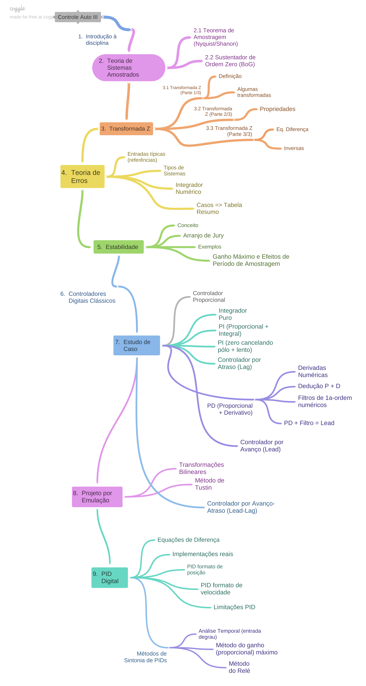

<!--title: Sequencia aulas Controle 3 -->

# Sequencia Prevista para Aulas de Controle Automático III

## 1a-Parte:

1) Introdução à Disciplina
   Material introdutório da disciplina. Organização da Disciplina.

2) Teoria de Sistemas Amostrados
   Material sobre o processo de digitalização de um sinal. Modelagem de um sinal amostrado (digitalizado). Teoria de Amostragem. Necessidade de filtros passa-baixa analógicos antes e após a digitalização. Efeitos de sub-amostragem (aliasing).

   * Sustentador de Ordem Zero ($BoG(z)$).
    Modelagem do sustentador de ordem zero. Como incorporar/deduzir BoG(z).

3) Transformada-Z
   * Definição, Limitações, transformadas-Z de sinais limitados no tempo
   * Transformadas Z da função Impulso, função Degrau (revisão de PG), de função Exponencial (convergente ou divergente). Respostas de alguns sinais no padrão $x^k$. 
   * Transformada Z de uma Senóide, de uma Senóide Amortecida.
   * Propriedades da Transformada Z:
    Linearidade, Avanço no tempo, atraso no tempo, translação complexa, convolução, teorema do valor inicial, teorema do valor final. Exemplos.
   * Transformada Z Inversa. 
    Trata sobre métodos de transformada Inversa de Z. Método da divisão longa. Método baseado em tabelas de transformada relacionando plano-s e plano-z e expanção em frações parciais. Exemplos. 
   * Representação de Sistemas Discretos. 
    Revisão de equações de diferença e equações diferenças para uso no projeto de controladores digitais no plano-z. Material original em inglês. 4 páginas.

## 2a-parte (principal) da disciplina:

4) Teoria de Erros; 
5) Estabilidade; 
6) Controladores Digital Clásssico; 
7) Projeto de Controladores:
   Estudo de Caso (vários Controladores), inclui controlador Dead-beat; 
8) Projeto por Emulação (usando transformações bilineares); 
9) PID digital 
<!-->
10) início à introdução de Controle no Espaço de Estados (controle moderno). 
--> 

Seguem-se Anexos:

A) Equações; 
B) Respostas temporais no plano-Z; 
C) Transformada-Z usando MATLAB; 
D) Respostas ao Degrau; 
E) Revisão de Controladores Clássicos; 
F) Comandos do MATLAB e 
G) Gráficos de u[kT] e e[kT]. 

Segue mapa conceitual (ou [road-map](https://coggle.it/diagram/Xzwl0kXhP-bQmkwY/t/controle-auto-iii/4763950617b0544fe9ffc2893233c27706b390da761f0e99f21486cc7c3c40c1?authuser=1)) da disciplina na figura abaixo:

---

Fernando Passold
