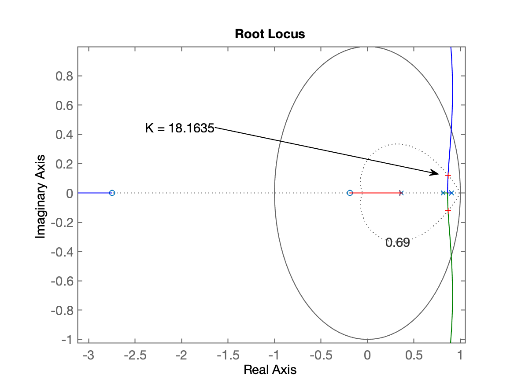
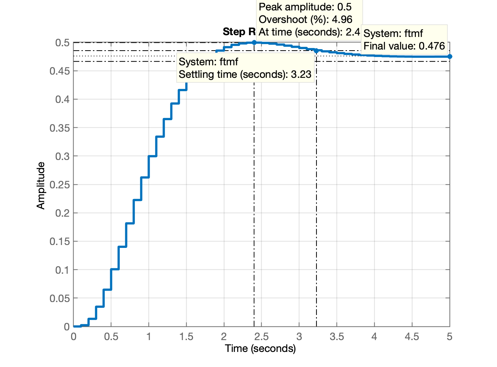
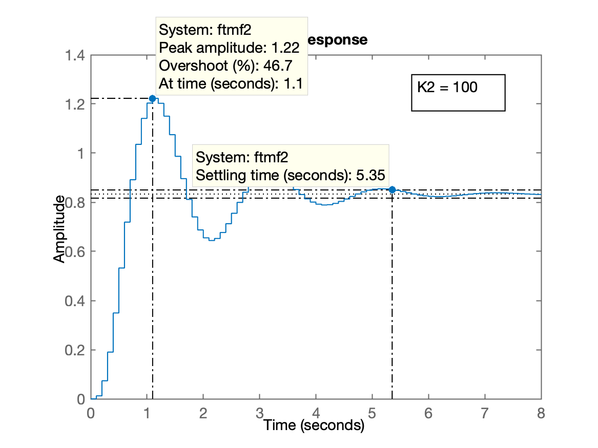
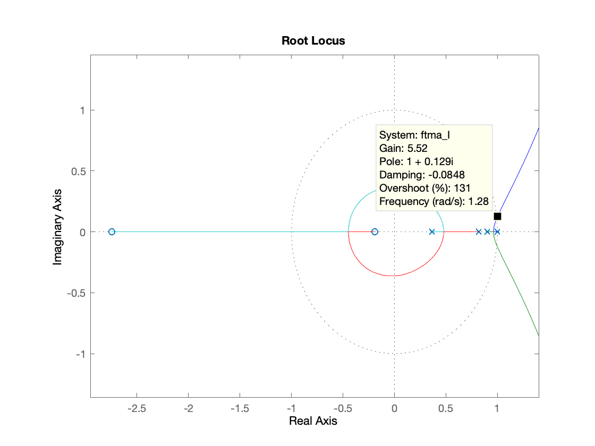
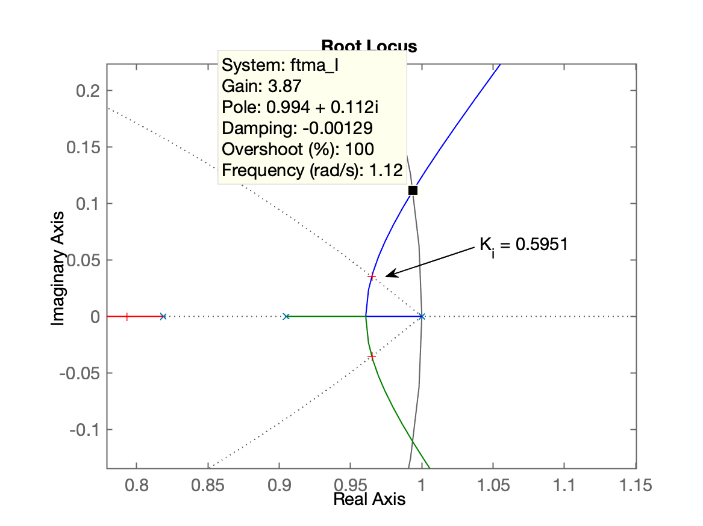
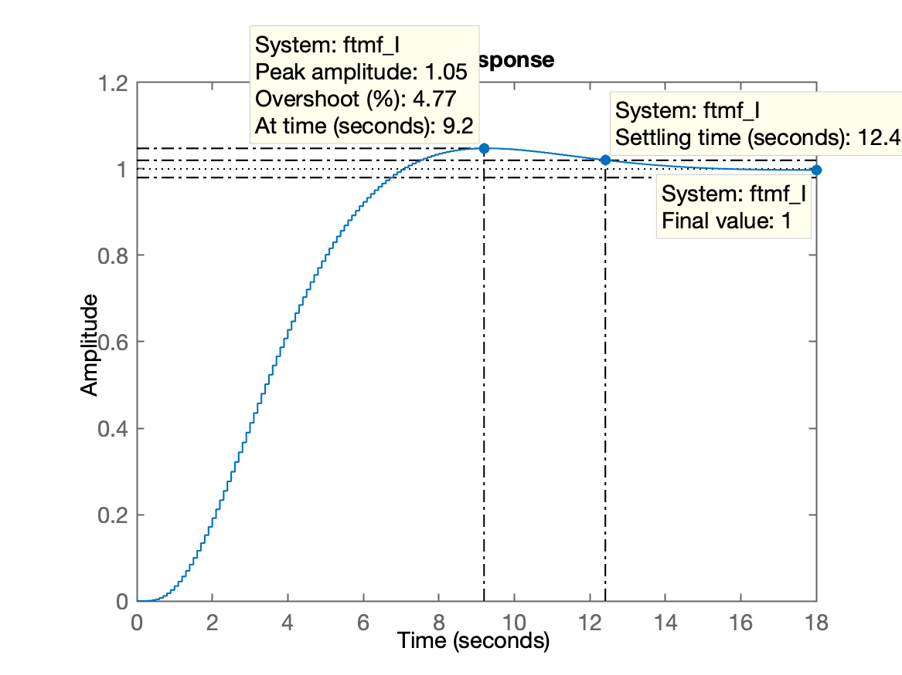
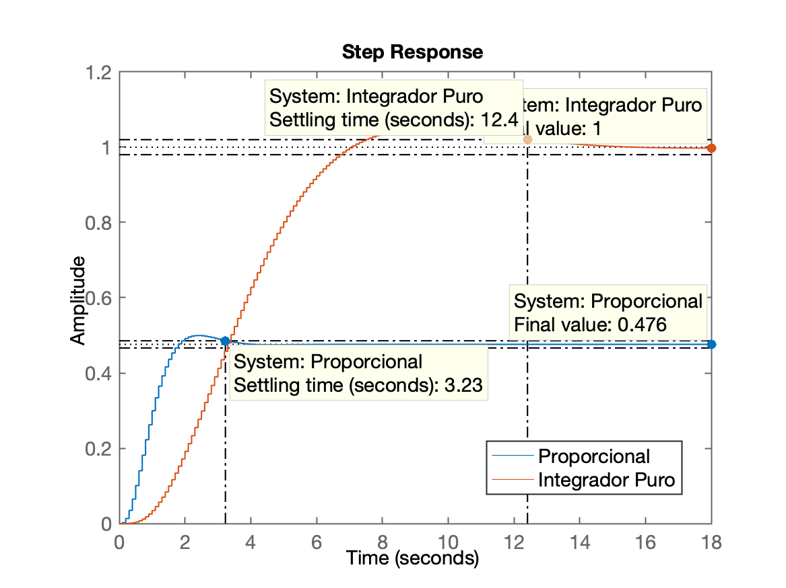

# Aula Controle Automático III

Data: 07/10/2020

## Estudo de Caso

### Preparando Matlab:

Chaveando para diretório de trabalho e ativando "**Diary**":

```matlab
>> pwd
ans =
    '/Volumes/Data/Users/fernandopassold/Documents/UPF/Controle_2/6_Projetos_via_RL/2020_2'
>> diary aula_07_10_2020.md
>> % # Aula do dia 07/10/2020
```

### Ingressando Planta

A planta usada para estudo de caso é:

$$
G(s)=\dfrac{1}{(s+10)(s+2)(s+1)}
$$

Ingressando plata no Matlab:

```matlab
>> G=tf( 1, poly( [ -10 -2 -1] ) );
>> zpk(G)

ans =
 
          1
  ------------------
  (s+10) (s+2) (s+1)
 
Continuous-time zero/pole/gain model.

>> T=0.1; % periodo de amostragm adotado
>> 
>> % "Digitalando" a planta, isto é, calculando $BoG(z)$:
>> 
>> BoG = c2d ( G, T );
>> zpk(BoG)

ans =
 
  0.00012224 (z+2.747) (z+0.1903)
  --------------------------------
  (z-0.9048) (z-0.8187) (z-0.3679)
 
Sample time: 0.1 seconds
Discrete-time zero/pole/gain model.

>>
```

### Projeto de Controlador Proporcional

Requisito de controle: $\%OS  \le 5\%$:

```matlab
>> OS=5; % percentual tolerado de overshoot
>> 
>> zeta = (-log(OS/100))/(sqrt(pi^2 + (log(OS/100)^2)))
zeta =
    0.6901
>> 
>> % Exibir o Root Locus
>> rlocus(BoG)
>> hold on
>> zgrid(zeta, 0)
>> [K, polos_MF] = rlocfind( BoG )
Select a point in the graphics window
selected_point =
   0.8676 + 0.1214i
K =
   18.1635
polos_MF =
   0.8680 + 0.1214i
   0.8680 - 0.1214i
   0.3533 + 0.0000i
>>
```
 
Gráfico de Root Locus para controlador Proporcional:



Fechando a malha...

```matlab
>> ftmf = feedback( K*BoG, 1);
>> figure; step(ftmf)
>> grid
```

Gráfico da resposta ao degrau unitário:



Computando $y[\infty]$ e errro:

```matlab 
>> dcgain(ftmf) % deduzindo y[\infty]
ans =
    0.4759
>> erro= (1 - dcgain(ftmf))/1*100
erro =
   52.4061
>> 
```

Pode-se reduzir o erro aumentando ganho, **mas** aumenta overshoot...

```matlab
>> K2=100; % novo valor do ganho do controlador proporcional
>> 
>> ftmf2 = feedback( K2*BoG, 1);
>> pole(ftmf2)
ans =
   0.8860 + 0.2854i
   0.8860 - 0.2854i
   0.3071 + 0.0000i
>> 
>> figure; step(ftmf2)
```

Resposta ao degrau com $K=100$:



Calculando o novo valor de erro:

```matlab 
>> erro2= (1 - dcgain(ftmf2))/1*100
erro2 =
   16.6667
```

### Projeto de Integrador Puro (Controlador "I")

Lembrando eq. do Integrador Retangular (vista em "Teoria do Erro"):
$$
C(z)=\dfrac{K_i \cdot T}{(z-1)}
$$

Ingressando controlador no Matlab e determinando $FTMA(s)$:

```matlab
>> I = tf( 1, [1 -1], T);
>> zpk(I)

ans =
 
    1
  -----
  (z-1)
 
Sample time: 0.1 seconds
Discrete-time zero/pole/gain model.

>> ftma_I = I*BoG;
>> zpk(ftma_I)

ans =
 
     0.00012224 (z+2.747) (z+0.1903)
  --------------------------------------
  (z-1) (z-0.9048) (z-0.8187) (z-0.3679)
 
Sample time: 0.1 seconds
Discrete-time zero/pole/gain model.

>> % Deduzindo Root Locus
>> 
>> figure; rlocus(ftma_I)
>> axis equal
```

Gráfico do RL sem zoom:



Realizando zoom para sintonia do controlador Integrador Puro:

```matlab 
>> hold on;
>> zgrid(zeta, 0)
>> [Ki, polos_MF] = rlocfind (ftma_I)
Select a point in the graphics window
selected_point =
   0.9644 + 0.0354i
Ki =
    0.5951
polos_MF =
   0.9649 + 0.0353i
   0.9649 - 0.0353i
   0.7930 + 0.0000i
   0.3687 + 0.0000i
>> 
```

Gráfico final do RL (com zoom):



Fechando a malha:

```matlab
>> ftmf_I = feedback( Ki*ftma_I, 1);
>> figure; step(ftmf_I)
>> 
>> % Valor final de $y[kT]$:
>> 
>> dcgain(ftmf_I)
ans =
    1.0000
>>
``` 

Gráfico da resposta ao degrau unitário:



### Comparando os 2 controladores

```matlab
>> figure; step( ftmf, ftmf_I)
>>
```

Gráfico:
 


Encerrando trabalhos com Matlab e preservando dados para próximas aulas e próximos projetos:

```matlab 
>> save planta
>> diary off
>> quit
```

---

Obs.: figuras incluídas usando:

```html

```
---

Fernando Passold, em 07.10.2020