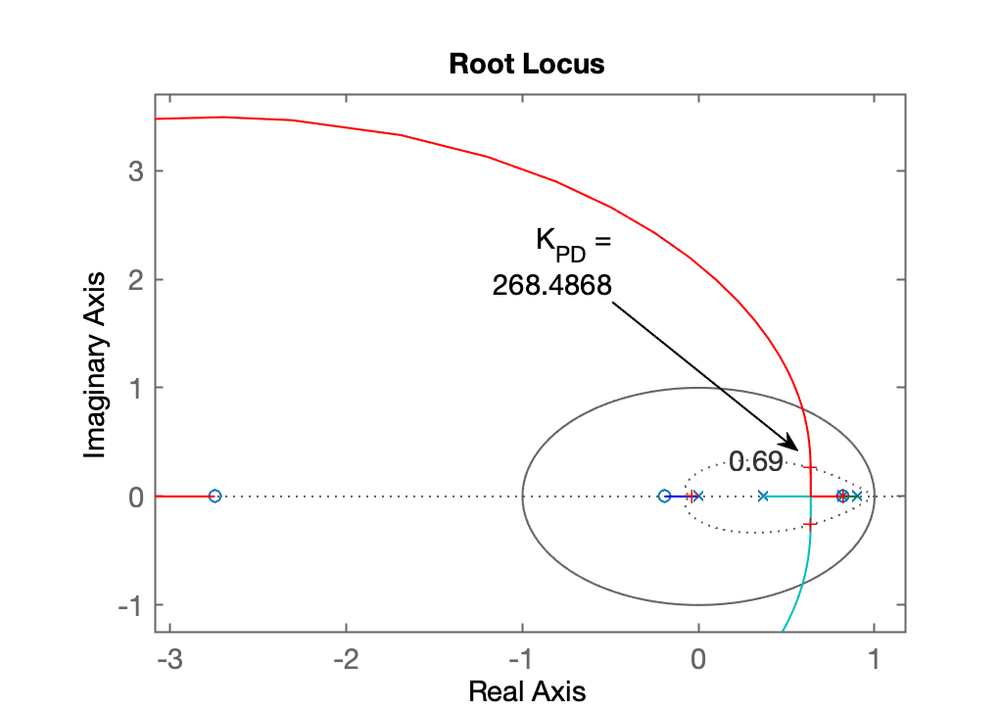
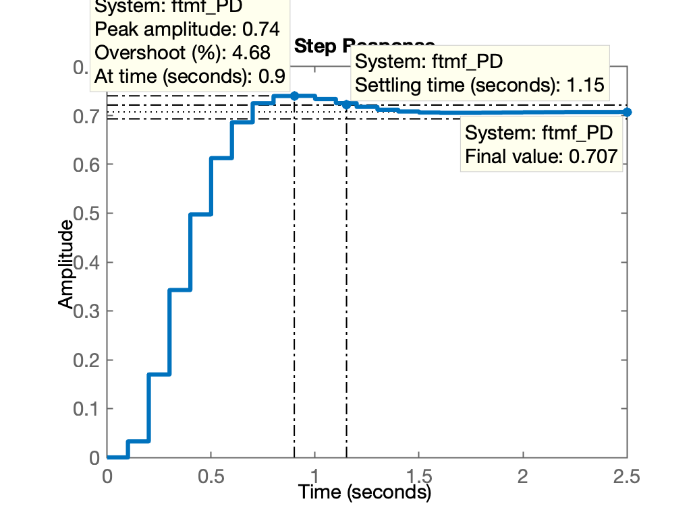
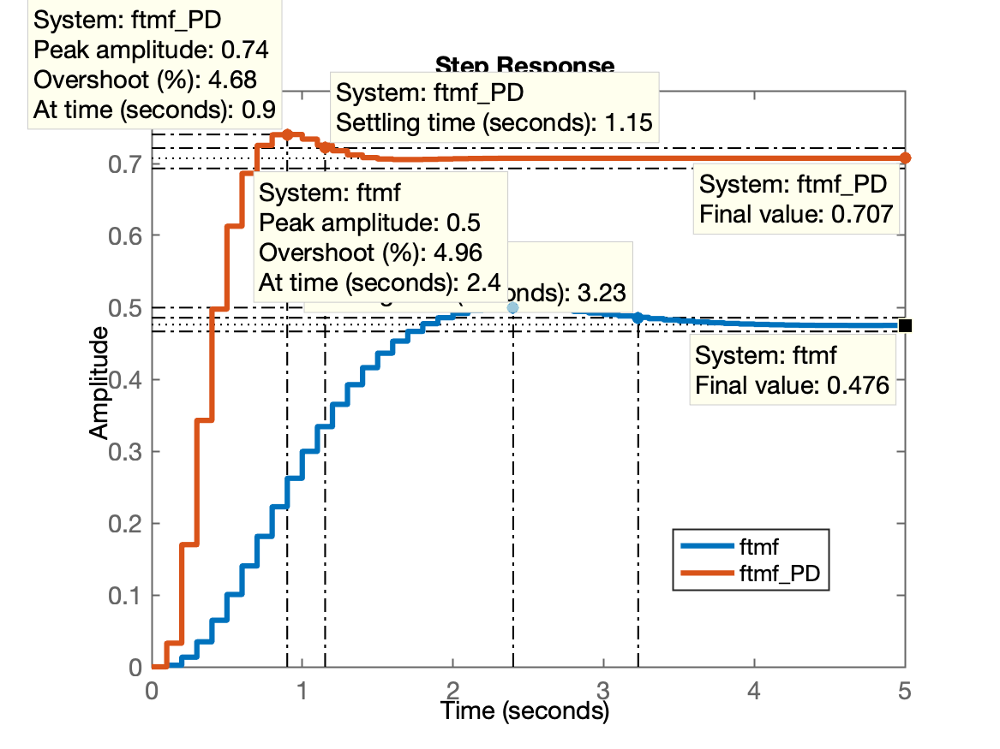
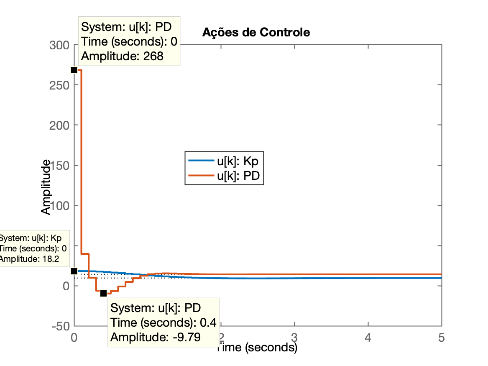

# Projeto de PD

> Aula de 28/10/2020.

Conforme discussão prévia em sala, analisando o plano-s com os pólos e zeros da planta + o pólo na origem do PD, faltava definir uma posição para o zero do PD. Pela análise do Root Locus, percebe-se que o PD deve gerar respostas mais rápidas (pólos de MF mais rápidos), se o seu zero estiver localizado entre os 2 pólos mais lentos desta planta:  $0.8187 \le \text{zero}_{\text{PD}} \le 0.9048$.

Retomando seção de trabalho anterior no Matlab:

```matlab
>> load planta % carrega dados das seções anteriores
>> zpk(BoG)    % verificando

ans =
 
  0.00012224 (z+2.747) (z+0.1903)
  --------------------------------
  (z-0.9048) (z-0.8187) (z-0.3679)
 
Sample time: 0.1 seconds
Discrete-time zero/pole/gain model.

>> pzmap(BoG)  % mostrando no plano-z os pólos e zeros de BoG(z)
>> % implementando o PD
>> PD=tf(poly(0.82), poly(0),T);
>> zpk(PD)  % confirmando ingresso correto de dados

ans =
 
  (z-0.82)
  --------
     z
 
Sample time: 0.1 seconds
Discrete-time zero/pole/gain model.

>> ftma_PD=PD*BoG;
>> figure; rlocus(ftma_PD)
>> hold on;
>> OS
OS =
     5
>> zgrid(zeta,0)
>> [K_PD,poloMF]=rlocfind(ftma_PD)
Select a point in the graphics window
selected_point =
   0.6375 + 0.2619i
K_PD =
  268.4868
poloMF =
   0.8205 + 0.0000i
   0.6372 + 0.2619i
   0.6372 - 0.2619i
  -0.0361 + 0.0000i

% GRáfico do RL para este PD
% 
```

Gráfico do RL gerado para este PD:


Fechando a malha:

```matlab
>> ftmf_PD=feedback(K_PD*ftma_PD, 1);
>> figure; step(ftmf, ftmf_PD)
>> % Gráfico da resposta ao degrau 
>> % 
```

Gráfico da resposta ao degrau (comparando com controlador Proporcional):


 
Alguns dados:

```matlab
>> stepinfo(ftmf_PD)
        RiseTime: 0.4000
    SettlingTime: 1.2000
     SettlingMin: 0.6862
     SettlingMax: 0.7404
       Overshoot: 4.6764
      Undershoot: 0
            Peak: 0.7404
        PeakTime: 0.9000
>> dcgain(ftmf_PD)
ans =
    0.7073
```

Repare nos erros:

```matlab
>> erro_PD=(1-dcgain(ftmf_PD))/1*100
>> erro_PD =
   29.2707
>>
>> erro_Kp=(1-dcgain(ftmf))/1*100
>> erro_Kp =
   52.4061
>> % comparando tempos de assentamento
>> 3.23/1.15
ans =
    2.8087
```

Nota-se que o PD acelerou um sistema em 2,8 vezes e reduziu (mas não cancelou) erro em regime permanente, em comparação com controlador Proporcional.

Verificando agora as amplitudes das ações de controle

```matlab
>> % levantando equações auxiliares para uso de step e gráficos de u[kT']
>> u=K/(1+K*BoG); % cont. Proporcional
>> uPD=K_PD*PD/(1+K_PD*PD*BoG); % PD
>> figure; step(u, uPD)
>> title('Ações de Controle');
```

Gráfico das ações de controle:



Note as amplitudes iniciais geradas pelos controladores:
 
```matlab
>> K_PD
K_PD =
  268.4868
>> K
K =
   18.1635
>> % relação entre valor inicial de u[kT] gerado pelo PD x Proporcional   
>> K_PD/K
ans =
   14.7817
```

Mas em compensação o PD reduziu tempo de assentamento pela metade ou menos:

```matlab
>> 3.23/2
ans =
    1.6150
```

Encerrando atvidades desta aula:

```matlab
>> save planta
>> diary off
```

---

Fernando Passold, em 28/10/2020.