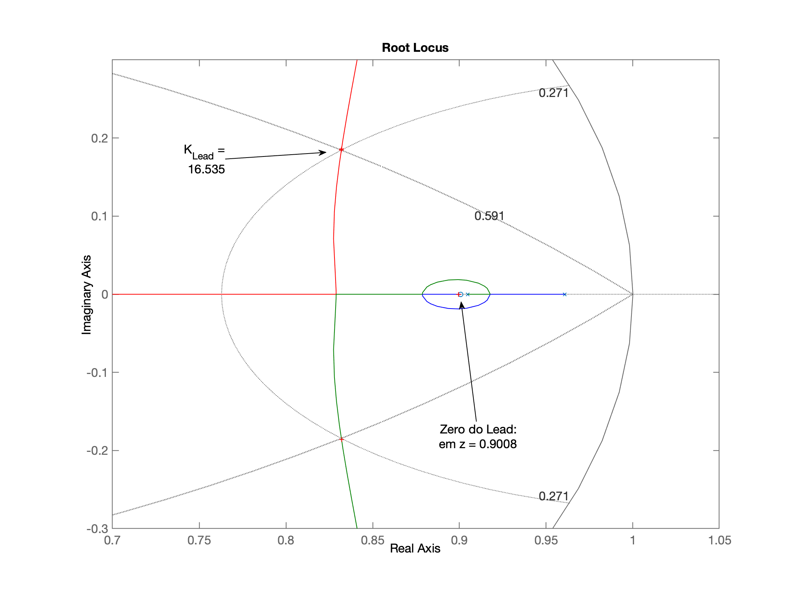

</br>
[Espécie de camaleão considerada extinta ainda sobrevive.](https://www.cnnbrasil.com.br/internacional/especie-de-camaleao-considerada-extinta-ainda-sobrevive-diz-estudo/)


# Projeto Controladores


Recuperando dados da [aula passada (27/10/2023)](aula_27oct2023.html) e iniciando nova seção de trabalho:

```matlab
>> diary aula_10112023.txt
>> load planta
```

Continuando as atividades...

## Projeto de Lead

> Base teórica, ver:
>
> Ref.: [Projeto de Controlador PD (Aula de 28/05/2020)](https://fpassold.github.io/Controle_3/projeto_PD_lead_2020.html)

Lembrando da eq. do PD (da [aula passada (27/10/2023)](aula_27oct2023.html)):

```matlab
>> zpk(PD4)

  (z-0.9608)
  ----------
      z
 
Sample time: 0.02 seconds
Discrete-time zero/pole/gain model.

>> % E lembrando dos pólos e zeros da planta:
>> zpk(BoG)
 
   0.00046711 (z+3.27) (z+0.2335)
  --------------------------------
  (z-0.9608) (z-0.9048) (z-0.6703)
 
Sample time: 0.02 seconds
Discrete-time zero/pole/gain model.

>> % podemos arbitrar o zero do PD entre os 2 pólos dominantes da planta:
>> z_Lead=(0.9608+0.9048)/2
z_Lead =
       0.9328
```

Se vamos usar **contribuição angular** para determinar o local do pólo ou zero do controlador, necessitamos um parâmetro extra para poder definir a posição desejada para os pólos de MF. Além do $\%OS$, necessitamos algum parâmetro temporal, como o $t_s$, $t_p$ ou $t_r$ desejados para o sistema, assim, podemos usar as equações que relacionam posição do pólo complexo em malha-fechada para sistemas de 2a-ordem com os parâmetros desejados ($\%OS$ e algum parâmetro temporal).

**Mas...** além disto, devemos **determinar um valor "razoável" para $t_s$ desejado**. Isto é, um controlador do tipo ***Lead*** (Avanço de Fase) nunca será mais rápido que um controlador do tipo **PD**. Lembre-se que o *Lead* é resultado de um PD acrescido de um filtro passa-baixas que atua na sua ação derivativa. O filtro passa-baixas introduz um pólo no sistmea que têm o "inconveniente" de atrasar a resposta do sitema. Mas lembre-se que o filtro é adiconado porque muito provavelmente num sistema real estaremos as voltas com ruído. E realizar derivada de um sinal que inclui ruído, implica amplificar demasiadamente componentes do ruído. Eventualmente a amplitude da derivada do ruído (se estiver ocorrendo em frequências elevadas) pode ficar "compatível" (no mesmo patamar) que a própria derivada do sinal desejado (sem o ruído). Motivo pelo qual é colocado um filtro passa-baixas na ação derivativa.

Estabelecendo $t_s=0,5$; parece ser um valor "razoável" (note que o $t_s$ do PD4 calculado na aula passada, o PD mais rápido possível, ficou em $t_{s_{PD4}}=0.38$ segundos).

Usando o *script* **[angulos2.m](angulos2.m)** (que exige a rotina **[arc.m](arc.m)**), vamos obter: 

```matlab
>> angulos2
PD/Lead Controller Design
In this version you should arbitrate the initial position of the pole of C(z)

Plant (in s-plan) informed, G(s):
ans =
 
         400
  ------------------
  (s+20) (s+5) (s+2)
 
Continuous-time zero/pole/gain model.

Sampling time informed: T=0.02
Plant in discrete form, BoG(z):
ans =
 
   0.00046711 (z+3.27) (z+0.2335)
  --------------------------------
  (z-0.9608) (z-0.9048) (z-0.6703)
 
Sample time: 0.02 seconds
Discrete-time zero/pole/gain model.

Maximum overshoot desired (%OS), in %: ? 10
zeta (damping factor) should be: 0.5912
Enter desired settling time, t_s: ? 0.5

It results in the natural oscillation frequency, wn = 13.5328 (rad/s)
The MF poles (in the s-plane) should be located in:
8.0000 +/- j10.9150
Localization of MF poles in the z-plane should be:
z = 0.8319 +/- j0.1845

Enter the position of the controller pole (z-plane): ? 0.25
Working with the temporary FTMA(z)...
Open poles = 0.960789
Open poles = 0.904837
Open poles = 0.67032
Open poles = 0.25
Open zeros = -3.27018
Open zeros = -0.233457
Angular contribution of each pole in the z-plane:
 p1 = 0.9608 --> 124.93^o
 p2 = 0.9048 --> 111.56^o
 p3 = 0.6703 --> 48.79^o
 p4 = 0.2500 --> 17.60^o
Sum of angular contribution of poles: 302.87^o
Check the figure window -> Paused (enter to continue)...
Angular contribution of each zero in the z-plane:
 z1 = -3.2702 --> 2.58^o
 z2 = -0.2335 --> 9.83^o
Sum of angular contribution of zeros: 12.40^o
Final angle for the zero of C(z): 110.4714^o

Ok, determining the position for zero of C (z)...
Final position for the Lead zero: z_c=0.9008
Updating final RL graph...
The Lead controller final result is (variable C):
ans =
 
  (z-0.9008)
  ----------
   (z-0.25)
 
Sample time: 0.02 seconds
Discrete-time zero/pole/gain model.
```

Notamos alguns detalhes:

1. O *script* **angulos2.m** só calcula o local do zero do controlador. Não permite arbitar um local para o zero e depois calular o valor do pólo do controlador. O usuário do mesmo deve determinar (arbitrar) inicialmente o local do pólo do controlador :warning:.

2. O pólo deste controlador foi arbitrado num local abaixo do pólo mais lento da planta (em $z=0.6703$). Isto é, se o pólo do filtro foi colocado numa posição superior ao pólo mais rápido da planta, significa que a resposta temporal deste pólo vai ser afetada (reduzida) pelo filtro. Na prática, costumamos definir a frequência de corte do filtro passa-baixas, uma década abaixo da frequência (pólo) mais rápida do sistema. Motivo pelo qual o local arbitrado para o pólo deste controlador foi em $z=0,25$.

    >   Lembrando da eq. da planta no plano-s, notamos que o pólo mais rápido está localizado em $s=-20$. Este pólo quando o sistema foi amostrado à taxa de $f_s=1/T=1/0.02=50$ Hz, ficou localizado no plano-z em $z=0,6703$ (note que $e^{-T \cdot 20}=0,6703$). Este pólo em $s=-20$ equivale a uma frequência de: $f=\omega/(2\pi)=3,1831$ Hz. Isto implica que a freq. de corte do filtro deveria fica uma década acima disto, ou em $f_c=31,831$ Hz. O pólo deste filtro no plano-z resulta na posição: $e^{-T \cdot 2\pi \cdot 31.831}=0.018316$. Neste caso em particular, definir o pólo em $z=0,25$ é como estabelar a freq. de corte do filtro em: $0,25 = e^{-T \cdot 2\pi \cdot f_c} \therefore f_c=\ln(0,25)/-2\pi=11.032$ Hz. Isto significa que neste caso, nosso filtro está com freq. de corte quase $3 \times$ acima da freq. máxima da planta ($31,831/11,032 = 2,8854$).
    >   

3. O *script* **angulos2.m** gera 2 gráficos, um da contribuição angular e outro do RL final já considerando todos os dados do controlador sendo projetado.

Depois de realizar alguns ajustes de escala (range) nos gráficos gerados, temos:

* Gráfico da contribuição angular:

    


Mas antes de usar o RL para definir o ganho do controlador e acabar perdendo conteúdo (variáveis) calculadas usando o *script*, vamos passar alguns dados calculados para outra variáveis para eventual uso posterior:

Depois de executar **angulos2.m**, note o seguinte:

```matlab
>> zpk(ftma)        % FTMA(z) da planta + controlador  completo recém projetado:

ans =
 
  0.00046711 (z+3.27) (z-0.9008) (z+0.2335)
  -----------------------------------------
  (z-0.9608) (z-0.9048) (z-0.6703) (z-0.25)
 
Sample time: 0.02 seconds
Discrete-time zero/pole/gain model.

>> zpk(C)           % C(z) do controlador recém projetado:

ans =
 
  (z-0.9008)
  ----------
   (z-0.25)
 
Sample time: 0.02 seconds
Discrete-time zero/pole/gain model.
```

Salvando alguns dados e continuando com o projeto:


```matlab
>> ftma_Lead = ftma;        % "salva" o ftma recém calculado
>> Lead = C;                % "salva" a eq. do controlador
>> [K_Lead,polosMF_Lead]=rlocfind(ftma_Lead)
Select a point in the graphics window
selected_point =
      0.83191 +    0.18597i
K_Lead =
       16.535
polosMF_Lead =
      0.89947 +          0i
      0.83202 +    0.18596i
      0.83202 -    0.18596i
      0.21472 +          0i
```

Temos o RL ressaltando alguns dados importantes:



Fechando a malha...

```matlab
>> K_Lead = 17;
>> ftmf_Lead = feedback(K_Lead*ftma_Lead, 1);
>> pole(ftmf_Lead)
ans =
      0.89952 +          0i
      0.83229 +    0.18994i
      0.83229 -    0.18994i
       0.2139 +          0i
>> figure; step(ftmf_Lead, ftmf_PD4)
>>legend('Lead', 'PD4')
```

E temos a resposta ao degrau unitário para este sistema:


```matlab
>> stepinfo(ftmf_Lead)

        RiseTime: 0.14
    SettlingTime: 0.46
     SettlingMin: 0.79616
     SettlingMax: 0.91086
       Overshoot: 11.343
      Undershoot: 0
            Peak: 0.91086
        PeakTime: 0.3

>> erro_Lead = (1 - dcgain(ftmf_Lead))/1*100
erro_Lead =
       18.194
```

### O que acontece se é especificado um $t_s$ irealizável?

A questão que ficou anteriormente é: - Consigo um Lead mais rápido?

Vamos testar o valor: $t_s=0.4$.

```matlab
>> angulos2
PD/Lead Controller Design
In this version you should arbitrate the initial position of the pole of C(z)

Plant (in s-plan) informed, G(s):
ans =
 
         400
  ------------------
  (s+20) (s+5) (s+2)
 
Continuous-time zero/pole/gain model.

Sampling time informed: T=0.02
Plant in discrete form, BoG(z):
ans =
 
   0.00046711 (z+3.27) (z+0.2335)
  --------------------------------
  (z-0.9608) (z-0.9048) (z-0.6703)
 
Sample time: 0.02 seconds
Discrete-time zero/pole/gain model.

Maximum overshoot desired (%OS), in %: ? 10
zeta (damping factor) should be: 0.5912
Enter desired settling time, t_s: ? 0.4

It results in the natural oscillation frequency, wn = 16.9160 (rad/s)
The MF poles (in the s-plane) should be located in:
10.0000 +/- j13.6438
Localization of MF poles in the z-plane should be:
z = 0.7884 +/- j0.2206

Enter the position of the controller pole (z-plane): ? 0.25
Working with the temporary FTMA(z)...
Open poles = 0.960789
Open poles = 0.904837
Open poles = 0.67032
Open poles = 0.25
Open zeros = -3.27018
Open zeros = -0.233457
Angular contribution of each pole in the z-plane:
 p1 = 0.9608 --> 127.99^o
 p2 = 0.9048 --> 117.81^o
 p3 = 0.6703 --> 61.84^o
 p4 = 0.2500 --> 22.28^o
Sum of angular contribution of poles: 329.93^o
Check the figure window -> Paused (enter to continue)...
Angular contribution of each zero in the z-plane:
 z1 = -3.2702 --> 3.11^o
 z2 = -0.2335 --> 12.18^o
Sum of angular contribution of zeros: 15.30^o
Final angle for the zero of C(z): 134.6333^o

Ok, determining the position for zero of C (z)...
Final position for the Lead zero: z_c=1.0063
Updating final RL graph...
The Lead controller final result is (variable C):
ans =
 
  (z-1.006)
  ---------
  (z-0.25)
 
Sample time: 0.02 seconds
Discrete-time zero/pole/gain model.
```

Aqui é bom ter percebido certos detalhes:

1. O zero ddo controlador calculado pelo algoritmo ficou fora do círculo unitário (Ok, ainda é um zero de malha-aberta). Mas... dependendo do valor do ganho que será adotado para fechar a malha, poderá implicar em pólos de MF instáveis!

    Uma "espiada" no gráfico da contribuição angular gerado desta vez, revela:

    

2. Zeros instáveis afetam o ganho final do sistema (amplitude em regime permanente) do sistema.

Então, já são esperados problemas, mas vamos continuar o projeto apenas para comprovar que tipo de problemas serão enfrentados se insistimos em continuar este controlador.

```matlab
>> Lead2 = C;                   % salvando dados para uso posterior
>> ftma_Lead2 = ftma;           % salvando dados para uso posterior
>> axis([0.7 1.05 -0.3 0.3])    % realizando zoom na região de interesse
>> [K_Lead2,polosMF_Lead2]=rlocfind(ftma_Lead2)
Select a point in the graphics window
selected_point =
      0.78873 +    0.22148i
K_Lead2 =
       16.641
polosMF_Lead2 =
      0.99102 +          0i
      0.78849 +    0.22149i
      0.78849 -    0.22149i
      0.21018 +          0i
```

***Obs.:*** *neste caso em particular, os pólos de MF ainda ficaram estáveis (mas por muito pouco, note o pólo real em $z=0.99102$).*

O RL mostrando o ganho adotado e onde ficaram os pólos de MF aparece à seguir:


Fechando a malha:

```matlab
>> ftmf_Lead2 = feedback(K_Lead2*ftma_Lead2, 1);
pole(ftmf_Lead2)
ans =
      0.99102 +          0i
      0.78849 +    0.22149i
      0.78849 -    0.22149i
      0.21018 +          0i
>> figure; step(ftmf_Lead2)
```

E temos então:


Obviamente está longe de ser a resposta desejada.

---

Salvando dados para a próxima aula:

```matlab
>> save planta
>> diary off
```

---

Fernando Passold, em 11/11/2023
