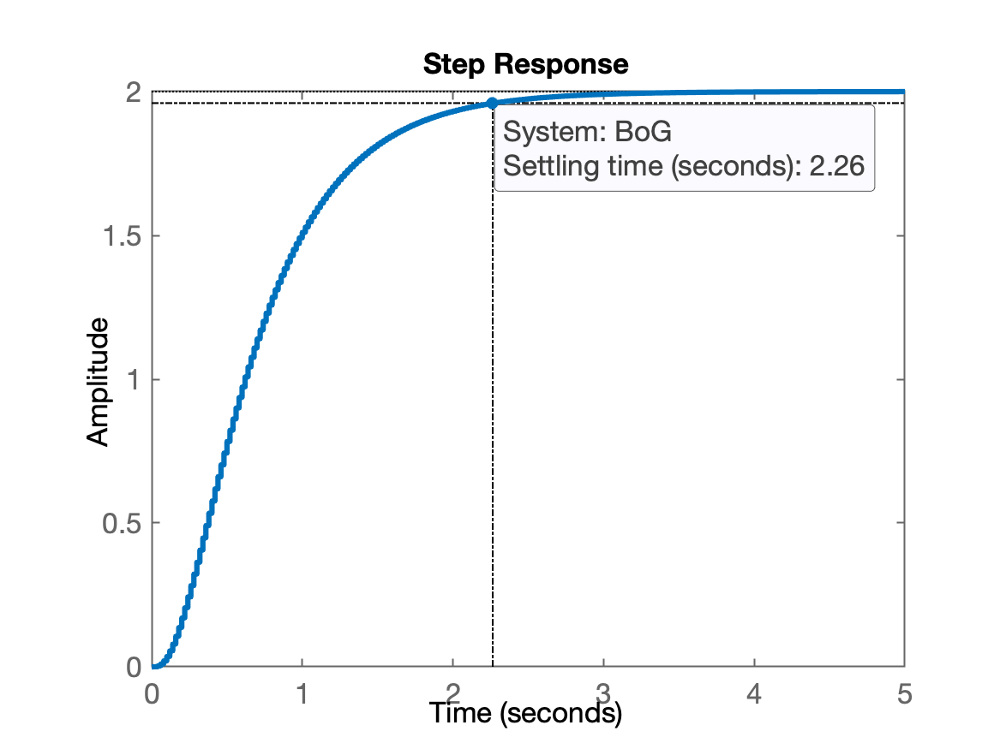
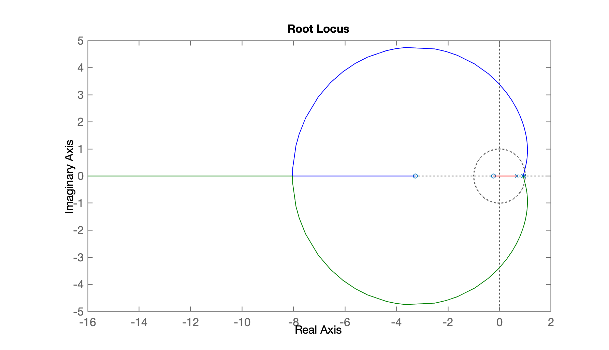
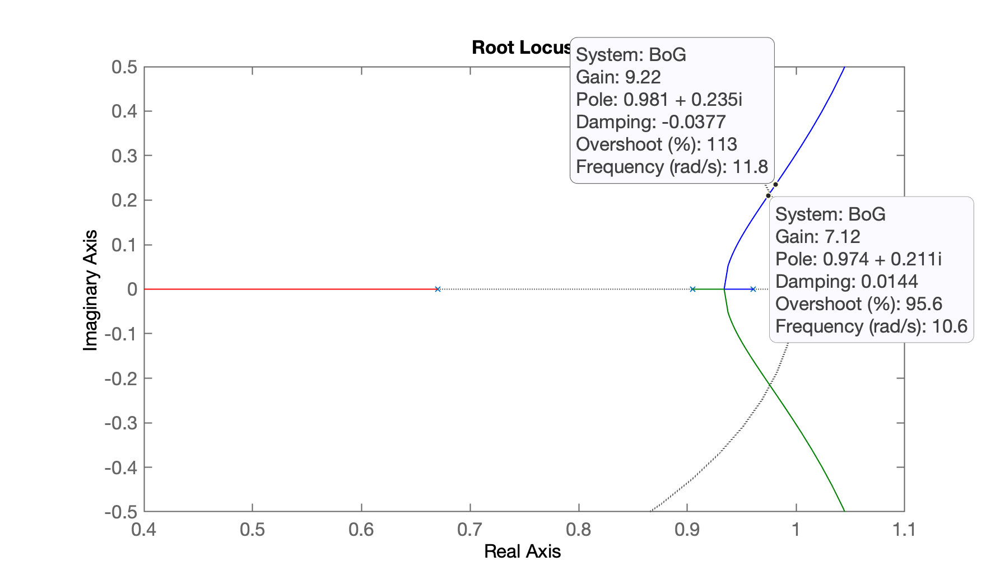
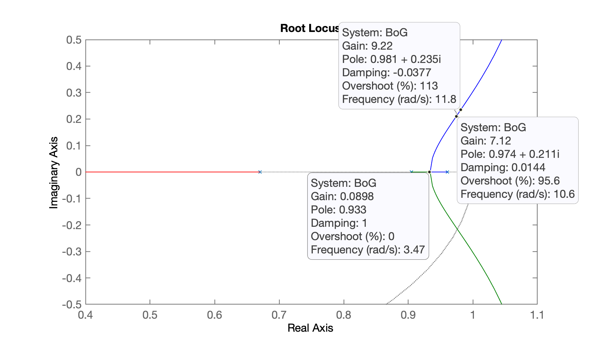
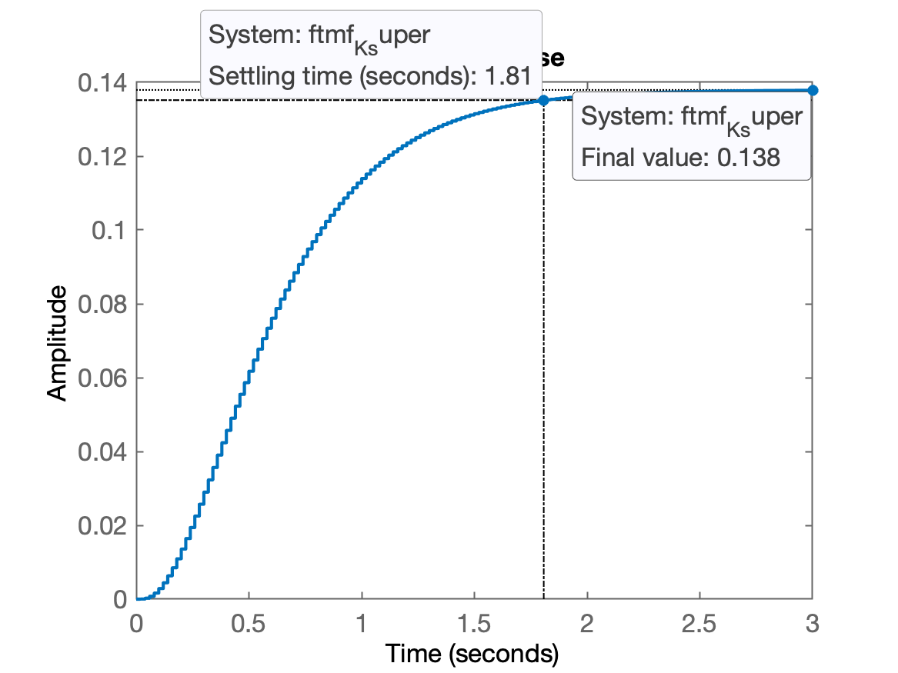
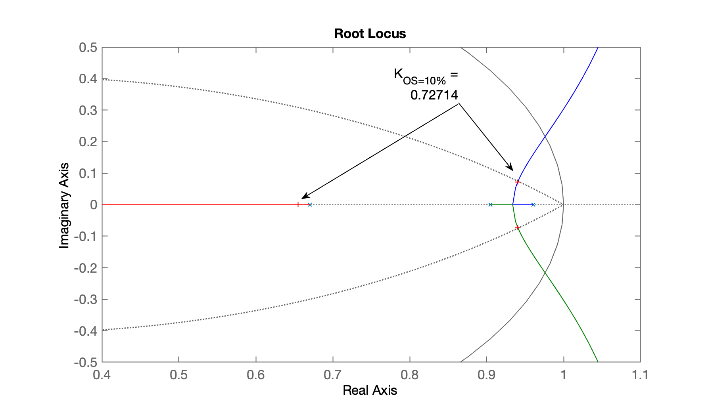
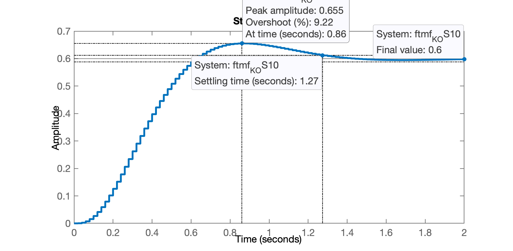
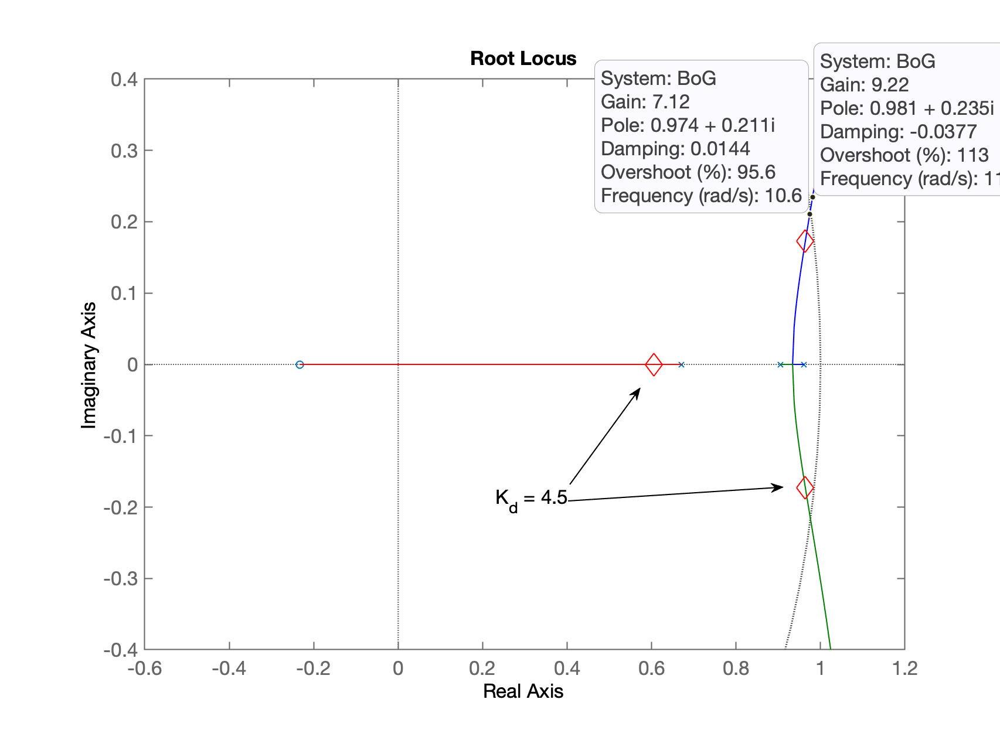
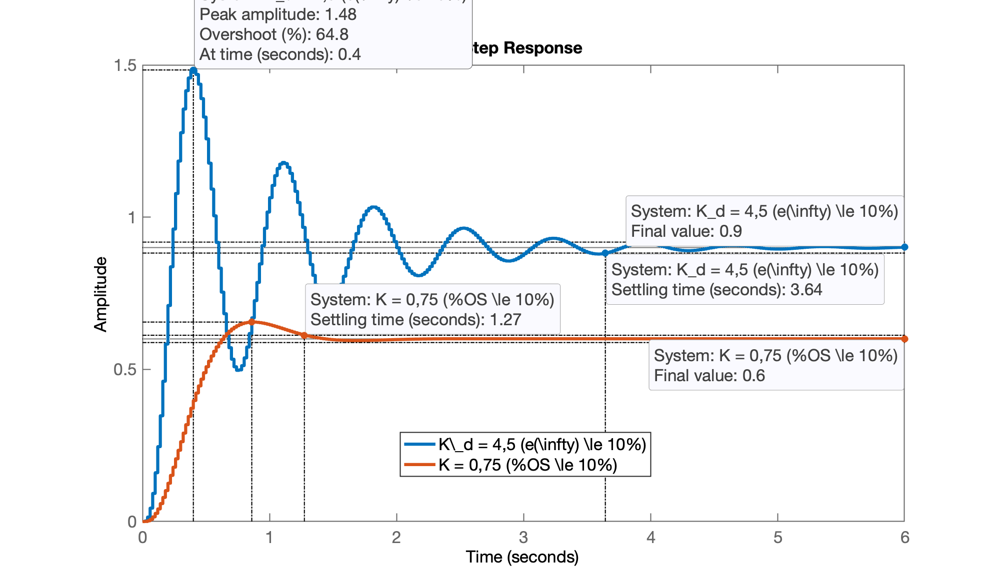

<!-- title: Projeto Controladores: Início -->


# Projeto Controladores

- [Projeto Controladores](#projeto-controladores)
  - [Planta para Estudo de Caso](#planta-para-estudo-de-caso)
  - [Projeto do Controlador Proporcional](#projeto-do-controlador-proporcional)
    - [Controlador Proporcional SEM Overshoot](#controlador-proporcional-sem-overshoot)
    - [Controlador Proporcional com algum Overshoot](#controlador-proporcional-com-algum-overshoot)
    - [Controle Proporcional com erro limitado](#controle-proporcional-com-erro-limitado)
    - [Resumo](#resumo)


## Planta para Estudo de Caso

Suponha que a planta que usaremos para estudo de caso neste semestre seja:

$G(s) = \dfrac{400}{(s+2)(s+5)(s+20)}$

**Questão** (inicial): que valor vamos adotar para **período de amostragem** deste sistema?

***Solução***:

Lembramos que a frequência angular, $\omega$ (em rad/s) é determinada como:

$\omega=2\pi f$

dai podemos descobrir o valor da frequência $f$ em Hz:

$f=\dfrac{\omega}{2\pi}$

A banda passante da planta (pólo de maior frequência), corresponde ao pólo na posição $s=-20$ ou em 20 rad/s, em Hz resultaria:

$f=\dfrac{20}{2\pi}=3.1831$ Hz

Amostrando 20 vezes mais rápido:

```Matlab
>> fs=20*ans
fs =
       63.662
>> T=1/fs
T =
     0.015708
```

Adotando período de amostragem igual à 20 ms:

```matlab
>> T=20E-3
T =
         0.02
```

Testando esta freq. de amostragem:

```matlab
>> G=tf(400,poly([-2 -5 -20]));
>> zpk(G)

ans =
 
         400
  ------------------
  (s+20) (s+5) (s+2)
 
Continuous-time zero/pole/gain model.

>> BoG = c2d(G, T);
>> zpk(BoG)

ans =
 
   0.00046711 (z+3.27) (z+0.2335)
  --------------------------------
  (z-0.9608) (z-0.9048) (z-0.6703)
 
Sample time: 0.02 seconds
Discrete-time zero/pole/gain model.

>> step(BoG)
```

A resposta ao degrau em MA fica:



## Projeto do Controlador Proporcional

Primeiro passo, traçando o RL:

```matlab
>> figure; rlocus(BoG)
```

E temos o gráfico:



Realizando um "zoom" na região de interesse:

```matlab
>> axis([0.4 1.1 -0.5 0.5])
```



Deste RL concluímos que $7,12 < K_u < 9,22$ ($K_u=$ *Ultimate Gain* = ganho máximo que poderia ser adotado).

### Controlador Proporcional SEM Overshoot

Supondo que eu queria uma resposta super-amortecida (sem overshoot: só pólos reais em MF):



Então fechando a malha com $K=0.08$:

```matlab
>> K=0.08;
>> % fechando a malha
>> ftmf_K_super=feedback(K*BoG, 1);
>> pole(ftmf_K_super)
ans =
      0.94298
      0.92453
       0.6684
>> figure; step(ftmf_K_super)
>> stepinfo(ftmf_K_super)
ans = 
  struct with fields:

        RiseTime: 1
    SettlingTime: 1.82
     SettlingMin: 0.12433
     SettlingMax: 0.13788
       Overshoot: 0
      Undershoot: 0
            Peak: 0.13788
        PeakTime: 3.18
```



Percebemos que se for desejada uma resposta super-amortecida, sem overshoot, conseguimos acelerar a planta em MF em:

```matlab
>> 2.26/1.82
ans =
       1.2418
```

Este sistema em MF foi acelerado de quase 25% em relação à planta em MA (lembre-se o ganho adotado aqui foi de apenas $K=0.08$).

Mas ainda apresenta um elevado erro em regime permanente. Repare:

```matlab
>> dcgain(ftmf_K_super)
ans =
      0.13793
>> erro = (1 - dcgain(ftmf_K_super))/1*100
erro =
       86.207
>> 
```

### Controlador Proporcional com algum Overshoot

E se fosse desejada uma resposta mais acelerada, apenas com overshoot.

Supondo que toleramos um overshoot de 10%:

```matlab
>> OS=10;
>> zeta=(-log(OS/100))/(sqrt(pi^2+(log(OS/100)^2)))
zeta =
      0.59116
>> % mudar o foco da janela gráfica para o RL
>> figure(2)
>> hold on
>> zgrid(zeta, 0)      
```

E temos então:



Fixando o ganho em $K=0,75$:

```matlab
>> K_OS10=0.75;
>> % fechando a malha
>> ftmf_K_OS10=feedback(K_OS10*BoG, 1);
>> figure; step(ftmf_K_OS10)
>> stepinfo(ftmf_K_OS10)
ans = 
  struct with fields:

        RiseTime: 0.38
    SettlingTime: 1.28
     SettlingMin: 0.54387
     SettlingMax: 0.65533
       Overshoot: 9.2212
      Undershoot: 0
            Peak: 0.65533
        PeakTime: 0.86
>> 
```

E a resposta à entrada degrau unitário neste caso, fica:



Note alguns detalhes que passaram desapercebidos:

* A planta à ser controlada é um sistema tipo 0, isto é, sem ação integral, o que implica erro diferente de zero para entradas tão simples quanto uma entrada degrau.
* Sistemas tipo 0, operando em malha-fechada sem ação integral não vão garantir erro nulo para regime permanente.
* Com Controle Proporcional sobre um sistema tipo 0, como é o caso, sempre haverá erro (limitado) para uma entrada degrau. A única maneira de limitar o erro é usando-se, neste caso, ganhos elevados. Mas um ganho elevado demais pode implicar num sistema instável em MF.

Neste caso, o erro de regimente permamente ficou em 40%.

### Controle Proporcional com erro limitado

**Questão**: vamos supor que se queira tentar fechar uma malha para este sistema usando um simples Controlador Proporcional, mas limitando o erro à 10% no máximo.

> Projeto finalizado na aula de 22/09/2023

***Solução*** Neste caso, temos que usar a [Teoria do Erro](https://fpassold.github.io/Controle_3/4_teoria_erros/resumo_teoria_erro.html) para prever que valor de ganho deveria ser adotado para garantir erro limitado ao valor citado.

Neste caso (sistema do tipo 0) submetido à uma entrada degrau, temos o seguinte erro previsto:

$e_{Degrau}(\infty) = \dfrac{1}{1+K_p} = 0,1 \quad \leftarrow \quad $ que corresponde aos 10%.

isolando o $K_p$ na eq. anterior:

$K_p = \dfrac{1-e(\infty)}{e(\infty)}$

Calculando o $K_p$ neste caso:

```matlab
>> Kp = (1-0.1)/0.1
Kp =
     9
>> 
```
Agora necessito calcular o $\lim$ para esta planta:

$K_p = \lim_{z \to 1} FTMA(z)$, que o "ganho de posição".

$K_p = \lim_{z \to 1} \left[ \dfrac{K_d \cdot 0.00046711 (z+3.27) (z+0.2335)}{(z-0.9608) (z-0.9048) (z-0.6703)} \right]$

$K_p = K_d \cdot \lim_{z \to 1} \left[ \dfrac{0.00046711 (z+3.27) (z+0.2335)}{(z-0.9608) (z-0.9048) (z-0.6703)} \right]$

Calculando o limite usando o Matlab:

```matlab
>> dcgain(BoG)
ans =
            2
>> [numd,dend]=tfdata(BoG,'v')
numd =
            0   0.00046711    0.0016366   0.00035661
dend =
            1      -2.5359       2.1199     -0.58275
>> lim = polyval(numd, 1)/polyval(dend, 1)
lim =
            2
```

Então temos:

$K_p = K_d \cdot 2$

$K_d = \dfrac{K_p}{2}$

No nosso caso:

```matlab
>> Kd=Kp/2
Kd =
          4.5
```

**Questão:** este ganho pode ser adotado?

Fechando a malha...

```matlab
>> ftmf_Kd = feedback(Kd*BoG, 1);
>> pole(ftmf_Kd)
ans =
      0.96399 +    0.17296i
      0.96399 -    0.17296i
      0.60587 +          0i
>> polosMF_Kd=pole(ftmf_Kd)
polosMF_Kd =
      0.96399 +    0.17296i
      0.96399 -    0.17296i
      0.60587 +          0i
>> raio = abs(polosMF_Kd)
raio =
      0.97938
      0.97938
      0.60587
>> figure; rlocus(BoG)
>> hold on;
>> plot(polosMF_Kd, 'rd', 'MarkerSize', 14)
>> axis([-0.6 1.2 -0.4 0.4])
```

Temos o seguinte RL mostrando onde ficam localizados os pólos de MF para este valor de ganho:



Nota-se que $7,12 < K_u < 9,22$.

Verificando a resposta em MF para entrada degrau.

```matlab
>> figure; step(ftmf_Kd, ftmf_K_OS10)
>> legend('K_d=4,5 (e(\infty \le 10%)', 'K = 0,75 (%OS \le 10%)')
>> stepinfo(ftmf_Kd)

        RiseTime: 0.14
    SettlingTime: 3.66
     SettlingMin: 0.49679
     SettlingMax: 1.4835
       Overshoot: 64.832
      Undershoot: 0
            Peak: 1.4835
        PeakTime: 0.4
>> 
```




### Resumo

Segue resumo do desempenho obtido à partir de Controladores Proporcionais:

| Critério | $K_p$| $\%OS$ | $t_s$ | $e(\infty)$ |
| ---: | ---: | ---: | ---: | ---: |
| Resposta Super-amortecida | 0,08 | 0 | 1,81 | 86,2% |
| Overshoot <10% | 0,75 | 9,2% | 1,27 | 40% |
| Erro <10% | 4,5 | 64,8% | 3,7 | 10% |

Efetivamente, com os projetos de controladores Proporcionais já realizamos percebemos que:

🤨 *blá-blá-blá...*

Encerrando seção de trabalho para 2a-parte da aula... 📝

```matlab
>> save planta
>> diary off
```

Continua na próxima aula, do dia [22/09/2023](aula_22092023.html)

----

[:musical_note:](https://youtu.be/ZLQiD4_OiLU?si=aGHMpz_M9HI9-cDu)

<font size="2">  Fernando Passold, em 15/09/2023 </font> 
