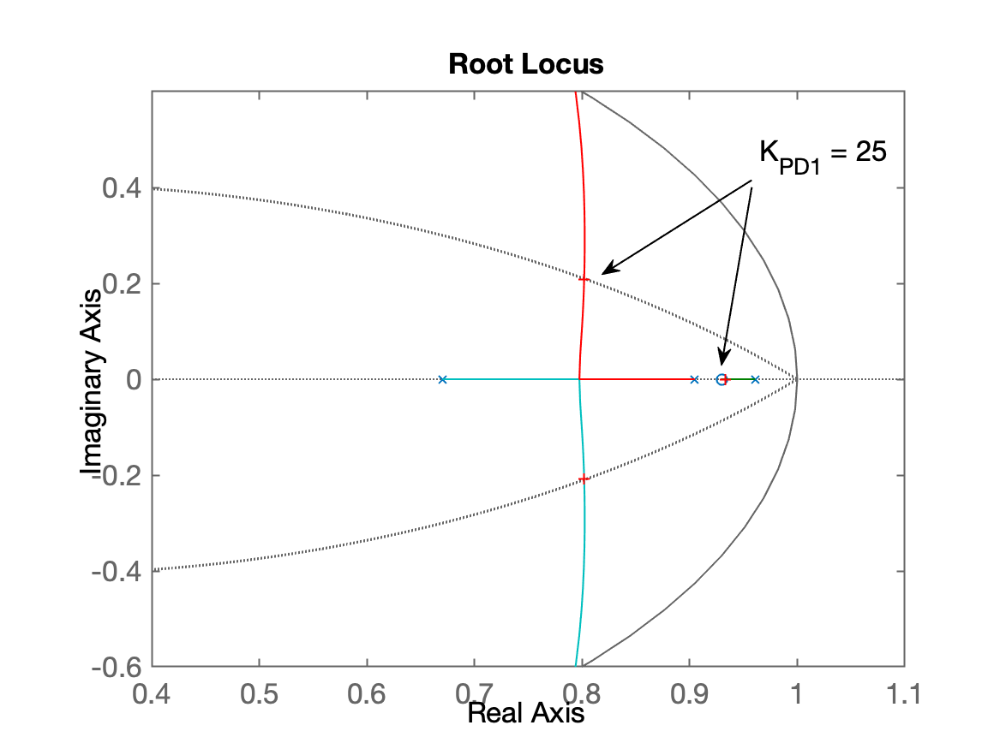
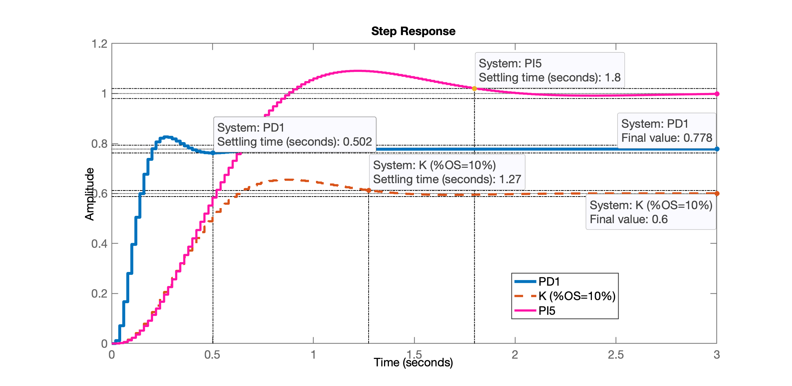
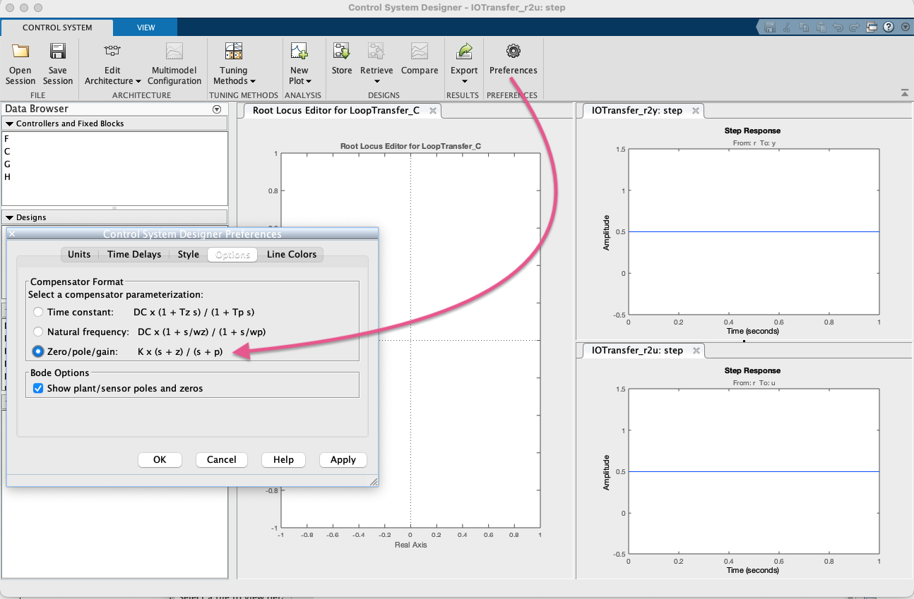
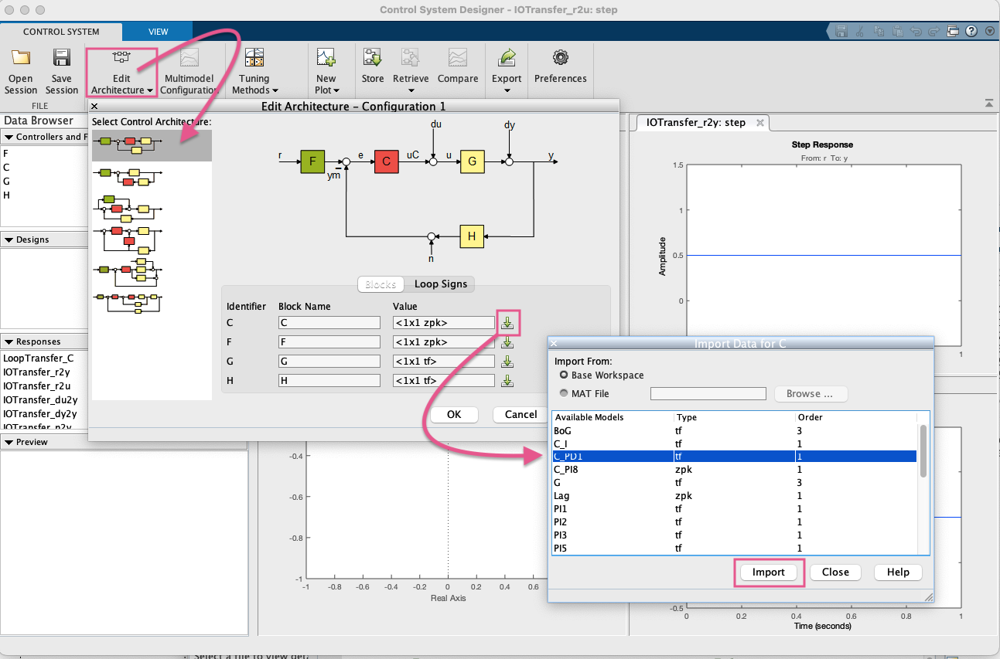
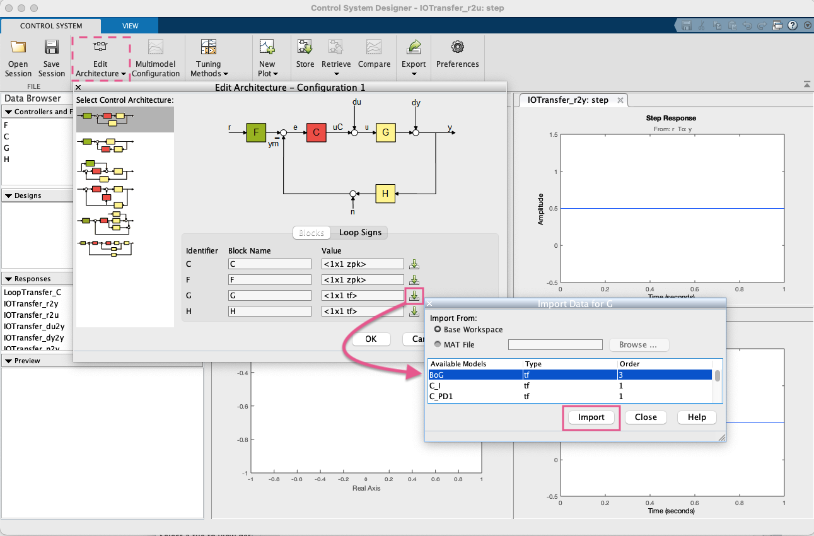
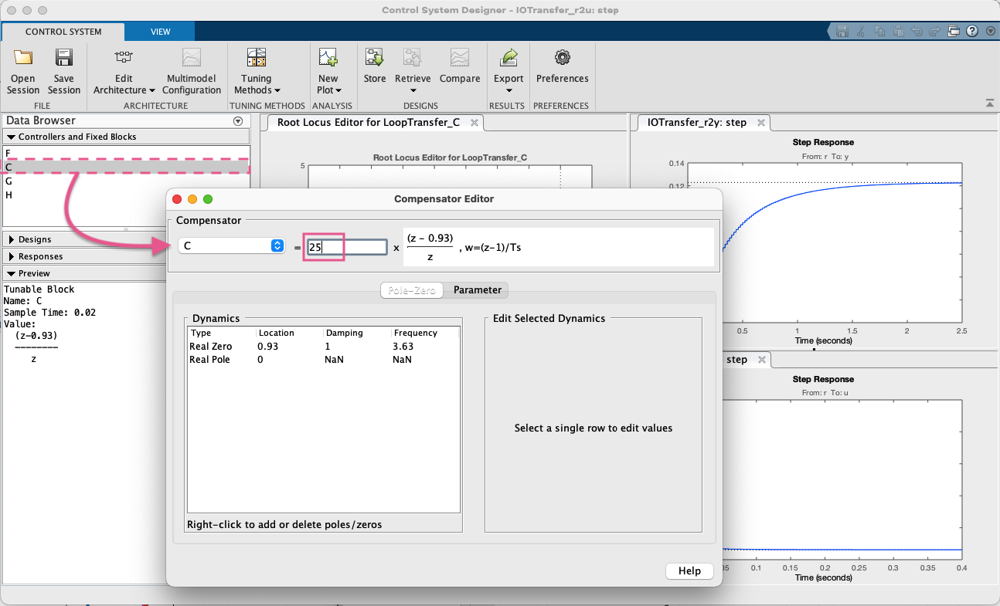
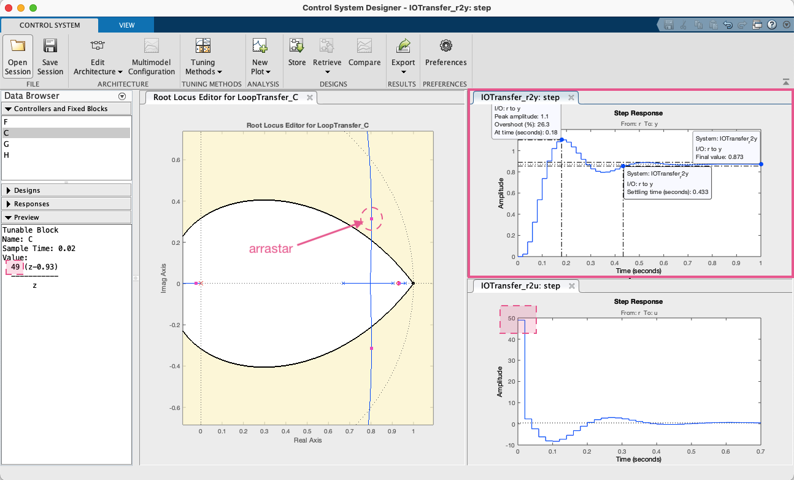
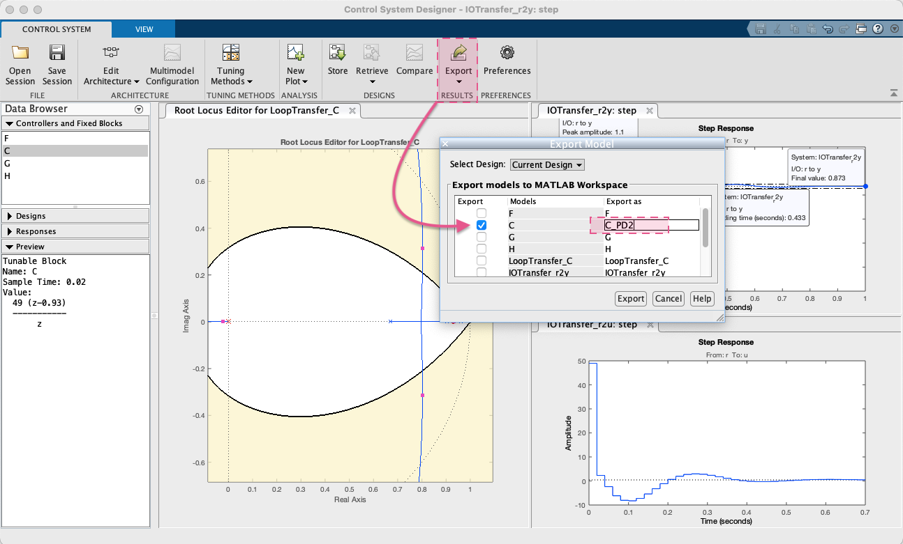
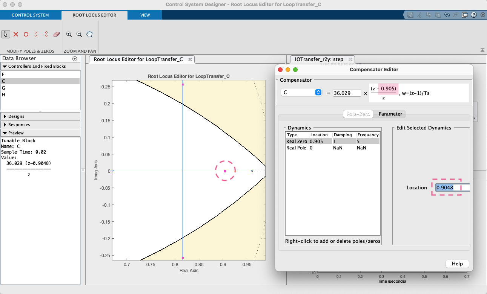
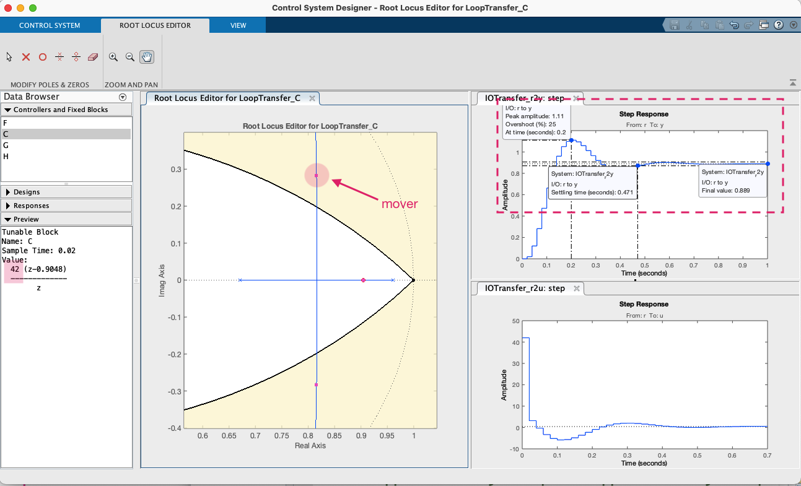

<!--title: Controladores PD -->

# Projeto de Controladores (Cont)

## Controladores com Ação Derivativa

> Aula de 20/10/2023</br>
> Dados desta aula podem ser recuperados à partir de [planta.mat](planta.mat)

- [Projeto de Controladores (Cont)](#projeto-de-controladores-cont)
  - [Controladores com Ação Derivativa](#controladores-com-ação-derivativa)
    - [Projeto de PD](#projeto-de-pd)
    - [Melhorando o PD usando App Control System Designer](#melhorando-o-pd-usando-app-control-system-designer)
    - [PD cancelando um dos pólos da planta](#pd-cancelando-um-dos-pólos-da-planta)

---

### Projeto de PD

Recuperando dados da aula passada:

```Matlab
>> load planta
```

<!--
% Ref.: Projeto de PD:</br>(sem contribuição angular) ([Aula de 28/10/2020](https://fpassold.github.io/Controle_3/2020_2/aula_28_10_2020.html))
-->

Lembrando da equação genérica do PD</br>(ver "[Dedução Controladores PD & Lead) (arquivo PDF; Aula de 21/05/2020)](https://fpassold.github.io/Controle_3/pd_plus_filtro.pdf)"):

$C_{PD}(z) = \dfrac{K(z-z_{PD}}{z}$

A única incógnita é a posição do zero do PD: $z_{PD}$.

Podemos adotar o mesmo raciocínio empregado em "[Projeto de Controlador PD (Aula de 28/05/2020)](https://fpassold.github.io/Controle_3/projeto_PD_lead_2020.html)".

Lembrando da nossa planta:

```Matlab
>> zpk(BoG)

ans =
 
   0.00046711 (z+3.27) (z+0.2335)
  --------------------------------
  (z-0.9608) (z-0.9048) (z-0.6703)
 
Sample time: 0.02 seconds
Discrete-time zero/pole/gain model.
```

Seguindo este mesmo raciocínio, parece ser melhor localizar o zero do PD entre os 2 pólos mais dominantes (mais lentos) da planta:

```Matlab
>> z_PD=(0.9608+0.9048)/2        % Calculando o valor geométrico médio entre os 2 pólos
z_PD =
       0.9328
>> z_PD=0.93;
>> C_PD1 = tf([1 -z_PD],[1 0], T)

C_PD1 =
 
  z - 0.93
  --------
     z
 
Sample time: 0.02 seconds
Discrete-time transfer function.

>> ftma_PD1 = C_PD1*BoG;
>> zpk(ftma_PD1)

ans =
 
  0.00046711 (z+3.27) (z-0.93) (z+0.2335)
  ---------------------------------------
    z (z-0.9608) (z-0.9048) (z-0.6703)
 
Sample time: 0.02 seconds
Discrete-time zero/pole/gain model.

>> rlocus(ftma_PD1)
>> hold on; zgrid(zeta,0)
>> axis([0.4 1.1 -0.6 0.6])
>> [K_PD1,polosMF_PD1] = rlocfind(ftma_PD1)
Select a point in the graphics window
selected_point =
      0.80225 +    0.20805i
K_PD1 =
       25.218
polosMF_PD1 =
      0.93332 +          0i
      0.80195 +    0.20805i
      0.80195 -    0.20805i
    -0.013055 +          0i
>> K_PD1 = 25;
```

O RL para este PD fica:



Fechando a malha com o ganho encontrado:

```Matlab
>> ftmf_PD1 = feedback(K_PD1*ftma_PD1, 1);
>> figure; step(ftmf_PD1, ftmf_K_OS10, ftmf_PI5)
>> legend('PD1', 'K (%OS=10%)', 'PI5')
```

Vamos obter o seguinte resultando, já comparando este PD (PD1) com a resposta obtida no projeto de outros controladores:



### Melhorando o PD usando App Control System Designer

Podemos melhorando projeto com App Control System Designer.

Lembrando de fazer alguns ajustes iniciais:



Importando o controlador PD1 já realizado:



Não esquecendo de importar a planta (principalmente):



Editando o ganho do controlador:



Aumentando o ganho para 49:



Exportando a equação deste PD para a janela de comandos do Matlab:



```Matlab
>> zpk(C_PD2)

ans =
 
  49 (z-0.93)
  -----------
       z
 
Name: C
Sample time: 0.02 seconds
Discrete-time zero/pole/gain model.
```

**Conclusão**: Aumentar o ganho implicou reduzir o erro em regime permanente (como esperado).

### PD cancelando um dos pólos da planta

Suponha que agora vamos cancelar o 2o-polo mais lento da planta com o zero do PD3:

Ajustando o zero do PD3:



Resultado final obtido:



Exportando controlador como PD3:

```Matlab
zpk(C_PD3)

ans =
 
  42 (z-0.9048)
  -------------
        z
 
Name: C
Sample time: 0.02 seconds
Discrete-time zero/pole/gain model.
```

**Conclusão**: Este seria o PD mais rápido possível de poder ser realizado (em teoria) para esta planta.

---

Salvando seção de trabalho do App Control System Designer em: [ControlSystemDesignerSession_PD.mat](ControlSystemDesignerSession_PD.mat).

Salvando dados de todos os projetos já realizados:

```Matlab
>> save planta
>> % Encerrando o "diary"
>> diary off
>> quit
```

---

Fernando Passold, em 20/10/2023
