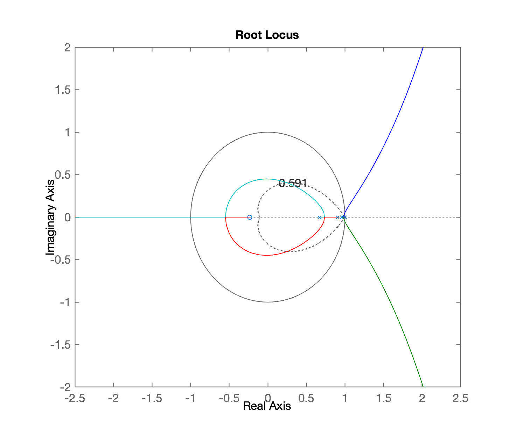
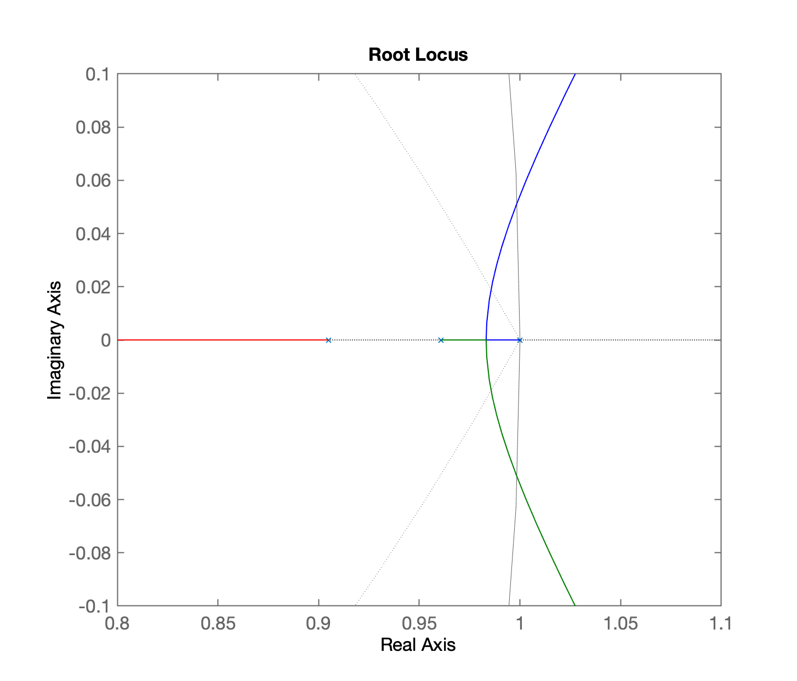
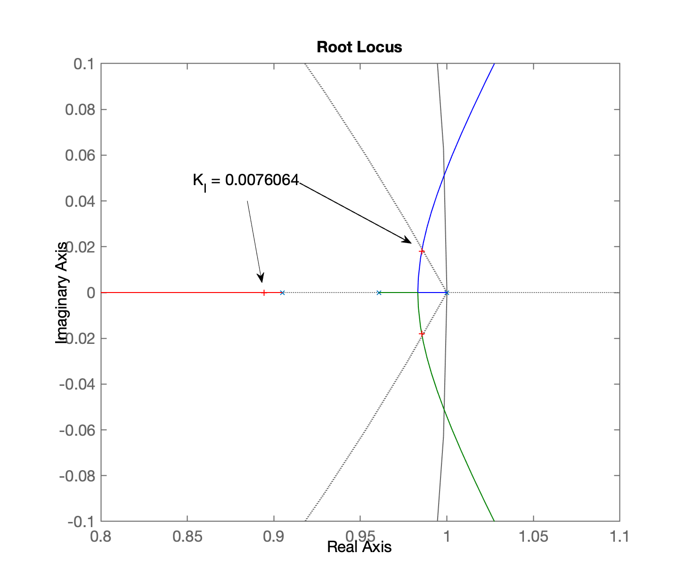
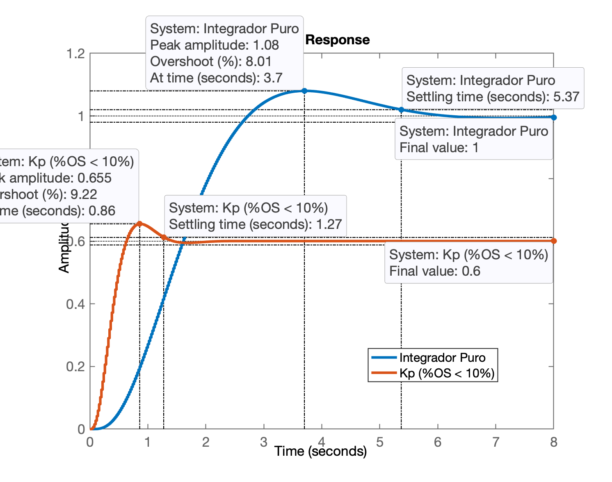

<!-- title: Controle com Ação Integral -->


<font size="2">  
Camino de Sa Punta Rasa, 07860, Islas Baleares, Spain., https://unsplash.com/pt-br/@droberobert.
</font>

# Projeto de Controladores

Continuação da aula anterior, de [15/09/2023](aula_15092023.html) ✍🏻.

> Para continuar os trabalhos da aula anterior, no Matlab:
>
> `>> load planta`

## Controladores com Ação Integral

Ação integral no plano-$z$:

$I(z)=\dfrac{K(.)}{(z-1)}$

Note o pólo em $z=1$.

### Testando controlador Integrador Puro

Equação:

$C_I(z)=\dfrac{K_i}{(z-1)}$

Executando o projeto deste controlador no Matlab:

```matlab
>> C_I = tf(1, [1 -1], T)

C_I =
 
    1
  -----
  z - 1
 
Sample time: 0.02 seconds
Discrete-time transfer function.

>> ftma_I = C_I*BoG;
>> zpk(ftma_I)
 
      0.00046711 (z+3.27) (z+0.2335)
  --------------------------------------
  (z-1) (z-0.9608) (z-0.9048) (z-0.6703)
 
Sample time: 0.02 seconds
Discrete-time zero/pole/gain model.

>> figure; rlocus(ftma_I)
>> 
>> % Usando o critério de ação de controle,
>> % limitando o $\%OS$ em 10%.
>> 
>> hold on; zgrid(zeta,0)
>> 
>> % Realizando um "zoom" na região de interesse
>> 
>> axis equal
>> axis([-2.5 2.5 -2 2])
```

Obtemos o seguinte RL para este controlador:



Melhorando o zoom anterior... tentando se concentrar na região com pólos dominantes próximos do círculo unitário (em $z=1$):

```matlab 
>> % Melhorando o zoom anterior...
>> 
>> axis([0.8 1.1 -0.2 0.2])
>> axis([0.8 1.1 -0.1 0.1])
```

Obtemos então:



Realizando o ajuste do controlador (ou "sintonizando" o controlador):

```matlab 
>> [K_I,polosMF_I] = rlocfind(ftma_I)
Select a point in the graphics window
selected_point =
      0.98629 +   0.017811i
K_I =
    0.0076064
polosMF_I =
      0.98541 +    0.01802i
      0.98541 -    0.01802i
      0.89425 +          0i
      0.67089 +          0i
```

Ou seja, o RL final ressaltando o ganho adotado aparece na próxima figura:
 

 
Fechando a malha:

```matlab 
>> ftmf_I = feedback(K_I*ftma_I, 1);
>> figure; step(ftmf_I, ftmf_K_OS10);
>> legend('Integrador Puro', 'Kp (%OS < 10%)')
```

E então obtemos a seguinte resposta em MF para entrada degrau unitário:



```Matlab
>> stepinfo(ftmf_I)

        RiseTime: 1.68
    SettlingTime: 5.38
     SettlingMin: 0.90063
     SettlingMax: 1.0801
       Overshoot: 8.0065
      Undershoot: 0
            Peak: 1.0801
        PeakTime: 3.7
```

Repare no valor do ganho encontrado para o Integrador Puro, ele é muito baixo: $K_i = 0.0076064$.

Este valor é tão baixo que provavelmente é irrealizável. Ou vamos cair no problema da zona morta da planta sob controle (considerando não-linearidades num sistema).
 
A titulo de curiosidade

```matlab 
>> 5.37/1.27
ans =
       4.2283
```

Este controlador é 4,23 vezes mais lento que o controlador Proporcional.

Finalizando a seção de trabalho no Matlab:

```
>> save planta
>> diary off
```

----

[:musical_note:](https://soundcloud.com/blujmusic/in-2-u)

<font size="2">  Fernando Passold, em 22/09/2023 </font> 
