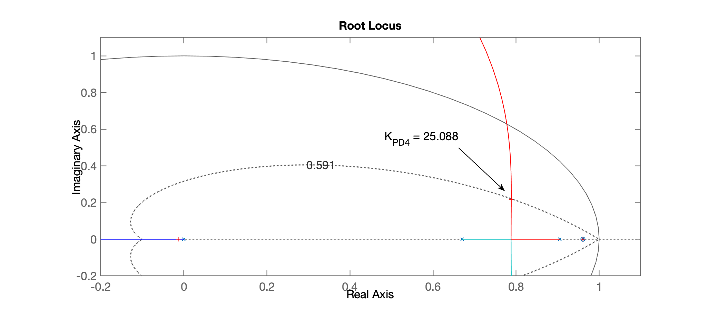
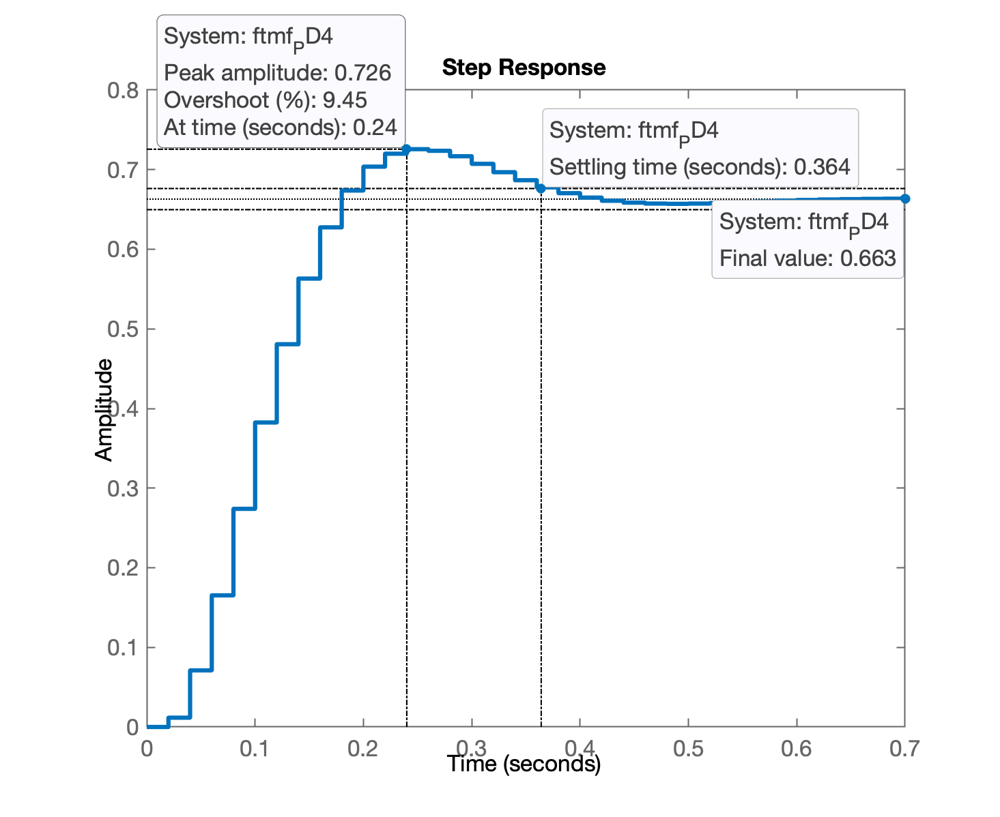
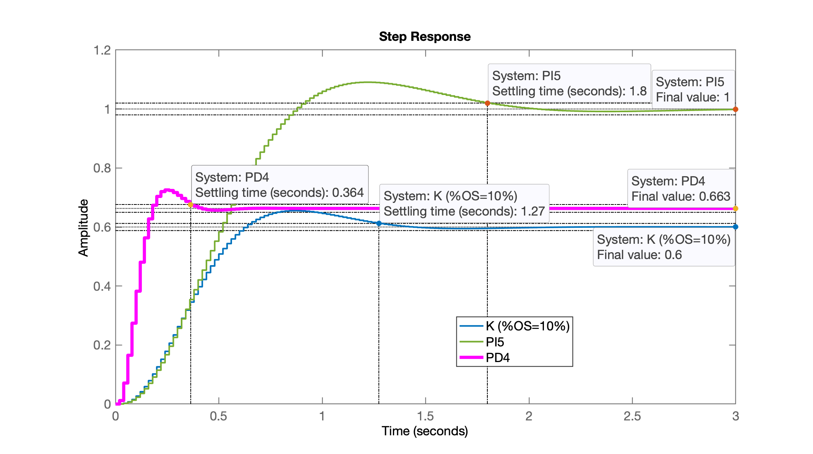
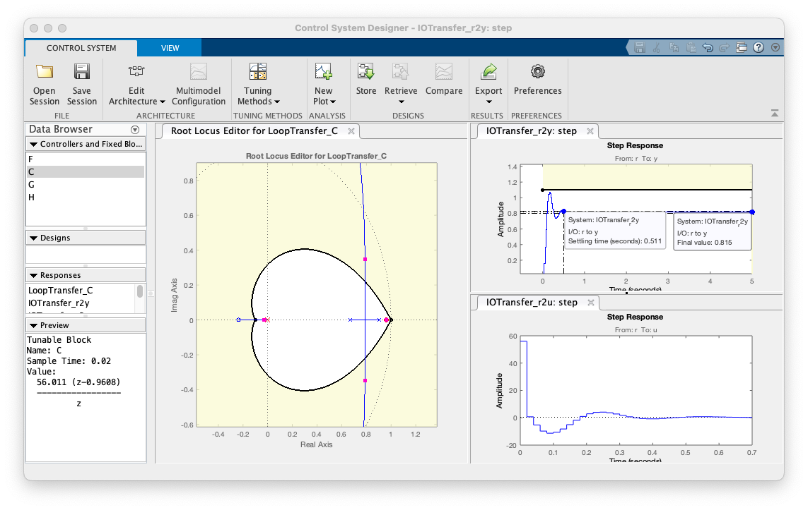

# Projeto Controladores Ação Derivativa

- [Projeto Controladores Ação Derivativa](#projeto-controladores-ação-derivativa)
  - [Reiniciando seção de trabalho](#reiniciando-seção-de-trabalho)
  - [Projeto de PD1](#projeto-de-pd1)
  - [Melhoras com App Control System Designer](#melhoras-com-app-control-system-designer)
  - [Encerrando atividades](#encerrando-atividades)


## Reiniciando seção de trabalho

Recomeçando as atividades, desde a aula de [29/09/2023](aula_29092023.html):

```matlab
>> diary aula_27oct2023.txt    % iniciando outro registro das atividades
>> pwd                         % diretório atual de trabalho
ans =
    '/Volumes/DADOS/fpassold (DADOS)/Documents/UPF/Controle_3/2023_2'

>> load planta                 % recupera dados aula passada
```

## Projeto de PD1

> Referência: [Projeto de Controlador PD (Aula de 28/05/2020):](https://fpassold.github.io/Controle_3/projeto_PD_lead_2020.html)

Lembrando da eq. do PD:

$C_{PD}(z) = K_p \left( \dfrac{ z - \left( \dfrac{K_d/T}{K_p} \right)}{z} \right)$

ou em resumo:

$C_PD(z) = K \left( \dfrac{z-z_{PD}}{z} \right)$

**Incógnita**: zero do PD: $z_{PD}$.

Lembrando da eq. da planta:

```matlab
>> zpk(BoG)

ans =
 
   0.00046711 (z+3.27) (z+0.2335)
  --------------------------------
  (z-0.9608) (z-0.9048) (z-0.6703)
 
Sample time: 0.02 seconds
Discrete-time zero/pole/gain model.
```

Segue "estudo de casos" para localização do zero do PD.

Podemos alocar o zero do PD nas seguintes opções:

* $0.9608 < z_{PD} < 1$ (entre o pólo + lento da planta e o círculo unitário);
* $0.9048 < z_{PD} < 0.9608$ (entre os 2 pólos + lentos da planta);
* $0.6703 < z_{PD} < 0.9048$ (entredo os 2 pólos + "internos" da planta);

Podemos esboçar RL's para tentar prever o comportamento do sistema em MF:

% 

Analisando as figuras, percebemos uma ==4a-opção mais interessante==, que seria tentar anular o pólo mais lento da planta usando o zero do PD. Neste caso, os "próximos" pólos à partir dos quais partiriam novas curvas do RL, seriam, as que que partem dos outros 2 pólos mais "iternos" da planta, com ponto de partida entre $z=0.6703$ e $z=0.9048$, o que parece render pólos de MF mais distantes (e consequentemente, mais rápidos) que nas outras opções avaliadas anteriormente. Esta opção é ainda mais interessante porque, cancelando um dos pólos do sistema, estamos reduzindo sua complexidade (reduzindo a ordem do sistema, de 4a-ordem para 3a-ordem).

```matlab
>> % Extraíndo o dado do polo mais lento
>> [numd,dend]=tfdata(BoG,'v')
numd =
            0   0.00046711    0.0016366   0.00035661
dend =
            1      -2.5359       2.1199     -0.58275
>> polos_BoG=roots(dend)
polos_BoG =
      0.96079
      0.90484
      0.67032
>> % Ou poderíamos simplesmente ter feito:
>> polos_BoG=pole(BoG)
polos_BoG =
      0.96079
      0.90484
      0.67032
>> % Note, o polo que nos interessa é o 1o do vetor polos_BoG()
polos_BoG(1)
ans =
      0.96079
>> % Motando a eq. do PD
>> PD4=tf([1 -polos_BoG(1)], [1 0], T)

PD4 =
 
  z - 0.9608
  ----------
      z
 
Sample time: 0.02 seconds
Discrete-time transfer function.

>> % continuando com os cálculos...
>> ftma_PD4 = PD4*BoG;    % Verificando o cancelamento...
zpk(ftma_PD4)
 
  0.00046711 (z+3.27) (z-0.9608) (z+0.2335)
  -----------------------------------------
     z (z-0.9608) (z-0.9048) (z-0.6703)
 
Sample time: 0.02 seconds
Discrete-time zero/pole/gain model.
```

Note o que está acontecendo:

$\text{ftma\_PD4} = \dfrac{0.00046711 (z+3.27) \cancel{(z-0.9608)} (z+0.2335)}{z \cancel{(z-0.9608)} (z-0.9048) (z-0.6703)}$

Podemos forçar este cancelamento no Matlab usando a função `minreal()`:

```matlab
>> ftma_PD4r = minreal(ftma_PD4);
zpk(ftma_PD4r)

ans =
 
  0.00046711 (z+3.27) (z+0.2335)
  ------------------------------
     z (z-0.9048) (z-0.6703)
 
Sample time: 0.02 seconds
Discrete-time zero/pole/gain model.
```

Continuando com os cálculos:

```matlab
>> rlocus(ftma_PD4)
>> hold on; zgrid(zeta,0)
>> axis ([-0.2 1.1 -0.2 1.1])    % "zoom" na área de interesse
>> [K_PD4,polosMF_PD4] = rlocfind(ftma_PD4)
Select a point in the graphics window
selected_point =
      0.78928 +    0.21702i
K_PD4 =
       25.088
polosMF_PD4 =
      0.96079 +          0i
      0.78841 +    0.21702i
      0.78841 -    0.21702i
     -0.01338 +          0i
```

Desta forma, obtivemos o seguinte RL, mostrando o ganho adotado e locais dos outros pólos de MF:



Continuando...

```matlab
K_PD = 25;
ftmf_PD4 = feedback(K_PD4*ftma_PD4, 1);
figure; step(ftmf_PD4)
stepinfo(ftmf_PD4)
ans = 

        RiseTime: 0.12
    SettlingTime: 0.38
     SettlingMin: 0.6275
     SettlingMax: 0.72566
       Overshoot: 9.4498
      Undershoot: 0
            Peak: 0.72566
        PeakTime: 0.24
>> erro_PD4 = (1 - dcgain(ftmf_PD4))/1*100
erro_PD4 =
       33.699
```

Segue gráfico da resposta do sistema em MF para entrada degrau unitário:



Comparando esta resposta com outros controladores

```matlab
>> figure; step(ftmf_K_OS10, ftmf_PI5, ftmf_PD4)
>> legend('K (%OS=10%)', 'PI5', 'PD4')
```



<!-- pausa para 2a-parte da aula
save planta
diary off
-->

Continuando...

## Melhoras com App Control System Designer

Simulando um caso mais real, sem o cancelamento pólo-zero.

Na prática, vamos nos aproximar mais do caso 2. Neste caso: $0.9048 < z_{PD} < 0.9608$.

Usando o **App do Control System Designer** para verificar este resultado (e outros).

Obs.: Arquivo do projeto neste App: [ControlSystemDesignerSession_PD4.mat](ControlSystemDesignerSession_PD4.mat)

Note que aumentamos o ganho do PD4 para $K_{PD4} \cong 56$, para limitar o $\%OS$ em 10% em relação à referência (degrau unitário), mas às custas de maiores amplitudes para a ação de controle, e um aumento no $t_s$ em relação à primeira versão do PD4. Veja figura à seguir:



## Encerrando atividades

```matlab
>> save planta
>> diary off
```

---

Fernando Passold, em 27/10/2023.
