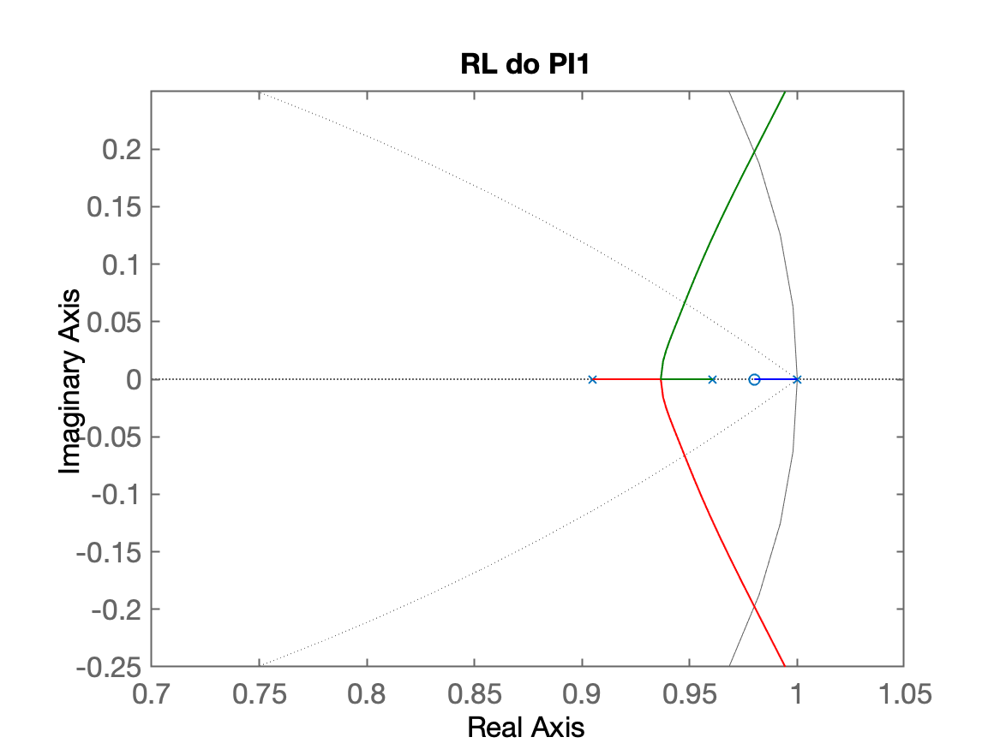
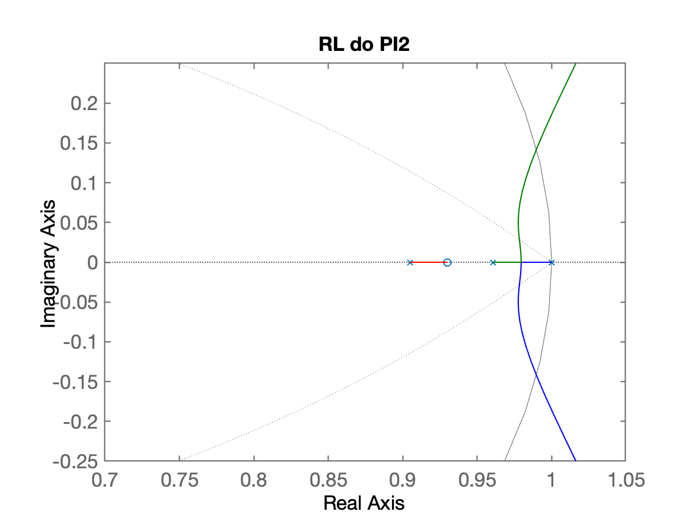
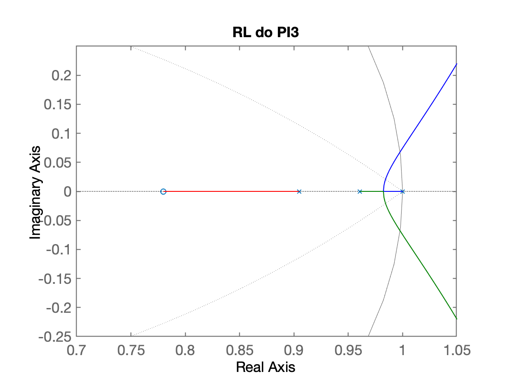
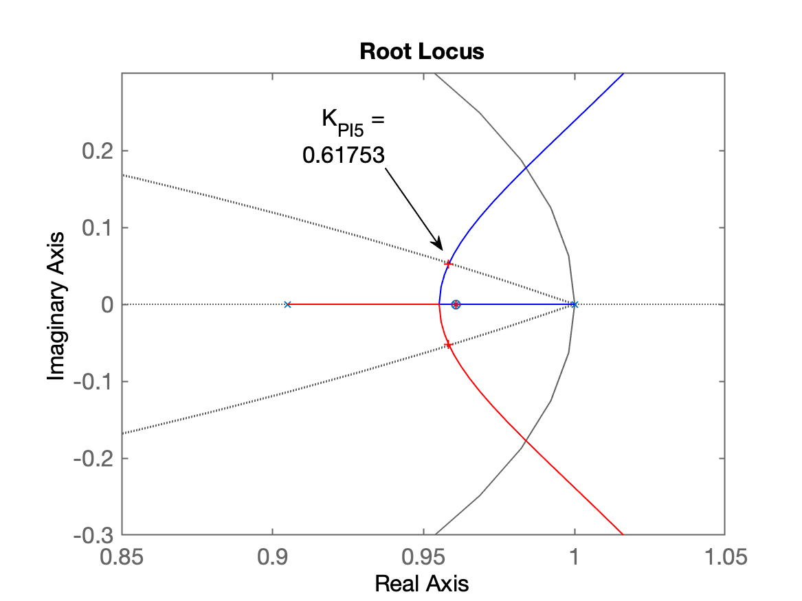
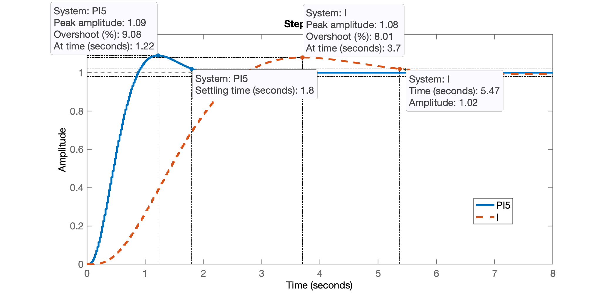
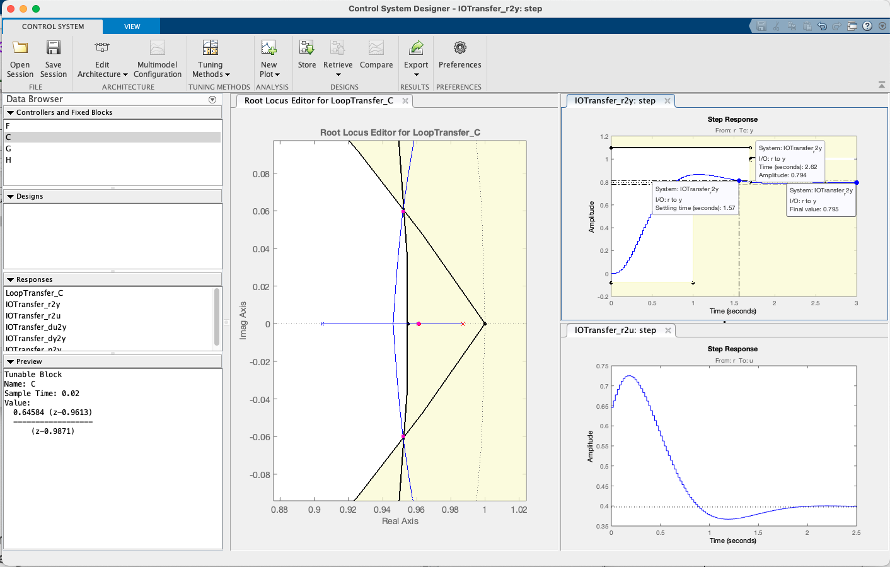

<!-- title: Projeto Controladores -->
# Projeto de Controladores

## Projeto de PI

O diagrama em blocos do PI é mostrada na [aula de 14/05/2020](https://fpassold.github.io/Controle_3/aula_14_05_2020.html):


A equação geral do PI é:

$C_{PI}(z)=\dfrac{K_{PI}(z-z_{PI})}{(z-1)}$

Nossa única incógnita é a posição do zero do PI: $z_{PI}$.

Lembrando da nossa planta:

```Matlab
>> load planta.mat             % carregando dados das aulas passadas    
>> zpk(BoG)
 
   0.00046711 (z+3.27) (z+0.2335)
  --------------------------------
  (z-0.9608) (z-0.9048) (z-0.6703)
 
Sample time: 0.02 seconds
Discrete-time zero/pole/gain model.

>> pzmap(BoG)                  % verificando local dos polos e zeros
>> axis equal                  % círculo unitário sem distorção
>> axis([0.5 1.05 -0.5 0.5])   % zoom na região de interesse
```

Avaliando 3 opções diferentes de zero para o PI:

```Matlab
>> PI1=tf([1 -0.98],[1 -1])    % Caso 1) 0,9608 < z_PI < 1

PI1 =
 
  s - 0.98
  --------
   s - 1
 
Continuous-time transfer function.

>> % Ops.... Não estamos mais no plano-s...
>> PI1=tf([1 -0.98],[1 -1],T)  % Caso 1) 0,9608 < z_PI < 1

PI1 =
 
  z - 0.98
  --------
   z - 1
 
Sample time: 0.02 seconds
Discrete-time transfer function.

>> PI2=tf([1 -0.93],[1 -1],T)  % Caso 2) 0.9048 < z_PI < 0,9608

PI2 =
 
  z - 0.93
  --------
   z - 1
 
Sample time: 0.02 seconds
Discrete-time transfer function.

>> PI3=tf([1 -0.78],[1 -1],T)  % Caso 2) 0.6703 < z_PI < 0.9048

PI3 =
 
  z - 0.78
  --------
   z - 1
 
Sample time: 0.02 seconds
Discrete-time transfer function.

>> % Plotando os RL das FTMAs resultantes para cada caso:
>> ftma_PI1=PI1*BoG;
>> ftma_PI2=PI2*BoG;
>> ftma_PI3=PI3*BoG;
>> figure; rlocus(ftma_PI1); hold on; zgrid(zeta,0); axis([0.5 1.05 -0.5 0.5])
>> title('RL do PI1')
>> figure; rlocus(ftma_PI2); hold on; zgrid(zeta,0); axis([0.5 1.05 -0.5 0.5])
>> title('RL do PI2')
>> figure; rlocus(ftma_PI3); hold on; zgrid(zeta,0); axis([0.5 1.05 -0.5 0.5])
>> title('RL do PI3')
>> % realizando o mesmo zoom nos 3 RLs obtidos
>> % lembrar de apontar com o mouse cada janela para focar em cada RL
>> axis([0.7 1.05 -0.25 0.25])    % para RL do PI1
>> axis([0.7 1.05 -0.25 0.25])    % para RL do PI2
>> axis([0.7 1.05 -0.25 0.25])    % para RL do PI3
```

Gráficos dos 3 RL's:

| RL PI1 | RL PI2 |
| :---: | :---: |
|  |  |
| RL PI3 |   |
|  |   |

**Comentários**

* O PI1 não parece ser boa opção pelo pólo de MF real entre $0.98 < z < 1$.
* Os polos de MF complexos dominantes do PI2 e PI3 estão em locais semelhantes.
* O "raio" $r_2$ (distância da origem do plano-z até o polo complexo de MF, caso do PI2) é ligeiramente menor que $r_2$ ($r \propto t_s$). 
* O "raio" $r_2$ é ligeiramente menor que $r_3$ ($r \propto t_s$). 

Repare na ordem final (complexidade) do sistema para os 3 casos:

```Matlab
zpk(ftma_PI1) % repare na ordem do sistema
 
  0.00046711 (z+3.27) (z-0.98) (z+0.2335)
  ---------------------------------------
  (z-1) (z-0.9608) (z-0.9048) (z-0.6703)
 
Sample time: 0.02 seconds
Discrete-time zero/pole/gain model.
```

## Novas propostas de PI

Considerando o estudo anteiror realizado:

* Vamos propor o PI4, com um zero entre $0.96 < z < 0.98$, mas provavelmente este zero vai trair também os pólos complexos dominantes, atrasando a respota em MF
* PI5: e se colocamos seu zero exatamente sobre o polo mais lento da planta?</br>Tentando realizar deliberadamente o que chamamos de "cancelamento par polo-zero".

Lembrando que um cancelamento par polo-zero é antes de tudo, uma situação hipotética, difícil de ser obtida na prática.

**Mas...** note que desta forma, como o PI5 realiza o cancelamento do pólo mais lento da planta, vai implicar em "==redução da complexidade do sistema==", ou seja, a ordem do sistema reduz de 4a para 3a-ordem:

```Matlab
>> zpk(BoG)

ans =
 
   0.00046711 (z+3.27) (z+0.2335)
  --------------------------------
  (z-0.9608) (z-0.9048) (z-0.6703)
 
Sample time: 0.02 seconds
Discrete-time zero/pole/gain model.

>> polos_MA = pole(BoG)
polos_MA =
      0.96079
      0.90484
      0.67032
>> PI5 = tf([1 -polos_MA(1)], [1 -1], T)

PI5 =
 
  z - 0.9608
  ----------
    z - 1
 
Sample time: 0.02 seconds
Discrete-time transfer function.

>> ftma_PI5=PI5*BoG;
>> zpk(ftma_PI5)      % Verificando o resultado (cancelamento) obtido    
 
  0.00046711 (z+3.27) (z-0.9608) (z+0.2335)
  -----------------------------------------
   (z-1) (z-0.9608) (z-0.9048) (z-0.6703)
 
Sample time: 0.02 seconds
Discrete-time zero/pole/gain model.

>> % Ou forçando o calcelamento no Matlab, usando a função minreal(.) do Matlab:
>> ftma_PI5b=minreal(ftma_PI5,1E-5);
>> zpk(ftma_PI5b)

ans =
 
  0.00046711 (z+3.27) (z+0.2335)
  ------------------------------
   (z-1) (z-0.9048) (z-0.6703)
 
Sample time: 0.02 seconds
Discrete-time zero/pole/gain model.

>> figure; rlocus(ftma_PI5); hold on; zgrid(zeta,0)
>> axis([0.85 1.05 -0.3 0.3])               % zoom na região de interesse
>> [K_PI5,polosMF_PI5]=rlocfind(ftma_PI5)   % sintonizando controlador
Select a point in the graphics window
selected_point =
      0.95829 +   0.052012i
K_PI5 =
      0.61753
polosMF_PI5 =
      0.95827 +   0.052015i
      0.95827 -   0.052015i
      0.96079 +          0i
      0.65832 +          0i
```

RL para o PI ressaltando ponto com o ganho adotado:



Fechando a malha... e comparando resultado com integrador puro.

```Matlab
>> ftmf_PI5 = feedback(K_PI5*ftma_PI5, 1);
>> figure; step(ftmf_PI5, ftmf_I)
>> legend('PI5', 'I')
```



```Matlab
>> stepinfo(ftmf_PI5)

        RiseTime: 0.56
    SettlingTime: 1.8
     SettlingMin: 0.91418
     SettlingMax: 1.0908
       Overshoot: 9.0757
      Undershoot: 0
            Peak: 1.0908
        PeakTime: 1.22
```

<!-- indo para 2a-parte da aula
save planta.mat
diary off
-->

## Projeto usando App Control System Designer

Continuando projeto, usando App Control System Designer...

```Matlab
>> zpk(PI1)

ans =
 
  (z-0.98)
  --------
   (z-1)
 
Sample time: 0.02 seconds
Discrete-time zero/pole/gain model.

>> % A variável abaixo foi exportada à partir do App Control System Designer:
>> zpk(C_PI8)

ans =
 
  0.51156 (z-0.9646)
  ------------------
        (z-1)
 
Name: C
Sample time: 0.02 seconds
Discrete-time zero/pole/gain model.
```

## Projeto de Lag

Note que a equação de um controlador por Atraso de Fase ("Lag") é simular ao de um PI:

$C_{Lag}(z)=\dfrac{K(z-z_{Lag})}{(z-p_{Lag})}$

O que muda é que o polo de um PI sempre está em $z=1$ e no caso do Lag, vai estar próximo de 1, mas não será igual à 1 ($p_{Lag} \ne 1$ mas $p_{Lag} \cong 1$).

Exemplo de projeto de Controlador por Atraso de Fase (Lag) usando App Control System Designer:



Os dados deste controlador exportados para a variável `Lag`, rende:

```Matlab
>> zpk(Lag)

ans =
 
  0.64584 (z-0.9613)
  ------------------
      (z-0.9871)
 
Name: C
Sample time: 0.02 seconds
Discrete-time zero/pole/gain model.
```

**Considerações**:

Repare que a medida que o pólo do Lag se afasta do círculo unitário, o $e(\infty)$ aumenta. Note que estamos com o polo do Lag valendo aproximadamente $z = 0,99$.

E como foi visto, pode-se acrescentar na janela do RL e na janela da resposta ao degrau, os requisitos de controle desejados para a esta planta, como $\%OS \le 10\%$ e $t_s \le 1,7$ segundos.

**Cuidado** para não "==inverter==" a posiçao do pólo do Lag com o zero do mesmo. Se o valor do pólo do Lag for menor que o valor do seu zero, significa que você não está mais realizando o projeto de um Controlador Lag (por Atraso de Fase), e sim outro controlador, com outras propriedades (e outros objetivos) que seria o "Lead", controlador por Avanço de Fase.

---

Encerrando atividades nesta aula:

```Matlab
>> save planta.mat
>> diary off
>> quit
```

---

**Anexo**: Caso a janela de propriedades de um gráfico no Matlab se abra em branco:</br>
Ver: [Property inspector can not be used any more on mac](https://la.mathworks.com/matlabcentral/answers/486208-property-inspector-can-not-be-used-any-more-on-mac)

---

Fernando Passold, em 29/09/2023
