# Projeto de Controladores

Aula de 03/04/2024 (continuação da [aula de 27/03/2024](aula_27032024.html)).

Recuperando seção de trabalho anterior no Matlab:

```matlab
>> cd .. 			% chaveando Matlab até pasta desejada
>> load planta 		% recuperando dados antigos
```

<!--
pwd
ans =
    '/Volumes/DADOS/Users/fpassold/Documents/UPF/Controle_3/2024_1'
-->

**Teoria**: Continuando da página: [aula de 05/05/2021](https://fpassold.github.io/Controle_3/2021_1/aula_05_05_2021.html), terminando projeto de PI.

## Projeto de PI

Selecionando posição do zero do PI.

Lembrando da eq. da planta:

```matlab
>> zpk(BoG)

  0.00012224 (z+2.747) (z+0.1903)
  --------------------------------
  (z-0.9048) (z-0.8187) (z-0.3679)

Sample time: 0.1 seconds
Discrete-time zero/pole/gain model.
```

Analisando 3 opções (e já ingressando os dados no Matlab):

```matlab
>> % opção 1) pólo mais lento da planta < zero <  pólo integrador
>> C_PI1=tf([1 -0.95], [1 -1], T)

C_PI1 =

  z - 0.95
  --------
   z - 1

Sample time: 0.1 seconds
Discrete-time transfer function.

>> % Opção 2) Colocar o 0,8187 < zero_PI < 0,9048 (entre os 2 pólos mais lentos da planta)
>> C_PI2=tf( [1 -0.85] , [1 -1], T)

C_PI2 =

  z - 0.85
  --------
   z - 1

Sample time: 0.1 seconds
Discrete-time transfer function.

>> % Opção 3) Colocar  o zero do PI sobre o
>> % pólo mais lento da planta (anulando este polo)
>>
>> polos=pole(BoG)
polos =
      0.90484
      0.81873
      0.36788
>> C_PI3=tf( [1 -polos(1)] , [1 -1], T)

C_PI3 =

  z - 0.9048
  ----------
    z - 1

Sample time: 0.1 seconds
Discrete-time transfer function.

>> % calculando as FTMA(z)'s para depois obter o RL...
>> ftma_PI1=C_PI1*BoG;
>> ftma_PI2=C_PI2*BoG;
>> ftma_PI3=C_PI3*BoG;
>> % Traçando os RL's
>> figure; rlocus(ftma_PI1); hold on; zgrid(zeta, 0)
>> title('RL ftma\_PI1')
>> figure; rlocus(ftma_PI2); hold on; zgrid(zeta, 0)
>> title('RL ftma\_PI2')
>> figure; rlocus(ftma_PI3); hold on; zgrid(zeta, 0)
>> title('RL ftma_PI3')
>> % aplicando o mesmo "zoom" nas 3 figuras anteriores
>> % implicar dar os seguintes comandos com foco em cada
>> % janela diferente
>> axis([0.2 1.1 -0.1 0.5])
>> axis([0.2 1.1 -0.1 0.5])
>> axis([0.2 1.1 -0.1 0.5])
```

Vamos obter os seguintes resultados:

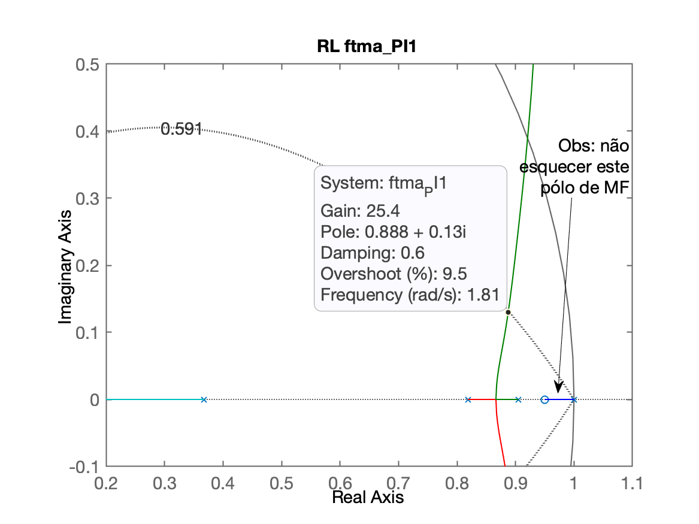

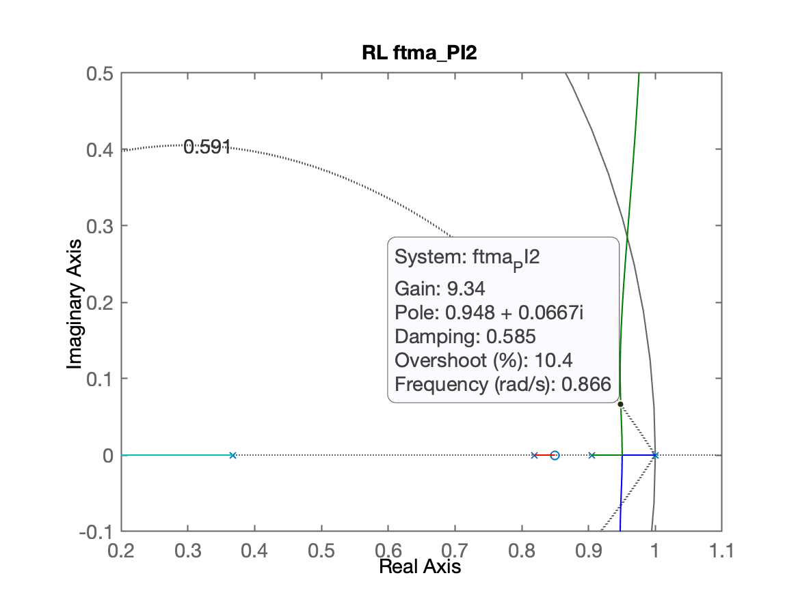

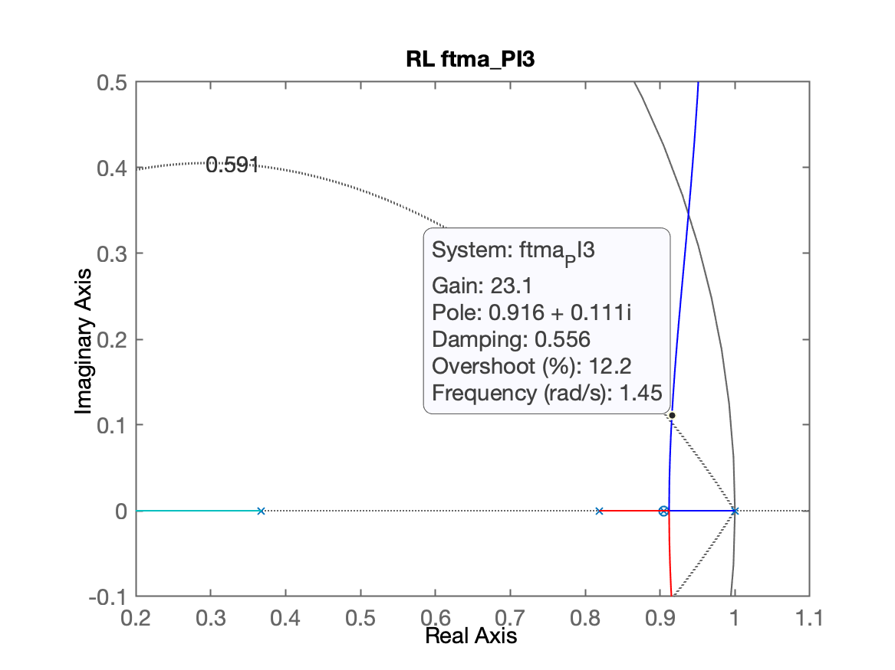

Sugere-se acomodar as 3 figuras lado a lado na tela para comparar os resultados obtidos e perceber a melhor opção.

Nesta caso, as opções mais "promissoras" seriam as opções 1 e 3:

```matlab
>> ftmf_PI1=feedback(25*ftma_PI1, 1);
>> ftmf_PI3=feedback(23*ftma_PI3, 1);
>> figure; step(ftmf_PI1);
>> title('step ftmf\_PI1')
>> figure; step(ftmf_PI3);
>> title('step ftmf\_PI3')
```

E obtemos então as seguintes respostas ao degrau:

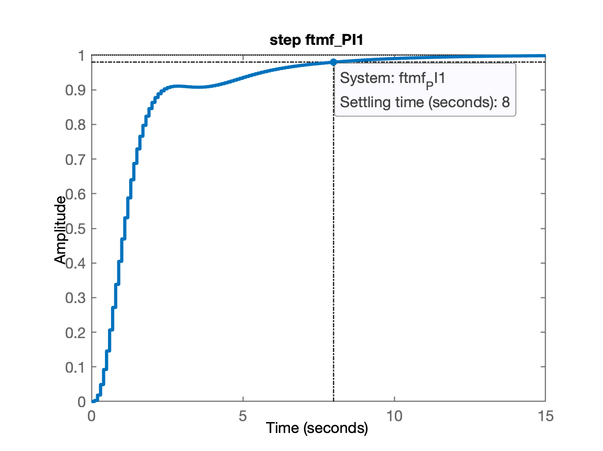

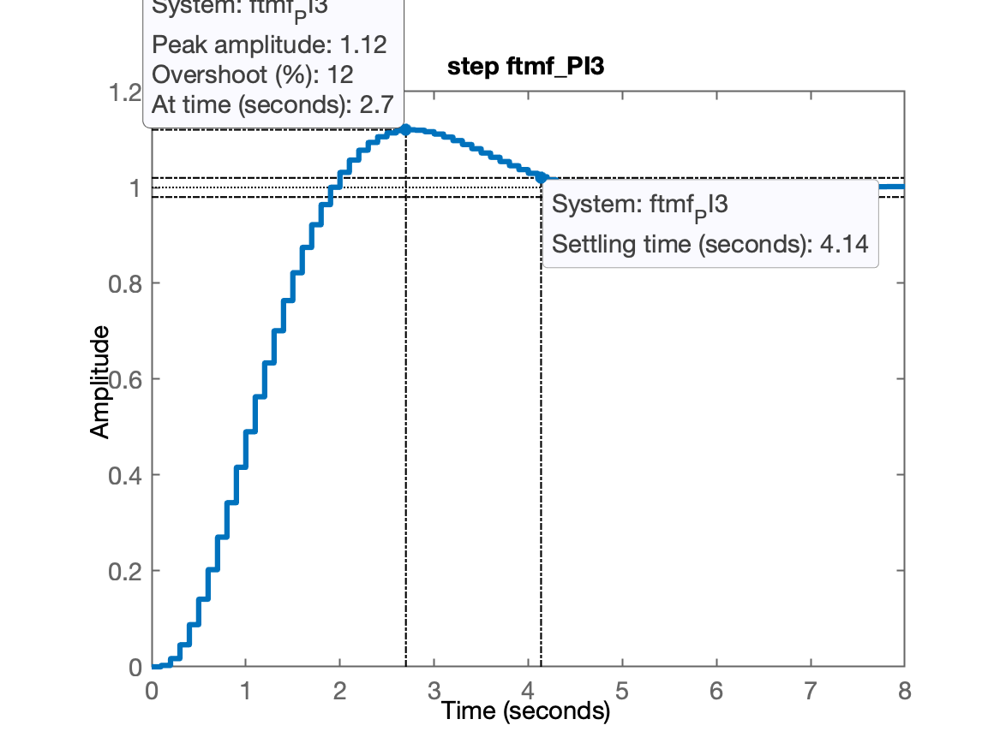

O PI3 parece ser a melhor opção... mas...

Vamos aproveitar a fechar a malha para o PI2 também:

```matlab
>> ftmf_PI2=feedback(9*ftma_PI2, 1);
>> figure; step(ftmf_PI2);
>> title('step ftmf\_PI2')
```

Resposta ao degrau obtida para PI2:

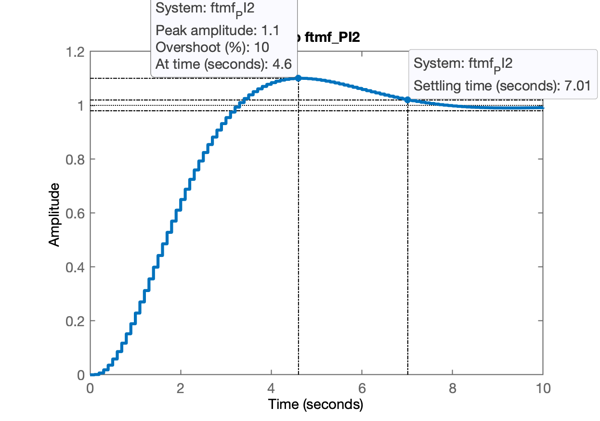

**Conclusão**: excetuando a opção 3 que depende de um cancelamento perfeito de polo-zero, a melhor opção de PI aqui seria o PI2.

O PI2 responde mais rápido que o PI1, seu ganho é menor, o que significa que gera amplitudes da ação de controle menores do que o PI1.

Levantando as amplitudes das ações de controle...

Deduzindo a eq. para $U(z)$ e $u[kT]$...

Lembrando de [Como usar a função `step()` do Matlab para plotar $u(t)$ e $e(t)$](https://fpassold.github.io/Controle_2/Acoes_Controle_Erro/acoes_controle_erro.html), adaptamos para o caso no plano-z e teremos que:

$U(z)=\left[ \dfrac{C(z)}{1+C(z)\cdot BoG(z)} \right] \cdot R(z)$

Então só precisamos "isolar" a expressão acima entre $[ \cdot ]$ e repassá-la como argumento de entrada para função `step()` do Matlab:

```matlab
>> aux_PI1=(25*C_PI1)/(1+25*C_PI1*BoG);
>> zpk(aux_PI1) % só para conferência

  25 (z-1) (z-0.95) (z-0.9048) (z-0.8187) (z-0.3679)
  ---------------------------------------------------
  (z-1) (z-0.9641) (z-0.3498) (z^2 - 1.775z + 0.8037)

Sample time: 0.1 seconds
Discrete-time zero/pole/gain model.

>> aux_PI2=(9*C_PI2)/(1+9*C_PI2*BoG);
>> zpk(aux_PI2)

  9 (z-1) (z-0.9048) (z-0.85) (z-0.8187) (z-0.3679)
  --------------------------------------------------
  (z-1) (z-0.8317) (z-0.362) (z^2 - 1.897z + 0.9035)

Sample time: 0.1 seconds
Discrete-time zero/pole/gain model.

>> % repassando para funções step():
>> figure; step(aux_PI1); title('u[kT] do PI1')
>> figure; step(aux_PI2); title('u[kT] do PI2')
```

Obteremos os gráficos abaixo:

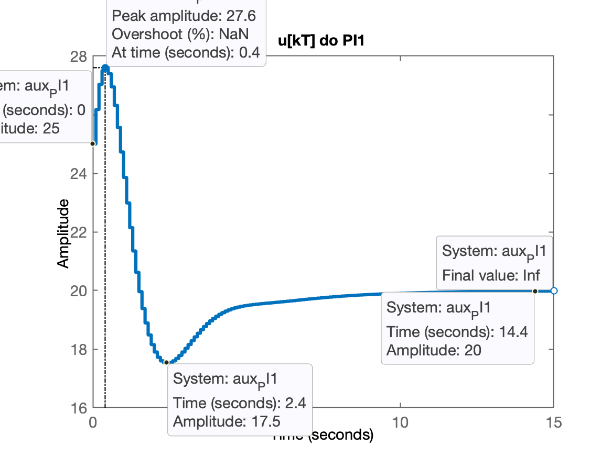

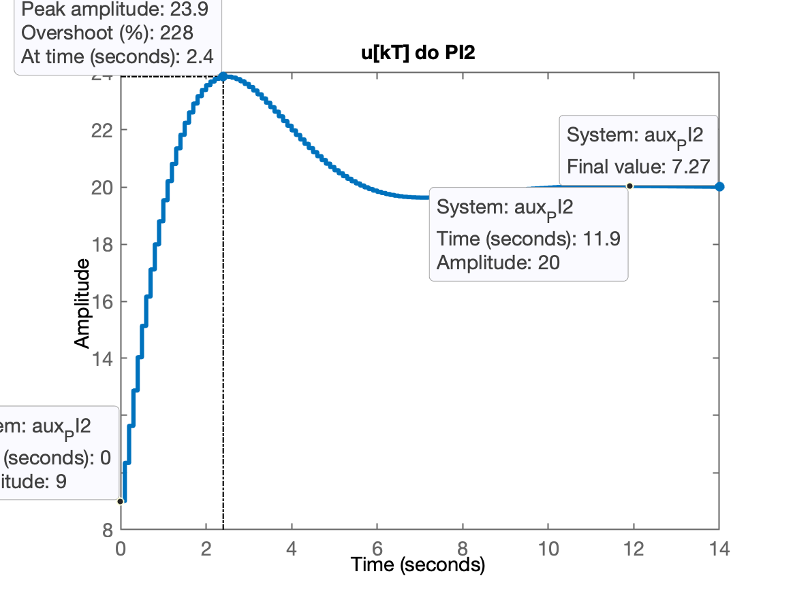

**Conclusão final**: o melhor PI e praticável seria o PI2. O PI2 é menos "agressivo" com a planta além de estabilizar relativamente rápido.

## Controlador Lag

Seria o controlador por atraso de fase.

Este controlador é similar ao PI com o detalhe de que seu pólo não está em $z=1$ mas próximo disto.

Projetando então um Lag similar ao PI2.

```matlab
>> % Revisando eq. do PI2
>> zpk(C_PI2)

  (z-0.85)
  --------
   (z-1)

Sample time: 0.1 seconds
Discrete-time zero/pole/gain model.

>> % Revisando eq. da planta
>> zpk(BoG)

  0.00012224 (z+2.747) (z+0.1903)
  --------------------------------
  (z-0.9048) (z-0.8187) (z-0.3679)

Sample time: 0.1 seconds
Discrete-time zero/pole/gain model.

>> C_Lag=tf( [1 -0.85] , [1 -0.95], T)

C_Lag =

  z - 0.85
  --------
  z - 0.95

Sample time: 0.1 seconds
Discrete-time transfer function.

>> ftma_Lag=C_Lag*BoG;
>> figure; rlocus(ftma_Lag); hold on; zgrid(zeta, 0)
>> axis([0.7 1.1 -0.1 0.5]) 	% zoom sobre a região de interesse
>> [K_Lag,polosMF]=rlocfind(ftma_Lag)
Select a point in the graphics window
selected_point =
      0.92133 +   0.095975i
K_Lag =
       12.862
polosMF =
      0.92133 +   0.095975i
      0.92133 -   0.095975i
      0.83822 +          0i
        0.359 +          0i
```

O RL para este controlador fica:

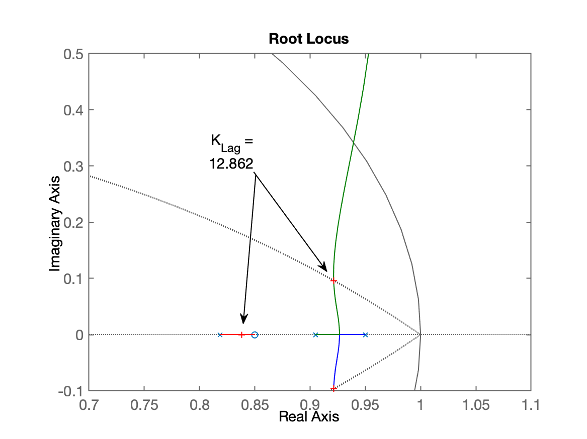

Continuando com o projeto:

```matlab
>> ftmf_Lag=feedback(13*ftma_Lag, 1);
>> K_Lag=13;
>> figure; step(ftmf_Lag, ftmf_PI2);	% comparando PI2 x Lag
>> legend('Lag', 'PI2')
```

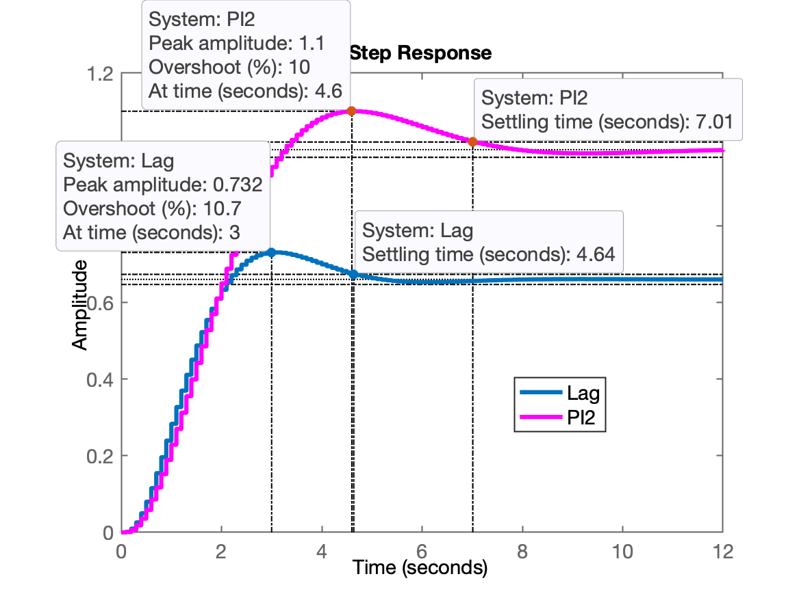

Notamos um erro considerável envolvendo o Lag:

```matlab
>> erro=((1-dcgain(ftmf_Lag))/1)*100
erro =
       33.898
```

Note que $y(max)$ para o Lag alcançou apenas 0,732 (poderia ter se aproximado mais de 1,1 ($\%OS \le 10\%$). Isto significa que posso aumentar o ganho do Lag para "subir" o valor máximo de $y[kT]$ ao mesmo tempo que isto reduziria o $e(\infty)$.

Poderia usar o App Control System Designer para encontar este valor de ganho:

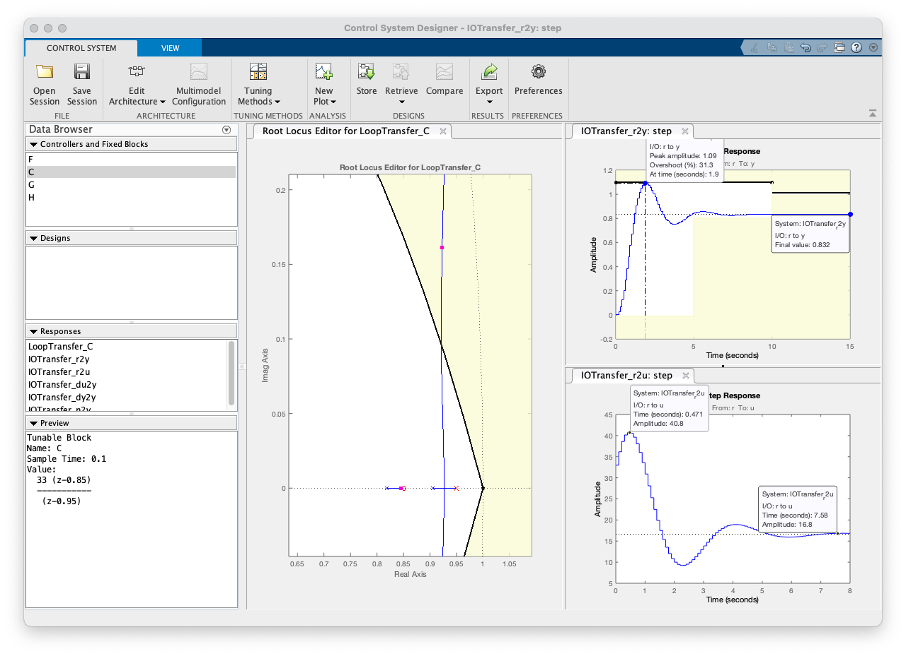

Usando esta ferramenta encontramos $K_{Lag}=33$ (arquivo:  [C_Lag-ControlSystemDesignerSession.mat](C_Lag-ControlSystemDesignerSession.mat) ).

Fim das atividades por hoje.

```matlab
>> save planta		% salvando dados para próxima seção de trabalho
>> diary off		% fechando diário de hoje
>> quit				% goodbye
```

Arquivo  [planta.mat](planta.mat) para algum eventual interessado. [🎉](https://youtu.be/DNvDPxwC5NY?si=N0_ovb9_6YxJi0W5) ou [:mushroom:](https://youtu.be/M6tLJTwcp1g?si=zpTGIK8qhA1rbM2U).

---

Fernando Passold, em 03/04/2024.
