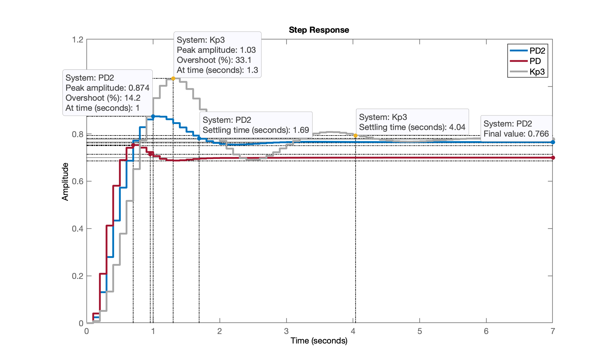

<font size="1">[Espécies de *Alyssum* são hiperacumuladores de níquel, que podem tolerar e absorver altos níveis de metais](https://thebulletin.org/2024/03/the-greenest-way-to-mine-metals-for-batteries-could-be-with-plants/)></font> 

# Projeto de Controladores com Ação Derivativa

Continuação da [aula de 03/04/2024](aula_03042024.html) - arquivos com dados: [planta.mat](planta.mat).

Teoria, ver:

* [Controle com ação derivativa](https://fpassold.github.io/Controle_3/Controle_Acao_Derivativa.html)
* [PD (Digital) com Filtro Derivativo](https://fpassold.github.io/Controle_3/pd_plus_filtro.pdf)
* [Aula de 28/05/2020](https://fpassold.github.io/Controle_3/projeto_PD_lead_2020.html)

Continuando da seção de trabalho anterior:

```matlab
>> load planta
>> zpk(BoG)

ans =
 
  0.00012224 (z+2.747) (z+0.1903)
  --------------------------------
  (z-0.9048) (z-0.8187) (z-0.3679)
 
Sample time: 0.1 seconds
Discrete-time zero/pole/gain model.
```

Baseado na discussão apresentada na [Aula de 28/05/2020](https://fpassold.github.io/Controle_3/projeto_PD_lead_2020.html), vamos testar a opção "b" (zero do PD entre os 2 pólos mais lentos da planta):

```matlab
>> z_PD = (0.9048+0.8187)/2
z_PD =
      0.86175
>> % C_PD=tf([], [], T)
>> C_PD=tf([1 -0.86], [1 0], T)

C_PD =
 
  z - 0.86
  --------
     z
 
Sample time: 0.1 seconds
Discrete-time transfer function.

>> ftma_PD = C_PD*BoG;
>> zpk(ftma_PD)
 
  0.00012224 (z+2.747) (z-0.86) (z+0.1903)
  ----------------------------------------
     z (z-0.9048) (z-0.8187) (z-0.3679)
 
Sample time: 0.1 seconds
Discrete-time zero/pole/gain model.

>> rlocus(ftma_PD);
>> OS                           % lembrando valor adotado
OS =
    10
>> zeta                         % veriricando valor usado
zeta =
      0.59116
>> hold on; zgrid(zeta,0)
>> % Sintonizando o PD
>> axis([0.2 1.1 -0.2 0.6])     % zoom na região de interesse
>> [K_PD,polosMF] = rlocfind(ftma_PD)
Select a point in the graphics window
selected_point =
      0.61694 +    0.32632i
K_PD =
        326.8
polosMF =
       0.8652 +          0i
      0.61459 +    0.32629i
      0.61459 -    0.32629i
    -0.042874 +          0i
>> K_PD = 333;                  % valor adotado
% fechando a malha
>> ftmf_PD = feedback(K_PD*ftma_PD, 1);
>> pole(ftmf_PD)                % por acaso, os pólos de MF
      0.86511 +          0i
      0.61453 +    0.33086i
      0.61453 -    0.33086i
    -0.043428 +          0i
```

RL resultante para este PD:


Fechando a malha...

```matlab
>> figure; step(ftmf_PD)
>> stepinfo(ftmf_PD)

        RiseTime: 0.3
    SettlingTime: 1
     SettlingMin: 0.68731
     SettlingMax: 0.75282
       Overshoot: 7.5782
      Undershoot: 0
            Peak: 0.75282
        PeakTime: 0.7
```

Resposta ao degrau unitário:


**Comentários**:

No gráfico, já se percebe um erro de regime permanente de $e[\infty]=30\%$.

Repare no valor máximo de $y[kT]=0,753$ - abaixo dos 1,0 da $r[\infty]$. Isto significa que poderia ter adotado um ganho maior para este PD.

Comparando esta resposta com o controlador proporcional sintonizado para $\%OS \le 10\%$ em relação à $r[\infty]=1,0$:

```matlab
>> figure; step(ftmf3, ftmf_PD)
>> legend('K_p', 'PD')
```


O PD proposto foi mais rápido que o controlador proporcional, mas... o erro de regime permanente é maior.

O PD conseguiu ser $4 \times$ mais rápido que o controlador Proporcional... Mas a um custo... repare no valor do seu ganho, $K_{PD}=333$, isto significa que $u[0]=333$.

Calculando as ações de controle...

```matlab
>> aux_Kp3 = K3/(1+K3*BoG);
>> aux_PD = (K_PD*C_PD)/(1+K_PD*ftma_PD)

aux_PD =
 
  333 z^5 - 982.8 z^4 + 1057 z^3 - 484.5 z^2 + 78.05 z
  ----------------------------------------------------
  z^5 - 2.051 z^4 + 1.459 z^3 - 0.3541 z^2 - 0.0183 z
 
Sample time: 0.1 seconds
Discrete-time transfer function.

>> figure; step(aux_Kp3, aux_PD)
>> axis([0 5 -50 350])
>> legend('K_p', 'PD')
>> title('Ação de Controle, u[kT]')
```


Repare no valor inicial das ações de controle:

```matlab
>> 333/70		% comparando u[0] de cada controlador
ans =
       4.7571
```


## Projeto de PD usando Contribuição Angular

Voltando para a página [Projeto de PD e Lead (aula de 28/05/2020)](https://fpassold.github.io/Controle_3/projeto_PD_lead_2020.html)...

Para realizar um projeto deste tipo necessitamos mais requisitos de controle, no caso, além do $\%OS$ (que permitiu determinar o $\zeta$), necessitamos algum critério temporal: $t_s$, $t_r$ ou $t_p$.

Vamos supor que desejamos:

* $\%OS \le 10\%$;
* $t_s \le 2$ segundos.

Com estes 2 dados, temos como calcular a posição desejada para o par de pólos complexos que num sistema de 2a-ordem em malha-fechada permite atingir estes critérios.

Vamos usar um script já disponibilizado em aulas anteriores, o [`angulos2.m`](https://fpassold.github.io/Controle_3/arc.m) (que também usa o script [`arc.m`](https://fpassold.github.io/Controle_3/arc.m)). Você pode realizar o download destas rotinas e colocar na pasta padrão do Matlab: `../Users/fpassold/Documents/MATLAB`.

```matlab
>> help angulos2
  programa para determinar contribui??o de ?ngulos
  Fernando Passold, em 16/out/2015
  Baseado em "example_9_4.m" de /UCV/Control/ (2009)
  PD or Lead Compensator Desing (NISE)
  
  Vari?veis que devem existir no Worspace
     (ou par?metros de entrada):
  'G' <-- G(s): eq. planta no mundo cont?nuo
  'T' <-- per?odo de amostragem ? ser adotado.
 
  Obs.: SCript vai pedir posi??o do p?lo do controlador
 
  Sa?das:
  real(polo_MFz) --> parte real do p?lo de MF no plano-z
  imag(polo_MFz) --> parte imagin?ria do p?lo de MF no plano-z
  C --> transfer function do controlador (sem o ganho)
  zc --> posi??o do zero encontrado para o controlador

>> edit angulos2.m          % para confirmar dados de entrada necessários...
```

Este script só exige que variáveis `G`, `T` e `BoG` estejam presentes para dar continuidade ao projeto:

```matlab
>> angulos2
PD/Lead Controller Design
In this version you should arbitrate the initial position of the POLE of C(z)

Plant (in s-plan) informed, G(s):
ans =
 
          1
  ------------------
  (s+10) (s+2) (s+1)
 
Continuous-time zero/pole/gain model.

Sampling time informed: T=0.1
Plant in discrete form, BoG(z):
ans =
 
  0.00012224 (z+2.747) (z+0.1903)
  --------------------------------
  (z-0.9048) (z-0.8187) (z-0.3679)
 
Sample time: 0.1 seconds
Discrete-time zero/pole/gain model.

Maximum overshoot desired (%OS), in %: ? 10
zeta (damping factor) should be: 0.5912
Enter desired settling time, t_s: ? 2

It results in the natural oscillation frequency, wn =  3.3832 (rad/s)
The MF poles (in the s-plane) should be located in:
2.0000 +/- j2.7288
Localization of MF poles in the z-plane should be:
z = 0.7884 +/- j0.2206

Enter the position of the controller pole (z-plane): ? 0
Working with the temporary FTMA(z)...
Open poles = 0
Open poles = 0.904837
Open poles = 0.818731
Open poles = 0.367879
Open zeros = -2.74711
Open zeros = -0.190308
Angular contribution of each pole in the z-plane:
 p1 = 0.0000 --> 15.63^o
 p2 = 0.9048 --> 117.81^o
 p3 = 0.8187 --> 97.82^o
 p4 = 0.3679 --> 27.68^o
Sum of angular contribution of poles: 258.95^o
Check the figure window -> Paused (enter to continue)...
Angular contribution of each zero in the z-plane:
 z1 = -2.7471 --> 3.57^o
 z2 = -0.1903 --> 12.70^o
Sum of angular contribution of zeros: 16.28^o
Final angle for the zero of C(z): 62.6736^o

Ok, determining the position for zero of C (z)...
Final position for the Lead zero: z_c=0.6744
Updating final RL graph...
The Lead controller final result is (variable C):
ans =
 
  (z-0.6744)
  ----------
      z
 
Sample time: 0.1 seconds
Discrete-time zero/pole/gain model.

>> axis([-3 1 -0.25 0.25])              % zoom com foco na janela da Contribuição angular
```

Ressaltando o gráfico da contribuição angular realizada para este caso:


```matlab
>> % Alterando foco para janela do RL
>> axis([-0.3 1.1 -0.2 0.7])
>> % Verificando variáveis retornadas por esta rotina:
>> zpk(C)           % eq. do PD
 
  (z-0.6744)
  ----------
      z
 
Sample time: 0.1 seconds
Discrete-time zero/pole/gain model.

>> zpk(ftma)        % FTMA(z) para este PD, usada para traçar o RL
 
  0.00012224 (z+2.747) (z-0.6744) (z+0.1903)
  ------------------------------------------
      z (z-0.9048) (z-0.8187) (z-0.3679)
 
Sample time: 0.1 seconds
Discrete-time zero/pole/gain model.

>> C_PD2 = C;       % "backup" da eq. do controlador na variavel C_PD2
>> ftma_PD2=ftma;   % "backup" da eq. da ftma deste controlador
>>
>> % sintonizando este PD
>> 
>> [K_PD2,polosMF]=rlocfind(ftma)   % aproveitando a janela do RL já criada por angulos2.m
Select a point in the graphics window
selected_point =
      0.78759 +    0.22065i
K_PD2 =
       200.66
polosMF =
      0.78829 +    0.22098i
      0.78829 -    0.22098i
      0.51538 +          0i
    -0.025036 +          0i
```

RL final deste PD monstrando o ganho adotado e pólos de MF:


Fechando a malha...

```matlab
>> ftmf_PD2 = feedback(K_PD2*ftma_PD2, 1);
>> figure; step(ftmf_PD2, ftmf_PD, ftmf3)       % já comparando 3 controladores
>> legend('PD2', 'PD', 'Kp3')
```



Este controlador (PD2) traz suas vantagens:

* menor ganho, o que significa menores amplitudes iniciais para a ação de controle (desejável);
* menor erro de regime permanente comparado ao primeiro PD;
* erro próximo ao do Controlador Proporcional, mas o dobro mais rápido (em termos de tempo de assentamento)

Outra opção para projeto do PD é usar o **App Control System Designer**.


## Controlador PD - versão 3

Partindo da eq. do último PD:

```matlab
>> zpk(C_PD2)
 
  (z-0.6744)
  ----------
      z
 
Sample time: 0.1 seconds
Discrete-time zero/pole/gain model.

>> K_PD2
K_PD2 =
       200.66
```

Executamos o App Control System Designer e importamos a planta desejada (G $\leftarrow$ BoG) e importamos a equação do controlador (C $\leftarrow$ C_PD2) -- tudo isto no momento de definir a Arquitetura do controlador.

Este projeto foi salvo no arquivo: [ControlSystemDesignerSession-PD3.mat](ControlSystemDesignerSession-PD3.mat) e resultou em:


Um novo projeto de PD3 colocando propositalmente o zero do PD sobre o 2o-pólo mais lento da planta. Isto vai acabar  resultando no **controlador mais rápido possível de ser adotado para a planta em questão**. Mas... note que o ganho deste controlador é ainda mais elevado: $K=561,44$ o que significa amplitudes iniciais para a ação de controle  bastante expressivas (ou impraticável na prática: saturatia um driver de potência num sistema real). Esta variação do projeto foi salvo no arquivo: [ControlSystemDesignerSession-PD3b.mat](ControlSystemDesignerSession-PD3b.mat) e seu resultado aparece na próxima figura: 


Fim

---

Salvando dados para próxima seção de trabalho:

```matlab
>> save planta
>> diary off
>> quit
```

Arquivo atualizado [planta.mat](planta.mat).

---

Fernando Passold, em 10/04/2024
