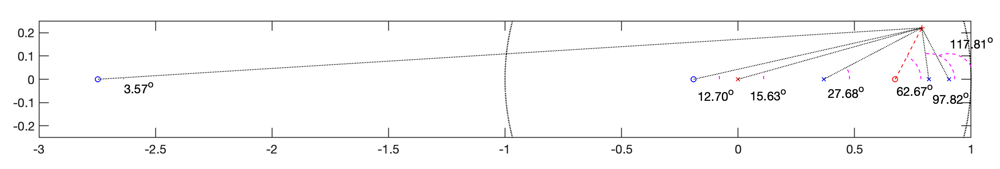
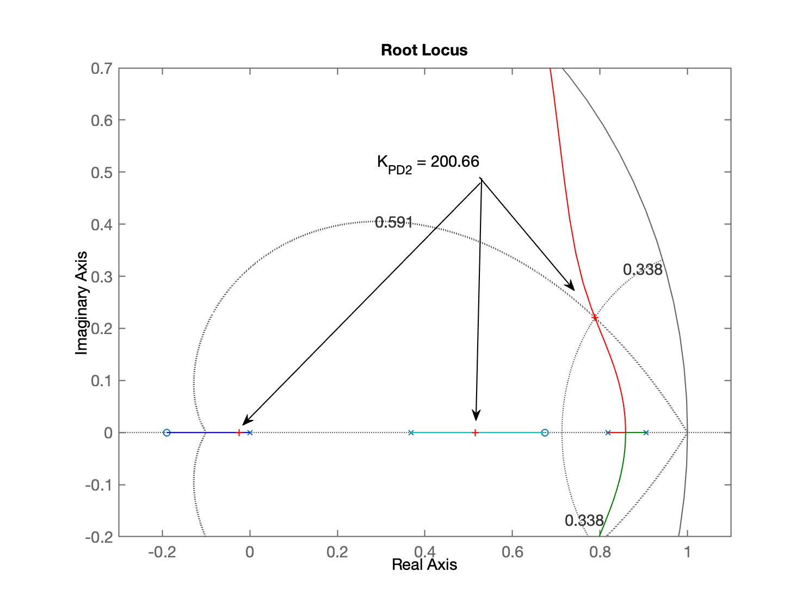
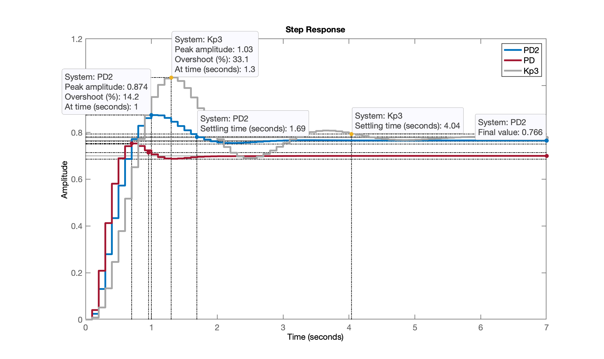
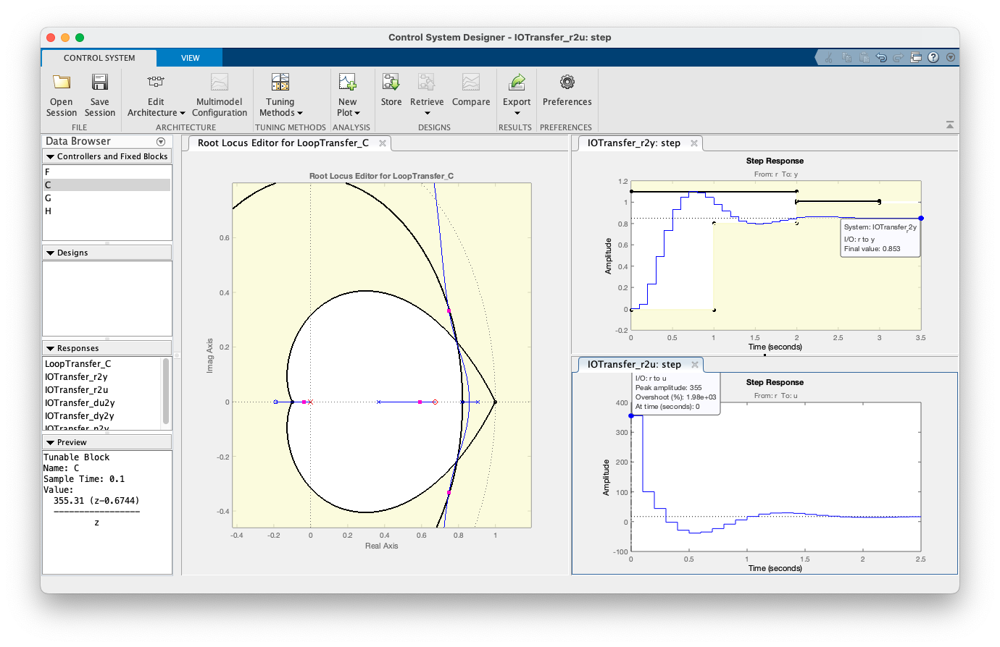
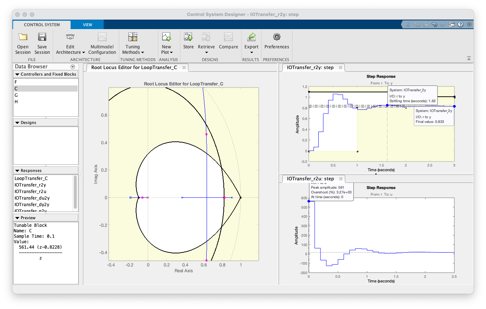

% Continuando...

% Voltando para a página https://fpassold.github.io/Controle_3/projeto_PD_lead_2020.html

% ## Projeto de PD usando Contrib angular

% Para realizar projeto deste tipo necessitamos mais
% requisitos de controle, no caso, além do $\%OS$ (que
% permitiu determinar o $\zeta$), necessitamos algum
% critério temporal: $t_s$, $t_r$ ou $t_p$.

% Vamos supor que desejamos:

% * $\%OS \le 10\%$;
% * $t_s \le 2$ segundos.

% Com estes 2 dados, temos como calcular a posição desejada
% para o par de pólos complexos que num sistema de 2a-ordem
% em malha-fechada permite atingir estes critérios.

angulos2
{'angulos2' is not found in the current folder or on the MATLAB
path, but exists in:
    /Volumes/DADOS/Users/fpassold/Documents/MATLAB

<a href = "matlab:matlab.internal.language.commandline.executeCode('cd ''/Volumes/DADOS/Users/fpassold/Documents/MATLAB''')">Change the MATLAB current folder</a> or <a href = "matlab:matlab.internal.language.commandline.executeCode('addpath ''/Volumes/DADOS/Users/fpassold/Documents/MATLAB''')">add its folder to the MATLAB
path</a>.} 

help angulos2
  programa para determinar contribui??o de ?ngulos
  Fernando Passold, em 16/out/2015
  Baseado em "example_9_4.m" de /UCV/Control/ (2009)
  PD or Lead Compensator Desing (NISE)
  
  Vari?veis que devem existir no Worspace
     (ou par?metros de entrada):
  'G' <-- G(s): eq. planta no mundo cont?nuo
  'T' <-- per?odo de amostragem ? ser adotado.
 
  Obs.: SCript vai pedir posi??o do p?lo do controlador
 
  Sa?das:
  real(polo_MFz) --> parte real do p?lo de MF no plano-z
  imag(polo_MFz) --> parte imagin?ria do p?lo de MF no plano-z
  C --> transfer function do controlador (sem o ganho)
  zc --> posi??o do zero encontrado para o controlador

edit angulos2.m

zpk(BoG)

ans =
 
  0.00012224 (z+2.747) (z+0.1903)
  --------------------------------
  (z-0.9048) (z-0.8187) (z-0.3679)
 
Sample time: 0.1 seconds
Discrete-time zero/pole/gain model.

angulos2
PD/Lead Controller Design
In this version you should arbitrate the initial position of the POLE of C(z)

Plant (in s-plan) informed, G(s):
ans =
 
          1
  ------------------
  (s+10) (s+2) (s+1)
 
Continuous-time zero/pole/gain model.

Sampling time informed: T=0.1
Plant in discrete form, BoG(z):
ans =
 
  0.00012224 (z+2.747) (z+0.1903)
  --------------------------------
  (z-0.9048) (z-0.8187) (z-0.3679)
 
Sample time: 0.1 seconds
Discrete-time zero/pole/gain model.

Maximum overshoot desired (%OS), in %: ? 10
zeta (damping factor) should be: 0.5912
Enter desired settling time, t_s: ? 2

It results in the natural oscillation frequency, wn =  3.3832 (rad/s)
The MF poles (in the s-plane) should be located in:
2.0000 +/- j2.7288
Localization of MF poles in the z-plane should be:
z = 0.7884 +/- j0.2206

Enter the position of the controller pole (z-plane): ? 0
Working with the temporary FTMA(z)...
Open poles = 0
Open poles = 0.904837
Open poles = 0.818731
Open poles = 0.367879
Open zeros = -2.74711
Open zeros = -0.190308
Angular contribution of each pole in the z-plane:
 p1 = 0.0000 --> 15.63^o
 p2 = 0.9048 --> 117.81^o
 p3 = 0.8187 --> 97.82^o
 p4 = 0.3679 --> 27.68^o
Sum of angular contribution of poles: 258.95^o
Check the figure window -> Paused (enter to continue)...
Angular contribution of each zero in the z-plane:
 z1 = -2.7471 --> 3.57^o
 z2 = -0.1903 --> 12.70^o
Sum of angular contribution of zeros: 16.28^o
Final angle for the zero of C(z): 62.6736^o

Ok, determining the position for zero of C (z)...
Final position for the Lead zero: z_c=0.6744
Updating final RL graph...
The Lead controller final result is (variable C):
ans =
 
  (z-0.6744)
  ----------
      z
 
Sample time: 0.1 seconds
Discrete-time zero/pole/gain model.

axis([-3 1 -0.25 0.25])

% 

axis([-0.3 1.1 -0.2 0.7])

zpk(C) % eq. do PD

ans =
 
  (z-0.6744)
  ----------
      z
 
Sample time: 0.1 seconds
Discrete-time zero/pole/gain model.

edit angulos2

zpk(ftma) % FTMA(z) com este PD

ans =
 
  0.00012224 (z+2.747) (z-0.6744) (z+0.1903)
  ------------------------------------------
      z (z-0.9048) (z-0.8187) (z-0.3679)
 
Sample time: 0.1 seconds
Discrete-time zero/pole/gain model.

C_PD2=C; % "backup"
ftma_PD2=ftma;

% sintonizando este PD

[K_PD2,polosMF]=rlocfind(ftma)
Select a point in the graphics window
selected_point =
      0.78759 +    0.22065i
K_PD2 =
       200.66
polosMF =
      0.78829 +    0.22098i
      0.78829 -    0.22098i
      0.51538 +          0i
    -0.025036 +          0i

% 

% Fechando a malha...

ftmf_PD2 = feedback(K_PD2*ftma_PD2, 1);
figure; step(ftmf_PD2, ftmf_PD, ftmf3)
legend('PD2', 'PD', 'Kp3')
[Warning: Error occurred while executing the listener callback for event
WindowMouseMotion defined for class matlab.ui.Figure:
Invalid or deleted object.
Error in
matlab.graphics.shape.internal.PointDataTipController.dragOrientation] 
[Warning: Error occurred while executing the listener callback for event
WindowMouseMotion defined for class matlab.ui.Figure:
Invalid or deleted object.
Error in
matlab.graphics.shape.internal.PointDataTipController.dragOrientation] 
[Warning: Error occurred while executing the listener callback for event
WindowMouseMotion defined for class matlab.ui.Figure:
Invalid or deleted object.
Error in
matlab.graphics.shape.internal.PointDataTipController.dragOrientation] 
[Warning: Error occurred while executing the listener callback for event
WindowMouseMotion defined for class matlab.ui.Figure:
Invalid or deleted object.
Error in
matlab.graphics.shape.internal.PointDataTipController.dragOrientation] 
[Warning: Error occurred while executing the listener callback for event
WindowMouseMotion defined for class matlab.ui.Figure:
Invalid or deleted object.
Error in
matlab.graphics.shape.internal.PointDataTipController.dragOrientation] 
[Warning: Error occurred while executing the listener callback for event
WindowMouseMotion defined for class matlab.ui.Figure:
Invalid or deleted object.
Error in
matlab.graphics.shape.internal.PointDataTipController.dragOrientation] 
[Warning: Error occurred while executing the listener callback for event
WindowMouseMotion defined for class matlab.ui.Figure:
Invalid or deleted object.
Error in
matlab.graphics.shape.internal.PointDataTipController.dragOrientation] 
[Warning: Error occurred while executing the listener callback for event
WindowMouseMotion defined for class matlab.ui.Figure:
Invalid or deleted object.
Error in
matlab.graphics.shape.internal.PointDataTipController.dragOrientation] 
[Warning: Error occurred while executing the listener callback for event
WindowMouseMotion defined for class matlab.ui.Figure:
Invalid or deleted object.
Error in
matlab.graphics.shape.internal.PointDataTipController.dragOrientation] 
[Warning: Error occurred while executing the listener callback for event
WindowMouseMotion defined for class matlab.ui.Figure:
Invalid or deleted object.
Error in
matlab.graphics.shape.internal.PointDataTipController.dragOrientation] 
[Warning: Error occurred while executing the listener callback for event
WindowMouseMotion defined for class matlab.ui.Figure:
Invalid or deleted object.
Error in
matlab.graphics.shape.internal.PointDataTipController.dragOrientation] 
[Warning: Error occurred while executing the listener callback for event
WindowMouseMotion defined for class matlab.ui.Figure:
Invalid or deleted object.
Error in
matlab.graphics.shape.internal.PointDataTipController.dragOrientation] 
[Warning: Error occurred while executing the listener callback for event
WindowMouseMotion defined for class matlab.ui.Figure:
Invalid or deleted object.
Error in
matlab.graphics.shape.internal.PointDataTipController.dragOrientation] 
[Warning: Error occurred while executing the listener callback for event
WindowMouseMotion defined for class matlab.ui.Figure:
Invalid or deleted object.
Error in
matlab.graphics.shape.internal.PointDataTipController.dragOrientation] 
[Warning: Error occurred while executing the listener callback for event
WindowMouseMotion defined for class matlab.ui.Figure:
Invalid or deleted object.
Error in
matlab.graphics.shape.internal.PointDataTipController.dragOrientation] 
[Warning: Error occurred while executing the listener callback for event
WindowMouseMotion defined for class matlab.ui.Figure:
Invalid or deleted object.
Error in
matlab.graphics.shape.internal.PointDataTipController.dragOrientation] 
[Warning: Error occurred while executing the listener callback for event
WindowMouseMotion defined for class matlab.ui.Figure:
Invalid or deleted object.
Error in
matlab.graphics.shape.internal.PointDataTipController.dragOrientation] 
[Warning: Error occurred while executing the listener callback for event
WindowMouseMotion defined for class matlab.ui.Figure:
Invalid or deleted object.
Error in
matlab.graphics.shape.internal.PointDataTipController.dragOrientation] 
[Warning: Error occurred while executing the listener callback for event
WindowMouseMotion defined for class matlab.ui.Figure:
Invalid or deleted object.
Error in
matlab.graphics.shape.internal.PointDataTipController.dragOrientation] 
[Warning: Error occurred while executing the listener callback for event
WindowMouseMotion defined for class matlab.ui.Figure:
Invalid or deleted object.
Error in
matlab.graphics.shape.internal.PointDataTipController.dragOrientation] 

% 

[Warning: Error occurred while executing the listener callback for event
WindowMouseMotion defined for class matlab.ui.Figure:
Invalid or deleted object.
Error in
matlab.graphics.shape.internal.PointDataTipController.dragOrientation] 
[Warning: Error occurred while executing the listener callback for event
WindowMouseMotion defined for class matlab.ui.Figure:
Invalid or deleted object.
Error in
matlab.graphics.shape.internal.PointDataTipController.dragOrientation] 
[Warning: Error occurred while executing the listener callback for event
WindowMouseMotion defined for class matlab.ui.Figure:
Invalid or deleted object.
Error in
matlab.graphics.shape.internal.PointDataTipController.dragOrientation] 
[Warning: Error occurred while executing the listener callback for event
WindowMouseMotion defined for class matlab.ui.Figure:
Invalid or deleted object.
Error in
matlab.graphics.shape.internal.PointDataTipController.dragOrientation] 
[Warning: Error occurred while executing the listener callback for event
WindowMouseMotion defined for class matlab.ui.Figure:
Invalid or deleted object.
Error in
matlab.graphics.shape.internal.PointDataTipController.dragOrientation] 
[Warning: Error occurred while executing the listener callback for event
WindowMouseMotion defined for class matlab.ui.Figure:
Invalid or deleted object.
Error in
matlab.graphics.shape.internal.PointDataTipController.dragOrientation] 
[Warning: Error occurred while executing the listener callback for event
WindowMouseMotion defined for class matlab.ui.Figure:
Invalid or deleted object.
Error in
matlab.graphics.shape.internal.PointDataTipController.dragOrientation] 
[Warning: Error occurred while executing the listener callback for event
WindowMouseMotion defined for class matlab.ui.Figure:
Invalid or deleted object.
Error in
matlab.graphics.shape.internal.PointDataTipController.dragOrientation] 
[Warning: Error occurred while executing the listener callback for event
WindowMouseMotion defined for class matlab.ui.Figure:
Invalid or deleted object.
Error in
matlab.graphics.shape.internal.PointDataTipController.dragOrientation] 
[Warning: Error occurred while executing the listener callback for event
WindowMouseMotion defined for class matlab.ui.Figure:
Invalid or deleted object.
Error in
matlab.graphics.shape.internal.PointDataTipController.dragOrientation] 
[Warning: Error occurred while executing the listener callback for event
WindowMouseMotion defined for class matlab.ui.Figure:
Invalid or deleted object.
Error in
matlab.graphics.shape.internal.PointDataTipController.dragOrientation] 
[Warning: Error occurred while executing the listener callback for event
WindowMouseMotion defined for class matlab.ui.Figure:
Invalid or deleted object.
Error in
matlab.graphics.shape.internal.PointDataTipController.dragOrientation] 
[Warning: Error occurred while executing the listener callback for event
WindowMouseMotion defined for class matlab.ui.Figure:
Invalid or deleted object.
Error in
matlab.graphics.shape.internal.PointDataTipController.dragOrientation] 
[Warning: Error occurred while executing the listener callback for event
WindowMouseMotion defined for class matlab.ui.Figure:
Invalid or deleted object.
Error in
matlab.graphics.shape.internal.PointDataTipController.dragOrientation] 
[Warning: Error occurred while executing the listener callback for event
WindowMouseMotion defined for class matlab.ui.Figure:
Invalid or deleted object.
Error in
matlab.graphics.shape.internal.PointDataTipController.dragOrientation] 
[Warning: Error occurred while executing the listener callback for event
WindowMouseMotion defined for class matlab.ui.Figure:
Invalid or deleted object.
Error in
matlab.graphics.shape.internal.PointDataTipController.dragOrientation] 
[Warning: Error occurred while executing the listener callback for event
WindowMouseMotion defined for class matlab.ui.Figure:
Invalid or deleted object.
Error in
matlab.graphics.shape.internal.PointDataTipController.dragOrientation] 
[Warning: Error occurred while executing the listener callback for event
WindowMouseMotion defined for class matlab.ui.Figure:
Invalid or deleted object.
Error in
matlab.graphics.shape.internal.PointDataTipController.dragOrientation] 
[Warning: Error occurred while executing the listener callback for event
WindowMouseMotion defined for class matlab.ui.Figure:
Invalid or deleted object.
Error in
matlab.graphics.shape.internal.PointDataTipController.dragOrientation] 

% Outra opção para projeto do PD é usar o App Control
% System Designer

% ## Controlador PD - versão 3

% Partindo da eq. do último PD

zpk(PD2)
{Unrecognized function or variable 'PD2'.} 
zpk(C_PD2)

ans =
 
  (z-0.6744)
  ----------
      z
 
Sample time: 0.1 seconds
Discrete-time zero/pole/gain model.

K_PD2
K_PD2 =
       200.66

% Projeto salvo no arquivo: ControlSystemDesignerSession-PD3.mat

% 

% Novo projeto de PD3 colocando propositalmente o zero do PD
% sobre o 2o-pólo mais lento da planta. Isto vai acabar
% resultando no controlador mais rápido possível de ser
% adotado para a planta em questão. Mas... note que o ganho
% deste controlador é ainda mais elevado: $K=561,44$ o que
% significa amplitudes iniciais para a ação de controle
% bastante expressivas (ou impraticável na prática).
% Este projeto foi salvo no arquivo: [ControlSystemDesignerSession-PD3b.mat](ControlSystemDesignerSession-PD3b.mat)
% Segue figura do projeto:

% 

% Fim

% ---

% Salvando dados para próxima seção de trabalho:

save planta
diary off
