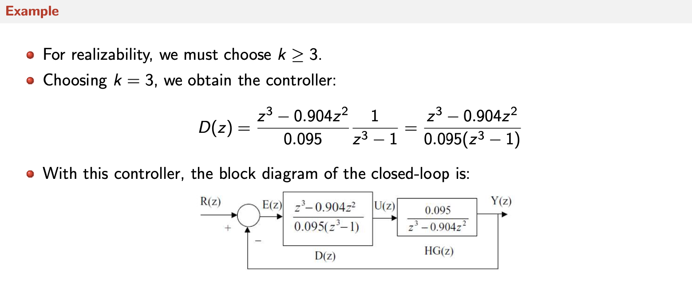
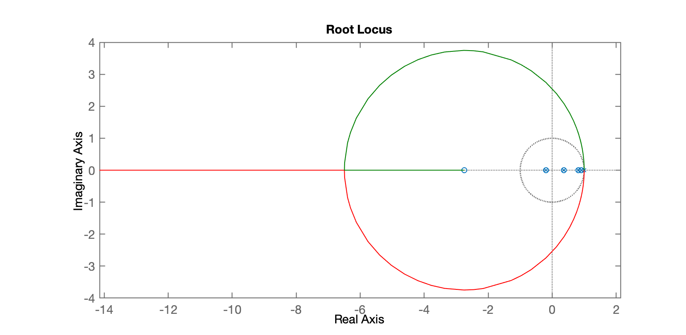
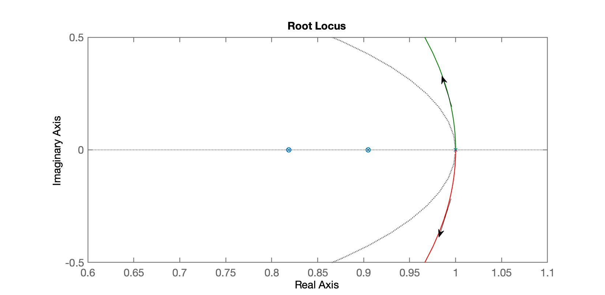
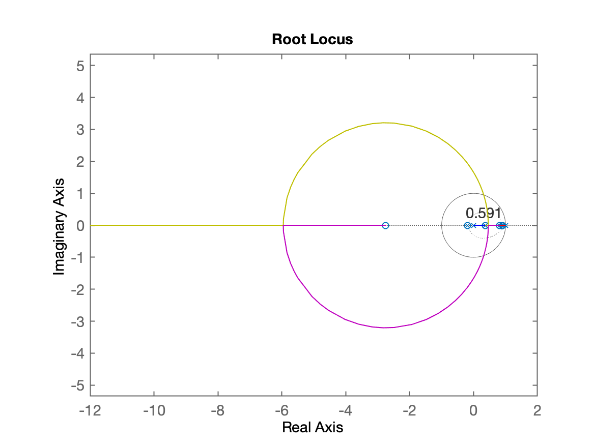
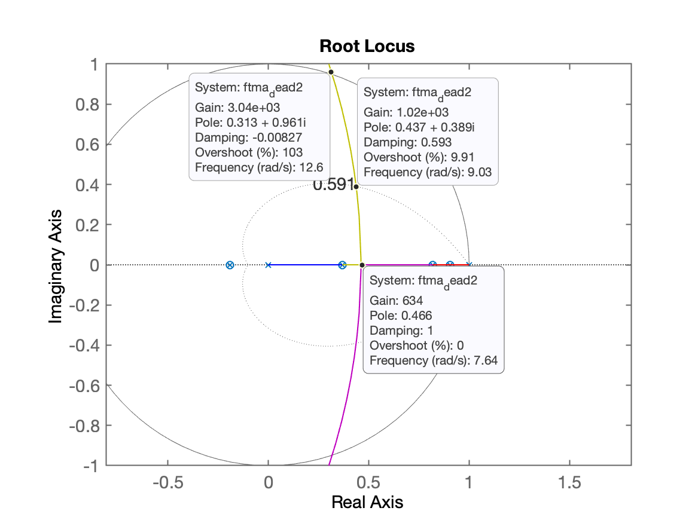
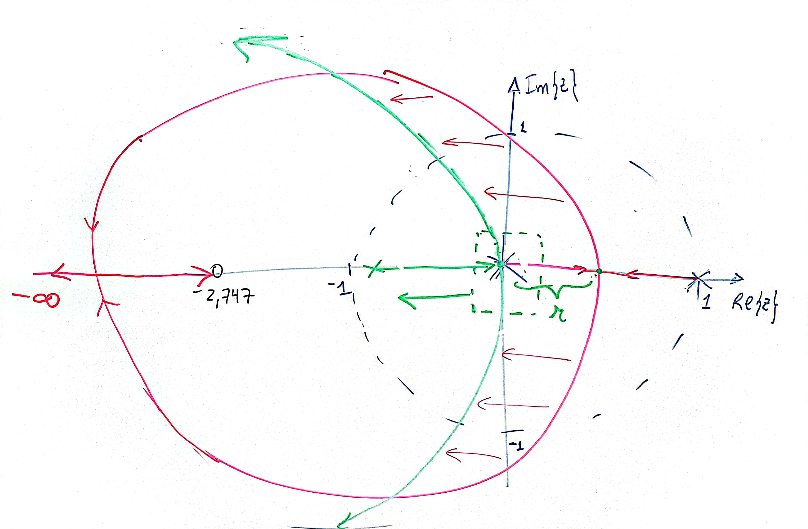

<font size="1">[Digital Control, CSE421, Lecture: 10: Discrete Controller Design (Deadbeat & Dahlin Controllers), Prof. Dr.Ing. Mohammed Nour A. Ahmed, Zagazig University, Egypt.](https://mnourgwad.github.io/CSE421/lectures/CSE421DigitalControlL10.pdf)</font>

# Controlador Deadbea$_s$t

Aula de 17/04/2024 [:musical_note:](https://open.spotify.com/intl-pt/track/1vMPOXedoeZCtHzBB2Vart)

Aplicando à planta do estudo de caso:

```matlab
>> load planta
>> zpk(BoG)
 
  0.00012224 (z+2.747) (z+0.1903)
  --------------------------------
  (z-0.9048) (z-0.8187) (z-0.3679)
 
Sample time: 0.1 seconds
Discrete-time zero/pole/gain model.

```

A equação do controlador deveria ser:

$C(z)=\dfrac{K(z-0.9048) (z-0.8187) (z-0.3679)}{(z+0.1903)(z-p_1)(z-p_2)}$

Lembrando que não posso incluir na equação raizes instáveis (então o zero da planta em $z=-2.747$ não pode ser incluído na eq. do controlador).

## Controlador Deadbeat #1

Supondo que os 2 pólos fossem em $z=1$ (integrador duplo):

```matlab
>> polos_BoG=pole(BoG)
polos_BoG =
      0.90484
      0.81873
      0.36788
>> zero_BoG=zero(BoG)
zero_BoG =
      -2.7471
     -0.19031
>> C_dead1=tf(poly(polos_BoG), poly([zero_BoG(2) 1 1]), T);
>> zpk(C_dead1)

ans =
 
  (z-0.9048) (z-0.8187) (z-0.3679)
  --------------------------------
         (z-1)^2 (z+0.1903)
 
Sample time: 0.1 seconds
Discrete-time zero/pole/gain model.

>> ftma_dead1=C_dead1*BoG;     
>> zpk(ftma_dead1)
 
  0.00012224 (z+2.747) (z-0.9048) (z-0.8187) (z-0.3679) (z+0.1903)
  ----------------------------------------------------------------
        (z+0.1903) (z-0.3679) (z-0.8187) (z-0.9048) (z-1)^2
 
Sample time: 0.1 seconds
Discrete-time zero/pole/gain model.

>> minreal(ftma_dead1)
 
  0.0001222 z + 0.0003358
  -----------------------
       z^2 - 2 z + 1
 
Sample time: 0.1 seconds
Discrete-time transfer function.

>> zpk(minreal(ftma_dead1))
 
  0.00012224 (z+2.747)
  --------------------
        (z-1)^2
 
Sample time: 0.1 seconds
Discrete-time zero/pole/gain model.

>> rlocus(ftma_dead1)
>> axis equal
```

O obtivemos o seguinte RL:



Um "zoom" revela:



E então percebemos que por menor que seja o ganho do controlador, teremos pólos de MF instáveis.

## Controlador Deadbeat #2

Voltando a eq. do controlador, percebemos que um dos polos "extras" pode ser mantido em $z=1$ (integrador), mas o outro pólo, $p_2$ deve mudar de local. Se $p_2$ for "enviado" para a origem, teremos:

```matlab
>> C_dead2=tf(poly(polos_BoG), poly([zero_BoG(2) 1 0]), T);
>> zpk(C_dead2)
 
  (z-0.9048) (z-0.8187) (z-0.3679)
  --------------------------------
         z (z-1) (z+0.1903)
 
Sample time: 0.1 seconds
Discrete-time zero/pole/gain model.
>> ftma_dead2=C_dead2*BoG;
>> zpk(minreal(ftma_dead2))
 
  0.00012224 (z+2.747)
  --------------------
        z (z-1)
 
Sample time: 0.1 seconds
Discrete-time zero/pole/gain model.

>> figure; rlocus(ftma_dead2)
>> hold on;
>> zgrid(zeta,0)
```

RL sem "zoom":



Um zoom na região de interesse revela:



Notamos alguns detalhes:

1. Poderíamos definir o ganho deste controlador em $K=1020$, para obter uma resposta sub-amortecida com $\%OS \approx 9,82\%$, mas note que estes pólos de MF estão relativamente afastados da origem do plano-z, o que não nos garante resposta num tempo mínimo.
2. Note que neste sistema, ficamos com 2 pólos de MA: um em $z=0$ e outro em $z=1$ e um zero de MA em $z=-2747$. O traçado do RL parte dos pólos de MA e à medida que o ganho aumenta, chegamos num ponto ($K \approx 634$) em que temos o **ponto de partida no plano-z** aproximadamente na posição $z=0,461$. Como neste ponto ainda temos pólos de MF apenas com parte real (sem parte imaginária), teríamos uma **resposta super-amortecida (sem *overshoot*)**, mas também ainda estaríamos relativamente afastados da origem do plano-z (não garantindo a resposta no tempo mínimo).
3. Mas o que aconteceria, se o segundo pólo, $p_2$ ao invés de ser alocado em $z=0$ fosse alocado na parte "negativa" do plano-z (mas ainda dentro do círculo unitário; ainda estável)? A figura abaixo, esboça o que se pretende neste caso:



A idéia então é definir um local para o pólo $p_2$ de tal forma, a que o ponto de partida do RL ocorra justamente sobre a origem do plano-z, o que nos garante então a resposta no menor tempo possível para este sistema.

## Controlador Deadbeat #3

Usando o App Control System Designer para isto:

Continuando na próxima aula...

Arquivo <[planta.mat](planta.mat)>

---

Fernando Passold, em 17/04/2024

