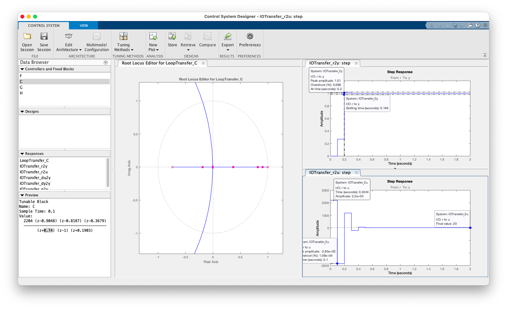

# Projeto Controladores

Continuação da [aula de 17/04/2024](aula_17042024.html):

## Controlador DeadBeat #3

```matlab
>> load planta
>> zpk(C_dead2)

ans =
 
  (z-0.9048) (z-0.8187) (z-0.3679)
  --------------------------------
         z (z-1) (z+0.1903)
 
Sample time: 0.1 seconds
Discrete-time zero/pole/gain model.

>> 
```

Abrindo a planta e este controlador no App Control System Designer:



Chegamos à equação do controlador como sendo:

$C_{Dead_3}=\dfrac{2204 (z-0.9048) (z-0.8187) (z-0.3679)}{(z+0.74) (z-1) (z+0.1903)}$

em comparação com o $C_{Dead_2}$, deslocamos o pólo (do controlador) que antes estava em $z=0$ (na origem) e o  "arrastamos" até a posição $z=-0,74$.

Projeto salvo como: [ControlSystemDesigner-Dead3.mat](ControlSystemDesigner-Dead3.mat).

---

Continuando com:

* Teoria de [controlador PID Digital](https://fpassold.github.io/Lab_Controle_2/PID/pid.html)


---

Fernando Passold, em 24/04/2024

