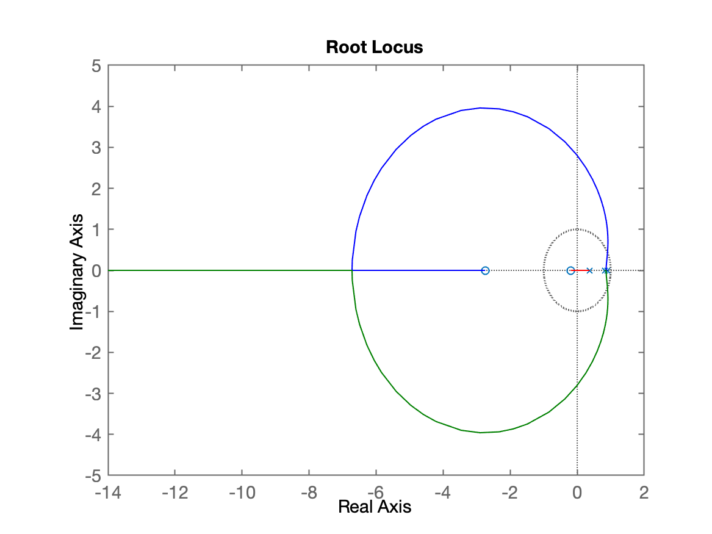
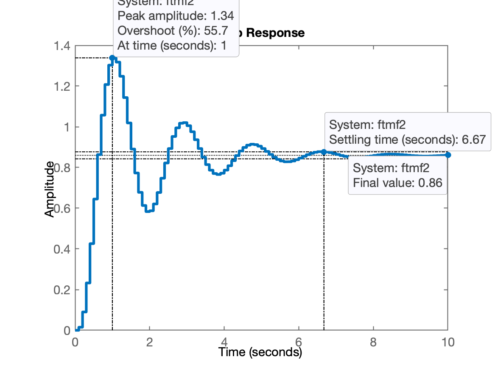
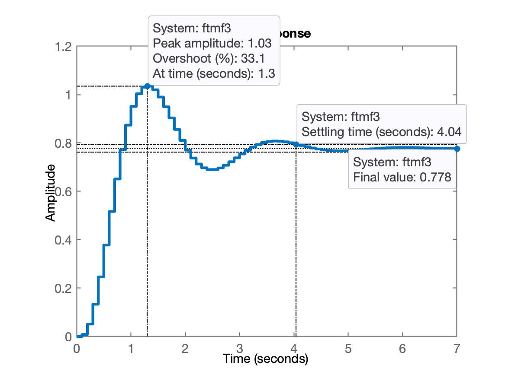
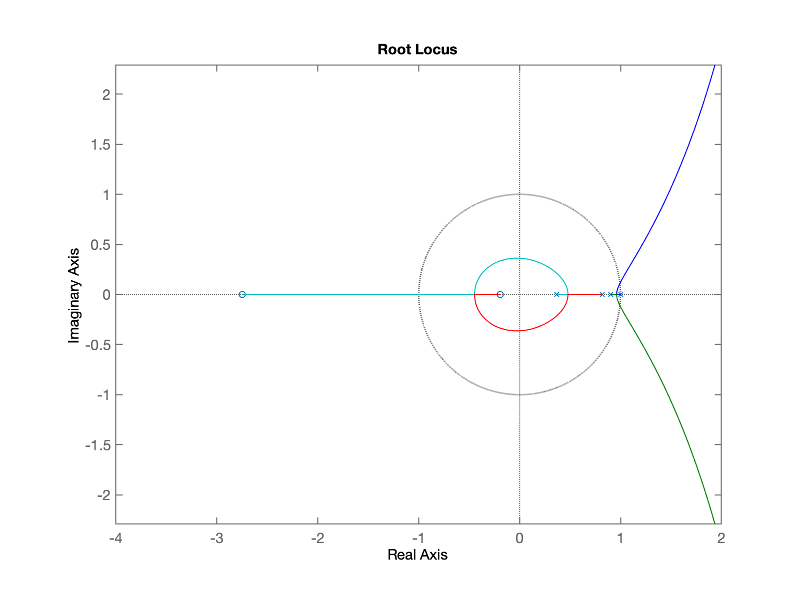

# Projeto de Controladores (Digitais)

Aula de 27/03/204

Seja a seguinte planta:

$G(s)=\dfrac{1}{(s+1)(s+2)(s+10)}$

Vamos amostrar esta planta à $T=0,1$ segundos.

Calculando $BoG(z)$:

```matlab
>> G=tf(1,poly([-1 -2 -10]));
>> zpk(G) 
 
          1
  ------------------
  (s+10) (s+2) (s+1)
 
Continuous-time zero/pole/gain model.

>> T=0.1;
>> BoG=c2d(G, T);
>> zpk(BoG)
 
  0.00012224 (z+2.747) (z+0.1903)
  --------------------------------
  (z-0.9048) (z-0.8187) (z-0.3679)
 
Sample time: 0.1 seconds
Discrete-time zero/pole/gain model.

```

## 1. Controlador Proporcional

Suponha que o requisito de controle seja $\%OS \le 10\%$.

```matlab
>> OS=10;
>> zeta=(-log(OS/100))/(sqrt(pi^2+(log(OS/100)^2)))
zeta =
      0.59116
>> % Traçando o RL
>> rlocus(BoG)
```



```matlab
>> hold on; zgrid(zeta,0)
>> axis([0.2 1.2 -0.3 0.7])
>> [K, polosMF] = rlocfind(BoG)
Select a point in the graphics window
selected_point =
       0.8718 +    0.14427i
K =
       25.132
polosMF =
      0.87003 +    0.14445i
      0.87003 -    0.14445i
      0.34831 +          0i
>> K=25;
```


```matlab
>> ftmf=feedback(K*BoG,1);
>> pole(ftmf)
ans =
      0.86999 +    0.14405i
      0.86999 -    0.14405i
      0.34841 +          0i
>> figure; step(1*ftmf)
```


```matlab
>> stepinfo(ftmf)
        RiseTime: 0.9
    SettlingTime: 3
     SettlingMin: 0.51537
     SettlingMax: 0.60442
       Overshoot: 8.7957
      Undershoot: 0
            Peak: 0.60442
        PeakTime: 2
```

**Comentários**: Nota-se que o sistema converge com erro:

```matlab
>> dcgain(ftmf)
ans =
      0.55556
>> erro=((1-dcgain(ftmf))/1)*100
erro =
       44.444
```

**Comentários**: note que a referência era um degrau unitário, isto é, a saída deveria ter convergido para $y[\infty]=1$. Isto significa que posso aumentar o ganho.

Considerando que $y[\infty]\vert_{desejado}=1$, e que se tolera um $\%OS \le 10\%$, temos então que $y_{max}=1,1$.

Do RL anterior, percebemos entretanto que: $K_{max} \le 245$.

Para Controladores Proporcionais Industrias, é usual fixar o ganho como $K=50\%$ de $K_{max}$. Se fizermos isto, nossa planta vai reagir da seguinte forma:

```matlab
>> K2=245/2
K2 =
        122.5
>> ftmf2=feedback(K2*BoG,1);
>> figure; step(ftmf2)
>> stepinfo(ftmf2)
        RiseTime: 0.4
    SettlingTime: 6.7
     SettlingMin: 0.58335
     SettlingMax: 1.3387
       Overshoot: 55.731
      Undershoot: 0
            Peak: 1.3387
        PeakTime: 1
```



**Comentários**: desta vez, $y(t_p)=1,3387$, isto significa um overshoot de 33,87%. Mas... percebemos que o tempo de assentamento "aumentou" para $t_s=6,7$ segundos.

Para manter o overshoot em 10% teríamos que trabalhar com um ganho: $25 < K < 122,5$. 

Determinando um valor intermediário:

```matlab
>> K=(122.5+25)/2
K =
        73.75
>> K3=70;
>> ftmf3=feedback(K3*BoG,1);
>> figure; step(ftmf3)
>> stepinfo(ftmf3)
        RiseTime: 0.5
    SettlingTime: 4.1
     SettlingMin: 0.69
     SettlingMax: 1.0349
       Overshoot: 33.064
      Undershoot: 0
            Peak: 1.0349
        PeakTime: 1.3
```



Desta vez, em relação à referência, o overshoot ficou em 3%. Isto significa que poderia talvez ter sido feito $K3=75$.

O erro neste caso ficou:

```matlab
>> erro=((1-dcgain(ftmf3))/1)*100
>> erro =
       22.222
```

Usando o "**App Control Systems Designer**"...


### Outra opção Projeto Controlador Proporcional

O ganho de um controlador Proporcional poderia ainda ser definido em função do erro máximo permitido em regime permanente.

Para tanto, ver: https://fpassold.github.io/Controle_3/Controle3_2021_2/aula_1.html, que mostra como usar a Teoria do Erro, para determinar o valor do ganho em função do erro desejado.

## 2. Controlador Integrador Puro

Equação do controlador:

$C(z)=\dfrac{K_i}{z-1}$

O pólo deste controlador fica localzado em $z=1$ (é o próprio integrador).

```matlab
>> C_I=tf(1,[1 -1])

C_I =
 
    1
  -----
  s - 1
 
Continuous-time transfer function.

>> % Ops... ingressado TF no plano-s (mundo contínuo)
>> C_I=tf(1,[1 -1], T)

C_I =
 
    1
  -----
  z - 1
 
Sample time: 0.1 seconds
Discrete-time transfer function.

>> ftma_I=C_I*BoG;
>> zpk(ftma_I)
 
     0.00012224 (z+2.747) (z+0.1903)
  --------------------------------------
  (z-1) (z-0.9048) (z-0.8187) (z-0.3679)
 
Sample time: 0.1 seconds
Discrete-time zero/pole/gain model.

>> figure; rlocus(ftma_I)
>> axis equal
>> axis([-4 2 -1.5 1.5])
>> axis equal
```



Sintonizando controlador, fazendo zoom na região de interesse...

```matlab
>> axis([0.7 1.05 -0.05 0.2])
>> hold on; zgrid(zeta,0)
>> [K_I, polosMF] = rlocfind(ftma_I)
Select a point in the graphics window
selected_point =
      0.96717 +   0.042477i
K_I =
      0.71425
polosMF =
      0.96665 +   0.042613i
      0.96665 -   0.042613i
      0.78926 +          0i
      0.36888 +          0i
```


```matlab
>> ftmf_I=feedback(K_I*ftma_I,1);
>> figure; step(ftmf_I)
>> stepinfo(ftmf_I)
        RiseTime: 3.5
    SettlingTime: 11.5
     SettlingMin: 0.90263
     SettlingMax: 1.0923
       Overshoot: 9.2258
      Undershoot: 0
            Peak: 1.0923
        PeakTime: 7.8
```


**Comentário**: o erro foi anulado (como esperado), mas... o $t_s$ aumentou consideravelmente.

Uma solução é acrescentar ação Proporcional.

## 3. Controlador PI

Equação do controlador PI:

$C_{PI}(z)=K_p+\dfrac{K_i}{z-1}$

$C_{PI}(z)=\dfrac{K_p\,z -K_p +K_i}{z-1}$ 

$C_{PI}(z)=\dfrac{K_p\,z -K_p +K_i}{z-1}\cdot \dfrac{1/K_p}{1/K_p}$

$C_{PI}(z)=\dfrac{K_p\left[ z + \dfrac{K_i-K_p}{K_p}\right]}{z-1}$

ou simplesmente:

$C_{PI}(z)=\dfrac{K(z+z_{PI})}{z-1}$

Temos uma incógnita à ser determinada: a posição do zero do controlador, $Z_{PI}$.

Ver: https://fpassold.github.io/Controle_3/Controle3_2021_2/aula_1.html, parte do "Controlador PI (P + I)"...

```matlab
>> % Lembrando dos pólos e zeros de MA de BOG(z)
>> zpk(BoG)
 
  0.00012224 (z+2.747) (z+0.1903)
  --------------------------------
  (z-0.9048) (z-0.8187) (z-0.3679)
 
Sample time: 0.1 seconds
Discrete-time zero/pole/gain model.
```

Próxima aula: usaremos o Control System Designer para testar as opções "b" e "d" do PI que aparece em https://fpassold.github.io/Controle_3/Controle3_2021_2/aula_1.html.

Finalizando a seção de trabalho...

```matlab
>> save planta
>> diary off
>> quit
```

---

Fernando Passold, em 27/03/2024.
